# Blog Redactor SEO — Architecture & Flow Diagrams

> Vue d'ensemble des flux, composants, stores et données du projet.
> Dernière mise à jour : 2026-04-24

---

## Table des matières

1. [Vue d'ensemble de l'architecture](#1-vue-densemble-de-larchitecture)
2. [Navigation & Routes](#2-navigation--routes)
3. [Stores & Stockage de données](#3-stores--stockage-de-données)
4. [Workflow Editorial Global](#4-workflow-editorial-global)
5. [Workflow Brain-First (Stratégie)](#5-workflow-brain-first-stratégie)
6. [Workflow Moteur (Keywords)](#6-workflow-moteur-keywords)
7. [Workflow Article (Rédaction)](#7-workflow-article-rédaction)
8. [SEO Scoring en temps réel](#8-seo-scoring-en-temps-réel)
9. [Keyword Matching (NLP Français)](#9-keyword-matching-nlp-français)
10. [Streaming & Génération IA](#10-streaming--génération-ia)
11. [Linking Interne](#11-linking-interne)
12. [Cache multi-niveau](#12-cache-multi-niveau)
13. [Hiérarchie des composants](#13-hiérarchie-des-composants)
14. [Référence des Inputs/Outputs](#14-référence-des-inputsoutputs)

---

## 1. Vue d'ensemble de l'architecture

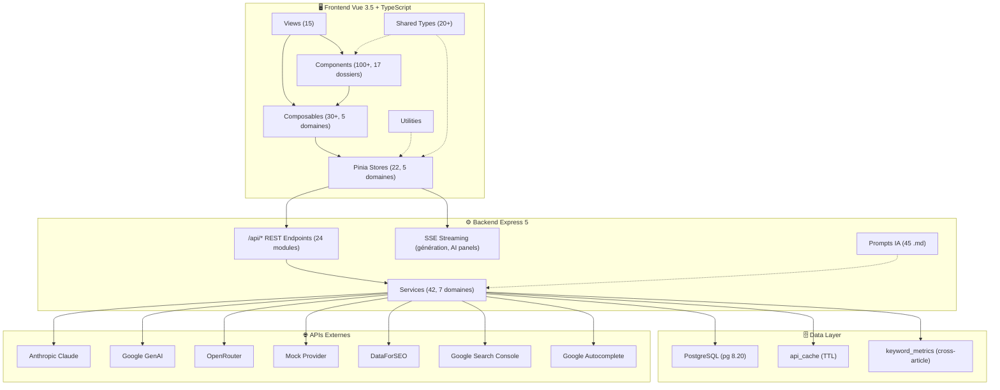
```mermaid
graph TB
    subgraph Frontend["🖥️ Frontend Vue 3.5 + TypeScript"]
        direction TB
        Views["Views (15)"]
        Components["Components (100+, 17 dossiers)"]
        Composables["Composables (30+, 5 domaines)"]
        Stores["Pinia Stores (22, 5 domaines)"]
        Utils["Utilities"]
        Types["Shared Types (20+)"]
    end

    subgraph Backend["⚙️ Backend Express 5"]
        REST["/api/* REST Endpoints (24 modules)"]
        SSE["SSE Streaming (génération, AI panels)"]
        Services["Services (42, 7 domaines)"]
        Prompts["Prompts IA (45 .md)"]
    end

    subgraph DataLayer["🗄️ Data Layer"]
        PG["PostgreSQL (pg 8.20)"]
        ApiCache["api_cache (TTL)"]
        KwMetrics["keyword_metrics (cross-article)"]
    end

    subgraph External["🌐 APIs Externes"]
        Claude["Anthropic Claude"]
        Gemini["Google GenAI"]
        OpenRouter["OpenRouter"]
        Mock["Mock Provider"]
        DFSEO["DataForSEO"]
        GSC["Google Search Console"]
        Autocomplete["Google Autocomplete"]
    end

    Views --> Components
    Views --> Composables
    Composables --> Stores
    Components --> Composables
    Stores --> REST
    Stores --> SSE
    REST --> Services
    Services --> PG
    Services --> ApiCache
    Services --> KwMetrics
    Services --> Claude
    Services --> Gemini
    Services --> OpenRouter
    Services --> Mock
    Services --> DFSEO
    Services --> GSC
    Services --> Autocomplete
    Utils -.-> Stores
    Types -.-> Stores
    Types -.-> Components
    Prompts -.-> Services
```

### Stack technique

| Couche | Technologie |
|--------|-------------|
| Framework | Vue 3.5 (Composition API) |
| State | Pinia 3 |
| Router | Vue Router 5 |
| Éditeur | TipTap 3 (core + starter-kit + link + placeholder + vue-3) |
| Streaming | Server-Sent Events (SSE) |
| NLP | Matching français custom (suffixes) + HuggingFace Transformers |
| API | REST + SSE vers backend Express 5 |
| DB | PostgreSQL (pg 8.20) |
| Validation | Zod 4 (schemas partagés `shared/schemas/`) |
| IA | Anthropic Claude, Google GenAI (Gemini), OpenRouter, Mock |
| Données SEO | DataForSEO, Google Search Console, Autocomplete |
| Tests | Vitest 4 (unit) + Playwright (browser) |
| Qualité | oxlint + eslint + prettier + knip + madge + husky + lint-staged |

---

## 2. Navigation & Routes

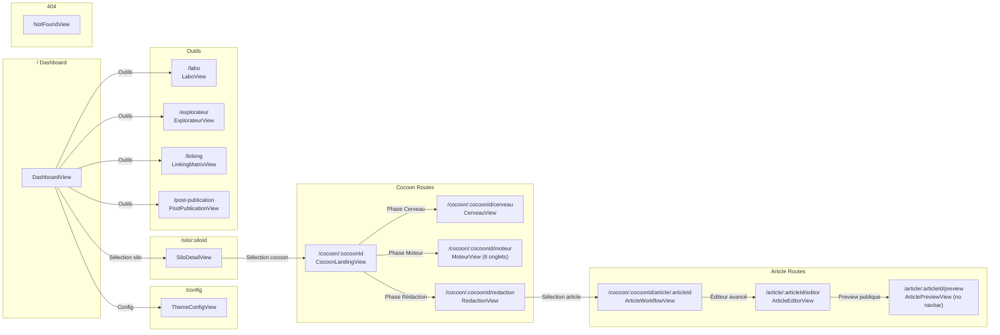
```mermaid
graph LR
    subgraph Dashboard["/ Dashboard"]
        D[DashboardView]
    end

    subgraph Config["/config"]
        TC[ThemeConfigView]
    end

    subgraph SiloSub["/silo/:siloId"]
        SD[SiloDetailView]
    end

    subgraph Cocoon["Cocoon Routes"]
        CL["/cocoon/:cocoonId<br>CocoonLandingView"]
        CV["/cocoon/:cocoonId/cerveau<br>CerveauView"]
        MV["/cocoon/:cocoonId/moteur<br>MoteurView (6 onglets)"]
        RV["/cocoon/:cocoonId/redaction<br>RedactionView"]
    end

    subgraph Article["Article Routes"]
        AW["/cocoon/:cocoonId/article/:articleId<br>ArticleWorkflowView"]
        AE["/article/:articleId/editor<br>ArticleEditorView"]
        AP["/article/:articleId/preview<br>ArticlePreviewView (no navbar)"]
    end

    subgraph Tools["Outils"]
        LB["/labo<br>LaboView"]
        EX["/explorateur<br>ExplorateurView"]
        LK["/linking<br>LinkingMatrixView"]
        PP["/post-publication<br>PostPublicationView"]
    end

    subgraph Catch["404"]
        NF["NotFoundView"]
    end

    D -->|"Sélection silo"| SD
    D -->|"Config"| TC
    SD -->|"Sélection cocoon"| CL
    CL -->|"Phase Cerveau"| CV
    CL -->|"Phase Moteur"| MV
    CL -->|"Phase Rédaction"| RV
    RV -->|"Sélection article"| AW
    AW -->|"Éditeur avancé"| AE
    AE -->|"Preview publique"| AP
    D -->|"Outils"| LB
    D -->|"Outils"| EX
    D -->|"Outils"| LK
    D -->|"Outils"| PP
```

### Détail des 14 routes (+ redirects legacy + 404)

| Route | Vue | Store principal | Rôle |
|-------|-----|-----------------|------|
| `/` | DashboardView (eager) | silos (strategy/) | Tableau de bord |
| `/config` | ThemeConfigView | theme-config (strategy/) | Configuration thème |
| `/silo/:siloId` | SiloDetailView | silos (strategy/) | Détail silo |
| `/cocoon/:cocoonId` | CocoonLandingView | cocoons (strategy/) | Landing cocon |
| `/cocoon/:cocoonId/cerveau` | CerveauView | cocoon-strategy, strategy (strategy/) | Stratégie Brain-First |
| `/cocoon/:cocoonId/moteur` | MoteurView | keyword-discovery, moteur-basket (article/), intent (keyword/) | Moteur mots-clés 6 onglets |
| `/cocoon/:cocoonId/redaction` | RedactionView | articles (article/) | Liste & création articles |
| `/cocoon/:cocoonId/article/:articleId` | ArticleWorkflowView | brief (strategy/), outline + editor (article/) | Workflow article complet |
| `/article/:articleId/editor` | ArticleEditorView | editor + seo (article/) | Éditeur TipTap avancé |
| `/article/:articleId/preview` | ArticlePreviewView | editor (article/) | Preview publique (hideNavbar) |
| `/labo` | LaboView | keyword-audit (keyword/) | Recherche libre |
| `/explorateur` | ExplorateurView | intent (keyword/) | Exploration intentions/local |
| `/linking` | LinkingMatrixView | linking (keyword/) | Matrice liens internes |
| `/post-publication` | PostPublicationView | gsc (external/) | Suivi GSC post-publication |
| `/:pathMatch(.*)*` | NotFoundView (eager) | — | 404 |

**Redirects legacy** : `/theme/:themeId` et `/theme/:themeId/*` → équivalent `/cocoon/:cocoonId/*`.

**Router guards :**
- `beforeEach` rejette les params `cocoonId/articleId/siloId/themeId` vides/whitespace vers `not-found`
- `onError` gère les chunk loading errors (reload avec compteur sessionStorage, fallback `/`)

---

## 3. Stores & Stockage de données

### 3.1 Cartographie des stores par domaine

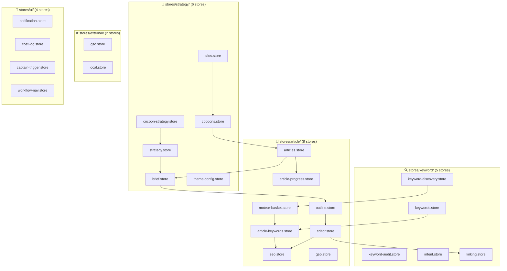
```mermaid
graph TB
    subgraph Article["📝 stores/article/ (8 stores)"]
        articles["articles.store"]
        editor["editor.store"]
        basket["moteur-basket.store"]
        outline["outline.store"]
        seo["seo.store"]
        artKw["article-keywords.store"]
        artProg["article-progress.store"]
        geo["geo.store"]
    end

    subgraph Keyword["🔍 stores/keyword/ (5 stores)"]
        keywords["keywords.store"]
        kwDisc["keyword-discovery.store"]
        kwAudit["keyword-audit.store"]
        intent["intent.store"]
        linking["linking.store"]
    end

    subgraph Strategy["🧠 stores/strategy/ (6 stores)"]
        silos["silos.store"]
        cocoons["cocoons.store"]
        cocStrat["cocoon-strategy.store"]
        strat["strategy.store"]
        brief["brief.store"]
        theme["theme-config.store"]
    end

    subgraph External["🌐 stores/external/ (2 stores)"]
        gsc["gsc.store"]
        local["local.store"]
    end

    subgraph UI["🎨 stores/ui/ (4 stores)"]
        notif["notification.store"]
        cost["cost-log.store"]
        captTrig["captain-trigger.store"]
        wfNav["workflow-nav.store"]
    end

    silos --> cocoons
    cocoons --> articles
    articles --> brief
    brief --> outline
    outline --> editor
    keywords --> artKw
    artKw --> seo
    editor --> seo
    strat --> brief
    cocStrat --> strat
    kwDisc --> basket
    basket --> artKw
    editor --> linking
    articles --> artProg
```

### 3.2 Flux de données entre stores (exemple Success Path)

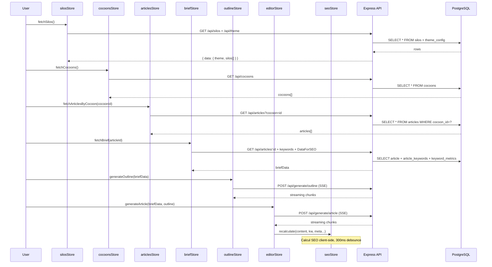
```mermaid
sequenceDiagram
    participant User
    participant silosStore
    participant cocoonsStore
    participant articlesStore
    participant briefStore
    participant outlineStore
    participant editorStore
    participant seoStore
    participant API as Express API
    participant PG as PostgreSQL

    User->>silosStore: fetchSilos()
    silosStore->>API: GET /api/silos + /api/theme
    API->>PG: SELECT * FROM silos + theme_config
    PG-->>API: rows
    API-->>silosStore: { data: { theme, silos[] } }

    User->>cocoonsStore: fetchCocoons()
    cocoonsStore->>API: GET /api/cocoons
    API->>PG: SELECT * FROM cocoons
    PG-->>cocoonsStore: cocoons[]

    User->>articlesStore: fetchArticlesByCocoon(cocoonId)
    articlesStore->>API: GET /api/articles?cocoon=id
    API->>PG: SELECT * FROM articles WHERE cocoon_id=?
    PG-->>articlesStore: articles[]

    User->>briefStore: fetchBrief(articleId)
    briefStore->>API: GET /api/articles/:id + keywords + DataForSEO
    API->>PG: SELECT article + article_keywords + keyword_metrics
    API-->>briefStore: briefData

    User->>outlineStore: generateOutline(briefData)
    outlineStore->>API: POST /api/generate/outline (SSE)
    API-->>outlineStore: streaming chunks

    User->>editorStore: generateArticle(briefData, outline)
    editorStore->>API: POST /api/generate/article (SSE)
    API-->>editorStore: streaming chunks

    editorStore->>seoStore: recalculate(content, kw, meta...)
    Note over seoStore: Calcul SEO client-side, 300ms debounce
```

### 3.3 Actions clés par store (échantillon)

#### silos.store (strategy/)
| Action | Input | Output | API |
|--------|-------|--------|-----|
| `fetchSilos()` | — | `theme`, `silos[]` | GET `/api/silos` + `/api/theme` |
| `addCocoon(siloName, cocoonName)` | string, string | cocoon créé | POST `/api/cocoons` |

#### article-progress.store (article/)
| Action | Input | Output | API |
|--------|-------|--------|-----|
| `fetchProgress(articleId)` | string | ArticleProgress | GET `/api/articles/:id/progress` |
| `addCheck(articleId, check)` | string, `WorkflowCheck` | check ajouté | POST `/api/articles/:id/progress/check` |

#### brief.store (strategy/)
| Action | Input | Output | API |
|--------|-------|--------|-----|
| `fetchBrief(articleId)` | string | briefData (article + kw + SERP) | GET multi-parallel |
| `refreshDataForSeo()` | — | SERP rafraîchi | POST forceRefresh |

#### outline.store (article/)
| Action | Input | Output | API |
|--------|-------|--------|-----|
| `generateOutline(briefData)` | BriefData | outline (streamé) | POST `/api/generate/outline` SSE |
| `validateOutline(articleId)` | string | isValidated=true | PUT outline |

#### editor.store (article/)
| Action | Input | Output | API |
|--------|-------|--------|-----|
| `generateArticle(briefData, outline)` | BriefData, Outline | content (streamé) | POST `/api/generate/article` SSE |
| `generateMeta(...)` | 4 strings | metaTitle + metaDescription | POST `/api/generate/meta` |
| `saveArticle(articleId)` | string | persisté | PUT `/api/articles/:id` |

#### intent.store (keyword/)
| Action | Input | Output | API |
|--------|-------|--------|-----|
| `analyzeIntent(keyword, location?)` | string, number? | IntentAnalysis | POST `/api/intent/analyze` |
| `compareLocalNational(keyword)` | string | LocalNationalComparison | POST `/api/keywords/compare-local` |
| `validateAutocomplete(keyword, prefixes?)` | string, string[]? | AutocompleteResult | POST `/api/keywords/autocomplete` |

#### keyword-discovery.store (keyword/)
| Action | Input | Output | API |
|--------|-------|--------|-----|
| `discoverFromSeed(keyword, max?)` | string, number? | ClassifiedKeyword[] | POST `/api/keywords/discover` |
| `discoverFromDomain(domain, max?)` | string, number? | DomainDiscoveryResult | POST `/api/keywords/discover-domain` |

#### moteur-basket.store (article/)
| Action | Input | Output |
|--------|-------|--------|
| `addKeywords(keywords)` | BasketKeyword[] | dédupliqué |
| `markValidated(keyword, score?)` | string, number? | marqué |
| `setArticle(articleId)` | string | reset basket |

#### linking.store (keyword/)
| Action | Input | Output | API |
|--------|-------|--------|-----|
| `fetchMatrix()` | — | matrix + orphans + alerts | GET `/api/links/matrix` |
| `fetchSuggestions(articleId, content)` | string, string | suggestions[] | POST `/api/links/suggest` |
| `saveLinks(links)` | InternalLink[] | persisté | PUT `/api/links` |

---

## 4. Workflow Editorial Global

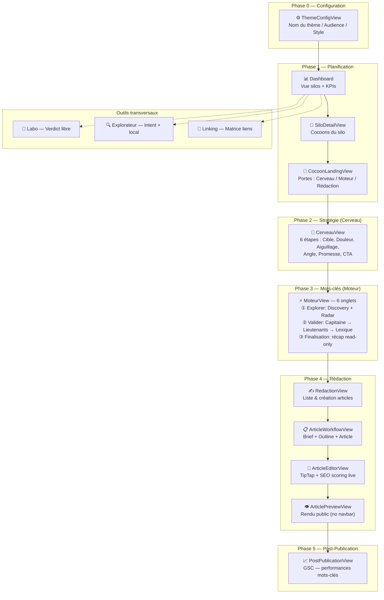
```mermaid
graph TB
    subgraph Phase0["Phase 0 — Configuration"]
        CONFIG["⚙️ ThemeConfigView<br>Nom du thème / Audience / Style"]
    end

    subgraph Phase1["Phase 1 — Planification"]
        DASH["📊 Dashboard<br>Vue silos + KPIs"]
        SILO["📁 SiloDetailView<br>Cocoons du silo"]
        COCOON["🎯 CocoonLandingView<br>Portes : Cerveau / Moteur / Rédaction"]
    end

    subgraph Phase2["Phase 2 — Stratégie (Cerveau)"]
        BRAIN["🧠 CerveauView<br>6 étapes : Cible, Douleur, Aiguillage,<br>Angle, Promesse, CTA"]
    end

    subgraph Phase3["Phase 3 — Mots-clés (Moteur)"]
        MOTEUR["⚡ MoteurView — 6 onglets<br>① Explorer: Discovery + Radar<br>② Valider: Capitaine → Lieutenants → Lexique<br>③ Finalisation: récap read-only"]
    end

    subgraph Phase4["Phase 4 — Rédaction"]
        REDAC["✍️ RedactionView<br>Liste & création articles"]
        WORKFLOW["📋 ArticleWorkflowView<br>Brief + Outline + Article"]
        EDITOR["📝 ArticleEditorView<br>TipTap + SEO scoring live"]
        PREVIEW["👁️ ArticlePreviewView<br>Rendu public (no navbar)"]
    end

    subgraph Phase5["Phase 5 — Post-Publication"]
        POSTPUB["📈 PostPublicationView<br>GSC — performances mots-clés"]
    end

    subgraph Tools["Outils transversaux"]
        LABO["🔬 Labo — Verdict libre"]
        EXPLO["🔍 Explorateur — Intent + local"]
        LINK["🔗 Linking — Matrice liens"]
    end

    CONFIG --> DASH
    DASH --> SILO
    SILO --> COCOON
    COCOON --> BRAIN
    BRAIN --> MOTEUR
    MOTEUR --> REDAC
    REDAC --> WORKFLOW
    WORKFLOW --> EDITOR
    EDITOR --> PREVIEW
    PREVIEW --> POSTPUB

    DASH -.-> LABO
    DASH -.-> EXPLO
    DASH -.-> LINK
```

---

## 5. Workflow Brain-First (Stratégie)

```mermaid
graph TB
    subgraph BrainWorkflow["🧠 Brain-First — 6 Étapes"]
        S0["Étape 0 — CIBLE<br>Input: description audience<br>IA: suggest/deepen/consolidate<br>Output: cible validée"]
        S1["Étape 1 — DOULEUR<br>Input: problème résolu<br>IA: suggestion<br>Output: douleur validée"]
        S2["Étape 2 — AIGUILLAGE<br>Input: type article + position<br>IA: suggestion type/parent/enfants<br>Output: aiguillage validé"]
        S3["Étape 3 — ANGLE<br>Input: perspective<br>IA: suggestion<br>Output: angle validé"]
        S4["Étape 4 — PROMESSE<br>Input: bénéfice<br>IA: suggestion<br>Output: promesse validée"]
        S5["Étape 5 — CTA<br>Input: call-to-action<br>IA: suggestion<br>Output: CTA validé"]
    end

    S0 --> S1 --> S2 --> S3 --> S4 --> S5

    subgraph StepDetail["Détail d'une étape"]
        direction LR
        INPUT["📝 Input utilisateur"]
        SUGGEST["🤖 IA Suggestion<br>(strategy-suggest.md)"]
        DEEPEN["🔍 Approfondissement<br>(strategy-deepen.md)<br>sub-questions"]
        CONSOLIDATE["📋 Consolidation<br>(strategy-consolidate.md)"]
        VALIDATE["✅ Validation"]

        INPUT --> SUGGEST
        SUGGEST --> DEEPEN
        DEEPEN --> CONSOLIDATE
        CONSOLIDATE --> VALIDATE
    end

    subgraph Checks["Checks Cerveau"]
        C1["cerveau:strategy_defined"]
        C2["cerveau:hierarchy_built"]
        C3["cerveau:articles_proposed"]
    end
```

### Flux de données par étape

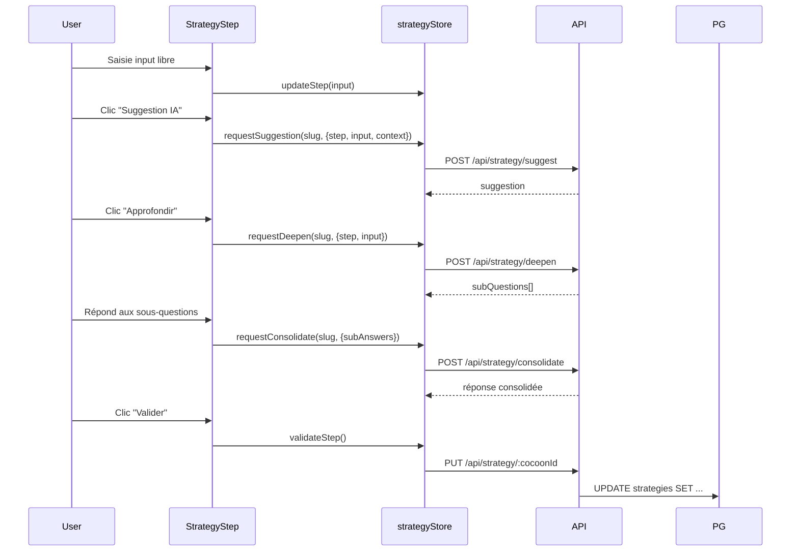
```mermaid
sequenceDiagram
    participant User
    participant StrategyStep
    participant strategyStore
    participant API
    participant PG

    User->>StrategyStep: Saisie input libre
    StrategyStep->>strategyStore: updateStep(input)

    User->>StrategyStep: Clic "Suggestion IA"
    StrategyStep->>strategyStore: requestSuggestion(slug, {step, input, context})
    strategyStore->>API: POST /api/strategy/suggest
    API-->>strategyStore: suggestion

    User->>StrategyStep: Clic "Approfondir"
    StrategyStep->>strategyStore: requestDeepen(slug, {step, input})
    strategyStore->>API: POST /api/strategy/deepen
    API-->>strategyStore: subQuestions[]

    User->>StrategyStep: Répond aux sous-questions
    StrategyStep->>strategyStore: requestConsolidate(slug, {subAnswers})
    strategyStore->>API: POST /api/strategy/consolidate
    API-->>strategyStore: réponse consolidée

    User->>StrategyStep: Clic "Valider"
    StrategyStep->>strategyStore: validateStep()
    strategyStore->>API: PUT /api/strategy/:cocoonId
    API->>PG: UPDATE strategies SET ...
```

---

## 6. Workflow Moteur (Keywords)

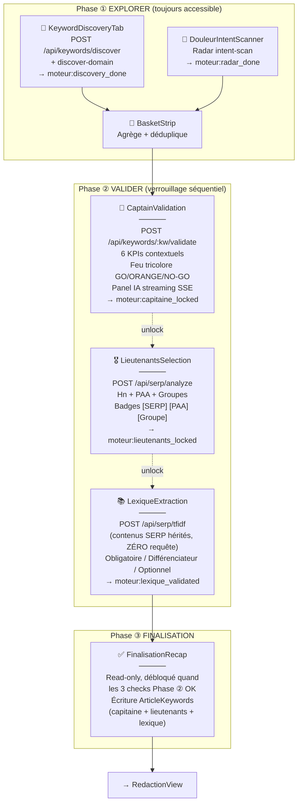
```mermaid
graph TB
    subgraph Phase1["Phase ① EXPLORER (toujours accessible)"]
        direction TB
        SEED["🌱 KeywordDiscoveryTab<br>POST /api/keywords/discover<br>+ discover-domain<br>→ moteur:discovery_done"]
        RADAR["📡 DouleurIntentScanner<br>Radar intent-scan<br>→ moteur:radar_done"]
        BASKET["🧺 BasketStrip<br>Agrège + déduplique"]

        SEED --> BASKET
        RADAR --> BASKET
    end

    subgraph Phase2["Phase ② VALIDER (verrouillage séquentiel)"]
        direction TB
        CAPT["👑 CaptainValidation<br>─────<br>POST /api/keywords/:kw/validate<br>6 KPIs contextuels<br>Feu tricolore GO/ORANGE/NO-GO<br>Panel IA streaming SSE<br>→ moteur:capitaine_locked"]
        LT["🎖️ LieutenantsSelection<br>─────<br>POST /api/serp/analyze<br>Hn + PAA + Groupes<br>Badges [SERP] [PAA] [Groupe]<br>→ moteur:lieutenants_locked"]
        LEX["📚 LexiqueExtraction<br>─────<br>POST /api/serp/tfidf<br>(contenus SERP hérités, ZÉRO requête)<br>Obligatoire / Différenciateur / Optionnel<br>→ moteur:lexique_validated"]

        CAPT -.->|unlock| LT
        LT -.->|unlock| LEX
    end

    subgraph Phase3["Phase ③ FINALISATION"]
        FINAL["✅ FinalisationRecap<br>─────<br>Read-only, débloqué quand<br>les 3 checks Phase ② OK<br>Écriture ArticleKeywords<br>(capitaine + lieutenants + lexique)"]
    end

    BASKET --> CAPT
    LEX --> FINAL
    FINAL --> REDAC["→ RedactionView"]
```

### Les 5 checks Moteur

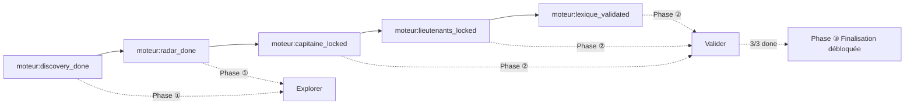
```mermaid
graph LR
    C1["moteur:discovery_done"] --> C2["moteur:radar_done"] --> C3["moteur:capitaine_locked"] --> C4["moteur:lieutenants_locked"] --> C5["moteur:lexique_validated"]

    C1 -.->|"Phase ①"| EXP[Explorer]
    C2 -.->|"Phase ①"| EXP
    C3 -.->|"Phase ②"| VAL[Valider]
    C4 -.->|"Phase ②"| VAL
    C5 -.->|"Phase ②"| VAL
    VAL -.->|"3/3 done"| FINAL[Phase ③ Finalisation débloquée]
```

### Filtres Discovery

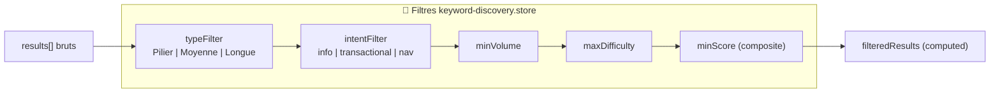
```mermaid
graph LR
    subgraph Filters["🔧 Filtres keyword-discovery.store"]
        TYPE["typeFilter<br>Pilier | Moyenne | Longue"]
        INTENT["intentFilter<br>info | transactional | nav"]
        VOL["minVolume"]
        DIFF["maxDifficulty"]
        SCORE["minScore (composite)"]
    end

    RAW["results[] bruts"] --> TYPE --> INTENT --> VOL --> DIFF --> SCORE --> FILTERED["filteredResults (computed)"]
```

### Basket — Cycle de vie

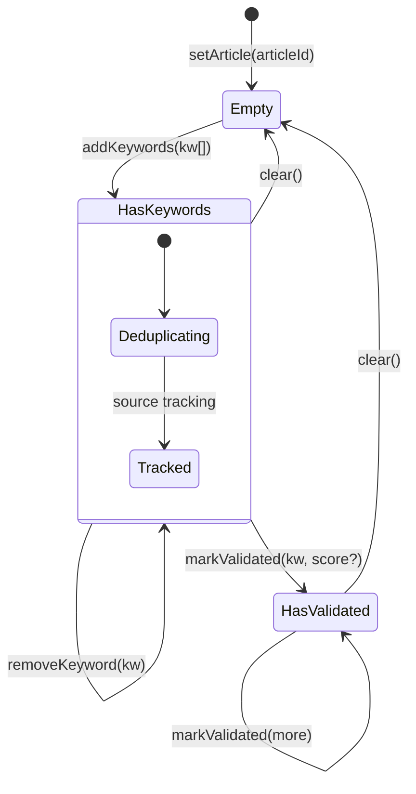
```mermaid
stateDiagram-v2
    [*] --> Empty: setArticle(articleId)
    Empty --> HasKeywords: addKeywords(kw[])
    HasKeywords --> HasKeywords: addKeywords(more)
    HasKeywords --> HasKeywords: removeKeyword(kw)
    HasKeywords --> HasValidated: markValidated(kw, score?)
    HasValidated --> HasValidated: markValidated(more)
    HasValidated --> Empty: clear()
    HasKeywords --> Empty: clear()

    state HasKeywords {
        [*] --> Deduplicating
        Deduplicating --> Tracked: source tracking
    }
```

### Cascade SERP (un scraping, deux usages)

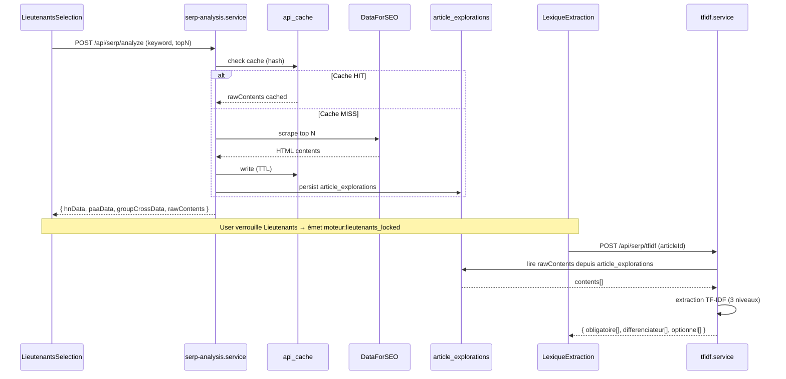
```mermaid
sequenceDiagram
    participant LT as LieutenantsSelection
    participant SerpSvc as serp-analysis.service
    participant Cache as api_cache
    participant DFSEO as DataForSEO
    participant PG as article_explorations
    participant LEX as LexiqueExtraction
    participant TfidfSvc as tfidf.service

    LT->>SerpSvc: POST /api/serp/analyze (keyword, topN)
    SerpSvc->>Cache: check cache (hash)
    alt Cache HIT
        Cache-->>SerpSvc: rawContents cached
    else Cache MISS
        SerpSvc->>DFSEO: scrape top N
        DFSEO-->>SerpSvc: HTML contents
        SerpSvc->>Cache: write (TTL)
        SerpSvc->>PG: persist article_explorations
    end
    SerpSvc-->>LT: { hnData, paaData, groupCrossData, rawContents }

    Note over LT,LEX: User verrouille Lieutenants → émet moteur:lieutenants_locked

    LEX->>TfidfSvc: POST /api/serp/tfidf (articleId)
    TfidfSvc->>PG: lire rawContents depuis article_explorations
    PG-->>TfidfSvc: contents[]
    TfidfSvc->>TfidfSvc: extraction TF-IDF (3 niveaux)
    TfidfSvc-->>LEX: { obligatoire[], differenciateur[], optionnel[] }
```

---

## 7. Workflow Article (Rédaction)

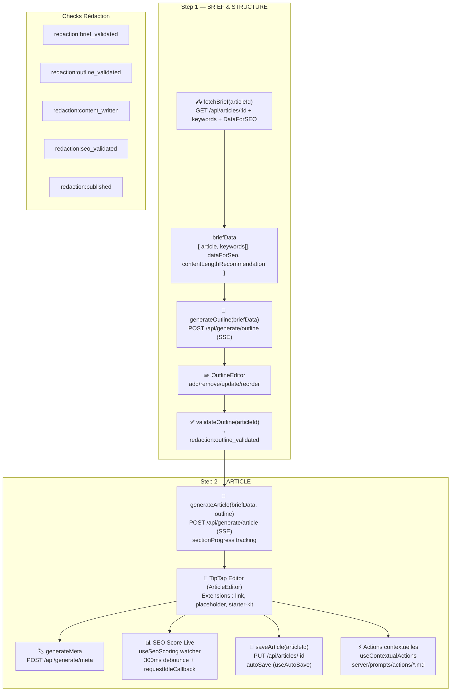
```mermaid
graph TB
    subgraph Step1["Step 1 — BRIEF & STRUCTURE"]
        FETCH["📥 fetchBrief(articleId)<br>GET /api/articles/:id + keywords + DataForSEO"]
        BRIEF_DATA["briefData<br>{ article, keywords[], dataForSeo, contentLengthRecommendation }"]
        GEN_OUTLINE["🤖 generateOutline(briefData)<br>POST /api/generate/outline (SSE)"]
        EDIT_OUTLINE["✏️ OutlineEditor<br>add/remove/update/reorder"]
        VALIDATE["✅ validateOutline(articleId)<br>→ redaction:outline_validated"]

        FETCH --> BRIEF_DATA --> GEN_OUTLINE --> EDIT_OUTLINE --> VALIDATE
    end

    subgraph Step2["Step 2 — ARTICLE"]
        GEN_ARTICLE["🤖 generateArticle(briefData, outline)<br>POST /api/generate/article (SSE)<br>sectionProgress tracking"]
        EDITOR["📝 TipTap Editor (ArticleEditor)<br>Extensions : link, placeholder, starter-kit"]
        GEN_META["🏷️ generateMeta<br>POST /api/generate/meta"]
        SEO_LIVE["📊 SEO Score Live<br>useSeoScoring watcher<br>300ms debounce + requestIdleCallback"]
        SAVE_ART["💾 saveArticle(articleId)<br>PUT /api/articles/:id<br>autoSave (useAutoSave)"]
        ACTIONS["⚡ Actions contextuelles<br>useContextualActions<br>server/prompts/actions/*.md"]

        GEN_ARTICLE --> EDITOR
        EDITOR --> GEN_META
        EDITOR --> SEO_LIVE
        EDITOR --> SAVE_ART
        EDITOR --> ACTIONS
    end

    VALIDATE --> GEN_ARTICLE

    subgraph Checks["Checks Rédaction"]
        RC1["redaction:brief_validated"]
        RC2["redaction:outline_validated"]
        RC3["redaction:content_written"]
        RC4["redaction:seo_validated"]
        RC5["redaction:published"]
    end
```

### ArticleWorkflowView — Panneaux

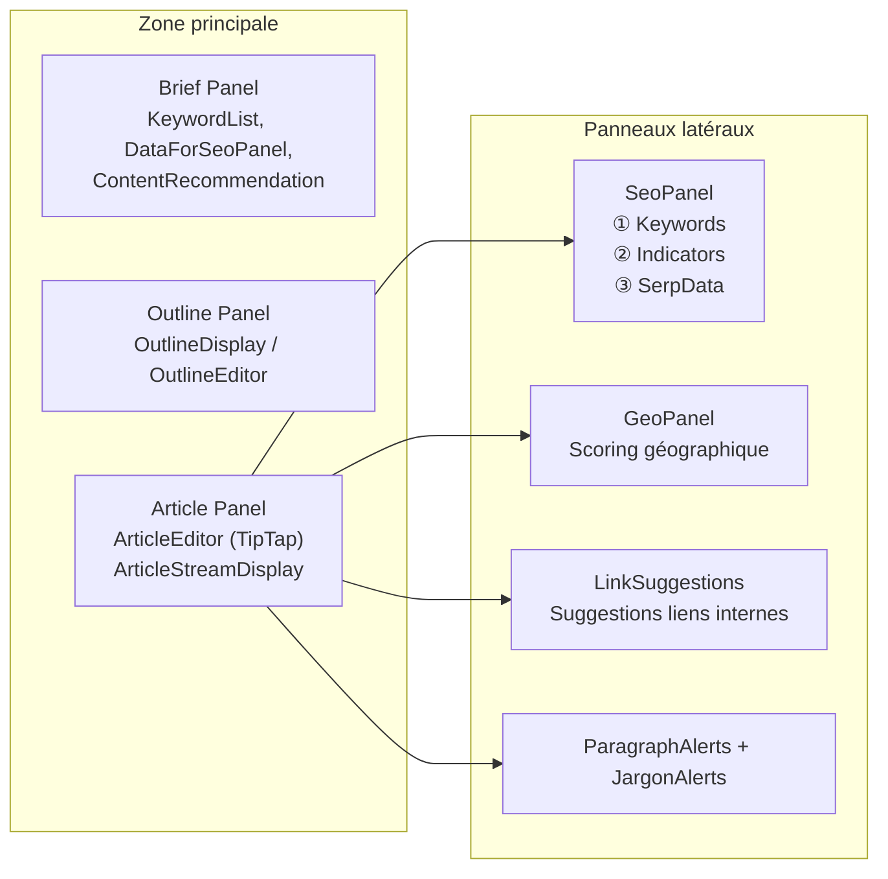
```mermaid
graph LR
    subgraph MainContent["Zone principale"]
        BRIEF_PANEL["Brief Panel<br>KeywordList, DataForSeoPanel,<br>ContentRecommendation"]
        OUTLINE_PANEL["Outline Panel<br>OutlineDisplay / OutlineEditor"]
        ARTICLE_PANEL["Article Panel<br>ArticleEditor (TipTap)<br>ArticleStreamDisplay"]
    end

    subgraph SidePanels["Panneaux latéraux"]
        SEO_PANEL["SeoPanel<br>① Keywords<br>② Indicators<br>③ SerpData"]
        GEO_PANEL["GeoPanel<br>Scoring géographique"]
        LINK_PANEL["LinkSuggestions<br>Suggestions liens internes"]
        ALERTS["ParagraphAlerts + JargonAlerts"]
    end

    ARTICLE_PANEL --> SEO_PANEL
    ARTICLE_PANEL --> GEO_PANEL
    ARTICLE_PANEL --> LINK_PANEL
    ARTICLE_PANEL --> ALERTS
```

---

## 8. SEO Scoring en temps réel

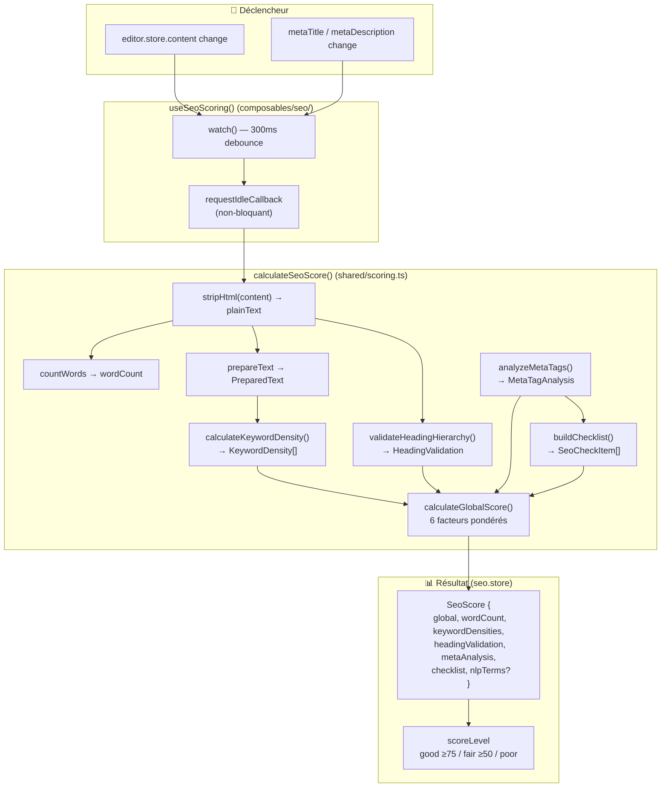
```mermaid
graph TB
    subgraph Trigger["🔄 Déclencheur"]
        CONTENT["editor.store.content change"]
        META["metaTitle / metaDescription change"]
    end

    subgraph Composable["useSeoScoring() (composables/seo/)"]
        WATCH["watch() — 300ms debounce"]
        IDLE["requestIdleCallback<br>(non-bloquant)"]
    end

    subgraph Calculation["calculateSeoScore() (shared/scoring.ts)"]
        direction TB
        STRIP["stripHtml(content) → plainText"]
        WORDS["countWords → wordCount"]
        PREPARE["prepareText → PreparedText"]
        DENSITY["calculateKeywordDensity()<br>→ KeywordDensity[]"]
        HEADINGS["validateHeadingHierarchy()<br>→ HeadingValidation"]
        META_ANAL["analyzeMetaTags()<br>→ MetaTagAnalysis"]
        CHECKLIST["buildChecklist()<br>→ SeoCheckItem[]"]
        GLOBAL["calculateGlobalScore()<br>6 facteurs pondérés"]

        STRIP --> WORDS
        STRIP --> PREPARE
        PREPARE --> DENSITY
        STRIP --> HEADINGS
        META_ANAL --> CHECKLIST
        DENSITY --> GLOBAL
        HEADINGS --> GLOBAL
        META_ANAL --> GLOBAL
        CHECKLIST --> GLOBAL
    end

    subgraph Output["📊 Résultat (seo.store)"]
        SCORE["SeoScore {<br>  global, wordCount, keywordDensities,<br>  headingValidation, metaAnalysis,<br>  checklist, nlpTerms?<br>}"]
        LEVEL["scoreLevel<br>good ≥75 / fair ≥50 / poor"]
    end

    CONTENT --> WATCH
    META --> WATCH
    WATCH --> IDLE
    IDLE --> STRIP
    GLOBAL --> SCORE --> LEVEL
```

### Pondération du score global

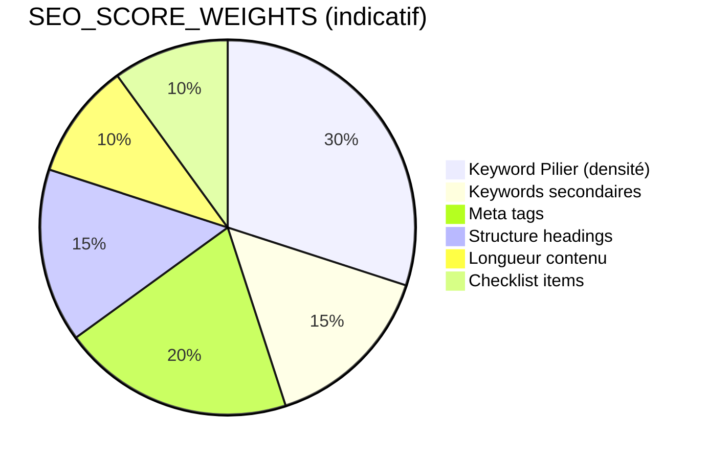
```mermaid
pie title SEO_SCORE_WEIGHTS (indicatif)
    "Keyword Pilier (densité)" : 30
    "Keywords secondaires" : 15
    "Meta tags" : 20
    "Structure headings" : 15
    "Longueur contenu" : 10
    "Checklist items" : 10
```

### Panels SEO indicateurs

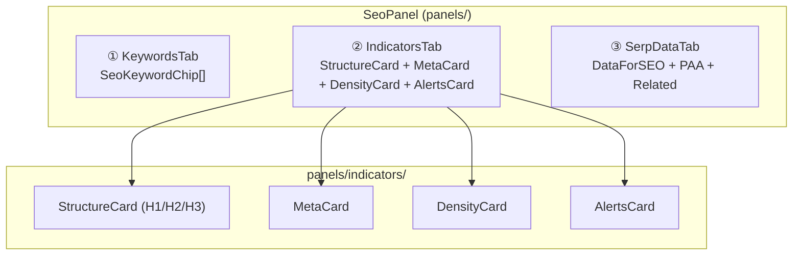
```mermaid
graph TB
    subgraph SeoPanel["SeoPanel (panels/)"]
        TAB1["① KeywordsTab<br>SeoKeywordChip[]"]
        TAB2["② IndicatorsTab<br>StructureCard + MetaCard + DensityCard + AlertsCard"]
        TAB3["③ SerpDataTab<br>DataForSEO + PAA + Related"]
    end

    subgraph Indicators["panels/indicators/"]
        STRUCT["StructureCard (H1/H2/H3)"]
        META_C["MetaCard"]
        DENS_C["DensityCard"]
        ALERT_C["AlertsCard"]
    end

    TAB2 --> STRUCT
    TAB2 --> META_C
    TAB2 --> DENS_C
    TAB2 --> ALERT_C
```

---

## 9. Keyword Matching (NLP Français)

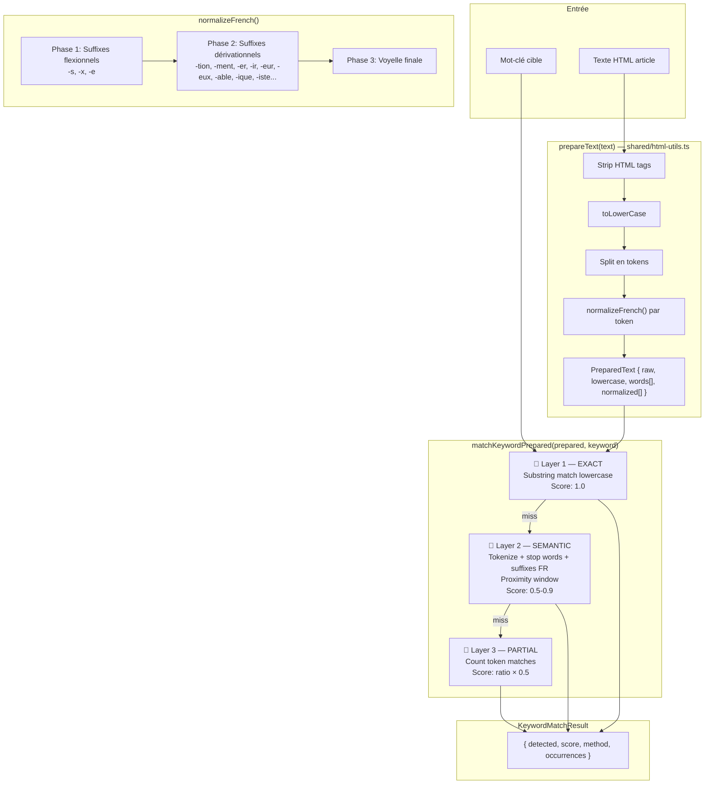
```mermaid
graph TB
    subgraph Input["Entrée"]
        TEXT["Texte HTML article"]
        KW["Mot-clé cible"]
    end

    subgraph Prepare["prepareText(text) — shared/html-utils.ts"]
        STRIP_HTML["Strip HTML tags"]
        LOWER["toLowerCase"]
        TOKENIZE["Split en tokens"]
        NORMALIZE["normalizeFrench() par token"]
        PREPARED["PreparedText { raw, lowercase, words[], normalized[] }"]

        STRIP_HTML --> LOWER --> TOKENIZE --> NORMALIZE --> PREPARED
    end

    subgraph Match["matchKeywordPrepared(prepared, keyword)"]
        direction TB
        L1["🎯 Layer 1 — EXACT<br>Substring match lowercase<br>Score: 1.0"]
        L2["🧠 Layer 2 — SEMANTIC<br>Tokenize + stop words + suffixes FR<br>Proximity window<br>Score: 0.5-0.9"]
        L3["📍 Layer 3 — PARTIAL<br>Count token matches<br>Score: ratio × 0.5"]

        L1 -->|"miss"| L2
        L2 -->|"miss"| L3
    end

    subgraph FrenchNLP["normalizeFrench()"]
        PH1["Phase 1: Suffixes flexionnels<br>-s, -x, -e"]
        PH2["Phase 2: Suffixes dérivationnels<br>-tion, -ment, -er, -ir, -eur, -eux, -able, -ique, -iste..."]
        PH3["Phase 3: Voyelle finale"]

        PH1 --> PH2 --> PH3
    end

    subgraph Output["KeywordMatchResult"]
        RES["{ detected, score, method, occurrences }"]
    end

    TEXT --> STRIP_HTML
    KW --> L1
    PREPARED --> L1
    L3 --> RES
    L2 --> RES
    L1 --> RES
```

### Exemples de normalisation française

| Mot original | Phase 1 | Phase 2 | Phase 3 | Résultat |
|-------------|---------|---------|---------|----------|
| `créations` | `création` | `cré` | `cré` | `cré` |
| `optimiser` | `optimiser` | `optim` | `optim` | `optim` |
| `référencement` | `référencement` | `référenc` | `référenc` | `référenc` |
| `naturelles` | `naturell` | `natur` | `natur` | `natur` |

---

## 10. Streaming & Génération IA

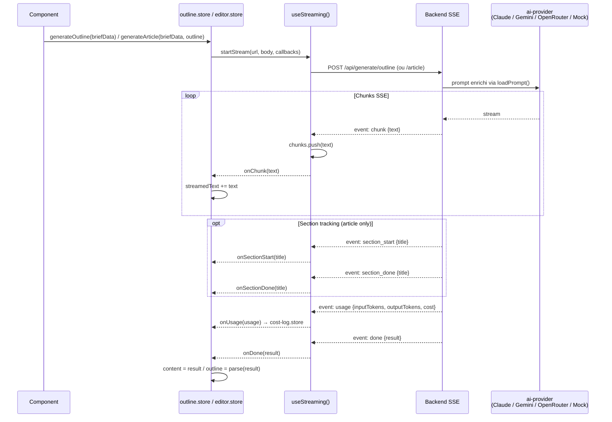
```mermaid
sequenceDiagram
    participant UI as Component
    participant Store as outline.store / editor.store
    participant Hook as useStreaming()
    participant API as Backend SSE
    participant AI as ai-provider<br>(Claude / Gemini / OpenRouter / Mock)

    UI->>Store: generateOutline(briefData) / generateArticle(briefData, outline)
    Store->>Hook: startStream(url, body, callbacks)
    Hook->>API: POST /api/generate/outline (ou /article)
    API->>AI: prompt enrichi via loadPrompt()

    loop Chunks SSE
        AI-->>API: stream
        API-->>Hook: event: chunk {text}
        Hook->>Hook: chunks.push(text)
        Hook-->>Store: onChunk(text)
        Store->>Store: streamedText += text
    end

    opt Section tracking (article only)
        API-->>Hook: event: section_start {title}
        Hook-->>Store: onSectionStart(title)
        API-->>Hook: event: section_done {title}
        Hook-->>Store: onSectionDone(title)
    end

    API-->>Hook: event: usage {inputTokens, outputTokens, cost}
    Hook-->>Store: onUsage(usage) → cost-log.store
    API-->>Hook: event: done {result}
    Hook-->>Store: onDone(result)
    Store->>Store: content = result / outline = parse(result)
```

### useStreaming — État interne

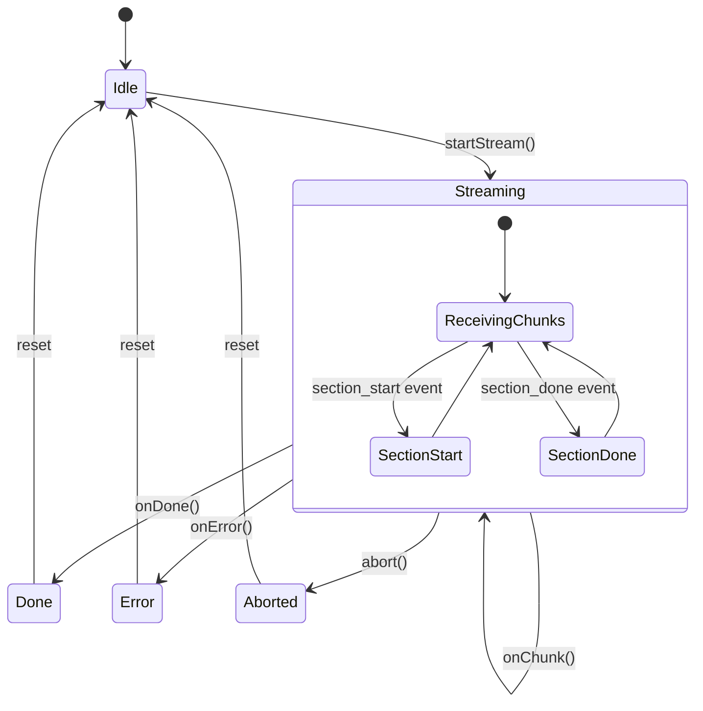
```mermaid
stateDiagram-v2
    [*] --> Idle
    Idle --> Streaming: startStream()
    Streaming --> Streaming: onChunk()
    Streaming --> Done: onDone()
    Streaming --> Error: onError()
    Streaming --> Aborted: abort()
    Done --> Idle: reset
    Error --> Idle: reset
    Aborted --> Idle: reset

    state Streaming {
        [*] --> ReceivingChunks
        ReceivingChunks --> SectionStart: section_start event
        SectionStart --> ReceivingChunks
        ReceivingChunks --> SectionDone: section_done event
        SectionDone --> ReceivingChunks
    }
```

### Multi-provider IA

```mermaid
graph LR
    PROMPT["loadPrompt(name, vars)<br>server/utils/prompt-loader.ts"]
    ROUTE["/api/generate/*<br>/api/keywords/:kw/ai-panel"]
    PROVIDER["ai-provider.service<br>(external/)"]

    subgraph Providers["Providers"]
        CLAUDE["claude.service<br>Anthropic SDK"]
        GEMINI["gemini.service<br>Google GenAI"]
        OPENR["openrouter.service<br>OpenRouter"]
        MOCK["mock.service<br>(dev/tests)"]
    end

    PROMPT --> ROUTE --> PROVIDER
    PROVIDER -->|env AI_PROVIDER=claude| CLAUDE
    PROVIDER -->|env AI_PROVIDER=gemini| GEMINI
    PROVIDER -->|env AI_PROVIDER=openrouter| OPENR
    PROVIDER -->|NODE_ENV=test ou mock| MOCK
```

---

## 11. Linking Interne

```mermaid
graph TB
    subgraph Analysis["Analyse linking.store (keyword/)"]
        FETCH_MATRIX["fetchMatrix()<br>GET /api/links/matrix<br>→ matrix, orphans[], anchorAlerts[],<br>  crossCocoonOpportunities[]"]
    end

    subgraph Suggestions["Suggestions"]
        FETCH_SUG["fetchSuggestions(articleId, content)<br>POST /api/links/suggest<br>→ LinkSuggestion[]"]
    end

    subgraph Actions["Actions"]
        SAVE["saveLinks(links)<br>PUT /api/links"]
    end

    subgraph Components["Composants (linking/)"]
        MATRIX_C["LinkingMatrix.vue — matrice N×N"]
        ORPHAN_C["OrphanDetector.vue — articles isolés"]
        ANCHOR_C["AnchorDiversityPanel.vue — ancres répétitives"]
        CROSS_C["CrossCocoonPanel.vue — opportunités inter-cocon"]
        SUG_C["LinkSuggestions.vue — suggestions contextuelles"]
    end

    FETCH_MATRIX --> MATRIX_C
    FETCH_MATRIX --> ORPHAN_C
    FETCH_MATRIX --> ANCHOR_C
    FETCH_MATRIX --> CROSS_C
    FETCH_SUG --> SUG_C
    SUG_C --> SAVE
```

---

## 12. Cache multi-niveau

```mermaid
graph TB
    CALL["Appel service (ex: keyword-validate)"]

    subgraph L1["Niveau 1 — keyword_metrics (cross-article, permanent)"]
        KM["SELECT * FROM keyword_metrics WHERE keyword=?"]
    end

    subgraph L2["Niveau 2 — api_cache (par requête, TTL)"]
        AC["SELECT value FROM api_cache WHERE key=? AND expires_at > NOW()"]
    end

    subgraph L3["Niveau 3 — API externe"]
        DFSEO_CALL["DataForSEO / Autocomplete / Claude / etc."]
        GUARD["dataforseo-cost-guard<br>vérifie quota mensuel"]
    end

    subgraph Write["Écriture"]
        WRITE_KM["INSERT/UPDATE keyword_metrics"]
        WRITE_AC["INSERT api_cache (TTL)"]
    end

    subgraph Purge["Purge horaire"]
        PURGE["setInterval 1h :<br>DELETE FROM api_cache<br>WHERE expires_at < NOW()"]
    end

    CALL --> KM
    KM -->|HIT| RETURN["Retour direct"]
    KM -->|MISS| AC
    AC -->|HIT| RETURN
    AC -->|MISS| GUARD
    GUARD --> DFSEO_CALL
    DFSEO_CALL --> WRITE_KM
    DFSEO_CALL --> WRITE_AC
    WRITE_AC -.-> PURGE
```

**Effet clé :** un mot-clé utilisé dans 3 articles = **1 seul appel DataForSEO** grâce à `keyword_metrics`.

---

## 13. Hiérarchie des composants

```mermaid
graph TB
    APP["App.vue"]
    NAV["AppNavbar.vue"]

    APP --> NAV
    APP --> ROUTER["RouterView"]

    subgraph DashViews["Pages Dashboard"]
        DASH_V["DashboardView"]
        SILO_V["SiloDetailView"]
        COCOON_V["CocoonLandingView"]

        DASH_V --> SILO_CARD["components/dashboard/SiloCard"]
        SILO_V --> COCOON_CARD["components/dashboard/CocoonCard"]
        COCOON_V --> ART_CARD["components/dashboard/ArticleCard"]
        COCOON_V --> WF_CHOICE["WorkflowChoice"]
    end

    subgraph StratViews["Pages Stratégie"]
        CERV_V["CerveauView"]
        CERV_V --> STRAT_STEP["components/strategy/StrategyStep"]
        STRAT_STEP --> SUBQ["SubQuestionCard"]
        STRAT_STEP --> CTX_RECAP["ContextRecap"]
        CERV_V --> PROP_ART["ProposedArticleRow"]
    end

    subgraph MoteurViews["Pages Moteur — 6 onglets"]
        MOT_V["MoteurView"]
        MOT_V --> SEL_ART["SelectedArticlePanel"]
        MOT_V --> MCTX["MoteurContextRecap + MoteurStrategyContext"]
        MOT_V --> BASKET_S["BasketStrip"]
        MOT_V --> TAB_CACHE["TabCachePanel"]
        MOT_V --> PTB["PhaseTransitionBanner"]
        MOT_V --> DOTS["ProgressDots"]

        subgraph P1["Phase ① Explorer"]
            DISC_TAB["KeywordDiscoveryTab"]
            DOULEUR["intent/DouleurIntentScanner"]
        end

        subgraph P2["Phase ② Valider"]
            CAPT_VAL["CaptainValidation"]
            LT_SEL["LieutenantsSelection"]
            LEX_EXT["LexiqueExtraction"]

            CAPT_VAL --> CAPT_IN["CaptainInput"]
            CAPT_VAL --> CAPT_CAR["CaptainCarousel"]
            CAPT_VAL --> CAPT_VERD["CaptainVerdictPanel"]
            CAPT_VAL --> CAPT_AI["CaptainAiPanel"]
            CAPT_VAL --> CAPT_LOCK["CaptainLockPanel"]
            CAPT_VAL --> CAPT_WORDS["CaptainInteractiveWords"]
            CAPT_VAL --> VBAR["VerdictBar"]
            CAPT_VAL --> THERMO["shared/RadarThermometer"]

            LT_SEL --> LT_SERP["LieutenantSerpAnalysis"]
            LT_SEL --> LT_H2["LieutenantH2Structure"]
            LT_SEL --> LT_PROP["LieutenantProposals"]
            LT_SEL --> LT_CARD["LieutenantCard"]
            LT_SEL --> UNLOCK["UnlockLieutenantsModal"]
        end

        subgraph P3["Phase ③ Finalisation"]
            FINAL_R["FinalisationRecap"]
        end

        MOT_V --> P1
        MOT_V --> P2
        MOT_V --> P3
    end

    subgraph ArticleViews["Pages Article"]
        ART_WF["ArticleWorkflowView"]
        ART_ED["ArticleEditorView"]
        ART_PV["ArticlePreviewView"]

        ART_WF --> OUTLINE_ED["outline/OutlineEditor"]
        ART_WF --> OUTLINE_DISP["outline/OutlineDisplay"]
        ART_WF --> ART_STREAM["article/ArticleStreamDisplay"]
        ART_WF --> ART_META["article/ArticleMetaDisplay"]
        ART_WF --> SEO_P["panels/SeoPanel"]
        ART_WF --> GEO_P["panels/geo/GeoPanel"]
        ART_WF --> LINK_S["linking/LinkSuggestions"]

        ART_ED --> TIPTAP["editor/ArticleEditor (TipTap)"]
        ART_ED --> TOOLBAR["editor/EditorToolbar"]
        ART_ED --> BUBBLE["editor/EditorBubbleMenu"]
    end

    subgraph Tools["Outils"]
        LABO_V["LaboView (mode libre)"]
        EXPL_V["ExplorateurView"]
        LINK_V["LinkingMatrixView"]
        PP_V["PostPublicationView"]
    end

    subgraph SharedUI["shared/"]
        GAUGE["ScoreGauge"]
        BADGE["StatusBadge, KeywordBadge"]
        PROGRESS["ProgressBar"]
        SPINNER["LoadingSpinner"]
        COLLAPSE["CollapsableSection"]
        ASYNC["AsyncContent + SkeletonLoader"]
        COST["ApiCostBadge"]
        BREAD["Breadcrumb"]
        WF_NAV["WorkflowNav"]
        KPI["KpiRow + KpiItem"]
        RECAP["RecapToggle"]
        BASKET_FLOAT["BasketFloatingPanel"]
    end

    ROUTER --> DashViews
    ROUTER --> StratViews
    ROUTER --> MoteurViews
    ROUTER --> ArticleViews
    ROUTER --> Tools
```

---

## 14. Référence des Inputs/Outputs

### Composables — Signatures principales

| Composable (domaine) | Input | Output | Effet de bord |
|----------------------|-------|--------|---------------|
| `useSeoScoring(kw, target?, related?, artKw?, articleId?)` (seo/) | keywords[], number?, Keyword[]?, ArticleKeywords?, string? | `{ seoStore }` | Watch editor.store → recalculate |
| `useStreaming<T>()` (editor/) | — | `{ chunks, isStreaming, error, result, usage, startStream(), abort() }` | SSE connection |
| `useAutoSave(articleId, interval?)` (editor/) | string, number? | `{ pause(), resume(), isActive }` | setInterval → saveArticle |
| `useCannibalization(articleId, cocoon)` (seo/) | string, string | `{ warnings[], refresh() }` | Fetch capitaines map |
| `useInternalLinking(articleId)` (seo/) | string | `{ suggestions[], isSuggesting, requestSuggestions(), dismissSuggestion() }` | API call |
| `usePanelToggle(default?)` (ui/) | string? | `{ activePanel, toggle(), showSeoPanel, ... }` | — |
| `useIntentVerdict()` (intent/) | — | `{ verdicts[], topVerdict }` | Watch intent.store |
| `useKeywordDiscoveryTab()` (keyword/) | — | `{ hasResults, cacheStatus, wordGroups, reset() }` | Watch keyword-discovery.store |
| `useCapitaineValidation()` (keyword/) | params verdict | `{ verdict, kpis, isValidating, validate() }` | API call /api/keywords/:kw/validate |
| `useKeywordScoring()` (keyword/) | kpis, level | `{ score, zones, thresholds }` | — |
| `useArticleResults(onRadarLoaded?)` (editor/) | callback? | `{ clearResults(), loadCachedResults() }` | Cache management |
| `useResizablePanel()` (ui/) | — | `{ width, height, startResize() }` | Mouse event listeners |
| `useCompositionCheck()` (seo/) | content | `{ alerts[] }` | Analyse composition |

### Utilitaires shared — Fonctions exportées

| Fonction | Input | Output |
|----------|-------|--------|
| `countWords(text)` | string | number |
| `calculateKeywordDensity(html, keyword, prepared?)` | string, string, PreparedText? | KeywordDensity |
| `validateHeadingHierarchy(html)` | string | HeadingValidation |
| `calculateSeoScore(...)` | 8 params | SeoScore |
| `normalizeFrench(word)` | string | string |
| `prepareText(text)` | string | PreparedText |
| `matchKeywordPrepared(prepared, keyword)` | PreparedText, string | KeywordMatchResult |
| `matchKeyword(text, keyword)` | string, string | KeywordMatchResult |
| `computeKpiScore(kpi, value, level)` (shared/kpi-scoring.ts) | name, number, ArticleLevel | `'green'\|'orange'\|'red'\|'bonus'` |

### Types principaux — Champs clés

| Type | Champs clés |
|------|-------------|
| `Article` | id, title, type (Pilier\|Intermédiaire\|Spécialisé), slug, topic, status, cocoonId, completedChecks |
| `Keyword` | keyword, cocoonName, type, status (suggested\|validated\|rejected) |
| `ArticleKeywords` | articleId, capitaine, lieutenants[], lexique[], hnStructure? |
| `BriefData` | article, keywords[], dataForSeo?, contentLengthRecommendation |
| `Outline` | sections: OutlineSection[] { id, level, title, annotation } |
| `SeoScore` | global (0-100), wordCount, keywordDensities[], headingValidation, metaAnalysis, checklist[] |
| `CocoonStrategy` | cocoonId, cible, douleur, aiguillage, angle, promesse, cta, completedSteps |
| `IntentAnalysis` | keyword, modules[], scores[], dominantIntent, topOrganicResults[], paaQuestions[] |
| `ClassifiedKeyword` | keyword, type, intent, searchVolume, difficulty, compositeScore |
| `LinkingMatrix` | links[], orphans[], anchorAlerts[], crossCocoonOpportunities[] |
| `KeywordMatchResult` | detected, score (0-1), method (exact\|semantic\|partial), occurrences |
| `CaptainVerdict` | overall (GO\|ORANGE\|NO_GO), kpis: { volume, kd, cpc, paa, intent, autocomplete }, reasons[] |
| `SerpAnalysisResult` | hnData[], paaData[], groupCrossData[], rawContents[] |
| `WorkflowCheck` | `moteur:*` \| `cerveau:*` \| `redaction:*` (constantes dans shared/constants/workflow-checks.constants.ts) |

---

## Annexe — API Endpoints

| Méthode | Endpoint | Store | Description |
|---------|----------|-------|-------------|
| GET | `/api/health` | — | Health check |
| GET | `/api/theme` | theme-config | Config thème |
| GET | `/api/silos` | silos | Liste silos |
| GET | `/api/cocoons` | cocoons | Liste cocons |
| GET | `/api/cocoons/:id/capitaines` | — | Map capitaines du cocon (cannibalization) |
| GET | `/api/articles?cocoon=id` | articles | Articles d'un cocon |
| GET | `/api/articles/:id` | brief | Détail article |
| PUT | `/api/articles/:id` | editor | Sauvegarde article |
| GET | `/api/articles/:id/progress` | article-progress | Progress article |
| POST | `/api/articles/:id/progress/check` | article-progress | Ajoute un check |
| POST | `/api/generate/outline` | outline | Génération plan (SSE) |
| POST | `/api/generate/article` | editor | Génération article (SSE) |
| POST | `/api/generate/meta` | editor | Génération meta tags |
| POST | `/api/generate/reduce-section` | editor | Réduction de section |
| GET | `/api/article-keywords/:id` | article-keywords | Keywords d'un article |
| PUT | `/api/article-keywords/:id` | article-keywords | Sauvegarde keywords |
| POST | `/api/keywords/discover` | keyword-discovery | Discovery par seed |
| POST | `/api/keywords/discover-domain` | keyword-discovery | Discovery par domaine |
| POST | `/api/keywords/suggest-lexique` | article-keywords | Suggestion LSI |
| POST | `/api/keywords/audit` | keyword-audit | Audit keywords |
| POST | `/api/keywords/:keyword/validate` | — | Verdict GO/NO-GO Capitaine |
| POST | `/api/keywords/:keyword/ai-panel` | — | Panel IA Capitaine (SSE) |
| POST | `/api/keywords/:keyword/ai-hn-structure` | — | Structure Hn recommandée |
| POST | `/api/keywords/:keyword/propose-lieutenants` | — | Propositions Lieutenants |
| GET | `/api/keywords/:keyword/usage` | — | Usage du mot-clé |
| GET | `/api/keywords/:keyword/metrics` | — | Métriques (keyword_metrics) |
| POST | `/api/keywords/:keyword/intent-for-article` | — | Intent contextualisé article |
| POST | `/api/keywords/intent-scan` | — | Radar intent |
| POST | `/api/keywords/intent-scan/radar/generate` | — | Génération radar |
| POST | `/api/keywords/intent-scan/radar/scan` | — | Scan radar |
| POST | `/api/keywords/compare-local` | intent | Comparaison local/national |
| POST | `/api/keywords/autocomplete` | intent | Validation autocomplete |
| POST | `/api/intent/analyze` | intent | Analyse intention SERP |
| POST | `/api/serp/analyze` | — | Scraping SERP top N |
| POST | `/api/serp/tfidf` | — | TF-IDF contenus SERP |
| POST | `/api/paa/batch` | — | PAA batch |
| GET | `/api/strategy/:cocoonId` | cocoon-strategy | Fetch stratégie |
| PUT | `/api/strategy/:cocoonId` | cocoon-strategy | Sauvegarde stratégie |
| POST | `/api/strategy/suggest` | strategy | Suggestion IA |
| POST | `/api/strategy/deepen` | strategy | Approfondissement |
| POST | `/api/strategy/consolidate` | strategy | Consolidation |
| GET | `/api/links/matrix` | linking | Matrice liens |
| POST | `/api/links/suggest` | linking | Suggestions liens |
| PUT | `/api/links` | linking | Sauvegarde liens |
| POST | `/api/local/*` | local | Local SEO (maps, score, entities) |
| POST | `/api/content-gap/*` | — | Content gap |
| GET | `/api/gsc/auth` | gsc | OAuth2 GSC |
| GET | `/api/gsc/callback` | gsc | Callback OAuth2 |
| GET | `/api/gsc/status` | gsc | Statut connexion |
| POST | `/api/export/*` | — | Export HTML |
| GET | `/api/discovery-cache/*` | — | Cache Discovery (check/load/save) |
| GET | `/api/radar-cache/*` | — | Cache Radar (check/load/save) |
| GET | `/api/radar-exploration/*` | — | Exploration Radar |
| GET | `/api/articles/:id/explorations` | — | Explorations d'un article |
| GET | `/api/dataforseo/brief` | brief | Données SERP DataForSEO |
| GET | `/api/dataforseo/cost-status` | cost-log | Statut quota DataForSEO |
