# Blog Redactor SEO — Architecture & Flow Diagrams

> Document généré automatiquement — Vue d'ensemble complète des flux, composants, stores et données du projet.

---

## Table des matières

1. [Vue d'ensemble de l'architecture](#1-vue-densemble-de-larchitecture)
2. [Navigation & Routes](#2-navigation--routes)
3. [Stores & Stockage de données](#3-stores--stockage-de-données)
4. [Workflow Editorial Global](#4-workflow-editorial-global)
5. [Workflow Brain-First (Stratégie)](#5-workflow-brain-first-stratégie)
6. [Workflow Moteur (Keywords)](#6-workflow-moteur-keywords)
7. [Workflow Article (Rédaction)](#7-workflow-article-rédaction)
8. [SEO Scoring en temps réel](#8-seo-scoring-en-temps-réel)
9. [Keyword Matching (NLP Français)](#9-keyword-matching-nlp-français)
10. [Streaming & Génération IA](#10-streaming--génération-ia)
11. [Linking Interne](#11-linking-interne)
12. [Hiérarchie des composants](#12-hiérarchie-des-composants)
13. [Référence des Inputs/Outputs](#13-référence-des-inputsoutputs)

---

## 1. Vue d'ensemble de l'architecture

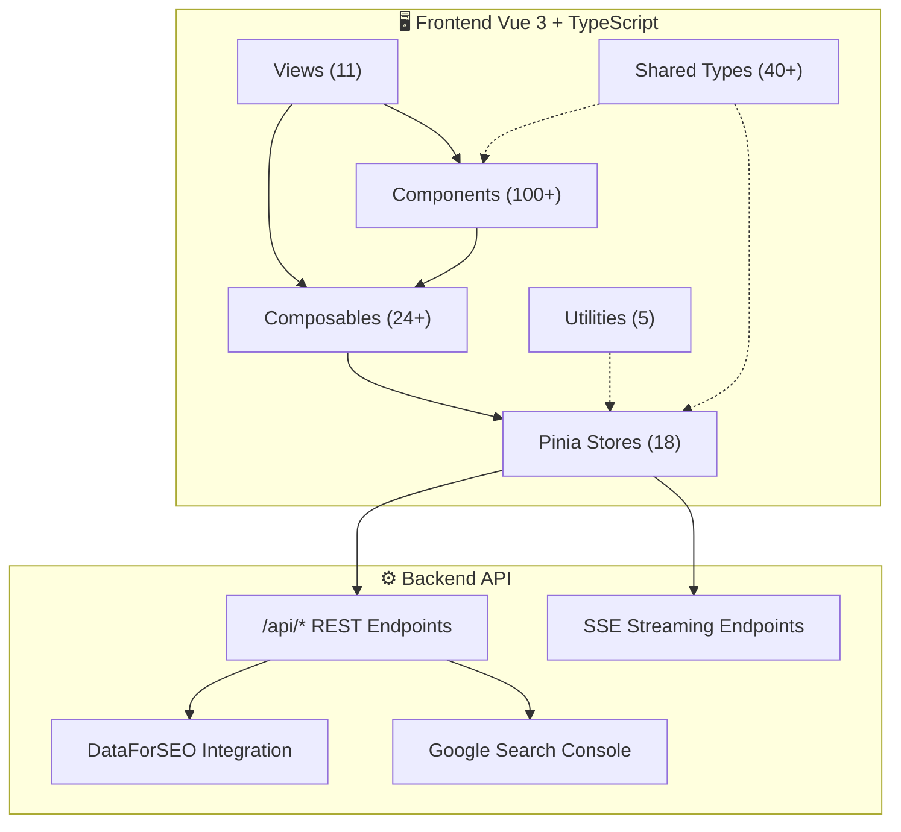
```mermaid
graph TB
    subgraph Frontend["🖥️ Frontend Vue 3 + TypeScript"]
        direction TB
        Views["Views (11)"]
        Components["Components (100+)"]
        Composables["Composables (24+)"]
        Stores["Pinia Stores (18)"]
        Utils["Utilities (5)"]
        Types["Shared Types (40+)"]
    end

    subgraph Backend["⚙️ Backend API"]
        REST["/api/* REST Endpoints"]
        SSE["SSE Streaming Endpoints"]
        DFSEO["DataForSEO Integration"]
        GSC["Google Search Console"]
    end

    Views --> Components
    Views --> Composables
    Composables --> Stores
    Components --> Composables
    Stores --> REST
    Stores --> SSE
    REST --> DFSEO
    REST --> GSC
    Utils -.-> Stores
    Types -.-> Stores
    Types -.-> Components
```

### Stack technique

| Couche | Technologie |
|--------|-------------|
| Framework | Vue 3 (Composition API) |
| State | Pinia 2 |
| Router | Vue Router 4 |
| Éditeur | TipTap 2 + Extensions custom |
| Streaming | Server-Sent Events (SSE) |
| NLP | Matching français custom (suffixes) |
| API | REST + SSE vers backend Node.js |
| Données SEO | DataForSEO, Google Search Console |

---

## 2. Navigation & Routes

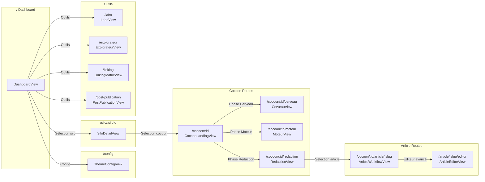
```mermaid
graph LR
    subgraph Dashboard["/ Dashboard"]
        D[DashboardView]
    end

    subgraph Config["/config"]
        TC[ThemeConfigView]
    end

    subgraph Silo["/silo/:siloId"]
        SD[SiloDetailView]
    end

    subgraph Cocoon["Cocoon Routes"]
        CL["/cocoon/:id<br>CocoonLandingView"]
        CV["/cocoon/:id/cerveau<br>CerveauView"]
        MV["/cocoon/:id/moteur<br>MoteurView"]
        RV["/cocoon/:id/redaction<br>RedactionView"]
    end

    subgraph Article["Article Routes"]
        AW["/cocoon/:id/article/:slug<br>ArticleWorkflowView"]
        AE["/article/:slug/editor<br>ArticleEditorView"]
    end

    subgraph Tools["Outils"]
        LB["/labo<br>LaboView"]
        EX["/explorateur<br>ExplorateurView"]
        LK["/linking<br>LinkingMatrixView"]
        PP["/post-publication<br>PostPublicationView"]
    end

    D -->|"Sélection silo"| SD
    D -->|"Config"| TC
    SD -->|"Sélection cocoon"| CL
    CL -->|"Phase Cerveau"| CV
    CL -->|"Phase Moteur"| MV
    CL -->|"Phase Rédaction"| RV
    RV -->|"Sélection article"| AW
    AW -->|"Éditeur avancé"| AE
    D -->|"Outils"| LB
    D -->|"Outils"| EX
    D -->|"Outils"| LK
    D -->|"Outils"| PP
```

### Détail des 13 routes

| Route | Vue | Store principal | Rôle |
|-------|-----|-----------------|------|
| `/` | DashboardView | silosStore | Tableau de bord principal |
| `/config` | ThemeConfigView | themeConfigStore | Configuration thème/audience |
| `/silo/:siloId` | SiloDetailView | silosStore | Détail d'un silo |
| `/cocoon/:id` | CocoonLandingView | cocoonsStore | Landing cocoon |
| `/cocoon/:id/cerveau` | CerveauView | cocoonStrategyStore | Stratégie Brain-First |
| `/cocoon/:id/moteur` | MoteurView | keywordDiscoveryStore + basket | Moteur de mots-clés |
| `/cocoon/:id/redaction` | RedactionView | articlesStore | Liste articles + création |
| `/cocoon/:id/article/:slug` | ArticleWorkflowView | briefStore + outlineStore + editorStore | Workflow article complet |
| `/article/:slug/editor` | ArticleEditorView | editorStore + seoStore | Éditeur TipTap avancé |
| `/labo` | LaboView | keywordAuditStore | Audit santé mots-clés |
| `/explorateur` | ExplorateurView | intentStore | Exploration d'intentions |
| `/linking` | LinkingMatrixView | linkingStore | Matrice de liens internes |
| `/post-publication` | PostPublicationView | gscStore | Suivi post-publication |

---

## 3. Stores & Stockage de données

### 3.1 Cartographie complète des stores

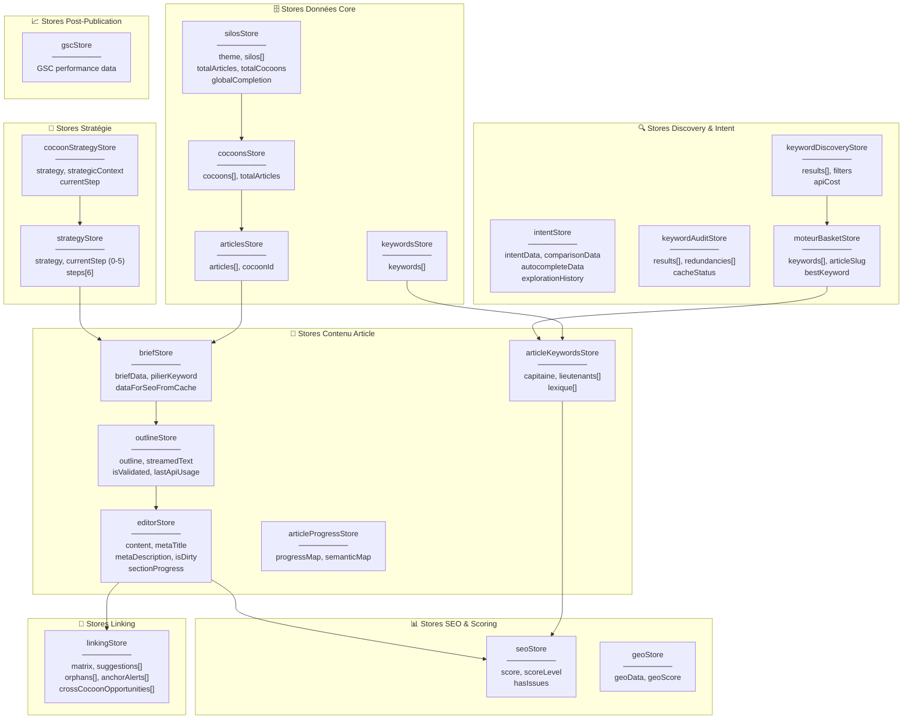
```mermaid
graph TB
    subgraph Core["🗄️ Stores Données Core"]
        silos["silosStore<br>─────────<br>theme, silos[]<br>totalArticles, totalCocoons<br>globalCompletion"]
        cocoons["cocoonsStore<br>─────────<br>cocoons[], totalArticles"]
        articles["articlesStore<br>─────────<br>articles[], cocoonId"]
        keywords["keywordsStore<br>─────────<br>keywords[]"]
    end

    subgraph ArticleContent["📝 Stores Contenu Article"]
        brief["briefStore<br>─────────<br>briefData, pilierKeyword<br>dataForSeoFromCache"]
        outline["outlineStore<br>─────────<br>outline, streamedText<br>isValidated, lastApiUsage"]
        editor["editorStore<br>─────────<br>content, metaTitle<br>metaDescription, isDirty<br>sectionProgress"]
        artKw["articleKeywordsStore<br>─────────<br>capitaine, lieutenants[]<br>lexique[]"]
        artProg["articleProgressStore<br>─────────<br>progressMap, semanticMap"]
    end

    subgraph Strategy["🧠 Stores Stratégie"]
        strat["strategyStore<br>─────────<br>strategy, currentStep (0-5)<br>steps[6]"]
        cocStrat["cocoonStrategyStore<br>─────────<br>strategy, strategicContext<br>currentStep"]
    end

    subgraph SEO["📊 Stores SEO & Scoring"]
        seo["seoStore<br>─────────<br>score, scoreLevel<br>hasIssues"]
        geo["geoStore<br>─────────<br>geoData, geoScore"]
    end

    subgraph Discovery["🔍 Stores Discovery & Intent"]
        intent["intentStore<br>─────────<br>intentData, comparisonData<br>autocompleteData<br>explorationHistory"]
        kwDisc["keywordDiscoveryStore<br>─────────<br>results[], filters<br>apiCost"]
        kwAudit["keywordAuditStore<br>─────────<br>results[], redundancies[]<br>cacheStatus"]
        basket["moteurBasketStore<br>─────────<br>keywords[], articleSlug<br>bestKeyword"]
    end

    subgraph Linking["🔗 Stores Linking"]
        linking["linkingStore<br>─────────<br>matrix, suggestions[]<br>orphans[], anchorAlerts[]<br>crossCocoonOpportunities[]"]
    end

    subgraph PostPub["📈 Stores Post-Publication"]
        gsc["gscStore<br>─────────<br>GSC performance data"]
    end

    silos --> cocoons
    cocoons --> articles
    articles --> brief
    brief --> outline
    outline --> editor
    keywords --> artKw
    artKw --> seo
    editor --> seo
    strat --> brief
    cocStrat --> strat
    kwDisc --> basket
    basket --> artKw
    editor --> linking
```

### 3.2 Flux de données entre stores

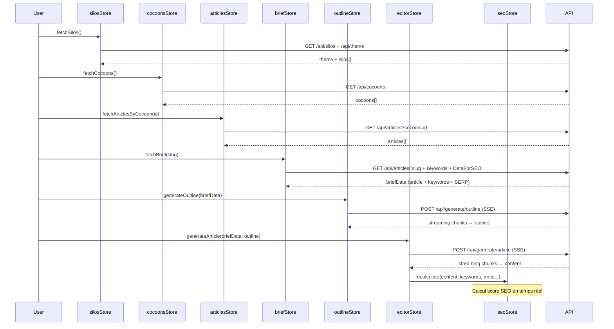
```mermaid
sequenceDiagram
    participant User
    participant silosStore
    participant cocoonsStore
    participant articlesStore
    participant briefStore
    participant outlineStore
    participant editorStore
    participant seoStore
    participant API

    User->>silosStore: fetchSilos()
    silosStore->>API: GET /api/silos + /api/theme
    API-->>silosStore: theme + silos[]

    User->>cocoonsStore: fetchCocoons()
    cocoonsStore->>API: GET /api/cocoons
    API-->>cocoonsStore: cocoons[]

    User->>articlesStore: fetchArticlesByCocoon(id)
    articlesStore->>API: GET /api/articles?cocoon=id
    API-->>articlesStore: articles[]

    User->>briefStore: fetchBrief(slug)
    briefStore->>API: GET /api/articles/:slug + keywords + DataForSEO
    API-->>briefStore: briefData (article + keywords + SERP)

    User->>outlineStore: generateOutline(briefData)
    outlineStore->>API: POST /api/generate/outline (SSE)
    API-->>outlineStore: streaming chunks → outline

    User->>editorStore: generateArticle(briefData, outline)
    editorStore->>API: POST /api/generate/article (SSE)
    API-->>editorStore: streaming chunks → content

    editorStore->>seoStore: recalculate(content, keywords, meta...)
    Note over seoStore: Calcul score SEO en temps réel
```

### 3.3 Détail des actions par store

#### silosStore
| Action | Input | Output | API |
|--------|-------|--------|-----|
| `fetchSilos()` | — | `theme`, `silos[]` | GET `/api/silos` + `/api/theme` |
| `addCocoon(siloName, cocoonName)` | string, string | cocoon ajouté | POST `/api/cocoons` |

#### briefStore
| Action | Input | Output | API |
|--------|-------|--------|-----|
| `fetchBrief(slug)` | slug | `briefData` (article+kw+SERP) | GET multi-parallel |
| `refreshDataForSeo()` | — | SERP data rafraîchi | POST forceRefresh |

#### outlineStore
| Action | Input | Output | API |
|--------|-------|--------|-----|
| `generateOutline(briefData)` | BriefData | outline (streamed) | POST `/api/generate/outline` SSE |
| `addSection(afterId, level)` | string, number | section ajoutée | local |
| `removeSection(id)` | string | section supprimée | local |
| `validateOutline(slug)` | slug | isValidated=true | POST `/api/outlines/:slug/validate` |

#### editorStore
| Action | Input | Output | API |
|--------|-------|--------|-----|
| `generateArticle(briefData, outline)` | BriefData, Outline | content (streamed) | POST `/api/generate/article` SSE |
| `generateMeta(slug, kw, title, content)` | 4 strings | metaTitle + metaDescription | POST `/api/generate/meta` |
| `saveArticle(slug)` | slug | sauvegardé | PUT `/api/articles/:slug` |
| `setContent(html)` | string | content + isDirty | local |

#### seoStore
| Action | Input | Output | API |
|--------|-------|--------|-----|
| `recalculate(content, keywords, meta...)` | 8 params | SeoScore complet | local (calcul côté client) |
| `reset()` | — | score remis à zéro | local |

#### strategyStore
| Action | Input | Output | API |
|--------|-------|--------|-----|
| `fetchStrategy(slug)` | slug | ArticleStrategy | GET `/api/strategies/:slug` |
| `requestSuggestion(slug, request)` | slug, obj | suggestion IA | POST `/api/strategies/suggest` |
| `requestDeepen(slug, request)` | slug, obj | subQuestions[] | POST `/api/strategies/deepen` |
| `requestConsolidate(slug, request)` | slug, obj | answer consolidée | POST `/api/strategies/consolidate` |
| `saveStrategy(slug)` | slug | persisté | PUT `/api/strategies/:slug` |

#### articleKeywordsStore
| Action | Input | Output | API |
|--------|-------|--------|-----|
| `fetchKeywords(slug)` | slug | ArticleKeywords | GET `/api/article-keywords/:slug` |
| `saveKeywords(slug)` | slug | persisté | PUT `/api/article-keywords/:slug` |
| `suggestLexique(slug, title, cocoon)` | 3 strings | lexique[] suggéré | POST `/api/keywords/suggest-lexique` |

#### intentStore
| Action | Input | Output | API |
|--------|-------|--------|-----|
| `analyzeIntent(keyword, location?)` | string, number? | IntentAnalysis | POST `/intent/analyze` |
| `compareLocalNational(keyword)` | string | LocalNationalComparison | POST `/keywords/compare-local` |
| `validateAutocomplete(keyword, prefixes?)` | string, string[]? | AutocompleteResult | POST `/keywords/autocomplete` |
| `exploreKeyword(keyword, prefixes?)` | string, string[]? | autocomplete + intent | combo des 2 ci-dessus |

#### keywordDiscoveryStore
| Action | Input | Output | API |
|--------|-------|--------|-----|
| `discoverFromSeed(keyword, max?)` | string, number? | ClassifiedKeyword[] | POST `/api/keywords/discover` |
| `discoverFromDomain(domain, max?)` | string, number? | DomainDiscoveryResult | POST `/api/keywords/discover-domain` |

#### moteurBasketStore
| Action | Input | Output | API |
|--------|-------|--------|-----|
| `addKeywords(keywords)` | BasketKeyword[] | ajout dédupliqué | local |
| `markValidated(keyword, score?)` | string, number? | marqué validé | local |
| `setArticle(slug)` | slug | reset basket | local |

#### linkingStore
| Action | Input | Output | API |
|--------|-------|--------|-----|
| `fetchMatrix()` | — | matrix + orphans + alerts | GET `/links/matrix` |
| `fetchSuggestions(slug, content)` | string, string | suggestions[] | POST `/links/suggest` |
| `saveLinks(links)` | InternalLink[] | persisté | PUT `/links` |

#### articleProgressStore
| Action | Input | Output | API |
|--------|-------|--------|-----|
| `fetchProgress(slug)` | slug | ArticleProgress | GET `/api/progress/:slug` |
| `saveProgress(slug, progress)` | slug, obj | persisté | PUT `/api/progress/:slug` |
| `addCheck(slug, check)` | slug, string | check ajouté | local + persist |
| `fetchSemanticField(slug)` | slug | SemanticTerm[] | GET `/api/semantic/:slug` |

---

## 4. Workflow Editorial Global

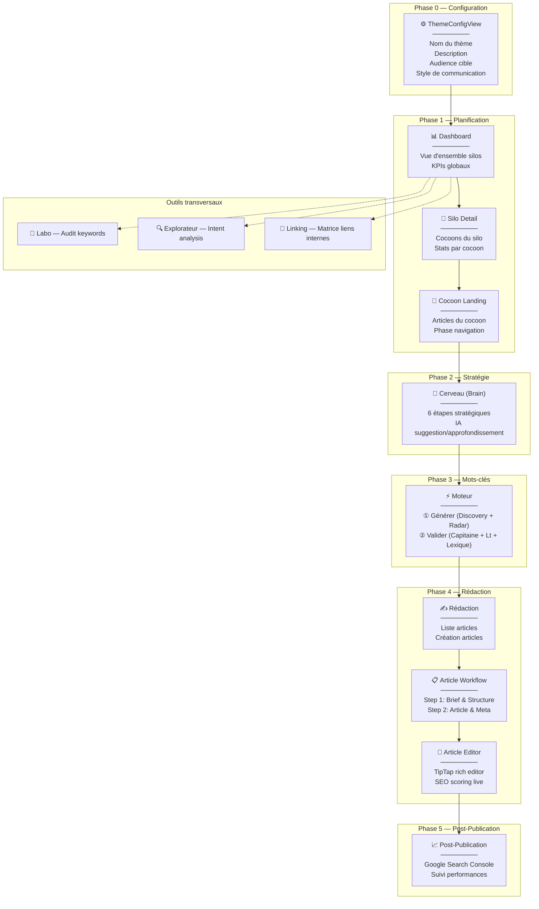
```mermaid
graph TB
    subgraph Phase1["Phase 0 — Configuration"]
        CONFIG["⚙️ ThemeConfigView<br>────────<br>Nom du thème<br>Description<br>Audience cible<br>Style de communication"]
    end

    subgraph Phase2["Phase 1 — Planification"]
        DASH["📊 Dashboard<br>────────<br>Vue d'ensemble silos<br>KPIs globaux"]
        SILO["📁 Silo Detail<br>────────<br>Cocoons du silo<br>Stats par cocoon"]
        COCOON["🎯 Cocoon Landing<br>────────<br>Articles du cocoon<br>Phase navigation"]
    end

    subgraph Phase3["Phase 2 — Stratégie"]
        BRAIN["🧠 Cerveau (Brain)<br>────────<br>6 étapes stratégiques<br>IA suggestion/approfondissement"]
    end

    subgraph Phase4["Phase 3 — Mots-clés"]
        MOTEUR["⚡ Moteur<br>────────<br>① Générer (Discovery + Radar)<br>② Valider (Capitaine + Lt + Lexique)"]
    end

    subgraph Phase5["Phase 4 — Rédaction"]
        REDAC["✍️ Rédaction<br>────────<br>Liste articles<br>Création articles"]
        WORKFLOW["📋 Article Workflow<br>────────<br>Step 1: Brief & Structure<br>Step 2: Article & Meta"]
        EDITOR["📝 Article Editor<br>────────<br>TipTap rich editor<br>SEO scoring live"]
    end

    subgraph Phase6["Phase 5 — Post-Publication"]
        POSTPUB["📈 Post-Publication<br>────────<br>Google Search Console<br>Suivi performances"]
    end

    subgraph Tools["Outils transversaux"]
        LABO["🔬 Labo — Audit keywords"]
        EXPLO["🔍 Explorateur — Intent analysis"]
        LINK["🔗 Linking — Matrice liens internes"]
    end

    CONFIG --> DASH
    DASH --> SILO
    SILO --> COCOON
    COCOON --> BRAIN
    BRAIN --> MOTEUR
    MOTEUR --> REDAC
    REDAC --> WORKFLOW
    WORKFLOW --> EDITOR
    EDITOR --> POSTPUB

    DASH -.-> LABO
    DASH -.-> EXPLO
    DASH -.-> LINK
```

---

## 5. Workflow Brain-First (Stratégie)

```mermaid
graph TB
    subgraph BrainWorkflow["🧠 Brain-First — 6 Étapes"]
        S0["Étape 0 — CIBLE<br>────────<br>Input: description audience<br>IA: suggestion cible<br>Output: cible validée"]
        S1["Étape 1 — DOULEUR<br>────────<br>Input: problème résolu<br>IA: suggestion douleur<br>Output: douleur validée"]
        S2["Étape 2 — AIGUILLAGE<br>────────<br>Input: type article + position<br>IA: suggestion type/parent/enfants<br>Output: aiguillage validé"]
        S3["Étape 3 — ANGLE<br>────────<br>Input: perspective choisie<br>IA: suggestion angle<br>Output: angle validé"]
        S4["Étape 4 — PROMESSE<br>────────<br>Input: bénéfice principal<br>IA: suggestion promesse<br>Output: promesse validée"]
        S5["Étape 5 — CTA<br>────────<br>Input: call-to-action<br>IA: suggestion CTA<br>Output: CTA validé"]
    end

    S0 --> S1 --> S2 --> S3 --> S4 --> S5

    subgraph StepDetail["Détail d'une étape"]
        direction LR
        INPUT["📝 Input utilisateur"]
        SUGGEST["🤖 IA Suggestion"]
        DEEPEN["🔍 Approfondissement<br>(sub-questions)"]
        CONSOLIDATE["📋 Consolidation<br>des sous-réponses"]
        VALIDATE["✅ Validation"]

        INPUT --> SUGGEST
        SUGGEST --> DEEPEN
        DEEPEN --> CONSOLIDATE
        CONSOLIDATE --> VALIDATE
    end

    subgraph StrategyData["Données stratégie"]
        direction LR
        CTX["getPreviousAnswers()<br>contexte cumulatif"]
        SAVE["saveStrategy(slug)<br>PUT /api/strategies/:slug"]
    end
```

### Flux de données par étape

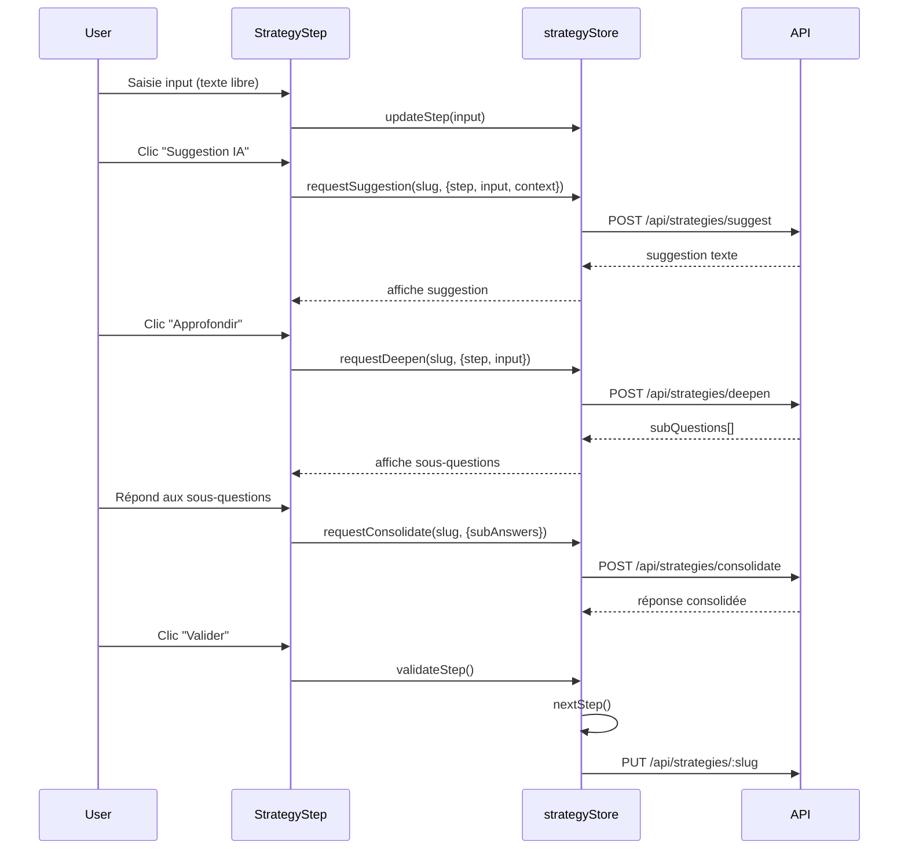
```mermaid
sequenceDiagram
    participant User
    participant StrategyStep
    participant strategyStore
    participant API

    User->>StrategyStep: Saisie input (texte libre)
    StrategyStep->>strategyStore: updateStep(input)

    User->>StrategyStep: Clic "Suggestion IA"
    StrategyStep->>strategyStore: requestSuggestion(slug, {step, input, context})
    strategyStore->>API: POST /api/strategies/suggest
    API-->>strategyStore: suggestion texte
    strategyStore-->>StrategyStep: affiche suggestion

    User->>StrategyStep: Clic "Approfondir"
    StrategyStep->>strategyStore: requestDeepen(slug, {step, input})
    strategyStore->>API: POST /api/strategies/deepen
    API-->>strategyStore: subQuestions[]
    strategyStore-->>StrategyStep: affiche sous-questions

    User->>StrategyStep: Répond aux sous-questions
    StrategyStep->>strategyStore: requestConsolidate(slug, {subAnswers})
    strategyStore->>API: POST /api/strategies/consolidate
    API-->>strategyStore: réponse consolidée

    User->>StrategyStep: Clic "Valider"
    StrategyStep->>strategyStore: validateStep()
    strategyStore->>strategyStore: nextStep()
    strategyStore->>API: PUT /api/strategies/:slug
```

---

## 6. Workflow Moteur (Keywords)

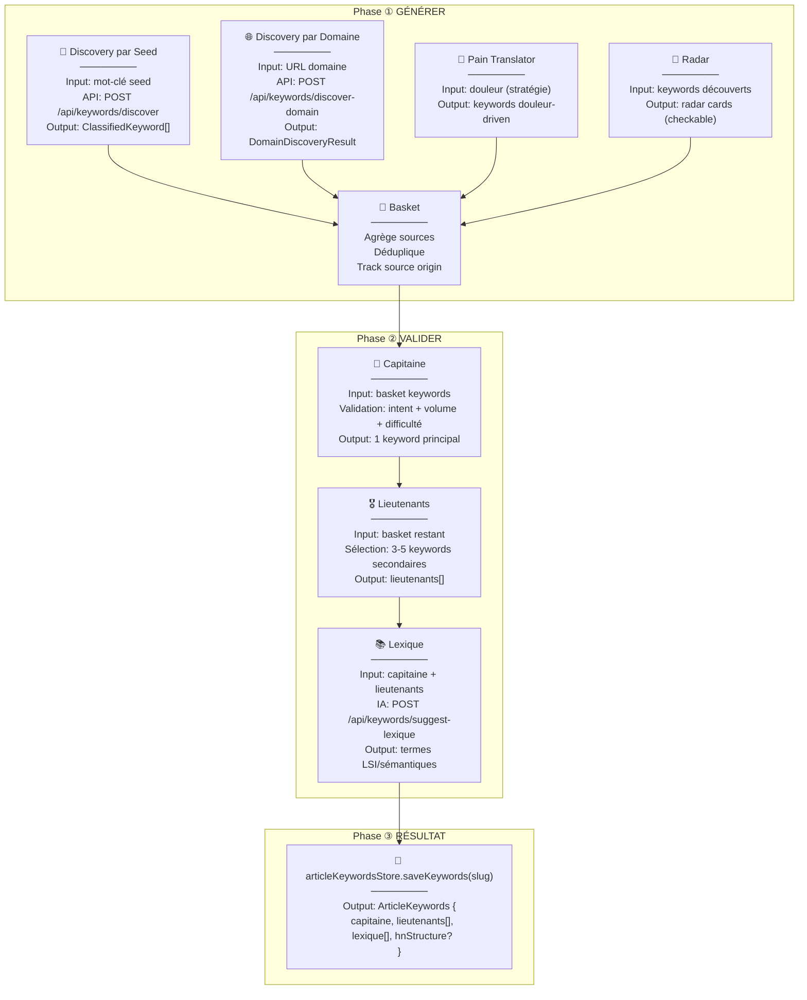
```mermaid
graph TB
    subgraph Phase1["Phase ① GÉNÉRER"]
        direction TB
        SEED["🌱 Discovery par Seed<br>────────<br>Input: mot-clé seed<br>API: POST /api/keywords/discover<br>Output: ClassifiedKeyword[]"]
        DOMAIN["🌐 Discovery par Domaine<br>────────<br>Input: URL domaine<br>API: POST /api/keywords/discover-domain<br>Output: DomainDiscoveryResult"]
        PAIN["💊 Pain Translator<br>────────<br>Input: douleur (stratégie)<br>Output: keywords douleur-driven"]
        RADAR["📡 Radar<br>────────<br>Input: keywords découverts<br>Output: radar cards (checkable)"]
        BASKET["🧺 Basket<br>────────<br>Agrège sources<br>Déduplique<br>Track source origin"]

        SEED --> BASKET
        DOMAIN --> BASKET
        PAIN --> BASKET
        RADAR --> BASKET
    end

    subgraph Phase2["Phase ② VALIDER"]
        direction TB
        CAPT["👑 Capitaine<br>────────<br>Input: basket keywords<br>Validation: intent + volume + difficulté<br>Output: 1 keyword principal"]
        LT["🎖️ Lieutenants<br>────────<br>Input: basket restant<br>Sélection: 3-5 keywords secondaires<br>Output: lieutenants[]"]
        LEX["📚 Lexique<br>────────<br>Input: capitaine + lieutenants<br>IA: POST /api/keywords/suggest-lexique<br>Output: termes LSI/sémantiques"]

        CAPT --> LT --> LEX
    end

    subgraph Result["Phase ③ RÉSULTAT"]
        SAVE["💾 articleKeywordsStore.saveKeywords(slug)<br>────────<br>Output: ArticleKeywords {<br>  capitaine, lieutenants[],<br>  lexique[], hnStructure?<br>}"]
    end

    BASKET --> CAPT
    LEX --> SAVE
```

### Filtres Discovery

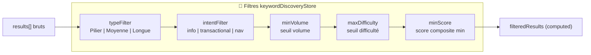
```mermaid
graph LR
    subgraph Filters["🔧 Filtres keywordDiscoveryStore"]
        TYPE["typeFilter<br>Pilier | Moyenne | Longue"]
        INTENT["intentFilter<br>info | transactional | nav"]
        VOL["minVolume<br>seuil volume"]
        DIFF["maxDifficulty<br>seuil difficulté"]
        SCORE["minScore<br>score composite min"]
    end

    RAW["results[] bruts"] --> TYPE --> INTENT --> VOL --> DIFF --> SCORE --> FILTERED["filteredResults (computed)"]
```

### Basket — Flux détaillé

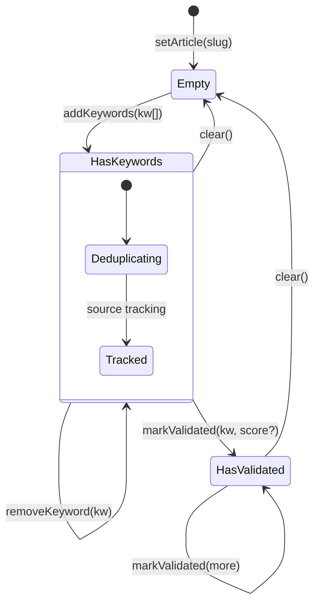
```mermaid
stateDiagram-v2
    [*] --> Empty: setArticle(slug)
    Empty --> HasKeywords: addKeywords(kw[])
    HasKeywords --> HasKeywords: addKeywords(more)
    HasKeywords --> HasKeywords: removeKeyword(kw)
    HasKeywords --> HasValidated: markValidated(kw, score?)
    HasValidated --> HasValidated: markValidated(more)
    HasValidated --> Empty: clear()
    HasKeywords --> Empty: clear()

    state HasKeywords {
        [*] --> Deduplicating
        Deduplicating --> Tracked: source tracking
    }
```

---

## 7. Workflow Article (Rédaction)

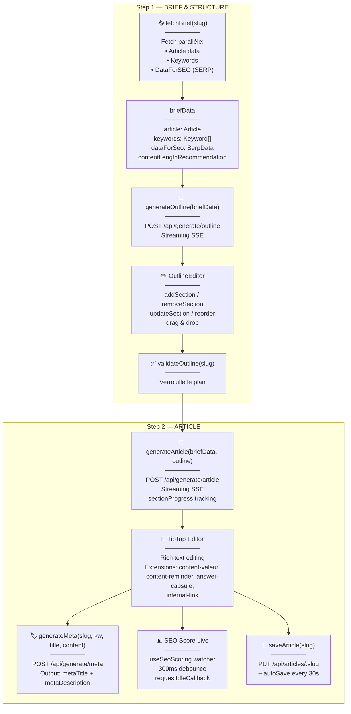
```mermaid
graph TB
    subgraph Step1["Step 1 — BRIEF & STRUCTURE"]
        FETCH["📥 fetchBrief(slug)<br>────────<br>Fetch parallèle:<br>• Article data<br>• Keywords<br>• DataForSEO (SERP)"]
        BRIEF_DATA["briefData<br>────────<br>article: Article<br>keywords: Keyword[]<br>dataForSeo: SerpData<br>contentLengthRecommendation"]
        GEN_OUTLINE["🤖 generateOutline(briefData)<br>────────<br>POST /api/generate/outline<br>Streaming SSE"]
        EDIT_OUTLINE["✏️ OutlineEditor<br>────────<br>addSection / removeSection<br>updateSection / reorder<br>drag & drop"]
        VALIDATE["✅ validateOutline(slug)<br>────────<br>Verrouille le plan"]

        FETCH --> BRIEF_DATA
        BRIEF_DATA --> GEN_OUTLINE
        GEN_OUTLINE --> EDIT_OUTLINE
        EDIT_OUTLINE --> VALIDATE
    end

    subgraph Step2["Step 2 — ARTICLE"]
        GEN_ARTICLE["🤖 generateArticle(briefData, outline)<br>────────<br>POST /api/generate/article<br>Streaming SSE<br>sectionProgress tracking"]
        EDITOR["📝 TipTap Editor<br>────────<br>Rich text editing<br>Extensions: content-valeur,<br>content-reminder, answer-capsule,<br>internal-link"]
        GEN_META["🏷️ generateMeta(slug, kw, title, content)<br>────────<br>POST /api/generate/meta<br>Output: metaTitle + metaDescription"]
        SEO_LIVE["📊 SEO Score Live<br>────────<br>useSeoScoring watcher<br>300ms debounce<br>requestIdleCallback"]
        SAVE_ART["💾 saveArticle(slug)<br>────────<br>PUT /api/articles/:slug<br>+ autoSave every 30s"]

        GEN_ARTICLE --> EDITOR
        EDITOR --> GEN_META
        EDITOR --> SEO_LIVE
        EDITOR --> SAVE_ART
    end

    VALIDATE --> GEN_ARTICLE
```

### Article Workflow — Vue complète des panneaux

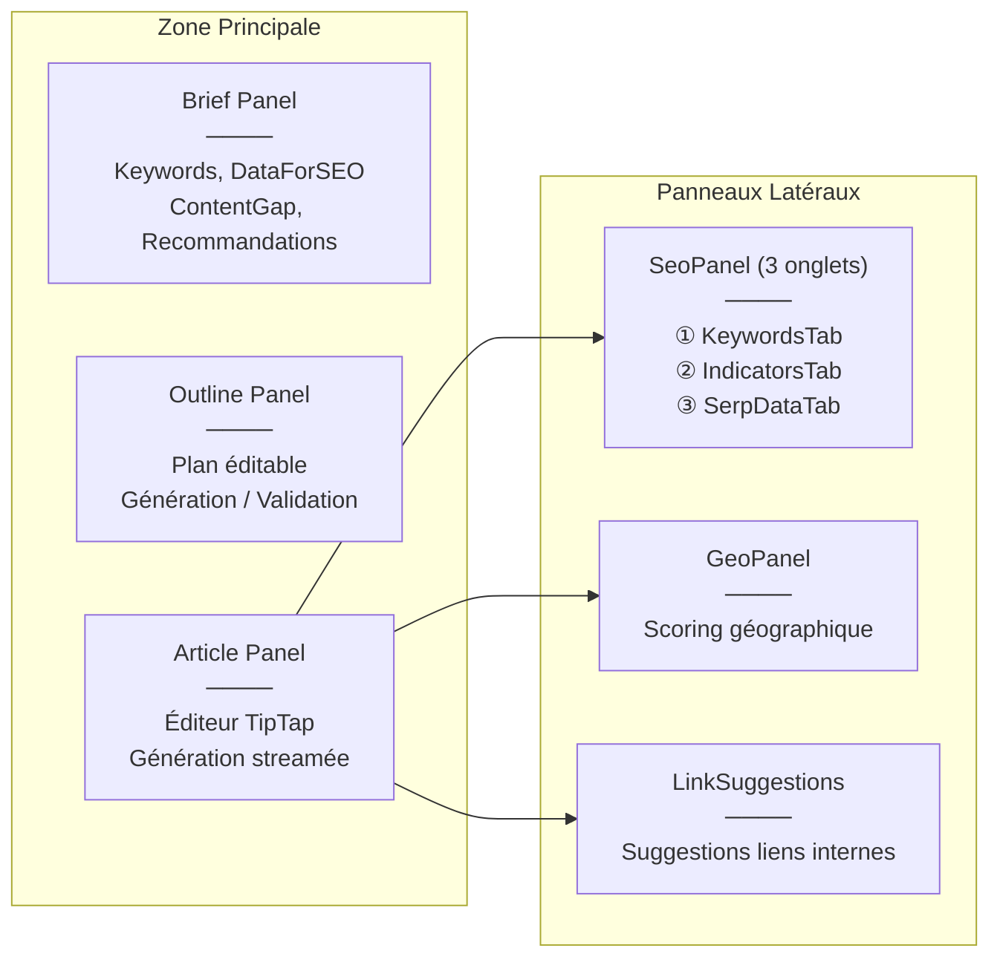
```mermaid
graph LR
    subgraph MainContent["Zone Principale"]
        BRIEF_PANEL["Brief Panel<br>────<br>Keywords, DataForSEO<br>ContentGap, Recommandations"]
        OUTLINE_PANEL["Outline Panel<br>────<br>Plan éditable<br>Génération / Validation"]
        ARTICLE_PANEL["Article Panel<br>────<br>Éditeur TipTap<br>Génération streamée"]
    end

    subgraph SidePanels["Panneaux Latéraux"]
        SEO_PANEL["SeoPanel (3 onglets)<br>────<br>① KeywordsTab<br>② IndicatorsTab<br>③ SerpDataTab"]
        GEO_PANEL["GeoPanel<br>────<br>Scoring géographique"]
        LINK_PANEL["LinkSuggestions<br>────<br>Suggestions liens internes"]
    end

    ARTICLE_PANEL --> SEO_PANEL
    ARTICLE_PANEL --> GEO_PANEL
    ARTICLE_PANEL --> LINK_PANEL
```

---

## 8. SEO Scoring en temps réel

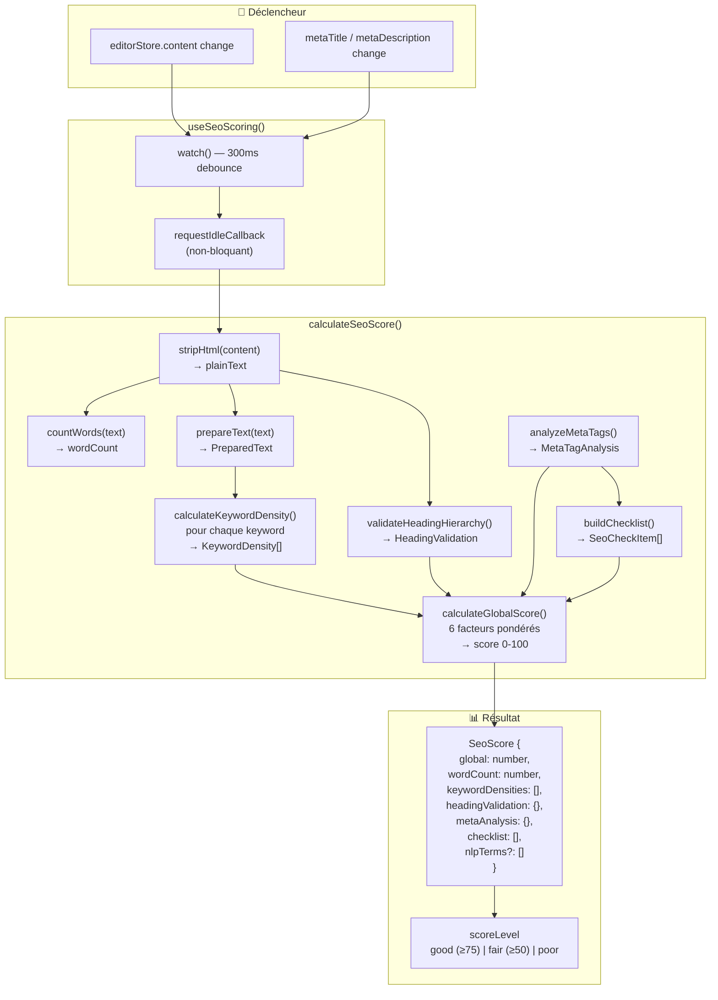
```mermaid
graph TB
    subgraph Trigger["🔄 Déclencheur"]
        CONTENT["editorStore.content change"]
        META["metaTitle / metaDescription change"]
    end

    subgraph Composable["useSeoScoring()"]
        WATCH["watch() — 300ms debounce"]
        IDLE["requestIdleCallback<br>(non-bloquant)"]
    end

    subgraph Calculation["calculateSeoScore()"]
        direction TB
        STRIP["stripHtml(content)<br>→ plainText"]
        WORDS["countWords(text)<br>→ wordCount"]
        PREPARE["prepareText(text)<br>→ PreparedText"]
        DENSITY["calculateKeywordDensity()<br>pour chaque keyword<br>→ KeywordDensity[]"]
        HEADINGS["validateHeadingHierarchy()<br>→ HeadingValidation"]
        META_ANAL["analyzeMetaTags()<br>→ MetaTagAnalysis"]
        CHECKLIST["buildChecklist()<br>→ SeoCheckItem[]"]
        GLOBAL["calculateGlobalScore()<br>6 facteurs pondérés<br>→ score 0-100"]

        STRIP --> WORDS
        STRIP --> PREPARE
        PREPARE --> DENSITY
        STRIP --> HEADINGS
        META_ANAL --> CHECKLIST
        DENSITY --> GLOBAL
        HEADINGS --> GLOBAL
        META_ANAL --> GLOBAL
        CHECKLIST --> GLOBAL
    end

    subgraph Output["📊 Résultat"]
        SCORE["SeoScore {<br>  global: number,<br>  wordCount: number,<br>  keywordDensities: [],<br>  headingValidation: {},<br>  metaAnalysis: {},<br>  checklist: [],<br>  nlpTerms?: []<br>}"]
        LEVEL["scoreLevel<br>good (≥75) | fair (≥50) | poor"]
    end

    CONTENT --> WATCH
    META --> WATCH
    WATCH --> IDLE
    IDLE --> STRIP
    GLOBAL --> SCORE
    SCORE --> LEVEL
```

### Pondération du score global

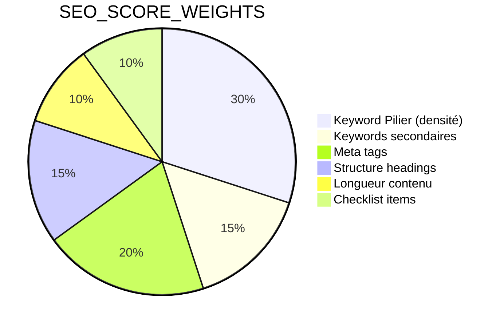
```mermaid
pie title SEO_SCORE_WEIGHTS
    "Keyword Pilier (densité)" : 30
    "Keywords secondaires" : 15
    "Meta tags" : 20
    "Structure headings" : 15
    "Longueur contenu" : 10
    "Checklist items" : 10
```

### SeoPanel — Onglets & Sous-composants

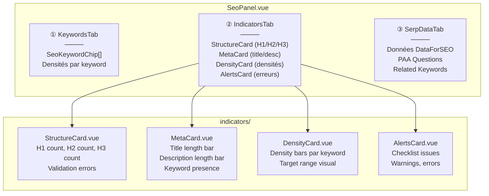
```mermaid
graph TB
    subgraph SeoPanel["SeoPanel.vue"]
        TAB1["① KeywordsTab<br>────<br>SeoKeywordChip[]<br>Densités par keyword"]
        TAB2["② IndicatorsTab<br>────<br>StructureCard (H1/H2/H3)<br>MetaCard (title/desc)<br>DensityCard (densités)<br>AlertsCard (erreurs)"]
        TAB3["③ SerpDataTab<br>────<br>Données DataForSEO<br>PAA Questions<br>Related Keywords"]
    end

    subgraph Indicators["indicators/"]
        STRUCT["StructureCard.vue<br>H1 count, H2 count, H3 count<br>Validation errors"]
        META_C["MetaCard.vue<br>Title length bar<br>Description length bar<br>Keyword presence"]
        DENS_C["DensityCard.vue<br>Density bars par keyword<br>Target range visual"]
        ALERT_C["AlertsCard.vue<br>Checklist issues<br>Warnings, errors"]
    end

    TAB2 --> STRUCT
    TAB2 --> META_C
    TAB2 --> DENS_C
    TAB2 --> ALERT_C
```

---

## 9. Keyword Matching (NLP Français)

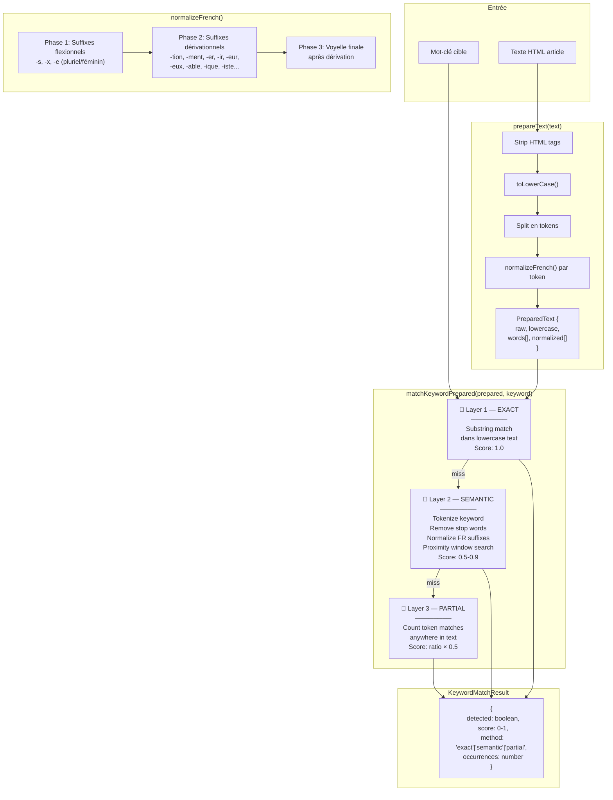
```mermaid
graph TB
    subgraph Input["Entrée"]
        TEXT["Texte HTML article"]
        KW["Mot-clé cible"]
    end

    subgraph Prepare["prepareText(text)"]
        STRIP_HTML["Strip HTML tags"]
        LOWER["toLowerCase()"]
        TOKENIZE["Split en tokens"]
        NORMALIZE["normalizeFrench() par token"]
        PREPARED["PreparedText {<br>  raw, lowercase,<br>  words[], normalized[]<br>}"]

        STRIP_HTML --> LOWER --> TOKENIZE --> NORMALIZE --> PREPARED
    end

    subgraph Match["matchKeywordPrepared(prepared, keyword)"]
        direction TB
        L1["🎯 Layer 1 — EXACT<br>────────<br>Substring match<br>dans lowercase text<br>Score: 1.0"]
        L2["🧠 Layer 2 — SEMANTIC<br>────────<br>Tokenize keyword<br>Remove stop words<br>Normalize FR suffixes<br>Proximity window search<br>Score: 0.5-0.9"]
        L3["📍 Layer 3 — PARTIAL<br>────────<br>Count token matches<br>anywhere in text<br>Score: ratio × 0.5"]

        L1 -->|"miss"| L2
        L2 -->|"miss"| L3
    end

    subgraph FrenchNLP["normalizeFrench()"]
        PH1["Phase 1: Suffixes flexionnels<br>-s, -x, -e (pluriel/féminin)"]
        PH2["Phase 2: Suffixes dérivationnels<br>-tion, -ment, -er, -ir, -eur,<br>-eux, -able, -ique, -iste..."]
        PH3["Phase 3: Voyelle finale<br>après dérivation"]

        PH1 --> PH2 --> PH3
    end

    subgraph Output["KeywordMatchResult"]
        RES["{<br>  detected: boolean,<br>  score: 0-1,<br>  method: 'exact'|'semantic'|'partial',<br>  occurrences: number<br>}"]
    end

    TEXT --> STRIP_HTML
    KW --> L1
    PREPARED --> L1
    L3 --> RES
    L2 --> RES
    L1 --> RES
```

### Exemples de normalisation française

| Mot original | Phase 1 | Phase 2 | Phase 3 | Résultat |
|-------------|---------|---------|---------|----------|
| `créations` | `création` | `cré` | `cré` | `cré` |
| `optimiser` | `optimiser` | `optim` | `optim` | `optim` |
| `référencement` | `référencement` | `référenc` | `référenc` | `référenc` |
| `naturelles` | `naturell` | `natur` | `natur` | `natur` |

---

## 10. Streaming & Génération IA

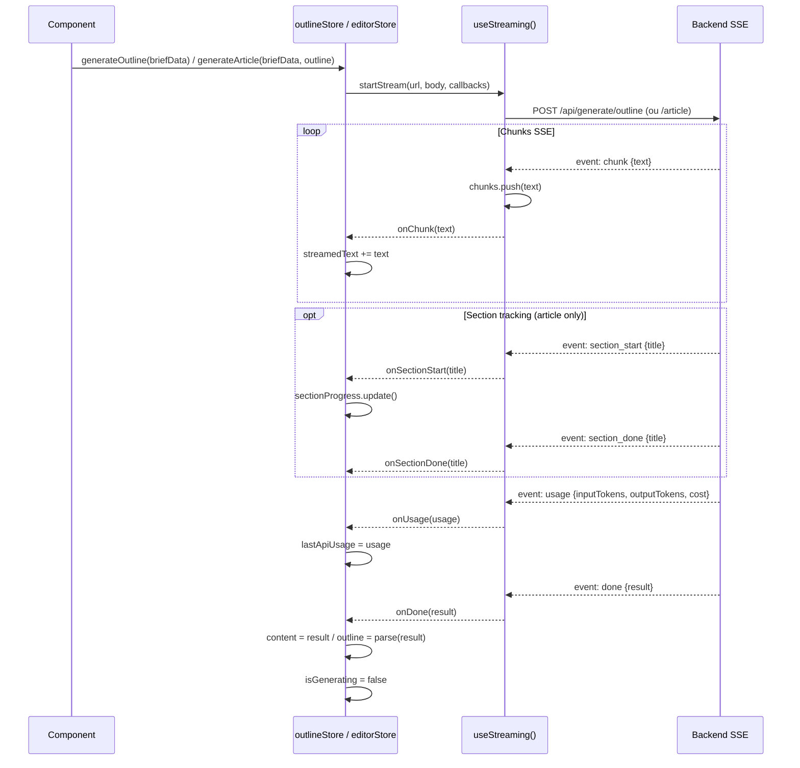
```mermaid
sequenceDiagram
    participant UI as Component
    participant Store as outlineStore / editorStore
    participant Hook as useStreaming()
    participant API as Backend SSE

    UI->>Store: generateOutline(briefData) / generateArticle(briefData, outline)
    Store->>Hook: startStream(url, body, callbacks)
    Hook->>API: POST /api/generate/outline (ou /article)

    loop Chunks SSE
        API-->>Hook: event: chunk {text}
        Hook->>Hook: chunks.push(text)
        Hook-->>Store: onChunk(text)
        Store->>Store: streamedText += text
    end

    opt Section tracking (article only)
        API-->>Hook: event: section_start {title}
        Hook-->>Store: onSectionStart(title)
        Store->>Store: sectionProgress.update()

        API-->>Hook: event: section_done {title}
        Hook-->>Store: onSectionDone(title)
    end

    API-->>Hook: event: usage {inputTokens, outputTokens, cost}
    Hook-->>Store: onUsage(usage)
    Store->>Store: lastApiUsage = usage

    API-->>Hook: event: done {result}
    Hook-->>Store: onDone(result)
    Store->>Store: content = result / outline = parse(result)
    Store->>Store: isGenerating = false
```

### useStreaming — État interne

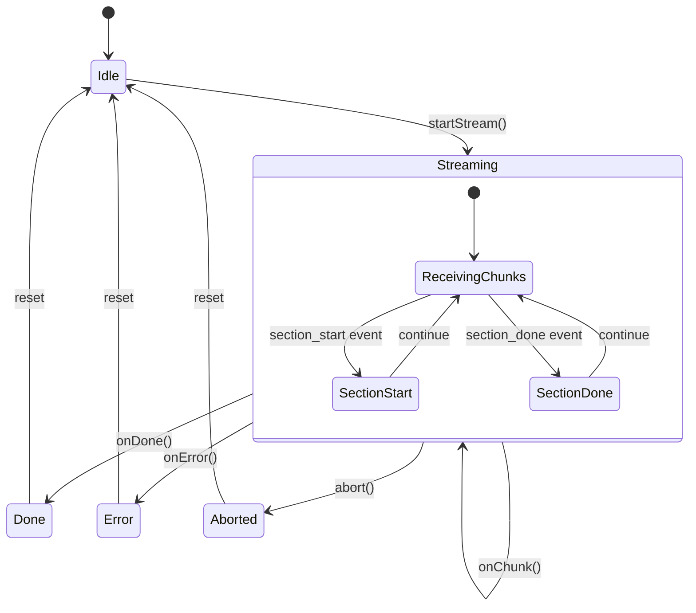
```mermaid
stateDiagram-v2
    [*] --> Idle
    Idle --> Streaming: startStream()
    Streaming --> Streaming: onChunk()
    Streaming --> Done: onDone()
    Streaming --> Error: onError()
    Streaming --> Aborted: abort()
    Done --> Idle: reset
    Error --> Idle: reset
    Aborted --> Idle: reset

    state Streaming {
        [*] --> ReceivingChunks
        ReceivingChunks --> SectionStart: section_start event
        SectionStart --> ReceivingChunks: continue
        ReceivingChunks --> SectionDone: section_done event
        SectionDone --> ReceivingChunks: continue
    }
```

---

## 11. Linking Interne

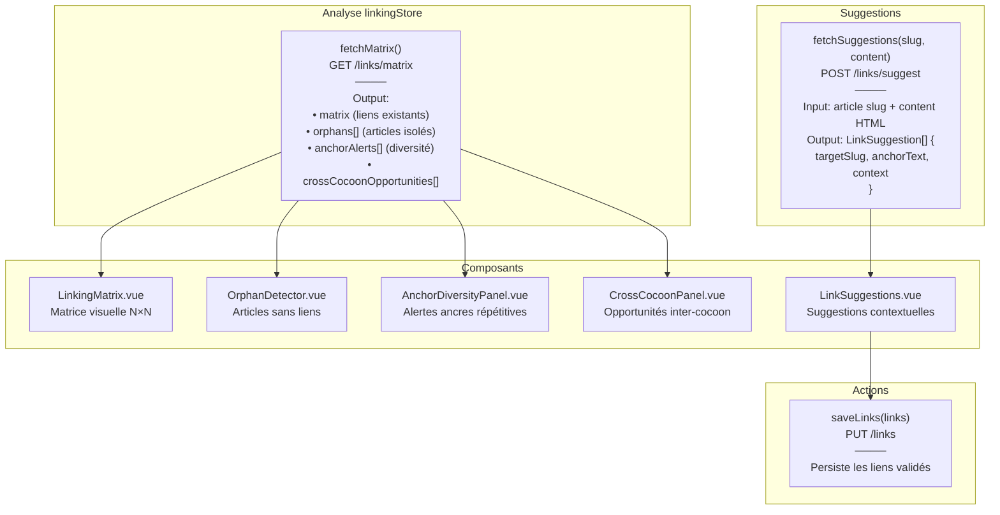
```mermaid
graph TB
    subgraph Analysis["Analyse linkingStore"]
        FETCH_MATRIX["fetchMatrix()<br>GET /links/matrix<br>────<br>Output:<br>• matrix (liens existants)<br>• orphans[] (articles isolés)<br>• anchorAlerts[] (diversité)<br>• crossCocoonOpportunities[]"]
    end

    subgraph Suggestions["Suggestions"]
        FETCH_SUG["fetchSuggestions(slug, content)<br>POST /links/suggest<br>────<br>Input: article slug + content HTML<br>Output: LinkSuggestion[] {<br>  targetSlug, anchorText, context<br>}"]
    end

    subgraph Actions["Actions"]
        SAVE["saveLinks(links)<br>PUT /links<br>────<br>Persiste les liens validés"]
    end

    subgraph Components["Composants"]
        MATRIX_C["LinkingMatrix.vue<br>Matrice visuelle N×N"]
        ORPHAN_C["OrphanDetector.vue<br>Articles sans liens"]
        ANCHOR_C["AnchorDiversityPanel.vue<br>Alertes ancres répétitives"]
        CROSS_C["CrossCocoonPanel.vue<br>Opportunités inter-cocoon"]
        SUG_C["LinkSuggestions.vue<br>Suggestions contextuelles"]
    end

    FETCH_MATRIX --> MATRIX_C
    FETCH_MATRIX --> ORPHAN_C
    FETCH_MATRIX --> ANCHOR_C
    FETCH_MATRIX --> CROSS_C
    FETCH_SUG --> SUG_C
    SUG_C --> SAVE
```

---

## 12. Hiérarchie des composants

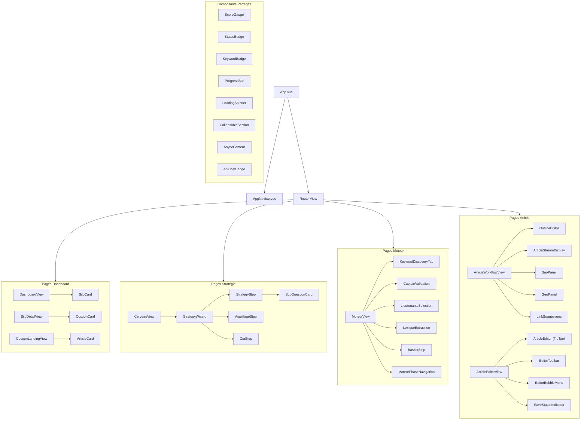
```mermaid
graph TB
    APP["App.vue"]
    NAV["AppNavbar.vue"]

    APP --> NAV
    APP --> ROUTER["RouterView"]

    subgraph DashViews["Pages Dashboard"]
        DASH_V["DashboardView"]
        SILO_V["SiloDetailView"]
        COCOON_V["CocoonLandingView"]

        DASH_V --> SILO_CARD["SiloCard"]
        SILO_V --> COCOON_CARD["CocoonCard"]
        COCOON_V --> ART_CARD["ArticleCard"]
    end

    subgraph StratViews["Pages Stratégie"]
        CERV_V["CerveauView"]
        CERV_V --> STRAT_WIZ["StrategyWizard"]
        STRAT_WIZ --> STRAT_STEP["StrategyStep"]
        STRAT_WIZ --> AIGU_STEP["AiguillageStep"]
        STRAT_WIZ --> CTA_STEP["CtaStep"]
        STRAT_STEP --> SUBQ["SubQuestionCard"]
    end

    subgraph MoteurViews["Pages Moteur"]
        MOT_V["MoteurView"]
        MOT_V --> DISC_TAB["KeywordDiscoveryTab"]
        MOT_V --> CAPT_VAL["CaptainValidation"]
        MOT_V --> LT_SEL["LieutenantsSelection"]
        MOT_V --> LEX_EXT["LexiqueExtraction"]
        MOT_V --> BASKET_S["BasketStrip"]
        MOT_V --> PHASE_NAV["MoteurPhaseNavigation"]
    end

    subgraph ArticleViews["Pages Article"]
        ART_WF["ArticleWorkflowView"]
        ART_ED["ArticleEditorView"]

        ART_WF --> OUTLINE_ED["OutlineEditor"]
        ART_WF --> ART_STREAM["ArticleStreamDisplay"]
        ART_WF --> SEO_P["SeoPanel"]
        ART_WF --> GEO_P["GeoPanel"]
        ART_WF --> LINK_S["LinkSuggestions"]

        ART_ED --> TIPTAP["ArticleEditor (TipTap)"]
        ART_ED --> TOOLBAR["EditorToolbar"]
        ART_ED --> BUBBLE["EditorBubbleMenu"]
        ART_ED --> SAVE_IND["SaveStatusIndicator"]
    end

    subgraph SharedUI["Composants Partagés"]
        GAUGE["ScoreGauge"]
        BADGE["StatusBadge"]
        KW_BADGE["KeywordBadge"]
        PROGRESS["ProgressBar"]
        SPINNER["LoadingSpinner"]
        COLLAPSE["CollapsableSection"]
        ASYNC["AsyncContent"]
        COST["ApiCostBadge"]
    end

    ROUTER --> DashViews
    ROUTER --> StratViews
    ROUTER --> MoteurViews
    ROUTER --> ArticleViews
```

---

## 13. Référence des Inputs/Outputs

### Composables — Signatures complètes

| Composable | Input | Output | Effet de bord |
|-----------|-------|--------|---------------|
| `useSeoScoring(kw, target?, related?, artKw?, slug?)` | keywords[], number?, Keyword[]?, ArticleKeywords?, string? | `{ seoStore }` | Watch editorStore → recalculate |
| `useStreaming<T>()` | — | `{ chunks, isStreaming, error, result, usage, startStream(), abort() }` | SSE connection |
| `useAutoSave(slug, interval?)` | string, number? | `{ pause(), resume(), isActive }` | setInterval → saveArticle |
| `useCannibalization(slug, cocoon)` | string, string | `{ warnings[], refresh() }` | Fetch capitaine map |
| `useInternalLinking(slug)` | string | `{ suggestions[], isSuggesting, requestSuggestions(), dismissSuggestion() }` | API call |
| `usePanelToggle(default?)` | string? | `{ activePanel, toggle(), showSeoPanel, showGeoPanel, ... }` | — |
| `useIntentVerdict()` | — | `{ verdicts[], topVerdict }` | Watch intentStore |
| `useKeywordDiscoveryTab()` | — | `{ hasResults, cacheStatus, wordGroups, reset() }` | Watch discoveryStore |
| `useArticleResults(onRadarLoaded?)` | callback? | `{ clearResults(), loadCachedResults() }` | Cache management |
| `useResizablePanel()` | — | `{ width, height, startResize() }` | Mouse event listeners |

### Utilitaires — Fonctions exportées

| Fonction | Input | Output |
|----------|-------|--------|
| `countWords(text)` | string | number |
| `calculateKeywordDensity(html, keyword, prepared?)` | string, string, PreparedText? | KeywordDensity |
| `validateHeadingHierarchy(html)` | string | HeadingValidation |
| `calculateSeoScore(content, kw, meta, desc, ...)` | 8 params | SeoScore |
| `normalizeFrench(word)` | string | string |
| `prepareText(text)` | string | PreparedText |
| `matchKeywordPrepared(prepared, keyword)` | PreparedText, string | KeywordMatchResult |
| `matchKeyword(text, keyword)` | string, string | KeywordMatchResult |

### Types principaux — Champs clés

| Type | Champs clés |
|------|-------------|
| `Article` | title, type (Pilier\|Intermédiaire\|Spécialisé), slug, topic, status |
| `Keyword` | keyword, cocoonName, type, status (suggested\|validated\|rejected) |
| `ArticleKeywords` | articleSlug, capitaine, lieutenants[], lexique[], hnStructure? |
| `BriefData` | article, keywords[], dataForSeo?, contentLengthRecommendation |
| `Outline` | sections: OutlineSection[] { id, level, title, annotation } |
| `SeoScore` | global (0-100), wordCount, keywordDensities[], headingValidation, metaAnalysis, checklist[] |
| `ArticleStrategy` | slug, cible, douleur, aiguillage, angle, promesse, cta, completedSteps |
| `IntentAnalysis` | keyword, modules[], scores[], dominantIntent, topOrganicResults[], paaQuestions[] |
| `ClassifiedKeyword` | keyword, type, intent, searchVolume, difficulty, compositeScore |
| `LinkingMatrix` | links[], orphans[], anchorAlerts[], crossCocoonOpportunities[] |
| `KeywordMatchResult` | detected, score (0-1), method (exact\|semantic\|partial), occurrences |

---

## Annexe — API Endpoints

| Méthode | Endpoint | Store | Description |
|---------|----------|-------|-------------|
| GET | `/api/theme` | silosStore | Config thème |
| GET | `/api/silos` | silosStore | Liste silos |
| GET | `/api/cocoons` | cocoonsStore | Liste cocoons |
| GET | `/api/articles?cocoon=id` | articlesStore | Articles d'un cocoon |
| GET | `/api/articles/:slug` | briefStore | Détail article |
| PUT | `/api/articles/:slug` | editorStore | Sauvegarde article |
| POST | `/api/generate/outline` | outlineStore | Génération plan (SSE) |
| POST | `/api/generate/article` | editorStore | Génération article (SSE) |
| POST | `/api/generate/meta` | editorStore | Génération meta tags |
| GET | `/api/article-keywords/:slug` | articleKeywordsStore | Keywords d'un article |
| PUT | `/api/article-keywords/:slug` | articleKeywordsStore | Sauvegarde keywords |
| POST | `/api/keywords/discover` | keywordDiscoveryStore | Discovery par seed |
| POST | `/api/keywords/discover-domain` | keywordDiscoveryStore | Discovery par domaine |
| POST | `/api/keywords/suggest-lexique` | articleKeywordsStore | Suggestion LSI |
| POST | `/api/keywords/audit` | keywordAuditStore | Audit keywords |
| POST | `/intent/analyze` | intentStore | Analyse intention |
| POST | `/keywords/compare-local` | intentStore | Comparaison local/national |
| POST | `/keywords/autocomplete` | intentStore | Validation autocomplete |
| GET | `/api/strategies/:slug` | strategyStore | Fetch stratégie |
| PUT | `/api/strategies/:slug` | strategyStore | Sauvegarde stratégie |
| POST | `/api/strategies/suggest` | strategyStore | Suggestion IA |
| POST | `/api/strategies/deepen` | strategyStore | Approfondissement |
| POST | `/api/strategies/consolidate` | strategyStore | Consolidation |
| GET | `/links/matrix` | linkingStore | Matrice liens |
| POST | `/links/suggest` | linkingStore | Suggestions liens |
| PUT | `/links` | linkingStore | Sauvegarde liens |
| GET | `/api/progress/:slug` | articleProgressStore | Progress article |
| PUT | `/api/progress/:slug` | articleProgressStore | Sauvegarde progress |
