# Guide 1 — Utilisation

> Le manuel complet : les trois ateliers, les deux façons de s'en servir,
> toutes les commandes et toutes les options.
> Si tu cherches « comment faire X », va plutôt dans
> [GUIDE-03-CAS-PRATIQUES.md](GUIDE-03-CAS-PRATIQUES.md).

---

## 1. Les deux portes d'entrée

| | Application web | Robot (ligne de commande) |
|---|---|---|
| **Comment** | `npm run dev` puis http://localhost:5400 | `npm run auto:article -- --mode=real` |
| **Rythme** | Tu cliques étape par étape. | Tout s'enchaîne, 2 pauses de validation. |
| **Contrôle** | Total : tu choisis chaque mot-clé. | Le robot décide, tu valides. |
| **Durée** | Une à plusieurs heures. | Le temps d'un café (plus long pour un pilier). |
| **Quand l'utiliser** | Article important, sujet délicat, ou pour apprendre. | Production régulière, articles de série. |

Les deux utilisent **le même serveur, les mêmes règles, la même base**.
C'est la même cuisine : soit tu tiens la poêle, soit le robot la tient.

---

## 2. Le parcours complet

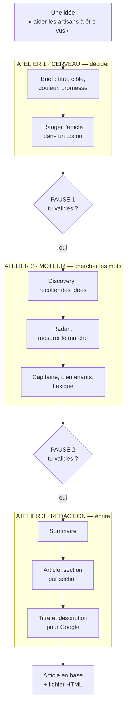

Chaque atelier a un rôle simple :

| Atelier | Question à laquelle il répond | Ce qu'il produit |
|---|---|---|
| **Cerveau** | De quoi je parle, à qui, et pourquoi ça l'intéresse ? | Un article créé en base, avec sa stratégie. |
| **Moteur** | Quels mots les gens tapent-ils vraiment dans Google ? | Un Capitaine, des Lieutenants, un Lexique. |
| **Rédaction** | Comment j'écris tout ça ? | Le texte, le titre Google, la description. |

### La grille de lecture : les 8 temps d'une étape

Toutes les étapes du projet, de Discovery à l'export, suivent le même trajet en
8 temps. Une fois la grille en tête, tu lis n'importe quel atelier de la même façon :
chaque encadré « En coulisses » de ce guide se termine par sa grille.

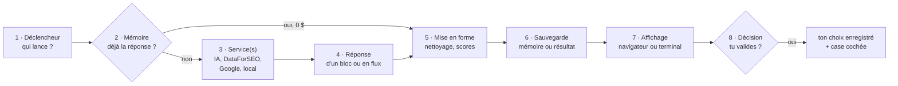

Image : une commande au restaurant.

| Temps | Au restaurant | Dans le projet |
|---|---|---|
| 1 · Déclencheur | Tu commandes. | Un clic, le robot, ou un départ automatique. |
| 2 · Mémoire | Le cuisinier regarde s'il reste un plat prêt au frigo. | « Ai-je déjà cette réponse, et est-elle assez récente ? » |
| 3 · Service(s) | Il cuisine, ou appelle son fournisseur. | Claude, DataForSEO, Google, ou un calcul sur ta machine. |
| 4 · Réponse | Le plat sort de la cuisine. | D'un bloc, ou en flux (mot à mot). |
| 5 · Mise en forme | Le dressage dans l'assiette. | Nettoyage du texte, calcul des scores, tri. |
| 6 · Sauvegarde | Il met une part de côté au frigo. | La mémoire d'achat (pour ne pas repayer) et le résultat. |
| 7 · Affichage | Le serveur apporte l'assiette. | L'écran du navigateur, ou le terminal pour le robot. |
| 8 · Décision | Tu goûtes et dis « c'est parfait ». | Tu verrouilles, tu coches, tu tapes Entrée : ton choix est enregistré. |

Trois exceptions à garder en tête, parce qu'elles expliquent bien des surprises :

- **L'ordre des temps 6 et 7 varie.** Le scan du Capitaine enregistre *avant*
  d'afficher. Un article s'affiche mot à mot, *puis* est enregistré. Le brief du robot
  n'est enregistré qu'*après* ta décision.
- **Le temps 3 peut être vide.** Le Lexique et le maillage interne ne sortent pas de
  ta machine : ce sont des calculs, gratuits.
- **En flux, les temps 4 et 7 se superposent** : tu lis le texte pendant qu'il s'écrit.

---

## 3. Atelier 1 — Le Cerveau

Le Cerveau, c'est le moment où l'on décide **avant** d'écrire. Comme un architecte
qui dessine le plan avant que le maçon pose la première pierre.

### Deux niveaux de stratégie

| Niveau | Où | Étapes |
|---|---|---|
| **Stratégie de cocon** | Une fois par étagère | cible → douleur → angle → promesse → CTA, puis génération de la liste d'articles |
| **Stratégie d'article** | Pour chaque article | cible → douleur → **aiguillage** → angle → promesse → CTA |

L'*aiguillage*, c'est l'étape qui dit vers quel autre article renvoyer le lecteur.

> ⚠️ **Aujourd'hui, seul le robot remplit la stratégie d'article.** Dans l'application,
> l'écran existe mais n'est branché à aucun bouton. Pour un article rédigé dans
> l'application, écris tes consignes dans le **micro-contexte** (étape brief) : c'est
> lui que la Rédaction lira.

### En coulisses : le Cerveau du robot

Tu tapes une phrase ; voici qui travaille, dans l'ordre.

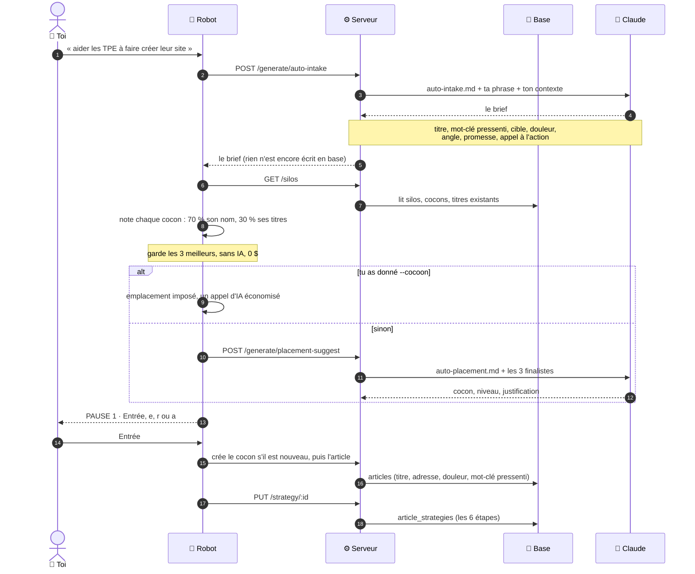

**La grille :**

| Temps | Le brief | Le choix du cocon |
|---|---|---|
| 1 · Déclencheur | ta phrase, et ton contexte business | le robot, juste après le brief ; sauté avec `--cocoon` |
| 2 · Mémoire | aucune | aucune (le robot lit l'arbre des cocons, ce n'est pas un cache) |
| 3 · Service(s) | 🧠 Claude · `auto-intake.md` | 🏠 présélection des 3 finalistes, puis 🧠 Claude · `auto-placement.md` |
| 4 · Réponse | d'un bloc (JSON) | d'un bloc (JSON) |
| 5 · Mise en forme | niveau « intermédiaire » si l'IA n'en donne pas | cocon, niveau, justification, alternatives |
| 6 · Sauvegarde | **rien** | **rien** |
| 7 · Affichage | le terminal, à la pause 1 | le terminal, à la pause 1 |
| 8 · Décision | `r` refait le brief et le choix (5 fois maximum) | Entrée : l'article et sa stratégie sont enregistrés · `e` : un autre finaliste, en local, 0 $ · `a` : abandon, aucune trace |

Aucun appel à DataForSEO ni à Google dans le Cerveau du robot.

### En coulisses : le plan d'un cocon, dans l'application

C'est la seule étape du Cerveau qui achète des données Google : les vraies questions
des gens (PAA) servent à imaginer les fiches spécialisées.

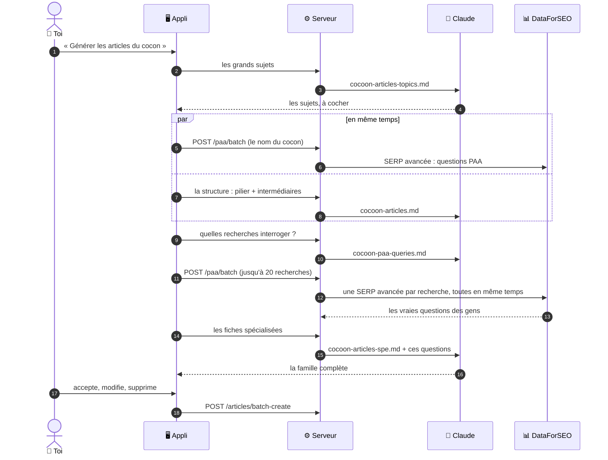

**La grille :**

| Temps | Le plan d'articles du cocon |
|---|---|
| 1 · Déclencheur | ton clic « Générer les articles », à l'étape 6 de la stratégie du cocon |
| 2 · Mémoire | **aucune** : les questions PAA ne sont gardées nulle part |
| 3 · Service(s) | 🧠 Claude ×4 (sujets, structure, recherches, fiches) + 📊 une SERP avancée par recherche, jusqu'à 20 en même temps |
| 4 · Réponse | d'un bloc, pour chaque appel |
| 5 · Mise en forme | seules les questions PAA sont gardées de chaque SERP ; si toutes sont vides, celles du cocon servent pour chaque intermédiaire |
| 6 · Sauvegarde | aucun article n'est créé tant que tu n'as pas accepté |
| 7 · Affichage | la famille proposée, dans le navigateur |
| 8 · Décision | tu acceptes, modifies ou supprimes : les articles acceptés sont créés « à rédiger » |

Chaque question coûte 0,002 $ : régénérer le plan la rachète. Le serveur limite ce
guichet à 5 appels par minute.

### Ce que ça donne en vrai

Tu écris la stratégie du cocon « Création de site web », et l'IA te propose la
famille complète : 1 Pilier, 2 à 4 Intermédiaires, et 2 à 3 Spécialisés par
Intermédiaire. Tu acceptes, modifies ou supprimes chaque proposition. Les articles
acceptés sont créés en base avec le statut **« à rédiger »**.

> **Bon à savoir.** Cette liste d'articles est un **plan**, pas des articles écrits.
> C'est le menu affiché à l'entrée du restaurant : les plats ne sont pas encore cuisinés.

### La configuration du thème

Écran `/config` de l'application. C'est la **carte d'identité de PropulSite** :
ta cible, tes services, tes différenciateurs, ton ton de voix.

Elle nourrit l'assistant de **stratégie de cocon** et les **suggestions de consignes**
d'article. **Elle n'est pas lue pendant la Rédaction** : le ton des articles vient du
fichier `server/prompts/system-propulsite.md`. Pour changer la façon d'écrire, c'est
ce fichier qu'il faut modifier (voir le cas 8 du guide 3).

---

## 4. Atelier 2 — Le Moteur

Le Moteur cherche les mots-clés. Imagine que tu ouvres une boutique : il faut
savoir quelle enseigne mettre sur la façade, et quels mots les passants utilisent
pour chercher ce que tu vends.

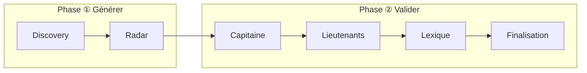

| Onglet | Ce qu'il fait | Image |
|---|---|---|
| **Discovery** | Récolte des idées de mots-clés à partir de ta douleur et de ton sujet. | On ratisse large, on ramasse tout. |
| **Radar** | Mesure chaque mot : volume de recherche, difficulté, concurrence. | On pèse chaque fruit récolté. |
| **Capitaine** | Choisit **le** mot-clé principal et le verrouille. | On grave l'enseigne de la boutique. |
| **Lieutenants** | Choisit 1 à 8 mots-clés secondaires, selon le niveau d'article. | Les rayons visibles en vitrine. |
| **Lexique** | Retient le vocabulaire d'expert attendu sur le sujet. | Le jargon qui prouve que tu es du métier. |
| **Finalisation** | Vérifie que tout est verrouillé avant d'écrire. | Le contrôle avant l'ouverture. |

### En coulisses ① : Discovery et Radar (application)

On ratisse large, puis on pèse. C'est ici que travaillent le plus de services à la fois.

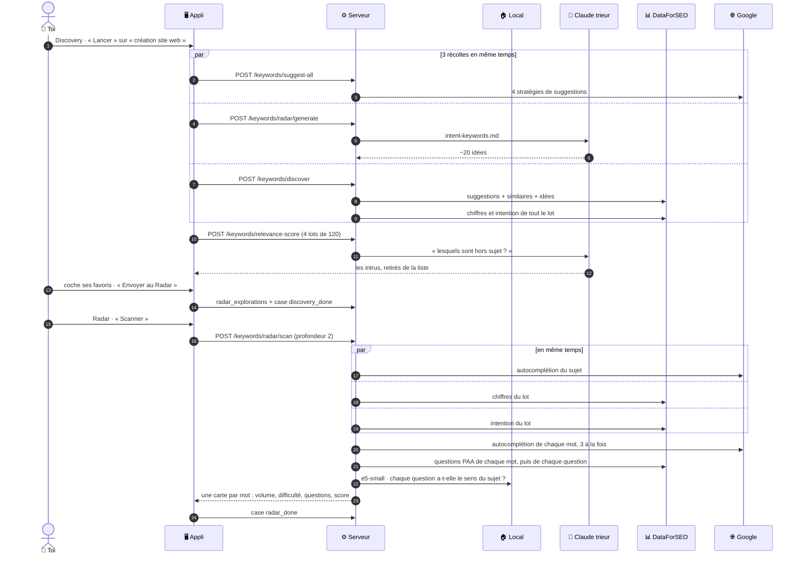

« Profondeur 2 » veut dire que le Radar repose chaque question de Google comme une
nouvelle recherche, pour trouver les questions des questions. C'est plus riche, mais
chaque niveau ajoute une SERP payante (0,002 $) par question.

**La grille :**

| Temps | Discovery | Radar |
|---|---|---|
| 1 · Déclencheur | ton clic « Lancer » | ton clic « Scanner », après « Envoyer au Radar » |
| 2 · Mémoire | récolte gardée 24 h, suggestions Google 1 h | autocomplétion et questions : 1 jour dans `keyword_metrics` · chiffres et intention : **aucune**, rachetés à chaque scan |
| 3 · Service(s) | 🌐 Suggest (4 stratégies) + 🧠 trieur (~20 idées) + 📊 Labs (5 appels), en même temps · puis 🧠 trieur (tri par lots de 120) | 🌐 autocomplétion + 📊 chiffres, intention et questions de chaque mot + 🏠 e5-small |
| 4 · Réponse | d'un bloc, chaque récolte arrivant de son côté | d'un bloc |
| 5 · Mise en forme | mots regroupés par familles, intrus retirés | une carte par mot : score de marché, sens des questions, tri |
| 6 · Sauvegarde | `keyword_discoveries`, dès la fin du chargement | `keyword_metrics` (autocomplétion, questions) et `radar_explorations` |
| 7 · Affichage | la liste : volume, difficulté, intention | les cartes |
| 8 · Décision | tu coches tes favoris et les envoies au Radar : case `discovery_done` | tu envoies tes meilleures cartes au Capitaine (la case `radar_done`, elle, se coche dès la fin du scan) |

### En coulisses ② : le Capitaine (application)

Tu cliques sur un mot-clé candidat. Exemple réel : « création de site web Toulouse ».

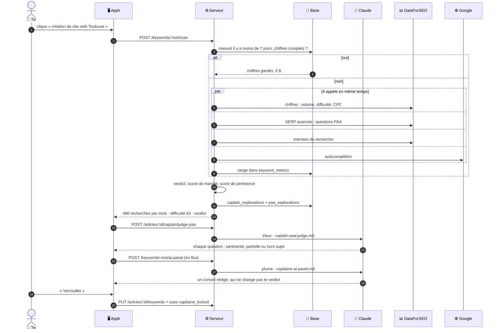

Deux détails : en même temps que le scan, l'application relance un petit Radar sur ce
seul mot ; et si le volume est faible, elle scanne aussi la **racine** du mot-clé,
juste après (par exemple, une version sans la ville).

**La grille :**

| Temps | Le Capitaine |
|---|---|
| 1 · Déclencheur | ton clic sur un mot-clé candidat |
| 2 · Mémoire | `keyword_metrics` : mesuré il y a moins de 7 jours, chiffres complets ? |
| 3 · Service(s) | si non : 📊 ×3 + 🌐 ×1 en même temps · puis 🧠 trieur (jugement des questions) et 🧠 plume (conseil) |
| 4 · Réponse | le scan d'un bloc, le conseil en flux |
| 5 · Mise en forme | verdict, score de marché, score de pertinence (avec la carte du Radar), badge de chaque question |
| 6 · Sauvegarde | **avant l'affichage** : `keyword_metrics`, `captain_explorations`, `paa_explorations` · le jugement des questions n'est pas gardé |
| 7 · Affichage | la carte (480 recherches, difficulté 83, verdict), puis le conseil |
| 8 · Décision | « Verrouiller » : `article_keywords` + case `capitaine_locked` |

### En coulisses ③ : Lieutenants et Lexique (application)

Ici, on va lire les concurrents. Le Lexique ne coûte rien : il travaille sur les pages
déjà lues à l'étape Lieutenants.

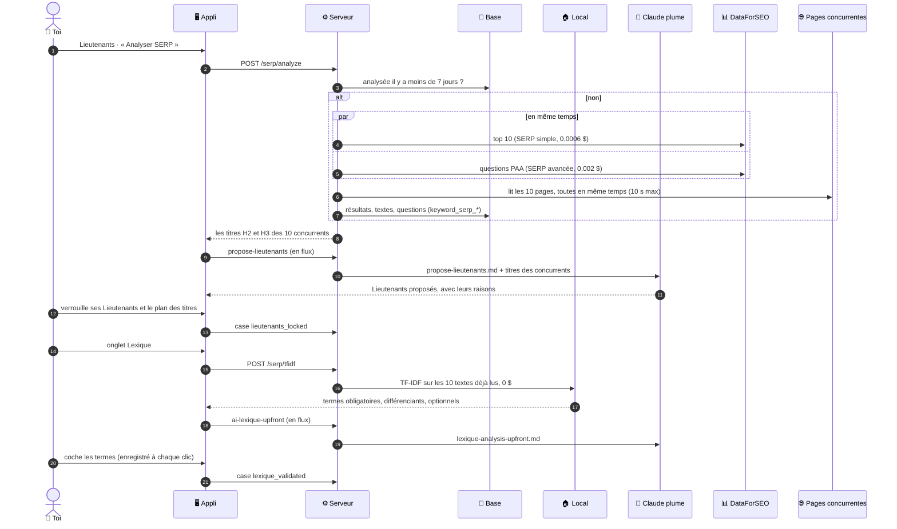

**La grille :**

| Temps | Lieutenants | Lexique |
|---|---|---|
| 1 · Déclencheur | ton clic « Analyser SERP » ; les propositions de l'IA partent toutes seules ensuite | automatique, dès que le Capitaine est verrouillé et son top 10 déjà analysé (sinon, un bouton lance l'analyse) |
| 2 · Mémoire | top 10 analysé il y a moins de 7 jours ? (+ 1 h en mémoire vive) · propositions de moins de 7 jours : pas de nouvel appel d'IA | l'analyse déjà faite, puis les pages déjà lues au Lieutenant |
| 3 · Service(s) | 📊 SERP simple + SERP avancée en même temps, 🌐 lecture des 10 pages, puis 🧠 plume | 🏠 TF-IDF, puis 🧠 plume |
| 4 · Réponse | le top 10 d'un bloc, les propositions en flux | le TF-IDF d'un bloc, l'analyse en flux |
| 5 · Mise en forme | titres H1 à H3 et texte extraits de chaque page | termes classés obligatoires, différenciants, optionnels (50 au plus par niveau) ; les obligatoires sont cochés d'office |
| 6 · Sauvegarde | `keyword_serp_results`, `_scrapes`, `keyword_paa_questions` en une fois · `lieutenant_explorations` | `lexique_explorations` |
| 7 · Affichage | les titres des concurrents, puis les propositions | la liste classée, puis l'analyse |
| 8 · Décision | tu verrouilles Lieutenants et plan des titres : mots-clés, sommaire et longueur conseillée enregistrés + case `lieutenants_locked` | chaque case cochée est enregistrée ; case `lexique_validated` dès le premier terme |

### L'application et le robot ne font pas le même Moteur

| Étape | Application | Robot |
|---|---|---|
| Discovery | 3 récoltes (Google, IA, DataForSEO) + tri par IA | une seule : ~20 idées de l'IA |
| Radar | profondeur 2 | profondeur 1, puis garde les meilleurs selon le marché : 12 (pilier), 8 (intermédiaire), 5 (spécialisé) |
| Capitaine | scan + jugement des questions + conseil de l'IA | scan de chaque candidat, 3 à la fois, choix par calcul ; **aucun scan avec `--capitaine`** |
| Lieutenants | proposés par l'IA | choisis par calcul : 60 % présence chez les concurrents, 40 % marché, **sans IA** |
| Lexique | analysé par l'IA, coché à la main | 30 termes maximum, choisis par calcul, **sans IA** |

Le robot est donc **plus économe** (moins d'appels d'IA et de DataForSEO), l'application
**plus fine** (l'IA et toi arbitrez chaque choix).

> Tous les services, leurs prix et leur mémoire sont détaillés dans
> [GUIDE-04-OUTILS.md](GUIDE-04-OUTILS.md).

### Les 5 cases à cocher

Quand une étape est finie, une case est cochée automatiquement en base
(colonne `completed_checks`). Leurs noms exacts :

| Case | Signification |
|---|---|
| `moteur:discovery_done` | Les idées ont été récoltées. |
| `moteur:radar_done` | Le marché a été mesuré. |
| `moteur:capitaine_locked` | Le mot-clé principal est verrouillé. |
| `moteur:lieutenants_locked` | Les mots-clés secondaires sont verrouillés. |
| `moteur:lexique_validated` | Le vocabulaire est validé. |

Ce sont ces cases que tu vois sous forme de points sur la liste des articles.

### Les mots qui font peur

| Terme | Traduction |
|---|---|
| **SERP** | La page de résultats de Google. L'outil lit les 10 premiers pour voir ce que font les concurrents. |
| **PAA** | Les questions « Autres questions posées » affichées par Google. De l'or : ce sont les vraies questions des gens. |
| **TF-IDF** | Une méthode qui repère les mots que **tous** les concurrents emploient. Si tous parlent d'« hébergement », il faut en parler. |
| **Volume de recherche** | Combien de fois par mois ce mot est tapé dans Google. |
| **Difficulté** | À quel point il sera dur de passer devant les concurrents (0 = facile, 100 = très dur). |
| **Cannibalisation** | Deux de tes articles visent le même mot-clé et se font concurrence. |

---

## 5. Atelier 3 — La Rédaction

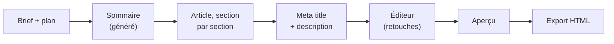

- **Le sommaire** est nourri par les vraies questions PAA de Google et par les
  chapitres que les concurrents traitent tous.
- **L'article** s'écrit section par section. C'est plus lent, mais ça évite que
  l'IA bâcle la fin d'un long texte.
- **Les metas** sont le titre et le résumé affichés dans Google : environ
  60 et 160 caractères.
- **L'éditeur** (TipTap) permet de retoucher à la main, avec sauvegarde automatique.
- **L'export** produit une page HTML au gabarit PropulSite. Le robot la range dans
  `_auto-output/` ; l'application la télécharge (voir l'encadré plus bas).

### En coulisses : la Rédaction

Le robot et l'application suivent le même chemin. Seule différence : le robot
enchaîne tout seul, l'application attend tes clics.

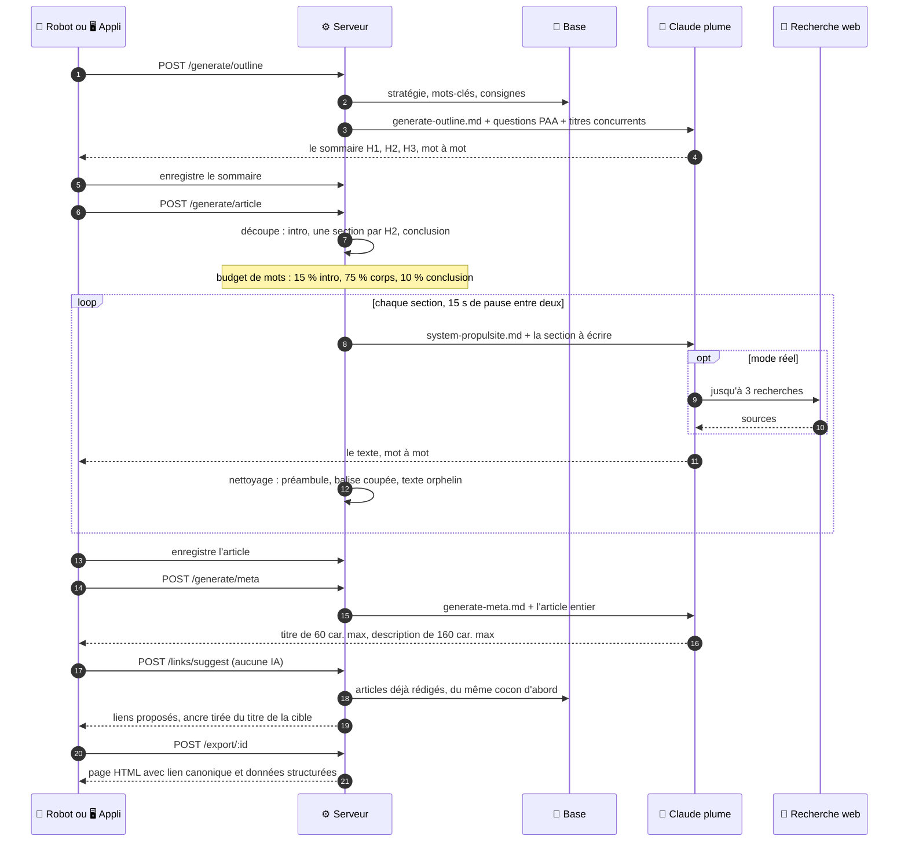

**La grille :**

| Temps | Le sommaire | L'article | Titre et description Google |
|---|---|---|---|
| 1 · Déclencheur | le robot après la pause 2, ou ton clic | enchaîné après le sommaire, ou ton clic | enchaîné après l'article, ou ton clic |
| 2 · Mémoire | aucune · questions PAA : celles du Moteur (robot) ou le brief DataForSEO gardé 7 jours (appli) | aucune | aucune |
| 3 · Service(s) | 🧠 plume · `generate-outline.md` | 🧠 plume · `system-propulsite.md` + 🔎 jusqu'à 3 recherches par section (mode réel) | 🧠 plume · `generate-meta.md` |
| 4 · Réponse | en flux | en flux, une section à la fois, 15 s de pause entre deux | d'un bloc |
| 5 · Mise en forme | — | chaque section nettoyée : préambule, balise coupée, texte hors paragraphe, paragraphe vide | coupés à 60 et 160 caractères |
| 6 · Sauvegarde | **après l'affichage**, par le robot ou l'écran : `article_content.outline` | **après l'affichage** : `article_content` | `articles.meta_title`, `meta_description` |
| 7 · Affichage | mot à mot (application) · la progression (robot) | mot à mot (application) · la progression (robot) | les deux champs |
| 8 · Décision | tu relis le sommaire avant d'écrire (application) | tu relis et retouches dans l'éditeur | tu retouches, puis liens internes et export |

**La longueur visée.** Le robot n'en donne pas : le serveur prend 2 500 mots pour un
pilier, 1 800 pour un intermédiaire, 1 200 pour un spécialisé. L'application, elle,
demande au trieur de Claude une longueur adaptée au plan et à la longueur moyenne
des concurrents. Le modèle dépasse souvent la cible : le pilier n°1012 fait 8 700 mots.

**Ce que l'IA a sous les yeux quand elle écrit une section** :

| Elle reçoit ✅ | Elle ne reçoit pas ❌ |
|---|---|
| Le titre, le Capitaine, les Lieutenants, le Lexique | La stratégie du **cocon** |
| La stratégie de l'article (remplie par le robot seulement) | La configuration du thème (ta cible, tes services) |
| Tes consignes (micro-contexte) | Les questions PAA : envoyées, mais le prompt ne s'en sert pas |
| Le sommaire complet | Le nombre de mots visé pour **cette** section : calculé, mais sans place dans le prompt |
| La fin de la section précédente (~500 caractères) | |
| Le budget de mots total et le rôle de la section | |

La colonne de droite liste des **pistes d'amélioration**, pas des pannes : l'article
s'écrit correctement, mais il pourrait coller encore mieux à ta stratégie.

> ⚠️ **« Publié » ne veut pas dire « en ligne ».** Dans l'application, le bouton
> « Exporter HTML » télécharge l'**aperçu** (`article-<id>.html`, dans tes
> téléchargements) et marque l'article « publié ». Mettre l'article sur le site reste
> une opération manuelle aujourd'hui.
>
> Nuance : ce fichier téléchargé ne vérifie pas que les articles liés sont déjà
> écrits. L'export du robot (`POST /export/:id`), lui, retire les liens vers des pages
> qui n'existent pas encore. Pour un article sorti de l'application, vérifie ses liens
> avant de le mettre en ligne.

---

## 6. Le robot, en détail

### Le déroulé

```bash
npm run auto:article -- --mode=real
```

1. Le robot **affiche l'arbre SEO** (silos, cocons, nombre d'articles par niveau).
   Tu choisis ton sujet en voyant où il atterrira.
2. Il pose **trois questions** :
   - `Sujet de l'article (une phrase, même vague)` — obligatoire
   - `Cocon cible (optionnel — [Entrée] laisse le script proposer)`
   - `Contexte business (optionnel)`
3. Il déroule le Cerveau, puis s'arrête à la **pause 1**.
4. Il déroule le Moteur, puis s'arrête à la **pause 2**.
5. Il rédige, exporte, et affiche le récapitulatif avec le coût.

> Le **niveau** de l'article (Pilier / Intermédiaire / Spécialisé) n'est pas demandé :
> le robot le propose en regardant les trous du cocon, et tu le corriges à la pause 1.

### Les deux pauses

| Pause | Ce qu'elle montre | Touches |
|---|---|---|
| **Pause 1 — Emplacement & brief** | L'arbre, le cocon proposé et pourquoi, les alternatives évaluées, le titre, le mot-clé, la douleur, l'angle, la promesse, le CTA. | `[Entrée]` valider · `e` changer l'emplacement · `r` régénérer · `a` abandonner |
| **Pause 2 — Mots-clés** | Le Capitaine, les Lieutenants, le Lexique, et les alertes de cannibalisation. | `[Entrée]` valider · `r` relancer le Moteur · `a` abandonner |

Deux détails qui comptent :

- **Rien n'est écrit en base avant la pause 1.** Si tu abandonnes, il ne reste aucune trace.
- **`e` ne coûte rien** : changer l'emplacement se fait en local, sans rappeler l'IA.
- Si deux articles visent des mots-clés trop proches (plus de 85 % de ressemblance),
  le robot exige que tu tapes `oui` pour continuer.

### Toutes les options

| Option | Effet | Exemple |
|---|---|---|
| `--mode=mock` (défaut) | Données simulées, gratuit. Sert à tester la mécanique. | |
| `--mode=real` | Vrais appels IA et DataForSEO. **Facturé.** | |
| `--cocoon=<nom>` | Impose le cocon, sans proposition. Économise un appel IA. | `--cocoon="Croissance digitale Toulouse"` |
| `--level=<niveau>` | Impose le niveau : `pilier`, `intermediaire` ou `specifique`. | `--level=pilier` |
| `--capitaine=<mot>` | **Impose le mot-clé principal.** L'heuristique est court-circuitée ; SERP, Lieutenants et Lexique sont recalculés sur ce mot. Avec `--resume`, un Capitaine différent relance Moteur + Rédaction. | `--capitaine="prix site vitrine artisan"` |
| `--resume=<id>` | Reprend un article commencé, saute les étapes déjà faites. | `--resume=452` |
| `--relink=<id>` | Repose **uniquement** les liens internes. Gratuit. | `--relink=455` |
| `--config=<fichier>` | Lance sans questions, depuis un fichier JSON. Les pauses sont auto-validées. | `--config=run.json` |
| `--port=<n>` | Port du serveur si différent de 3400. | `--port=3500` |
| `--verbose` ou `-v` | Affiche le détail de chaque étape. | |
| `--help` ou `-h` | Affiche l'aide. | |

Exemple de fichier `run.json` :

```json
{
  "topic": "aider les artisans BTP à être visibles localement sur Google",
  "cocoonName": "Croissance digitale Toulouse",
  "articleType": "intermediaire"
}
```

> ⚠️ Avec `--config` et `--resume`, **les pauses sont validées automatiquement**.
> Personne ne relit avant que l'argent soit dépensé. À réserver aux sujets déjà éprouvés.

---

## 7. Mode simulé, mode réel, et l'argent

### Les deux robinets

| | Mode simulé (`mock`) | Mode réel (`real`) |
|---|---|---|
| Textes | Réponses enregistrées, toujours identiques | Claude Haiku 4.5 (réglé dans `.env`) |
| Données Google | Bac à sable DataForSEO (fausses données) | Vraies données, facturées |
| Suggestions Google, pages concurrentes | Réelles (gratuites) | Réelles (gratuites) |
| Recherche web de Claude | Coupée | Active |
| Coût | 0 $ | environ 0,35 $ (article), 0,85 à 0,95 $ (pilier) |
| Utilité | Vérifier que la mécanique tourne | Produire un vrai article |

> ⚠️ **Piège n°1.** En mode simulé, le brief est **toujours le même**, quel que soit
> ton sujet : l'article créé n'a rien à voir avec ta demande. Le robot affiche un gros
> avertissement `MODE MOCK` : lis-le.
>
> ⚠️ **Piège n°2.** Le robot règle le serveur dans le mode choisi et **ne le remet
> jamais comme avant**. Après un run réel, l'application web ouverte sur le même
> serveur utilise elle aussi les vrais services, payants, jusqu'au prochain
> redémarrage du serveur.

### Les fournisseurs d'IA

Réglés dans `.env` avec `AI_PROVIDER` : `claude` (production), `gemini` ou
`openrouter` (gratuits mais limités), `mock` (simulé). En cas de panne ou de quota
dépassé, un repli automatique passe au suivant, sauf si `AI_PROVIDER_NO_FALLBACK=1`.

> Le détail de chaque service, modèle et librairie est dans
> [GUIDE-04-OUTILS.md](GUIDE-04-OUTILS.md).

### Le garde-fou de dépense

DataForSEO est plafonné par une fenêtre glissante de 30 minutes : **0,50 $** par
défaut, **2,00 $ chez toi** (`DATAFORSEO_COST_BUDGET_USD`, relevé pour les piliers).
Au-delà, les appels sont refusés. C'est une sécurité, pas une panne : attends, ou
reprends plus tard avec `--resume`.

### Pourquoi le deuxième article coûte moins cher

Avant un appel payant, chaque service regarde s'il a déjà une réponse assez récente.
Exemple dans le cocon n°1 (jours inventés, chiffres réels) :

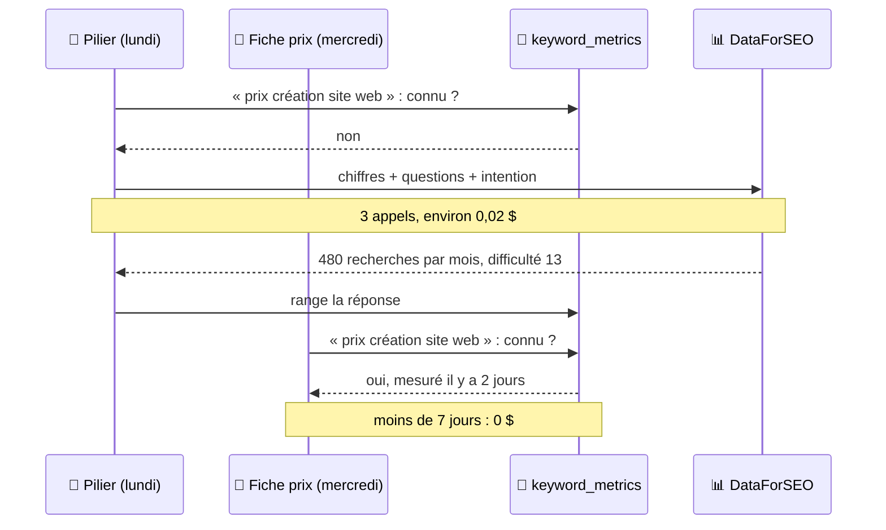

La base connaît aujourd'hui **3 258 mots-clés**, dont **169** avec leurs chiffres
Google complets, et **200 pages concurrentes** déjà lues. Au-delà de 7 jours, un
chiffre est racheté : Google bouge. Le détail de chaque mémoire est dans
[GUIDE-04-OUTILS.md](GUIDE-04-OUTILS.md) § 6.

---

## 8. Toutes les commandes

### Usage quotidien

| Commande | Rôle |
|---|---|
| `npm run dev` | Serveur (3400) + application web (5400). |
| `npm run auto:article -- [options]` | Le robot rédacteur. |
| `npm run auto:preview` | Aperçu local des articles produits (port 4599). |
| `npm run kill-ports` | Libère les ports 3400 et 5400. |

### Base de données

| Commande | Rôle |
|---|---|
| `npm run db:backup` | **Sauvegarde complète** (structure + données) dans `data/_backup_pg_<date>.sql`. À lancer avant toute opération risquée. |
| `npm run db:check` | Compare la base réelle à la photo `server/db/schema.sql`. |
| `npm run db:snapshot` | Reprend la photo après une modification de structure. |
| `npm run db:clean-tests` | Liste les articles laissés par les tests (simulation). Ajoute `-- --confirm` pour les supprimer. |

### Qualité — la commande à retenir

| Commande | Rôle |
|---|---|
| **`npm run verify`** | **Le contrôle rapide, à lancer tout le temps** (~35 s). Cinq vérifications en parallèle : style, types, ~570 tests purs, **qualité des articles rédigés**, et photo de la base à jour (`db:check`). Répond à « est-ce que tout va bien ? ». |
| `npm run verify:full` | Le contrôle exhaustif (~6 min) : `verify` + ESLint complet + cycles d'import + toute la suite de tests comparée à la référence. Avant un merge, **serveur éteint** : sinon les tests de bout en bout écrivent dans la vraie base. Serveur éteint, 2 tests restent rouges (ceux qui réclament le serveur) : c'est normal. |
| `npm run verify:content` | Seulement les livrables (< 1 s) : propreté du texte, metas, liens, **qualité SEO** (Capitaine dans le titre et l'intro, longueur selon le niveau, ancrage local, offre respectée), cannibalisation entre articles, ordre du cocon, hygiène du dépôt. |
| `npm run content:clean -- --id=455` | Répare un article déjà rédigé (simulation ; `--confirm` pour écrire). |

### Qualité du code

| Commande | Rôle |
|---|---|
| `npm run lint` | Corrige le style du code. |
| `npm run type-check` | Vérifie les types de l'application. |
| `npm run auto:typecheck` | Vérifie les types du robot. |
| `npm run test:unit` | Tests automatiques. |
| `npm run test:snapshot` | Enregistre l'état actuel des tests comme référence. |
| `npm run test:check` | Compare les tests à cette référence. |
| `npm run test:browser` | Tests dans un vrai navigateur (Playwright). |
| `npm run check:dead` | Cherche le code mort. |
| `npm run check:cycles` | Cherche les dépendances circulaires. |
| `npm run check:health` | Tout l'ensemble ci-dessus, d'un coup. |
| `npm run build` | Version finale de l'application web. |

> ⚠️ **Les tests de bout en bout écrivent dans ta vraie base de données.** Il n'existe
> pas encore de base de test séparée. Depuis le 20/09, ils nettoient derrière eux, et
> `npm run verify` signale tout article fantôme. Lance `verify:full` serveur éteint.

---

## 9. Où atterrit le résultat

| Quoi | Où | Remarque |
|---|---|---|
| Le texte de l'article | Table `article_content` | La source de vérité. |
| Les mots-clés retenus | Table `article_keywords` | Capitaine, Lieutenants, Lexique. |
| La stratégie | Table `article_strategies` | Les 6 étapes du Cerveau. |
| Les cases cochées | Colonne `articles.completed_checks` | Les 5 checks du Moteur. |
| Le fichier final | `_auto-output/<slug>-<id>.html` | Ignoré par git : pense à le sauvegarder. |
| Les liens internes | Table `internal_links` | La matrice de maillage. |

Pour publier sur le site, il faut aujourd'hui **copier le fichier HTML à la main**.
Aucune connexion automatique avec WordPress ou un autre outil n'existe pour l'instant.
