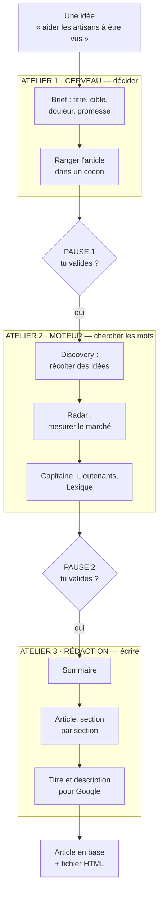
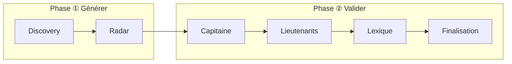
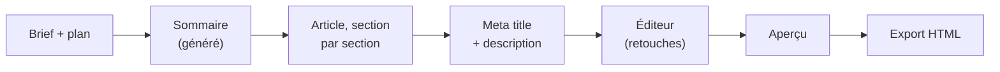
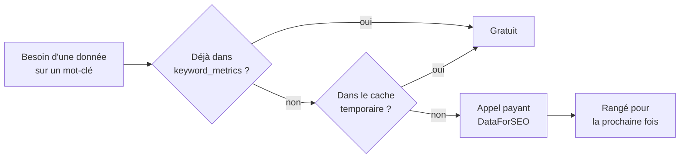

# Guide 1 — Utilisation

> Le manuel complet : les trois ateliers, les deux façons de s'en servir,
> toutes les commandes et toutes les options.
> Si tu cherches « comment faire X », va plutôt dans
> [GUIDE-03-CAS-PRATIQUES.md](GUIDE-03-CAS-PRATIQUES.md).

---

## 1. Les deux portes d'entrée

| | Application web | Robot (ligne de commande) |
|---|---|---|
| **Comment** | `npm run dev` puis http://localhost:5400 | `npm run auto:article -- --mode=real` |
| **Rythme** | Tu cliques étape par étape. | Tout s'enchaîne, 2 pauses de validation. |
| **Contrôle** | Total : tu choisis chaque mot-clé. | Le robot décide, tu valides. |
| **Durée** | Une à plusieurs heures. | Le temps d'un café (plus long pour un pilier). |
| **Quand l'utiliser** | Article important, sujet délicat, ou pour apprendre. | Production régulière, articles de série. |

Les deux utilisent **le même serveur, les mêmes règles, la même base**.
C'est la même cuisine : soit tu tiens la poêle, soit le robot la tient.

---

## 2. Le parcours complet



Chaque atelier a un rôle simple :

| Atelier | Question à laquelle il répond | Ce qu'il produit |
|---|---|---|
| **Cerveau** | De quoi je parle, à qui, et pourquoi ça l'intéresse ? | Un article créé en base, avec sa stratégie. |
| **Moteur** | Quels mots les gens tapent-ils vraiment dans Google ? | Un Capitaine, des Lieutenants, un Lexique. |
| **Rédaction** | Comment j'écris tout ça ? | Le texte, le titre Google, la description. |

---

## 3. Atelier 1 — Le Cerveau

Le Cerveau, c'est le moment où l'on décide **avant** d'écrire. Comme un architecte
qui dessine le plan avant que le maçon pose la première pierre.

### Deux niveaux de stratégie

| Niveau | Où | Étapes |
|---|---|---|
| **Stratégie de cocon** | Une fois par étagère | cible → douleur → angle → promesse → CTA, puis génération de la liste d'articles |
| **Stratégie d'article** | Pour chaque article | cible → douleur → **aiguillage** → angle → promesse → CTA |

L'*aiguillage*, c'est l'étape qui dit vers quel autre article renvoyer le lecteur.

### Ce que ça donne en vrai

Tu écris la stratégie du cocon « Création de site web », et l'IA te propose la
famille complète : 1 Pilier, 2 à 4 Intermédiaires, et 2 à 3 Spécialisés par
Intermédiaire. Tu acceptes, modifies ou supprimes chaque proposition. Les articles
acceptés sont créés en base avec le statut **« à rédiger »**.

> **Bon à savoir.** Cette liste d'articles est un **plan**, pas des articles écrits.
> C'est le menu affiché à l'entrée du restaurant : les plats ne sont pas encore cuisinés.

### La configuration du thème

Écran `/config` de l'application. C'est la **carte d'identité de PropulSite** :
ta cible, tes services, tes différenciateurs, ton ton de voix. Elle est injectée
dans tous les prompts IA. Si tu la changes, tous les articles suivants changent de ton.

---

## 4. Atelier 2 — Le Moteur

Le Moteur cherche les mots-clés. Imagine que tu ouvres une boutique : il faut
savoir quelle enseigne mettre sur la façade, et quels mots les passants utilisent
pour chercher ce que tu vends.



| Onglet | Ce qu'il fait | Image |
|---|---|---|
| **Discovery** | Récolte des idées de mots-clés à partir de ta douleur et de ton sujet. | On ratisse large, on ramasse tout. |
| **Radar** | Mesure chaque mot : volume de recherche, difficulté, concurrence. | On pèse chaque fruit récolté. |
| **Capitaine** | Choisit **le** mot-clé principal et le verrouille. | On grave l'enseigne de la boutique. |
| **Lieutenants** | Choisit 1 à 8 mots-clés secondaires, selon le niveau d'article. | Les rayons visibles en vitrine. |
| **Lexique** | Retient le vocabulaire d'expert attendu sur le sujet. | Le jargon qui prouve que tu es du métier. |
| **Finalisation** | Vérifie que tout est verrouillé avant d'écrire. | Le contrôle avant l'ouverture. |

### Les 5 cases à cocher

Quand une étape est finie, une case est cochée automatiquement en base
(colonne `completed_checks`). Leurs noms exacts :

| Case | Signification |
|---|---|
| `moteur:discovery_done` | Les idées ont été récoltées. |
| `moteur:radar_done` | Le marché a été mesuré. |
| `moteur:capitaine_locked` | Le mot-clé principal est verrouillé. |
| `moteur:lieutenants_locked` | Les mots-clés secondaires sont verrouillés. |
| `moteur:lexique_validated` | Le vocabulaire est validé. |

Ce sont ces cases que tu vois sous forme de points sur la liste des articles.

### Les mots qui font peur

| Terme | Traduction |
|---|---|
| **SERP** | La page de résultats de Google. L'outil lit les 10 premiers pour voir ce que font les concurrents. |
| **PAA** | Les questions « Autres questions posées » affichées par Google. De l'or : ce sont les vraies questions des gens. |
| **TF-IDF** | Une méthode qui repère les mots que **tous** les concurrents emploient. Si tous parlent d'« hébergement », il faut en parler. |
| **Volume de recherche** | Combien de fois par mois ce mot est tapé dans Google. |
| **Difficulté** | À quel point il sera dur de passer devant les concurrents (0 = facile, 100 = très dur). |
| **Cannibalisation** | Deux de tes articles visent le même mot-clé et se font concurrence. |

---

## 5. Atelier 3 — La Rédaction



- **Le sommaire** est nourri par les vraies questions PAA de Google et par les
  chapitres que les concurrents traitent tous.
- **L'article** s'écrit section par section. C'est plus lent, mais ça évite que
  l'IA bâcle la fin d'un long texte.
- **Les metas** sont le titre et le résumé affichés dans Google : environ
  60 et 160 caractères.
- **L'éditeur** (TipTap) permet de retoucher à la main, avec sauvegarde automatique.
- **L'export** produit une page HTML au gabarit PropulSite dans `_auto-output/`.

> ⚠️ **« Publié » ne veut pas dire « en ligne ».** Dans l'application, le bouton
> « Exporter HTML » télécharge le fichier et marque l'article « publié ».
> Mettre l'article sur le site reste une opération manuelle aujourd'hui.

---

## 6. Le robot, en détail

### Le déroulé

```bash
npm run auto:article -- --mode=real
```

1. Le robot **affiche l'arbre SEO** (silos, cocons, nombre d'articles par niveau).
   Tu choisis ton sujet en voyant où il atterrira.
2. Il pose **trois questions** :
   - `Sujet de l'article (une phrase, même vague)` — obligatoire
   - `Cocon cible (optionnel — [Entrée] laisse le script proposer)`
   - `Contexte business (optionnel)`
3. Il déroule le Cerveau, puis s'arrête à la **pause 1**.
4. Il déroule le Moteur, puis s'arrête à la **pause 2**.
5. Il rédige, exporte, et affiche le récapitulatif avec le coût.

> Le **niveau** de l'article (Pilier / Intermédiaire / Spécialisé) n'est pas demandé :
> le robot le propose en regardant les trous du cocon, et tu le corriges à la pause 1.

### Les deux pauses

| Pause | Ce qu'elle montre | Touches |
|---|---|---|
| **Pause 1 — Emplacement & brief** | L'arbre, le cocon proposé et pourquoi, les alternatives évaluées, le titre, le mot-clé, la douleur, l'angle, la promesse, le CTA. | `[Entrée]` valider · `e` changer l'emplacement · `r` régénérer · `a` abandonner |
| **Pause 2 — Mots-clés** | Le Capitaine, les Lieutenants, le Lexique, et les alertes de cannibalisation. | `[Entrée]` valider · `r` relancer le Moteur · `a` abandonner |

Deux détails qui comptent :

- **Rien n'est écrit en base avant la pause 1.** Si tu abandonnes, il ne reste aucune trace.
- **`e` ne coûte rien** : changer l'emplacement se fait en local, sans rappeler l'IA.
- Si deux articles visent des mots-clés trop proches (plus de 85 % de ressemblance),
  le robot exige que tu tapes `oui` pour continuer.

### Toutes les options

| Option | Effet | Exemple |
|---|---|---|
| `--mode=mock` (défaut) | Données simulées, gratuit. Sert à tester la mécanique. | |
| `--mode=real` | Vrais appels IA et DataForSEO. **Facturé.** | |
| `--cocoon=<nom>` | Impose le cocon, sans proposition. Économise un appel IA. | `--cocoon="Croissance digitale Toulouse"` |
| `--level=<niveau>` | Impose le niveau : `pilier`, `intermediaire` ou `specifique`. | `--level=pilier` |
| `--resume=<id>` | Reprend un article commencé, saute les étapes déjà faites. | `--resume=452` |
| `--relink=<id>` | Repose **uniquement** les liens internes. Gratuit. | `--relink=455` |
| `--config=<fichier>` | Lance sans questions, depuis un fichier JSON. Les pauses sont auto-validées. | `--config=run.json` |
| `--port=<n>` | Port du serveur si différent de 3400. | `--port=3500` |
| `--verbose` ou `-v` | Affiche le détail de chaque étape. | |
| `--help` ou `-h` | Affiche l'aide. | |

Exemple de fichier `run.json` :

```json
{
  "topic": "aider les artisans BTP à être visibles localement sur Google",
  "cocoonName": "Croissance digitale Toulouse",
  "articleType": "intermediaire"
}
```

> ⚠️ Avec `--config` et `--resume`, **les pauses sont validées automatiquement**.
> Personne ne relit avant que l'argent soit dépensé. À réserver aux sujets déjà éprouvés.

---

## 7. Mode simulé, mode réel, et l'argent

### Les deux robinets

| | Mode simulé (`mock`) | Mode réel (`real`) |
|---|---|---|
| Textes | Fixtures enregistrées, toujours identiques | Claude (par défaut Haiku 4.5) |
| Données Google | Bac à sable DataForSEO | Vraies données, facturées |
| Coût | 0 $ | environ 0,35 $ (article), 0,85 à 0,95 $ (pilier) |
| Utilité | Vérifier que la mécanique tourne | Produire un vrai article |

> ⚠️ **Piège connu.** En mode simulé, le brief est **toujours le même**, quel que
> soit ton sujet, et le robot réutilise l'article #441 en écrasant ses données.
> Le robot affiche un gros avertissement `MODE MOCK` : lis-le.

### Les fournisseurs d'IA

Réglés dans `.env` avec `AI_PROVIDER` : `claude` (production), `gemini` ou
`openrouter` (gratuits mais limités), `mock` (simulé). En cas de panne ou de quota
dépassé, un repli automatique passe au suivant, sauf si `AI_PROVIDER_NO_FALLBACK=1`.

> Le détail de chaque service, modèle et librairie est dans
> [GUIDE-04-OUTILS.md](GUIDE-04-OUTILS.md).

### Le garde-fou de dépense

DataForSEO est plafonné à **0,50 $ par tranche de 30 minutes**
(`DATAFORSEO_COST_BUDGET_USD`). Au-delà, les appels sont refusés. C'est une sécurité,
pas une panne : attends ou augmente le plafond en connaissance de cause.

### Pourquoi le deuxième article coûte moins cher

Avant tout appel payant, l'outil regarde s'il a déjà la réponse :



À ce jour, **3 184 mots-clés** sont déjà mémorisés : autant d'appels que tu ne
paieras plus jamais.

---

## 8. Toutes les commandes

### Usage quotidien

| Commande | Rôle |
|---|---|
| `npm run dev` | Serveur (3400) + application web (5400). |
| `npm run auto:article -- [options]` | Le robot rédacteur. |
| `npm run auto:preview` | Aperçu local des articles produits (port 4599). |
| `npm run kill-ports` | Libère les ports 3400 et 5400. |

### Base de données

| Commande | Rôle |
|---|---|
| `npm run db:backup` | **Sauvegarde complète** (structure + données) dans `data/_backup_pg_<date>.sql`. À lancer avant toute opération risquée. |
| `npm run db:check` | Compare la base réelle à la photo `server/db/schema.sql`. |
| `npm run db:snapshot` | Reprend la photo après une modification de structure. |
| `npm run db:clean-tests` | Liste les articles laissés par les tests (simulation). Ajoute `-- --confirm` pour les supprimer. |

### Qualité — la commande à retenir

| Commande | Rôle |
|---|---|
| **`npm run verify`** | **Le contrôle complet** : style, types, qualité des articles en base, et comparaison des tests à la référence. C'est la commande qui répond à « est-ce que tout va bien ? ». |
| `npm run verify:content` | Seulement les articles : monologue de l'IA, blocs tronqués, Markdown résiduel, metas coupées, liens morts, articles de test oubliés, fraîcheur de la sauvegarde. |
| `npm run content:clean -- --id=455` | Répare un article déjà rédigé (simulation ; `--confirm` pour écrire). |

### Qualité du code

| Commande | Rôle |
|---|---|
| `npm run lint` | Corrige le style du code. |
| `npm run type-check` | Vérifie les types de l'application. |
| `npm run auto:typecheck` | Vérifie les types du robot. |
| `npm run test:unit` | Tests automatiques. |
| `npm run test:snapshot` | Enregistre l'état actuel des tests comme référence. |
| `npm run test:check` | Compare les tests à cette référence. |
| `npm run test:browser` | Tests dans un vrai navigateur (Playwright). |
| `npm run check:dead` | Cherche le code mort. |
| `npm run check:cycles` | Cherche les dépendances circulaires. |
| `npm run check:health` | Tout l'ensemble ci-dessus, d'un coup. |
| `npm run build` | Version finale de l'application web. |

> ⚠️ **Les tests écrivent dans ta vraie base de données.** Il n'existe pas encore
> de base de test séparée. Ils y laissent des articles fantômes nommés `Renamed …`.

---

## 9. Où atterrit le résultat

| Quoi | Où | Remarque |
|---|---|---|
| Le texte de l'article | Table `article_content` | La source de vérité. |
| Les mots-clés retenus | Table `article_keywords` | Capitaine, Lieutenants, Lexique. |
| La stratégie | Table `article_strategies` | Les 6 étapes du Cerveau. |
| Les cases cochées | Colonne `articles.completed_checks` | Les 5 checks du Moteur. |
| Le fichier final | `_auto-output/<slug>-<id>.html` | Ignoré par git : pense à le sauvegarder. |
| Les liens internes | Table `internal_links` | La matrice de maillage. |

Pour publier sur le site, il faut aujourd'hui **copier le fichier HTML à la main**.
Aucune connexion automatique avec WordPress ou un autre outil n'existe pour l'instant.
