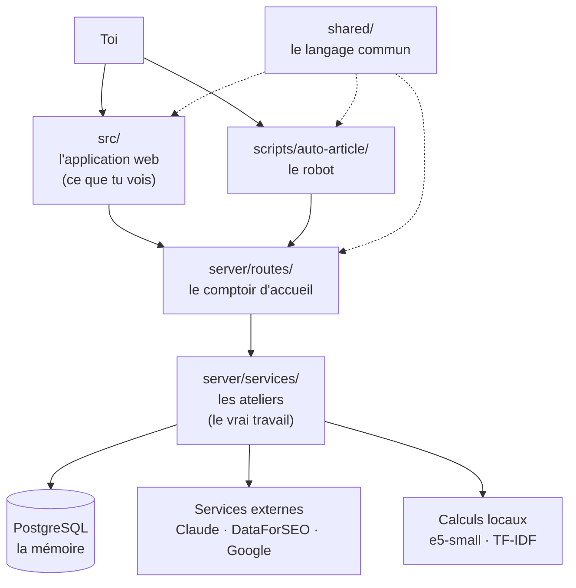
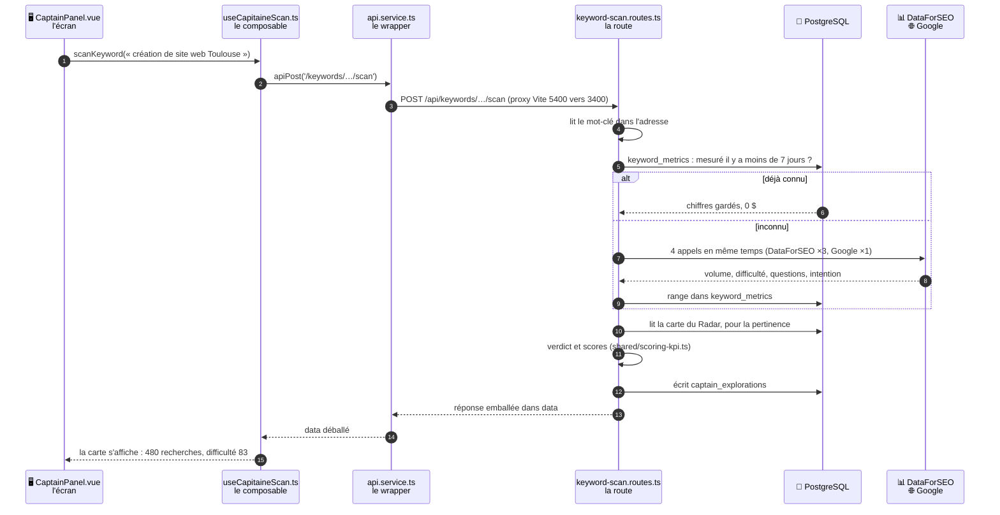
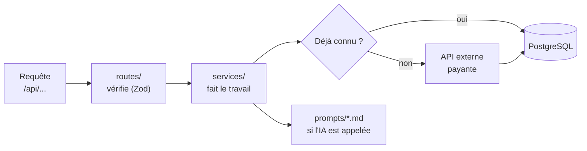
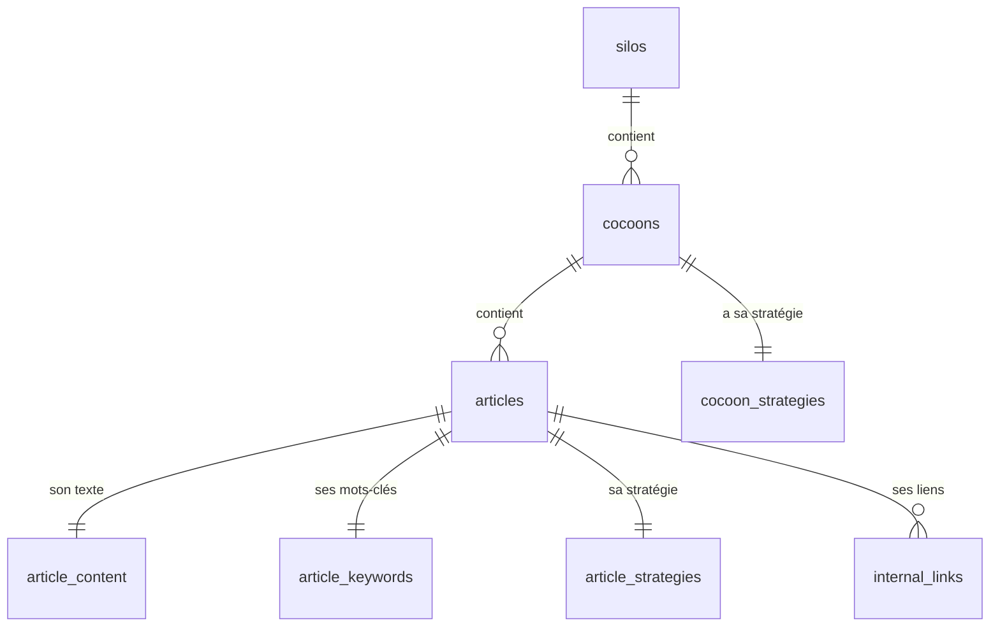
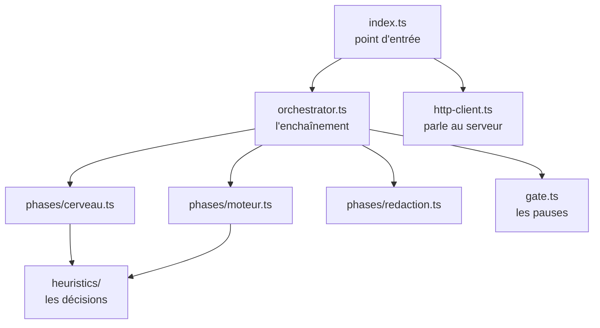

# Guide 2 — Architecture : où chercher l'information

> La carte du projet. Quel dossier contient quoi, qui parle à qui, et dans quel
> ordre les choses se passent.
> Objectif : que tu saches **où regarder** quand tu te poses une question.

---

## 1. La maison en quatre étages

Image : un restaurant.

| Étage | Dossier | Rôle |
|---|---|---|
| **La salle** | `src/` | Ce que tu vois et cliques. Ne cuisine rien. |
| **Le comptoir** | `server/routes/` | Prend la commande, vérifie qu'elle est valide, la transmet. Ne cuisine pas non plus. |
| **La cuisine** | `server/services/` | Fait le travail : calculs, appels IA, requêtes en base. |
| **Le garde-manger** | PostgreSQL | Tout ce dont on se souvient. |
| **Le dictionnaire** | `shared/` | Les mots et les règles que tout le monde partage. |

**Règle d'or du projet** : `src/` ne doit **jamais** appeler `server/` directement.
Tout passe par des requêtes HTTP. C'est pour ça que le robot a pu être ajouté
sans rien dupliquer : il est juste un troisième client du comptoir.

---

## 2. Le chemin d'une action, de bout en bout

Exemple : dans l'onglet Capitaine, tu cliques sur « création de site web Toulouse ».
Chaque colonne est un étage de la maison, de l'écran jusqu'à Internet.

**Les 8 temps de la grille** ([GUIDE-01-UTILISATION.md](GUIDE-01-UTILISATION.md) § 2),
et où les chercher dans le code :

| Temps | Flèches | Qui s'en occupe | Où regarder |
|---|---|---|---|
| 1 · Déclencheur | 1 à 3 | l'écran, puis le composable, puis le wrapper | `src/components/moteur/CaptainPanel.vue`, `src/composables/keyword/useCapitaineScan.ts` |
| 2 · Mémoire | 5 et 6 | la route | `server/routes/keyword-scan.routes.ts` (lecture de `keyword_metrics`) |
| 3 · Service(s) | 7 | la route, via le client DataForSEO | `server/services/external/dataforseo/` |
| 4 · Réponse | 8 | DataForSEO et Google | — |
| 5 · Mise en forme | 10 et 11, puis 13 et 14 | la route (verdict, scores), puis le wrapper (déballe `data`) | `shared/scoring-kpi.ts`, `src/services/api.service.ts` |
| 6 · Sauvegarde | 9 et 12 | la route, **avant** de répondre | `keyword_metrics` (mémoire d'achat), `captain_explorations` (résultat) |
| 7 · Affichage | 15 | l'écran | `CaptainPanel.vue` |
| 8 · Décision | hors du schéma | « Verrouiller » lance un **second trajet** : `PUT /api/articles/:id/keywords` | `article_keywords` + case `capitaine_locked` |

Retiens ceci : quand un chiffre est faux à l'écran, remonte les temps à l'envers.
L'affichage (7) montre-t-il ce que la route a renvoyé (5) ? La route a-t-elle lu une
vieille mémoire (2) ou un vrai appel (3) ?

> **Une exception à la règle, visible ici** : cette route fait elle-même le travail
> (cache, appels, calculs) au lieu de le confier à un service de `server/services/`,
> et elle ne passe pas par un contrôle Zod.
> Ça marche, mais c'est le seul endroit où chercher cette logique : ne la cherche pas
> dans les services.

**Les quatre règles que suit ce chemin :**

1. Un composant Vue ne fait **jamais** `fetch` lui-même. Il passe par un store ou
   un composable, qui utilise le wrapper.
2. Le wrapper unique est `src/services/api.service.ts`. Il expose `apiGet`,
   `apiPost`, `apiPut`, `apiPatch`, `apiDelete`, `apiStream`.
3. Les réponses du serveur sont toujours emballées dans `{ data: ... }`, et le
   wrapper déballe automatiquement (`return json.data`).
4. L'adresse est **relative** : `fetch('/api' + chemin)`. C'est le proxy de Vite
   qui redirige `/api` du port 5400 vers le port 3400
   (`vite.config.ts`). Aucune URL de serveur n'est écrite en dur.

---

## 3. Où vit quoi : le tableau à consulter

| Ma question | Le dossier à ouvrir |
|---|---|
| « À quoi ressemble cet écran ? » | `src/views/` (13 pages) |
| « Où est ce bouton / ce panneau ? » | `src/components/<domaine>/` |
| « Où est stockée cette donnée côté écran ? » | `src/stores/<domaine>/` |
| « Où est cette logique réutilisable ? » | `src/composables/<domaine>/` |
| « Quelle adresse appelle le serveur ? » | `server/routes/*.routes.ts` |
| « Où se fait le vrai calcul ? » | `server/services/<domaine>/` |
| « Comment on parle à l'IA ? » | `server/prompts/*.md` |
| « Quelle est la forme de cette donnée ? » | `shared/types/` et `shared/schemas/` |
| « Comment le robot décide-t-il ? » | `scripts/auto-article/heuristics/` |
| « Quelles tables existent ? » | `server/db/schema.sql` |

---

## 4. L'application web (`src/`)

### Les 13 écrans et leur route

| Route | Écran | Ce que tu y fais |
|---|---|---|
| `/` | `DashboardView` | Vue d'ensemble des silos, création de cocon. |
| `/config` | `ThemeConfigView` | La carte d'identité de PropulSite. |
| `/silo/:siloId` | `SiloDetailView` | Les stats d'un silo et ses cocons. |
| `/cocoon/:cocoonId` | `CocoonLandingView` | Choisir l'atelier : Cerveau, Moteur ou Rédaction. |
| `/cocoon/:id/cerveau` | `CerveauView` | La stratégie du cocon et la génération du plan d'articles. |
| `/cocoon/:id/moteur` | `MoteurView` | Les 6 onglets de recherche de mots-clés. |
| `/cocoon/:id/redaction` | `RedactionView` | La liste des articles du cocon. |
| `/cocoon/:id/article/:articleId` | `ArticleWorkflowView` | Brief, plan, génération de l'article et des metas. |
| `/article/:id/editor` | `ArticleEditorView` | L'éditeur de texte avec sauvegarde auto. |
| `/article/:id/preview` | `ArticlePreviewView` | L'aperçu au gabarit PropulSite + export. |
| `/linking` | `LinkingMatrixView` | La matrice des liens internes et les articles orphelins. |
| `/post-publication` | `PostPublicationView` | Les performances Google Search Console. |

### Les stores : la mémoire de l'écran

Un **store** garde une donnée en mémoire pendant que tu navigues, pour éviter de
tout redemander au serveur. Comme le plateau sur lequel le serveur pose les
assiettes en salle. Ils sont rangés par domaine dans `src/stores/` :

| Store | Ce qu'il retient |
|---|---|
| `article/articles.store.ts` | La liste des articles du cocon. |
| `article/article-progress.store.ts` | Les cases cochées (les 5 checks). |
| `article/article-keywords.store.ts` | Capitaine, Lieutenants, Lexique verrouillés. |
| `article/editor.store.ts` | **L'article en cours d'écriture** : texte, metas, progression. |
| `article/outline.store.ts` | Le sommaire, avec annuler/refaire. |
| `article/seo.store.ts` et `geo.store.ts` | Les scores SEO et GEO. |
| `strategy/strategy.store.ts` | La stratégie d'un article (6 étapes). |
| `strategy/cocoon-strategy.store.ts` | La stratégie d'un cocon (5 étapes). |
| `strategy/theme-config.store.ts` | La configuration du thème. |
| `keyword/linking.store.ts` | Le maillage : matrice, suggestions, orphelins. |
| `ui/cost-log.store.ts` | Le compteur de dépenses IA en direct. |
| `ui/runtime-mode.store.ts` | Le mode simulé ou réel. |

> Il n'existe **pas** de store « article courant ». L'article est identifié par
> l'adresse de la page (`:articleId`), et son contenu vit dans `editor.store.ts`.

### Les composables : les outils réutilisables

Un **composable** est une boîte à outils qu'un écran peut emprunter. Les plus utiles :

| Composable | Rôle |
|---|---|
| `seo/useInternalLinking.ts` | Pose les liens internes dans le texte. |
| `seo/useSeoScoring.ts` / `useGeoScoring.ts` | Recalculent les scores pendant que tu écris. |
| `seo/useCannibalization.ts` | Alerte si deux articles visent le même mot-clé. |
| `article/useArticleGeneration.ts` | Orchestre la génération de l'article. |
| `editor/useStreaming.ts` | Reçoit le texte de l'IA au fil de l'eau. |
| `editor/useAutoSave.ts` | Sauvegarde automatique. |
| `moteur/useFinalisationGating.ts` | Débloque la Rédaction quand les 3 verrous sont posés. |
| `keyword/useRelevanceScoring.ts` | Note la pertinence des mots-clés trouvés. |

---

## 5. Le serveur (`server/`)

Toutes les routes sont montées sous `/api` (`server/index.ts`).

### Les services, rangés par métier

| Dossier | Ce qu'on y trouve |
|---|---|
| `services/keyword/` | Tout ce qui touche aux mots-clés : découverte, radar, scan Capitaine, Lieutenants, lexique, TF-IDF. |
| `services/external/` | Les portes vers l'extérieur : `ai-provider.service.ts` (Claude/Gemini/OpenRouter/Mock), `dataforseo.service.ts`, `gsc.service.ts`. |
| `services/article/` | Contenu, export HTML, maillage interne, nombre de mots cible. |
| `services/strategy/` | Stratégie d'article, stratégie de cocon, configuration du thème. |
| `services/intent/` | L'intention derrière une recherche (acheter ? apprendre ?). |
| `services/infra/` | Les caches, le mode simulé/réel, les données locales. |
| `services/queries/` | Les requêtes en base regroupées. |

> **Toute** requête vers une IA passe par `ai-provider.service.ts`. C'est le seul
> point de passage : on peut ainsi changer de fournisseur sans toucher au reste.

### Les prompts : le cahier des charges donné à l'IA

Les prompts sont des fichiers Markdown dans `server/prompts/`. Ce sont des
lettres de consignes, avec des trous `{{...}}` remplis automatiquement.

| Fichier | Sert à |
|---|---|
| `system-propulsite.md` | Le socle : identité, ton, règles SEO, formulations interdites. Sert à écrire les sections et les metas (le sommaire et le Cerveau du robot ont leurs propres consignes). |
| `generate-outline.md` | Fabriquer le sommaire. |
| `generate-article-section.md` | Écrire une section. |
| `generate-meta.md` | Écrire le titre et la description Google. |
| `cocoon-articles*.md` | Proposer la famille d'articles d'un cocon. |
| `strategy-*.md` | Aider à remplir les étapes de stratégie. |
| `auto-intake.md` | Transformer ton idée floue en brief (utilisé par le robot). |
| `auto-placement.md` | Décider dans quel cocon ranger un article. |
| `intent-keywords.md`, `captain-paa-judge.md` | Proposer des idées de mots-clés, juger les questions de Google (le « trieur » Haiku). |
| `propose-lieutenants.md`, `lexique-analysis-upfront.md`, `capitaine-ai-panel.md` | Les conseils de l'IA dans les onglets du Moteur (application). |

Quel prompt sert à quelle étape, et avec quel modèle : voir
[GUIDE-04-OUTILS.md](GUIDE-04-OUTILS.md) § 5.2.

> **Règle absolue** : on ne met jamais de contexte en dur dans un prompt.
> Le contexte arrive par les variables `{{...}}`.

---

## 6. La base de données : la mémoire

25 tables. Voici les relations principales :

### Les tables à connaître

| Table | Ce qu'elle garde | Lignes (21/09/2026) |
|---|---|---|
| `silos` | Les rayons du blog. | 4 |
| `cocoons` | Les étagères, rattachées à un silo. | 8 |
| `articles` | La fiche d'identité de chaque article : titre, niveau, statut, adresse, cases cochées, Capitaine verrouillé, douleur. | 13 (le cocon n°1) |
| `article_content` | Le texte et le sommaire. | 1 (le pilier) |
| `article_keywords` | Capitaine, Lieutenants, Lexique, structure des titres. | 1 |
| `article_strategies` | Les 6 étapes du Cerveau, en JSON. | 1 |
| `cocoon_strategies` | La stratégie du cocon **et le plan d'articles** proposé. | 6 |
| `internal_links` | Le maillage : qui pointe vers qui, avec quelle ancre. | 0 (aucune cible écrite) |
| `theme_config` | La carte d'identité de PropulSite. | 1 |

### Les tables « mémoire d'achat » (ce qui t'évite de repayer)

La table rase du 21/09 n'a touché qu'aux articles : toute cette mémoire est restée.

| Table | Ce qu'elle garde | Durée de validité | Lignes |
|---|---|---|---|
| `keyword_metrics` | Volume, difficulté, CPC, questions PAA et autocomplétion de chaque mot-clé déjà vu. | 7 jours (1 jour pour questions et autocomplétion) | 3 258, dont 169 avec leurs chiffres complets |
| `keyword_paa_questions` | Les questions « Autres questions posées » d'une SERP analysée. | 7 jours | 306 |
| `keyword_serp_results` / `keyword_serp_scrapes` | Le top 10 d'un mot-clé et le texte de ces pages. | 7 jours | 200 / 200 |
| `external_api_cache` | Le cache à durée limitée pour le reste (suggestions, récoltes Discovery, brief…). | 1 h à 7 jours | 9 |
| `keyword_autocomplete` | Ancienne table de suggestions, **plus alimentée** (l'autocomplétion vit désormais dans `keyword_metrics`). | — | 8 570 |

### Les tables « journal de bord »

`captain_explorations` (15), `paa_explorations` (58), `lexique_explorations` (2),
`radar_explorations` (0), `lieutenant_explorations` (0) : elles gardent l'historique
des essais, pour pouvoir revenir en arrière et comprendre une décision. Le robot
n'écrit pas dans `radar_explorations` : seul l'onglet Radar de l'application le fait.

> ⚠️ `server/db/schema.sql` est une **photo de lecture** régénérée par
> `npm run db:snapshot`. Ce n'est pas un script d'installation : on ne peut pas le
> rejouer tel quel sur une base vide (les séquences n'y sont qu'en commentaire).

---

## 7. Le langage commun (`shared/`)

C'est le dictionnaire que le front, le serveur et le robot partagent. Si un mot
change ici, il change partout — d'où l'importance de ne pas y toucher à la légère.

| Dossier | Contenu |
|---|---|
| `shared/types/` | Les formes de données (30 fichiers) : à quoi ressemble un article, un mot-clé, un lien. |
| `shared/schemas/` | Les schémas Zod (14) : les videurs à l'entrée qui vérifient que la donnée est valide. |
| `shared/constants/` | Les valeurs figées : les 5 checks du Moteur, les cibles SEO et GEO. |
| `shared/score*.ts` | Les formules de score, partagées front et back. |

**Le fichier le plus important à connaître** : `shared/constants/workflow-checks.constants.ts`.
Il contient les 5 noms de cases à cocher. On ne doit **jamais** écrire
`'moteur:capitaine_locked'` à la main : on importe la constante.

**Deuxième fichier à connaître** : `shared/constants/site.constants.ts`. C'est la
seule source de vérité pour le domaine (`www.propulsitetoulouse.website`) et la forme
des adresses (`/blog/<slug>`). Changer de domaine = changer une ligne ici (ou poser
`SITE_URL` dans `.env` côté serveur).

**Les valideurs** vivent aussi dans `shared/` : `content-validators.ts` (le texte
est-il propre ?) et `seo-validators.ts` (l'article remplit-il son rôle SEO ?). Le
robot, l'export et `npm run verify` utilisent exactement les mêmes règles.

---

## 8. Le robot (`scripts/auto-article/`)

| Fichier | Rôle |
|---|---|
| `index.ts` | Lit les options, vérifie que le serveur répond, pose les questions. |
| `orchestrator.ts` | Enchaîne les 3 phases et les 2 pauses. Ne connaît ni le réseau ni le clavier. |
| `phases/` | Ce que fait chaque atelier, en appelant le serveur. |
| `heuristics/` | **Les décisions automatiques**, sans réseau : choix du Capitaine, des Lieutenants, du Lexique, de l'emplacement, détection de cannibalisation. |
| `tree.ts` | Dessine l'arbre SEO affiché au lancement. |
| `http-client.ts` | Les appels au serveur, y compris le texte reçu au fil de l'eau. |
| `report.ts` | Le récapitulatif de fin avec le coût. |

**Pourquoi c'est bien séparé** : les fichiers de `heuristics/` sont des fonctions
pures (même entrée, même sortie, aucun appel extérieur). C'est pour ça qu'ils sont
très testés — et c'est là qu'il faut aller pour changer une règle de décision.

Détail complet dans [docs/auto-article-cli.md](docs/auto-article-cli.md).

---

## 9. Les tests

| Dossier | Ce qu'il teste | Serveur nécessaire ? |
|---|---|---|
| `tests/unit/` (320 fichiers) | Des morceaux isolés : composants, services, calculs. | Non |
| `tests/functional/` (4) | Des enchaînements métier sans réseau. | Non |
| `tests/contract-api/` (11) | Que chaque adresse du serveur répond avec la bonne forme. | **Oui** |
| `tests/integration-tabs/` (12) | Un onglet de bout en bout. | **Oui** |
| `tests/e2e-workflows/` (6) | Des parcours complets. | **Oui** |
| `tests/integration/` (5) | Des services branchés sur la vraie base. | Base oui, serveur non |
| `tests/browser-e2e/` (15) | Un vrai navigateur (Playwright). | Oui (lancé automatiquement) |

> ⚠️ Les tests écrivent dans la **base de développement**. Il n'y a pas encore de
> base séparée pour les tests.

---

## 10. Où est la documentation

| Dossier | Contenu | Pour qui |
|---|---|---|
| `README.md` + `GUIDE-0*.md` | Le mode d'emploi, dont [GUIDE-04-OUTILS.md](GUIDE-04-OUTILS.md) pour les librairies et services. | Toi |
| `docs/` | Documentation technique : flux de données, cartographie IA, guide des tests, référence des prompts. | Développement |
| `_bmad-output/planning-artifacts/` | Le PRD (ce que fait le produit), le design registry (comment c'est conçu), l'architecture. | Décisions produit |
| `_bmad-output/implementation-artifacts/` | Les spécifications de chantier, les audits, le suivi de sprint. | Historique |
| `.claude/CLAUDE.md` | Les règles de travail données à l'IA développeuse. | L'assistant |
| `archive/` et les dossiers `_archive/` | Ancien contenu, gardé pour mémoire. | **Ne jamais lire comme vérité** |

**En cas de contradiction** : le code a toujours raison. La documentation décrit
l'intention, le code décrit la réalité.

---

## 11. Notes d'hygiène

- 29 fichiers `.bak` traînent dans `src/`. Ce sont d'anciennes versions laissées
  sur disque ; ils ne sont pas utilisés par le programme.
- `_auto-output/` et `data/_backup_*.sql` sont ignorés par git : ils n'existent que
  sur ton disque. Pense à les sauvegarder ailleurs.
- La photo de référence des tests (`tests/.baseline.json`) date de mai 2026 :
  à regénérer avec `npm run test:snapshot` après une session de réparation.
