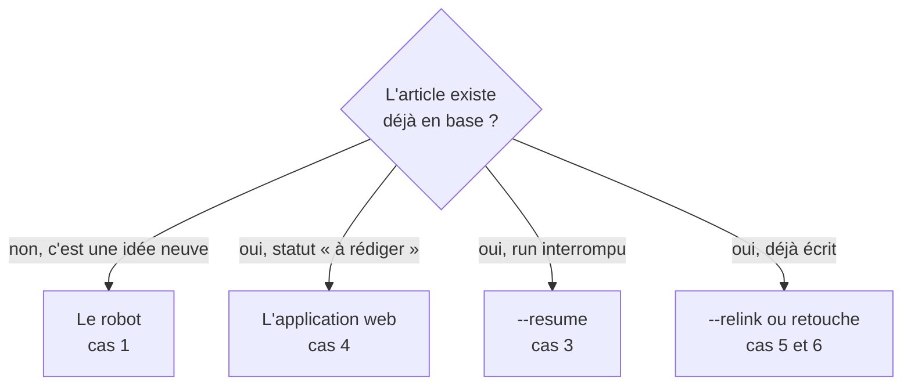
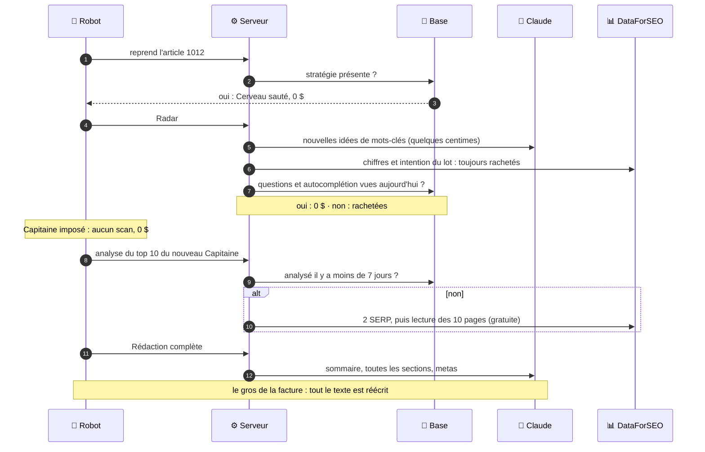
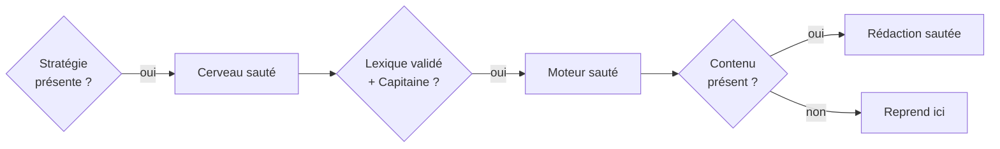

# Guide 3 — Cas pratiques

> « Je veux faire X, je fais comment ? »
> Chaque cas est un mode d'emploi pas à pas, avec ce que tu dois voir à l'écran.

---

## Quel chemin prendre ?



---

## Cas 1 — Mon premier article, du début à la fin

**Objectif** : partir d'une idée floue et obtenir un article complet.
**Durée** : le temps d'un café, plus pour un Pilier. **Coût** : environ 0,35 $.

### La grille du run, en un coup d'œil

Les 8 temps de chaque atelier, tels que le robot les vit
(la grille est expliquée dans [GUIDE-01-UTILISATION.md](GUIDE-01-UTILISATION.md) § 2) :

| Temps | Cerveau | Moteur | Rédaction |
|---|---|---|---|
| 1 · Déclencheur | ta phrase | ton Entrée à la pause 1 | ton Entrée à la pause 2 |
| 2 · Mémoire | aucune | `keyword_metrics` (1 à 7 jours), top 10 déjà analysés (7 jours) | aucune : tout vient du Moteur |
| 3 · Service(s) | 🧠 ×2 (brief, cocon) + 🏠 présélection | 🧠 idées · 📊 chiffres, questions, top 10 · 🌐 autocomplétion, 10 pages · 🏠 sens, TF-IDF | 🧠 sommaire, sections, metas · 🔎 recherches web |
| 4 · Réponse | d'un bloc | d'un bloc | en flux (sommaire, sections), d'un bloc (metas) |
| 5 · Mise en forme | cocon, niveau, justification | cartes et scores ; Lieutenants et Lexique choisis par calcul | chaque section nettoyée ; metas coupées à 60 et 160 caractères |
| 6 · Sauvegarde | **rien avant ta validation** | au fil de l'eau : mémoire d'achat, puis les mots-clés retenus | sommaire, article, metas, liens, puis le fichier HTML |
| 7 · Affichage | le terminal, à la pause 1 | le terminal, à la pause 2 | la progression, puis la facture |
| 8 · Décision | Entrée, `e`, `r` ou `a` | Entrée, `r` ou `a` | ta relecture (étape 7) |

### Étape 1 — Allumer le serveur

```bash
npm run dev
```

Attends de voir les deux services démarrés (serveur sur 3400, application sur 5400).
Laisse ce terminal ouvert : c'est le moteur qui tourne.

### Étape 2 — Lancer le robot dans un second terminal

```bash
npm run auto:article -- --mode=real
```

Le robot affiche d'abord **l'arbre SEO** : tes silos, tes cocons, et pour chacun
le nombre d'articles par niveau (`P · I · S`). Regarde-le : il te dit où il reste
de la place.

### Étape 3 — Répondre aux trois questions

```
Sujet de l'article (une phrase, même vague) › aider les artisans du bâtiment à être visibles sur Google localement
Cocon cible (optionnel — [Entrée] laisse le script proposer) › [Entrée]
Contexte business (optionnel) › PropulSite, création de sites pour TPE, Toulouse
```

Écris le sujet **avec tes mots**. C'est sur cette phrase, et elle seule, que le
robot calcule dans quel cocon ranger l'article.

> **En coulisses** (colonne Cerveau de la grille) : **2 appels d'IA, 0 appel
> DataForSEO, rien d'écrit en base.** Le schéma complet d'un run, service par
> service, est dans [GUIDE-04-OUTILS.md](GUIDE-04-OUTILS.md) § 3.

### Étape 4 — La pause 1 : emplacement et brief

Tu vois l'arbre, le cocon proposé, les alternatives avec leur pourcentage de
proximité, puis le brief (titre, mot-clé, douleur, cible, angle, promesse, CTA).

**À vérifier avant de valider :**

- [ ] Le titre parle bien de mon sujet ?
- [ ] Le cocon est le bon ? Sinon `e` pour en choisir un autre (gratuit).
- [ ] Le niveau proposé est cohérent (un Pilier si le cocon n'en a pas encore) ?
- [ ] Pas d'alerte « hors périmètre » ?

Tape `[Entrée]` pour valider. **C'est seulement ici que l'article est créé en base.**

> **En coulisses** (colonne Moteur de la grille) : **c'est ici que part presque tout
> l'argent de DataForSEO.** Chaque candidat Capitaine coûte 3 appels, sauf s'il a été
> mesuré il y a moins de 7 jours, ou si tu as imposé le Capitaine avec `--capitaine`.

### Étape 5 — La pause 2 : les mots-clés

Tu vois le Capitaine, les Lieutenants, le Lexique, et d'éventuelles alertes de
ressemblance avec d'autres articles.

**À vérifier :**

- [ ] Le Capitaine est-il bien ce que taperait un client ? (pas un mot du métier
      que personne ne cherche, pas un mot hors sujet)
- [ ] Les Lieutenants tournent-ils autour du même thème ?
- [ ] Le Lexique contient-il du vocabulaire utile, pas des mots vides ?

En cas de doute sur le Capitaine, `r` relance le Moteur. C'est le moment le plus
important du run : un mauvais Capitaine, et l'article entier vise à côté.

> **En coulisses** (colonne Rédaction de la grille) : **une section à la fois, avec
> 15 s de pause entre deux.** Pour un pilier de 20 à 25 sections, compte souvent plus
> d'une demi-heure. DataForSEO ne travaille plus.

### Étape 6 — Lire le résultat

```bash
npm run auto:preview
```

Un aperçu s'ouvre dans le navigateur avec un menu déroulant pour passer d'un
article à l'autre, avec le style PropulSite.

### Étape 7 — Relire pour de vrai

Depuis le 20/09/2026, le robot fait deux contrôles automatiques à la fin :

- **Bloquant** : s'il trouve le monologue de l'IA (« Je vais d'abord faire une
  recherche… »), il **refuse d'écrire le fichier** et affiche les extraits fautifs.
  L'article reste en base : corrige-le dans l'éditeur, puis exporte depuis l'application.
- **Non bloquant** : il liste les affirmations invérifiables (« nous avons testé
  auprès de 50 PME ») à relire avant publication.

Ces contrôles ne remplacent pas ta relecture. Cherche encore dans le texte :

| Cherche | Pourquoi |
|---|---|
| « je vais », « voici la section », « avant de rédiger » | Traces du brouillon de l'IA (problème connu). |
| « nous avons testé », « nos clients », « plus de X PME » | Preuves inventées : à supprimer ou remplacer par un vrai cas. |
| Deux titres H1 | Il n'en faut qu'un. |
| Le titre Google coupé au milieu | À réécrire à la main. |
| Les liens internes | Vérifie qu'ils pointent vers des articles **publiés**. |

---

## Cas 2 — Écrire dans un cocon précis, à un niveau précis

Quand tu construis une famille d'articles, tu ne veux pas que le robot choisisse
à ta place.

```bash
npm run auto:article -- --mode=real --cocoon="Création de site internet à Toulouse" --level=intermediaire
```

- Le nom du cocon doit être **exactement** celui de l'arbre (guillemets obligatoires
  s'il contient des espaces). En cas d'erreur, le robot liste les cocons disponibles.
- `--level` accepte `pilier`, `intermediaire` ou `specifique`.
- Bonus : forcer l'emplacement **économise un appel IA**.

### La recette complète, telle qu'utilisée pour le pilier du cocon n°1

```bash
npm run auto:article -- --mode=real \
  --cocoon="Création de site internet à Toulouse" \
  --level=pilier \
  --capitaine="création de site web Toulouse"
```

Pourquoi imposer le Capitaine ? Parce que le choix automatique se trompe encore :
lors du premier essai, il a retenu « site e-commerce » pour une agence qui n'en fait
pas. Choisis le mot-clé toi-même, données à l'appui (volume, difficulté), et laisse
l'outil faire le reste.

---

## Cas 2 bis — Le Capitaine choisi est mauvais : le corriger sans tout refaire

Le Cerveau est bon, mais le mot-clé principal ne l'est pas. Relance avec le bon :

```bash
npm run auto:article -- --mode=real --resume=1012 --capitaine="création de site web Toulouse"
```

Le robot garde la stratégie (Cerveau), mais **refait le Moteur** sur le nouveau
mot-clé (pages concurrentes, Lieutenants, Lexique) **et la Rédaction**, puisque le
texte avait été écrit pour l'ancien. Coût : environ 0,45 $ pour un pilier.

Ce qui est racheté, et ce qui vient de la mémoire :



Pense ensuite à renommer l'article pour qu'il porte le mot-clé (titre et adresse) :
`npm run verify` te le rappellera sinon (`seo-capitaine-not-in-title`).

---

## Cas 3 — Mon run s'est arrêté en plein milieu

Panne de réseau, quota dépassé, erreur : l'argent déjà dépensé n'est pas perdu.

```bash
npm run auto:article -- --mode=real --resume=452
```

Le robot relit l'état de l'article en base et **saute ce qui est déjà fait** :



> ⚠️ **À ne pas faire** : `--resume` sur un article seulement **planifié**
> (statut « à rédiger », jamais commencé). Il n'a pas de stratégie, donc le robot
> relancerait le Cerveau avec le sujet littéral « (reprise) ». Pour ces articles-là,
> voir le cas 4.
>
> ⚠️ Avec `--resume`, les deux pauses sont **validées automatiquement**.

---

## Cas 4 — Rédiger un article déjà prévu au plan

Le Cerveau a créé une famille d'articles « à rédiger ». Le robot ne sait pas
encore les reprendre (il part toujours d'une idée neuve, ce qui créerait un doublon).
**Passe par l'application web** :

1. `npm run dev`, puis http://localhost:5400
2. Dashboard → ton silo → ton cocon → **Moteur**
3. Choisis l'article dans la liste, puis déroule les six onglets :
   Discovery → Radar → Capitaine → Lieutenants → Lexique → Finalisation
4. Reviens au cocon → **Rédaction** → ouvre l'article
5. Étape 1 : brief et plan. Étape 2 : génération de l'article, puis des metas
6. Éditeur pour les retouches, puis Aperçu, puis Export HTML

C'est plus long que le robot, mais tu gardes le titre et l'adresse prévus au plan —
donc pas de doublon, et les liens internes déjà posés vers cet article continuent
de fonctionner.

> **À savoir avant de commencer** :
>
> - Dans l'application, **la stratégie d'article n'est pas remplie** (l'écran n'est
>   branché à aucun bouton). Écris tes consignes dans le **micro-contexte** de l'étape
>   brief : c'est ce que la Rédaction lira.
> - L'application appelle **plus de services que le robot** : trois récoltes en
>   Discovery, le jugement des questions et les conseils de l'IA à chaque onglet. Les
>   schémas « En coulisses » de [GUIDE-01-UTILISATION.md](GUIDE-01-UTILISATION.md) § 4
>   montrent chaque appel.

---

## Cas 5 — Reposer les liens internes d'un article

```bash
npm run auto:article -- --relink=455
```

Gratuit et instantané : aucune IA n'est appelée. Le service cherche, dans le texte,
des suites de mots qui correspondent au titre d'un autre article, et pose le lien.

> ⚠️ Aujourd'hui, ces liens pointent souvent vers des articles **pas encore écrits**,
> et parfois vers d'autres cocons. Vérifie la liste affichée avant de publier.
> Règle simple : **ne garder que les liens vers des articles réellement en ligne.**

---

## Cas 6 — Retoucher un article déjà écrit

1. http://localhost:5400 → Dashboard → silo → cocon → **Rédaction**
2. Ouvre l'article, puis l'**éditeur**
3. Modifie le texte : la sauvegarde est automatique
4. Les panneaux latéraux donnent le score SEO/GEO et les suggestions de liens
5. **Aperçu** puis **Exporter HTML** pour régénérer le fichier

> Après un `--relink`, le fichier HTML dans `_auto-output/` n'est **pas** régénéré
> automatiquement : base et fichier peuvent diverger. Repasse par l'export.

---

## Cas 7 — Créer un nouveau cocon et son plan d'articles

1. Dashboard → carte du silo → **Créer un cocon**
2. Ouvre le cocon → **Cerveau**
3. Remplis les 5 étapes de stratégie : cible, douleur, angle, promesse, CTA.
   Écris avec tes mots, même en style télégraphique : l'IA reformule.
4. Lance la génération des articles. Elle se fait en trois temps :
   structure (Pilier + Intermédiaires) → questions PAA → Spécialisés
5. Accepte, modifie ou supprime chaque proposition
6. Les articles acceptés apparaissent avec le statut « à rédiger »

**Conseil de stratégie** : avant d'accepter, vérifie qu'aucun titre ne ressemble à
un article déjà prévu dans un autre cocon. L'outil ne le détecte pas tout seul, et
deux articles jumeaux se font concurrence dans Google.

---

## Cas 8 — Changer le ton ou le style d'écriture

| Je veux changer… | Je vais dans… |
|---|---|
| Ma cible, ma promesse, mes services, mon ton | Application → `/config` (écran Configuration) |
| Les règles de rédaction (paragraphes courts, mots interdits, SEO local) | `server/prompts/system-propulsite.md` |
| La façon d'écrire une section, le sommaire, les metas | `server/prompts/generate-*.md` |
| La façon de proposer les articles d'un cocon | `server/prompts/cocoon-*.md` |

> **Règle absolue** : ne mets jamais d'information de contexte « en dur » dans un
> prompt (ton nom, ta ville, un client). Les prompts utilisent des variables
> `{{...}}` remplies automatiquement. Sinon, tous les articles hériteront de ce
> contexte figé.

---

## Cas 9 — Vérifier que je n'ai rien cassé

```bash
npm run check:health     # lint + types + cycles + code mort
npm run test:unit        # les tests
```

État de référence connu (19/09/2026) : **20 tests rouges** attendus, la plupart
liés à d'anciennes données ou au serveur éteint. Si tu en vois beaucoup plus,
c'est qu'une modification récente a cassé quelque chose.

---

## Cas 10 — Réinstaller le projet sur une machine neuve

```bash
# 1. Cloner (chemins longs obligatoires sur Windows)
git clone -c core.longpaths=true <url-du-repo>

# 2. Installer les dépendances
npm install

# 3. Créer le fichier .env
cp .env.example .env
# puis remplir : ANTHROPIC_API_KEY, DATAFORSEO_LOGIN / PASSWORD, PG_*
```

**Pour la base de données**, deux chemins :

| Situation | Quoi faire |
|---|---|
| Tu veux retrouver tes données | Restaurer un dump : `pg_restore` ou `psql -d blog_redactor_seo -f data/_backup_pg_20260418.sql` (les exécutables sont dans le dossier `bin` de ton installation PostgreSQL). |
| Tu pars d'une base vide | Il n'existe **pas** de script d'installation. `server/db/schema.sql` est une **photo de lecture**, pas un script restaurable : les séquences y sont en commentaire. Le plus sûr est de repartir d'un dump. |

Vérifie ensuite : `npm run db:check`, puis `npm run dev`.

> **Conseil** : fais une sauvegarde régulière avec `pg_dump`. La dernière date
> d'avril 2026, alors que les articles écrits en juillet n'existent que dans la base.

---

## Cas 11 — Dépannage

| Symptôme | Cause | Solution |
|---|---|---|
| `Serveur injoignable sur http://localhost:3400/api` | Le serveur n'est pas lancé. | `npm run dev` dans un autre terminal. |
| `EADDRINUSE` / port occupé | Un ancien processus tourne encore. | `npm run kill-ports` |
| L'article ne parle pas du bon sujet | Mode simulé. | Ajoute `--mode=real`. |
| `Cocon imposé « … » introuvable` | Nom mal orthographié. | Copie le nom exact affiché dans l'arbre. |
| `Arbre SEO vide : aucun silo en base` | Base vide ou mauvaise base. | Vérifie `PG_DATABASE` dans `.env`. |
| Le robot s'arrête sur une erreur DataForSEO | Plafond de dépense atteint (0,50 $ / 30 min). | Attends, ou ajuste `DATAFORSEO_COST_BUDGET_USD`. |
| Erreur de quota IA | Quota Claude épuisé. | Le repli automatique passe à Gemini/OpenRouter, sauf si `AI_PROVIDER_NO_FALLBACK=1`. |
| L'aperçu s'affiche sans style | Les fichiers CSS d'aperçu manquent. | Utilise `npm run auto:preview` (il intègre le CSS), pas un double-clic sur le fichier. |
| `npm run auto:preview` dit « Aucun export » | Le dossier `_auto-output/` est vide. | Lance d'abord un article, ou exporte depuis l'application. |
| Un run a échoué après avoir dépensé | Rien n'est perdu. | `--resume=<id>` pour reprendre où ça s'est arrêté. |

---

## Aide-mémoire

```bash
npm run dev                                        # allumer
npm run auto:article -- --mode=real                # écrire un article
npm run auto:article -- --mode=real --cocoon="X" --level=pilier
npm run auto:article -- --resume=452               # reprendre
npm run auto:article -- --relink=455               # liens seuls
npm run auto:preview                               # relire
npm run kill-ports                                 # débloquer
npm run auto:article -- --help                     # l'aide du robot
```
