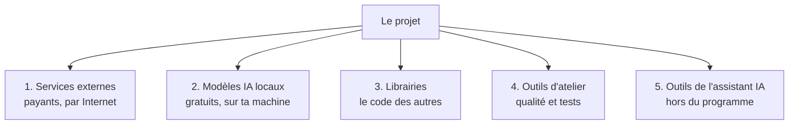
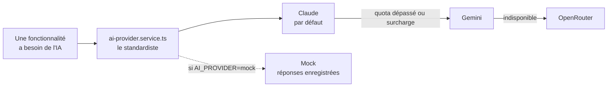
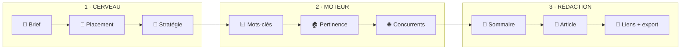
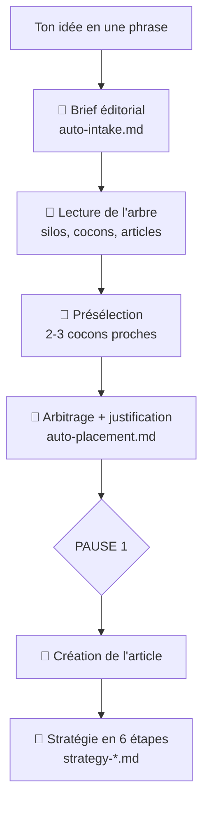
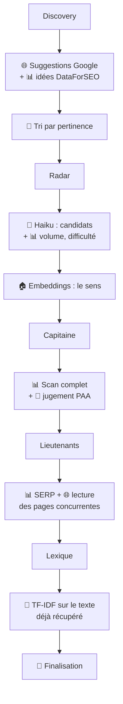
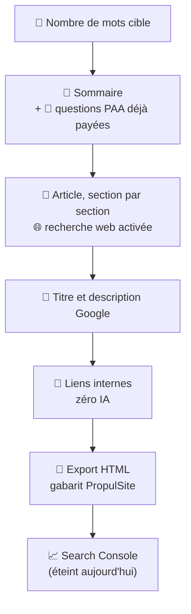
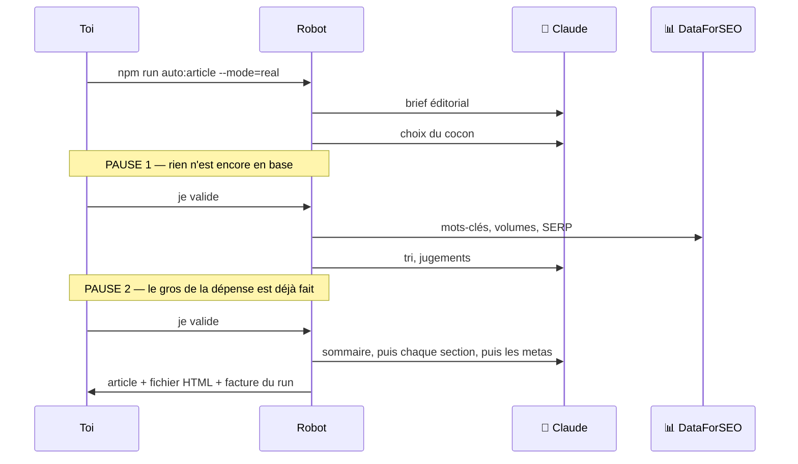
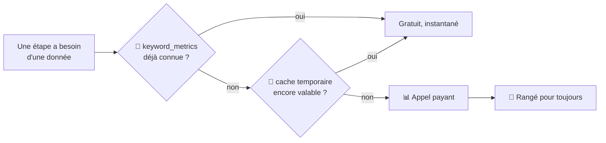
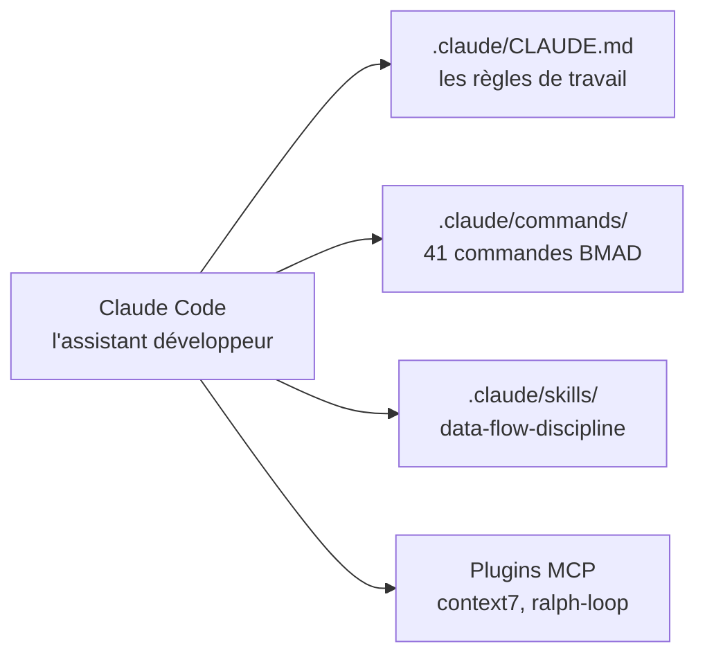

# Guide 4 — La boîte à outils

> Tout ce que le projet utilise : les services payants, les modèles d'IA, les
> librairies, les outils d'atelier et les outils de l'assistant IA.
> Pour chacun : à quoi il sert, où il est branché, et où le changer.

---

## 1. Les cinq familles d'outils

Image : un garage. Les **services externes** sont les fournisseurs chez qui tu
commandes des pièces (et qui envoient une facture). Les **modèles locaux** sont
une petite machine que tu as achetée une fois et qui tourne sans compteur. Les
**librairies** sont les outils déjà fabriqués que tu n'as pas à réinventer. Les
**outils d'atelier** sont le pied à coulisse et le banc de contrôle. Et les
**outils de l'assistant** sont ceux du mécanicien, pas de la voiture.

---

## 2. Les services externes

Ce sont les seuls qui coûtent de l'argent ou demandent un compte.

| Service | Ce qu'il apporte | Payant ? | Configuré chez toi ? | Où c'est branché |
|---|---|---|---|---|
| **Anthropic (Claude)** | Écrit les textes, prend les décisions de classement. Modèle par défaut : Haiku 4.5. | Oui, à l'usage | Oui | `server/services/external/claude.service.ts` |
| **DataForSEO** | Les vraies données Google : volumes de recherche, difficulté, pages concurrentes, questions PAA. | Oui, à l'appel | Oui | `server/services/external/dataforseo.service.ts` |
| **Google Gemini** | Solution de repli gratuite si Claude tombe ou est à court de quota. | Gratuit, limité | Oui | `server/services/external/gemini.service.ts` |
| **OpenRouter** | Deuxième repli, avec des modèles gratuits (suffixe `:free` obligatoire). | Gratuit, limité | Oui | `server/services/external/openrouter.service.ts` |
| **Google Search Console** | Les performances réelles de tes pages après publication. | Gratuit | **Non** (pas d'identifiants Google dans `.env`) | `server/services/external/gsc.service.ts` |
| **Tavily** | Recherche web pour l'analyse des manques de contenu. | Gratuit jusqu'à un seuil | **Non** (pas de clé dans `.env`) | `server/services/article/content-gap.service.ts` |

> Deux services sont donc **installés mais éteints** : Search Console et Tavily.
> Les fonctionnalités qui en dépendent ne marcheront pas tant que les clés ne
> sont pas remplies dans `.env`.

### Comment les quatre fournisseurs d'IA s'enchaînent

**Tout** passe par `ai-provider.service.ts`. C'est le standardiste : les
fonctionnalités ne connaissent jamais le fournisseur, elles demandent « de l'IA ».
C'est ce qui permet de changer de fournisseur en modifiant une seule ligne de `.env`.

Le **mock** n'entre jamais dans la chaîne de repli : c'est un choix explicite,
jamais un accident.

### Le garde-fou de dépense

`server/services/external/dataforseo-cost-guard.ts` compte ce que tu dépenses et
bloque au-delà de **0,50 $ par 30 minutes**. C'est un disjoncteur : il coupe avant
que la facture grimpe.

---

## 3. Les deux modèles IA qui tournent chez toi

Ceux-là sont **gratuits et hors ligne** : ils se téléchargent une fois, puis
fonctionnent sur ta machine, sans clé ni facture. Ils viennent de la librairie
`@huggingface/transformers`.

| Modèle | Où il tourne | Ce qu'il fait |
|---|---|---|
| `Xenova/multilingual-e5-small` | Sur le serveur (`embedding.service.ts`) | Transforme une phrase en série de nombres pour comparer le **sens** de deux textes, pas seulement les mots. |
| `Xenova/mobilebert-uncased-mnli` | Dans ton navigateur (`useNlpAnalysis.ts`) | Classe un texte dans des catégories sans avoir été entraîné exprès (« zero-shot »). |

Image : au lieu d'appeler un traducteur à chaque phrase, tu as un petit dictionnaire
électronique posé sur le bureau. Il est moins fort, mais il est gratuit et immédiat.

> Le premier lancement télécharge le modèle : c'est lent une fois, puis rapide.
> Si le téléchargement échoue, le programme continue sans lui (repli silencieux prévu).

---

## 4. Les librairies

### Côté application web

| Librairie | À quoi ça sert, en une phrase |
|---|---|
| **Vue 3** | Le moteur des écrans : quand une donnée change, l'affichage suit tout seul. |
| **Vue Router** | Fait correspondre une adresse (`/cocoon/9/moteur`) à un écran. |
| **Pinia** | Le plateau où l'on pose les données partagées entre écrans. |
| **TipTap** | L'éditeur de texte riche (gras, titres, liens), avec des extensions maison. |
| **VueUse** | Une boîte de petits outils tout faits (souris, presse-papier, minuteurs). |
| **marked** | Transforme du Markdown en HTML (pour afficher les réponses de l'IA). |
| **DOMPurify** | Le videur : nettoie le HTML avant affichage pour éviter le code malveillant. |
| **Vite** | Le chantier de développement : recharge la page à chaque sauvegarde, et fabrique la version finale. |

### Côté serveur

| Librairie | À quoi ça sert |
|---|---|
| **Express 5** | Le comptoir : écoute les requêtes et les distribue aux bonnes routes. |
| **pg** | Le tuyau vers PostgreSQL. |
| **Zod** | Le videur des données : vérifie que ce qui entre a la bonne forme, sinon refuse. |
| **Anthropic SDK** | Parle à Claude, y compris en flux continu. |
| **Google GenAI SDK** | Parle à Gemini. |
| **dotenv** | Lit le fichier `.env` où sont rangées les clés. |
| **chalk** | Met de la couleur dans le terminal (le robot s'en sert beaucoup). |
| **tsx** | Exécute du TypeScript directement, sans étape de compilation. |

---

## 5. Quand chaque outil entre en jeu

C'est le chapitre à lire pour comprendre **le tempo** : qui travaille à quel moment,
et à quel moment ça coûte de l'argent.

### La légende (valable pour tous les schémas ci-dessous)

| Symbole | Signification | Coût |
|---|---|---|
| 🧠 | **Claude** (ou le fournisseur d'IA actif) | Payant, à l'usage |
| 📊 | **DataForSEO** : les vraies données Google | Payant, à l'appel |
| 🌐 | **Web direct** : suggestions Google, lecture des pages concurrentes | Gratuit |
| 🏠 | **Modèle IA local** (Hugging Face, sur ta machine) | Gratuit |
| 🔧 | **Calcul maison** : du code, aucune dépendance extérieure | Gratuit |
| 💾 | **Base de données** : on écrit ou on relit ce qu'on sait déjà | Gratuit |

### Vue d'ensemble : les trois ateliers

À retenir : **le Moteur est l'atelier le plus coûteux** (c'est lui qui achète les
données Google), la Rédaction est le plus lent (l'IA écrit section par section),
et le Cerveau est le moins cher (deux ou trois appels IA).

### Atelier 1 · Cerveau — qui fait quoi

> La présélection des cocons est un **calcul maison gratuit** : on compare les mots
> de ta phrase aux noms des cocons. L'IA ne fait que trancher entre les finalistes.
> C'est pour ça que `--cocoon` économise un appel : il supprime l'étape 🧠.

Dans l'application, il existe une étape en plus : la **génération du plan d'articles**
d'un cocon, qui combine 🧠 (proposition des titres) et 📊 (les vraies questions PAA
de Google, via `/paa/batch`).

### Atelier 2 · Moteur — le plus gourmand

Trois choses importantes se cachent dans ce schéma :

1. **Le Lexique ne coûte rien.** Il travaille sur les pages concurrentes déjà
   téléchargées à l'étape Lieutenants. Rien n'est racheté.
2. **Les pages concurrentes sont lues gratuitement.** DataForSEO donne la liste des
   10 premiers résultats (payant), puis le programme va lire ces pages lui-même (gratuit).
3. **Les suggestions de complétion Google sont gratuites** : le programme interroge
   directement le service public de Google, pas DataForSEO.

### Atelier 3 · Rédaction — le plus lent

> **Le maillage interne n'utilise aucune IA.** C'est un calcul de correspondance
> entre le texte et les titres des autres articles. D'où la commande `--relink`,
> qu'on peut relancer autant de fois qu'on veut sans rien payer.

### La chronologie d'un run, et quand l'argent part

**Ce que ça veut dire concrètement** : à la pause 1, tu n'as dépensé que quelques
centimes ; abandonner coûte presque rien. À la pause 2, la majeure partie de la
facture est déjà passée, mais la Rédaction (la moitié du coût IA) reste à venir.
**C'est donc à la pause 2 qu'il faut être exigeant** : valider un mauvais Capitaine,
c'est payer une rédaction entière qui vise à côté.

### Récapitulatif : le coût par étape

| Étape | Outils | Ce que ça coûte |
|---|---|---|
| Brief + placement | 🧠 ×2 | Quelques centimes |
| Stratégie d'article | 🧠 | Quelques centimes |
| Discovery + Radar | 📊 🧠 🏠 | Modéré, très allégé par le cache |
| Capitaine | 📊 🧠 | **Le plus cher du Moteur** (un scan par candidat) |
| Lieutenants | 📊 🌐 | Un appel SERP, puis lecture gratuite |
| Lexique | 🔧 | Gratuit |
| Sommaire + article + metas | 🧠 | Environ la moitié de la facture IA |
| Maillage + export | 🔧 | Gratuit |

Totaux mesurés en juillet 2026 : **environ 0,35 $** pour un article intermédiaire
(0,09 $ d'IA + 0,27 $ de données Google) et **0,85 à 0,95 $** pour un pilier.

### Et le cache dans tout ça ?

Ce détour est fait **avant chaque appel payant**, à toutes les étapes du Moteur.
C'est la raison pour laquelle deux articles sur des sujets proches coûtent bien
moins cher que deux articles sans rapport : le second réutilise ce que le premier
a payé.

---

## 6. Les outils d'atelier (qualité)

Ils ne servent pas à écrire des articles, mais à garder le code sain.

| Outil | Ce qu'il vérifie | Commande |
|---|---|---|
| **oxlint** | Les erreurs de style, très vite. | `npm run lint` |
| **ESLint** | Les erreurs de style plus fines, règles Vue et TypeScript. | `npm run lint` |
| **Prettier** | La mise en forme du code. | `npm run format` |
| **vue-tsc / TypeScript** | Que les types sont cohérents (qu'on ne range pas un nombre là où on attend un texte). | `npm run type-check` |
| **Vitest** | Les tests automatiques (rapides, sans navigateur). | `npm run test:unit` |
| **Playwright** | Les tests dans un vrai navigateur. | `npm run test:browser` |
| **knip** | Le code mort : ce qui n'est plus utilisé par personne. | `npm run check:dead` |
| **madge** | Les dépendances circulaires (A a besoin de B qui a besoin de A). | `npm run check:cycles` |
| **dependency-cruiser** | Que les règles d'architecture sont respectées (ex. `src/` n'importe jamais `server/`). | `npm run check:arch` |
| **Stryker** | Les tests de mutation : il casse volontairement le code pour voir si les tests s'en aperçoivent. | `npm run test:mutation` |
| **Valideurs de contenu** | Propreté du texte : monologue de l'IA, texte hors paragraphe, bloc tronqué, Markdown résiduel, balise interdite, meta coupée, lien mort, double H1. | `npm run verify:content` |
| **Valideurs SEO** | Qualité du livrable : Capitaine dans le titre, l'intro, le titre Google et l'adresse ; longueur selon le niveau ; ancrage local ; mots-clés hors offre ; cannibalisation ; ordre du cocon ; pages exportées. | `npm run verify:content` |
| **`npm run verify`** | Tout ce qui précède, plus style, types, ~570 tests purs et fraîcheur de la photo de la base, en parallèle. ~35 s. | `npm run verify` |
| **husky + lint-staged** | Passe le linter automatiquement avant chaque commit git. | automatique |
| **patch-package** | Applique un correctif maison à une librairie externe. Ici : `patches/knip+6.4.1.patch`. | automatique |
| **concurrently / npm-run-all** | Lancent plusieurs commandes à la fois (`npm run dev` = serveur + application). | automatique |

---

## 7. Les outils internes (dossier `scripts/`)

### Ceux que tu utilises vraiment

| Script | Commande | Rôle |
|---|---|---|
| `auto-article/` | `npm run auto:article` | Le robot rédacteur. |
| `preview-article.mjs` | `npm run auto:preview` | Génère un aperçu autonome et le sert sur le port 4599. |
| `kill-port.mjs` | `npm run kill-ports` | Libère les ports 3400 et 5400. |
| `db-backup.ts` | `npm run db:backup` | Sauvegarde complète via `pg_dump` (structure + données). |
| `db-snapshot.ts` | `npm run db:snapshot` | Reprend la photo de la structure de la base. |
| `db-check.ts` | `npm run db:check` | Compare la base réelle à cette photo (empreinte sha256). |
| `db-clean-tests.ts` | `npm run db:clean-tests` | Évacue les articles laissés par les tests. Simulation par défaut. |
| `verify-content.ts` | `npm run verify:content` | Contrôle la qualité de tous les articles en base (un valideur par défaut connu). |
| `clean-article-content.ts` | `npm run content:clean -- --id=455` | Répare un article déjà rédigé. Simulation par défaut. |
| `test-snapshot.ts` / `test-check.ts` | `npm run test:snapshot` / `test:check` | Enregistre l'état des tests, puis dit si ton chantier a cassé quelque chose. |

### Ceux qui dorment (outils d'époque, gardés pour mémoire)

`migrate-slug-to-id.ts`, `migrate-cocoon-strategy-to-table.ts`,
`migrate-radar-cache-to-table.ts` : des déménagements de données déjà faits.
`fix-*.mjs` et `update-*-imports.mjs` : des corrections de masse lors de
réorganisations passées. `cleanup-keywords.mjs`, `cleanup-captain-explorations.ts`,
`clear-article-lock.ts`, `audit-captain-duplicates.ts`, `debug-captain.mjs`,
`db-introspect.ts`, `backfill-article-fields.cjs` : du dépannage ponctuel.

> Ne les relance pas « pour voir » : certains écrivent dans la base.

---

## 8. Les outils de l'assistant IA (le dossier `.claude/`)

Attention à la confusion : ces outils servent **à développer le projet**, pas à
fabriquer des articles. Le programme ne les appelle jamais quand il tourne.

| Élément | Ce que c'est |
|---|---|
| `.claude/CLAUDE.md` | Les règles que l'assistant doit suivre : boucle de travail, conventions, anti-patterns. |
| `.claude/commands/` | 41 commandes **BMAD** : une méthode pour cadrer le travail (créer un PRD, une story, faire une revue de code, un rétrospectif). Elles produisent les documents de `_bmad-output/`. |
| `.claude/skills/data-flow-discipline` | Un savoir-faire maison : cartographier une donnée partagée avant de la modifier, pour éviter les bugs « ça marche au premier chargement mais pas au rechargement ». |
| `.claude/settings.json` | Les permissions accordées à l'assistant et les plugins activés. |

### C'est quoi, MCP ?

**MCP** (Model Context Protocol) est une **prise standard** qui permet à une IA de
brancher des outils extérieurs. Comme une prise USB : n'importe quel appareil
compatible se connecte sans adaptateur spécial.

Deux plugins sont activés dans `.claude/settings.json` :

| Plugin | Ce qu'il apporte |
|---|---|
| **context7** | Va chercher la documentation **à jour** d'une librairie (Vue, Express, Zod…) au lieu de se fier à la mémoire de l'IA, qui peut dater. |
| **ralph-loop** | Fait tourner une tâche en boucle jusqu'à ce qu'elle soit finie. |

> **Important** : le dossier `.claude/` est **ignoré par git** (ligne 21 du
> `.gitignore`). Il n'existe que sur ta machine. Si tu clones le projet ailleurs,
> ces règles et commandes ne suivent pas — il faut les recopier.

---

## 9. Où changer quoi

| Je veux changer… | Je vais dans… |
|---|---|
| Le fournisseur d'IA | `.env` → `AI_PROVIDER` (`claude`, `gemini`, `openrouter`, `mock`) |
| Le modèle Claude | `.env` → `CLAUDE_MODEL` (et `HAIKU_MODEL` pour les tâches rapides) |
| Désactiver le repli automatique | `.env` → `AI_PROVIDER_NO_FALLBACK=1` |
| Le plafond de dépense SEO | `.env` → `DATAFORSEO_COST_BUDGET_USD` et `DATAFORSEO_COST_WINDOW_MIN` |
| Utiliser le bac à sable DataForSEO | `.env` → `DATAFORSEO_SANDBOX=true` |
| Les ports | `.env` → `PORT` (serveur) et `VITE_PORT` (application) |
| La base de données | `.env` → `PG_HOST`, `PG_PORT`, `PG_USER`, `PG_PASSWORD`, `PG_DATABASE` |
| Activer la recherche web pendant la rédaction | `.env` → `WEB_SEARCH_ENABLED` |
| Le style d'écriture | `server/prompts/system-propulsite.md` |
| Le gabarit HTML exporté | `server/services/article/export.service.ts` et `src/assets/templates/templateArticle.html` |

> Le fichier `.env` contient tes clés : il est **ignoré par git** et ne doit jamais
> être partagé. Le modèle à copier est `.env.example`.

---

## 10. Ce que le projet n'utilise pas

Utile à savoir pour ne pas chercher longtemps :

- **Aucun CMS branché** : ni WordPress, ni Ghost, ni Webflow. La publication est manuelle.
- **Aucun hébergement** : tout tourne sur ta machine (serveur, base, modèles locaux).
- **Aucun service d'authentification** : l'application n'a ni compte, ni mot de passe.
  Le serveur n'autorise que les pages ouvertes depuis `localhost` à l'appeler
  (règle CORS, `server/index.ts:38`), mais il écoute sur toutes les interfaces
  réseau : sur un wifi public, un autre appareil du réseau pourrait l'interroger
  directement. À garder en tête si tu travailles hors de chez toi.
- **Aucun MCP au moment d'écrire un article** : MCP ne sert qu'à l'assistant développeur.
- **Aucune base de test séparée** : les tests écrivent dans la base de développement.
