# Guide 4 — Les services en action

> Qui travaille, à quel moment, avec quelles données, et pour quel prix, pendant
> que tu fabriques un article : l'IA, DataForSEO, Google, les calculs faits sur ta
> machine et la base de données.
> Les librairies et outils de développement sont regroupés en fin de guide (§ 9 à 14).
>
> Tous les faits viennent du code (septembre 2026). Les chemins de fichiers sont là
> pour vérifier. Quand un exemple est inventé pour illustrer, il est marqué *(exemple)*.

---

## 1. La distribution : qui est qui

Image : un tournage. Le **serveur** est le réalisateur. Chaque service est un acteur
qui n'entre en scène qu'au moment où on l'appelle, dit sa réplique, et ressort.

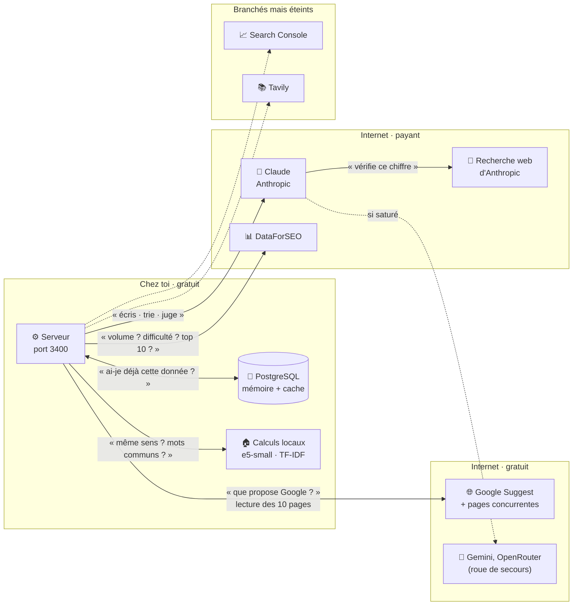

| | Service | Ce qu'on lui demande | Ce qu'il rend | Prix | Chez toi |
|---|---|---|---|---|---|
| 🧠 | **Claude, rôle « trieur »** | « Parmi ces 120 mots-clés, lesquels ne parlent pas de création de site ? » | Une réponse structurée (JSON) : une liste, un badge, un choix | Quelques dixièmes de centime | Actif · Haiku 4.5 |
| 🧠 | **Claude, rôle « plume »** | « Écris la section *Combien coûte un site vitrine ?* » | Du texte qui arrive mot à mot (en flux) | L'essentiel de la facture IA | Actif · Haiku 4.5 (réglé par `CLAUDE_MODEL`) |
| 🔎 | **Recherche web d'Anthropic** | Claude cherche lui-même un tarif ou une source avant d'écrire | Des pages web à citer | Facturée à la recherche, **absente du récapitulatif du robot** | Actif en mode réel, 3 recherches max par section |
| 🧠 | **Gemini, OpenRouter** | Les mêmes questions, quand Claude est saturé | Idem | Gratuits, limités | En réserve |
| 📊 | **DataForSEO Labs** | « Volume, difficulté, coût par clic de *création de site web Toulouse* ? » | 480 recherches/mois, difficulté 83 *(données réelles du 21/09)* | 0,01 $ l'appel + 0,0001 $ par mot-clé en lot | Actif, production |
| 📊 | **DataForSEO SERP** | « Montre-moi la première page Google de ce mot-clé » | Les 10 premiers sites, et les questions « Autres questions posées » (PAA) | 0,0006 $ (liste seule) à 0,002 $ (avec questions) | Actif, production |
| 🌐 | **Google Suggest / Autocomplete** | « Que propose Google quand on tape *création site web* ? » | *création site web gratuit, … prix, … Toulouse* *(exemple)* | Gratuit (service public, non officiel) | Actif |
| 🌐 | **Pages concurrentes** | Le serveur va lire lui-même les 10 pages du top 10 | Leurs titres H1 à H3 et leur texte | Gratuit | Actif |
| 🏠 | **Modèle local e5-small** | « Cette question de Google parle-t-elle du même sujet que mon article ? » | Un score de proximité de sens, de 0 à 1 | Gratuit, sur ta machine | Actif |
| 🏠 | **TF-IDF** (calcul maison) | « Quels mots emploient la plupart des 10 concurrents ? » | Une liste classée : obligatoires, différenciants, optionnels | Gratuit | Actif |
| 💾 | **PostgreSQL** | « Ai-je déjà payé cette donnée ? » | La réponse gardée, ou rien | Gratuit | Actif |
| 📈 | **Google Search Console** | « Combien de fois ma page a-t-elle été vue ? » | Impressions, clics, position | Gratuit | **Éteint** : aucun identifiant Google dans `.env` |
| 📚 | **Tavily** | « Que disent les 5 meilleures pages sur ce sujet ? » | Le texte brut de ces pages | Compte requis | **Éteint** : pas de clé dans `.env` |
| — | **MCP** | — | — | — | **Aucun** pendant la fabrication (voir § 5.6) |

> **Un seul modèle Claude chez toi.** Ton `.env` règle `CLAUDE_MODEL=claude-haiku-4-5`,
> donc la plume écrit avec Haiku 4.5, comme le trieur. Sans ce réglage, le code
> écrirait avec **Sonnet 4.6**, plus fin mais plus cher
> (`server/services/external/claude.service.ts:132`). Le trieur, lui, reste toujours
> sur Haiku (`claude.service.ts:56`).

---

## 2. La carte : quelle étape appelle quel service

Lis une ligne pour savoir ce qui se passe à une étape, une colonne pour savoir quand
un service travaille. « Appli » = application web ; « robot » = `npm run auto:article`.

Ce tableau détaille le **temps 3 (Service)** de la grille en 8 temps que suit chaque
étape ([GUIDE-01-UTILISATION.md](GUIDE-01-UTILISATION.md) § 2). Les 7 autres temps
de chaque étape sont dans les grilles « En coulisses » de GUIDE-01.

| Étape | 🧠 IA | 📊 DataForSEO | 🌐 Google gratuit | 🏠 Local | 💾 Base |
|---|---|---|---|---|---|
| **CERVEAU** | | | | | |
| Brief (robot) | plume ×1 · `auto-intake.md` | — | — | — | rien n'est écrit |
| Choix du cocon (robot) | plume ×1 · `auto-placement.md` (sautée avec `--cocoon`) | — | — | présélection par mots communs | lit silos et cocons |
| Après la pause 1 | — | — | — | — | écrit l'article et sa stratégie |
| Stratégie de cocon (appli) | plume, à la demande, à chaque étape | — | — | — | `cocoon_strategies` |
| Plan d'articles du cocon (appli) | plume ×4 | SERP ×1 par question (PAA) | — | — | crée les articles « à rédiger » |
| **MOTEUR** | | | | | |
| Discovery (appli) | trieur : génère ~20 idées, puis trie par lots de 120 | Labs ×5 : suggestions, similaires, idées, puis chiffres et intention | Suggest : 4 stratégies | — | cache 24 h, puis `keyword_discoveries` |
| Discovery (robot) | trieur ×1 : ~20 idées | — | — | — | — |
| Radar | — | chiffres + intention en lot, puis SERP par mot-clé | autocomplétion par mot-clé | e5-small : sens des questions | `keyword_metrics` |
| Capitaine | trieur : juge les questions · plume : conseil (appli) | 3 appels par candidat, si pas déjà en mémoire | autocomplétion | score de marché | `keyword_metrics`, `captain_explorations` |
| Lieutenants | plume : propositions et plan (appli) · aucune IA (robot) | SERP simple + SERP avec questions | lecture des 10 pages | choix du robot : 60 % présence chez les concurrents, 40 % marché | `keyword_serp_*` (7 jours) |
| Lexique | plume : analyse (appli) · aucune IA (robot) | — | — (pages déjà lues) | TF-IDF | `lexique_explorations`, `article_keywords` |
| **RÉDACTION** | | | | | |
| Sommaire | plume ×1, en flux | robot : aucun, questions reprises du Moteur · appli : 4 appels si le brief n'est pas en mémoire | — | — | `article_content.outline` |
| Article | plume ×1 par section + 🔎 jusqu'à 3 recherches | — | — | nettoyage du texte | `article_content` |
| Titre et description Google | plume ×1 | — | — | — | `articles.meta_*` |
| Liens internes | **aucune IA** | — | — | ressemblance de mots | `internal_links` |
| Export | — | — | — | gabarit HTML | fichier dans `_auto-output/` |
| **APRÈS** | | | | | |
| Suivi des positions | — | — | 📈 Search Console (éteint) | — | — |

À retenir en une phrase par colonne :

- **🧠 L'IA** travaille surtout au début (décider) et à la fin (écrire).
- **📊 DataForSEO** ne travaille que dans le Moteur et dans le plan de cocon.
- **🌐 Google gratuit** accompagne DataForSEO : il complète les chiffres sans rien coûter.
- **🏠 Le local** fait tous les calculs de comparaison, sans jamais facturer.

---

## 3. Un run complet, vu de chaque service

Voici un run réel du robot (`--mode=real`), du premier mot tapé au fichier HTML.
Chaque colonne est un service ; chaque flèche, un appel. Les cadres gris « en même
temps » montrent les appels lancés **en parallèle**.

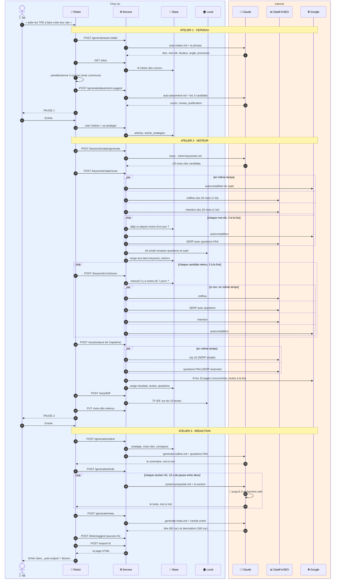

Trois leçons que ce schéma rend visibles :

1. **Rien ne part vers DataForSEO avant la pause 1.** Abandonner à la pause 1 ne
   coûte que deux appels d'IA.
2. **Presque tout DataForSEO se joue entre les pauses 1 et 2.** C'est pour ça que la
   pause 2 est le moment d'être exigeant : la suite (la Rédaction) est la plus longue.
3. **Dans le robot, la Rédaction ne parle plus à DataForSEO ni à Google.** Elle
   réutilise ce que le Moteur a trouvé. Seule la recherche web de Claude sort sur
   Internet. (Dans l'application, le sommaire peut encore déclencher 4 appels
   DataForSEO, si le brief n'est pas déjà en mémoire.)

> Le détail étape par étape, avec les différences entre l'application et le robot,
> est dans [GUIDE-01-UTILISATION.md](GUIDE-01-UTILISATION.md) (sections 3, 4 et 5).

---

## 4. Ce qui travaille en même temps, et ce qui fait la queue

| En même temps | Combien | Pourquoi |
|---|---|---|
| Les 3 appels de Discovery (appli) | 3 | Suggestions Google, idées de l'IA et DataForSEO sont indépendants. |
| Chiffres + intention + autocomplétion du Radar | 3 | Même mot-clé, trois questions différentes. |
| Les 4 appels d'un scan de Capitaine | 4 | Idem, pour un seul mot-clé. |
| La lecture des 10 pages concurrentes | 10 | Chaque page est indépendante (10 s maximum chacune). |
| Le tri par pertinence de Discovery | 4 lots de 120 | Pour aller vite sur des centaines de mots-clés. |

| L'un après l'autre | Rythme | Pourquoi |
|---|---|---|
| Les mots-clés du Radar | 3 à la fois | Ne pas se faire bloquer par Google (1 requête par seconde pour l'autocomplétion). |
| Les candidats Capitaine (robot) | 3 à la fois | Même raison, et le budget DataForSEO. |
| Les sections de l'article | 1 par 1, **15 s de pause** | Chaque section lit la fin de la précédente, et Claude limite le débit. |
| Une section refusée pour surcharge | jusqu'à 4 essais, 60 s × n | Laisser Claude respirer avant de réessayer. |

C'est ce qui explique les durées : le Moteur prend quelques minutes (beaucoup
d'appels, mais en parallèle), la Rédaction d'un pilier bien plus (des dizaines de
sections, une par une, avec 15 s d'attente entre chacune).

---

## 5. Zoom service par service

### 5.1 · 📊 DataForSEO : les vraies données Google

DataForSEO est un « grossiste » de données Google : il interroge Google pour toi et
revend les réponses. Le projet utilise deux rayons : **Labs** (les chiffres d'un
mot-clé) et **SERP** (la page de résultats).

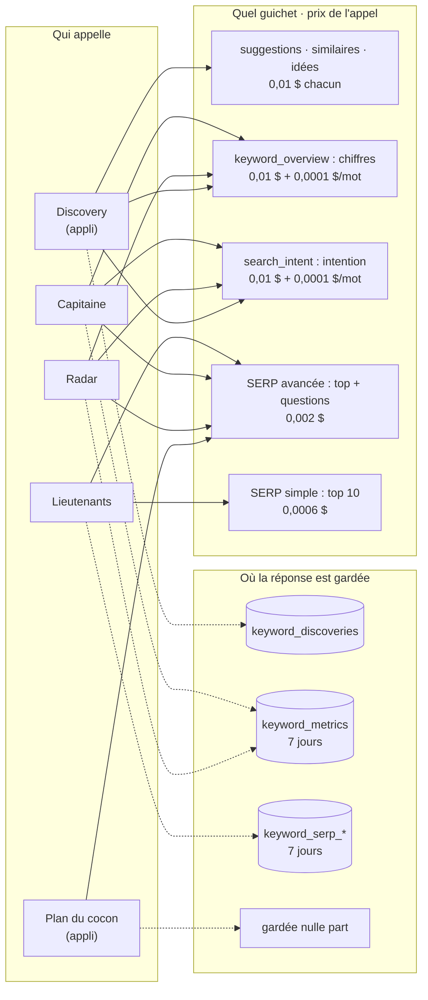

**Ce qu'il a répondu pour le pilier du cocon n°1** *(données réelles du 21/09)* :

| Mot-clé | Recherches / mois | Difficulté (0-100) | Décision |
|---|---|---|---|
| création de site web Toulouse | 480 (+390 en variante) | 83 | Capitaine du pilier |
| prix création site web | 480 | 13 | Lieutenant, puis branche A |
| devis création site web | 170 | 9 (clic à 20,87 €) | Lieutenant, puis branche B |
| création site web artisan | 170 | 0 | Futur Capitaine d'une fiche |
| site e-commerce | 1 600 | 22 | Refusé : hors offre |
| développeur web | 6 600 | 11 | Refusé : les gens cherchent un emploi |

**Le disjoncteur.** Avant chaque appel, `dataforseo-cost-guard.ts` réserve le prix
prévu et **refuse l'appel** si la dépense des 30 dernières minutes dépasserait le
plafond. Le plafond du code est 0,50 $, et ton `.env` l'a relevé à **2,00 $** pour
les piliers. Le compteur vit en mémoire : redémarrer le serveur le remet à zéro.

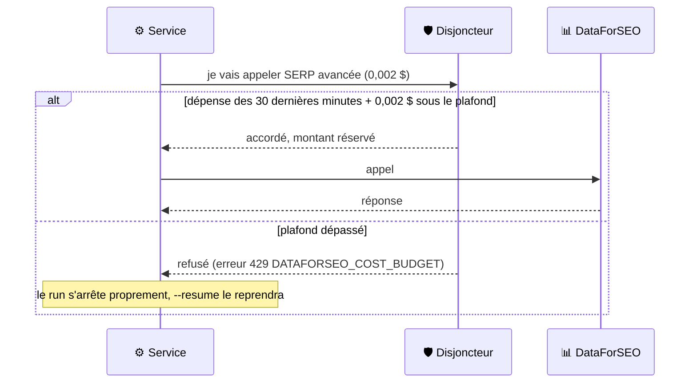

> ⚠️ **DataForSEO tourne en production** : ton `.env` n'a pas `DATAFORSEO_SANDBOX`.
> Seul le mode simulé (`--mode=mock`) bascule vers le bac à sable gratuit.

### 5.2 · 🧠 Claude : deux métiers, un standardiste

Toutes les demandes d'IA passent par un standardiste unique,
`server/services/external/ai-provider.service.ts`. Les fonctionnalités ne savent
jamais quel fournisseur répond : elles demandent « de l'IA ».

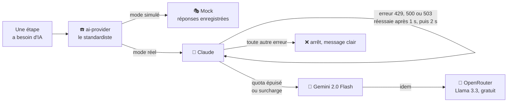

Les deux métiers de Claude :

| | Le **trieur** | La **plume** |
|---|---|---|
| Ce qu'il fait | Classe, juge, choisit | Écrit du texte suivi |
| Forme de la réponse | Structurée (JSON), d'un bloc | En flux, mot à mot |
| Modèle | Haiku 4.5, toujours | `CLAUDE_MODEL` : Haiku 4.5 chez toi |
| Recherche web | Jamais | Pour les sections d'article, en mode réel |

**Chaque prompt, à son étape** (`server/prompts/`) :

| Atelier | Étape | Prompt | Métier |
|---|---|---|---|
| Cerveau | Brief (robot) | `auto-intake.md` | plume, réponse d'un bloc |
| Cerveau | Choix du cocon (robot) | `auto-placement.md` | plume, réponse d'un bloc |
| Cerveau | Stratégie de cocon (appli) | `cocoon-brainstorm.md`, `strategy-deepen.md`, `strategy-merge.md` | plume |
| Cerveau | Plan d'articles (appli) | `cocoon-articles-topics.md`, `cocoon-articles.md`, `cocoon-paa-queries.md`, `cocoon-articles-spe.md` | plume |
| Cerveau | Consignes d'article (appli) | `micro-context-suggest.md` | plume, en flux |
| Moteur | Idées de mots-clés | `intent-keywords.md` | trieur |
| Moteur | Tri par pertinence (appli) | consigne écrite dans le code | trieur |
| Moteur | Jugement des questions PAA | `captain-paa-judge.md` | trieur |
| Moteur | Conseil sur le Capitaine (appli) | `capitaine-ai-panel.md` | plume, en flux |
| Moteur | Lieutenants et plan (appli) | `propose-lieutenants.md`, `lieutenants-hn-structure.md` | plume, en flux |
| Moteur | Lexique (appli) | `lexique-analysis-upfront.md` | plume, en flux |
| Rédaction | Longueur cible (appli) | consigne écrite dans le code | trieur |
| Rédaction | Sommaire | `generate-outline.md` | plume, en flux |
| Rédaction | Article | `system-propulsite.md` + `generate-article-section.md` | plume, en flux, 🔎 |
| Rédaction | Titre et description Google | `generate-meta.md` | plume, réponse d'un bloc |

**Une section avec recherche web, au ralenti** : c'est exactement là que naissait
le « monologue de l'IA » corrigé en septembre.

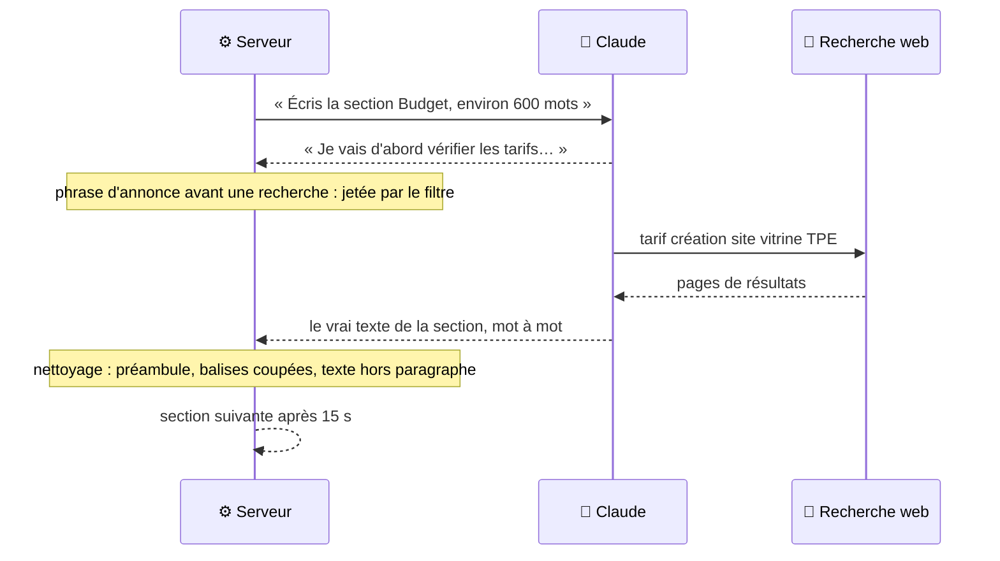

### 5.3 · 🌐 Google, en direct et gratuitement

Trois portes, aucune clé, aucune facture :

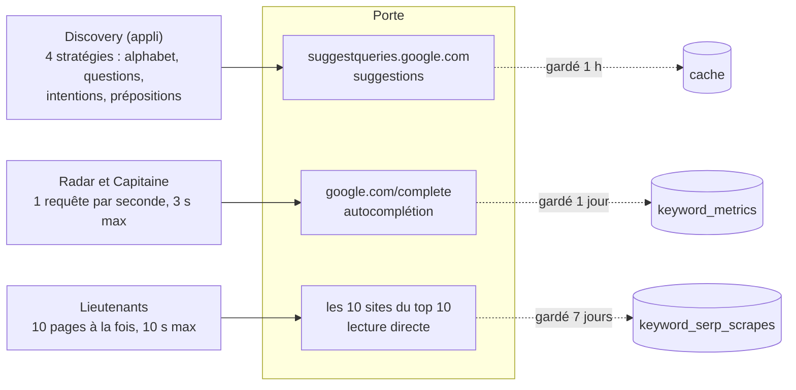

*(exemple)* La stratégie « alphabet » tape *création site web a*, *création site web b*…
et récolte ce que Google propose à chaque lettre. La stratégie « questions » tape
*comment création site web*, *pourquoi création site web*… C'est ainsi qu'on attrape
les vraies formulations des gens, gratuitement.

La lecture des pages concurrentes ne garde que les titres H1 à H3 et le texte, avec
de simples motifs de recherche (pas de navigateur). Aujourd'hui, **200 pages** sont en
mémoire, soit 20 analyses de top 10.

### 5.4 · 🏠 Ce qui se calcule sur ta machine

**Le modèle e5-small** (`embedding.service.ts`) transforme une phrase en une suite de
nombres qui représente son **sens**. Deux phrases de sens proche donnent des suites
proches, même sans mot commun. Il se télécharge une fois (60 s maximum) ; s'il échoue,
le score reste vide et le reste continue.

*(exemple)* Pour un article sur la création de site à Toulouse :

| Question de Google | Proximité de sens | Verdict |
|---|---|---|
| Combien coûte un site internet pour un artisan ? | élevée | à traiter |
| Faut-il un site ou une page Facebook ? | moyenne | à envisager |
| Comment devenir développeur web ? | faible | hors sujet |

**Le TF-IDF** (`tfidf.service.ts`) compte, pour chaque mot, dans combien des 10 pages
concurrentes il apparaît :

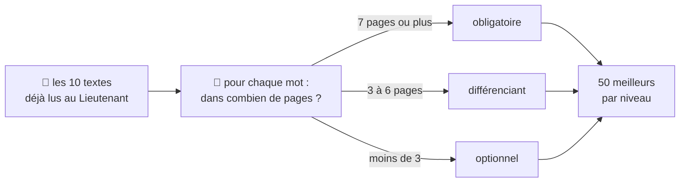

*(exemple)* Si « hébergement » apparaît chez 8 concurrents sur 10, ne pas en parler,
c'est laisser un trou que Google remarquera.

**Les autres calculs maison** : la présélection des cocons (mots communs avec ta
phrase), le choix des Lieutenants par le robot (60 % présence dans les titres
concurrents, 40 % marché), les scores de marché, le maillage interne, le nettoyage
du texte et le gabarit HTML.

### 5.5 · 📈 📚 Les deux services éteints

**Google Search Console** est prêt côté code, mais rien n'est branché. Voici ce qui
se passerait si tu ajoutais `GOOGLE_CLIENT_ID` et `GOOGLE_CLIENT_SECRET` au `.env` :

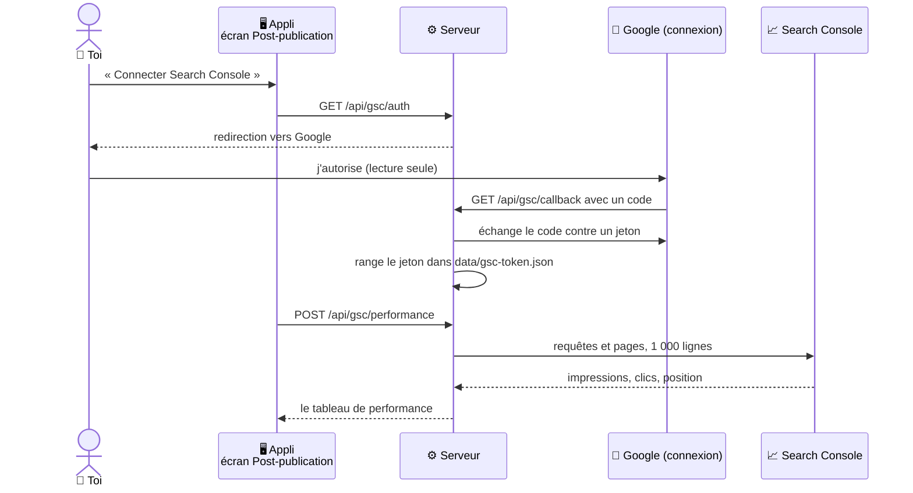

> Même connecté, il manquerait une pièce : **aucun article ne sait quelle page il
> est devenu**. La base ne garde ni l'adresse publiée ni la date de mise en ligne.
> C'est au plan d'action de l'audit (P2).

**Tavily** sert à l'analyse des manques de contenu (onglet de l'application) : il lit
les 5 meilleures pages d'un sujet, puis le trieur de Claude en tire les thèmes que
personne ne traite. Sans clé `TAVILY_API_KEY`, cette analyse échoue, sauf si la
réponse est déjà en mémoire.

### 5.6 · MCP : pourquoi aucun

**MCP** (Model Context Protocol) est une prise standard qui permet à une IA de
brancher des outils extérieurs, comme une prise USB. **Le projet n'en utilise aucun
pendant la fabrication d'un article** : aucune librairie MCP dans le projet, aucun
fichier `.mcp.json`. Claude y est appelé directement par son SDK.

MCP ne sert qu'à l'**assistant développeur** (Claude Code), pour travailler *sur*
le projet : chercher la documentation d'une librairie (context7), écrire un document
partagé (Claude Docs). Voir § 12.

---

## 6. La mémoire : ce qui évite de repayer

C'est le **temps 2** de la grille : juste après le déclencheur, avant tout appel payant.
Chaque service a **sa propre règle** de mémoire. Il n'y a pas de grand cache commun :
chacun regarde s'il a déjà la réponse avant d'appeler.

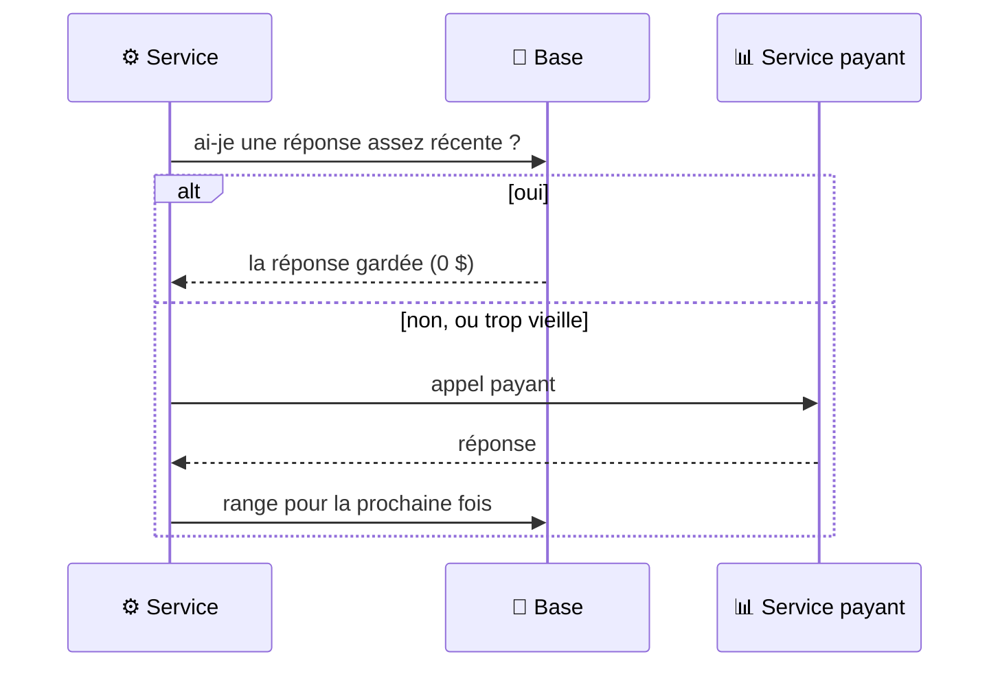

| Donnée | Où | Gardée | Qui la relit |
|---|---|---|---|
| Chiffres d'un mot-clé (volume, difficulté, CPC) | `keyword_metrics` | 7 jours | Capitaine, contenu manquant |
| Autocomplétion d'un mot-clé | `keyword_metrics` | 1 jour (30 min si vide) | Radar, Capitaine |
| Questions PAA d'un mot-clé | `keyword_metrics` | 1 jour | Radar, Capitaine |
| Top 10, textes et questions d'une SERP | `keyword_serp_*` | 7 jours (+ 1 h en mémoire vive) | Lieutenants, Lexique, sommaire |
| Brief DataForSEO du sommaire (appli) | cache `dataforseo` | 7 jours | Rédaction dans l'application |
| Récolte Discovery | cache `keyword-discovery` | 24 h | Discovery |
| Suggestions Google | cache `suggest` | 1 h | Discovery |
| Performance Search Console | cache `gsc` | 1 jour | Post-publication |

**Deux trous à connaître** :

- Au Radar, les **chiffres et l'intention en lot sont rachetés à chaque scan** : aucune
  mémoire n'est consultée avant (`keyword-radar.service.ts:230-240`).
- Les **questions PAA du plan de cocon** ne sont gardées nulle part : régénérer un plan
  les rachète.

Aujourd'hui, la base connaît **3 258 mots-clés**, dont **169** avec leurs chiffres
Google complets.

---

## 7. L'argent : où il part, et ce que la facture ne montre pas

| Étape | Services | Ce que ça coûte |
|---|---|---|
| Brief + choix du cocon | 🧠 ×2 | Quelques centimes |
| Discovery + Radar | 📊 🧠 🌐 🏠 | Modéré ; questions et autocomplétion gratuites si le mot-clé a été vu dans la journée |
| Capitaine | 📊 🌐 | **Le plus cher du Moteur** : 3 appels payants par candidat ; **0 $ avec `--capitaine`** |
| Lieutenants | 📊 🌐 | 2 appels SERP, puis lecture gratuite des pages |
| Lexique | 🏠 | Gratuit |
| Sommaire + article + metas | 🧠 🔎 | La moitié ou plus de la facture IA |
| Liens + export | 🏠 | Gratuit |

Totaux mesurés en juillet 2026 : **environ 0,35 $** pour un article intermédiaire
(0,09 à 0,11 $ d'IA, 0,24 à 0,28 $ de données Google) et **0,85 à 0,95 $** pour un
pilier (20 à 25 sections avec recherche web).

**Ce que le récapitulatif du robot ne compte pas** :

- **Les recherches web de Claude**, facturées à part par Anthropic.
- **Une partie de DataForSEO sur les runs de plus de 30 minutes** : le robot mesure la
  dépense dans la fenêtre glissante du disjoncteur, qui oublie ce qui a plus de
  30 minutes. Un pilier dépasse souvent cette durée.

Pour la vraie dépense, regarde les soldes sur les sites d'Anthropic et de DataForSEO.

---

## 8. Mode simulé, mode réel : qui est remplacé par quoi

| Service | `--mode=mock` (simulé) | `--mode=real` |
|---|---|---|
| 🧠 Claude | 🎭 réponses enregistrées, 0 $ | vrai Claude |
| 📊 DataForSEO | bac à sable gratuit (fausses données) | production, facturée |
| 🌐 Google gratuit | **réel** | réel |
| 🔎 Recherche web | coupée | active |
| 🏠 Local | réel | réel |

> ⚠️ **Le mode reste collé au serveur.** Le robot règle le serveur en mode simulé
> ou réel au démarrage, et **ne le remet jamais comme avant**. Après un run réel,
> l'application web ouverte sur le même serveur utilise donc aussi les vrais
> services, payants, jusqu'au prochain redémarrage du serveur.
> (`scripts/auto-article/index.ts:121`, mode gardé en mémoire vive par le serveur.)

---

## 9. Les librairies (le code des autres)

### Côté application web

| Librairie | À quoi ça sert, en une phrase |
|---|---|
| **Vue 3** | Le moteur des écrans : quand une donnée change, l'affichage suit tout seul. |
| **Vue Router** | Fait correspondre une adresse (`/cocoon/9/moteur`) à un écran. |
| **Pinia** | Le plateau où l'on pose les données partagées entre écrans. |
| **TipTap** | L'éditeur de texte riche (gras, titres, liens), avec des extensions maison. |
| **VueUse** | Une boîte de petits outils tout faits (souris, presse-papier, minuteurs). |
| **marked** | Transforme du Markdown en HTML (pour afficher les réponses de l'IA). |
| **DOMPurify** | Le videur : nettoie le HTML avant affichage pour éviter le code malveillant. |
| **Vite** | Le chantier de développement : recharge la page à chaque sauvegarde, et fabrique la version finale. |

### Côté serveur

| Librairie | À quoi ça sert |
|---|---|
| **Express 5** | Le comptoir : écoute les requêtes et les distribue aux bonnes routes. |
| **pg** | Le tuyau vers PostgreSQL. |
| **Zod** | Le videur des données : vérifie que ce qui entre a la bonne forme, sinon refuse. |
| **Anthropic SDK** | Parle à Claude, y compris en flux continu et avec la recherche web. |
| **Google GenAI SDK** | Parle à Gemini. |
| **@huggingface/transformers** | Fait tourner le modèle e5-small sur ta machine. |
| **dotenv** | Lit le fichier `.env` où sont rangées les clés. |
| **chalk** | Met de la couleur dans le terminal (le robot s'en sert beaucoup). |
| **tsx** | Exécute du TypeScript directement, sans étape de compilation. |

> Un second modèle local, `Xenova/mobilebert-uncased-mnli`, existe dans le code du
> navigateur (`useNlpAnalysis.ts`), mais l'écran qui l'utilise n'est affiché nulle
> part : il ne tourne jamais.

---

## 10. Les outils d'atelier (qualité)

Ils ne servent pas à écrire des articles, mais à garder le code sain.

| Outil | Ce qu'il vérifie | Commande |
|---|---|---|
| **oxlint** | Les erreurs de style, très vite. | `npm run lint` |
| **ESLint** | Les erreurs de style plus fines, règles Vue et TypeScript. | `npm run lint` |
| **Prettier** | La mise en forme du code. | `npm run format` |
| **vue-tsc / TypeScript** | Que les types sont cohérents (qu'on ne range pas un nombre là où on attend un texte). | `npm run type-check` |
| **Vitest** | Les tests automatiques (rapides, sans navigateur). | `npm run test:unit` |
| **Playwright** | Les tests dans un vrai navigateur. | `npm run test:browser` |
| **knip** | Le code mort : ce qui n'est plus utilisé par personne. | `npm run check:dead` |
| **madge** | Les dépendances circulaires (A a besoin de B qui a besoin de A). | `npm run check:cycles` |
| **dependency-cruiser** | Que les règles d'architecture sont respectées (ex. `src/` n'importe jamais `server/`). | `npm run check:arch` |
| **Stryker** | Les tests de mutation : il casse volontairement le code pour voir si les tests s'en aperçoivent. | `npm run test:mutation` |
| **Valideurs de contenu** | Propreté du texte : monologue de l'IA, texte hors paragraphe, bloc tronqué, Markdown résiduel, balise interdite, meta coupée, lien mort, double H1. | `npm run verify:content` |
| **Valideurs SEO** | Qualité du livrable : Capitaine dans le titre, l'intro, le titre Google et l'adresse ; longueur selon le niveau ; ancrage local ; mots-clés hors offre ; cannibalisation ; ordre du cocon ; pages exportées. | `npm run verify:content` |
| **`npm run verify`** | Tout ce qui précède, plus style, types, ~570 tests purs et fraîcheur de la photo de la base, en parallèle. ~35 s. | `npm run verify` |
| **husky + lint-staged** | Passe le linter automatiquement avant chaque commit git. | automatique |
| **patch-package** | Applique un correctif maison à une librairie externe. Ici : `patches/knip+6.4.1.patch`. | automatique |
| **concurrently / npm-run-all** | Lancent plusieurs commandes à la fois (`npm run dev` = serveur + application). | automatique |

---

## 11. Les outils internes (dossier `scripts/`)

### Ceux que tu utilises vraiment

| Script | Commande | Rôle |
|---|---|---|
| `auto-article/` | `npm run auto:article` | Le robot rédacteur. |
| `preview-article.mjs` | `npm run auto:preview` | Génère un aperçu autonome et le sert sur le port 4599. |
| `kill-port.mjs` | `npm run kill-ports` | Libère les ports 3400 et 5400. |
| `db-backup.ts` | `npm run db:backup` | Sauvegarde complète via `pg_dump` (structure + données). |
| `db-snapshot.ts` | `npm run db:snapshot` | Reprend la photo de la structure de la base. |
| `db-check.ts` | `npm run db:check` | Compare la base réelle à cette photo (empreinte sha256). |
| `db-clean-tests.ts` | `npm run db:clean-tests` | Évacue les articles laissés par les tests. Simulation par défaut. |
| `verify-content.ts` | `npm run verify:content` | Contrôle la qualité de tous les articles en base (un valideur par défaut connu). |
| `clean-article-content.ts` | `npm run content:clean -- --id=455` | Répare un article déjà rédigé. Simulation par défaut. |
| `test-snapshot.ts` / `test-check.ts` | `npm run test:snapshot` / `test:check` | Enregistre l'état des tests, puis dit si ton chantier a cassé quelque chose. |

### Ceux qui dorment (outils d'époque, gardés pour mémoire)

`migrate-slug-to-id.ts`, `migrate-cocoon-strategy-to-table.ts`,
`migrate-radar-cache-to-table.ts` : des déménagements de données déjà faits.
`fix-*.mjs` et `update-*-imports.mjs` : des corrections de masse lors de
réorganisations passées. `cleanup-keywords.mjs`, `cleanup-captain-explorations.ts`,
`clear-article-lock.ts`, `audit-captain-duplicates.ts`, `debug-captain.mjs`,
`db-introspect.ts`, `backfill-article-fields.cjs` : du dépannage ponctuel.

> Ne les relance pas « pour voir » : certains écrivent dans la base.

---

## 12. Les outils de l'assistant IA (le dossier `.claude/`)

Attention à la confusion : ces outils servent **à développer le projet**, pas à
fabriquer des articles. Le programme ne les appelle jamais quand il tourne.

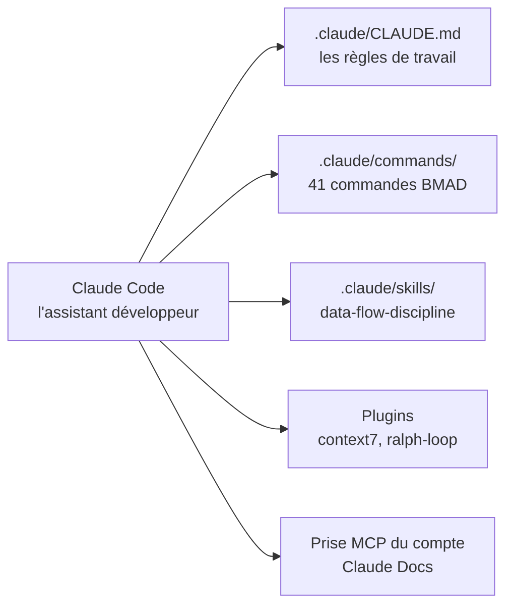

| Élément | Ce que c'est |
|---|---|
| `.claude/CLAUDE.md` | Les règles que l'assistant doit suivre : boucle de travail, conventions, anti-patterns. |
| `.claude/commands/` | 41 commandes **BMAD** : une méthode pour cadrer le travail (créer un PRD, une story, faire une revue de code, un rétrospectif). Elles produisent les documents de `_bmad-output/`. |
| `.claude/skills/data-flow-discipline` | Un savoir-faire maison : cartographier une donnée partagée avant de la modifier, pour éviter les bugs « ça marche au premier chargement mais pas au rechargement ». |
| `.claude/settings.json` | Les permissions accordées à l'assistant et les plugins activés. |

| Extension | Nature | Ce qu'elle apporte à l'assistant |
|---|---|---|
| **context7** | plugin, prise MCP | La documentation **à jour** d'une librairie (Vue, Express, Zod…), au lieu de la mémoire de l'IA, qui peut dater. |
| **Claude Docs** | prise MCP du compte claude.ai | L'écriture de documents partagés, comme l'audit de septembre. |
| **ralph-loop** | plugin, pas MCP | Fait tourner une tâche en boucle jusqu'à ce qu'elle soit finie. |

> **Important** : le dossier `.claude/` est **ignoré par git** (ligne 21 du
> `.gitignore`). Il n'existe que sur ta machine. Si tu clones le projet ailleurs,
> ces règles et commandes ne suivent pas — il faut les recopier.

---

## 13. Où changer quoi

| Je veux changer… | Je vais dans… |
|---|---|
| Le fournisseur d'IA | `.env` → `AI_PROVIDER` (`claude`, `gemini`, `openrouter`, `mock`) |
| Le modèle qui écrit (la plume) | `.env` → `CLAUDE_MODEL` (Haiku 4.5 chez toi ; Sonnet 4.6 si vide) |
| Le modèle qui trie | `.env` → `HAIKU_MODEL` (lu seulement par la génération d'idées du Radar) |
| Désactiver le repli automatique | `.env` → `AI_PROVIDER_NO_FALLBACK=1` |
| Le plafond de dépense SEO | `.env` → `DATAFORSEO_COST_BUDGET_USD` (2,00 chez toi) et `DATAFORSEO_COST_WINDOW_MIN` |
| Utiliser le bac à sable DataForSEO | `.env` → `DATAFORSEO_SANDBOX=true` |
| La pause entre deux sections | `.env` → `INTER_SECTION_DELAY`, en millisecondes (`15000` par défaut) |
| La recherche web pendant la rédaction | Robot : elle suit `--mode`. Appli : l'interrupteur de l'éditeur. `WEB_SEARCH_ENABLED` **n'a aucun effet** aujourd'hui. |
| Le domaine des pages exportées | `shared/constants/site.constants.ts` (ou `SITE_URL` dans `.env`) |
| Les ports | `.env` → `PORT` (serveur) et `VITE_PORT` (application) |
| La base de données | `.env` → `PG_HOST`, `PG_PORT`, `PG_USER`, `PG_PASSWORD`, `PG_DATABASE` |
| Le style d'écriture | `server/prompts/system-propulsite.md` |
| Le gabarit HTML exporté | `server/services/article/export.service.ts` et `src/assets/templates/templateArticle.html` |

> Le fichier `.env` contient tes clés : il est **ignoré par git** et ne doit jamais
> être partagé. Le modèle à copier est `.env.example`.

---

## 14. Ce que le projet n'utilise pas

Utile à savoir pour ne pas chercher longtemps :

- **Aucun CMS branché** : ni WordPress, ni Ghost, ni Webflow. La publication est manuelle.
- **Aucun hébergement** : tout tourne sur ta machine (serveur, base, modèle local).
- **Aucun MCP pendant la fabrication d'un article** : MCP ne sert qu'à l'assistant développeur.
- **Aucune API Reddit ou Wikipédia** : les signaux de forums viennent du bloc
  « discussions et forums » de la SERP DataForSEO.
- **Aucun service d'authentification** : l'application n'a ni compte, ni mot de passe.
  Le serveur n'autorise que les pages ouvertes depuis `localhost` à l'appeler
  (règle CORS, `server/index.ts:38`), mais il écoute sur toutes les interfaces
  réseau : sur un wifi public, un autre appareil du réseau pourrait l'interroger
  directement. À garder en tête si tu travailles hors de chez toi.
- **Aucune base de test séparée** : les tests de bout en bout écrivent dans la base de
  développement. Lance `npm run verify:full` serveur éteint.
