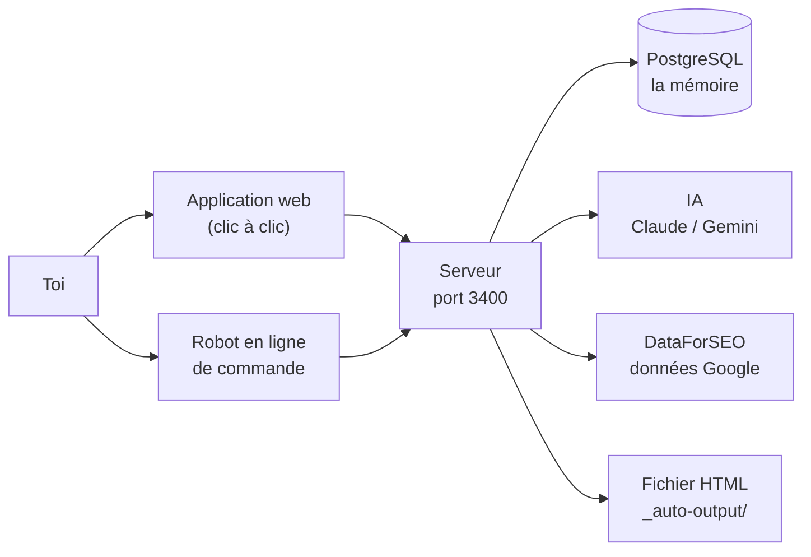
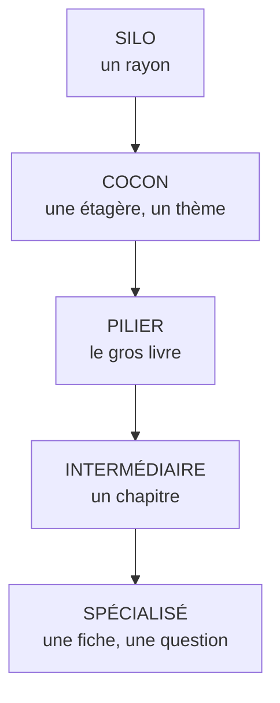
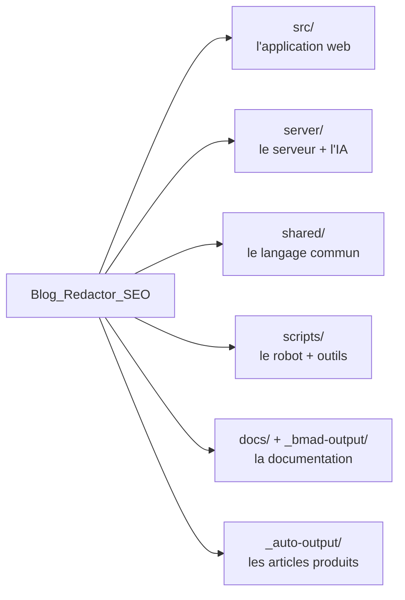

# Blog Redactor SEO — le mode d'emploi

> Un outil qui transforme une idée d'article en article de blog optimisé pour Google,
> en passant par trois ateliers : **Cerveau** (la stratégie), **Moteur** (les mots-clés)
> et **Rédaction** (le texte).

Ce README est la **porte d'entrée**. Il explique en 5 minutes ce qu'est le projet,
comment le démarrer, et où aller ensuite.

---

## 1. À qui s'adresse ce guide

À toi, qui utilises l'outil — pas à un développeur qui découvre du code.
Tout est expliqué simplement, avec des images et des exemples concrets.

| Fichier | Quand l'ouvrir |
|---|---|
| **README.md** (ce fichier) | Je démarre, je veux la vue d'ensemble et les commandes. |
| [GUIDE-01-UTILISATION.md](GUIDE-01-UTILISATION.md) | Je veux comprendre les 3 ateliers et toutes les options. |
| [GUIDE-02-ARCHITECTURE.md](GUIDE-02-ARCHITECTURE.md) | Je cherche où vit telle information, quel fichier fait quoi. |
| [GUIDE-03-CAS-PRATIQUES.md](GUIDE-03-CAS-PRATIQUES.md) | Je veux faire quelque chose de précis, pas à pas. |
| [GUIDE-04-OUTILS.md](GUIDE-04-OUTILS.md) | Quels outils, librairies et services le projet utilise, et où changer une clé. |

> Les dossiers `docs/` et `_bmad-output/` contiennent la documentation **technique**
> (pour développer). Le fichier `.claude/CLAUDE.md` contient les règles de travail
> destinées à l'IA. Ces quatre guides-ci sont pour **l'utilisateur**.

---

## 2. Le projet en une image



Il y a **deux façons** de fabriquer un article, et elles font la même chose :

- **L'application web** : tu avances écran par écran, tu vois tout, tu décides tout.
  C'est le mode « je cuisine moi-même ».
- **Le robot** (`npm run auto:article`) : tu donnes un sujet, il déroule les trois
  ateliers tout seul et s'arrête deux fois pour te demander ton accord.
  C'est le mode « robot cuiseur ».

Les deux parlent au **même serveur** et écrivent dans la **même base de données**.
Rien n'est dupliqué : le robot est un client du serveur, exactement comme l'application.

---

## 3. Démarrage rapide

### Ce qu'il faut avoir

| Prérequis | Vérifier avec | Attendu |
|---|---|---|
| Node.js | `node -v` | 20.19+ ou 22.12+ |
| PostgreSQL démarré | `netstat -ano \| grep 5432` | une ligne `LISTENING` |
| Base `blog_redactor_seo` | `npm run db:check` | pas d'erreur de connexion |
| Fichier `.env` | il existe à la racine | copié depuis `.env.example` et rempli |

### Les 3 commandes

```bash
# 1. Une seule fois, après un clone du projet
npm install

# 2. Terminal 1 — allume le serveur (3400) et l'application web (5400)
npm run dev

# 3. Terminal 2 — lance le robot en mode réel
npm run auto:article -- --mode=real
```

Puis pour relire les articles produits :

```bash
npm run auto:preview      # ouvre un aperçu local sur http://localhost:4599
```

> ⚠️ **Le piège n°1 : le mode par défaut est simulé.**
> Sans `--mode=real`, le robot travaille avec de **fausses** données (« mode mock »).
> C'est gratuit et utile pour tester la mécanique, mais le texte produit n'a
> aucun rapport avec ton sujet. C'est un simulateur de vol : parfait pour s'entraîner,
> inutile pour voyager.

---

## 4. Le vocabulaire de la maison

Ces mots reviennent partout. Image à retenir : **une bibliothèque**.



| Mot | Traduction en français simple |
|---|---|
| **Silo** | Un grand rayon du blog. Exemple : « Création de site ». |
| **Cocon** | Une étagère sur un seul thème, avec une famille d'articles reliés entre eux. |
| **Pilier / Intermédiaire / Spécialisé** | Les trois niveaux d'article : le gros guide, le chapitre, la fiche qui répond à une seule question. |
| **Capitaine** | Le mot-clé principal de l'article, celui écrit sur l'enseigne de la boutique. |
| **Lieutenants** | Les mots-clés secondaires qui accompagnent le Capitaine. |
| **Lexique** | Le vocabulaire d'expert attendu sur le sujet (prouve que tu connais le métier). |
| **Cerveau / Moteur / Rédaction** | Les trois ateliers, dans l'ordre : décider, chercher les mots, écrire. |
| **Check** | Une case cochée automatiquement quand une étape du Moteur est finie. |
| **Gate** | Une pause où le robot attend ta validation avant de continuer. |

---

## 5. Carte des dossiers



| Dossier | Ce qu'il contient | Tu y touches ? |
|---|---|---|
| `src/` | L'application web (les écrans que tu cliques). | Rarement |
| `server/` | Le serveur : routes, services, **prompts IA** (`server/prompts/`). | Pour changer le style d'écriture |
| `shared/` | Les types et constantes utilisés des deux côtés. | Non |
| `scripts/auto-article/` | Le robot qui écrit un article tout seul. | Non |
| `server/db/schema.sql` | La photo de la structure de la base de données. | Jamais à la main |
| `_auto-output/` | Les articles finis, en HTML. **Ignoré par git.** | Oui, tu les lis |
| `data/` | Sauvegardes et vieilles données archivées. | Non |
| `docs/` | Documentation technique détaillée. | Pour comprendre en profondeur |
| `_bmad-output/` | Spécifications, audits, suivi de sprint. | Pour l'historique des décisions |
| `tests/` | Les tests automatiques. | Non |

Détail complet dans [GUIDE-02-ARCHITECTURE.md](GUIDE-02-ARCHITECTURE.md).

---

## 6. Les commandes utiles

| Commande | Ce qu'elle fait |
|---|---|
| `npm run dev` | Allume le serveur (3400) + l'application web (5400). |
| `npm run auto:article -- --mode=real` | Écrit un article de A à Z. Environ 0,35 $. |
| `npm run auto:article -- --relink=123` | Repose seulement les liens internes de l'article 123. Gratuit. |
| `npm run auto:preview` | Ouvre un aperçu local de tous les articles produits. |
| `npm run kill-ports` | Libère les ports 3400 et 5400 quand ça bloque. |
| `npm run verify` | **Le contrôle complet** : code, types, qualité des articles, tests. |
| `npm run db:check` | Vérifie que la photo de la base est à jour. |
| `npm run db:snapshot` | Reprend une photo de la structure de la base. |
| `npm run test:unit` | Lance les tests automatiques. |
| `npm run check:health` | Vérification complète du code (lint, types, cycles, code mort). |
| `npm run build` | Fabrique la version finale de l'application web. |

La liste complète et les options se trouvent dans [GUIDE-01-UTILISATION.md](GUIDE-01-UTILISATION.md).

---

## 7. Les règles d'or

1. **Toujours `--mode=real` pour un vrai article.** Sinon c'est du simulé.
2. **Le serveur doit tourner** (`npm run dev`) avant de lancer le robot.
3. **Relis toujours avant de publier.** L'IA peut laisser des traces de son
   brouillon ou inventer des chiffres — voir les pièges connus ci-dessous.
4. **Un article se range dans un cocon**, jamais tout seul dans le vide.
5. **La vérité, c'est le code.** Si un document dit le contraire de ce que fait
   le programme, c'est le programme qui a raison.

### Pièges connus (audit du 19/09/2026)

**Réglé les 20 et 21/09** : l'IA laissait son brouillon de réflexion dans les
articles, inventait des cas clients, produisait un double H1 et des paragraphes
coupés en plein mot. Le pipeline est réparé, **les 6 piliers existants ont été
nettoyés**, et `npm run verify` contrôle désormais tout ça automatiquement.

Ce qui reste à surveiller :

- Les liens internes posés automatiquement visaient des articles **pas encore
  écrits** : ils ont été retirés. Ils reviendront, proprement, quand la hiérarchie
  parent-enfant sera en base (chantier P1).
- En mode simulé, le robot réutilisait et écrasait un article existant.
- `--resume` sur un article seulement *planifié* (statut « à rédiger ») ne
  fonctionne pas comme attendu.
- Les mots-clés « Capitaine » de trois piliers restent discutables
  (« accessibilité web » pour un article sur la conversion, par exemple).

Détail complet, causes et corrections : `_bmad-output/implementation-artifacts/audit-auto-article-pipeline.md`
(audit du CLI, juillet 2026) et l'audit complet de septembre 2026.

---

## 8. Ça ne marche pas ?

| Symptôme | Cause probable | Solution |
|---|---|---|
| « Serveur injoignable » | `npm run dev` n'est pas lancé. | Ouvre un 2ᵉ terminal et lance-le. |
| Port déjà utilisé | Un ancien processus traîne. | `npm run kill-ports` |
| L'article parle d'autre chose | Tu es en mode simulé. | Relance avec `--mode=real`. |
| Erreur de connexion à la base | PostgreSQL est éteint. | Démarre le service PostgreSQL. |

Plus de cas dans [GUIDE-03-CAS-PRATIQUES.md](GUIDE-03-CAS-PRATIQUES.md).
