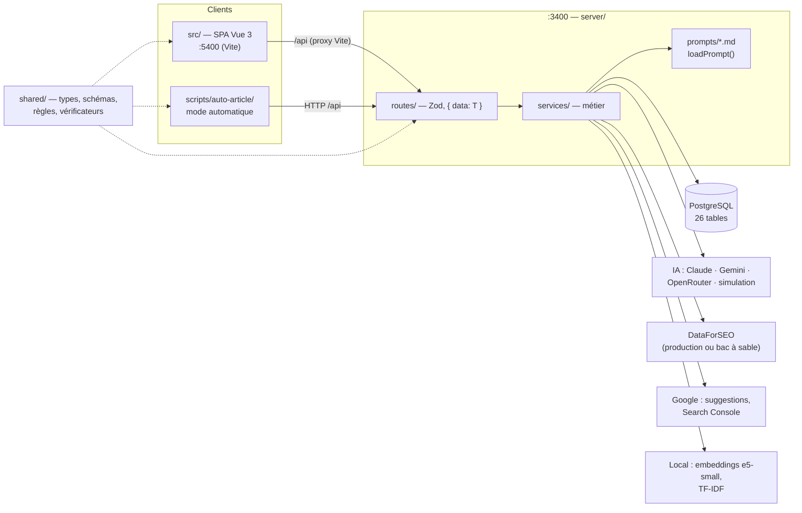
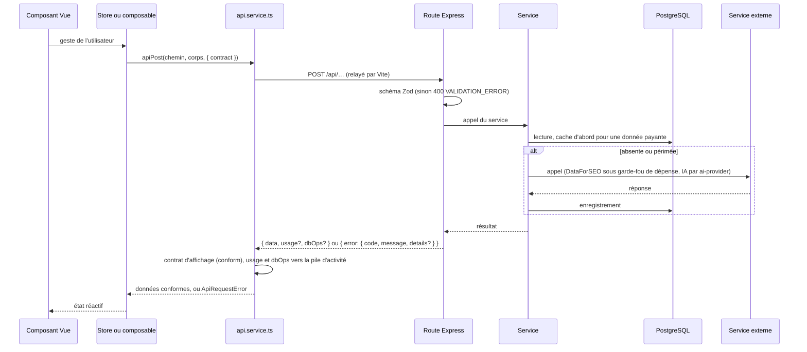
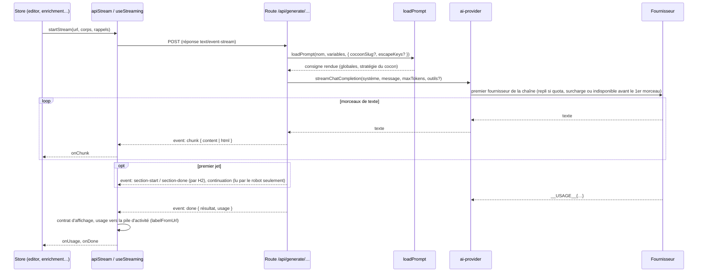
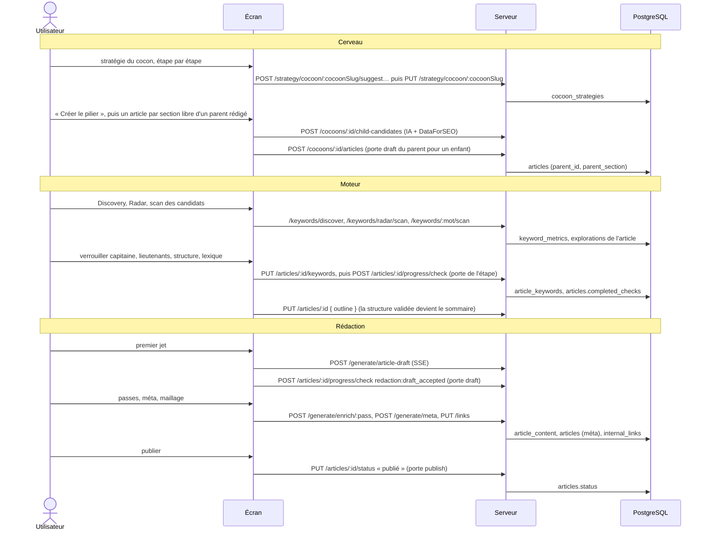

# Architecture

## Vue d'ensemble

Une application locale, mono-utilisateur, en trois morceaux : une SPA Vue (l'écran), une API
Express (le serveur) et une base PostgreSQL. Un quatrième client, le mode automatique
(`auto:article`), parle au serveur exactement comme l'écran.

Le serveur ne sert que du JSON et des flux SSE (Server-Sent Events : un flux texte où le serveur
pousse des événements au fil de l'eau). L'écran ne touche jamais la base ni le disque.

## Stack et versions

*Exigences retirées : `NFR-RT-*` (les versions ne sont plus une exigence produit ; elles vivent ici).*

Versions lues dans [`../package.json`](../package.json) (plages npm) et [`../.nvmrc`](../.nvmrc).

| Couche | Paquet | Version |
|---|---|---|
| Runtime | Node | `>=24` (`engines`), `.nvmrc` = 24 |
| Écran | `vue` · `vue-router` · `pinia` | `^3.5.29` · `^5.0.3` · `^3.0.4` |
| Éditeur | `@tiptap/core`, `extension-image`, `extension-table`, `pm` | `^3.22.3` |
| Éditeur | `@tiptap/starter-kit`, `extension-link`, `extension-placeholder`, `vue-3` | `^3.20.1` |
| Écran | `@vueuse/core` · `marked` · `dompurify` | `^14.2.1` · `^17.0.5` · `^3.3.3` |
| Serveur | `express` · `pg` · `dotenv` · `chalk` | `^5.2.1` · `^8.20.0` · `^17.4.2` · `^5.6.2` |
| Commun | `zod` | `^4.3.6` |
| IA | `@anthropic-ai/sdk` · `@google/genai` · `@huggingface/transformers` | `^0.78.0` · `^1.50.1` · `^3.8.1` |
| Build | `vite` · `@vitejs/plugin-vue` · `typescript` · `vue-tsc` · `tsx` | `^7.3.1` · `^6.0.4` · `~5.9.3` · `^3.2.5` · `^4.21.0` |
| Tests | `vitest` · `@vue/test-utils` · `jsdom` · `@playwright/test` · `@stryker-mutator/core` | `^4.0.18` · `^2.4.6` · `^28.1.0` · `^1.59.1` · `^9.6.1` |
| Qualité | `oxlint` · `eslint` · `prettier` · `knip` · `madge` · `dependency-cruiser` | `~1.50.0` · `^10.0.2` · `3.8.1` · `^6.4.1` · `^8.0.0` · `^17.4.0` |
| Outillage | `husky` · `lint-staged` · `npm-run-all2` · `concurrently` · `patch-package` | `^9.1.7` · `^16.4.0` · `^8.0.4` · `^9.2.1` · `^8.0.1` |

PostgreSQL : version 18 en CI (image `postgres:18`, `bootstrap.sql` étant produit par `pg_dump` 18).
Correctif maison : `patches/knip+6.4.1.patch`, appliqué par `postinstall`.
Versions résolues du verrou (`package-lock.json`) : vue 3.5.29, pinia 3.0.4, vue-router 5.0.3, @tiptap/core 3.22.3 (autres paquets TipTap ^3.20.1), express 5.2.1, pg 8.20.0, zod 4.3.6, vitest 4.1.5, @playwright/test 1.59.1, typescript 5.9.3, vite 7.3.1, @anthropic-ai/sdk 0.78.0, @google/genai 1.50.1, @huggingface/transformers 3.8.1 ; `@tsconfig/node24`.

## Arborescence

| Dossier | Rôle |
|---|---|
| [`../src/`](../src/) | La SPA Vue. Point d'entrée `main.ts`, racine `App.vue` (barre du haut, vue routée, toasts, pile d'activité, alarme des portes). |
| `src/views/` | 13 écrans, un par route (cf. [Routes de l'écran](03-api.md)). |
| `src/components/` | 177 composants `.vue` en 15 dossiers métier : `moteur/` (43), `shared/` (38), `panels/` (25), `article/` (12), `intent/` (12), `production/` (10, dont le Cerveau `BrainPhase.vue` et `brain/`), `strategy/` (7), `keywords/`, `linking/`, `dashboard/` (5 chacun), `brief/`, `editor/` (4), `actions/`, `outline/` (3), `workflow/` (1). `export/` est vide. |
| `src/stores/` | 29 stores Pinia (état partagé de l'écran) en 5 domaines : `article/` (10), `keyword/` (5), `strategy/` (6), `external/` (2), `ui/` (6). |
| `src/composables/` | 56 fichiers de logique réutilisable en 9 domaines : `article`, `editor`, `intent`, `keyword`, `lexique`, `moteur`, `seo`, `strategy`, `ui`. |
| `src/services/api.service.ts` | Le seul client HTTP de l'écran (cf. [Conventions](01-architecture.md)). |
| `src/utils/`, `src/directives/` | Calculs purs côté écran : scores SEO et GEO (`seo-calculator.ts`, `geo-calculator.ts`), journal (`logger.ts`)… ; directives `v-safe-html` (HTML assaini avant affichage) et `v-safe-svg` (icônes de l'application, un tracé seul est assaini dans un `<svg>`). |
| `src/router/index.ts` | Les routes de l'écran et leurs gardes. |
| [`../server/`](../server/) | L'API Express. Point d'entrée `index.ts`. |
| `server/routes/` | 25 fichiers `*.routes.ts` montés sous `/api`, plus `generate/` (11 sous-routeurs fusionnés). |
| `server/services/` | 86 fichiers en 8 domaines : `article/`, `external/` (fournisseurs, simulation, `dataforseo/`), `gates/`, `infra/`, `intent/`, `keyword/`, `queries/`, `strategy/`. |
| `server/prompts/` | 39 consignes IA `.md` + 11 actions de l'éditeur dans `actions/`. |
| `server/db/` | `client.ts` (pool `pg`), `cache-helpers.ts`, `schema.sql` (photo), `bootstrap.sql` (schéma rejouable), `changes/` (changements datés), `migrations/_archive/` (historique). |
| `server/utils/` | `prompt-loader.ts`, `error-handler.ts`, `api-error.ts`, `logger.ts`, `stream-usage.ts`, `ai-json-parser.ts`, `db-telemetry.ts`, `json-storage.ts`. |
| `server/middleware/` | `db-telemetry.middleware.ts` : testé, **non monté** par `server/index.ts`. |
| [`../shared/`](../shared/) | Le langage commun, importé par l'écran, le serveur et le robot (cf. ci-dessous). |
| [`../scripts/`](../scripts/) | `auto-article/` (le robot), outils de base (`db-*.ts`), `verify-content.ts`, `prompts-reference.ts`, `test-snapshot.ts` / `test-check.ts`, `kill-port.mjs`, `preview-article.mjs` ; le reste est de la maintenance ponctuelle. |
| [`../tests/`](../tests/) | Tests hors du code source (cf. [Outillage](07-tests-et-outillage.md)). |
| `docs/`, `_bmad-output/`, `archive/` | Documentation historique (cf. annexe). |
| `data/` | Sauvegardes SQL, `_archive/` (anciens JSON), et le jeton OAuth Search Console. |
| `_auto-output/` | Articles HTML produits par le robot (ignoré par git). |

### `shared/`

| Sous-dossier | Contenu |
|---|---|
| `shared/types/` | 34 fichiers de types, réexportés par `index.ts`. |
| `shared/schemas/` | 15 schémas Zod : validation des entrées aux routes. |
| `shared/constants/` | `workflow-checks.constants.ts` (étapes), `article-type-rules.ts` (règles par niveau), `site.constants.ts` (domaine, `/blog/<slug>`), `seo.constants.ts`, `geo.constants.ts`, `image-placeholder.ts`. |
| `shared/contracts/` | Contrats d'affichage : chaque réponse destinée à l'écran est mise en forme ou refusée ; une donnée absente reste `null`, jamais 0. |
| `shared/verifiers/` | Vérificateurs purs des portes de qualité (`gate.ts`, `captain.ts`, `lieutenants.ts`, `structure.ts`, `lexique.ts`, `draft.ts`, `publish.ts`, `cocoon-hierarchy.ts`, `enrichment.ts`). |
| `shared/score/` | Module de score unifié ; seul `index.ts` s'importe de l'extérieur. |
| `shared/utils/` | Niveaux d'article, phase, structure Hn, termes génériques, racines de mots-clés… |
| `shared/*.ts` | Règles pures : scoring (`scoring.ts`, `scoring-kpi.ts`, `kpi-scoring.ts`), qualité du texte (`content-validators.ts`, `seo-validators.ts`, `text-quality.ts`, `ai-text.ts`, `content-repair.ts`), chapitres et budgets (`chapters.ts`, `section-budget.ts`, `html-stream.ts`, `structure-outline.ts`), contexte du cocon (`cocoon-context.ts`), liens (`internal-links.ts`), français (`french-text.ts`, `composition-*.ts`). |

## Couches et règles d'import

Chemin d'une requête : `src/` → HTTP → `server/routes/` → `server/services/` → PostgreSQL ou API
externe. `scripts/auto-article/` suit le même chemin. `shared/` est importé par les trois.

| Règle | Garde-fou |
|---|---|
| `src/` n'importe jamais `server/` ; ce qui se partage va dans `shared/`. | `dependency-cruiser`, règle `no-server-in-src` (erreur) |
| Aucun cycle d'import. | `dependency-cruiser` `no-circular` (erreur) ; `madge --circular` sur `shared/` et `server/` |
| Les modules internes de `shared/score/` ne s'importent que par `shared/score/index.ts` (alias `@shared/score`). | `dependency-cruiser` `score-internal-only-via-index` (erreur) |
| Une route valide l'entrée, délègue à un service, formate `{ data: T }`. | Convention (exception notable : `keyword-scan.routes.ts` orchestre elle-même mesures, scores et enregistrement, sans schéma Zod) |
| Un composant Vue n'appelle pas le réseau : il passe par un store ou un composable. | Convention ; audit « 0 `fetch` direct » |
| Le robot est un client HTTP : il n'importe pas `server/`. | Convention (`scripts/auto-article/http-client.ts`) |

Alias : `@` → `src/`, `@shared` → `shared/` (`vite.config.ts`).

## Conventions

### Réponses de l'API

- **Succès :** `{ data: T }`. Exemple : `GET /api/health` → `{ data: { status: 'ok' } }`. Une route
  qui écrit peut joindre `dbOps` (à la racine ou dans `data`) : les écritures mesurées par
  `measureDb` ([`../server/utils/db-telemetry.ts`](../server/utils/db-telemetry.ts)), affichées
  dans la pile d'activité de l'écran. Un `usage` (jetons, coût IA) y est affiché de même.
- **Erreur :** `{ error: { code, message, details? } }`. Codes transverses, posés par
  [`../server/utils/error-handler.ts`](../server/utils/error-handler.ts) — `errorHandler` et
  `respondWithError` ([`api-error.ts`](../server/utils/api-error.ts)) :

| Code | HTTP | Cause |
|---|---|---|
| `DATAFORSEO_QUOTA_EXCEEDED` | 429 | Crédits DataForSEO épuisés |
| `DATAFORSEO_COST_BUDGET` | 429 | Plafond de dépense de la fenêtre glissante atteint (`CostBudgetError`) |
| `AI_PROVIDER_QUOTA_EXCEEDED` | 429 | Quota du fournisseur d'IA (`AIProviderQuotaError`) |
| `AI_PROVIDER_OVERLOADED` | 503 | Fournisseur d'IA surchargé (`AIProviderOverloadedError`) |
| `VALIDATION_ERROR` · `INVALID_ID` | 400 | Entrée refusée par un schéma Zod · identifiant non numérique |
| `NOT_FOUND` | 404 | Ressource inconnue |
| `GATE_BLOCKED` | 422 (409 à la création ou au rattachement d'un enfant sous un parent non rédigé) | Porte de qualité refusée ; `details` porte l'évaluation ([Infrastructure transversale](20-infrastructure.md)) |
| `HIERARCHY_VIOLATION` · `SLUG_TAKEN` | 409 | Ordre du cocon non respecté · adresse d'article déjà prise ([Cerveau](11-cerveau.md)) |
| `INTERNAL_ERROR` | 500 | Toute autre erreur |

### Client HTTP de l'écran

[`../src/services/api.service.ts`](../src/services/api.service.ts) — `apiGet`, `apiPost`, `apiPut`,
`apiPatch`, `apiDelete`, `apiStream`. Adresse relative `/api` + chemin ; Vite relaie `/api` vers
le port du serveur. Le client déballe `json.data`, applique le contrat d'affichage passé en option
(`contract`, via `conform` → `parseContract`), pousse l'éventuel `usage` dans la pile d'activité
(`useCostLogStore`), et lève `ApiRequestError` (`status`, `code`, `details`) sur une erreur.
`apiStream` lit les flux SSE avec les mêmes garanties.

### Flux SSE

Vocabulaire unique des routes qui diffusent :

| Événement | Données |
|---|---|
| `chunk` | `{ content }` — un morceau de texte |
| `section-start` / `section-done` | `{ index, total, title }` / `{ index }` — premier jet seulement |
| `done` | Résultat final, avec `usage` (jetons, coût) quand il y en a |
| `error` | `{ code?, message }` |

Les passes d'enrichissement et la réécriture d'un chapitre accumulent le texte et n'envoient qu'un
`done` (la proposition vérifiée).

### Nommage

| Élément | Convention | Exemple |
|---|---|---|
| Composant Vue | `PascalCase.vue` | `CaptainPanel.vue` |
| Store | `kebab-case.store.ts`, `defineStore` en composition | `article-progress.store.ts` |
| Composable | `useCamelCase.ts` | `useMoteurTabs.ts` |
| Service | `kebab-case.service.ts` | `gate.service.ts` |
| Route | `kebab-case.routes.ts` | `serp-analysis.routes.ts` |
| Types / schémas / contrats | `kebab-case.types.ts` / `.schema.ts` / `.contract.ts` | `article.types.ts` |
| Prompt | `kebab-case.md` | `capitaine-ai-panel.md` |
| Test | miroir du fichier + `.test.ts`, sous `tests/` | `tests/unit/...` |
| Étape de progression | `workflow:snake_case`, via constante | `moteur:capitaine_locked` (`MOTEUR_CAPITAINE_LOCKED`) |
| Exigence / conception | `FR-DOMAINE-CAPACITE` / `DESIGN-DOMAINE-CAPACITE` | `FR-CAP-LOCK-GATE` |

Niveau d'article : en base `'Pilier' | 'Intermédiaire' | 'Spécialisé'` (contrainte
`articles_type_check`) ; dans le code `'pilier' | 'intermediaire' | 'specifique'` (`ArticleLevel`).
La conversion se fait aux seules frontières d'entrée/sortie
([`../shared/utils/article-level.ts`](../shared/utils/article-level.ts) — `articleTypeDbToLevel`,
`articleLevelToDbType`).

### En-têtes `AUTHORITY:`

Un store, un composable ou un service qui touche une donnée partagée porte en tête un commentaire
cherchable : `AUTHORITY:` (où vit la donnée), `READS FROM`, `WRITES TO`, `CONSUMERS`, `RELATED FR`.
Couverture actuelle : 13 stores sur 29, 10 composables sur 56, 26 fichiers de services sur 86.
Audit : `.claude/skills/data-flow-discipline/scripts/audit_data_flow.py` (outil local de l'assistant).

### Étapes de progression

[`../shared/constants/workflow-checks.constants.ts`](../shared/constants/workflow-checks.constants.ts) —
`MOTEUR_CHECKS` (6), `REDACTION_CHECKS` (1 : `redaction:draft_accepted`), `ALL_WORKFLOW_CHECKS`,
`checksRemovedWith` (retirer le capitaine ou les lieutenants retire aussi `moteur:hn_locked`).
Stockage : `articles.completed_checks` (TEXT[]) et `check_timestamps` (JSONB). Toujours la
constante, jamais la chaîne. Détail : [Moteur — cadre commun](12-moteur.md).

### Journaux

`log.debug/info/warn/error` de [`../server/utils/logger.ts`](../server/utils/logger.ts) et
[`../src/utils/logger.ts`](../src/utils/logger.ts), réglés par [`../logs.config.ts`](../logs.config.ts).
Chaque correction ou refus d'un contrat d'affichage est journalisé (`setContractReporter` dans
`server/index.ts`).

## Démarrage du serveur

[`../server/index.ts`](../server/index.ts) :

1. `express.json({ limit: '5mb' })`.
2. CORS : seules les origines `http://localhost[:port]` reçoivent `Access-Control-Allow-Origin` ;
   méthodes annoncées `GET, POST, PUT, DELETE, OPTIONS`. Le serveur écoute sans restriction d'hôte.
3. `GET /api/health`, puis les 25 routeurs, puis `errorHandler`.
4. Au démarrage : `SELECT 1` (message d'aide si PostgreSQL est éteint, refuse le mot de passe ou
   que la base manque) ; purge horaire `DELETE FROM external_api_cache WHERE expires_at < NOW()`.

Ports : serveur `PORT` (3400 par défaut), écran `VITE_PORT` (5400, `strictPort`). Tests navigateur :
3410 / 5410. `npm run dev` libère d'abord 3400 et 5400 (`scripts/kill-port.mjs`) et vérifie la
fraîcheur du schéma (`db:check`, non bloquant).

## Décisions d'architecture encore valides

| Décision | Pourquoi | À ne pas casser |
|---|---|---|
| Application locale mono-utilisateur, sans authentification | Un seul consultant, sur sa machine | CORS limité à `localhost` ; pas de secret côté écran |
| `src/` ↛ `server/`, tout le commun dans `shared/` | Le même code de règle sert l'écran, le serveur et le robot | Règles `dependency-cruiser` |
| Le robot est un client HTTP | Aucune règle dupliquée ; les portes s'appliquent au robot | Pas d'import de `server/` dans `scripts/auto-article/` |
| PostgreSQL seul pour les données (sauf jeton OAuth GSC) | Une seule mémoire, requêtable, sauvegardable | Aucun nouveau JSON de données dans `data/` |
| Base consultée avant tout appel payant (`keyword_metrics`, tables SERP, `external_api_cache`) | Ne jamais payer deux fois | Consulter le cache d'abord ; purge horaire du cache à durée de vie |
| Enveloppe `{ data: T }` et client HTTP unique | Erreurs et coûts traités en un seul endroit | Pas de `fetch` direct dans `src/` ; fetch externes du serveur commentés |
| Contrats d'affichage (`shared/contracts/`) | Une donnée absente reste absente (« — »), jamais 0 | Même expression pour l'affichage et le tri |
| Prompts en `.md`, chargeur strict, variables exactes | Le contexte ne se perd plus en silence | Pré-traiter dans l'appelant, jamais écrire le contexte dans le `.md` |
| Point d'entrée IA unique, repli automatique | Une panne de fournisseur ne bloque pas le travail | Passer par `ai-provider.service.ts` |
| Mode simulé / réel global, en mémoire du serveur | Un seul geste coupe toute dépense | Toute nouvelle source payante lit `getRuntimeMode()` |
| Progression dans `articles.completed_checks`, par constantes | Une seule vérité de l'avancement | Nouvelle étape = nouvelle constante |
| Portes de qualité évaluées par le serveur seul, vérificateurs purs dans `shared/verifiers/` | Un seul verdict pour l'écran, le serveur et l'audit | Tout nouveau passage gardé passe par `evaluateArticleGate` ([Infrastructure transversale](20-infrastructure.md)) |
| Arbre du cocon en base (`articles.parent_id`, `parent_section`) | La hiérarchie ne dépend plus d'un JSON de stratégie | `ON DELETE RESTRICT` sur le parent ([Cerveau](11-cerveau.md)) |
| Schéma par photo + bootstrap + changements datés | Les migrations numérotées ne recréaient plus rien | `db:snapshot` après tout changement ; committer `schema.sql` et `bootstrap.sql` ensemble |
| Ports figés 3400 / 5400, 3410 / 5410 pour les tests navigateur | Une douzaine de tests visent 3400 en dur | `strictPort` ; `kill-port` en préalable |
| Gros fichiers découpés derrière une façade : `server/routes/generate.routes.ts` réexporte `generate/index.ts`, `server/services/external/dataforseo.service.ts` réexporte `dataforseo/` | Découper sans toucher les importeurs | Les sous-routeurs de `generate/` sont aplatis par `mergeRouter` (pas `router.use`) : les tests de routes parcourent `router.stack` pour trouver chaque route |

## Diagrammes

Trois vues qui traversent les couches. Les diagrammes propres à un domaine sont dans son chapitre (écrans :
[08](08-ecrans.md) ; construction du cocon : [11](11-cerveau.md) ; portes : [20](20-infrastructure.md)).

### Une requête, de l'écran à la base ou à un service payant

Le mode automatique entre au niveau de la route, par son propre client HTTP
(`scripts/auto-article/http-client.ts`).

### Une génération d'IA en flux (SSE)

Une erreur devient `event: error { message }`. Les passes d'enrichissement et la réécriture d'un chapitre
n'envoient pas de `chunk` : un seul `done` porte la proposition vérifiée. Détail des appels :
[IA et prompts](04-ia-et-prompts.md#carte-des-usages-de-lia).

### Un article, de bout en bout

Le mode automatique suit le même chemin, sans l'étape de publication : [Mode automatique](06-mode-automatique.md).
