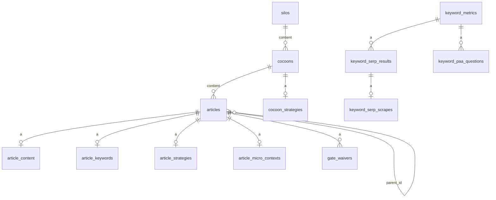

# Modèle de données

*Exigences : `NFR-COST-POSTGRESQL`, `FR-INFRA-*` (tables) · Source : [`../server/db/schema.sql`](../server/db/schema.sql)*

26 tables. Les écrivains cités sont les fichiers qui émettent `INSERT`, `UPDATE` ou `DELETE`.

**Structure et contenu**

| Table | Clé | Rôle | Écrit par |
|---|---|---|---|
| `silos` | `id` | Grands rayons du blog (`nom`, `description`) | `infra/data.service.ts` |
| `cocoons` | `id` ; `silo_id` → `silos` (CASCADE) | Cocons (`nom`) | `infra/data.service.ts` |
| `articles` | `id` (séquence `articles_id_seq`, jamais redonné) ; `slug` unique ; `cocoon_id` → `cocoons` (SET NULL) ; `parent_id` → `articles` (RESTRICT) | Fiche de l'article : titre, niveau (`type`), statut, phase, méta, scores SEO/GEO, étapes (`completed_checks`), capitaine verrouillé, douleur, intention attendue, parent et section d'origine | `infra/data.service.ts` ; `article/article-content.service.ts` (méta, scores, phase) |
| `article_content` | `article_id` (CASCADE) | Sommaire (JSONB) et texte HTML | `article/article-content.service.ts` |
| `article_keywords` | `article_id` (CASCADE) | Capitaine, lieutenants, lexique, structure Hn (JSONB), racines | `infra/data.service.ts` |
| `article_strategies` | `article_id` (CASCADE) | Stratégie d'article (JSONB, 6 étapes) | `strategy/strategy.service.ts` |
| `article_micro_contexts` | `article_id` (CASCADE) | Angle, ton, consignes, longueur visée | `infra/data.service.ts` |
| `cocoon_strategies` | `cocoon_id` (CASCADE) | Stratégie du cocon et carte indicative (JSONB) | `strategy/cocoon-strategy.service.ts` |
| `theme_config` | `id` | Identité du site (JSONB, une ligne) | `strategy/theme-config.service.ts` |
| `internal_links` | `id` ; unique `(source_id, target_id, position)` ; sans clé étrangère | Liens internes (ancre, raison, date de validation) | `article/linking.service.ts` |
| `gate_waivers` | `id` ; unique `(article_id, gate_id, rule, input_hash)` ; CASCADE | Dérogations aux portes (niveau, catégorie, raison ; `input_hash` = empreinte du point dérogé, ou de toute la porte avant le 2026-09-30) | `gates/gate.service.ts` |

**Explorations par article** (historique des essais du Moteur)

| Table | Clé | Rôle | Écrit par |
|---|---|---|---|
| `radar_explorations` | `article_id` (CASCADE) | Dernier scan Radar (JSONB, dont longue traîne) | `infra/radar-exploration.service.ts` |
| `captain_explorations` | `id` ; unique `(article_id, keyword)` | Candidats capitaine testés, statut, avis IA | `infra/data.service.ts` |
| `lieutenant_explorations` | `id` ; unique `(article_id, keyword)` | Candidats lieutenants, sources, score | `infra/data.service.ts` |
| `lexique_explorations` | `id` ; unique `(article_id, source_keyword)` | Termes TF-IDF et recommandations IA | `keyword/lexique-exploration.service.ts` |
| `paa_explorations` | `id` ; unique `(article_id, keyword, question)` | Questions PAA jugées face à la douleur | `infra/data.service.ts` |

**Mémoire d'achat** (partagée entre articles)

| Table | Clé | Rôle | Écrit par |
|---|---|---|---|
| `keyword_metrics` | `(keyword, lang, country)` | Mesures d'un mot-clé : volume, difficulté, CPC, intention, suggestions, PAA (JSONB), analyses locale et content gap ; `from_sandbox` (mesure simulée, effacée au passage en réel) | `keyword/keyword-metrics.service.ts`, `external/scrape-corpus.service.ts` |
| `keyword_serp_results` | `(keyword, lang, country, position)` → `keyword_metrics` | Top 10 d'un mot-clé | `external/scrape-corpus.service.ts` (via `keyword-serp.service.ts`) |
| `keyword_serp_scrapes` | idem → `keyword_serp_results` | Titres et texte des pages du top 10 | idem |
| `keyword_paa_questions` | `id` ; unique `(keyword, lang, country, question, depth)` | Questions PAA d'une SERP analysée | idem |
| `keyword_discoveries` | `(seed, lang)` | Récoltes Discovery et leur analyse IA | `keyword/keyword-discovery-db.service.ts` |
| `external_api_cache` | `id` ; unique `(cache_key, cache_type)` | Cache à durée de vie (`expires_at`) des autres appels | `db/cache-helpers.ts` (`setCached`, `deleteCached`, `getOrFetch`), purge dans `server/index.ts`, vidage par `article-explorations.routes.ts` |

**Référentiels et héritage**

| Table | Clé | Rôle | Écrit par |
|---|---|---|---|
| `keywords_seo` | `id` | Mots-clés rattachés à un cocon par son nom, avec statut | `infra/data.service.ts` |
| `local_entities` | `id` | Repères locaux (quartiers, lieux) pour `{{zone_landmarks}}` | Aucun écrivain dans le code (lu par `infra/local-entities.service.ts`) |
| `keyword_autocomplete` | `(keyword, lang, country, position)` | Anciennes suggestions ; `upsertAutocomplete` / `getAutocomplete` n'ont aucun appelant | Personne |
| `keyword_intent_analyses` | `(keyword, location_code)` | Ancien cache de l'Explorateur, conservé, ni lu ni écrit | Personne |

Hors base : le jeton OAuth de Search Console est un fichier JSON (`data/gsc-token.json`, via
`server/utils/json-storage.ts`).

## Identifiants

*Exigences : `FR-CER-COCOON-PROGRESSIVE`, `FR-CER-CHILD-FROM-PILLAR-H2`, `FR-CER-CREATION-HONNETE`, `FR-RED-LINKING-MANUAL`, `FR-RED-EXPORT-HTML`, `NFR-INT-ARTICLE-ID-NEVER-REUSED`*

**Un article se désigne par son `id`**, et par lui seul.

- `articles.id` est un entier tiré de la séquence `articles_id_seq` (défaut de la colonne, changement
  [`../server/db/changes/2026-09-29-articles-id-sequence.sql`](../server/db/changes/2026-09-29-articles-id-sequence.sql)).
  Une séquence ne recule jamais : le numéro d'un article effacé n'est pas redonné, et une écriture en
  retard pour lui (un scan du Capitaine fini après l'effacement) est refusée par la clé étrangère au lieu
  de tomber sur un autre article (`NFR-INT-ARTICLE-ID-NEVER-REUSED`). Avant le 2026-09-29, le service
  calculait « plus grand + 1 », ce qui rendait le numéro du dernier article effacé.
- `insertCocoonArticle` ([`../server/services/infra/data.service.ts`](../server/services/infra/data.service.ts))
  n'impose donc pas de numéro ; les aides de test non plus (`tests/helpers/db-fixtures.ts`,
  `tests/browser-e2e/helpers/test-fixtures.ts`). C'est le seul chemin d'insertion du produit :
  `POST /api/cocoons/:cocoonId/articles` → `createCocoonArticle`
  ([`../server/services/article/cocoon-article.service.ts`](../server/services/article/cocoon-article.service.ts)).
  Garde : [`../tests/unit/architecture/article-id-sequence.test.ts`](../tests/unit/architecture/article-id-sequence.test.ts)
  (schéma, schéma rejouable, aucun calcul de numéro dans le code) et
  [`../tests/integration/data.service.test.ts`](../tests/integration/data.service.test.ts) (effacement puis création).
- Toutes les tables d'un article s'y rattachent par `article_id`. Le texte vit dans `article_content`, pas
  dans un fichier.
- Routes du serveur : `/api/articles/:id/…` ; l'`id` est lu par `parseInt`, un `id` non numérique rend
  `400 INVALID_ID`. Routes de l'écran : `/cocoon/:cocoonId/article/:articleId`,
  `/article/:articleId/editor`, `/article/:articleId/preview` ; la vue convertit par `Number(…)` et
  affiche une erreur si ce n'est pas un nombre.
- **Relations entre articles, par `id`** : le parent (`articles.parent_id`, clé étrangère
  `ON DELETE RESTRICT`, jamais soi-même — contrainte `articles_parent_not_self`) et les liens internes
  (`internal_links.source_id`, `target_id`, sans clé étrangère). La section du parent dont un article est
  né (`parent_section`) est désignée par son **titre** (comparé par `sectionKey`) : si ce H2 est renommé
  chez le parent, `getCocoonTree` montre le nouveau titre comme une section libre et garde l'enfant sous
  l'ancien.

**Le `slug`, c'est l'adresse publique**, jamais une clé.

- `articles.slug` est unique (`articles_slug_key`). À la création, il vient du titre (`slugFromTitle` :
  minuscules, sans accents, tirets), sauf si la requête en fournit un. Adresse déjà prise : `409 SLUG_TAKEN`.
  Il se modifie par `PATCH /api/articles/:id` (`patchArticleSchema`).
- Une ligne ancienne peut contenir une URL complète : `extractSlug` n'en garde que le dernier segment, à la
  lecture (`rowToArticle`) comme à la recherche (`getArticleBySlug`).
- Rôles : l'adresse `/blog/<slug>` (`blogPath`, `blogUrl` dans
  [`../shared/constants/site.constants.ts`](../shared/constants/site.constants.ts) ; origine
  `SITE_ORIGIN`, remplaçable côté serveur par `SITE_URL`), le lien canonique et les balises Open Graph de
  l'export, et une recherche `GET /api/articles/by-slug/:slug` → `{ id, slug, title }` (utilisée par le
  mode automatique après un `SLUG_TAKEN`).

**Liens internes dans le texte.** L'éditeur pose `href="#article-<id>"` (marque `internalLink`, avec
`targetId`) ; le mode automatique pose `href="/<slug>"` avec `data-slug`. L'export ramène les deux formes à
`/blog/<slug>` et retire le lien (en gardant le texte) quand la cible est inconnue ou pas publiée
(`rewriteInternalLinks`, [`../shared/internal-links.ts`](../shared/internal-links.ts)). La porte de
publication et le nettoyage de la matrice (`pruneStaleLinks`) lisent aussi les deux formes.

**Les autres identifiants.**

| Objet | Identifiant | Nuance |
|---|---|---|
| Silo | `silos.id` (URL `/silo/:siloId`) | La création d'un cocon passe par le **nom** du silo (`POST /api/silos/:nom/cocoons`) |
| Cocon | `cocoons.id` (URL `/cocoon/:cocoonId`, `/api/cocoons/:cocoonId/…`) | Désigné par son **nom** ailleurs : stratégie du cocon (`/api/strategy/cocoon/:cocoonSlug`, option `cocoonSlug` de `loadPrompt`, retrouvé par nom puis par nom réduit en slug), pool `keywords_seo.cocoon_name` (sans clé étrangère), `GET /api/keywords/:cocoon` |
| Mot-clé | Son texte, avec langue et pays : `(keyword, lang, country)` dans `keyword_metrics` et les tables SERP | Partagé entre articles : une mesure sert à tous |

## Gestion du schéma

- `schema.sql` : photo en lecture, horodatée, avec empreinte sha256. Non rejouable.
- `bootstrap.sql` : schéma rejouable ; crée la base de la CI et la base des tests navigateur.
- Changement : un fichier daté idempotent dans `server/db/changes/`, appliqué par `npm run db:apply`
  (transaction), puis `npm run db:snapshot` régénère les deux fichiers.
- `npm run db:check` compare l'empreinte de la base vivante à celle de `schema.sql` ; un test
  (`tests/unit/architecture/db-bootstrap-sync.test.ts`) compare `schema.sql` et `bootstrap.sql`.

## Matrice tables ↔ exigences
*Exigences : toutes · Design : DESIGN-INFRA-* (vue inverse de la persistance)*

Pour chaque table de `schema.sql` : l'exigence qui en fait l'autorité, qui l'écrit, qui la lit. Seuls des identifiants existants sont cités ; les capacités sans identifiant sont décrites en clair. Règle de maintenance : toute table créée ou modifiée reçoit ou met à jour sa ligne ; le test `design-tables-matrix` échoue sinon. Le titre de cette section est lu par ce test : ne pas le renommer.

| Table | Autorité | Écrit par | Lu par | Notes |
|---|---|---|---|---|
| `articles` | schéma fondateur | FR-CER-COCOON-PROGRESSIVE, FR-CER-CHILD-FROM-PILLAR-H2 (`parent_id`, `parent_section`), FR-INFRA-WORKFLOW-CHECKS-CONSTANTS (`completed_checks`, `check_timestamps`), FR-RED-META (`meta_title`, `meta_description`), FR-RED-SEO-SCORE-PERSIST (`seo_score`, `geo_score`), FR-RED-PUBLISH-GATE (`status`) | FR-DASH-NAV, FR-MOT-PHASES, FR-INFRA-COCOON-CONTEXT, FR-RED-LINKING-MANUAL, FR-RED-PUBLISH-GATE, FR-CER-PARENT-WRITTEN-GATE | `type` CHECK `Pilier|Intermédiaire|Spécialisé` ; `parent_id` FK `ON DELETE RESTRICT`, jamais soi-même ; `slug` unique |
| `article_content` | schéma fondateur | FR-RED-DRAFT-SINGLE-PASS, FR-RED-EDITOR-TIPTAP, FR-RED-OUTLINE (`outline`) | FR-RED-EDITOR-TIPTAP, FR-INFRA-COCOON-CONTEXT, FR-RED-PUBLISH-GATE | `outline` JSONB + `content` TEXT ; la méta vit sur `articles` |
| `article_keywords` | schéma fondateur | FR-CAP-PERSIST, FR-LIE-CHECKBOX-LOCK-IMMEDIATE, FR-LEX-SELECT, FR-HN-TAB (`hn_structure`), FR-CAP-RELEVANCE-INPUTS (`root_keywords`) | FR-MOT-PHASES, FR-FIN-RECAP, FR-CAP-LOCK-GATE, FR-LIE-LOCK-GATE, FR-HN-LOCK-GATE, FR-LEX-METIER-ONLY, FR-INFRA-COCOON-CONTEXT | émet des `dbOps` |
| `article_micro_contexts` | FR-INFRA-MICRO-CONTEXTS | FR-CER-MICRO-CONTEXT, FR-CER-WORD-COUNT-RECOMMEND, FR-RED-DRAFT-SINGLE-PASS (longueur retenue) | sommaire, explication du brief, premier jet ; porte `draft` | 1:1 avec `articles` |
| `article_strategies` | FR-INFRA-ARTICLE-STRATEGIES | FR-CER-STEPS-ARTICLE | FR-CER-CONTEXT-FOR-MOTEUR, prompts de rédaction (`pickStrategyContext`) | `completed_steps` INTEGER |
| `captain_explorations` | FR-CAP-PERSIST | FR-CAP-PERSIST | FR-CAP-LOCK-GATE (alternatives), FR-MOT-EXPLORATION-COUNTS | séquence `keyword_tests_id_seq` héritée |
| `cocoons` | schéma fondateur | FR-DASH-NAV (création sous un silo) | FR-DASH-NAV, FR-INFRA-COCOON-CONTEXT | FK `silo_id` cascade |
| `cocoon_strategies` | FR-INFRA-COCOON-STRATEGIES | FR-CER-STEPS-COCOON | FR-CER-CONTEXT-FOR-MOTEUR, FR-INFRA-PROMPT-LAYERS (`strategy_context`) | un enregistrement par cocon |
| `external_api_cache` | FR-INFRA-API-CACHE, FR-INFRA-EXTERNAL-API-CACHE | FR-EXT-DATAFORSEO, FR-EXT-AUTOCOMPLETE-GOOGLE, FR-CER-KEYWORD-REAL-DATA (`serp-top`), FR-RAD-PERSIST (`radar`), FR-RAD-LONGTAIL-GENERATE, FR-EXT-GSC-PERFORMANCE | les mêmes, avant tout appel | purge horaire FR-INFRA-API-CACHE-PURGE ; séquence `api_cache_id_seq` héritée |
| `gate_waivers` | FR-INFRA-GATE-WAIVER | FR-INFRA-GATE-WAIVER | FR-CAP-LOCK-GATE, FR-LIE-LOCK-GATE, FR-HN-LOCK-GATE, FR-LEX-METIER-ONLY, FR-RED-DRAFT-SINGLE-PASS, FR-RED-PUBLISH-GATE | cascade sur `articles` |
| `internal_links` | FR-RED-LINKING-MANUAL | FR-RED-LINKING-MANUAL, FR-RED-CONTEXTUAL-ACTIONS | FR-RED-LINKING-MANUAL, FR-RED-PUBLISH-GATE (liens non publiés) | pas de FK déclarée sur `source_id` / `target_id` |
| `keyword_autocomplete` | NFR-MOT-SCHEMA-KEYWORD-DECOMPOSITION | aucun (`upsertAutocomplete` sans appelant) | aucun (`getAutocomplete` sans appelant) | table morte ; l'autocomplétion vit dans `keyword_metrics.autocomplete_suggestions` |
| `keyword_discoveries` | FR-INFRA-KEYWORD-DISCOVERIES | FR-DIS-CACHE | FR-DIS-CACHE | pas d'expiration appliquée |
| `keyword_intent_analyses` | aucune | aucun | aucun | table morte conservée ; l'intention SERP vit dans `keyword_metrics` ; un test casse si le code la relit |
| `keyword_metrics` | FR-INFRA-KEYWORD-METRICS | FR-EXT-DATAFORSEO, FR-MOT-RAW-KPIS, FR-CER-KEYWORD-REAL-DATA, FR-EXT-AUTOCOMPLETE-GOOGLE, FR-INFRA-PAA-CACHE, FR-EXP-CONTENT-GAP, FR-EXT-DATAFORSEO-SANDBOX (`from_sandbox` ; purge au passage en réel) | FR-CAP-LOCK-GATE, FR-CAP-RELEVANCE-LIVE, FR-MOT-RAW-KPIS, FR-CER-KEYWORD-REAL-DATA | un seul `fetched_at` ; COALESCE sur les KPI ; `from_sandbox` jamais remis à faux, lignes marquées effacées avec leurs tables filles (cascade) |
| `keyword_paa_questions` | NFR-MOT-SCHEMA-KEYWORD-DECOMPOSITION | FR-LIE-SERP-ANALYZE (relevé SERP) | FR-INFRA-SCRAPE-CORPUS-NEUTRE (`getPaaQuestions`) | FK `keyword_metrics` |
| `keyword_serp_results` | NFR-MOT-SCHEMA-KEYWORD-DECOMPOSITION | FR-LIE-SERP-ANALYZE (NFR-INT-SERP-ONCE) | FR-LEX-TFIDF, FR-LEX-PRECHECK-SERP, FR-CER-KEYWORD-REAL-DATA (lecture) | fraîcheur 7 j ; le relevé du Cerveau va dans `external_api_cache` (`serp-top`) |
| `keyword_serp_scrapes` | NFR-MOT-SCHEMA-KEYWORD-DECOMPOSITION | FR-LIE-SERP-ANALYZE | FR-LEX-TFIDF, FR-LIE-SCRAPE-DEDIE, FR-LEX-PRECHECK-SERP | FK sur `keyword_serp_results` |
| `keywords_seo` | FR-INFRA-KEYWORDS-SEO | FR-CER-AIGUILLAGE, FR-CER-COCOON-PROGRESSIVE | pool du Cerveau, audit du cocon | pas de FK : relié par `cocoon_name` |
| `lexique_explorations` | [Moteur — Lexique](15-lieutenants-structure-lexique.md) | FR-LEX-TFIDF (analyse TF-IDF, `lexique-analysis.service`), FR-LEX-AI-PANEL | FR-LEX-METIER-ONLY (termes génériques écartés), FR-MOT-EXPLORATION-COUNTS | `UNIQUE (article_id, source_keyword)` |
| `lieutenant_explorations` | FR-INFRA-LIEUTENANT-EXPLORATIONS | FR-LIE-PROPOSE-AI, FR-LIE-CHECKBOX-LOCK-IMMEDIATE | FR-LIE-PROPOSE-AI, FR-MOT-EXPLORATION-COUNTS, FR-LIE-LOCK-GATE | séquence `lieutenant_proposals_id_seq` héritée |
| `local_entities` | FR-INFRA-LOCAL-ENTITIES | chargement hors application | FR-INFRA-PROMPT-LAYERS (repères de la zone) | une entité sans `region` = référentiel par défaut |
| `paa_explorations` | FR-INFRA-PAA-EXPLORATIONS | FR-CAP-PERSIST | FR-CAP-PERSIST, FR-CAP-PAA-JUDGE-HAIKU, FR-MOT-EXPLORATION-COUNTS | distinct du cache PAA commun |
| `radar_explorations` | FR-RAD-PERSIST | FR-RAD-PERSIST, FR-RAD-LONGTAIL-GENERATE | FR-RAD-PERSIST, FR-CAP-PERSIST, FR-MOT-EXPLORATION-COUNTS | 1:1 avec `articles`, JSONB `scan_result` |
| `silos` | schéma fondateur | FR-DASH-NAV | FR-DASH-NAV | conteneur de cocons |
| `theme_config` | FR-CER-THEME-CONFIG | FR-CER-THEME-CONFIG | FR-INFRA-PROMPT-LAYERS (zone lue en base), prompts du Cerveau (copie envoyée par l'écran) | singleton `id = 1` |

`intent_explorations` n'existe plus (FR-INFRA-INTENT-EXPLORATIONS-LEGACY, retirée) : aucune ligne.
