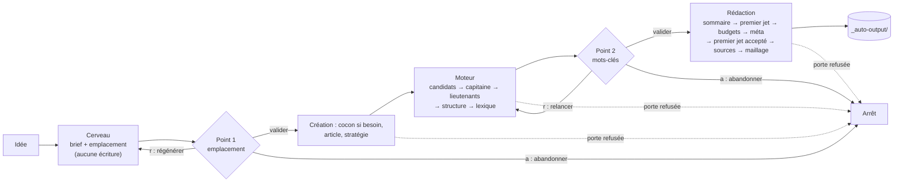

# Mode automatique

*Exigences : `FR-INFRA-VERIFIER-SHARED` (mêmes portes, jamais de dérogation), `FR-CER-CHILD-FROM-PILLAR-H2`,
`FR-CER-PARENT-WRITTEN-GATE`, `FR-HN-LOCK-GATE`, `FR-LEX-METIER-ONLY`, `FR-RED-DRAFT-TO-SOURCE`,
`FR-RED-ENRICH-SOURCES`, `FR-INFRA-ARTICLE-STRATEGIES`, `FR-EXT-TESTS-NO-COST`*

Le mode automatique (le « robot ») déroule seul le parcours Cerveau → Moteur → Rédaction à partir d'une
idée d'article, même vague. Il produit un article enregistré en base au statut `brouillon` et un fichier
HTML. Il ne publie jamais.

C'est un **client HTTP** du serveur, comme l'écran : il appelle les mêmes routes, subit les mêmes portes de
qualité et n'importe rien de `server/` (il importe seulement `shared/`, pour les constantes d'étapes et
quelques règles pures). Le serveur doit donc tourner (`npm run dev`).

Code : [`../scripts/auto-article/`](../scripts/auto-article/) — lancé par `npm run auto:article`
(`tsx scripts/auto-article/index.ts`), typé à part par `npm run auto:typecheck` (inclus dans `verify`).

| Fichier | Rôle |
|---|---|
| `index.ts` | Options, préflight, choix du mode, saisie, lancement, récap |
| `flags.ts` | Lecture pure des options (`parseArgs`) ; une option inconnue est une erreur |
| `orchestrator.ts` | `runPipeline` : enchaîne les phases et les deux points de contrôle, sans réseau ni clavier (tout est injecté) |
| `phases/cerveau.ts` | Brief et emplacement (`makeCerveauPhase`), puis écritures après validation (`makeCerveauCommit`) |
| `phases/moteur-explorer.ts`, `moteur-valider.ts` | Mots-clés : candidats et scan, puis capitaine, lieutenants, structure, lexique |
| `phases/redaction.ts`, `redaction-passes.ts`, `linking.ts` | Sommaire, premier jet, budgets, méta, sources, maillage, export |
| `heuristics/` | Décisions pures : emplacement, section parente, candidats Radar, capitaine, lieutenants, lexique, cannibalisation, contrôle avant export |
| `resume.ts`, `resume-plan.ts` | Reprise d'un article existant |
| `gate.ts`, `gate-interactive.ts` | Points de contrôle humains |
| `checks.ts` | Demande d'une étape de progression, lecture d'un refus de porte |
| `report.ts` | Récap : étapes, coût IA, coût DataForSEO estimé |

Tests : `tests/unit/scripts/auto-article/` (un fichier par module pur), dans `npm run verify`.

## Lancer

```bash
npm run dev                                   # dans un autre terminal
npm run auto:article -- [options]
```

| Option | Effet |
|---|---|
| `--mode=mock` (défaut) | Mode simulé : IA simulée, DataForSEO en bac à sable. Aucune dépense. |
| `--mode=real` | Mode réel : Claude et DataForSEO facturés. |
| `--port=<n>` | Port du serveur (défaut : `PORT`, sinon 3400). |
| `--cocoon=<nom>` | Impose le cocon (nom exact, sans tenir compte de la casse). Pas d'appel IA d'emplacement. Un cocon introuvable arrête le run en listant les cocons existants. |
| `--level=pilier\|intermediaire\|specifique` | Impose le niveau. Sans `--cocoon`, il n'a pas d'effet : le niveau vient de l'emplacement proposé. |
| `--capitaine=<mot-clé>` | Impose le mot-clé principal : ni scan des candidats, ni classement. La porte du capitaine le juge quand même. |
| `--resume=<id>` | Reprend l'article `<id>` (cf. [Reprise](#reprise)). |
| `--relink=<id>` | Refait seulement le maillage interne de l'article `<id>`, puis s'arrête. Gratuit (aucune IA). |
| `--config=<fichier>` | Lance sans questions, d'après un fichier JSON ; les deux points de contrôle sont validés d'office. |
| `--verbose`, `-v` | Journal détaillé. |
| `--help`, `-h` | Aide. Elle dit encore `--config` « à venir » : l'option fonctionne. |

Chaque option accepte `--option=valeur` ou `--option valeur`.

**Saisie.** Sans `--config` ni `--resume`, le robot affiche l'arbre des silos, cocons et articles, puis
demande trois choses : le sujet (obligatoire), un cocon (facultatif, simple indice pour l'IA) et un
contexte d'entreprise (facultatif). Le niveau n'est pas demandé.

**Fichier `--config`** ([`config-file.ts`](../scripts/auto-article/config-file.ts) — `parseConfigInput`) :

```json
{ "topic": "aider les artisans du bâtiment à être visibles localement", "cocoonName": "Visibilité locale", "businessContext": "agence web" }
```

`topic` est obligatoire. `cocoonName` n'est qu'un indice transmis à l'IA du brief : pour imposer le
cocon, utiliser `--cocoon`. Le champ `articleType` est lu mais sans effet (le niveau vient de
l'emplacement) : utiliser `--level`.

## Le déroulé



`runPipeline` rejoue une phase à chaque demande de relance, cinq fois au plus (`maxReruns`) : au-delà, le
run s'arrête en erreur.

### Préflight et mode

1. `GET /runtime-mode` : sans réponse, le robot dit de lancer `npm run dev` et s'arrête.
2. `POST /runtime-mode` avec le mode demandé : c'est la bascule globale du serveur (cf.
   [IA et prompts](04-ia-et-prompts.md#mode-simulé--réel)). Elle **reste en place** après le run : les
   appels de l'écran ouvert à côté partent dans ce mode, jusqu'à ce qu'un rechargement de la page
   réimpose le choix mémorisé par l'écran.
3. En mode simulé, le robot prévient que le brief et les données SEO sont fictifs, sans rapport avec le
   sujet saisi.

### Phase 1 — Cerveau

En deux temps : rien n'est écrit en base avant la validation du point 1.

**Proposition** (`makeCerveauPhase`) :

1. `POST /generate/auto-intake` (prompt `auto-intake.md`) : titre, mot-clé pressenti, douleur, cible,
   angle, promesse, appel à l'action.
2. `GET /silos` : l'arbre.
3. Emplacement :
   - imposé par `--cocoon` (et `--level`, sinon `suggestLevel` : pas de pilier → pilier ; peu
     d'intermédiaires → intermédiaire ; sinon spécialisé) ;
   - sinon `preselectPlacements` retient trois cocons plausibles (affinité au **sujet seul** : le nom du
     cocon pèse 0,7, son contenu 0,3, un cocon vide dont le nom accroche reçoit un bonus), puis
     `POST /generate/placement-suggest` (prompt `auto-placement.md`) tranche et justifie. L'IA peut
     proposer un cocon à créer, ou juger le sujet hors du périmètre (alerte, non bloquante).

**Point 1 — emplacement et brief.** Le récap montre l'arbre du silo retenu, l'emplacement et sa raison,
les alternatives évaluées avec leur score, puis le brief. `[Entrée]` valide, `e` corrige l'emplacement
dans la liste des alternatives **sans appel IA**, `r` régénère (brief et emplacement redemandés à l'IA),
`a` abandonne.

**Écritures** (`makeCerveauCommit`) :

1. Cocon absent → `POST /silos/:nom/cocoons`.
2. Pilier : pas de parent. Intermédiaire ou spécialisé : `GET /cocoons/:id/tree`, puis
   `pickParentSection` choisit la **section libre** (un H2 sans article) d'un parent du niveau au-dessus
   dont le titre parle le plus du sujet ; à égalité, un parent déjà rédigé. Aucun parent du bon niveau, ou
   aucune section libre : le run s'arrête en disant pourquoi.
3. `POST /cocoons/:id/articles` (titre, niveau, parent, section, douleur). Aucun mot-clé n'est posé :
   il n'est pas encore mesuré, le Moteur le mesurera. Refus possibles :
   - `SLUG_TAKEN` (adresse déjà prise) → le robot reprend l'article existant à cette adresse
     (`GET /articles/by-slug/:slug`) ;
   - `GATE_BLOCKED` (parent pas rédigé) → arrêt, avec les défauts du premier jet du parent.
4. `PUT /strategy/:id` : la stratégie d'article, six étapes marquées faites. C'est le seul endroit qui
   écrit une stratégie d'article (`FR-CER-STEPS-ARTICLE` est non tenue à l'écran).

### Phase 2 — Moteur

**Explorer** (`moteur-explorer.ts`) :

1. `POST /keywords/radar/generate` : l'IA propose des mots-clés à partir du titre, du mot-clé pressenti
   et de la douleur. Étape `moteur:discovery_done`. L'onglet Discovery de l'écran n'est pas utilisé.
2. `POST /keywords/radar/scan` sur ces mots-clés, le mot-clé pressenti en tête. Étape `moteur:radar_done`.
3. `pickRadarCandidates` garde les meilleurs par Score Marché : 12 pour un pilier, 8 pour un
   intermédiaire, 5 pour un spécialisé. Une carte sans mesure (`kpis` absent) serait écartée, mais le serveur renvoie toujours un objet `kpis` (`keyword-radar.service.ts`) : ce filtre ne se déclenche jamais (écart relevé le 2026-09-29).

**Valider** (`moteur-valider.ts`). Chaque décision est **enregistrée d'abord**
(`PUT /articles/:id/keywords`), puis son étape est demandée (`POST /articles/:id/progress/check`,
`saveThenEmit`) : la porte juge ce qui est en base.

1. **Hors offre.** Un candidat que `offOfferTerm` ([`../shared/seo-validators.ts`](../shared/seo-validators.ts))
   juge hors de l'offre (trafic qui ne peut pas devenir client) est écarté.
2. **Capitaine** (`heuristics/pick-capitaine.ts`), sauf `--capitaine` :
   - scan de chaque candidat (`POST /keywords/:mot/scan`, trois en parallèle) ;
   - `rankCapitaines` classe par score composé, marché et pertinence ramenés entre 0 et 1 dans le lot,
     l'affinité au sujet (mots communs avec titre, mot-clé pressenti et douleur) calculée par le robot.
     Poids par niveau (`WEIGHTS_BY_LEVEL`) :

     | Niveau | Affinité | Pertinence | Marché |
     |---|---|---|---|
     | Pilier | 0,35 | 0,15 | 0,50 |
     | Intermédiaire | 0,50 | 0,20 | 0,30 |
     | Spécialisé | 0,60 | 0,25 | 0,15 |

     Un mot-clé sans aucun mot du sujet passe après tous les autres.
   - `chooseThroughGate` soumet les candidats dans l'ordre à `GET /articles/:id/gates/captain-lock?keyword=…`
     (gratuit : la porte lit les mesures que le scan vient d'enregistrer), cinq au plus (`MAX_GATE_TRIES`).
     Le premier **sans aucune alerte** est retenu. Aucun : le premier du classement est soumis, la porte
     le refuse et le run s'arrête en disant pourquoi.
   - Étape `moteur:capitaine_locked`.
3. **Cannibalisation** (`heuristics/detect-cannibalization.ts`). Le capitaine est comparé à ceux des autres
   articles (indice de Jaccard sur les mots significatifs). Signalé dès 50 % ; au-delà de 85 %, le point 2
   exige de taper « oui ». Jamais bloquant ; sans humain (`--config`, `--resume`), un simple avertissement.
4. **Lieutenants.** `POST /serp/analyze` (top 10 du capitaine) : une seule analyse, qui sert aussi à la
   structure et au sommaire. `pickLieutenants` retient les candidats Radar autres que le capitaine, classés
   par `0,6 × présence dans les titres concurrents + 0,4 × marché`, dans la limite `maxLieutenants` du
   niveau ([`../shared/constants/article-type-rules.ts`](../shared/constants/article-type-rules.ts)).
   Étape `moteur:lieutenants_locked`.
5. **Structure.** `POST /keywords/:capitaine/ai-hn-structure` (flux SSE) propose le plan H1/H2/H3 à partir
   des lieutenants et de la récurrence des titres concurrents, comme l'onglet Structure. Aucun plan : arrêt.
   Étape `moteur:hn_locked` (porte `hn-lock`).
6. **Lexique.** `POST /serp/tfidf` (relevé lancé s'il manque). `pickLexique` garde les termes
   « obligatoires » et les « différenciateurs » denses, sans mots vides, sans les mots du capitaine et des
   lieutenants, 30 au plus. Étape `moteur:lexique_validated` (porte du lexique : aucun terme générique).

**Point 2 — mots-clés.** Récap : capitaine, proximités détectées, lieutenants, lexique. `[Entrée]` valide,
`r` relance tout le Moteur (payant en mode réel), `a` abandonne.

### Phase 3 — Rédaction

`phases/redaction.ts` fait ce que l'utilisateur ferait entre le premier jet et la publication. Une
proposition de réécriture ou de passe n'est retenue que **sans alerte ⛔ ni 🔴** (`isAcceptable`) ;
sinon le texte reste tel quel et la porte suivante le dira.

1. **Sommaire.** La structure validée au Moteur, convertie par `structureToOutline`
   ([`../shared/structure-outline.ts`](../shared/structure-outline.ts)). Sans structure seulement,
   `POST /generate/outline` en génère un, ancré sur la structure des concurrents et les questions PAA.
   Enregistré par `PUT /articles/:id`.
2. **Premier jet** en un appel : `POST /generate/article-draft` (flux SSE ; `section-start` par chapitre,
   `continuation` quand le serveur reprend un texte coupé, deux fois au plus). Le serveur balise déjà
   « à sourcer » tout chiffre sans source.
3. **Budgets.** Le texte est enregistré, puis la porte du premier jet est lue
   (`GET /articles/:id/gates/draft`). Chaque chapitre signalé hors budget (règle
   `draft-section-off-budget:<chapitre>`) est réécrit à sa longueur par `POST /generate/section-rewrite`
   (`fitChapterBudgets`, consigne « ramène à ~N mots » ou « développe jusqu'à ~N mots, aucun chiffre
   inventé »).
4. **Méta.** `POST /generate/meta`, puis texte et méta enregistrés.
5. **Premier jet accepté.** Étape `redaction:draft_accepted`, gardée par la porte `draft`. Un refus arrête
   le run (« Décidez dans la Rédaction »). C'est cette étape qui permet ensuite à l'article d'avoir des
   enfants.
6. **Sources.** Pour chaque chapitre qui porte un passage « à sourcer » : `POST /generate/enrich/sources`
   (recherche web réelle, Claude seul).
7. **Sans source, sans chiffre.** Ce que la recherche n'a pas confirmé est réécrit sans chiffre, pourcentage
   ni statistique (`rephraseUnsourceable`, `POST /generate/section-rewrite`). Une proposition qui garde un
   marqueur est écartée. Le texte n'est réenregistré que s'il a changé.
8. **Maillage** (`phases/linking.ts`). `POST /links/suggest` (déterministe, sans IA), puis liens posés à la
   première occurrence de l'ancre, **vers les seuls articles publiés** (`href="/<slug>"`), enregistrés dans
   le texte et dans `internal_links` (`PUT /links`). Puis `unlinkUnpublished` retire du texte tout lien
   vers un article non publié, en gardant son texte.
9. **Statut** `brouillon` (`PUT /articles/:id/status`).
10. **Export** (`exportArticle`). Contrôle avant écriture (`heuristics/check-content-quality.ts`) :
    - bloquant : texte vide, ou monologue de l'IA (« Je vais d'abord faire une recherche… ») → aucun fichier
      écrit, l'article reste en base (à corriger dans l'éditeur ou par `npm run content:clean -- --id=<id>`) ;
    - non bloquant : preuves invérifiables (« testé auprès de 50 PME »), listées à relire.

    Puis `POST /export/:id` et écriture de `_auto-output/<slug du titre>-<id>.html` (dossier ignoré par git).

## Garde-fous

- **Mêmes portes que l'écran, jamais de dérogation.** Les étapes du Moteur et `redaction:draft_accepted`
  passent par `POST /articles/:id/progress/check`. Un refus (`422 GATE_BLOCKED`) arrête le run ;
  `describeGateRefusal` liste chaque point (⛔ technique, 🔴 risque, 🟠 attention) et dit où décider
  (Moteur ou Rédaction). La dérogation reste un geste humain, à l'écran.
- **Rien n'est créé avant le point 1.**
- **Hors offre** écarté avant le choix du capitaine.
- **Budgets, sources, chiffres** : chapitres ramenés à leur longueur, passages sans source dits sans
  chiffre ; un chiffre inventé ne part pas à l'export.
- **Liens** vers les seuls articles publiés.
- **Contrôle avant export** : pas de fichier écrit pour un texte vide ou pollué.
- **Jamais publié** : le statut final est `brouillon`. La publication, et sa porte, restent à l'écran.
- **Relances bornées** : cinq par point de contrôle.

## Reprise

`--resume=<id>` charge l'article (`GET /articles/:id`, `/keywords`, `/progress`, `/content`,
`GET /strategy/:id`) et calcule ce qui est fait (`planResume`, [`resume-plan.ts`](../scripts/auto-article/resume-plan.ts)) :

| Phase sautée si… | Condition |
|---|---|
| Cerveau | la stratégie d'article a au moins une étape faite |
| Moteur | `moteur:hn_locked` **et** `moteur:lexique_validated` sont posées, et un capitaine est enregistré |
| Rédaction entière | un texte existe **et** `redaction:draft_accepted` est posée |
| Premier jet seulement (`skipDraft`) | un texte existe |

- Premier jet **écrit mais pas accepté** : il est gardé (aucun nouvel appel payant), repasse par le filet
  « chiffre sans source → à sourcer » (`markUnsourcedFigures`), puis la suite est rejouée : budgets, méta,
  acceptation, sources, reformulation, maillage, export.
- Premier jet **déjà accepté** : restent les finitions (sources et reformulation s'il reste des passages
  « à sourcer », retrait des liens vers un non-publié), puis l'export.
- `--capitaine` différent du capitaine en base : Moteur et Rédaction sont refaits, premier jet compris
  (`applyForcedCapitaine`). Le même capitaine ne change rien.
- Les points de contrôle sont validés d'office ; une cannibalisation forte n'est qu'un avertissement.

**Limite connue.** Une reprise lance le Cerveau quand la stratégie d'article est vide, ce qui est le cas de
tout article créé à l'écran (aucun écran n'écrit de stratégie d'article). Le brief est alors demandé à l'IA
sur le sujet « (reprise) » : le titre de l'article dans le run et sa stratégie enregistrée viennent de ce
brief, sans rapport avec l'article. Reprendre avec `--resume` n'est sûr que pour un article né du robot.

## Sorties

- En base : l'article (statut `brouillon`), sa stratégie, ses mots-clés, sa structure, son sommaire, son
  texte, sa méta, ses étapes, ses liens internes.
- Sur disque : `_auto-output/<slug>-<id>.html`, sauf refus du contrôle avant export.
- Dans le terminal : l'export écrit, puis le récap (étapes, coûts).
- Aucun score SEO ni GEO : leurs calculateurs vivent côté écran (`src/utils/seo-calculator.ts`,
  `geo-calculator.ts`). `npm run verify:content` montre « — » pour ces scores jusqu'à l'ouverture de
  l'article dans l'éditeur.

## Coût

| Mode | IA | DataForSEO |
|---|---|---|
| `mock` (défaut) | Simulée, gratuite | Bac à sable, gratuit |
| `real` | Facturée ; le robot annonce ~0,35 $ par run au démarrage | Facturé, plafonné par le garde-fou de dépense (0,50 $ par 30 minutes glissantes par défaut, `DATAFORSEO_COST_BUDGET_USD`, `DATAFORSEO_COST_WINDOW_MIN`) |

Le récap ([`report.ts`](../scripts/auto-article/report.ts) — `RunReport`) additionne deux postes :

- **IA** : la somme des `usage.estimatedCost` renvoyés par chaque route ;
- **DataForSEO** (mode réel seulement) : l'écart de la dépense de la fenêtre glissante
  (`GET /cost-status`, `spentUsd`) entre le début et la fin du run. C'est une estimation au tarif, pas la
  facture ; un autre usage du serveur pendant le run s'y ajoute.

En mode simulé, le poste DataForSEO n'est pas relevé : le bac à sable ne coûte rien, et le garde-fou ne
le compte pas (`budgetApplicable`, [`../server/services/external/dataforseo/_client.ts`](../server/services/external/dataforseo/_client.ts)).
Le commentaire de `index.ts` qui dit le contraire est périmé.

Le mode simulé valide l'enchaînement, pas la qualité éditoriale : un run réel de contrôle s'impose avant
de publier. Fonctionnement de la simulation : [IA et prompts](04-ia-et-prompts.md#mode-simulé--réel).
