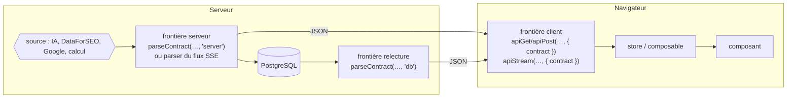

# Contrats d'affichage

*Exigences : NFR-INT-DISPLAY-CONTRACTS, FR-INFRA-KPI-NULLABLE, FR-INFRA-KPI-DISPLAY-DASH, FR-INFRA-KPI-CONSISTENCY, FR-INFRA-KPI-SCORING-NULLSAFE, FR-INFRA-SCORE-MODULE, FR-INFRA-NO-SCORE-FALLBACK, NFR-MAIN-NO-SCORE-FALLBACK, FR-MOT-EXPLORATIONS-HYDRATATION · Design : DESIGN-INT-DISPLAY-CONTRACTS*

Vue d'ensemble dans [Qualités transverses](21-qualites.md#contrats-daffichage) ; ce chapitre donne le détail.

Un **contrat d'affichage** est la description, dans le code, de la forme exacte qu'une réponse doit avoir
pour être affichée. Chaque réponse du Moteur (IA, DataForSEO, Google, calcul local, relecture en base) passe
son contrat avant d'atteindre un composant : elle est contrôlée, remise dans la forme attendue, ou refusée
avec un message clair. Les contrats sont écrits avec **Zod** (bibliothèque qui décrit une forme de données et
vérifie qu'une valeur la respecte). Ils vivent dans [`shared/contracts/`](../shared/contracts/), un fichier par
famille de résultats.

## Le principe

### Trois états pour une valeur

| État | Exemple | Ce que la donnée devient | Ce que l'écran montre |
|---|---|---|---|
| **Valeur** | volume = 480 | `480` | « 480 » |
| **Absente** | DataForSEO ne donne pas de difficulté | `null` | « — » (jamais `0`) ; la carte va en bas des tris ; la valeur est exclue des moyennes |
| **En échec** | champ illisible (`"beaucoup"`, `NaN`), élément de liste corrompu | corrigée (`null`, `0` pour un compteur, repli neutre) ou écartée | « — » ou l'élément disparaît ; l'anomalie part au journal |

Une réponse **inutilisable** (l'IA n'a pas renvoyé la liste demandée, un identifiant manque) est refusée :
elle suit le chemin d'erreur habituel de l'écran avec le message « Réponse reçue dans un format inattendu
(contrat « … ») — relancez l'action. ». L'utilisateur ne voit jamais les corrections mineures ; seul le
journal technique les garde.

Un **compteur** (nombre de questions, de suggestions, rang) n'est pas un indicateur de marché : illisible, il
vaut `0`. Un **indicateur de marché** (volume, difficulté, CPC, concurrence) ou un **score** reste `null`.

### Valeur affichée = valeur qui trie

Quand une valeur est affichée **et** sert à trier, filtrer ou agréger, une seule expression produit les deux
(`.claude/CLAUDE.md` §2.0). Les briques communes sont dans [`shared/score/`](../shared/score/index.ts), seul
point d'entrée autorisé (règle `score-internal-only-via-index` de `.dependency-cruiser.cjs`) :

| Fonction | Rôle |
|---|---|
| `formatScore`, `formatVolume`, `formatKd`, `formatCpc`, `formatPercent` | `null` → « — » (`SCORE_PLACEHOLDER`) ; `formatVolume` abrège au-delà de 1000 (« 1.2k ») ; `formatCpc` donne « 2.10 € » |
| `compareScores`, `compareScoresAsc` | tri décroissant ou croissant ; `null` toujours en bas, quel que soit le sens |
| `averageScores`, `maxScore`, `minScore`, `countValidScores` | agrégats qui ignorent les `null` : la moyenne de `[10, null, 30]` vaut 20 |

Le tri des listes du Moteur passe par [`useSortableList`](../src/composables/moteur/useSortableList.ts) : le
composant fournit `getValue`, qui doit lire la même expression que l'affichage (voir
[Radar et Capitaine](14-radar-capitaine.md) pour les deux onglets).

**Garde-fou statique.** La règle ESLint `no-restricted-syntax` ([`eslint.config.ts`](../eslint.config.ts))
refuse `x ?? 0` quand `x` se termine par `Score`, `Volume`, `Difficulty`, `Cpc`, `Competition` ou `Density`,
en accès direct, par propriété ou en chaînage optionnel (`card.kpis?.searchVolume ?? 0`,
`kpiMap.volume?.rawValue ?? 0`). Elle tourne au commit (`lint-staged`), dans `npm run lint` et
`npm run verify:full`, pas dans `npm run verify` (qui n'appelle qu'`oxlint`, sans cette règle). `shared/score/` en est exempté ; les autres exceptions sont
déclarées sur place par `eslint-disable-next-line` avec leur raison (formule héritée `computeCombinedScore`
dans [`keyword-radar.service.ts`](../server/services/keyword/keyword-radar.service.ts), mots-clés associés
de la Rédaction dans [`dataforseo/keywords.ts`](../server/services/external/dataforseo/keywords.ts)).

## Le mécanisme

### Le noyau

[`shared/contracts/core.ts`](../shared/contracts/core.ts) :

- `defineContract<T>(name, schema)` déclare un contrat. Le type `T` vient de `shared/types/` : c'est la forme
  que le composant reçoit en prop, vérifiée à la compilation contre le schéma.
- `parseContract(contract, raw, boundary)` rend la valeur conforme ou lève `ContractViolationError` (champs
  `contract` et `issues`). `boundary` vaut `'server'`, `'db'` (relecture) ou `'client'`.
- `parseContractList(contract, raw, boundary)` passe chaque élément d'une liste ; un élément refusé est écarté,
  les autres sont servis.
- `setContractReporter(fn)` branche le journal. Chaque correction émet un `ContractEvent`
  (`contract`, `boundary`, `kind`, `field`, `detail`) : `coerced` (valeur corrigée), `dropped` (élément
  écarté), `rejected` (réponse refusée). Le serveur ([`server/index.ts`](../server/index.ts)) et le navigateur
  ([`src/main.ts`](../src/main.ts)) l'écrivent en `log.warn` : `[contrat <nom>] <kind> · <champ> — <détail>`.
- `signal(kind, field, detail)` permet à un fichier de contrat de signaler une règle propre à sa famille.

Primitives (toutes tolérantes : elles corrigent et signalent au lieu de refuser) :

| Primitive | Entrée | Sortie |
|---|---|---|
| `kpiValue(field)` / `toKpiValue(value, field)` | nombre, texte numérique (colonnes `NUMERIC` de PostgreSQL), `null` | nombre fini ou `null` ; `"beaucoup"`, `NaN`, `Infinity` → `null` signalé |
| `count(field)` | entier positif | lui-même ; sinon `0` signalé |
| `text(field, repli)` | texte | lui-même ; sinon le repli (`''` par défaut) |
| `nullableText(field)` | texte ou rien | texte ou `null` |
| `withFallback(schéma, repli, field)` | quelconque | conforme, sinon le repli |
| `oneOf(valeurs, repli, field)` | texte | une valeur connue, sinon le repli |
| `tolerantArray(item, field)` | liste ou rien | éléments conformes ; absence → `[]` |
| `requiredList(item, field)` | liste **obligatoire** | éléments conformes ; pas de liste → refus |
| `tolerantRecord(item, field)` | dictionnaire | entrées conformes ; absence → `{}` |
| `optionalObject(schéma, field)` | objet, `null`, rien | conforme, `null` gardé, non conforme → retiré (`undefined`) |

`toKpiValue` est aussi appelé directement là où une donnée brute entre, hors d'un schéma (réponse
DataForSEO dans [`keyword-scan.routes.ts`](../server/routes/keyword-scan.routes.ts), lignes de
`keyword_metrics` dans [`captain-kpis.ts`](../server/services/keyword/captain-kpis.ts)) : la même valeur
produit toujours la même sortie, quelle que soit la frontière.

### Les trois frontières

Une donnée est mise en forme partout où elle change de mains. Le premier affichage et le rechargement passent
ainsi par les mêmes règles : c'était à la relecture en base que naissaient la plupart des faux zéros.



- **Serveur.** La route appelle `res.json({ data: parseContract(xContract, résultat, 'server') })`. Pour un
  flux **SSE** (événements envoyés en continu du serveur au navigateur), le contrat est le `parser` passé à
  `runAiPanelStream` ([`ai-panel-runner.service.ts`](../server/services/external/ai-panel-runner.service.ts)) :
  il s'applique au texte complet, avant la sauvegarde et l'événement `done`. S'il lève, l'événement `error`
  part et rien n'est enregistré.
- **Relecture.** Les routes qui servent une donnée relue en base appellent `parseContract(…, 'db')`
  ([`radar-exploration.routes.ts`](../server/routes/radar-exploration.routes.ts),
  [`discovery-cache.routes.ts`](../server/routes/discovery-cache.routes.ts),
  [`article-explorations.routes.ts`](../server/routes/article-explorations.routes.ts), analyse SERP relue ou
  reconstruite dans [`serp-analysis.routes.ts`](../server/routes/serp-analysis.routes.ts)).
  `getCaptainExplorations` ([`data.service.ts`](../server/services/infra/data.service.ts)) passe chaque entrée
  d'historique par `parseContractList(captainScanEntryContract, …, 'db')`.
- **Client.** [`api.service.ts`](../src/services/api.service.ts) : l'option `contract` d'`apiGet`, `apiPost`,
  `apiPut`, `apiPatch`, `apiDelete` passe la réponse par `parseContract(…, 'client')` ; une réponse refusée
  rejette la promesse comme une erreur réseau. Pour un flux, `apiStream` applique le contrat au résultat de
  l'événement `done` (`conformStreamResult`) : refus → `onError(message)`, `onDone` n'est pas appelé.
  `useStreaming().startStream` et `startStreamOnce` ([`useStreaming.ts`](../src/composables/editor/useStreaming.ts))
  transmettent l'option. Sans option `contract`, la réponse passe telle quelle.

### Le cliquet de couverture

[`tests/unit/architecture/display-contracts-coverage.test.ts`](../tests/unit/architecture/display-contracts-coverage.test.ts)
lit le code source et vérifie que chaque réponse affichée par le Moteur a son contrat. Il tourne dans
`npm run verify` (`verify:unit`).

- `CLIENT_ENDPOINTS` : chemins et méthodes des appels du front à surveiller. Le test parcourt `src/`, trouve
  chaque `api(Get|Post|…)`, `…StartStream(Once)` ou `apiStream` dont le chemin correspond, et exige
  `contract:` dans le texte de l'appel.
- `SERVER_ROUTES` : fichier, méthode et chemin de chaque route. Le test isole le gestionnaire
  (`router.<méthode>('<chemin>'` jusqu'au `router.` suivant) et exige `parseContract(`,
  `parseContractList(` ou `contract: …Contract`.
- `DONE_FAMILIES` : une famille terminée ne peut plus perdre son contrat, côté client comme côté serveur.
- `BASELINE_CLIENT_UNCOVERED` et `BASELINE_SERVER_UNCOVERED` valent 0 : tout appel ou route listé sans
  contrat fait échouer le test. Une sentinelle exige au moins 20 appels client trouvés, pour qu'un
  changement de syntaxe ne rende pas le test aveugle.
- Le cliquet ne voit que ce qui est listé : une nouvelle route affichée par le Moteur doit y être ajoutée.

Les familles du cliquet portent parfois un autre nom que le contrat journalisé : `paa-judge` →
`captain-paa-judge` ; `long-tail` → `long-tail-suggestions` ; `radar-waiting-list` →
`radar-exploration-add`, `-batch`, `-remove` ; `lieutenants-ai` → `propose-lieutenants` et `ai-hn-structure` ;
`discovery` → `suggest-all`, `discover`, `discover-from-site`, `analyze-discovery`, `relevance-score`.

**Tests des contrats.** [`tests/unit/shared/contracts/`](../tests/unit/shared/contracts/) : un fichier par
famille (plus `core.test.ts` et `complements.contract.test.ts`). Chaque famille est testée sur trois
réponses : conforme (rendue inchangée, aucun signalement), partiellement abîmée (servie, corrections
signalées), inutilisable (refusée). [`tests/unit/services/api.service.test.ts`](../tests/unit/services/api.service.test.ts)
couvre l'option `contract` du client.

### Ajouter ou modifier un contrat

1. **Type** : décrire dans `shared/types/` la forme que le composant reçoit.
2. **Contrat** : dans `shared/contracts/<famille>.contract.ts`, un `z.looseObject` typé contre ce type, bâti
   avec les primitives. Un indicateur ou un score absent reste `null`. `looseObject` garde les champs non
   décrits : le contrat ne retire rien qu'il ne connaît pas.
3. **Serveur** : `parseContract(xContract, résultat, 'server')` avant `res.json`, `'db'` pour une relecture,
   ou `parser` de `runAiPanelStream` pour un flux IA.
4. **Client** : `{ contract: xContract }` à l'appel `api…` ou au flux.
5. **Tests** : les trois réponses (conforme, abîmée, inutilisable) dans `tests/unit/shared/contracts/`.
6. **Cliquet** : ajouter l'appel à `CLIENT_ENDPOINTS`, la route à `SERVER_ROUTES`, la famille à `DONE_FAMILIES`.

## Les contrats par famille

Colonnes des tableaux : le champ, la forme garantie, ce que devient une valeur absente ou illisible.

### Blocs de score communs

[`score-blocks.ts`](../shared/contracts/score-blocks.ts) — partagés par le Capitaine et le Radar.

| Bloc | Forme garantie | Illisible |
|---|---|---|
| `marketScoreSchema` (`MarketScoreResult`) | `total` nombre, `verdict` `GO` · `ORANGE` · `NOGO`, `components` liste (forme seulement) | bloc retiré : anneau « — » |
| `relevanceScoreSchema` (`RelevanceScoreResult`) | `total`, `verdict`, `breakdown` et `rootsContext` objets (forme seulement) | bloc retiré |

Constantes exportées : `ARTICLE_LEVELS` (`pilier`, `intermediaire`, `specifique`) et `UNAVAILABLE_REASONS`
(`no-pain`, `long-tail`, `missing-paa`, `missing-autocomplete`). Les formules des deux scores sont décrites
dans [Radar et Capitaine](14-radar-capitaine.md#score-marché-et-score-pertinence).

### Étude du Capitaine et historique

[`captain-scan.contract.ts`](../shared/contracts/captain-scan.contract.ts) —
`captainScanContract` (« captain-scan », `ScanResponse`) : `POST /keywords/:keyword/scan`, frontières serveur
et client (`useExploredKeywords`, `useCapitaineScan`, `captain-trigger.store`).
`captainScanEntryContract` (« captain-history », `CaptainScanEntry`) : relecture dans `getCaptainExplorations`.

| Champ | Forme garantie | Absent ou illisible |
|---|---|---|
| `keyword`, `articleLevel` | texte non vide, un des trois niveaux | réponse refusée |
| `kpis[].rawValue` | nombre ou `null` | `null` |
| `kpis[].color` | `green` · `orange` · `red` · `neutral` · `bonus` | `neutral` |
| `kpis[].label` | texte affiché (« 480 rech/m », « KD 13 », « Position 2 », « Non trouvé ») | « — » ; un KPI sans valeur est **forcé** à « — » neutre, quel que soit le libellé reçu (« NaN rech/m ») |
| `verdict.level` | `GO` · `ORANGE` · `NO-GO` · `GRAY` | `GRAY` (« à confirmer »), jamais `NO-GO` |
| `verdict.greenCount`, `totalKpis` | compteurs | `0` |
| `paaQuestions[]` | `question` non vide, `answer` texte ou `null`, `match` `none`·`partial`·`total`, `matchQuality` `exact`·`stem` | question vide écartée ; `match` illisible retiré |
| `marketScore`, `relevanceScore` | blocs de score | retirés |
| `relevanceUnavailableReason` (historique) | une des 4 raisons ou `null` | `null` |
| `rootKeywords` (historique) | liste de textes | `[]` |
| `paaJudgment` (historique) | transmis **sans contrôle** (`z.custom`) | — |

Un KPI d'historique (`kpiSummarySchema`) ne contrôle que `name` et `rawValue` : la couleur et le libellé
sont recalculés à l'écran. L'historique est recalculé à la
relecture par les mêmes fonctions qu'à l'étude ([`captain-kpis.ts`](../server/services/keyword/captain-kpis.ts)) :
une carte relue le lendemain montre les mêmes valeurs. Le verdict NO-GO automatique (« Aucun signal
détecté ») n'apparaît que si volume, PAA et autocomplétion ont **réellement** été mesurés à 0
(`computeVerdict`, [`shared/kpi-scoring.ts`](../shared/kpi-scoring.ts)).

### Mots-clés d'un article

[`article-keywords.contract.ts`](../shared/contracts/article-keywords.contract.ts) —
`articleKeywordsContract` (« article-keywords », `ArticleKeywords | null`) : `GET /articles/:id/keywords`,
serveur et client (`article-keywords.store` : `fetchKeywords`, `fetchKeywordsMerge`). Il réalimente le
Capitaine, les Lieutenants, la Structure, le Lexique et la Finalisation.

| Champ | Forme garantie | Absent ou illisible |
|---|---|---|
| `capitaine` | texte | `''` : la Finalisation affiche « — » |
| `lieutenants`, `lexique`, `rootKeywords` | listes de textes | `[]` |
| `hnStructure[]` | titres du plan (règles des Lieutenants, ci-dessous) | titre illisible écarté |
| `richCaptain.status` | `suggested` · `locked` | `suggested` |
| `richCaptain.exploredKeywords[]` | entrées d'historique (« captain-history ») | entrée illisible écartée |
| `richLieutenants[]` | Lieutenants relus (ci-dessous) | écartés un par un |
| `richRootKeywords[]` | `keyword`, `parentKeyword`, KPI résumés, niveau | écartés un par un |

La réponse du `PUT /articles/:id/keywords` n'est pas contrôlée : l'écran garde son état.

### Jugement IA des questions PAA

[`captain-paa-judge.contract.ts`](../shared/contracts/captain-paa-judge.contract.ts) —
`paaJudgmentBlockContract` (« paa-judgment ») contrôle la sortie de l'IA dans
[`captain-paa-judge.service.ts`](../server/services/keyword/captain-paa-judge.service.ts) : un refus bascule sur
le repli lexical. `captainPaaJudgeContract` (« captain-paa-judge ») : `POST /articles/:id/captain/judge-paa`,
serveur et client (`article-keywords.store.loadCaptainPaaJudgments`).

| Champ | Forme garantie | Absent ou illisible |
|---|---|---|
| `paaJudgments[].badge` | `pertinent` · `partiel` · `hors-sujet` (strict) | jugement écarté |
| `paaJudgments[].paaIndex` | entier ≥ 0 | jugement écarté |
| `paaScore`, `overallPaaScore` | nombre ramené entre 0 et 100 | `paaScore` absent : jugement écarté ; `overallPaaScore` absent : bloc refusé |
| `reasonShort`, `summary` | texte | `''` |
| `relevanceScores[mot-clé]` | `total` et `verdict` nombre ou `null`, `unavailableReason` une des 4 raisons ou `null` | entrée écartée |

### Radar

[`radar.contract.ts`](../shared/contracts/radar.contract.ts).

| Contrat | Type | Route | Frontières et appelants |
|---|---|---|---|
| « radar-scan » | `KeywordRadarScanResult` | `POST /keywords/radar/scan` | serveur ; client `useKeywordRadar.scan` ([`useResonanceScore.ts`](../src/composables/keyword/useResonanceScore.ts)), `useCapitaineScan` |
| « radar-generate » | `KeywordRadarGenerateResult` | `POST /keywords/radar/generate` | serveur ; client `useDiscoveryPanel`, `useKeywordRadar.generate` |
| « radar-exploration » | `RadarExploration \| null` | `GET /articles/:id/radar-exploration` | relecture ; client `radar-exploration.store`, `useKeywordRadar.mergeFromRadarSource` |
| « radar-exploration-add », « -batch », « -remove » | `{ entry, added }`, `{ entry: … \| null }` | `POST …/radar-exploration/keyword`, `POST …/keywords`, `DELETE …/keyword` | relecture ; client `radar-exploration.store` |
| « long-tail-suggestions » | `{ suggestions, fromCache }` | `POST …/radar-exploration/long-tail` | serveur ; client `useLongTailSuggestions` |

Carte (`RadarCard`) :

| Champ | Forme garantie | Absent ou illisible |
|---|---|---|
| `keyword` | texte non vide | carte écartée, les autres servies |
| `kpis` | bloc KPI ou `null` | `null` = longue traîne sans KPI ; bloc illisible → `null` aussi : ligne KPI et icônes masquées |
| `kpis.searchVolume`, `difficulty`, `cpc`, `competition`, `intentProbability`, `avgSemanticScore` | nombre ou `null` | `null` : « — », en bas du tri |
| `kpis.intentTypes[]` | parmi `informational`, `commercial`, `transactional`, `navigational` | intention inconnue écartée |
| `kpis.paaMatchCount`, `paaWeightedScore`, `paaTotal`, `autocompleteMatchCount` | compteurs | `0` |
| `paaItems[]` | `question` non vide, `depth`, `match` `total`·`partial`·`none`, `matchQuality` `exact`·`stem`·`semantic` | question vide écartée ; `match` illisible → `none` |
| `marketScore` | bloc de score | retiré : l'anneau recalcule depuis `kpis` ; « Suggestions IA Radar » affiche « M — » |
| `relevanceScore`, `relevanceUnavailableReason` | bloc ou `null`, raison ou `null` | `null` |
| `combinedScore`, `scoreBreakdown` (hérités, dépréciés) | nombre, détail | `0`, détail à zéro |

Résultat de scan : `globalScore` nombre ou `null` (thermomètre « En attente —/100 », jamais « Froide 0 ») ;
`heatLevel` `brulante`·`chaude`·`tiede`·`froide`·`null` ; `autocomplete.suggestions[]` (`text`, `query`,
`position`) ; textes `verdict`, `specificTopic`, `broadKeyword`, `scannedAt` → `''`.
Exploration : une ligne pas encore scannée (`scan_result = '{}'` en base) est un état normal, remplacé par un
résultat vide **sans signalement**. Suggestion longue traîne : validée par `longTailSuggestionSchema`
([`shared/schemas/long-tail-suggestions.schema.ts`](../shared/schemas/long-tail-suggestions.schema.ts)) ;
une suggestion abîmée en cache est écartée.

### Analyse SERP, pré-contrôle et TF-IDF

[`serp.contract.ts`](../shared/contracts/serp.contract.ts) — « serp-analysis » (`SerpAnalysisResult`,
`POST /serp/analyze` : serveur pour une analyse fraîche, relecture pour `cacheOnly` et pour une analyse
reconstruite depuis la base ; client `useLieutenantsSerp`, `useStructureHn`). `serpAnalysisStoredContract`
(même nom, `… | null`) sert la lecture seule : `null` = jamais analysé. « serp-exists »
(`GET /keywords/:keyword/serp/exists`, client `useSerpExistsCheck`). « tfidf » (`POST /serp/tfidf`, client
`LexiquePanel`).

| Champ | Forme garantie | Absent ou illisible |
|---|---|---|
| `competitors[].url` | texte non vide | concurrent écarté |
| `competitors[].headings[]` | `level` 1 à 6, `text` non vide | titre écarté |
| `competitors[].textContent` | texte | `null` relu en base → `''` |
| `competitors[].fetchError` | texte ou absent | **page sans titre ni texte → `UNREAD_PAGE_MESSAGE`** (« Page concurrente non lue… ») : badge « ! » et exclusion de la récurrence des titres |
| `competitors[].isBlog` | booléen ou absent | `null` relu → absent (inconnu) |
| `serp-exists.exists` | `true`, `false` ou `null` | `null` (inconnu) : l'écran garde « Extraire » au lieu de proposer un scrape payant |
| terme TF-IDF `level` | `obligatoire` · `differenciateur` · `optionnel` | terme écarté |
| terme TF-IDF `density`, `documentFrequency` | nombres | **terme écarté** (pas de « ×0/page · 0 % » inventé) |

Exemple : sur deux pages dont une illisible, un titre présent sur la page lue compte « 1/1 (100 %) » et non
« 1/2 (50 %) », au premier chargement comme au rechargement.

### Lieutenants et plan Hn

[`lieutenants.contract.ts`](../shared/contracts/lieutenants.contract.ts) — « propose-lieutenants-ai » :
sortie brute de l'IA, `parser` de `POST /keywords/:keyword/propose-lieutenants`, avant le tri
(`filterLieutenants`) et la sauvegarde. « propose-lieutenants » : événement `done` côté client
(`useLieutenantsIa`). « ai-hn-structure » : `POST /keywords/:keyword/ai-hn-structure`, `parser` et client
(`useStructureHn`). `richLieutenantSchema` et `proposeHnNodeSchema` servent aussi à la relecture
(« article-keywords »).

| Champ | Forme garantie | Absent ou illisible |
|---|---|---|
| `lieutenants` (sortie IA) | liste **obligatoire** | pas de liste → refus : message et « Régénérer » |
| `keyword` | texte non blanc ; un doublon (casse ignorée) n'apparaît qu'une fois | écarté |
| `score` | entier 0 à 100 ou `null` | `null` : « — », en bas du tri ; hors 0-100 → `null` signalé |
| `suggestedHnLevel` | 2 ou 3 (« H3 » et « 3 » acceptés) | H2, signalé |
| `sources[]` | `paa`, `serp`, `group`, `root`, `content-gap` | source inconnue écartée |
| `status` (relu) | `suggested` · `locked` · `eliminated` · `archived` | `archived` : carte masquée |
| `hnStructure` (régénération) | liste **obligatoire** | refus : le plan affiché reste en place |
| titre `level` / `text` | 1 à 6 (« H2 » accepté) / texte non blanc | titre écarté |

Une carte ajoutée depuis le panier, ou restaurée d'une ancienne liste sans détail, n'a pas de score IA :
elle affiche « — ». Le texte brut qui défile pendant le flux n'est pas contrôlé (c'est une progression).

### Lexique IA et explorations Lexique

[`lexique.contract.ts`](../shared/contracts/lexique.contract.ts) — « lexique-ai » : `parser` de
`POST /keywords/:keyword/ai-lexique-upfront` avant sauvegarde, puis événement `done` (`useLexiqueIa`).
`lexiqueExplorationSchema` : relecture de `lexique_explorations` dans « explorations ».

| Champ | Forme garantie | Absent ou illisible |
|---|---|---|
| `recommendations` | liste **obligatoire** | refus : message et « Relancer l'analyse IA » |
| `recommendations[].aiRecommended` | booléen strict | recommandation écartée : **pas de badge**, plutôt qu'une décision inventée |
| `missingTerms[]` | textes non blancs | terme écarté |
| `tfidfTerms` (relu) | résultat TF-IDF ou `null` | `null` : « pas encore extrait » |

### Explorations d'un article

[`article-explorations.contract.ts`](../shared/contracts/article-explorations.contract.ts) —
`articleExplorationsContract` (« explorations », `ArticleExplorations`) : `GET /articles/:id/explorations`,
relecture et client (`useArticleResults` pour le thermomètre du Radar, `useLexiqueExplorations` pour les
onglets du Lexique). Chaque bloc reprend le contrat de sa famille : `radar` (exploration illisible → `null`,
le thermomètre attend), `captain[]`, `lieutenants[]`, `lexique[]` (une ligne abîmée écartée, les autres
servies). Les analyses `local` et `contentGap` sont servies telles quelles, jamais bloquantes.

### Découverte

[`discovery.contract.ts`](../shared/contracts/discovery.contract.ts).

| Contrat | Route | Règle clé |
|---|---|---|
| « suggest-all » | `POST /keywords/suggest-all` | suggestion vide écartée ; stratégie absente → liste vide |
| « discover », « discover-from-site » | `POST /keywords/discover`, `/discover-from-site` | KPI absents → `null` ; type de mot-clé ou source inconnus → mot-clé écarté ; score composite illisible → tout à `null` |
| « analyze-discovery » | `POST /keywords/analyze-discovery` | priorité illisible → `low` (affichée en vert, comme avant) |
| « relevance-score » | `POST /keywords/relevance-score` | score hors de 0-1 écarté : mot-clé « non évalué » |
| « word-groups » | `POST /keywords/word-groups` | groupe sans mot écarté ; `count` compteur |
| « discovery-cache-status », « discovery-cache » | `GET /discovery-cache/check`, `/load` (relecture) | KPI d'un mot-clé en cache : non fourni reste non fourni, illisible → `null` ; sélection IA illisible → `null` |

Appelants : `useDiscoveryPanel`, `keyword-discovery.store`, `useRelevanceScoring`, `useDiscoveryCache`.

### Avis IA rédigé

[`ai-advice.contract.ts`](../shared/contracts/ai-advice.contract.ts) — « ai-advice » : `parser` de
`POST /keywords/:keyword/ai-panel` (avis du Capitaine) et de `POST /keywords/:keyword/ai-lexique` (sans
appelant dans l'écran aujourd'hui). « ai-advice-done » : événement `done` côté client (trois flux de
`CaptainPanel`).

| Élément | Forme garantie | Cas limite |
|---|---|---|
| texte complet (serveur) | Markdown non vide | vide → événement `error` : message et « Régénérer » au lieu d'un panneau blanc |
| texte affiché | Markdown sans emballage en bloc de code | `adviceMarkdown()` retire un « ```markdown … ``` » englobant, pendant le flux comme à la relecture |
| événement `done` | `keyword`, `level` | absent → `''` |

## Ce qui reste hors contrat

| Réponse | Pourquoi |
|---|---|
| `PUT /articles/:id/keywords`, `PATCH …/captain-explorations/ai-panel`, `PATCH …/long-tail/selection`, `POST /discovery-cache/save` | réponse non affichée : l'écran garde son état |
| `GET /articles/:id/radar-exploration/status`, `/radar-cache/*` | statut de cache, pas un résultat d'analyse |
| `POST /keywords/intent-scan` | sans appelant dans l'interface (code mort) |
| stratégie du cocon, liste des cocons, progression (`MoteurContextRecap`) | données de pilotage |
| routes de la Rédaction, `RelatedKeyword` (brief, audit du cocon) | hors Moteur ; KPI encore non nullables (`FR-INFRA-KPI-NULLABLE` non tenue) |

## Limites connues

- **Score Marché sans donnée.** `computeKpiScore` ([`shared/scoring-kpi.ts`](../shared/scoring-kpi.ts)) retire
  les composantes « — », mais l'intention inconnue compte rouge (0) et, au Radar, PAA et autocomplétion sont
  des compteurs (0 → rouge). Une carte sans aucune donnée DataForSEO affiche donc 0 (NOGO), pas « — »
  (`FR-INFRA-KPI-SCORING-NULLSAFE` attend un score absent).
- **Compteurs confondus.** Au Radar, « aucune question » et « questions inconnues » donnent tous deux
  `paaWeightedScore = 0` ; `hydrateCardFromValidation` fait de même pour une carte du Capitaine.
- **Thermomètre.** `globalScore` est la moyenne de `combinedScore`, qui compte 0 pour une donnée absente
  (`FR-RAD-THERMOMETER` non tenue, voir [Radar et Capitaine](14-radar-capitaine.md)).
- **Formats à la main.** Le panneau latéral du Capitaine et la liste des sources de la Découverte formatent
  encore certains indicateurs sans `shared/score/` (`FR-INFRA-KPI-DISPLAY-DASH` non tenue).
- **Jugement PAA de l'historique** transmis sans contrôle (`z.custom`) ; il vaut toujours `null` à la
  relecture.
