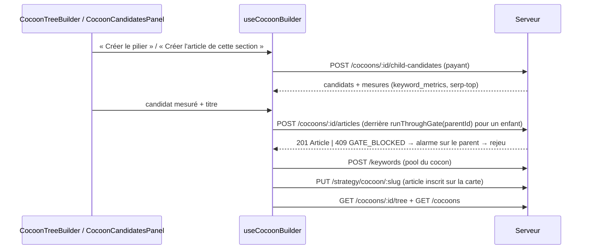

# Cerveau

Le Cerveau a deux moitiés, de données différentes.

1. **La stratégie du cocon et sa carte indicative.** Un seul document JSONB, `cocoon_strategies.data` (type `CocoonStrategy`), porte :
   - les cinq étapes ;
   - `proposedArticles` (la carte) ;
   - `suggestedTopics` et `topicsUserContext` ;
   - `completedSteps`.

   Il est lu et réécrit en entier par `useCocoonStrategyStore.saveStrategy`. Le Moteur tire la liste de ses articles de `proposedArticles`.
2. **L'arbre réel.** La table `articles` (`parent_id`, `parent_section`, `completed_checks`) est la seule source de ce qui peut naître. Le serveur juge ; l'écran montre et demande.

Création d'un article depuis le constructeur :

## Stratégie du cocon : les six étapes
*Exigences : FR-CER-STEPS-COCOON, FR-CER-SAISIE-PRESERVEE · Design : DESIGN-CER-STEPS-COCOON*

- **Code — écran :**
  - [`src/views/CerveauView.vue`](../src/views/CerveauView.vue) — `@next` → `router.push('/cocoon/:id')`.
  - [`src/components/production/BrainPhase.vue`](../src/components/production/BrainPhase.vue) :
    - `stepConfigs` (titres et descriptions des cinq questions) ;
    - `getSuggestContext` (cocon, silo, `previousAnswers`, `existingArticles`, `themeContext`) et `buildThemeContext` ;
    - les gestes `handleSuggest`, `handleMerge`, `handleDeepen`, `handleSubSuggest`, `handleSubMerge`, `handleSubEnrich`, et `handleNext` (étape 6 → `completedSteps = 6`, `saveStrategy`, `emit('next')`) ;
    - `cerveauNavSteps` → `useWorkflowNavStore().setWorkflowNav` (barre d'étapes de l'application) ;
    - `mergedCocoonArticles`.
  - [`src/components/strategy/StrategyStep.vue`](../src/components/strategy/StrategyStep.vue) :
    - `validateOwnInput`, `validateSuggestion`, `validateAll` (fusion) ;
    - `canValidate`, `canDeepen` ;
    - le `watch` sur `stepData.input`, qui ignore une valeur distante vide quand la saisie locale ne l'est pas (FR-CER-SAISIE-PRESERVEE, test `tests/unit/components/strategy-step-saisie.test.ts`).
  - [`SubQuestionCard.vue`](../src/components/strategy/SubQuestionCard.vue), [`ContextRecap.vue`](../src/components/strategy/ContextRecap.vue).
- **Code — store :** [`src/stores/strategy/cocoon-strategy.store.ts`](../src/stores/strategy/cocoon-strategy.store.ts) :
  - `steps` = cible, douleur, angle, promesse, cta, articles ;
  - `fetchStrategy` (étape courante = `min(completedSteps, 5)`), `saveStrategy`, `requestSuggestion`, `requestDeepen`, `requestEnrich` ;
  - `getPreviousAnswers` (textes validés + sous-réponses validées) ;
  - `nextStep` (`completedSteps = currentStep` puis `saveStrategy`), `prevStep`, `goToStep` (sans enregistrement), `initEmpty` ;
  - `isComplete` (`completedSteps >= 6`).
- **Code — serveur :**
  - [`server/routes/strategy.routes.ts`](../server/routes/strategy.routes.ts) — routes cocon ; `maxTokens` de 4096 pour `articles`, `articles-structure` et `articles-spe`, 2048 pour `articles-paa-queries` et `articles-topics`, 1024 sinon.
  - [`server/services/strategy/strategy-prompts.service.ts`](../server/services/strategy/strategy-prompts.service.ts) — `cocoonStrategyPrompt`, `cocoonTemplateFor` (étape → modèle `cocoon-brainstorm`, `cocoon-articles`, `cocoon-articles-topics`, `cocoon-paa-queries`, `cocoon-articles-spe`, `cocoon-add-article`), `mergePrompt` (`strategy-merge`), `deepenPrompt`, `enrichPrompt`, `buildThemeContextBlock`, `buildPreviousAnswersBlock`.
  - [`server/services/strategy/cocoon-strategy.service.ts`](../server/services/strategy/cocoon-strategy.service.ts) — `resolveCocoonId` (nom, nom sans tirets, puis slug de chaque cocon), `getCocoonStrategy` (JSON illisible pour `cocoonStrategySchema` → `null`), `saveCocoonStrategy` (fusion avec l'existant, validation Zod, `INSERT … ON CONFLICT (cocoon_id) DO UPDATE`).
- **Données :** `cocoon_strategies(cocoon_id PK → cocoons ON DELETE CASCADE, data JSONB, generated_at)`. `completedSteps` vit dans le JSON. Le front désigne le cocon par le slug de son nom.
- **API :**
  - `GET` et `PUT /api/strategy/cocoon/:cocoonSlug` → `{ data: CocoonStrategy | null }`.
  - `POST /api/strategy/cocoon/:cocoonSlug/suggest { step, currentInput, mergeWith?, existingValidated?, context }` → `{ suggestion, usage }` ; `mergeWith` bascule sur la fusion.
  - `POST …/deepen` → `{ question, description, usage }`.
  - `POST …/enrich` → `{ enriched, usage }`.
  - `POST …/consolidate` existe, mais le Cerveau ne l'appelle pas.
- **Règles et décisions :**
  - `completedSteps` compte les étapes **atteintes** par « Suivant », pas les étapes validées. « Terminer le brainstorm » le met à 6, et c'est ce seuil que la Rédaction lit.
  - La stratégie s'enregistre sur `nextStep`, `handleNext` et chaque action de la carte (tous appellent `saveStrategy`). `updateStepData`, `prevStep` et `goToStep` ne font que muter le store.
  - `saveStrategy` réécrit tout le document : la carte et les étapes voyagent ensemble.
  - Un document que le schéma refuse est lu comme absent. Un enregistrement suivant repartirait d'une stratégie vide : à ne pas casser en durcissant `cocoonStrategySchema`.

## Stratégie d'article (sans écran)
*Exigences : FR-CER-STEPS-ARTICLE · Design : DESIGN-CER-STEPS-ARTICLE*

- **Code :**
  - [`src/stores/strategy/strategy.store.ts`](../src/stores/strategy/strategy.store.ts) — six étapes (cible, douleur, aiguillage, angle, promesse, cta). Seul `ArticleWorkflowView` l'utilise, pour `fetchStrategy` et `isComplete`.
  - Routes article de `strategy.routes.ts` : `GET` et `PUT /api/strategy/:id`, `POST /api/strategy/:id/suggest|deepen|consolidate|enrich`, `POST /api/strategy/batch-status` (aucun appelant).
  - [`server/services/strategy/strategy.service.ts`](../server/services/strategy/strategy.service.ts) — `getStrategy`, `saveStrategy`.
  - `articleStrategyPrompt` (modèles `strategy-suggest`, `strategy-merge`).
  - Seul écrivain : le mode automatique ([`scripts/auto-article/phases/cerveau.ts`](../scripts/auto-article/phases/cerveau.ts), étape 8 : `PUT /strategy/:id`).
- **Données :** `article_strategies(article_id PK → articles ON DELETE CASCADE, data JSONB, completed_steps INTEGER, updated_at)`.
- **Règles et décisions :** API conservée pour le mode automatique et le verrou de la Rédaction. Aucun écran ne la remplit (cf. le commentaire de `ArticleWorkflowView` près de `strategyStore.fetchStrategy`).

## Arbre réel du cocon : créer, retirer, rattacher
*Exigences : FR-CER-COCOON-PROGRESSIVE, FR-CER-AIGUILLAGE, FR-CER-CHILD-FROM-PILLAR-H2, FR-CER-CREATION-HONNETE · Design : DESIGN-CER-COCOON-PROGRESSIVE, DESIGN-CER-AIGUILLAGE, DESIGN-CER-CHILD-FROM-PILLAR-H2, DESIGN-CER-CREATION-HONNETE*

- **Code — écran :**
  - [`src/components/production/brain/CocoonTreeBuilder.vue`](../src/components/production/brain/CocoonTreeBuilder.vue) :
    - `loadTree()` dès la mise en place, puis `watch(cocoonId)` ;
    - `canStartPillar` ;
    - `proposeForSection`, qui refuse sans parent rédigé ;
    - `openAttach` / `confirmAttach` ;
    - `data-testid` : `cocoon-create-pillar`, `tree-node-*`, `tree-node-state`, `tree-node-blocked`, `tree-section-create`, `tree-section-child`, `tree-orphans`, `tree-orphan-attach*`.
  - [`src/composables/strategy/useCocoonBuilder.ts`](../src/composables/strategy/useCocoonBuilder.ts) (en-tête `AUTHORITY:`) :
    - `blocks`, qui range chaque pilier puis ses intermédiaires dans l'ordre des sections ;
    - `orphans` ;
    - `createFromCandidate` : titre ≥ 3 caractères, candidat mesuré exigé, `runThroughGate` pour un enfant ;
    - `refusalOf` ;
    - `addToKeywordPool`, qui envoie le type `articleLevelToDisplayLabel(level)` ;
    - `registerInStrategy` : même `dbId`, sinon même titre non créé, sinon une nouvelle ligne ;
    - `attachTargets`, `attachOrphan`.
- **Code — serveur :**
  - [`server/services/article/cocoon-article.service.ts`](../server/services/article/cocoon-article.service.ts) (en-tête `AUTHORITY:`) :
    - `getCocoonTree` : un spécialisé n'a pas de section lue ; un enfant dont la section a disparu reste listé ; `drafted` = présence de `REDACTION_DRAFT_ACCEPTED` ;
    - `createCocoonArticle` : hiérarchie, puis mot-clé mesuré, puis parent prêt, puis `insertCocoonArticle` ;
    - `attachCocoonArticle` (`movingId`) ;
    - `assertHierarchy` (sans les sections), `assertParentReady` ;
    - `CocoonArticleError`.
  - [`shared/verifiers/cocoon-hierarchy.ts`](../shared/verifiers/cocoon-hierarchy.ts) — `verifyCocoonHierarchy` (règles `hierarchy-one-pillar`, `-pillar-has-parent`, `-pillar-first`, `-parent-missing`, `-parent-elsewhere`, `-parent-level`, `-section-missing`, `-section-unknown`, `-section-taken`, toutes de niveau `technique` ⛔), `parentSectionsOf` (H2 du texte, sinon de `hn_structure`, sans intro, conclusion ni FAQ), `PARENT_LEVEL`.
  - [`shared/chapters.ts`](../shared/chapters.ts) — `sectionKey`.
  - [`server/services/infra/data.service.ts`](../server/services/infra/data.service.ts) :
    - `insertCocoonArticle` : `id` tiré de la séquence `articles_id_seq` (NFR-INT-ARTICLE-ID-NEVER-REUSED) ; `ON CONFLICT (slug) DO NOTHING` → `'slug-taken'` ; type converti par `articleLevelToDbType` ;
    - `setArticleParent` ;
    - `removeArticleFromCocoon` : `'has-children'` si un enfant est encore dans un cocon, sinon `cocoon_id`, `parent_id` et `parent_section` à `NULL` ;
    - `getArticleChildren`, `rowToArticle`.
  - [`shared/utils/article-level.ts`](../shared/utils/article-level.ts) — `articleTypeDbToLevel` / `articleLevelToDbType` : « Pilier / Intermédiaire / Spécialisé » en base, `pilier / intermediaire / specifique` dans le code.
  - [`shared/schemas/article.schema.ts`](../shared/schemas/article.schema.ts) — `createCocoonArticleSchema`, `attachCocoonArticleSchema`, `patchArticleSchema` (titre, adresse, intention : jamais le niveau ni le parent).
- **Données :**
  - `articles.parent_id INTEGER` → `articles(id) ON DELETE RESTRICT`, avec `CHECK (parent_id IS NULL OR parent_id <> id)` et l'index `idx_articles_parent_id`.
  - `articles.parent_section TEXT` : le titre du H2.
  - `articles.type`, sous `CHECK` Pilier / Intermédiaire / Spécialisé.
  - `slug UNIQUE`.
  - Colonnes posées par [`server/db/changes/2026-09-25-article-parent.sql`](../server/db/changes/2026-09-25-article-parent.sql).
- **API :**
  - `GET /api/cocoons/:cocoonId/tree` → `{ data: CocoonTreeNode[] }` ; 400, 404.
  - `POST /api/cocoons/:cocoonId/articles { title, type, parentId?, parentSection?, slug?, suggestedKeyword?, painPoint?, painIntentExpected? }` → 201 `{ data: Article }`. Refus :
    - 400 `INVALID_ID` / `VALIDATION_ERROR` ;
    - 404 `COCOON_NOT_FOUND` ;
    - 409 `HIERARCHY_VIOLATION` (`details.issues`), `GATE_BLOCKED` (`details` = évaluation de la porte `draft` du parent), `SLUG_TAKEN` ;
    - 422 `KEYWORD_NOT_MEASURED`.
  - `PUT /api/cocoons/:cocoonId/articles/:articleId/parent { parentId, parentSection }` → `{ data: { id, parentId, parentSection } }` ; 404 `ARTICLE_NOT_FOUND` ; mêmes 409.
  - `DELETE /api/articles/:id` → `{ data: { id, removed } }` ; 404 ; 409 `HAS_CHILDREN`.
  - `POST /api/keywords { keyword, cocoonName, type }` → 409 `DUPLICATE`, dont le message nomme le cocon qui a déjà le mot-clé (`addKeyword` renvoie `existingCocoon`).
- **Règles et décisions :**
  - **L'arbre crée, la carte guide.** Le constructeur ne lit jamais `proposedArticles`. Il y inscrit l'article créé, parce que le Moteur liste ses articles depuis la carte (`MoteurView` → [`src/utils/recap-articles.ts`](../src/utils/recap-articles.ts) `buildRecapArticles`, qui prend **toutes** les lignes de la carte, créées ou non).
  - **Vérification en deux temps.** La hiérarchie se juge sans les sections (`parentSections: null`), puis vient la porte du parent, puis les sections : un parent sans texte n'a pas de section, et « rédigez-le » est la vraie cause.
  - **Tout ⛔ :** ce sont des règles de structure, sans empreinte ni `gate_waivers`.
  - **Parent en base, pas dans le JSON.** `ON DELETE RESTRICT` empêche d'effacer un parent ; `removeArticleFromCocoon` refuse de le détacher. Un enfant détaché libère sa section.
  - **Rattacher** passe par une route dédiée qui rejoue les règles d'une création. L'article déplacé sort des articles du cocon le temps du jugement, pour ne pas se bloquer sur sa propre section.
  - **Honnêteté de la création.** Après la 201, ni le pool ni la carte ne peuvent dire l'article « non créé » : leurs échecs sont des `notify.warning`.
  - **Surveiller :** `insertCocoonArticle` n'a pas de séquence ; deux créations simultanées se départagent par nouvel essai.

## Candidats mesurés d'un nouvel article
*Exigences : FR-CER-KEYWORD-REAL-DATA, FR-PIE-AI-GENERATION, FR-CER-CHILD-FROM-PILLAR-H2 · Design : DESIGN-CER-KEYWORD-REAL-DATA, DESIGN-PIE-AI-GENERATION*

- **Code — serveur :**
  - [`server/services/strategy/child-candidates.service.ts`](../server/services/strategy/child-candidates.service.ts) — `proposeChildCandidates` :
    - niveau déduit du parent (`CHILD_LEVEL`) ;
    - **avant l'appel payant** : parent spécialisé ⛔, `verifyCocoonHierarchy` avec les sections du parent, parent non rédigé → `PARENT_NOT_WRITTEN` ;
    - prompts `system-propulsite` et `cocoon-child-keywords` (`cocoon_context`, `articleLevel`, `parentSection`, `type_rules`, et `{{strategy_context}}` par `cocoonSlug` = le nom du cocon) ;
    - `collectStreamWithUsage(…, 1500)`, `parseAiJson` puis `aiResponseSchema` (`painIntentExpected … .catch(null)`) ;
    - dédoublonnage par `normalizeKeyword` contre les mots-clés de l'arbre et entre candidats ; `MAX_CANDIDATES = 5` ;
    - `measureKeywords`.
  - [`server/services/keyword/keyword-measure.service.ts`](../server/services/keyword/keyword-measure.service.ts) :
    - `measureKeywords` : `keyword_metrics` relu ; absents ou de plus de 7 jours (`isKeywordMetricsFresh`) → `fetchMissingKpis`, un `fetchKeywordOverviewBatch` et un `fetchSearchIntentBatch` groupés, puis `upsertKeywordKpis` ; panne des volumes → `metrics: null` ;
    - `serpTop` : `getSerpResultsFresh` (analyse du Moteur de moins de 7 jours), sinon `getOrFetch('serp-top', slugify(keyword), 7 jours, fetchSerp)` ; `SERP_TOP = 3`.
  - [`server/services/strategy/cocoon-context.service.ts`](../server/services/strategy/cocoon-context.service.ts) — `cocoonContextForNewArticle`, `parentSectionText` (2 000 caractères au plus) ; rendu par [`shared/cocoon-context.ts`](../shared/cocoon-context.ts) (cf. [Infrastructure transversale](20-infrastructure.md), FR-INFRA-COCOON-CONTEXT).
  - [`server/prompts/cocoon-child-keywords.md`](../server/prompts/cocoon-child-keywords.md) — 3 à 5 candidats : `keyword`, `title`, `rationale`, `painPoint`, `painIntentExpected`.
  - [`server/services/external/mock-fixtures/cocoon-child.ts`](../server/services/external/mock-fixtures/cocoon-child.ts) — mode simulé : 4 candidats tirés de la section du parent ou du nom du cocon.
  - Les mesures groupées du bac à sable DataForSEO sont rattachées aux mots-clés demandés par `pairWithRequested` ([`server/services/external/dataforseo/keywords.ts`](../server/services/external/dataforseo/keywords.ts)).
- **Code — écran :**
  - [`CocoonCandidatesPanel.vue`](../src/components/production/brain/CocoonCandidatesPanel.vue) — `INTENT_LABELS`, `canCreate`, choix vidé à chaque nouvelle liste, titre prérempli.
  - `useCocoonBuilder` — `proposeCandidates` : une réponse arrivée après un changement de cible est ignorée (`proposalSeq`).
- **Données :**
  - En lecture : `keyword_metrics`, `keyword_serp_results` (seulement), `external_api_cache` (`cache_type = 'serp-top'`), `cocoon_strategies`, l'arbre.
  - En écriture : `keyword_metrics`, `external_api_cache`. **Jamais** `keyword_serp_results`, ni `articles`.
- **API :** `POST /api/cocoons/:cocoonId/child-candidates { parentId?, parentSection? }` → `{ data: ChildCandidatesResult }` (`level`, `parentId`, `parentSection`, `candidates[]` avec `metrics | null` et `serp[]`, `usage`). Refus : 400 ; 404 `COCOON_NOT_FOUND` ; 409 `HIERARCHY_VIOLATION`, `PARENT_NOT_WRITTEN` ; 502 `AI_UNREADABLE`. La route coupe le délai du socket (`setTimeout(0)`).
- **Règles et décisions :**
  - Base d'abord, un seul appel groupé pour les volumes.
  - **Un relevé n'est pas une analyse.** Les trois premiers résultats vont dans le cache TTL, jamais dans `keyword_serp_results`, que le Moteur prend pour une analyse faite, pages lues.
  - **Aucun zéro inventé.** `KEYWORD_NOT_MEASURED` ne teste que la présence dans `keyword_metrics`, pas l'âge de la mesure.
  - **Intention de l'article créé :** `existing?.painIntentExpected ?? candidate.painIntentExpected`. Douleur : celle du candidat, sinon celle de la proposition.
  - L'en-tête `AUTHORITY:` de `child-candidates.service.ts` cite encore `keyword_serp_results` en écriture : c'est faux depuis le relevé en cache.

## Porte « premier jet accepté » du parent
*Exigences : FR-CER-PARENT-WRITTEN-GATE · Design : DESIGN-CER-PARENT-WRITTEN-GATE*

- **Code :**
  - [`shared/constants/workflow-checks.constants.ts`](../shared/constants/workflow-checks.constants.ts) — `REDACTION_DRAFT_ACCEPTED = 'redaction:draft_accepted'`, `REDACTION_CHECKS`, `ALL_WORKFLOW_CHECKS`. Aucune entrée dans `CHECK_DEPENDENTS` : l'étape est collante.
  - [`shared/schemas/article-progress.schema.ts`](../shared/schemas/article-progress.schema.ts) — `writeCheckRegex` n'accepte que `moteur:*` et `redaction:draft_accepted` ; `readCheckRegex` tolère `cerveau:*` et les anciens `redaction:*`.
  - [`server/services/gates/gate.service.ts`](../server/services/gates/gate.service.ts) — `CHECK_GATES[REDACTION_DRAFT_ACCEPTED] = 'draft'` (la porte elle-même : cf. [Rédaction](17-redaction.md)).
  - [`src/composables/article/useArticleGeneration.ts`](../src/composables/article/useArticleGeneration.ts) — `acceptDraft(id)`, appelé d'office après la méta.
  - [`src/components/article/DraftAcceptance.vue`](../src/components/article/DraftAcceptance.vue) — bandeau `draft-acceptance`, `accepted` lu dans `useArticleProgressStore`.
  - [`src/stores/ui/gate-alarm.store.ts`](../src/stores/ui/gate-alarm.store.ts) — `runThroughGate` (409/422 `GATE_BLOCKED` → alarme → un seul rejeu) ; `isGateBlocked` lit le code et les `details`, pas le statut.
  - `cocoon-article.service` `assertParentReady` — porte rejouée, puis `addArticleCheck(parent.id, REDACTION_DRAFT_ACCEPTED)`.
- **Données :** `articles.completed_checks`, `check_timestamps` ; `gate_waivers` (`gate_id = 'draft'`).
- **API :** `POST /api/articles/:id/progress/check { check: 'redaction:draft_accepted' }` → 200, ou 422 `GATE_BLOCKED`. Pour la création d'un enfant, 409 `GATE_BLOCKED`, traité par l'écran de la même façon.
- **Règles et décisions :** « rédigé » est une étape enregistrée, pas une présence de texte. L'écran grise la création sous un parent non rédigé ; le rejeu serveur couvre un état changé entre-temps, et le mode automatique (qui s'arrête).

## Carte indicative du cocon
*Exigences : FR-CER-STEPS-COCOON, FR-CER-COCOON-PROGRESSIVE, FR-CER-TYPE-TOLERANT, FR-CER-AIGUILLAGE, FR-PIE-AI-GENERATION, FR-PIE-CERVEAU-OVERRIDE · Design : DESIGN-CER-STEPS-COCOON, DESIGN-CER-TYPE-TOLERANT, DESIGN-PIE-AI-GENERATION, DESIGN-PIE-CERVEAU-OVERRIDE*

- **Code — écran :**
  - [`BrainArticleProposalView.vue`](../src/components/production/brain/BrainArticleProposalView.vue) — `mapHasPillar` (un pilier **titré**), `mapHasIntermediate` (`intermediateTitles` non vide). `isGenerating` = génération de la carte ou `addingArticleLevel !== null`.
  - [`GenerateCocoonMenu.vue`](../src/components/production/brain/GenerateCocoonMenu.vue) — `canAdd(level)`, événements `add(level)` et `map` ; Échap, et un clic à côté écouté seulement quand le menu est ouvert.
  - [`src/components/strategy/ProposedArticleRow.vue`](../src/components/strategy/ProposedArticleRow.vue) — `PAIN_INTENT_OPTIONS` (un `<select>`), badge `proposal-created-badge`, édition en ligne. Les sous-composants vivent dans [`src/components/strategy/proposed/`](../src/components/strategy/proposed/).
  - [`AddArticleMenu.vue`](../src/components/production/AddArticleMenu.vue), [`GenerationStepper.vue`](../src/components/production/GenerationStepper.vue), [`TopicSuggestions.vue`](../src/components/production/TopicSuggestions.vue), [`ArticleColumn.vue`](../src/components/production/ArticleColumn.vue).
- **Code — logique :** [`src/composables/editor/useArticleProposals.ts`](../src/composables/editor/useArticleProposals.ts) (en-tête `AUTHORITY:`) :
  - le `watch` immédiat sur `proposedArticles` : `id`, `suggestedSlug` et `dbId` manquants complétés, puis enregistrés ;
  - `addSmartArticle` (étape `add-article` ; échec → `addEmptyArticle`) ;
  - `removeProposedArticle` (`DELETE /articles/:dbId` ; tout refus autre que 404 → `notify.error`, et la carte garde l'article) ;
  - `editTitle` (`PATCH` sur un article créé), `changeParent`, `updatePainIntent` (`saveStrategy`, plus `PATCH { painIntentExpected }` sur un article créé ; aucune notification).

  Ses fabriques vivent dans [`src/composables/editor/article-proposals/`](../src/composables/editor/article-proposals/) :
  - `generation.ts` — `createGenerationPipeline` : `articles-structure`, `articles-paa-queries`, `POST /paa/batch`, repli sur les questions du nom du cocon, `articles-spe`, message de troncature ;
  - `parsers.ts` — `parseSingleArticle`, `parseArticlesFromSuggestion` ;
  - `builders.ts` — `buildSingleArticle` : `parseArticleLevel(obj.type) ?? fallbackType`, `coercePainIntentExpected` ;
  - `computeds.ts` — alertes : ratio de 2 à 3 spécialisés par intermédiaire, `no_pilier` ;
  - `regeneration.ts`, `topics.ts` (génération d'office quand `currentStep` passe à 5 sans sujets).
- **Code — serveur :**
  - [`server/services/strategy/cocoon-add-article-prompt.ts`](../server/services/strategy/cocoon-add-article-prompt.ts) — `addArticlePromptVariables` : niveau inconnu → exception, donc la route répond 500.
  - [`shared/utils/article-level.ts`](../shared/utils/article-level.ts) — `parseArticleLevel`.
  - [`server/utils/prompt-loader.ts`](../server/utils/prompt-loader.ts) — `renderPromptTemplate`, qui remplace par fonction : aucun `$1` / `$&` n'est interprété.
  - Prompts [`cocoon-articles.md`](../server/prompts/cocoon-articles.md), [`cocoon-articles-spe.md`](../server/prompts/cocoon-articles-spe.md), [`cocoon-paa-queries.md`](../server/prompts/cocoon-paa-queries.md), [`cocoon-articles-topics.md`](../server/prompts/cocoon-articles-topics.md), [`cocoon-add-article.md`](../server/prompts/cocoon-add-article.md) (pilier fondateur si la carte n'en a pas).
  - [`server/routes/paa.routes.ts`](../server/routes/paa.routes.ts) — `POST /api/paa/batch` : 20 requêtes au plus, 5 appels par minute.
  - Fixture simulée `cocoon-add-article` dans [`server/services/external/mock-fixtures/strategy.ts`](../server/services/external/mock-fixtures/strategy.ts).
- **Données :** `cocoon_strategies.data.proposedArticles[]` (`ProposedArticle` : `title`, `type`, `parentTitle`, `parentSection?`, `painPoint`, `painIntentExpected`, `suggestedKeyword(s)`, `suggestedSlug(s)`, `createdInDb`, `dbId`…), `suggestedTopics[]`, `topicsUserContext` ; `articles.pain_intent_expected` pour un article créé.
- **API :** `POST /api/strategy/cocoon/:slug/suggest` (étapes `articles-structure`, `articles-paa-queries`, `articles-spe`, `articles-topics`, `articles`, `add-article`) ; `PUT /api/strategy/cocoon/:slug` ; `PATCH /api/articles/:id { title?, slug?, painIntentExpected? }` ; `DELETE /api/articles/:id` ; `POST /api/paa/batch`.
- **Règles et décisions :**
  - La carte ne crée rien ; elle se retouche. « Changer le parent » ne touche que `parentTitle`.
  - Le menu n'ajoute un article que sous un parent **titré** sur la carte. Les menus « + Ajouter » n'ont pas cette règle.
  - **Dette :**
    - `generateArticleProposals`, `regenerate*` et `select*` ne sauvegardent pas ;
    - la carte complète réassigne `proposedArticles` en entier, lignes `createdInDb` comprises, et le Moteur en perd ces articles à l'enregistrement suivant ;
    - un niveau illisible retombe sur `'specifique'` (carte complète) ou sur le niveau demandé (ajout), en silence.

## Mode automatique et rattrapage
*Exigences : FR-CER-COCOON-PROGRESSIVE, FR-CER-PARENT-WRITTEN-GATE, FR-CER-KEYWORD-REAL-DATA · Design : DESIGN-CER-COCOON-PROGRESSIVE, DESIGN-CER-PARENT-WRITTEN-GATE*

- **Code — mode automatique :**
  - [`scripts/auto-article/phases/cerveau.ts`](../scripts/auto-article/phases/cerveau.ts) :
    - étape 6 : création du cocon (`POST /silos/:name/cocoons`) ;
    - étape 7 : `pickParentSection`, puis `POST /cocoons/:id/articles` sans mot-clé ; `SLUG_TAKEN` → reprise par `/articles/by-slug/:slug` ; `GATE_BLOCKED` → arrêt avec `describeGateRefusal` ;
    - étape 8 : stratégie d'article.
  - [`scripts/auto-article/heuristics/pick-parent-section.ts`](../scripts/auto-article/heuristics/pick-parent-section.ts) — sections libres des parents du niveau au-dessus, triées par `topicalAffinity` puis parent rédigé d'abord.
  - [`scripts/auto-article/phases/redaction.ts`](../scripts/auto-article/phases/redaction.ts) — `emitCheck(…, REDACTION_DRAFT_ACCEPTED)` après le premier jet.
  - [`scripts/auto-article/checks.ts`](../scripts/auto-article/checks.ts) — « Décidez dans la Rédaction… ».
- **Code — rattrapage :** [`scripts/backfill-cocoon.ts`](../scripts/backfill-cocoon.ts) (`npm run db:backfill-cocoon`, `--apply` pour écrire) et le plan pur [`scripts/backfill-cocoon-plan.ts`](../scripts/backfill-cocoon-plan.ts) — `planCocoonBackfill`, `TOP_DOWN`, `MIN_AFFINITY = 0.5`, `MIN_SHARED_WORDS = 2`.
- **Données :** `UPDATE articles SET parent_id, parent_section … WHERE parent_id IS NULL` ; `addArticleCheck(REDACTION_DRAFT_ACCEPTED)` pour un article publié, ou dont le premier jet passe la porte.
- **Règles et décisions :** publié vaut rédigé : rejouer la porte du premier jet (±15 % d'une cible) refuserait un texte enrichi. Ce qui ne se rapproche pas sûrement est listé, jamais deviné.

## Stratégie du cocon au Moteur et à la Rédaction
*Exigences : FR-CER-CONTEXT-FOR-MOTEUR · Design : DESIGN-CER-CONTEXT-FOR-MOTEUR*

- **Code :**
  - [`server/routes/cocoons.routes.ts`](../server/routes/cocoons.routes.ts) — `GET /api/cocoons/:id/strategy/context`.
  - `useCocoonStrategyStore.fetchContext`, appelé au montage par [`MoteurView.vue`](../src/views/MoteurView.vue) (`loadData`) et [`RedactionView.vue`](../src/views/RedactionView.vue).
  - [`src/components/moteur/MoteurStrategyContext.vue`](../src/components/moteur/MoteurStrategyContext.vue) — `visibleFields` (valeurs non vides), repli `strategy-context`.
  - Côté consignes de l'IA : `loadPrompt(…, { cocoonSlug })` → `loadCocoonStrategyBlock` → `buildCocoonStrategyBlock` ([`server/utils/prompt-loader.ts`](../server/utils/prompt-loader.ts)). Le bloc part dans `{{strategy_context}}`, ou en fin de prompt s'il n'y a pas de repère ; il est vide sans stratégie.
- **Données :** `cocoon_strategies.data.{cible,douleur,angle,promesse,cta}.validated`.
- **API :** `GET /api/cocoons/:id/strategy/context` → `{ data: { cocoonName, siloName, cible, douleur, angle, promesse, cta } }`, chaque valeur `string | null` ; `{ data: null }` si le cocon ou sa stratégie manquent ; 400 si l'id n'est pas un nombre.
- **Règles et décisions :** la barre est figée au montage de l'écran ; les consignes relisent la base à chaque appel. Quels prompts reçoivent `cocoonSlug` : cf. [Moteur — cadre commun](12-moteur.md) (« Contexte donné à l'IA », FR-MOT-STRATEGY-INJECTION) et [Rédaction](17-redaction.md).

## Micro-contexte et longueur visée
*Exigences : FR-CER-MICRO-CONTEXT, FR-CER-WORD-COUNT-RECOMMEND · Design : DESIGN-CER-MICRO-CONTEXT, DESIGN-CER-WORD-COUNT-RECOMMEND*

- **Code — micro-contexte :**
  - [`src/components/workflow/BriefStructureStep.vue`](../src/components/workflow/BriefStructureStep.vue) — `loadMicroContext`, `saveMicroContext` (au `blur` ; un enregistrement en cours met le suivant en attente), `suggestMicroContext` (`/api/generate/micro-context-suggest`, en flux, avec la configuration du thème envoyée par le front), `applySuggestion`, `handleTargetWordCountUpdate`.
  - [`server/routes/generate/_helpers.ts`](../server/routes/generate/_helpers.ts) — `buildMicroContextBlock` : vide sans angle ; ajoute la longueur visée. Il sert le premier jet ([`article-draft.routes.ts`](../server/routes/generate/article-draft.routes.ts)).
  - Le sommaire ([`outline.routes.ts`](../server/routes/generate/outline.routes.ts)) et l'explication du brief ([`brief-explain.routes.ts`](../server/routes/generate/brief-explain.routes.ts)) construisent le même bloc en ligne, sans la longueur. Tous relisent la base par `loadArticleMicroContext`.
- **Code — longueur :**
  - [`server/services/article/target-word-count.service.ts`](../server/services/article/target-word-count.service.ts) — `recommendTargetWordCount` (l'IA n'est appelée que si la moyenne des concurrents **et** le sommaire existent), `computeHeuristicTarget` (60 / 40), `askAi` (`classifyWithTool`, borné), `typeBase` depuis `ARTICLE_TYPE_RULES`.
  - La route `POST /api/articles/:id/recommend-word-count` lit `article_keywords.hn_structure` (`flattenHnStructure`) et `keyword_metrics.content_gap_analysis.averageWordCount` du capitaine.
  - [`src/stores/strategy/brief.store.ts`](../src/stores/strategy/brief.store.ts) — `fetchBrief` (heuristique synchrone, puis recommandation non bloquante ; `AbortController`), `targetWordCount = retainedWordCount ?? contentLengthRecommendation`.
  - [`src/components/brief/ContentRecommendation.vue`](../src/components/brief/ContentRecommendation.vue) — fourchette ±20 %, pas de 100, bornes 500–10 000.
  - [`src/composables/moteur/useStructureHn.ts`](../src/composables/moteur/useStructureHn.ts) — `recommendWordCount` : n'écrit `targetWordCount` que s'il manque, avec l'angle provisoire « Angle à préciser (suggéré à la validation de la structure) » quand il n'y a pas d'angle.
- **Données :** `article_micro_contexts(article_id PK → articles ON DELETE CASCADE, angle, tone, directives, target_word_count, updated_at)` ; `ARTICLE_TYPE_RULES` ([`shared/constants/article-type-rules.ts`](../shared/constants/article-type-rules.ts)).
- **API :**
  - `GET /api/articles/:id/micro-context` → `ArticleMicroContext | null`.
  - `PUT /api/articles/:id/micro-context { angle, tone?, directives?, targetWordCount? }` (`updateMicroContextSchema` : `angle` obligatoire, même vide ; `targetWordCount` de 500 à 10 000) → upsert ; 404 pour un article inconnu.
  - `POST /api/articles/:id/recommend-word-count` → `{ recommended, breakdown: { typeBase: { min, max, target }, competitorsAvg, aiSuggestion, finalRecommendation, reasoning }, usage? }`.
- **Règles et décisions :**
  - Pas de store pour le micro-contexte : le serveur fait foi et chaque génération le relit.
  - **Dette :**
    - la condition « angle non vide » écarte un ton ou des consignes seuls ;
    - l'angle provisoire écrit par la structure part aux consignes ;
    - l'en-tête de `target-word-count.service.ts` cite encore `LieutenantsPanel` comme consommateur.

## Configuration du thème
*Exigences : FR-CER-THEME-CONFIG · Design : DESIGN-CER-THEME-CONFIG*

- **Code — écran et serveur :**
  - [`src/views/ThemeConfigView.vue`](../src/views/ThemeConfigView.vue) — `debouncedSave` (1 500 ms), `parseWithAI`, `addToList`, `removeChip`.
  - [`src/stores/strategy/theme-config.store.ts`](../src/stores/strategy/theme-config.store.ts) — `DEFAULT_CONFIG`, `fetchConfig`, `saveConfig`.
  - [`server/routes/silos.routes.ts`](../server/routes/silos.routes.ts) — `/theme/config` et `/theme/config/parse` (prompt `theme-parse`).
  - [`server/services/strategy/theme-config.service.ts`](../server/services/strategy/theme-config.service.ts) — `getThemeConfig` (valeurs vides si la ligne manque), `saveThemeConfig` (`id = 1`, upsert).
  - [`shared/schemas/theme-config.schema.ts`](../shared/schemas/theme-config.schema.ts).
- **Code — ce qui consomme la configuration :**
  - `BrainPhase.buildThemeContext` → `context.themeContext` → `buildThemeContextBlock` (prompts du Cerveau) ;
  - `micro-context-suggest.routes.ts` (JSON complet envoyé par le front) ;
  - `keywords.routes.ts`, routes `/keywords/relevance-score` et `/keywords/analyze-discovery` (relecture en base : secteur, audience, services, promesse) ;
  - [`server/services/strategy/prompt-context.service.ts`](../server/services/strategy/prompt-context.service.ts) `loadZoneContext` (`avatar.location` → `{{zone}}`, `{{zone_landmarks}}`).
- **Données :** `theme_config(id, data JSONB, updated_at)`, une seule ligne `id = 1` ; `data` = `avatar`, `positioning`, `offerings`, `toneOfVoice`.
- **API :**
  - `GET /api/theme/config` → `ThemeConfig`.
  - `PUT /api/theme/config` → `ThemeConfig` (validation Zod ; 400 sinon).
  - `POST /api/theme/config/parse { text }` → `{ data: ThemeConfig, usage }` ; 400 sans texte, 500 si la réponse de l'IA n'est pas un JSON conforme.
- **Règles et décisions :**
  - Singleton applicatif, sans versionnage : le dernier enregistrement l'emporte.
  - Le Cerveau transmet la copie du store, pas la base.
  - `offerings.ctaTarget` n'est transmis à aucune consigne.
  - Pas de suppression : l'API n'en a pas.

## La douleur, épine dorsale éditoriale
*Exigences : FR-MOT-PAINPOINT-INJECTION, FR-PAIN-IMMUTABLE-AFTER-CEREVEAU, FR-PIE-AI-GENERATION, FR-PIE-CERVEAU-OVERRIDE, FR-CAP-RELEVANCE-INTENT-SIGNAL, FR-CAP-PAINPOINT-FALLBACK · Design : DESIGN-MOT-PAINPOINT-INJECTION, DESIGN-MOT-PAIN-IMMUTABLE-AFTER-CEREVEAU, DESIGN-PIE-AI-GENERATION, DESIGN-PIE-CERVEAU-OVERRIDE, DESIGN-CAP-RELEVANCE-INTENT-SIGNAL, DESIGN-CAP-PAINPOINT-FALLBACK*

La **douleur** (`painPoint`) est le problème concret que le lecteur veut régler en tapant sa requête. Elle sert à trois choses : orienter ce que l'IA propose, juger la pertinence d'un mot-clé (Score Pertinence), et donner son fil rouge au texte. Trois douleurs coexistent, de portées différentes :

| Douleur | Saisie | Stockage | Lue par |
|---|---|---|---|
| Du client type | Configuration du thème, « Points de douleur » | `theme_config.data.positioning.painPoints` (liste) | Consignes du Cerveau (`buildThemeContextBlock`, ligne « Douleurs : … »), suggestion du micro-contexte |
| Du cocon | Étape « Douleur » du Cerveau | `cocoon_strategies.data.douleur.validated` | Bloc `{{strategy_context}}` (`buildCocoonStrategyBlock`, ligne « Douleur ») : consignes du Moteur qui reçoivent `cocoonSlug`, et Rédaction |
| De l'article | Proposée par l'IA avec chaque article de la carte et chaque candidat | `articles.pain_point TEXT` (nullable) ; `ProposedArticle.painPoint` sur la carte | Consignes et scores du Moteur (tableaux ci-dessous) |

Le reste de cette section traite de la douleur **de l'article**, et de son intention attendue.

**Naissance.**
- Carte : les prompts [`cocoon-articles.md`](../server/prompts/cocoon-articles.md), [`cocoon-articles-spe.md`](../server/prompts/cocoon-articles-spe.md) et [`cocoon-add-article.md`](../server/prompts/cocoon-add-article.md) rendent un champ `painPoint` par article, « formulé du point de vue du lecteur ». `buildSingleArticle` ([`builders.ts`](../src/composables/editor/article-proposals/builders.ts)) le recopie ; un article vide a une douleur vide.
- Constructeur : [`cocoon-child-keywords.md`](../server/prompts/cocoon-child-keywords.md) rend `painPoint` et `painIntentExpected` par candidat. `useCocoonBuilder.createFromCandidate` envoie la douleur du candidat, sinon celle de la proposition de même titre sur la carte, sinon `null`.
- Mode automatique : [`scripts/auto-article/phases/cerveau.ts`](../scripts/auto-article/phases/cerveau.ts) envoie `intake.painPoint`, tiré du brief ([`auto-intake.md`](../server/prompts/auto-intake.md)), sans intention attendue.
- Écriture : `POST /api/cocoons/:cocoonId/articles` (`createCocoonArticleSchema` : `painPoint` ≤ 2 000 caractères, nullable) → `insertCocoonArticle` ([`data.service.ts`](../server/services/infra/data.service.ts)). C'est la **seule** écriture de `articles.pain_point` : `patchArticleSchema` n'accepte que `title`, `slug` et `painIntentExpected`.

**Immuable.** Aucun écran ne modifie la douleur d'un article après sa création.
- La ligne dépliée de la carte l'affiche en lecture seule (« Douleur », `ProposedArticleRow`).
- Le champ « Douleur client » du Radar ([`scanner/DouleurScannerInputs.vue`](../src/components/intent/scanner/DouleurScannerInputs.vue)) n'est rendu qu'en mode `libre` (`:show-inputs="mode === 'libre'"`), et `MoteurView` monte le Radar en `workflow`.
- `CaptainPanel` n'observe pas la douleur : la pertinence se recalcule au prochain chargement de l'onglet ou de l'article (test [`captain-validation-painpoint-frozen.test.ts`](../tests/unit/components/captain-validation-painpoint-frozen.test.ts)).

**Deux chemins vers les consignes.** Le Moteur connaît la douleur par `selectedArticle.painPoint` : celle de la carte pour un article proposé ([`recap-articles.ts`](../src/utils/recap-articles.ts) `buildRecapArticles`), celle de la base pour un article publié (`MoteurContextRecap`). Le serveur, lui, relit la base par `articleId`. Les deux viennent de la même proposition à la création.

| Relue en base par `getArticlePainPoint(articleId)` | Route | Prompt |
|---|---|---|
| Avis de l'IA sur un candidat Capitaine | `POST /api/keywords/:keyword/ai-panel` | [`capitaine-ai-panel.md`](../server/prompts/capitaine-ai-panel.md) (« Douleur de l'article ») |
| Proposition de lieutenants | `POST /api/keywords/:keyword/propose-lieutenants` | [`propose-lieutenants.md`](../server/prompts/propose-lieutenants.md) |
| Structure Hn | `POST /api/keywords/:keyword/ai-hn-structure` | [`lieutenants-hn-structure.md`](../server/prompts/lieutenants-hn-structure.md) (« au moins 2 sections sur 5 » répondent à la douleur) |
| Analyse du lexique | `POST /api/keywords/:keyword/ai-lexique-upfront` | [`lexique-analysis-upfront.md`](../server/prompts/lexique-analysis-upfront.md) |
| Suggestion de lexique | `POST /api/keywords/lexique-suggest` | [`lexique-suggest.md`](../server/prompts/lexique-suggest.md) |
| Avis sur le lexique (aucun appelant dans `src/`) | `POST /api/keywords/:keyword/ai-lexique` | [`lexique-ai-panel.md`](../server/prompts/lexique-ai-panel.md) |

Ces routes sont dans [`keyword-ai-panel.routes.ts`](../server/routes/keyword-ai-panel.routes.ts) et [`keywords.routes.ts`](../server/routes/keywords.routes.ts). [`getArticlePainPoint`](../server/services/queries/article-pain-point.service.ts) ne lève jamais : article absent, douleur vide ou panne de base → `PAIN_POINT_FALLBACK` (« (non défini) »). Chaque prompt dit quoi faire de « (non défini) » : travailler comme sans douleur. Deux autres services lisent la douleur en base : le jugement des questions PAA, par sa propre requête ([`captain-paa-judge.service.ts`](../server/services/keyword/captain-paa-judge.service.ts), prompt [`captain-paa-judge.md`](../server/prompts/captain-paa-judge.md), `{{pain_point}}`), et le calcul de pertinence au chargement du Capitaine (`captain-relevance.service.ts`, par `getArticlePainPoint`).

| Envoyée par l'écran | Route | Usage |
|---|---|---|
| Discovery, filtre de pertinence et analyse (`articleContext.painPoint`) | `POST /api/keywords/relevance-score`, `/api/keywords/analyze-discovery` | Dès 10 caractères, critère d'exclusion dans la consigne |
| Discovery, source « Courte-traîne IA » (`useDiscoveryPanel`) ; `useKeywordRadar().generate` du Radar, joignable seulement en mode `libre` | `POST /api/keywords/radar/generate` (douleur obligatoire : l'écran envoie la douleur, sinon la racine ou le sujet) | [`intent-keywords.md`](../server/prompts/intent-keywords.md), « Douleur client » |
| Radar, longues traînes (`useLongTailSuggestions`) | `POST /api/articles/:id/radar-exploration/long-tail` | [`radar-long-tail-suggest.md`](../server/prompts/radar-long-tail-suggest.md), `{{article_pain_point}}` |
| Capitaine, étude d'un mot-clé (`useCapitaineScan`, `captain-trigger.store`) | `POST /api/keywords/:keyword/scan` | Alignement lexical de la douleur (au moins 10 caractères) |
| Scan Radar lancé par l'étude du Capitaine (`useCapitaineScan`) ; le bouton « Lancer le scan » du Radar ne l'envoie pas | `POST /api/keywords/radar/scan` | Reçue mais ignorée (`void painPoint` dans `scanRadarKeywords`) : le Radar ne mesure que le marché |

`radar_explorations.pain_point` garde une copie de la douleur envoyée avec l'exploration (contexte de l'exploration enregistrée).

**La Rédaction ne lit pas la douleur de l'article.** Elle reçoit celle de la stratégie :
- premier jet, sommaire, passes d'enrichissement et réécriture d'un chapitre : `pickStrategyContext` ([`server/routes/generate/_helpers.ts`](../server/routes/generate/_helpers.ts)) — la stratégie de l'article (« Douleur adressée ») si elle existe, sinon celle du cocon ;
- réduction d'un chapitre : la stratégie de l'article seulement (`buildStrategyContext`) ;
- explication du brief et suggestion du micro-contexte : la stratégie du cocon (`cocoonSlug`) ;
- humanisation, actions sur la sélection et méta : aucune.

La règle générale du rédacteur ([`system-propulsite.md`](../server/prompts/system-propulsite.md), « Accrocher par la douleur ») et le prompt du premier jet (« un chapeau qui accroche par la douleur du lecteur ») s'appuient sur ce bloc.

**Le Score Pertinence se nourrit de la douleur.** Le Score Marché l'ignore. Le calcul est détaillé dans [Radar et Capitaine](14-radar-capitaine.md) (« Capitaine — Score Pertinence calculé en direct ») ; l'essentiel :
- `computeRelevanceScore` ([`shared/scoring.ts`](../shared/scoring.ts)) pondère cinq signaux : mot-clé × douleur 30 %, questions PAA × douleur 25 %, suggestions × douleur 15 %, racines 20 %, intention × douleur 10 %. Un signal absent vaut 50 ; sans racines, leurs 20 % sont répartis sur les quatre autres.
- Sans douleur d'au moins 10 caractères (`PAIN_POINT_MIN_LENGTH`), ou avec « (non défini) », pas de score : `null`, raison `no-pain` (`computeRelevanceForSingleKeyword`), affichée « — » ; l'infobulle dit « Définis un point de douleur sur l'article et recharge l'onglet Capitaine… » (`RadarCardScoreRing.vue`).

**L'intention attendue** (`painIntentExpected`, type `PainIntentExpected` de [`shared/types/scoring.types.ts`](../shared/types/scoring.types.ts)) dit quelle réponse l'article apporte : `informational`, `commercial`, `transactional` ou `navigational`.
- Stockage : `articles.pain_intent_expected TEXT`, sous `CHECK` (`NULL` ou l'une des quatre valeurs) ; `ProposedArticle.painIntentExpected` sur la carte.
- Production : les mêmes prompts que la douleur, dans le même appel ; `coercePainIntentExpected` laisse vide une valeur inconnue. À la création : `existing?.painIntentExpected ?? candidate.painIntentExpected` (la carte l'emporte).
- Correction : le sélecteur `pain-intent-select` de `ProposedArticleRow` → `useArticleProposals.updatePainIntent` → `saveStrategy`, plus `PATCH /api/articles/:id { painIntentExpected }` (`updateArticleInCocoon`, `null` efface) pour un article créé.
- Lecture : [`getArticlePainIntent`](../server/services/queries/article-pain-intent.service.ts) (`null` si inconnue ou hors des quatre), par le scan (`keyword-scan.routes.ts`) et par le chargement du Capitaine (`captain-relevance.service.ts`) : les deux lisent la même source. Aussi par la porte du capitaine (`gate.service.ts` → `verifyCaptain`).

**Le signal d'intention et son malus.** `computeIntentPainAlignment` croise l'intention attendue avec les intentions de la SERP du mot-clé (`keyword_metrics.intent_label`, ou celles de la carte Radar à l'étude). Il garde la meilleure case de la matrice :

| Attendue ↓ · SERP → | commercial | transactional | informational | navigational |
|---|---|---|---|---|
| commercial | 100 | 80 | 30 | 20 |
| transactional | 80 | 100 | 30 | 20 |
| informational | 50 | 40 | 100 | 30 |
| navigational | 60 | 50 | 40 | 100 |

Sans intention attendue ou sans intention de SERP, le signal vaut 50.

**Pattern malus intégré.** Si l'intention attendue ne figure pas parmi celles de la SERP, `INTENT_MISMATCH_MALUS` (10) est soustrait **dans** la composante `intentPain.normalized`, bornée à 0 ; ce n'est pas une variable à part. Le détail du score montre donc directement la pénalité (commercial attendu, SERP informationnelle : 30 − 10 = 20). Le même motif peut servir à d'autres composantes. Test : [`intent-mismatch-malus.test.ts`](../tests/unit/shared/intent-mismatch-malus.test.ts).

**À la porte du capitaine**, l'écart d'intention devient une alerte : règle `captain-intent-mismatch` de [`shared/verifiers/captain.ts`](../shared/verifiers/captain.ts). Elle vaut 🔴 si l'article vise l'information et que Google traite la requête comme commerciale ou transactionnelle, 🟠 sinon. Sans intention attendue, un pilier est jugé comme informationnel (`expectedCaptainIntent`).

**Le Lexique** trie aussi par douleur : le critère « Pertinence douleur » de la barre de tri (`lexiqueSortOptions` de `LexiquePanel.vue`) n'apparaît que si l'article a une douleur. Il classe les termes par similarité de Jaccard (part des mots communs) avec la douleur, mots de 4 lettres et plus, sans appel au serveur ([`src/utils/pain-point-jaccard.ts`](../src/utils/pain-point-jaccard.ts), `jaccardWithPainPoint`).

**Tests.** [`article-pain-point.test.ts`](../tests/unit/services/article-pain-point.test.ts), [`article-pain-intent.test.ts`](../tests/unit/services/article-pain-intent.test.ts), [`intent-mismatch-malus.test.ts`](../tests/unit/shared/intent-mismatch-malus.test.ts), [`proposed-article-row-pain-intent.test.ts`](../tests/unit/components/proposed-article-row-pain-intent.test.ts), [`lexique-sort-by-alignment.test.ts`](../tests/unit/components/lexique-sort-by-alignment.test.ts), [`lexique-suggest.routes.test.ts`](../tests/unit/routes/lexique-suggest.routes.test.ts), [`relevance-live-computation.test.ts`](../tests/unit/coherence/relevance-live-computation.test.ts).

**Règles et décisions :**
- Une seule source pour les analyses du serveur : la base, relue à chaque appel. L'écran n'envoie la douleur qu'aux routes qui n'ont pas d'article sous la main (Discovery, génération, scan).
- « (non défini) » plutôt qu'une chaîne vide : la consigne sait qu'il manque une douleur.
- **Limite connue :** la douleur d'un article ne se modifie nulle part, même pas au Cerveau : ni écran, ni route. La seconde règle de FR-PAIN-IMMUTABLE-AFTER-CEREVEAU (« une douleur modifiée au Cerveau est reprise ») n'a donc aucun geste qui l'exerce. De même, l'infobulle `no-pain` invite à définir une douleur que l'utilisateur ne peut pas saisir ; un article créé sans douleur (ni le candidat ni la proposition de la carte n'en portaient) reste sans Score Pertinence.
- `computeRootsRelevanceScore` et `ROOTS_DUPLICATE_THRESHOLD` (0,75) existent mais ne sont pas branchés au calcul en direct. `computeVerdict`, ancien verdict des six KPI, sert encore à la porte du capitaine (`captain-verdict-nogo`).
