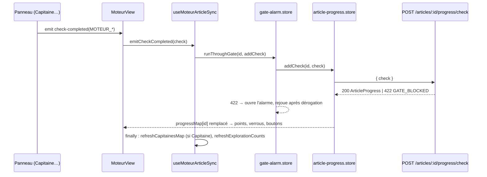

# Moteur — cadre commun

`MoteurView.vue` orchestre le Moteur : elle garde l'article choisi (`selectedArticle`), monte les sept panneaux et délègue le reste à cinq composables testables sans monter la vue. La progression vit dans `articles.completed_checks` (tableau de textes en PostgreSQL). Les décisions de mots-clés vivent dans `article_keywords`. Les explorations vivent dans les tables `*_explorations`.

| Composable | Rôle |
|---|---|
| `useMoteurTabs` | onglets, phases, onglet suivant, premier onglet utile, publication dans la barre de navigation |
| `useMoteurSoftGating` | verrous dérivés des étapes, déverrouillage de la Rédaction, verrou Discovery/Radar |
| `useFinalisationGating` | règle pure des quatre verrous et libellé des étapes manquantes |
| `useMoteurCrossTabState` | données en transit entre onglets, étapes Discovery et Radar |
| `useMoteurArticleSync` | écriture des étapes (via l'alarme des portes), carte des capitaines, compteurs, purge du cache externe |

Trajet d'une étape (exemple : Capitaine verrouillé) :

## Vue et sélection d'article
*Exigences : FR-MOT-ARTICLE-SELECTION, FR-MOT-FREE-NAV · Design : DESIGN-MOT-ARTICLE-SELECTION*

- **Code :** [`src/views/MoteurView.vue`](../src/views/MoteurView.vue) — `handleSelectArticle` : referme le bloc ouvert (`provideRecapRadioGroup`), `computeSmartTab` → `setActiveTab`, `resetCrossTabState`, `clearResults`, `articleKeywordsStore.$reset()` puis `fetchKeywordsMerge(id)`, `loadCachedResults(id)`, `radarRef.mergeFromRadarSource(id)` (lecture seule), `checkCacheForSeed(seed)` et `GET /radar-cache/check`. Watcher `selectedArticle.id` → `radarExplorationStore.setArticle(id)`. `onMounted` : `resetDiscovery`, `$reset` des stores d'article et du Radar, `loadData` (cocons, mots-clés du cocon, stratégie, capitaines, contexte stratégique).
- **Code :** [`src/components/moteur/MoteurContextRecap.vue`](../src/components/moteur/MoteurContextRecap.vue) — `toggleArticle` émet `select` (ou `null` au second clic) ; `SelectedArticle` ([`shared/types/article-progress.types.ts`](../shared/types/article-progress.types.ts)).
- **Montage des onglets :** `v-if="visitedTabs.x"` à la première visite, puis `v-show` : chaque panneau reste monté et garde son état.
- **Règles et décisions :**
  - `fetchKeywordsMerge` et non `fetchKeywords` : la fusion évite de perdre les cartes Capitaine créées pendant le chargement.
  - Le `$reset` avant la relecture évite d'afficher le Capitaine de l'article précédent.
  - La progression n'est **pas** relue à la sélection : `MoteurContextRecap` la charge une fois par article, si elle manque dans `progressMap`.
  - Un article de la stratégie sans ligne en base a l'id 0 : `emitCheckCompleted` et `radarExplorationStore.setArticle` l'ignorent.
  - Demande d'étape dépassée (FR-CAP-CHECK) : [`useMoteurArticleSync.ts`](../src/composables/moteur/useMoteurArticleSync.ts) garde la dernière intention par article et par étape (`latestIntent`, `recordIntent`). `emitCheckCompleted` passe `stillWanted` à `runThroughGate` ([`gate-alarm.store.ts`](../src/stores/ui/gate-alarm.store.ts)) ; `handleCheckRemoved` enregistre une intention plus récente. Un 422 `GATE_BLOCKED` arrivé après un retrait n'ouvre donc pas d'alarme. Raison : `POST /articles/:id/progress/check` juge la porte sur le capitaine **enregistré au moment où la requête arrive** (`evaluateArticleGate(id, gateId)`, sans mot-clé) ; déverrouiller pendant l'enregistrement du verrou lui faisait juger un capitaine vide. Tests : `tests/unit/composables/useMoteurArticleSync.test.ts`, `tests/unit/stores/gate-alarm.store.test.ts`.
  - `checkCacheForSeed` appelé ici agit sur l'instance de `useDiscoveryPanel` propre à la vue, pas sur celle du panneau Discovery (voir [Moteur — Discovery](13-discovery.md), conflit 36).
  - Risque suspecté (conflit 6) : `LieutenantsPanel` monté + `$reset` du store → `withdrawCheck` et `saveDecisions` sur un store vide.

## Onglets et phases
*Exigences : FR-MOT-PHASES, FR-MOT-FREE-NAV, FR-MOT-PHASE-TRANSITION · Design : DESIGN-MOT-PHASES, DESIGN-MOT-FREE-NAV, DESIGN-MOT-PHASE-TRANSITION*

- **Code :** [`src/composables/moteur/useMoteurTabs.ts`](../src/composables/moteur/useMoteurTabs.ts) — `TAB_IDS` (ordre canonique, `structure` entre `lieutenants` et `lexique`), `TAB_LABELS`, `phases` (`generer` « Générer », `valider` « Valider », `finaliser` « Finaliser »), `nextTab`, `isInGenererPhase`, `setActiveTab` (ignore un id inconnu), `computeSmartTab` (aucune étape → `capitaine` ; `MOTEUR_HN_LOCKED` → `lexique` ; `MOTEUR_LIEUTENANTS_LOCKED` → `structure` ; `MOTEUR_CAPITAINE_LOCKED` → `lieutenants`), `navGroups` (`locked` si pas d'article, ou Discovery/Radar si `!isDiscoveryAllowed`).
- **Code :** [`src/stores/ui/workflow-nav.store.ts`](../src/stores/ui/workflow-nav.store.ts) — `setWorkflowNav` / `clearWorkflowNav` (au démontage) ; [`src/components/shared/WorkflowNav.vue`](../src/components/shared/WorkflowNav.vue) — `clickItem` ignore un item `locked` (bouton `disabled`), `clickGroup` ouvre le premier item libre.
- **Code :** `MoteurView.vue` — `.bottom-nav` : `cta-next-tab` (« Continuer vers {TAB_LABELS[nextTab]} → ») ou `cta-redaction` ; copie locale de `TAB_LABELS`.
- **Règles et décisions :** jamais de navigation automatique vers `finalisation`. Les seules navigations sans clic sur un onglet viennent de `handleSelectArticle` (onglet utile) et des boutons « Envoyer au… ».
- **Tests :** [`tests/unit/composables/moteur/useMoteurTabs.test.ts`](../tests/unit/composables/moteur/useMoteurTabs.test.ts), [`tests/unit/components/moteur-smart-navigation.test.ts`](../tests/unit/components/moteur-smart-navigation.test.ts).

## Verrouillage doux et règle des quatre verrous
*Exigences : FR-MOT-SOFT-GATING, FR-FIN-LINK-REDACTION, FR-FIN-CHECK · Design : DESIGN-MOT-SOFT-GATING, DESIGN-FIN-LINK-REDACTION, DESIGN-FIN-CHECK*

- **Code :** [`src/composables/moteur/useMoteurSoftGating.ts`](../src/composables/moteur/useMoteurSoftGating.ts) — `hasCheck` lit `articleProgressStore.getProgress(id).completedChecks` ; `isCaptaineLocked`, `isLieutenantsLocked`, `isStructureLocked`, `isLexiqueValidated`, `finalisationUnlocked`, `finalisationButtonTitle`, `isDiscoveryAllowed` (faux si le mot-clé de l'article existe dans `keywordsStore.keywords` avec un `status` autre que `suggested`).
- **Code :** [`src/composables/moteur/useFinalisationGating.ts`](../src/composables/moteur/useFinalisationGating.ts) — `FinalisationChecks`, `isFinalisationUnlocked`, `finalisationMissingChecks`, `finalisationButtonTitle`.
- **Données :** lecture seule de `articles.completed_checks` (via `useArticleProgressStore`) et du statut des mots-clés du cocon (`useKeywordsStore`, `GET /keywords/:cocoon`).
- **Règles et décisions :**
  - Une seule règle pure, appelée par le pied de page (`useMoteurSoftGating`) et par `FinalisationPanel` (qui reconstruit la même entrée) : les deux boutons ne peuvent pas diverger.
  - Tout est `computed` : un `addCheck` bascule les boutons dans le même cycle de rendu.
  - `navigateToRedaction` ne revérifie pas la règle : seul l'attribut `disabled` protège.
  - Le message Lexique (« Verrouillez d'abord le Capitaine… ») est rendu par `MoteurView`, pas par le panneau.
- **Tests :** [`tests/unit/composables/finalisation-gating.test.ts`](../tests/unit/composables/finalisation-gating.test.ts), [`tests/unit/composables/moteur/useMoteurSoftGating.test.ts`](../tests/unit/composables/moteur/useMoteurSoftGating.test.ts), [`tests/browser-e2e/finalisation-gate.browser.test.ts`](../tests/browser-e2e/finalisation-gate.browser.test.ts).

## Étapes de progression
*Exigences : FR-MOT-CHECKS, FR-MOT-CHECKS-CONSTANTS, FR-MOT-WORKFLOW-GATING-DUAL, FR-DIS-CHECK, FR-FIN-CHECK · Design : DESIGN-MOT-CHECKS, DESIGN-MOT-CHECKS-CONSTANTS, DESIGN-MOT-WORKFLOW-GATING-DUAL, DESIGN-DIS-CHECK, DESIGN-FIN-CHECK*

- **Code :** [`shared/constants/workflow-checks.constants.ts`](../shared/constants/workflow-checks.constants.ts) — `MOTEUR_DISCOVERY_DONE`, `MOTEUR_RADAR_DONE`, `MOTEUR_CAPITAINE_LOCKED`, `MOTEUR_LIEUTENANTS_LOCKED`, `MOTEUR_HN_LOCKED`, `MOTEUR_LEXIQUE_VALIDATED`, `MOTEUR_CHECKS` (dans cet ordre), `CHECK_DEPENDENTS` + `checksRemovedWith` (Capitaine → Structure, Lieutenants → Structure), `REDACTION_DRAFT_ACCEPTED` hors `MOTEUR_CHECKS`, `ALL_WORKFLOW_CHECKS`.
- **Code :** [`shared/schemas/article-progress.schema.ts`](../shared/schemas/article-progress.schema.ts) — `writeCheckRegex` (`moteur:<snake_case>` ou `redaction:draft_accepted`), `readCheckRegex` (tolère `cerveau:*`, `redaction:*`), `addCheckSchema`, `articleProgressSchema`.
- **API :**
  - `GET /api/articles/:id/progress` → `{ phase, completedChecks, checkTimestamps }`.
  - `POST /api/articles/:id/progress/check` `{ check }` → 400 si format invalide ; si `CHECK_GATES[check]` existe, `evaluateArticleGate` ; refus → 422 `GATE_BLOCKED` (`respondGateBlocked`) ; sinon `addArticleCheck` → `ArticleProgress`.
  - `POST /api/articles/:id/progress/uncheck` `{ check }` → `removeArticleChecks(id, checksRemovedWith(check))`.
  - `PUT /api/articles/:id/progress` → remplace phase et étapes ; chaque étape gardée **nouvelle** passe par sa porte.
  Routes dans [`server/routes/articles.routes.ts`](../server/routes/articles.routes.ts).
- **Code serveur :** [`server/services/infra/data.service.ts`](../server/services/infra/data.service.ts) — `getArticleProgress`, `addArticleCheck` (ajout idempotent + horodatage dans `check_timestamps`), `removeArticleChecks`, `saveArticleProgress`. [`server/services/gates/gate.service.ts`](../server/services/gates/gate.service.ts) — `CHECK_GATES` (`captain-lock`, `lieutenants-lock`, `hn-lock`, `lexique-lock`, `draft`), `evaluateArticleGate` (détail : [Infrastructure transversale](20-infrastructure.md)).
- **Code client :** [`src/stores/article/article-progress.store.ts`](../src/stores/article/article-progress.store.ts) — `progressMap` (50 articles au plus ; `evictOldest` retire les **plus petits identifiants**, pas les plus anciennement consultés, car `Object.keys` range les clés numériques par ordre croissant), `fetchProgress`, `addCheck`, `removeCheck` (remplacent l'entrée par la réponse, pas de mise à jour optimiste), `getProgress`. [`src/composables/moteur/useMoteurArticleSync.ts`](../src/composables/moteur/useMoteurArticleSync.ts) — `emitCheckCompleted` (via `gateAlarm.runThroughGate` ; refus répété → `useNotify().warning(« Étape toujours refusée : … »)`), `handleCheckRemoved`. [`src/stores/ui/gate-alarm.store.ts`](../src/stores/ui/gate-alarm.store.ts) — `runThroughGate`, `isGateBlocked`.
- **Producteurs :**

| Étape | Émetteur |
|---|---|
| `MOTEUR_DISCOVERY_DONE` | `useMoteurCrossTabState.handleSendToRadar` |
| `MOTEUR_RADAR_DONE` | `useMoteurCrossTabState.handleRadarScanned` (événement `scanned` de `RadarPanel`) |
| `MOTEUR_CAPITAINE_LOCKED` | `CaptainPanel.vue` (verrouillage, déverrouillage, réconciliation) |
| `MOTEUR_LIEUTENANTS_LOCKED` | `LieutenantsPanel.vue` (`requestCheck` / `withdrawCheck`, après `saveDecisions` et vérification de la porte) |
| `MOTEUR_HN_LOCKED` | `StructureHnPanel.vue` ; retrait aussi par `LieutenantsPanel.invalidateValidatedStructure` |
| `MOTEUR_LEXIQUE_VALIDATED` | `LexiquePanel.vue` (`requestLexiqueGate` / `withdrawLexiqueCheck`) |
| les six (mode automatique) | [`scripts/auto-article/phases/moteur-explorer.ts`](../scripts/auto-article/phases/moteur-explorer.ts), `moteur-valider.ts` |

- **Consommateurs :** [`src/components/moteur/ProgressDots.vue`](../src/components/moteur/ProgressDots.vue) (`PHASE_GROUPS` 2 + 4, ne compte que `MOTEUR_CHECKS`), `useMoteurSoftGating`, `useMoteurTabs.computeSmartTab`, `FinalisationPanel`, `StructureHnPanel`.
- **Règles et décisions :**
  - Toujours passer par les constantes. [`tests/unit/coherence/completed-checks.test.ts`](../tests/unit/coherence/completed-checks.test.ts) refuse les littéraux hérités.
  - Le serveur valide le **format**, pas l'appartenance au catalogue (conflit 7).
  - L'étape est demandée **après** l'enregistrement de la décision : la porte lit la base, pas l'écran.
  - Pas d'étape Finalisation : elle ferait doublon avec les quatre verrous.

## Réconciliation et verrou dérivé
*Exigences : FR-MOT-CHECK-RECONCILIATION, FR-MOT-LOCK-DERIVED · Design : DESIGN-MOT-CHECK-RECONCILIATION, DESIGN-MOT-LOCK-DERIVED*

- **Code :** `CaptainPanel.vue` — `onMounted` (réconciliation), `isLocked` (store si l'article correspond, sinon prop `initialLocked` = étape enregistrée) ; `LieutenantsPanel.vue` — premier passage du watcher sur `lieutenantsCheckActive` (`isFirstRun`), `hasAnyLockedLieutenant` ; `LexiquePanel.vue` — premier passage du watcher sur `isLocked`.
- **Règles et décisions :** la réconciliation passe par `check` / `uncheck`, jamais par une écriture directe. Elle ne tourne qu'au premier montage de chaque panneau. `StructureHnPanel` ne réconcilie pas. Le repli sur `initialLocked` empêche un faux « non verrouillé » pendant la relecture.

## Transferts entre onglets
*Exigences : FR-MOT-CROSS-TAB-PAYLOAD, FR-MOT-BASKET-DEPRECATED · Design : DESIGN-MOT-CROSS-TAB-PAYLOAD, DESIGN-MOT-BASKET-DEPRECATED*

- **Code :** [`src/composables/moteur/useMoteurCrossTabState.ts`](../src/composables/moteur/useMoteurCrossTabState.ts) — `discoveryRadarKeywords`, `radarScanResult`, `radarCacheStatus`, `radarCardsForCaptain`, `captainRootKeywords`, `effectiveRootKeywords` (envoi explicite, sinon `rootKeywords` du store), `selectedLieutenantsForLexique` (sélection locale, sinon `lieutenants` du store), `handleCardsSelected` (dédoublonnage : la carte avec métriques gagne), `handleSendToLieutenants`, `handleLieutenantsUpdated`, `handleKeywordsCleared`, `resetCrossTabState`.
- **Données :** `radar_explorations.generated_keywords` (JSONB) remplace l'ancien panier ; [`src/stores/article/radar-exploration.store.ts`](../src/stores/article/radar-exploration.store.ts) (`AUTHORITY: radar_explorations`).
- **Règles et décisions :** chaque transfert naît d'un événement de panneau déclenché par un clic. Le panier mémoire (`moteur-basket.store`, `BasketStrip`, `BasketFloatingPanel`) n'existe plus.
- **Tests :** [`tests/unit/composables/moteur/useMoteurCrossTabState.test.ts`](../tests/unit/composables/moteur/useMoteurCrossTabState.test.ts).

## Barre des articles
*Exigences : FR-MOT-RECAP-PUBLISHED, FR-MOT-RECAP-LOCK-SYNC, FR-MOT-CANNIBALIZATION, FR-MOT-DISPLAY-FROM-STORE · Design : DESIGN-MOT-RECAP-PUBLISHED, DESIGN-MOT-RECAP-LOCK-SYNC, DESIGN-MOT-CANNIBALIZATION, DESIGN-MOT-DISPLAY-FROM-STORE*

- **Code :** [`src/utils/recap-articles.ts`](../src/utils/recap-articles.ts) — `buildRecapArticles(proposed, capitaines)` : `ProposedArticle[]` de la stratégie → `Article[]`, `id = dbId`, `captainKeywordLocked = capitaines[dbId] || null`. `MoteurView.vue` — `suggestedArticlesForRecap`, `publishedArticles = cocoon.publishedArticles`.
- **Code :** `MoteurContextRecap.vue` — `suggestedGroups` / `publishedGroups` (par `TYPE_ORDER`), `unifiedCapitainesMap`, `getDisplayedKeyword` (store pour l'article choisi), `getChecks` (lit `progressMap`), watcher de chargement de la progression, `hasCannibalization` ([`src/composables/moteur/useCannibalizationDetection.ts`](../src/composables/moteur/useCannibalizationDetection.ts), clé `articleId`, casse ignorée).
- **Code serveur :** `data.service.ts` — `loadArticlesDb` et `getSilos` dérivent `publishedArticles` (`phase IN ('redaction','published')`) ; [`shared/utils/article-phase.ts`](../shared/utils/article-phase.ts) — `nextArticlePhase` (ne recule jamais), appelée par `updateArticleStatus` (`publié`) et [`server/services/article/article-content.service.ts`](../server/services/article/article-content.service.ts) (contenu non vide).
- **API :** `GET /api/cocoons` (cocons + `publishedArticles`) ; `GET /api/strategy/cocoon/:slug` (propositions) ; `GET /api/cocoons/:cocoonName/capitaines` → `Record<articleId, capitaine>` à partir de `article_keywords.capitaine` non vide ([`server/routes/cocoons.routes.ts`](../server/routes/cocoons.routes.ts), `getArticleKeywordsByCocoon`).
- **Règles et décisions :**
  - `refreshCapitainesMap` est rappelée après chaque ajout ou retrait de `MOTEUR_CAPITAINE_LOCKED`. Le Capitaine enregistre ses décisions **avant** d'émettre l'étape, donc la relecture voit le nouvel état.
  - Chaîne vide = absence.
  - La liste « suggérés » vient de la stratégie, sans filtre de phase : chevauchement possible (conflit 4).
- **Tests :** [`tests/unit/utils/recap-articles.test.ts`](../tests/unit/utils/recap-articles.test.ts), [`tests/integration/data.service.test.ts`](../tests/integration/data.service.test.ts), [`tests/unit/shared/article-phase.test.ts`](../tests/unit/shared/article-phase.test.ts).

## Barre « Résultats déjà calculés »
*Exigences : FR-MOT-EXPLORATION-COUNTS, FR-MOT-CACHE-PANEL-COUNT, FR-MOT-EXTERNAL-CACHE-CLEAR · Design : DESIGN-MOT-EXPLORATION-COUNTS, DESIGN-MOT-CACHE-PANEL-COUNT, DESIGN-MOT-EXTERNAL-CACHE-CLEAR*

- **Code :** [`src/utils/tab-cache-entries.ts`](../src/utils/tab-cache-entries.ts) — `buildTabCacheEntries(counts, ui)` : quatre entrées ; `dbCount` = compteur serveur, `cacheCount` = 1 pour le Radar seulement (scan en mémoire hors cache Radar), 0 ailleurs ; infobulles. [`src/components/moteur/TabCachePanel.vue`](../src/components/moteur/TabCachePanel.vue) — puces, bouton « Vider le cache » si `cacheTotal > 0`. [`src/composables/moteur/useTabLoadPrompt.ts`](../src/composables/moteur/useTabLoadPrompt.ts) + [`src/components/moteur/TabLoadPrompt.vue`](../src/components/moteur/TabLoadPrompt.vue) — invite par onglet (Radar : `mergeFromRadarSource` ; Capitaine et Lieutenants : `fetchKeywordsMerge` ; Lexique : `mergeFromDb`), fermeture remise à zéro à chaque changement d'onglet ou d'article.
- **API :** `GET /api/articles/:id/explorations/counts` → `{ radar, captain, lieutenants, paa, lexique, local, contentGap }` en une requête `UNION ALL` (radar = `generated_keywords` + `scan_result.cards`) ; `DELETE /api/articles/:id/external-cache` → `{ cleared }`. Routes dans [`server/routes/article-explorations.routes.ts`](../server/routes/article-explorations.routes.ts).
- **Données :** `radar_explorations`, `captain_explorations`, `lieutenant_explorations`, `paa_explorations`, `lexique_explorations`, `keyword_metrics.local_analysis` / `content_gap_analysis` ; purge : `external_api_cache` (types `autocomplete`, `autocomplete-intent`, `paa`, `serp`, `validate`, préfixe = slug du Capitaine).
- **Règles et décisions :** le compteur dit « enregistré », pas « verrouillé ». `refreshExplorationCounts` tourne au changement d'article et après chaque étape. La purge vise des types plus écrits (conflit 15).
- **Tests :** [`tests/unit/utils/tab-cache-entries.test.ts`](../tests/unit/utils/tab-cache-entries.test.ts), [`tests/unit/routes/article-explorations.routes.test.ts`](../tests/unit/routes/article-explorations.routes.test.ts).

## Hydratation des explorations
*Exigences : FR-MOT-EXPLORATIONS-HYDRATATION · Design : DESIGN-MOT-EXPLORATIONS-HYDRATATION*

- **Code :** `data.service.ts` — `getArticleKeywords(id)` : sans ligne `article_keywords` mais avec des explorations, renvoie un objet synthétique (`capitaine: ''`, `richCaptain.status: 'suggested'`, explorations attachées) ; `null` si rien n'existe.
- **API :** `GET /api/articles/:id/keywords` (contrat `articleKeywordsContract`).
- **Règles et décisions :** `status: 'suggested'` dans le cas synthétique, sinon les verrous basculeraient à tort.

## Coûts et caches
*Exigences : FR-MOT-NO-AUTO-ACTION, FR-MOT-CACHE-CASCADE, FR-MOT-RAW-KPIS · Design : DESIGN-MOT-NO-AUTO-ACTION, DESIGN-MOT-CACHE-CASCADE, DESIGN-MOT-RAW-KPIS*

- **Code :** [`server/db/cache-helpers.ts`](../server/db/cache-helpers.ts) — `getCached`, `setCached`, `deleteCached`, `getOrFetch` (centralisé) sur `external_api_cache (cache_type, cache_key, data, expires_at)` ; purge horaire des entrées expirées dans `server/index.ts`.
- **Durées :** `suggest` 1 h ([`server/services/keyword/suggest.service.ts`](../server/services/keyword/suggest.service.ts)) ; `keyword-discovery` 24 h ([`server/services/keyword/keyword-discovery.service.ts`](../server/services/keyword/keyword-discovery.service.ts)) ; `dataforseo` 7 j (`DATAFORSEO_CACHE_TTL_MS`) ; `keyword_metrics` réutilisée par le scan Capitaine si moins de 7 jours (`FRESHNESS_DAYS`, [`server/routes/keyword-scan.routes.ts`](../server/routes/keyword-scan.routes.ts)).
- **Exception déclarée :** `CaptainPanel.vue` — watcher `[active, selectedArticle.id]` → `loadCaptainPaaJudgments` → `POST /api/articles/:id/captain/judge-paa` ([`server/services/keyword/captain-paa-judge.service.ts`](../server/services/keyword/captain-paa-judge.service.ts), Claude Haiku) ; mémoire de session `paaJudgmentsByArticle` dans `article-keywords.store` (non vidée par `$reset`).
- **Écart non déclaré (Lexique) :** `LexiquePanel.vue` — le watcher de restauration (`isCaptaineLocked`, `captainKeyword`, `serpExists`, `immediate`) appelle `hydrateFromDb` puis, sans extraction en mémoire, `fetchTfidf` ; le watcher `watch(tfidfResult)` appelle alors `generateLexiqueUpfront` (`POST /api/keywords/:keyword/ai-lexique-upfront`, sans cache serveur) si `iaRecommendations` est vide. Détail : [Moteur — Lexique](15-lieutenants-structure-lexique.md).
- **Affichage :** [`shared/score/format.ts`](../shared/score/format.ts) — `formatVolume`, `formatCpc`, `formatKd`, `formatPercent` renvoient « — » pour `null`.
- **Règles et décisions :** ouvrir un onglet doit se limiter à des lectures en base ; deux écarts existent (jugement PAA du Capitaine, déclaré ; analyse IA du Lexique, non déclarée — conflits 13 et 13 bis). Les appels d'IA de Discovery ne passent par aucun cache (conflit 16).

## Contexte donné à l'IA
*Exigences : FR-MOT-PAINPOINT-INJECTION, FR-MOT-STRATEGY-INJECTION, FR-PAIN-IMMUTABLE-AFTER-CEREVEAU · Design : DESIGN-MOT-PAINPOINT-INJECTION, DESIGN-MOT-STRATEGY-INJECTION, DESIGN-MOT-PAIN-IMMUTABLE-AFTER-CEREVEAU*

- **Code :** [`server/services/queries/article-pain-point.service.ts`](../server/services/queries/article-pain-point.service.ts) — `getArticlePainPoint` (lit `articles.pain_point`, `PAIN_POINT_FALLBACK = '(non défini)'`, ne lève jamais). [`server/utils/prompt-loader.ts`](../server/utils/prompt-loader.ts) — `loadPrompt(name, vars, { cocoonSlug })`, `buildCocoonStrategyBlock`, `PROMPT_GLOBALS` (`strategy_context` vide si pas de stratégie).
- **Données :** `articles.pain_point` ; stratégie du cocon via `getCocoonStrategy`.
- **Prompts :** `{{strategy_context}}` cité par `capitaine-ai-panel.md`, `lieutenants-hn-structure.md`, `lexique-ai-panel.md`, `lexique-analysis-upfront.md` ; absent de `propose-lieutenants.md`, `lexique-suggest.md`, `intent-keywords.md` (dans [`server/prompts/`](../server/prompts/)). Sans repère, `loadPrompt` ajoute quand même la stratégie en fin de prompt dès qu'il reçoit `cocoonSlug` : c'est l'envoi de `cocoonSlug` qui décide.
- **Qui envoie `cocoonSlug` :** `useLieutenantsIa` (`propose-lieutenants`), `useStructureHn` (`ai-hn-structure`), `useLexiqueIa` (`ai-lexique-upfront`), la route `lexique-suggest` (slug tiré de `cocoonName`) ; **pas** `CaptainPanel` (`ai-panel`), ni `useDiscoveryPanel` (`radar/generate`) ; les routes `relevance-score` et `analyze-discovery` bâtissent leur prompt sans stratégie.
- **Règles et décisions :** le contexte s'injecte au chargement du prompt, jamais en modifiant le `.md`. Les écarts de FR-MOT-STRATEGY-INJECTION sont donc l'avis du Capitaine et Discovery (conflit 17). La douleur n'a pas d'éditeur dans `src/components/moteur/`.

## Autres contraintes du Moteur
*Exigences : NFR-MOT-LEXIQUE-DECOUPLAGE, NFR-MOT-SCHEMA-KEYWORD-DECOMPOSITION, FR-API-VOCABULAIRE-SCAN, FR-UI-VOCABULAIRE-VERROUILLER, FR-MOT-MODE-BIMODAL · Design : DESIGN-MOT-LEXIQUE-DECOUPLAGE, DESIGN-MOT-SCHEMA-KEYWORD-DECOMPOSITION, DESIGN-MOT-API-VOCABULAIRE-SCAN, DESIGN-UI-VOCABULAIRE-VERROUILLER, DESIGN-MOT-MODE-BIMODAL*

- **Découplage :** [`tests/unit/architecture/decouplage-lieutenants-lexique.test.ts`](../tests/unit/architecture/decouplage-lieutenants-lexique.test.ts) interdit tout import croisé entre les services Lexique et Lieutenants (détail : [Moteur — Lieutenants](15-lieutenants-structure-lexique.md) et [Moteur — Lexique](15-lieutenants-structure-lexique.md)).
- **Données de mot-clé :** tables `keyword_metrics`, `keyword_serp_results`, `keyword_serp_scrapes`, `keyword_paa_questions`, `keyword_autocomplete` ([`server/db/schema.sql`](../server/db/schema.sql)).
- **Vocabulaire :** `POST /api/keywords/:keyword/scan` ([`server/routes/keyword-scan.routes.ts`](../server/routes/keyword-scan.routes.ts)) ; pas de `/keywords/:keyword/validate` ; `POST /api/keywords/validate-pain` conservée.
- **Mode :** prop `mode: 'workflow' | 'libre'` sur `DiscoveryPanel`, `RadarPanel`, `CaptainPanel`, `LieutenantsPanel`, `StructureHnPanel` ; absente de `LexiquePanel`. `MoteurView` monte tout en `workflow`, aucune autre vue ne monte ces panneaux.

---
