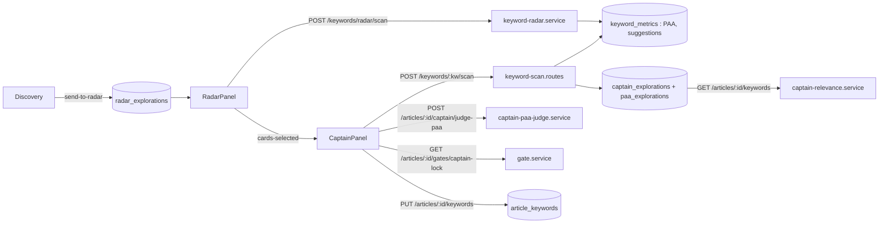

# Moteur — Radar et Capitaine

Les deux onglets vivent dans [`MoteurView.vue`](../src/views/MoteurView.vue) (montage paresseux : un onglet n'est créé qu'à sa première visite, puis gardé en `v-show`). Ils partagent une même carte ([`RadarKeywordCard.vue`](../src/components/intent/RadarKeywordCard.vue)), deux calculs de score ([`shared/scoring-kpi.ts`](../shared/scoring-kpi.ts) pour le marché, [`shared/scoring.ts`](../shared/scoring.ts) pour la pertinence) et la table `keyword_metrics` (mesures DataForSEO et Google, communes à tous les articles).



Règle transversale (`.claude/CLAUDE.md` §2.0, [Contrats d'affichage](09-contrats-affichage.md)) : une valeur affichée et utilisée pour trier est produite par la même expression. Au Radar, l'anneau et le tri lisent `computeKpiScore(card.kpis, niveau).total`. Au Capitaine, l'anneau lit `card.relevanceScore.total` et le tri `originalCard.relevanceScore.total` (écart assumé, cf. Verrou et intégrité).

## La carte Radar
*Exigences : FR-RAD-SCORE-RING-TOOLTIP, FR-RAD-PAA-TREE, FR-RAD-CARD-CHEVRON-TOGGLE, FR-RAD-SCORING-BIMODAL, FR-CAP-SCORING-BIMODAL, FR-CAP-PAA-BADGE-SINGLE · Design : DESIGN-RAD-SCORE-RING-TOOLTIP, DESIGN-RAD-PAA-TREE, DESIGN-RAD-CARD-CHEVRON-TOGGLE, DESIGN-RAD-SCORING-BIMODAL, DESIGN-CAP-SCORING-BIMODAL, DESIGN-CAP-PAA-BADGE-SINGLE*

Une carte matérialise un mot-clé candidat. Un seul composant d'affichage sert les deux onglets ; chaque onglet l'entoure d'une **enveloppe** (composant qui ajoute ses contrôles autour de la carte sans la dupliquer) :

```
Radar      RadarPanel → DouleurScannerResults → RadarCardCheckable → RadarKeywordCard (displayMode « kpi »)
Capitaine  CaptainPanel → CaptainRadarList → CaptainInteractiveWords → RadarCardLockable → RadarKeywordCard (displayMode « relevance »)
Carte      RadarKeywordCard → KeywordWords (Capitaine, mot-clé d'au moins 3 mots) · RadarCardScoreRing · RadarCardPaaTree
```

- **Code :**
  - [`RadarKeywordCard.vue`](../src/components/intent/RadarKeywordCard.vue) — props `card: RadarCard`, `displayMode: 'kpi' | 'relevance'` (défaut `kpi`), `articleLevel` (défaut `intermediaire`), `interactiveWords`, `modifiers`, `manualTagMode`, `articlePainPoint`, `cardContext: 'radar' | 'capitaine'` (défaut `radar`), `paaJudgment`, `paaJudgmentLoading` ; émet `word-toggle`, `modifier-untag`, `modifier-cycle`. Calculs : `kpiBreakdown`, `displayedScore`, `hasScore`, `relevanceMissingReason`, `scoreLabel` (« Score KPI » / « Score Pertinence »), `scoreColor` (teinte `hsl(score × 1,2 ; 70 % ; 45 %)` du rouge au vert, gris sans score), `scoreDashoffset`, `breakdownRows`, `isOffPain` (seuil 35), `paaTree`, `findJudgmentForPaa`, `matchLabel`, `badgeClass`, `matchTitle`, `paaDisplayValue`, `handleChevronClick`.
  - [`RadarCardCheckable.vue`](../src/components/intent/RadarCardCheckable.vue) — enveloppe du Radar : case à cocher (`data-testid="radar-card-checkbox"`, libellé en `@click.stop`), émet `update:checked`. Ne transmet que `card`, `displayMode`, `articleLevel`, `modifiers`.
  - [`RadarCardLockable.vue`](../src/components/intent/RadarCardLockable.vue) — enveloppe du Capitaine : colonne d'actions, toutes en `@click.stop` : cadenas (`radar-card-lock`, émet `update:locked`) ; étiquettes (`radar-card-tag-toggle`, bascule `manualTagMode`, état local) ; recalcul (`radar-card-recompute-relevance`, affiché en mode `relevance`, grisé pendant une étude ou si `articlePainPoint` fait moins de 10 caractères, émet `recompute-relevance`) ; voile « Validation… » quand `validating`. Transmet `articlePainPoint`, pas `cardContext` ni `paaJudgment`.
  - [`CaptainInteractiveWords.vue`](../src/components/moteur/CaptainInteractiveWords.vue) — prépare la carte du Capitaine : mots cliquables tirés de `originalCard.keyword` s'il a au moins 3 mots (`lockedLeftWords: 2`), `isLocked` quand `originalCard.keyword === lockedKeyword`, `validating` tant que `pendingVariants` n'est pas vide, étiquettes lues dans `useKeywordModifiersStore.getEffective(articleId, …)`.
  - [`RadarCardScoreRing.vue`](../src/components/intent/radar-card/RadarCardScoreRing.vue) — anneau SVG de 68 px, valeur ou « — », libellé sous l'anneau ; info-bulle au survol ; `@click.stop`.
  - [`RadarCardPaaTree.vue`](../src/components/intent/radar-card/RadarCardPaaTree.vue) — arbre à deux niveaux, émet `toggle-children` et `toggle-answer`.
  - [`KeywordWords.vue`](../src/components/intent/KeywordWords.vue) — mots du mot-clé, cliquables au Capitaine.
- **Deux modes de score** (`displayMode`) :

| Mode | Onglet | Score affiché | Calculé | Absent (« — ») quand |
|---|---|---|---|---|
| `kpi` | Radar | `computeKpiScore(card.kpis, articleLevel).total` | à l'écran, à chaque rendu | `card.kpis === null` |
| `relevance` | Capitaine | `card.relevanceScore.total` | par le serveur (étude ou relecture) | pas de point de douleur, pas de PAA ou de suggestions en base, carte venue du Radar |

- **Deux contextes de carte** (`cardContext`) : `radar` → badges PAA lexicaux et indicateur « PAA » en points (`paaWeightedScore`, « 2.5 pts ») ; `capitaine` avec `paaJudgment` → une pastille par question (`pertinent`, `partiel`, `hors-sujet`, justification en info-bulle) et indicateur « PAA » en `overallPaaScore/100` (« ... » pendant le calcul). Sans jugement, retour silencieux aux badges lexicaux.
- **Anatomie :**
  - En-tête sur une ligne : chevron « ▶ », mot-clé (`KeywordWords` si `interactiveWords`, sinon mots colorés par étiquette), icônes d'intention (`kpis.intentTypes`, libellé en info-bulle), indicateurs « vol », « KD », « CPC », « PAA » (`formatVolume`, `formatKd`, `formatCpc` de [`shared/score/`](../shared/score/index.ts)), anneau. Sans `kpis`, ni icônes ni indicateurs.
  - Info-bulle de l'anneau : une ligne par composante (libellé, poids, description, valeur sur 100), puis « Total ». Sans score, un message selon la raison : `no-pain`, `missing-paa`, `missing-autocomplete`, `no-signals`, `long-tail`, sinon « Score Pertinence indisponible. » (textes dans [spec/08-capitaine.md](../spec/08-capitaine.md)).
  - Corps, ouvert par le chevron seul : raison du mot-clé en italique, « PAA en cache » si `card.cachedPaa`, arbre des questions (badge, similarité en % si `semanticScore`, « (n) » sous-questions ; le chevron d'une question déplie ses enfants, un clic sur la question déplie la réponse de Google), « Aucune PAA trouvée » sans question. Bordure verte pour une question « total exact », grise pour « total ».
- **Mots cliquables et étiquettes :**
  - `KeywordWords` : un clic retire ou remet un mot (`update:activeIndices`) ; les `lockedLeftWords` premiers mots significatifs (hors `FRENCH_STOPWORDS`) ne sont pas cliquables ; un retrait qui laisserait moins de 2 mots significatifs actifs est ignoré.
  - Étiquettes `local` / `persona` : détection par `detectModifiers` ([`shared/utils/keyword-modifiers.ts`](../shared/utils/keyword-modifiers.ts) : ville ou région de `FRENCH_CITIES_SET` → `local` ; mot qui suit « pour », déterminant sauté → `persona`), surchargée par [`useKeywordModifiersStore`](../src/stores/article/keyword-modifiers.store.ts) (mémoire seule, clé `articleId::mot-clé en minuscules` ; le Radar utilise `articleId` nul). En mode étiquettes, ou par Alt+clic, un clic fait tourner `null → local → persona → null` (`handleModifierClick`). Ce cycle n'existe que dans `KeywordWords`, donc sur un mot-clé d'au moins 3 mots, hors mots sanctuarisés ; ailleurs les mots sont de simples `span` colorés et le bouton étiquettes n'a pas d'effet.
- **Clics :** seul le chevron déplie le corps (`stopPropagation`). L'anneau, la case, le cadenas et les boutons arrêtent le clic. Le reste de la carte laisse le clic remonter : au Capitaine, il sélectionne la carte et ouvre le panneau latéral.
- **Règles et décisions :**
  - Un seul score par carte, jamais de repli sur `combinedScore` (score hérité qui mélangeait marché et pertinence). Pas de mode « mixte ».
  - Raison d'absence : `card.relevanceUnavailableReason` (serveur) d'abord, sinon heuristique écran (`long-tail` sans `kpis`, `no-pain` sous 10 caractères, sinon `no-signals`).
  - `isOffPain` grise une carte dont `kpis.painAlignmentScore` est sous 35. Le scan ne produit plus ce signal : seules les cartes d'anciens scans sont concernées.
  - Pastilles de jugement IA : seulement si `cardContext === 'capitaine'` **et** `paaJudgment` fourni. En mode workflow, `RadarCardLockable` ne transmet ni l'un ni l'autre : la pastille n'apparaît que dans l'ancien mode libre de `CaptainPanel` (dette, `FR-CAP-PAA-BADGE-SINGLE` non tenue).
  - Les lignes de repli sur `scoreBreakdown` de `breakdownRows` ne s'affichent jamais : l'info-bulle ne montre des lignes qu'avec un score, et un `relevanceScore` porte toujours son `breakdown` (contrat).
  - Les étiquettes ne sont lues par aucune formule, bien que l'info-bulle d'un mot dise « peu pris en compte dans les KPI ».
  - Un troisième contexte d'affichage se fait par une nouvelle enveloppe autour de `RadarKeywordCard`, pas par une copie.
- **Tests :** [`tests/unit/components/`](../tests/unit/components/) — `radar-keyword-card-display-mode`, `-score-separation`, `-relevance-tooltip`, `-paa-badge-capitaine`, `-chevron-toggle`, `-click-propagation`, `-interactions`, `-architecture`, `-visual`, `radar-card-checkable`, `radar-card-lockable`, `radar-card-lockable-recompute`, `radar-card-paa-tree`, `keyword-words`, `captain-interactive-words` ; [`tests/unit/shared/keyword-modifiers.test.ts`](../tests/unit/shared/keyword-modifiers.test.ts).

## Score Marché et Score Pertinence
*Exigences : FR-RAD-SCORING-BIMODAL, FR-RAD-MARKET-COMPUTED-LIVE, FR-RAD-MARKET-LEVEL-AWARE, FR-CAP-SCORING-BIMODAL, FR-CAP-RELEVANCE-INTENT-SIGNAL, FR-INFRA-KPI-SCORING-NULLSAFE · Design : DESIGN-RAD-SCORING-BIMODAL, DESIGN-RAD-MARKET-COMPUTED-LIVE, DESIGN-CAP-SCORING-BIMODAL, DESIGN-CAP-RELEVANCE-INTENT-SIGNAL*

Deux scores sur 100, indépendants, un par onglet :

| Score | Question | Dépend de l'article ? | Affiché | Calcul |
|---|---|---|---|---|
| **Marché** (`MarketScoreResult`) | « ce mot-clé pèse-t-il en SEO ? » | seulement par les seuils du niveau | carte du Radar (« Score KPI ») | `computeKpiScore` / `computeMarketScore` ([`shared/scoring-kpi.ts`](../shared/scoring-kpi.ts)) |
| **Pertinence** (`RelevanceScoreResult`) | « ce mot-clé sert-il la douleur de cet article ? » | oui : point de douleur, intention attendue, racines | carte du Capitaine (« Score Pertinence ») | `computeRelevanceScore` ([`shared/scoring.ts`](../shared/scoring.ts)) |

Un mot-clé réutilisé pour un autre article garde son Score Marché (au niveau près) mais reçoit un autre Score Pertinence. Exemple : une longue traîne peu cherchée peut avoir un Score Marché ORANGE et un Score Pertinence GO ; la mettre de côté sur le seul critère du marché ferait perdre un bon angle éditorial.

Types dans [`shared/types/scoring.types.ts`](../shared/types/scoring.types.ts) : `ScoreVerdict` (`GO` · `ORANGE` · `NOGO`), `SCORE_VERDICT_THRESHOLDS` et `verdictFromScore` (≥ 70 GO, ≥ 40 ORANGE, sinon NOGO, communs aux deux scores), `RelevanceScoreInput`, `RelevanceScoreBreakdown`, `RelevanceScoreLiveResult` (`total` nul ⇒ `unavailableReason` renseigné), `RelevanceUnavailableReason`, `INTENT_MISMATCH_MALUS`, `PainIntentExpected`. Ces verdicts sont indicatifs ; le verdict qui compte pour la porte du Capitaine est `computeVerdict` (`GO` · `ORANGE` · `NO-GO` · `GRAY`, cf. Capitaine — étude).

### Score Marché

`computeKpiScore(kpis, level)` note chaque indicateur avec `scoreKpi` ([`shared/kpi-scoring.ts`](../shared/kpi-scoring.ts)), convertit la couleur en note (vert et bonus 100, orange 50, rouge 0, neutre 50), puis fait la moyenne pondérée. `computeMarketScore` y ajoute `verdictFromScore`.

| Composante | Poids | Entrée (`RadarKeywordKpis`) | Notation |
|---|---|---|---|
| Volume | 30 % | `searchVolume` | vert ≥ seuil vert, orange ≥ seuil orange, sinon rouge |
| KD | 20 % | `difficulty` | vert ≤ seuil vert, orange ≤ seuil orange, sinon rouge |
| Intent | 15 % | `intentValueToPseudoScore(intentTypes, intentProbability)` : valeur de l'intention la plus forte (commercial 1, transactionnel 0,8, informationnel 0,5, navigationnel 0,2) × probabilité (1 si inconnue) ; 0 sans intention | vert ≥ 0,7, orange ≥ 0,4, sinon rouge (tous niveaux) |
| PAA | 10 % | `paaWeightedScore` : 2 points par question « total exact », 1 « total », 0,5 « partiel exact », 0,25 « partiel » (`computePaaWeightedScore`, [`intent-scan.service.ts`](../server/services/intent/intent-scan.service.ts)) | vert ≥ seuil vert, orange ≥ seuil orange, sinon rouge |
| Autocomplete | 10 % | `autocompleteMatchCount`, lu comme une **position** | 0 → rouge (« Non trouvé ») ; ≤ seuil vert → vert ; ≤ seuil orange → orange ; sinon rouge |
| CPC | 10 % | `cpc` | > 2 € → bonus (100), sinon neutre (50) |

Seuils (`THRESHOLDS`, `getThresholds`) :

| Indicateur | Pilier | Intermédiaire | Spécifique |
|---|---|---|---|
| Volume vert / orange | ≥ 1000 / ≥ 200 | ≥ 200 / ≥ 50 | ≥ 30 / ≥ 5 |
| KD vert / orange | ≤ 40 / ≤ 65 | ≤ 30 / ≤ 50 | ≤ 20 / ≤ 40 |
| PAA vert / orange (points) | ≥ 3 / ≥ 1 | ≥ 2 / ≥ 0,5 | ≥ 1 / ≥ 0,25 |
| Autocomplete vert / orange (position) | ≤ 3 / ≤ 6 | ≤ 4 / ≤ 7 | ≤ 5 / ≤ 8 |
| Intent vert / orange | ≥ 0,7 / ≥ 0,4 | idem | idem |
| CPC bonus | > 2 € | idem | idem |

- **Absence** (`FR-INFRA-KPI-SCORING-NULLSAFE`) : `scoreKpi(null)` rend un KPI neutre libellé « — ». Les composantes dont `rawLabel === '—'` sont retirées et le total est divisé par la somme des poids restants. Les poids font 95 % au total, mais cette division ramène toujours le score entre 0 et 100. Sans aucune composante, le total vaut 0.
- **Où il est calculé :**
  - Scan Radar (serveur) : `computeMarketScore(kpis, articleLevel)` dans `scanRadarKeywords` ([`keyword-radar.service.ts`](../server/services/keyword/keyword-radar.service.ts), niveau `intermediaire` par défaut). Le résultat trie les cartes à la sortie et est copié dans `radar_explorations.scan_result.cards[].marketScore`.
  - Écran du Radar : `RadarKeywordCard` (anneau) et `RadarPanel` (tri « Score KPI ») recalculent `computeKpiScore(card.kpis, niveau)` à chaque rendu. Un changement de formule s'applique donc sans migration.
  - Panneau « Suggestions IA Radar » : `useRadarRanking` lit la copie serveur `card.marketScore.total` (même valeur tant que le niveau n'a pas changé).
  - Étude du Capitaine : `computeMarketScore` dans [`keyword-scan.routes.ts`](../server/routes/keyword-scan.routes.ts), avec la **position** du mot-clé dans les suggestions et l'intention de la SERP ; renvoyé dans `ScanResponse.marketScore`, jamais affiché sur la carte, transmis à l'avis de l'IA (`formatScoreForPrompt`).
  - Relecture du Capitaine : `getCaptainExplorations` reprend la copie du scan Radar pour le même mot-clé, sinon `null`.
- **Limites connues :**
  - Au Radar, `autocompleteMatchCount` est le **nombre** de suggestions Google du mot-clé (`suggestionsCount`), noté comme une position : beaucoup de suggestions → rouge, 1 ou 2 → vert. Au Capitaine, c'est bien la position. Un même mot-clé peut donc avoir deux Scores Marché différents.
  - L'intention inconnue n'est pas retirée (`rawLabel` vaut `inconnu`, pseudo-score 0, rouge). Au Radar, PAA et autocomplétion sont des compteurs (jamais « — »). Une carte sans aucune donnée DataForSEO vaut donc 0 (NOGO), pas « — », contrairement à `FR-INFRA-KPI-SCORING-NULLSAFE`.

### Score Pertinence

`computeRelevanceScore(input)` combine cinq signaux sur 100 :

| Composante (`breakdown`) | Poids | Poids sans racines | Entrée |
|---|---|---|---|
| Pain × Mot-clé (`painKeyword`) | 30 % | 37,5 % | `painAlignmentScore` |
| PAA × Douleur (`paaPain`) | 25 % | 31,25 % | `paaPainAlignmentAvg` |
| Autocomplete × Douleur (`acPain`) | 15 % | 18,75 % | `autocompletePainAlignmentAvg` |
| Racines (`roots`) | 20 % | 0 % | `rootsAverageScore` |
| Intent × Douleur (`intentPain`) | 10 % | 12,5 % | `intentTypes` × `painIntentExpected` |

- **Sans racines** (`rootsAverageScore` absent, dont tout mot-clé de moins de 3 mots) : les 20 % sont répartis au prorata sur les quatre autres ; `rootsContext.fallbackApplied = true`.
- **Composante sans donnée** : 50 (neutre), pour qu'une absence ne transforme pas un bon mot-clé en NOGO. Les valeurs fournies sont bornées à 0..100.
- **Intent × Douleur** (`computeIntentPainAlignment`) : 50 si l'une des deux intentions manque ; sinon le maximum, sur les intentions de la SERP, de la table ci-dessous. Si l'intention attendue n'est pas parmi celles de la SERP, `INTENT_MISMATCH_MALUS` (10 points) est retiré de la composante elle-même, bornée à 0.

| Attendue ↓ \ SERP → | commercial | transactionnel | informationnel | navigationnel |
|---|---|---|---|---|
| commercial | 100 | 80 | 30 | 20 |
| transactionnel | 80 | 100 | 30 | 20 |
| informationnel | 50 | 40 | 100 | 30 |
| navigationnel | 60 | 50 | 40 | 100 |

- **Mesure lexicale** ([`lexical-pain-alignment.ts`](../server/services/keyword/lexical-pain-alignment.ts)) : `lexicalPainAlignment(texte, motsDouleur)` s'appuie sur `matchResonanceDetailed` (accord total 100, partiel exact 60, partiel par racine 50, aucun 0) ; `avgLexicalPainAlignment` fait la moyenne sur une liste, `null` si la liste ou les mots de douleur sont vides.
- **Total** arrondi, borné, puis `verdictFromScore`.
- `computeRootsRelevanceScore` (fusion des racines quasi identiques, Jaccard ≥ `ROOTS_DUPLICATE_THRESHOLD` = 0,75) est testé mais branché nulle part : le calcul en direct fait une simple moyenne.
- **Où il est calculé :**
  - Relecture (référence) : `computeRelevanceForCaptainTab` à chaque `GET /articles/:id/keywords` (section « Capitaine — Score Pertinence calculé en direct »). Mots de douleur par `painPointToWords` ; chaque racine est notée sans racines (pas de récursion) ; la note Racines d'une carte est la moyenne de ses racines notées ; « PAA × Douleur » est remplacé par `overallPaaScore` du jugement IA quand il existe (cartes seulement, via `POST …/captain/judge-paa`).
  - Étude du Capitaine : `keyword-scan.routes.ts`, sans racines. Signaux de la carte du dernier scan Radar du même mot-clé d'abord (`kpis.painAlignmentScore`, `scoreBreakdown.paaMatchScore`, `scoreBreakdown.resonanceBonus`), sinon mesure lexicale contre `painPoint` (au moins 10 caractères, mots par `extractTopicWords`). Score calculé dès qu'un signal existe, sinon `null`.
  - Radar : jamais (`relevanceScore: null`, `FR-RAD-NO-RELEVANCE-IN-SCAN`).
- **Où il est affiché :** anneau des cartes du Capitaine (`entry.card`) ; tri « Score Pertinence » (`originalCard`) ; anneaux et moyenne de `CaptainRootsSidebar` (score de chaque racine : celui de sa propre étude, sinon, à la relecture, celui que `computeRelevanceForCaptainTab` lui donne dans `roots` ; `averageScores`, vert ≥ 65, orange ≥ 40) ; pastille « P » de « Suggestions IA Radar » (toujours « — » au Radar) ; avis de l'IA.
- **Limite connue (`FR-CAP-RELEVANCE-LIVE` non tenue) :** les cartes d'un scan Radar récent portent toujours `scoreBreakdown`, calculé par la formule héritée `computeCombinedScore` à partir de signaux de **marché** (PAA face au sujet × 10, nombre de suggestions). À l'étude d'un mot-clé présent dans ce scan, « PAA × Douleur » et « Autocomplete × Douleur » sont donc nourris par ces valeurs, et un score apparaît même sans point de douleur. La réouverture de l'article le remplace par le calcul de relecture.

### Absence d'un score, en résumé

| Situation | Marché | Pertinence |
|---|---|---|
| Affichage | « — » si la carte n'a pas de `kpis` | « — » et la raison en info-bulle |
| Tri | en bas, dans les deux sens (`useSortableList`) | idem |
| Moyennes (`averageScores`) | ignoré | ignoré (racines, classement du Radar) |
| Composante manquante | retirée, poids reportés | neutre 50 |

- **Tests :** [`tests/unit/shared/`](../tests/unit/shared/) `scoring-kpi.test.ts`, `scoring.test.ts`, `kpi-scoring-nullsafe.test.ts`, `intent-mismatch-malus.test.ts`, `roots-relevance.test.ts`, `score.test.ts` ; [`tests/unit/coherence/`](../tests/unit/coherence/) `relevance-live-computation.test.ts`, `score-capitaine.test.ts`, `radar-explorations.test.ts` ; `tests/unit/services/radar-ordre-et-niveau.test.ts` ; `tests/unit/composables/moteur/useRadarRanking.test.ts`, `useSortableList.test.ts` ; `tests/unit/composables/useExploredKeywords-hydrate-scores.test.ts`.

## Radar — liste d'attente et exploration enregistrée
*Exigences : FR-RAD-DB-FIRST, FR-RAD-MANUAL-ADD, FR-RAD-PERSIST · Design : DESIGN-RAD-DB-FIRST, DESIGN-RAD-MANUAL-ADD, DESIGN-RAD-PERSIST*

- **Code :**
  - [`src/components/intent/RadarPanel.vue`](../src/components/intent/RadarPanel.vue) — conteneur de l'onglet ; `useDbFirst` (workflow et `articleId > 0`) ; `handleManualAdd`, `handleRemoveKeyword`, `handleScan` (vide d'abord `longTailSelectedSuggestions`) ; watcher `[useDbFirst, radarStore.articleId, radarStore.entry]` (immédiat) qui reprend le dernier scan enregistré par `mergeRadarPayload` quand l'écran n'en a pas (et que ce scan a des cartes) ; `defineExpose({ mergeFromRadarSource })`.
  - [`src/stores/article/radar-exploration.store.ts`](../src/stores/article/radar-exploration.store.ts) — `useRadarExplorationStore` (en-tête `AUTHORITY: radar_explorations`) : `setArticle`, `hydrate`, `addKeyword`, `removeKeyword`, `addKeywordsBatch`, `setScanResultLocal`.
  - [`src/composables/keyword/useResonanceScore.ts`](../src/composables/keyword/useResonanceScore.ts) — `useKeywordRadar` : état mémoire du scan (`scanResult`, `generatedKeywords`), `scan`, `mergeFromRadarSource`, `mergeRadarPayload`, `_saveToExploration`.
  - [`server/routes/radar-exploration.routes.ts`](../server/routes/radar-exploration.routes.ts), [`server/services/infra/radar-exploration.service.ts`](../server/services/infra/radar-exploration.service.ts) — `getRadarExploration`, `saveRadarExploration`, `addKeywordToRadarExploration`, `removeKeywordFromRadarExploration`, `addKeywordsBatchToRadarExploration`, `persistGeneratedKeywords`, `persistLongTailSuggestions`.
- **Données :** `radar_explorations` (une ligne par article, `article_id` PK, `ON DELETE CASCADE`) : `generated_keywords` JSONB (liste d'attente), `scan_result` JSONB (`KeywordRadarScanResult` + `longTailSuggestions` + `longTailSelectedKeywords`), `seed`, `broad_keyword`, `specific_topic`, `pain_point`, `depth`, `scanned_at`. `scan_result = '{}'` = pas encore scanné (état normal, mis en forme par le contrat).
- **API :**
  - `GET /api/articles/:id/radar-exploration` → `{ data: RadarExploration | null }` (contrat `radarExplorationContract`, relecture tolérante des anciens JSONB).
  - `GET …/radar-exploration/status` → `{ exists, scannedAt, keywordCount, globalScore, heatLevel, isFresh }` (fraîcheur 7 j).
  - `POST …/radar-exploration` (upsert complet : `seed`, `context`, `generatedKeywords`, `scanResult` obligatoires) · `DELETE …/radar-exploration`.
  - `POST …/radar-exploration/keyword` → `{ entry, added }` · `DELETE …/radar-exploration/keyword?keyword=` → `{ entry }` · `POST …/radar-exploration/keywords` → `{ entry, added: n }`. Dédoublonnage serveur sur `trim().toLowerCase()`.
- **Flux :**
  - [`MoteurView.vue`](../src/views/MoteurView.vue) : `watch(selectedArticle.id, radarExplorationStore.setArticle, { immediate })` hydrate la liste d'attente quel que soit le chemin. `RadarPanel` rappelle aussi `setArticle` au montage et au changement d'`articleId`.
  - Discovery → Radar : `useMoteurCrossTabState.handleSendToRadar` appelle `addKeywordsBatch`, et le watcher `injectedKeywords` de `RadarPanel` aussi. Le store reprend un envoi identique encore en cours (`batchesInFlight`, clé article + liste normalisée) au lieu d'envoyer un second `POST` (recette 2026-09-30, 01-T7) ; un envoi après la réponse repart.
  - Les cartes affichées viennent de `useKeywordRadar().scanResult` (mémoire). À l'ouverture de l'onglet (le panneau est monté une fois l'article relu, [Moteur — cadre commun](12-moteur.md)), `RadarPanel` y reprend le dernier scan du store (`radarStore.entry.scanResult`), sans appel externe ni événement `scanned` (MOT-10) ; « Charger Radar » (`useTabLoadPrompt.loadFromDb` → `mergeFromRadarSource`) reste disponible et n'ajoute aucun doublon.
  - Après un scan : `_saveToExploration(articleId, seed, scannedKeywords)` poste l'exploration complète avec **la liste qui vient d'être scannée** (en mode workflow, celle du store) et le `scanResult` du serveur ; `setScanResultLocal` met à jour le store. Avant le 2026-09-30, il postait la liste mémoire du composable, vide en mode workflow : chaque scan vidait `generated_keywords` en base.
- **Règles et décisions :**
  - Tout écrit en base avant l'affichage : le store remplace `entry` par la réponse du serveur.
  - `addKeyword*` avec `articleId === null` sont ignorés avec un `log.warn` (perte signalée, pas silencieuse).
  - Dette : `saveRadarExploration` écrase `generated_keywords` et tout `scan_result` : un nouveau scan efface `longTailSuggestions` et leur sélection (cf. conflits). La liste d'attente, elle, est réécrite avec la liste scannée.
  - Le cache par graine (`/radar-cache/*`, [`radar-cache.routes.ts`](../server/routes/radar-cache.routes.ts)) ne sert plus qu'au mode libre et au bandeau de cache ; `MoteurView` appelle encore `GET /radar-cache/check` pour le statut.

## Radar — scan
*Exigences : FR-RAD-SCAN-2PASS, FR-RAD-AUTOCOMPLETE-PER-KEYWORD, FR-RAD-MARKET-LEVEL-AWARE, FR-RAD-RESONANCE, FR-RAD-NO-RELEVANCE-IN-SCAN · Design : DESIGN-RAD-SCAN-2PASS, DESIGN-RAD-AUTOCOMPLETE-PER-KEYWORD, DESIGN-RAD-RESONANCE, DESIGN-RAD-NO-RELEVANCE-IN-SCAN*

- **Code :**
  - [`server/routes/intent-scan.routes.ts`](../server/routes/intent-scan.routes.ts) — `POST /keywords/radar/scan` : valide `broadKeyword`, `specificTopic`, `keywords[]` ; `articleLevel` retenu s'il appartient à `ARTICLE_LEVELS`.
  - [`server/services/keyword/keyword-radar.service.ts`](../server/services/keyword/keyword-radar.service.ts) — `scanRadarKeywords` (profondeur bornée 1..2, `PAA_CONCURRENCY = 3`), `readReusableMeasures` / `isReusableMeasure` (relecture de `keyword_metrics` avant DataForSEO), `saveMeasures` (écriture après mesure), `fetchPaaWithCache`, `mapIntentTypes`, `radarGlobalHeat`.
  - [`server/services/intent/intent-scan.service.ts`](../server/services/intent/intent-scan.service.ts) — `normalize`, `STOP_WORDS`, `stemFrench`, `stemsMatch`, `matchResonance`, `matchResonanceDetailed` (exact puis racine ; seuils 0,5 / 0,2 sur la moyenne des deux taux), `computePaaWeightedScore` (2 / 1 / 0,5 / 0,25), `extractPaaFromSerp`, `fetchSerpAdvanced`, `fetchAutocompleteMergedGrouped`, `getHeatLevel`, `getVerdict`.
  - [`server/services/external/autocomplete.service.ts`](../server/services/external/autocomplete.service.ts) — `fetchAutocomplete` (Google Suggest, 1 requête/s, 1 relance sur 429/503, `suggestionsCount` + `position`).
  - [`server/services/infra/paa-cache.service.ts`](../server/services/infra/paa-cache.service.ts) — `readPaaCache(keyword, depth)`, `writePaaCache`.
  - [`server/services/external/dataforseo/keywords.ts`](../server/services/external/dataforseo/keywords.ts) — `fetchKeywordOverviewBatch`, `fetchSearchIntentBatch` (appels groupés, clés en minuscules).
  - Front : `RadarPanel.handleScan` passe `depth = 2` (constante) et `articleLevel`.
- **Données :** lecture et écriture de `keyword_metrics.autocomplete_suggestions` / `autocomplete_source` (fraîcheur 1 j, 0,02 j si vide) et `keyword_metrics.paa_questions` (fraîcheur 1 j, profondeur stockée ≥ demandée). Volume, KD, CPC et intention (recette 2026-09-30, MOT-8) : **relus** dans `keyword_metrics` avant tout appel (mesure de moins de 7 jours portant volume, KD, CPC, `intent_raw` et `intent_label`) ; seuls les autres mots-clés partent en lot chez DataForSEO, puis sont **écrits** (`upsertKeywordKpis`, et `upsertKeywordPaa` pour les questions de premier niveau). Un mot-clé que DataForSEO n'a pas mesuré n'est pas écrit (une ligne vide deviendrait « fraîche »). Le Capitaine relit donc la mesure du Radar (`hitDb`) au lieu de la racheter. Garde : [`tests/unit/services/keyword-radar-metrics.test.ts`](../tests/unit/services/keyword-radar-metrics.test.ts).
- **API :** `POST /api/keywords/radar/scan` → `{ data: KeywordRadarScanResult }` (contrat `radarScanResultContract`). Chaque carte : `kpis`, `paaItems`, `marketScore` (calculé serveur avec le niveau), `relevanceScore: null`, `combinedScore` et `scoreBreakdown` (hérités), `cachedPaa`.
- **Règles et décisions :**
  - Radar = axe marché pur : aucun embedding ni comparaison avec `painPoint` (paramètre accepté mais ignoré, `void painPoint`).
  - La similarité PAA × sujet (`computeSemanticScores`, embeddings) relève les accords : `none`→`partial` à 0,5, `partial`→`total` à 0,7, qualité `semantic`.
  - Tri serveur des cartes : `compareScores(marketScore.total)`, absents en dernier (même sens que l'anneau).
  - `autocompleteMatchCount` = nombre de suggestions du mot-clé, mais `scoreKpi('autocomplete')` le note comme une position (dette, cf. Score Marché).
  - `POST /api/keywords/intent-scan` (`scanIntent`) et `useResonanceScore()` n'ont plus d'appelant dans l'interface (code mort).

## Radar — thermomètre et tri
*Exigences : FR-RAD-THERMOMETER, FR-RAD-MARKET-COMPUTED-LIVE · Design : DESIGN-RAD-MARKET-COMPUTED-LIVE*

- **Code :**
  - [`src/components/intent/RadarPanel.vue`](../src/components/intent/RadarPanel.vue) — `useSortableList` : `getValue('score') = computeKpiScore(card.kpis, articleLevel ?? 'intermediaire').total`, `null` sans `kpis` ou si le calcul lève ; filtre `matchesCpcFilter`.
  - [`src/composables/moteur/useSortableList.ts`](../src/composables/moteur/useSortableList.ts) — tri générique : `null` toujours en bas, cycle desc → asc → neutre, `pinnedPredicate`.
  - [`src/components/shared/RadarThermometer.vue`](../src/components/shared/RadarThermometer.vue) — état vide (« ○ », « —/100 », « En attente ») si `globalScore` ou `heatLevel` est nul ; [`src/components/intent/scanner/DouleurScannerResults.vue`](../src/components/intent/scanner/DouleurScannerResults.vue).
- **Données :** aucune colonne de score. Une copie de `marketScore` reste dans `scan_result.cards[]` (JSONB) ; `getCaptainExplorations` la relit pour l'avis IA du Capitaine. Au montage du Moteur, le thermomètre est relu par `GET /articles/:id/explorations` (`useArticleResults`).
- **Règles et décisions :**
  - Le thermomètre lit `globalScore = moyenne(combinedScore)` (`radarGlobalHeat`) et `getHeatLevel` (≥ 70 brûlante, ≥ 45 chaude, ≥ 20 tiède, sinon froide). `combinedScore` compte 0 pour une donnée absente : la note ne reflète pas les Scores Marché affichés (`FR-RAD-THERMOMETER` non tenue, à aligner sur `marketScore`).

## Radar — longues traînes
*Exigences : FR-RAD-LONGTAIL-GENERATE, FR-RAD-LONGTAIL-UI, FR-RAD-LONGTAIL-REGENERATE · Design : DESIGN-RAD-LONGTAIL-GENERATE, DESIGN-RAD-LONGTAIL-UI, DESIGN-RAD-LONGTAIL-REGENERATE*

- **Code :**
  - [`src/components/intent/RadarLongTailSuggestions.vue`](../src/components/intent/RadarLongTailSuggestions.vue) — visible si `radarKeywords.length >= 2` ; props `initialSuggestions` / `initialSelectedKeywords` jamais fournies par [`DouleurScannerResults.vue`](../src/components/intent/scanner/DouleurScannerResults.vue).
  - [`src/composables/intent/useLongTailSuggestions.ts`](../src/composables/intent/useLongTailSuggestions.ts) — `generate` (pré-coche `PRECHECK_TOP_N = 5`), `regenerate` (garde les cases encore présentes), `toggle` (PATCH différé `SELECTION_DEBOUNCE_MS = 500`), `hydrate`.
  - [`server/routes/long-tail-suggest.routes.ts`](../server/routes/long-tail-suggest.routes.ts), [`server/services/keyword/long-tail-suggest.service.ts`](../server/services/keyword/long-tail-suggest.service.ts) — `generateLongTailSuggestions`, `persistLongTailSelection`, `computeCacheKey` (sha256 de titre, douleur, `strategyContext`, mots-clés triés en minuscules).
  - [`server/services/keyword/long-tail-combinator.service.ts`](../server/services/keyword/long-tail-combinator.service.ts) — `combineRoots` (paires et triplets, 30 candidats au plus).
  - [`shared/schemas/long-tail-suggestions.schema.ts`](../shared/schemas/long-tail-suggestions.schema.ts) — Zod : 10 suggestions au plus, note 1..10, 1 à 5 sources ; requête : 2 mots-clés au moins.
- **Données :** `radar_explorations.scan_result.longTailSuggestions` et `.longTailSelectedKeywords` (via `persistLongTailSuggestions`, qui préserve `cards[]`) ; `external_api_cache` type `long-tail-suggest`, TTL 7 j.
- **API :** `POST /api/articles/:id/radar-exploration/long-tail` → `{ suggestions, fromCache }` (502 `AI_VALIDATION_ERROR` si la sortie IA échoue au Zod) · `PATCH …/long-tail/selection` `{ selectedKeywords }` → `{ ok, count }`.
- **Règles et décisions :** combinaison locale d'abord, puis IA (`classifyWithTool`, modèle par défaut du fournisseur ; Claude Haiku 4.5 pour le fournisseur Claude), stratégie du cocon injectée par `loadPrompt('radar-long-tail-suggest', …, { cocoonSlug })` d'après l'article. Sortie invalide : ni cache ni base. Un cache hit ré-enregistre les suggestions en base.

## Radar — envoi au Capitaine, suggestions IA, étape
*Exigences : FR-RAD-SEND-CAPTAIN, FR-RAD-AI-SUGGESTIONS, FR-RAD-CHECK, FR-RAD-GENERATE · Design : DESIGN-RAD-SEND-CAPTAIN, DESIGN-RAD-CHECK, DESIGN-RAD-GENERATE*

- **Code :**
  - `RadarPanel.sendToCaptain` / `totalSelectedCount` — fusion cartes cochées ∪ longues traînes (`toRadarCardFromLongTail` : `kpis: null`, `source: 'longtail'`), dédoublonnage `trim().toLowerCase()`, cartes d'abord ; `emit('cards-selected')`. `longTailSelectedSuggestions` suit ce que la section affiche : `RadarLongTailSuggestions` émet sa sélection dès son montage (`watch(…, { immediate: true })`), et `handleScan` / `handleReset` la vident. Avant, la sélection d'une liste effacée par un nouveau scan restait comptée (RAD-14 : « Envoyer au Capitaine (5) » sans case cochée).
  - [`src/composables/moteur/useMoteurCrossTabState.ts`](../src/composables/moteur/useMoteurCrossTabState.ts) — `handleCardsSelected` (second dédoublonnage : une carte à `kpis` prime), `radarCardsForCaptain`, `setActiveTab('capitaine')` ; `handleRadarScanned` → `emitCheckCompleted(MOTEUR_RADAR_DONE)`.
  - [`src/components/moteur/RadarAiPanel.vue`](../src/components/moteur/RadarAiPanel.vue) + [`src/composables/moteur/useRadarRanking.ts`](../src/composables/moteur/useRadarRanking.ts) — top 5 par `averageScores([marketScore.total, relevanceScore.total])` (au Radar, le seul Score Marché), tri `compareScores`, filtre `isNogoBoth` (écarte une carte dont les verdicts présents sont tous NOGO ; sans aucun verdict, elle est gardée) ; pastilles « M » et « P » par `formatScore` (« P » toujours « — » : le Radar ne calcule pas la pertinence, `FR-RAD-NO-RELEVANCE-IN-SCAN` ; infobulle `RELEVANCE_NOT_YET`, la pertinence se calcule au Capitaine ; jamais une douleur absente) ; émet `mark-captain-candidates`. `RadarPanel.handleMarkCaptainCandidates` retrouve les cartes du scan de ces mots-clés (`normalizeKeyword`) et émet `cards-selected`, le chemin de « Envoyer au Capitaine » (`useMoteurCrossTabState.handleCardsSelected` → `radarCardsForCaptain`, onglet Capitaine). L'ancien relais `captain-candidates-marked` n'avait aucun écouteur (recette du 2026-09-30, RAD-11).
  - `POST /api/keywords/radar/generate` ([`intent-scan.routes.ts`](../server/routes/intent-scan.routes.ts)) → `generateRadarKeywords` ([`keyword-radar.service.ts`](../server/services/keyword/keyword-radar.service.ts)) : prompt `intent-keywords`, outil `generate_radar_keywords`, Haiku (`HAIKU_MODEL`), dédoublonnage `normalize`, 25 au plus, `usage` renvoyé pour la pile de coûts. Appelants : [`useDiscoveryPanel.ts`](../src/composables/keyword/useDiscoveryPanel.ts) et `useKeywordRadar.generate` (mode libre).
- **Données :** étape `moteur:radar_done` (`MOTEUR_RADAR_DONE`, [`shared/constants/workflow-checks.constants.ts`](../shared/constants/workflow-checks.constants.ts)) ajoutée à `articles.completed_checks` par `addArticleCheck` (`CASE WHEN … = ANY` : pas de doublon). Aucune colonne de provenance dans `captain_explorations`.
- **Règles et décisions :** `RadarPanel` n'émet `scanned` que si `scanResult` existe après le scan ; un échec ne pose rien.

## Capitaine — écran, liste et panneau
*Exigences : FR-CAP-INPUT, FR-CAP-LIST-SIDEPANEL, FR-CAP-KPIS-READONLY, FR-CAP-LOCK-INTEGRITY · Design : DESIGN-CAP-INPUT, DESIGN-CAP-LIST-SIDEPANEL, DESIGN-CAP-KPIS-READONLY, DESIGN-CAP-LOCK-INTEGRITY*

- **Code :**
  - [`src/components/moteur/CaptainPanel.vue`](../src/components/moteur/CaptainPanel.vue) (en-tête `AUTHORITY: article_keywords`) — `handleValidate`, `selectEntry`, `lockEntry`, `unlockEntry` / `requestUnlock` / `performUnlock`, `handleWordToggleAt`, `handleRecomputeRelevance`, `switchToVariant`, `gotoLocked` ; tri `captainSortOptions` (`getValue` sur `originalCard`, `pinnedPredicate` sur `lockedKeyword`) ; watchers : article (réinitialisation ; sans historique, préremplit `keywordInput` avec `suggestedKeywords[0]` ou `article.keyword`, **sans l'étudier** : FR-MOT-NO-AUTO-ACTION, décision du 2026-09-29), `radarCards` (`carousel.loadCards`, demande d'avis pour chaque carte reçue), historique `richCaptain.exploredKeywords` (`restoreFromHistory` si les candidats de l'historique, `candidatesFromHistory`, dépassent la liste), « Watcher 1 » (avis IA des seuls mots-clés de `adviceRequested`, puis `addCaptainPanel` pour chaque entrée validée qui affiche son mot-clé d'origine : une carte qui montre une racine ne l'enregistre jamais comme candidat, FR-CAP-LOCK-INTEGRITY), « Watcher 2 » (racines). `handleUnlockArchive` compte les lieutenants **avant** `archiveLockedLieutenants` (message « n lieutenant(s) archivé(s) », INFRA-18) et laisse `performUnlock` faire l'unique enregistrement.
  - [`src/composables/keyword/useExploredKeywords.ts`](../src/composables/keyword/useExploredKeywords.ts) — `ExploredKeywordEntry` (`card` affichée, `originalCard` stable, `validation`, `rootVariants`, `activeWordIndices`, `pendingVariants`) ; `loadCards`, `addEntry`, `addRootVariantToEntry`, `restoreFromHistory`, `validateRoots`, `hydrateCardFromValidation` ; `candidatesFromHistory` ([`shared/captain-candidates.ts`](../shared/captain-candidates.ts), pur) écarte d'un historique les études qui sont la racine d'un autre candidat : `restoreFromHistory` les range sous leur mot-clé long et donne à la ligne de racine les mesures de leur étude enregistrée quand `richRootKeywords` arrive sans indicateurs (recette du 2026-09-30 : afficher une racine l'enregistrait comme candidat, et la liste se reconstruisait avec la racine en carte à part) ; `loadVersion` écarte les réponses périmées. Toutes les études passent par `scanOnce`, qui tient `scansInFlight` : `addEntry` ignore un mot-clé déjà en cours d'étude (double-clic sur « Analyser », une seule étude payée) et `isScanning` le dit au panneau. `isVariantMeasured` : une racine relue sans indicateurs (`kpis: []`, forme de `richRootKeywords`) est étudiée par `addRootVariantToEntry` au lieu d'être affichée « — » ; un échec remonte, et `CaptainPanel` affiche « Impossible de valider "…" » (CAP-20 geste 4). Même chemin pour un clic dans la colonne des racines (`switchToVariant`).
  - [`src/components/moteur/captain/CaptainRadarList.vue`](../src/components/moteur/captain/CaptainRadarList.vue), [`CaptainInteractiveWords.vue`](../src/components/moteur/CaptainInteractiveWords.vue) (`lockedLeftWords: 2`, `displayMode="relevance"`), [`CaptainInput.vue`](../src/components/moteur/CaptainInput.vue) (avertissements de composition reçus mais non rendus).
  - [`src/components/moteur/CaptainSidePanel.vue`](../src/components/moteur/CaptainSidePanel.vue) — tiroir `position: fixed`, largeur via `useResizablePanel`, fermeture au `pointerdown` extérieur (sauf `[data-testid^="radar-list-item"]`) ; `marketKpis` lu sur `entry.card.kpis`.
  - [`src/components/moteur/CaptainRootsSidebar.vue`](../src/components/moteur/CaptainRootsSidebar.vue) — `averageScores` des racines, couleurs 65 / 40 ; `variantTitle` : infobulle du score et, pour une racine jamais mesurée (`!isVariantMeasured`, sans score), « Racine pas encore étudiée : aucune mesure en base. Un clic l’étudie. » (FR-CAP-ROOTS).
- **Données :** état d'écran en mémoire ; seules les décisions et les études sont écrites (voir plus bas).
- **Règles et décisions :**
  - Dédoublonnage en trois points d'entrée (`addEntry`, `loadCards`, `restoreFromHistory`) sur `trim().toLowerCase()`.
  - Le verrou vise `originalCard.keyword` ; le tri lit `originalCard` pour que l'affichage d'une racine ne déplace pas la carte.
  - `hydrateCardFromValidation` pose `intentTypes: []` et met la position d'autocomplétion dans `autocompleteMatchCount` : c'est la source des écarts du panneau « KPIs marché » (cf. conflits).
  - `loadCards` garde la carte du Radar comme `card` (sans `relevanceScore`) et n'y met que `validation`.
  - Le mode `libre` (historique, tableau des seuils, `CaptainLockPanel`) n'a plus d'appelant depuis le retrait du Labo ; il reste dans le fichier.

## Capitaine — étude d'un mot-clé
*Exigences : FR-CAP-SCAN, FR-CAP-AUTO-NOGO, FR-CAP-ROOTS, FR-CAP-SCORING-BIMODAL · Design : DESIGN-CAP-SCAN, DESIGN-CAP-AUTO-NOGO, DESIGN-CAP-ROOTS, DESIGN-CAP-SCORING-BIMODAL*

- **Code :**
  - [`server/routes/keyword-scan.routes.ts`](../server/routes/keyword-scan.routes.ts) — `POST /keywords/:keyword/scan` : `FRESHNESS_DAYS = 7`, `hitDb` (mesures fraîches, volume/KD/CPC présents, `autocomplete_source` renseigné) ; sinon `Promise.all(fetchKeywordOverview, fetchAutocomplete, fetchSerpAdvanced, fetchSearchIntentBatch)` puis `upsertKeywordKpis` et `upsertKeywordPaa` ; `coerceIntentLabel` ; `computeVerdict` ; `computeMarketScore` (avec `intentTypes` de la SERP) ; `computeRelevanceScore` « à l'étude » ; `saveCaptainExploration` avec `extractRoots(keyword)`.
  - [`server/services/keyword/captain-kpis.ts`](../server/services/keyword/captain-kpis.ts) — une seule expression pour l'étude et la relecture : `scoreCaptainPaa` (accord avec mot-clé + titre), `captainAutocompletePosition` (position, 0 si absent des suggestions récupérées, `null` si jamais récupérées), `captainIntentValue` (borné 0..1), `captainKpisFromMetricsRow`.
  - [`shared/kpi-scoring.ts`](../shared/kpi-scoring.ts) — `computeVerdict` : GRAY sans volume/PAA/autocomplétion, NO-GO auto (`autoNoGo: true`) si les trois valent 0, NO-GO si volume+KD ou PAA+volume rouges, GO si ≥ 4 verts sans rouge critique, sinon ORANGE.
  - [`shared/utils/keyword-roots.ts`](../shared/utils/keyword-roots.ts) — `extractRoots` (≥ 3 mots, troncatures N-1 → 2, ≥ 2 mots hors `FRENCH_STOPWORDS`, 5 au plus), réexporté par [`useCapitaineScan.ts`](../src/composables/keyword/useCapitaineScan.ts).
  - `useExploredKeywords.validateRoots` — étudie les racines si la couleur du volume n'est pas `green` : études en parallèle (`Promise.allSettled`), puis `rootVariants` rempli dans l'ordre d'`extractRoots` (de la plus longue à la plus courte), jamais dans l'ordre d'arrivée des réponses (FR-CAP-ROOTS, recette du 2026-09-30) ; le « Watcher 2 » de `CaptainPanel` enregistre les racines dans ce même ordre.
- **Données :** `keyword_metrics` (mesures communes, `COALESCE` : une valeur n'est jamais écrasée par `null`) ; `captain_explorations` et `paa_explorations` pour l'article.
- **API :** `POST /api/keywords/:keyword/scan` `{ level, articleTitle?, articleId?, painPoint? }` → `{ data: ScanResponse }` (`kpis`, `verdict`, `fromCache`, `cachedAt`, `paaQuestions`, `marketScore`, `relevanceScore`), contrat `captainScanContract`. 400 si `level` absent ou hors `pilier | intermediaire | specifique`.
- **Règles et décisions :**
  - Une donnée absente reste `null` jusqu'au verdict (`FR-INFRA-KPI-SCORING-NULLSAFE`, [Infrastructure transversale](20-infrastructure.md)) ; SERP en panne → PAA `null`.
  - Le Score Pertinence « à l'étude » est calculé sans racines (`rootsAverageScore: null`), avec en priorité les signaux de la carte Radar du même mot-clé (`painAlignmentScore`, `scoreBreakdown.paaMatchScore`, `scoreBreakdown.resonanceBonus`), sinon un calcul lexical contre `painPoint`. Il diffère du calcul de relecture (cf. Score Marché et Score Pertinence).

## Capitaine — enregistrement et relecture
*Exigences : FR-CAP-PERSIST, FR-CAP-RELEVANCE-INPUTS · Design : DESIGN-CAP-PERSIST, DESIGN-CAP-RELEVANCE-INPUTS*

- **Code :** [`server/services/infra/data.service.ts`](../server/services/infra/data.service.ts) — `saveCaptainExploration` (UPSERT `(article_id, keyword)`, `ai_panel_markdown` en `COALESCE`, PAA dans `paa_explorations`), `getCaptainExplorations` (jointure `keyword_metrics`, KPI via `captainKpisFromMetricsRow`, `marketScore` relu dans `radar_explorations`, `relevanceScore` live, `relevanceUnavailableReason`, `paaJudgment: null` ; renvoie aussi `rootStudies`, construit par `rootStudiesFromMetrics` ([`server/services/keyword/captain-root-studies.ts`](../server/services/keyword/captain-root-studies.ts)) : pour chaque racine citée par `root_keywords` **sans** ligne d'exploration à elle, et connue de `keyword_metrics`, ses KPI (`captainKpisFromMetricsRow` sur les mesures déjà lues par `computeRelevanceForCaptainTab`, `metrics`), ses questions (`scoreCaptainPaa`) et son score (`roots`), sans nouvelle requête ni appel externe — FR-CAP-ROOTS), `getArticleKeywords` (`richCaptain.status = 'locked'` si `article_keywords.capitaine` non vide ; `richRootKeywords` : une entrée par racine de `root_keywords`, `kpis: []` sauf si `rootStudies` la connaît), `saveArticleKeywords` (miroir `articles.captain_keyword_locked`), `updateCaptainExplorationAiPanel`.
  - [`server/routes/keywords.routes.ts`](../server/routes/keywords.routes.ts) — `GET /articles/:id/captain-explorations`, `POST /articles/:id/captain-explorations` (calcule `rootKeywords` si absentes), `PATCH /articles/:id/captain-explorations/ai-panel`, `POST /articles/:id/captain/judge-paa`.
  - [`src/stores/article/article-keywords.store.ts`](../src/stores/article/article-keywords.store.ts) — `fetchKeywordsMerge`, `mergeCaptainExploredKeywords` (30 entrées au plus en mémoire), `addCaptainPanel`, `lockCaptain`, `unlockCaptain`, `saveDecisions` / `saveKeywords` (`Promise<boolean>`), `updateCaptainValidationAiPanel` (mémoire seule).
- **Données :**
  - `captain_explorations(article_id, keyword, article_level, status, root_keywords TEXT[], ai_panel_markdown, explored_at, locked_at)`, `UNIQUE (article_id, keyword)`, `ON DELETE CASCADE`. Pas de colonne de provenance ni de score.
  - `paa_explorations(article_id, keyword, question, answer, is_match, match_quality)`, `UNIQUE (article_id, keyword, question)`.
  - `article_keywords.capitaine`, `.root_keywords` ; `articles.captain_keyword_locked` (miroir).
- **Règles et décisions :** `root_keywords` est réécrit à chaque étude par le même algorithme déterministe, jamais au verrouillage. Le calcul de pertinence lit `root_keywords` sans repli sur `extractRoots`. Le `PUT /articles/:id/keywords` n'envoie que les décisions (capitaine, lieutenants, lexique, racines) ; l'avis IA est enregistré à part, par `saveCaptainExplorationAiPanel` (`PATCH …/captain-explorations/ai-panel`) à la fin de `launchAiStream`.
  - Relecture d'une racine (`restoreFromHistory`) : sa propre étude d'abord (entrée de l'historique du même mot-clé) ; sinon les mesures de `richRootKeywords` (`kpis`, `paaQuestions`, `relevanceScore`, `relevanceUnavailableReason`) ; sinon aucune mesure : `isVariantMeasured` est faux et le clic l'étudie. Contrat : `richRootKeywordSchema` ([`shared/contracts/article-keywords.contract.ts`](../shared/contracts/article-keywords.contract.ts)) valide ces champs.

## Capitaine — Score Pertinence calculé en direct
*Exigences : FR-CAP-RELEVANCE-LIVE, FR-CAP-RELEVANCE-MEMOIZATION, FR-CAP-RELEVANCE-UNAVAILABLE-REASON, FR-CAP-RELEVANCE-INTENT-SIGNAL, FR-CAP-PAINPOINT-FALLBACK, FR-CAP-NO-PAINPOINT-WATCHER · Design : DESIGN-CAP-RELEVANCE-LIVE, DESIGN-CAP-RELEVANCE-MEMOIZATION, DESIGN-CAP-RELEVANCE-UNAVAILABLE-REASON, DESIGN-CAP-RELEVANCE-INTENT-SIGNAL, DESIGN-CAP-PAINPOINT-FALLBACK, DESIGN-CAP-NO-PAINPOINT-WATCHER*

La formule est décrite dans « Score Marché et Score Pertinence » ; cette section décrit son exécution.

- **Code :**
  - [`server/services/keyword/captain-relevance.service.ts`](../server/services/keyword/captain-relevance.service.ts) — `computeRelevanceForCaptainTab(articleId, keywords, paaJudgmentOverrides?)` : phase 1 lecture parallèle (`getArticlePainPoint`, `getArticlePainIntent`, `loadMetricsBatch`), phase 2A racines uniques dans une `Map` locale, phase 2B cartes ; `computeRelevanceForSingleKeyword` (ordre des refus : `no-pain` (douleur absente, `PAIN_POINT_FALLBACK` ou moins de `PAIN_POINT_MIN_LENGTH` = 10 caractères), `long-tail`, `missing-paa` (métriques ou PAA absentes), `missing-autocomplete`) ; `painPointToWords` (découpe sur tout ce qui n'est ni lettre ni chiffre, mots d'au moins 3 caractères).
  - [`server/services/keyword/lexical-pain-alignment.ts`](../server/services/keyword/lexical-pain-alignment.ts) — `lexicalPainAlignment` (100 / 60 / 50 / 0), `avgLexicalPainAlignment`.
  - [`shared/scoring.ts`](../shared/scoring.ts) — `computeRelevanceScore`, `computeIntentPainAlignment`, `computeRootsRelevanceScore` (non branché) ; [`shared/types/scoring.types.ts`](../shared/types/scoring.types.ts) — `INTENT_MISMATCH_MALUS = 10`, `RelevanceUnavailableReason` (4 valeurs).
  - [`server/services/queries/article-pain-point.service.ts`](../server/services/queries/article-pain-point.service.ts) (`PAIN_POINT_FALLBACK`), [`article-pain-intent.service.ts`](../server/services/queries/article-pain-intent.service.ts) (`getArticlePainIntent` : `null` si inconnu ou hors des 4 valeurs).
- **Données :** lectures seules : `articles.pain_point`, `articles.pain_intent_expected`, `captain_explorations.root_keywords`, `keyword_metrics` (`paa_questions`, `autocomplete_suggestions`, `intent_label`). Aucune écriture, aucun cache au-delà de la requête.
- **Règles et décisions :**
  - Le calcul est lancé à chaque `GET /articles/:id/keywords` (via `getCaptainExplorations`) : jamais persisté, toujours aligné sur la formule et la douleur du moment. Un ancien `relevanceScore` resté dans `radar_explorations.scan_result.cards[]` est ignoré, avec un `log.warn`.
  - Les scores des racines calculés ici (`CaptainTabRelevanceResult.roots`) servent à la moyenne des cartes et, pour une racine sans étude à elle, au panneau des racines (`rootStudies` de `getCaptainExplorations`) ; `CaptainTabRelevanceResult.metrics` rend les mesures `keyword_metrics` lues, dont la relecture tire les KPI de ces racines. Une racine qui a sa propre étude garde le score de cette étude.
  - `isLongTail` est codé en dur à `false` dans `getCaptainExplorations` : la raison `long-tail` n'est jamais produite par le serveur (TODO dans le code).
  - Aucun watcher sur `painPoint` dans `CaptainPanel` (`FR-PAIN-IMMUTABLE-AFTER-CEREVEAU`, [Moteur — cadre commun](12-moteur.md)).
  - Étude et relecture lisent les mêmes intentions (label SERP de `keyword_metrics`, intention attendue de l'article) ; à l'étude, l'intention de la carte Radar passe avant celle de la SERP quand elle existe.

## Capitaine — jugement IA des questions PAA
*Exigences : FR-CAP-PAA-JUDGE-HAIKU, FR-CAP-PAA-JUDGE-CACHE-SESSION · Design : DESIGN-CAP-PAA-JUDGE-HAIKU, DESIGN-CAP-PAA-JUDGE-CACHE-SESSION*

- **Code :**
  - [`server/services/keyword/captain-paa-judge.service.ts`](../server/services/keyword/captain-paa-judge.service.ts) — `judgePaaForKeyword` (saute sans douleur ≥ 10 caractères ou sans PAA ; outil forcé `submit_paa_judgments`, `DEFAULT_HAIKU_MODEL = 'claude-haiku-4-5-20251001'` ; sortie passée au contrat `paaJudgmentBlockContract` ; échec → `HaikuJudgmentError`), `runPaaJudgmentsForArticle` (lit `articles`, `captain_explorations`, `paa_explorations` ; `Promise.all` par candidat ; échec → repli lexical avec `log.warn` ; recalcule avec `overridesMap`).
  - Prompt [`server/prompts/captain-paa-judge.md`](../server/prompts/captain-paa-judge.md) (`{{article_title}}`, `{{pain_point}}`, `{{pain_intent_expected}}`, `{{keyword}}`, `{{paa_list_formatted}}`).
  - `CaptainPanel` : `watch([active, selectedArticle.id], loadCaptainPaaJudgments, { immediate })` ; `MoteurView` passe `:active="activeTab === 'capitaine'"`.
  - `useArticleKeywordsStore` : `paaJudgmentsByArticle: Map<number, Map<string, PaaJudgmentBlock>>`, `paaJudgmentsLoadingByArticle`, `loadCaptainPaaJudgments` (retour immédiat si déjà chargé ou en cours), `getPaaJudgment`, `isPaaJudgmentLoading` ; `$reset` conserve la `Map`.
- **Données :** aucune écriture. Mémoire JS seulement (store Pinia) ; F5 efface.
- **API :** `POST /api/articles/:id/captain/judge-paa` → `{ data: { judgments: Record<keyword, PaaJudgmentBlock>, relevanceScores: Record<keyword, RelevanceScoreLiveResult> } }` (contrat `captainPaaJudgeContract`).
- **Règles et décisions :**
  - Appel séparé de `getCaptainExplorations` pour que la relecture reste rapide (Lieutenants, Lexique, compteurs l'utilisent aussi).
  - Pas de `temperature` transmise : réglage par défaut du fournisseur.
  - `loadCaptainPaaJudgments` remplace `relevanceScore` sur les entrées de `richCaptain.exploredKeywords`, mais la liste affichée garde les objets `card` construits avant par `restoreFromHistory` ; sur un cache hit, rien n'est réappliqué. Les scores corrigés n'atteignent donc pas la liste (cf. conflits, à confirmer en recette).
  - `PaaJudgmentUnavailableReason` déclare `haiku-unavailable`, jamais produit.

## Capitaine — avis de l'IA
*Exigences : FR-CAP-AI-PANEL · Design : DESIGN-CAP-AI-PANEL*

- **Code :** `CaptainPanel.launchAiStream` / `handleAiRegenerate` (via `apiStream`, un `AbortController` par mot-clé, cache mémoire `carouselAiCache`) ; [`server/routes/keyword-ai-panel.routes.ts`](../server/routes/keyword-ai-panel.routes.ts) `POST /keywords/:keyword/ai-panel` (`formatScoreForPrompt`, `getArticlePainPoint`, `cocoonOfArticle` : le `cocoonSlug` reçu, sinon le cocon de l'article par `getArticleById(articleId).cocoonName`, un article illisible donnant un avis sans stratégie ; `runAiPanelStream`, contrat `aiAdviceContract`) ; prompt [`server/prompts/capitaine-ai-panel.md`](../server/prompts/capitaine-ai-panel.md) ; rendu [`AiPanel.vue`](../src/components/moteur/ai-panel/AiPanel.vue), [`AiAdviceMarkdown.vue`](../src/components/moteur/ai-panel/AiAdviceMarkdown.vue) (`adviceMarkdown` retire l'emballage en bloc de code).
- **API :** flux SSE (`chunk`, `done`, `error`) ; corps `{ level, articleId, marketScore, relevanceScore, kpis, verdict }`, `cocoonSlug` optionnel (l'écran ne l'envoie pas : la route le retrouve d'après `articleId`).
- **Confirmation de « Régénérer » :** `CaptainSidePanel` (et le mode `libre` de `CaptainPanel`) passe à `AiPanel` `regen-confirm-message` = « Régénérer l'avis expert IA ? » suivi de `useAiCallNotice()` ([`src/composables/ui/useAiCallNotice.ts`](../src/composables/ui/useAiCallNotice.ts)) → `paidAiCallNotice(effective, aiProvider)` ([`shared/ai-call-notice.ts`](../shared/ai-call-notice.ts)) : « Mode simulé : la réponse sera simulée, sans appel payant. » en simulé, « Cela consommera un appel Claude. » (ou Gemini, OpenRouter) en réel, « … un appel à l'IA. » si le fournisseur est inconnu. `aiProvider` vient de `GET` / `POST /api/runtime-mode` (`getProvider()` du serveur), gardé par le store `runtime-mode`. Les confirmations de Discovery et du Lexique gardent leur texte fixe.
- **Règles et décisions :** modèle de flux par défaut du fournisseur (`CLAUDE_MODEL`, Claude Sonnet par défaut). Les scores transmis sont ceux de `entry.validation` (étude ou relecture), pas ceux de l'anneau. La stratégie du cocon (`{{strategy_context}}`, `buildCocoonStrategyBlock` : cible, douleur, angle, promesse, CTA validés) est injectée par `loadPrompt`, jamais écrite dans le `.md`.
  - **Quand l'avis part (recette 2026-09-30, MOT-4 / CAP-7) :** `adviceRequested` (Set de mots-clés normalisés) reçoit les études demandées par un geste : `handleValidate` (saisie, « Analyser », Entrée), `handleRecomputeRelevance`, le watcher `radarCards` (« Envoyer au Capitaine »). Le « watcher 1 » (`carousel.entries[].validation`) lance `launchAiStream` pour ces seuls mots-clés, une fois, quand `carousel.isScanning` est faux et qu'il n'y a ni cache, ni flux en cours, ni erreur. Une entrée relue (`restoreFromHistory`) n'est pas une demande : son avis vient de `aiPanelMarkdown`, ou attend « Analyser avec l'IA » (`handleAiRegenerate`, qui force). Un avis en échec n'est jamais relancé seul.
  - **Enregistrement :** à la fin d'un flux réussi, `launchAiStream` appelle `articleKeywordsStore.saveCaptainExplorationAiPanel(articleId, validation.keyword, texte)` → `PATCH /api/articles/:id/captain-explorations/ai-panel` → `updateCaptainExplorationAiPanel` (UPDATE de la ligne créée par l'étude) ; `articleId` est celui de l'article au lancement. La relecture passe par `getCaptainExplorations` (`ai_panel_markdown` → `aiPanelMarkdown`) et le watcher d'historique, qui remplit `carouselAiCache`. L'ancien « watcher 3 » ne mettait à jour que la mémoire puis un `PUT` des décisions, qui n'enregistre pas l'avis. Garde : [`tests/unit/components/captain-ai-advice-persist.test.ts`](../tests/unit/components/captain-ai-advice-persist.test.ts).

## Capitaine — verrouillage, porte et étape
*Exigences : FR-CAP-LOCK-RADIO, FR-CAP-LOCK-GATE, FR-CAP-CHECK · Design : DESIGN-CAP-LOCK-RADIO, DESIGN-CAP-LOCK-GATE, DESIGN-CAP-CHECK*

- **Code :**
  - `CaptainPanel.lockEntry(idx)` : en workflow, `gateAlarm.ensure(articleId, 'captain-lock', { keyword })` **avant** tout changement ; abandon si l'article a changé pendant l'alarme ; `lockCaptain` + `setRootKeywords` + `saveKeywords` ; échec → retour à l'état précédent et `notify.error` ; succès → `emit('check-completed', MOTEUR_CAPITAINE_LOCKED)`. Réconciliation au montage (`onMounted`).
  - [`shared/verifiers/captain.ts`](../shared/verifiers/captain.ts) — `verifyCaptain` (règles `captain-volume-unknown`, `captain-volume-zero`, `captain-verdict-nogo`, `captain-intent-mismatch`, `captain-autocomplete-empty`), `expectedCaptainIntent`, `formatAlternatives`.
  - [`server/services/gates/gate.service.ts`](../server/services/gates/gate.service.ts) — `CHECK_GATES`, `captainGate` (capitaine = `keyword` demandé, sinon `article_keywords.capitaine`, sinon `articles.captain_keyword_locked` ; ⛔ `captain-missing` sinon ; verdict recalculé avec `captainKpisFromMetricsRow` + `computeVerdict` ; `autocompletePosition` = le KPI `autocomplete` de ces mêmes lignes, soit `captainAutocompletePosition` — la valeur « Autocomplete » du panneau : 0 si la requête n'est pas dans les suggestions, même approchées, `null` si jamais récupérées), `exploredCandidates`, empreinte explicite sans `alternatives`, qui garde le nombre brut de suggestions (`autocompleteCount`) : forme inchangée, les dérogations déjà posées restent valables.
  - [`server/routes/articles.routes.ts`](../server/routes/articles.routes.ts) — `POST /articles/:id/progress/check` : 422 `GATE_BLOCKED` si la porte refuse.
  - [`src/composables/moteur/useMoteurArticleSync.ts`](../src/composables/moteur/useMoteurArticleSync.ts) — `emitCheckCompleted` via `gateAlarm.runThroughGate`, `handleCheckRemoved`, rafraîchissements après réponse.
  - Alarme et dérogations : [`GateAlarm.vue`](../src/components/shared/GateAlarm.vue), `useGateAlarmStore` ([Infrastructure transversale](20-infrastructure.md), `FR-INFRA-GATE-WAIVER`).
- **Données :** `article_keywords.capitaine` (emplacement unique), miroir `articles.captain_keyword_locked`, `articles.completed_checks`, `gate_waivers`.
- **API :** `GET /api/articles/:id/gates/captain-lock?keyword=` → évaluation de porte ; `PUT /api/articles/:id/keywords` ; `POST /api/articles/:id/progress/check` / `uncheck`.
- **Règles et décisions :** vérifier avant de toucher ; l'étape part après l'enregistrement pour que le serveur juge le Capitaine enregistré ; transfert d'un Capitaine à l'autre sans retrait d'étape préalable. Déverrouiller avec des Lieutenants verrouillés passe par [`UnlockLieutenantsModal.vue`](../src/components/moteur/UnlockLieutenantsModal.vue) (`archiveLockedLieutenants`).

## Conventions de code sorties du PRD
*Exigences : FR-NAM-CONTAINERS-PANEL, FR-CODE-NO-CAROUSEL, FR-CAP-EXPLORED-KEYWORDS-NAMING, FR-CAP-SIDEPANEL-WIDTH (retirées du PRD)*

- **Conteneurs d'onglet** nommés `*Panel.vue` : `RadarPanel`, `CaptainPanel`, `DiscoveryPanel`, `LieutenantsPanel`, `StructureHnPanel`, `LexiquePanel`, `FinalisationPanel`.
- **« Mots-clés explorés »** : type `ExploredKeywordEntry`, composable `useExploredKeywords`, champ `richCaptain.exploredKeywords`.
- **Pas de « carousel » dans les noms de composants** : la liste est `CaptainRadarList`. Le mot survit dans des variables de `CaptainPanel` (`carousel`, `carouselEntries`, `carouselAiCache`).
- **Largeur du panneau latéral** : réglable par `useResizablePanel`, mêmes bornes et même clé `localStorage` que l'éditeur.

## Identifiants hérités cités dans le code et les tests

| ID cité | Exigence actuelle |
|---|---|
| FR-CAP-RELEVANCE-COMPUTED-LIVE, FR-CAP-RELEVANCE-NO-DB-WRITE, FR-CAP-RELEVANCE-NO-CACHE | FR-CAP-RELEVANCE-LIVE |
| FR-CAP-RELEVANCE-ROOTS-FROM-DB, FR-CAP-ROOTS-PERSISTED-AT-ENTRY, FR-CAP-RELEVANCE-LINEAR-ROOTS | FR-CAP-RELEVANCE-INPUTS |
| FR-CAP-LOCK-NO-DUPLICATE, FR-CAP-SORT-STABLE-ON-ROOT-VARIANT, FR-CAP-LOCK-ORIGINAL-ONLY | FR-CAP-LOCK-INTEGRITY |
| FR-CAP-VALIDATE, FR-CAP-RADAR-CARD | FR-CAP-SCAN |
| FR-CAP-LOCK | FR-CAP-LOCK-RADIO, FR-CAP-LOCK-GATE |
| FR-RAD-SCAN, FR-RAD-MARKET-SCORE | FR-RAD-SCAN-2PASS, FR-RAD-SCORING-BIMODAL |
