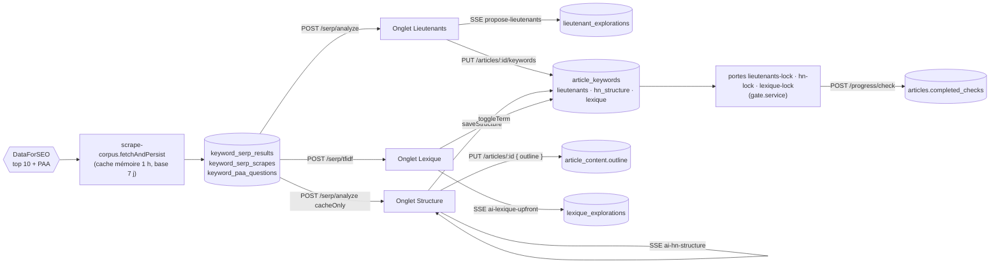

# Moteur — Lieutenants, Structure, Lexique

## Moteur — Lieutenants, Structure, Lexique : vue d'ensemble

Trois onglets de la phase « Valider » du Moteur, montés par [`src/views/MoteurView.vue`](../src/views/MoteurView.vue) en mode `workflow` (aucun n'est monté en mode `libre` aujourd'hui). Ils partagent une même lecture des pages concurrentes et le même enregistrement des décisions (`article_keywords`), puis passent chacun par une porte serveur.

- **Autorité des décisions :** `article_keywords` (une ligne par article) : `lieutenants TEXT[]`, `hn_structure JSONB`, `lexique TEXT[]`. Les portes lisent cette ligne, jamais l'écran.
- **Mémoire :** [`src/stores/article/article-keywords.store.ts`](../src/stores/article/article-keywords.store.ts) (`useArticleKeywordsStore`) — `keywords`, `lockedLieutenants`, `saveDecisions` (sans la structure), `saveStructure` (avec).
- **Étapes :** `MOTEUR_LIEUTENANTS_LOCKED`, `MOTEUR_HN_LOCKED`, `MOTEUR_LEXIQUE_VALIDATED` dans [`shared/constants/workflow-checks.constants.ts`](../shared/constants/workflow-checks.constants.ts). Émises par les panneaux (`check-completed` / `check-removed`), relayées par `useMoteurArticleSync.emitCheckCompleted` (`gateAlarm.runThroughGate` : un 422 ouvre l'alarme). Voir [Infrastructure transversale](20-infrastructure.md) pour l'alarme et les dérogations.
- **En aval (autres domaines) :** la Rédaction lit lieutenants, sommaire et lexique ; la Finalisation les récapitule ; la publication rejoue les trois portes.

## Moteur — Lieutenants

### Lecture des pages concurrentes (partagée)
*Exigences : FR-LIE-SERP-ANALYZE, FR-LIE-SCRAPE-DEDIE, FR-LEX-SCRAPE-DEDIE · Design : DESIGN-LIE-SERP-ANALYZE, DESIGN-LIE-EXTRACT-HEADINGS, DESIGN-LIE-SCRAPE-DEDIE*

- **Code :** [`server/services/external/scrape-corpus.service.ts`](../server/services/external/scrape-corpus.service.ts) — `fetchAndPersist(keyword, articleLevel)` : cache mémoire (`MEMORY_CACHE_TTL_MS` 1 h, `MEMORY_CACHE_MAX_ENTRIES` 100, LRU, clé `keyword:lang:country`), puis base si `getSerpResultsFresh` (moins de 7 jours) **et** `reconstructSerpAnalysisResult` non nul, sinon `fetchSerp` + `fetchPaa` et lecture parallèle des pages (`fetchPageHtml`, 10 s) ; `extractHeadings` (regex H1-H3) ; `extractTextContent` → `mainContent` (`<main>`, sinon `<article>`, sinon la page ; `stripBlocks` ; `stripDecorElements` avec `DECOR_MARKERS`) ; `classifyIsBlog` ; lectures `getHeadings`, `getTextContent`, `getPaaQuestions`. [`server/services/external/dataforseo/serp.ts`](../server/services/external/dataforseo/serp.ts) — `fetchSerp` garde les 10 premiers résultats organiques. [`server/services/keyword/keyword-serp.service.ts`](../server/services/keyword/keyword-serp.service.ts) — `getSerpResultsFresh` (TTL 7 j sur `fetched_at`), `reconstructSerpAnalysisResult` (`null` sans page lue), `hasSerpScrape`, `withSerpTransaction`.
- **Données :** `keyword_serp_results` (clé `keyword, lang, country, position` ; `url`, `title`, `domain`, `fetched_at`), `keyword_serp_scrapes` (`headings JSONB`, `text_content`, `is_blog`, `scraped_at`), `keyword_paa_questions`, ligne parente `keyword_metrics`. Écrites en une transaction par `fetchAndPersist` ; partagées entre articles.
- **API :** `POST /api/serp/analyze` ([`server/routes/serp-analysis.routes.ts`](../server/routes/serp-analysis.routes.ts)) — corps `serpAnalyzeBodySchema` ([`shared/schemas/serp-analysis.schema.ts`](../shared/schemas/serp-analysis.schema.ts)) : `keyword`, `topN` 3-10 (accepté, non utilisé), `articleLevel`, `cacheOnly?` → `{ data: SerpAnalysisResult }` (contrat `serpAnalysisContract`) ; avec `cacheOnly`, l'analyse en base même périmée ou `{ data: null }` (`serpAnalysisStoredContract`), jamais d'appel externe.
- **Règles et décisions :** une page sans titre ni texte est marquée non lue par le contrat (`UNREAD_PAGE_MESSAGE`, [`shared/contracts/serp.contract.ts`](../shared/contracts/serp.contract.ts)) et sort de la récurrence. Un relevé sans page lue ne compte pas comme une analyse (NFR-INT-SERP-ONCE, § 32). `scrape-corpus` n'importe aucun service métier (test [`tests/unit/architecture/decouplage-lieutenants-lexique.test.ts`](../tests/unit/architecture/decouplage-lieutenants-lexique.test.ts)).
- **Service dédié inactif :** [`server/services/keyword/lieutenants-analysis.service.ts`](../server/services/keyword/lieutenants-analysis.service.ts) (`proposeLieutenants`) n'est appelé par aucun code de production ; seuls les tests l'utilisent. La route appelle `scrape-corpus` directement.

### Onglet Lieutenants : analyse et récurrence
*Exigences : FR-LIE-SERP-ANALYZE, FR-LIE-SERP-ECHEC-EXPLIQUE, FR-LIE-SLIDER-INTELLIGENT, FR-LIE-EXTRACT-HEADINGS · Design : DESIGN-LIE-SLIDER-INTELLIGENT, DESIGN-LIE-EXTRACT-HEADINGS*

- **Code :** [`src/components/moteur/LieutenantsPanel.vue`](../src/components/moteur/LieutenantsPanel.vue) — orchestration : `canAnalyze` (capitaine verrouillé ou `hasEverAnalyzed`, c'est-à-dire des `richLieutenants`), `resolvedRootKeywords` (props `rootKeywords`, sinon `extractRoots(capitaine).slice(0, 5)`), `analyzeSERPWithStep`, `refreshSERP`, remise à zéro au changement d'article. [`src/composables/moteur/useLieutenantsSerp.ts`](../src/composables/moteur/useLieutenantsSerp.ts) — `analyzeSERP` (capitaine puis racines, séquentiel, `topN: 10`, message `info` à la pile d'activité), `mergeSerpResults` (dédoublonnage URL et PAA), `serpResultsByKeyword`, `sliderValue` (10), `displayedCompetitors` (tranche du résultat fusionné), `hnRecurrence`, `expliquerEchecSerp`. [`src/components/moteur/LieutenantSerpAnalysis.vue`](../src/components/moteur/LieutenantSerpAnalysis.vue) — curseur `min=3 max=10`, étapes, onglets par mot-clé, filtre Blogs / Autres. [`shared/utils/hn-structure.ts`](../shared/utils/hn-structure.ts) — `computeHnRecurrence` (pages sans `fetchError`, un titre par page, clé `niveau:texte minuscule`, tri pourcentage puis niveau), `recurringHeadings` (`MIN_RECURRING_PAGES` = 2), `flattenHnStructure`.
- **Données :** état local du composable (aucune persistance propre).
- **Règles et décisions :** la récurrence est calculée dans le navigateur par une fonction partagée, lue aussi par l'onglet Structure. Le curseur ne tranche que `displayedCompetitors` : la liste de l'onglet lit `activeSerpTabResult`, et l'IA lit le résultat du capitaine entier ; `hnRecurrence` ne sert qu'en repli quand le résultat du capitaine manque. Test : [`tests/unit/composables/serp-echec-explique.test.ts`](../tests/unit/composables/serp-echec-explique.test.ts).

### Proposition des lieutenants par l'IA
*Exigences : FR-LIE-PROPOSE-AI, FR-LIE-GEOFUNNEL-RULE, FR-LIE-CANDIDATES-BADGES, FR-LIE-SECTIONS-FOLDABLE, FR-LIE-AI-FRONTIER · Design : DESIGN-LIE-PROPOSE-AI, DESIGN-LIE-GEOFUNNEL-RULE, DESIGN-LIE-CANDIDATES-BADGES, DESIGN-LIE-SECTIONS-FOLDABLE, DESIGN-LIE-AI-FRONTIER*

- **Code :** [`src/composables/moteur/useLieutenantsIa.ts`](../src/composables/moteur/useLieutenantsIa.ts) — `proposeLieutenants` (remet les cartes à zéro, envoie titres récurrents, concurrents lus et PAA du capitaine, puis données des racines ; `onDone` : cartes non cochées, `saveRichLieutenantProposals`, `saveLieutenantExplorationEntries`, garde `isResponseForCurrentArticle`), `restoreLockedLieutenants`, `handleAssistAdd` (score `null`). Déclenchement : watcher `serpResult` du panneau (sauf propositions toutes fraîches selon `shouldRegenerate`, 7 jours → `restoreLockedLieutenants`). [`server/routes/keyword-ai-panel.routes.ts`](../server/routes/keyword-ai-panel.routes.ts) — `POST /keywords/:keyword/propose-lieutenants` : `getCocoonExistingLieutenants` ([`server/services/infra/data.service.ts`](../server/services/infra/data.service.ts), lieutenants des autres articles du cocon), `getArticlePainPoint`, `loadPrompt('propose-lieutenants', …)` ([`server/prompts/propose-lieutenants.md`](../server/prompts/propose-lieutenants.md) : `{{type_rules}}`, `{{existing_lieutenants}}`, règle de l'entonnoir, malus -15 à -25), `runAiPanelStream` (8 192 jetons), `parseAiJson` + `proposeLieutenantsAiContract`, `filterLieutenants` (tri `compareScores`, `ARTICLE_TYPE_RULES[level].maxLieutenants`), `onSuccess` → `saveLieutenantExplorations` **avant** l'événement `done`. [`shared/contracts/lieutenants.contract.ts`](../shared/contracts/lieutenants.contract.ts) — score 0-100 ou `null`, niveau H2/H3 (sinon H2 signalé), sources connues, doublons écartés ; `proposeLieutenantsContract` côté client. Affichage : [`src/components/moteur/lieutenants/LieutenantsResultsLayout.vue`](../src/components/moteur/lieutenants/LieutenantsResultsLayout.vue) (liste, deux `CollapsableSection` repliées, puis `LieutenantsAiPanel`), [`src/components/moteur/LieutenantProposals.vue`](../src/components/moteur/LieutenantProposals.vue) (tri `useSortableList`, `sortedEliminated`, compteur `selectedCards.size / totalGenerated`), [`src/components/moteur/LieutenantCard.vue`](../src/components/moteur/LieutenantCard.vue) (`formatScore`, pastilles `VALID_SOURCES`), [`src/components/moteur/LieutenantsAiPanel.vue`](../src/components/moteur/LieutenantsAiPanel.vue) (`data-testid="ai-panel-suggestion"`).
- **Données :** `lieutenant_explorations` (unique `article_id, keyword` ; `status` `suggested|locked|eliminated|archived`, `captain_keyword`, `reasoning`, `sources TEXT[]`, `suggested_hn_level`, `score` entier, `kpis`, `explored_at`), upsert par `saveLieutenantExplorations` (écrase le statut).
- **API :** `POST /api/keywords/:keyword/propose-lieutenants` (SSE) — 400 sans `keyword`, `level` ou `articleId`, ou niveau inconnu ; `done { outline: FilteredProposeLieutenantsResult }` (`selectedLieutenants`, `eliminatedLieutenants`, `contentGapInsights`, `totalGenerated`). `POST /api/articles/:id/lieutenant-explorations` (lot d'entrées, [`server/routes/keywords.routes.ts`](../server/routes/keywords.routes.ts)).
- **Règles et décisions :** aucune structure dans la sortie de l'IA. Aucune carte cochée à l'arrivée (l'IA propose, l'utilisateur décide). La règle géographique n'existe que dans le prompt. `CollapsableSection` ([`src/components/shared/CollapsableSection.vue`](../src/components/shared/CollapsableSection.vue)) masque en CSS, sans montage différé. Frontière verrouillée par [`tests/unit/components/lieutenants-results-layout-architecture.test.ts`](../tests/unit/components/lieutenants-results-layout-architecture.test.ts) et [`tests/unit/components/lieutenants-selection-architecture.test.ts`](../tests/unit/components/lieutenants-selection-architecture.test.ts) : la liste n'est pas descendante du panneau IA, et `LieutenantH2Structure` n'est plus rendu ici.

### Verrouillage des lieutenants
*Exigences : FR-LIE-CHECKBOX-LOCK-IMMEDIATE, FR-LIE-CHECKBOX-COUNT · Design : DESIGN-LIE-CHECKBOX-LOCK-IMMEDIATE, DESIGN-LIE-CHECKBOX-COUNT*

- **Code :** `useLieutenantsIa.toggleLieutenant` → store `lockLieutenant` / `unlockLieutenant` (statut en mémoire + liste plate `lieutenants`), `saveLieutenantExplorationEntries` (statuts), `saveDecisions`. Store : `mergeRichLieutenants` (statut terminal prioritaire), `fetchKeywordsMerge`, `saveRichLieutenantProposals` (remplace `richLieutenants` par des `suggested` / `eliminated`).
- **Données :** deux sources tenues ensemble par `toggleLieutenant` : `article_keywords.lieutenants` (lue par la porte, la Structure en repli, la Rédaction) et `lieutenant_explorations.status` (lue par l'écran via `GET /api/articles/:id/keywords`, champ `richLieutenants`).
- **API :** `PUT /api/articles/:id/keywords` `{ capitaine, lieutenants, lexique, rootKeywords }` → `saveArticleKeywords`.
- **Règles et décisions :** un enregistrement par geste, sans temporisation. Dette : `proposeLieutenants` → `saveRichLieutenantProposals` efface les statuts `locked` en mémoire sans vider la liste plate ; le panneau retire alors l'étape et réenregistre l'ancienne liste. Aucune fourchette conseillée n'est calculée (seul `minLieutenants` existe, pour la porte).

### Étape et porte « lieutenants-lock »
*Exigences : FR-LIE-CHECK, FR-LIE-LOCK-GATE · Design : DESIGN-LIE-CHECK, DESIGN-LIE-LOCK-GATE*

- **Code :** [`shared/verifiers/lieutenants.ts`](../shared/verifiers/lieutenants.ts) — `verifyLieutenants`, `normalizeKeyword` ; règles `lieutenants-too-few` (🔴, `minLieutenants` de [`shared/constants/article-type-rules.ts`](../shared/constants/article-type-rules.ts)), `lieutenant-cannibalization:<mot>` (🔴), `lieutenant-shared:<mot>` (🟠), `lieutenant-is-captain:<mot>` (🟠). [`server/services/gates/gate.service.ts`](../server/services/gates/gate.service.ts) — `lieutenantsGate` (type, `article_keywords` de l'article, revendications des autres articles du cocon, `unselectedCandidates` = `unselectedLieutenants` : propositions `lieutenant_explorations` au statut `suggested`, `score DESC NULLS LAST`, hors lieutenants retenus — les pistes « À la place : », hors empreinte), `CHECK_GATES`, `evaluateArticleGate`. Panneau : `lieutenantsCheckActive` (au moins un `locked`), watcher de transition avec réconciliation au montage, `verifyLockedLieutenants(saveFirst)` (enregistre, vérifie, recommence tant que `lockedLieutenantsSignature` a bougé ; `transitionSettled`), `requestLieutenantsGate` (chaîne de promesses), `syncLieutenantsGate` (verdict silencieux via `useGateAlarmStore().evaluate`), `reviewLieutenantsGate` (`ensure`), `invalidateValidatedStructure`, `gateBannerText`, bandeau `data-testid="lieutenants-gate-banner"`.
- **Données :** lecture `articles`, `article_keywords` ; `articles.completed_checks` ; `gate_waivers`. Empreinte : `{ level, captain, lieutenants triés, claims "rôle:mot" qui recoupent l'article }`.
- **API :** `GET /api/articles/:id/gates/lieutenants-lock` ; `POST /api/articles/:id/progress/check` (422 `GATE_BLOCKED` si refus) ; `POST /api/articles/:id/progress/uncheck` (retire aussi `MOTEUR_HN_LOCKED` via `checksRemovedWith`) ([`server/routes/articles.routes.ts`](../server/routes/articles.routes.ts)).
- **Règles et décisions :** la porte lit la base, donc les décisions partent avant l'étape (`saveDecisions` en échec → pas d'étape). Vérification silencieuse : une alarme à chaque case rendrait l'onglet inutilisable. Les stores de progression et d'alarme sont lus à la demande, pas au `setup`. Le niveau d'article vient de `parseArticleLevel` ([`shared/utils/article-level.ts`](../shared/utils/article-level.ts)) ; test [`tests/unit/architecture/article-level-names.test.ts`](../tests/unit/architecture/article-level-names.test.ts). Tests : [`tests/unit/shared/verifiers-lieutenants.test.ts`](../tests/unit/shared/verifiers-lieutenants.test.ts), [`tests/unit/components/lieutenants-gate.test.ts`](../tests/unit/components/lieutenants-gate.test.ts).

## Moteur — Structure

### Onglet Structure
*Exigences : FR-HN-TAB · Design : DESIGN-HN-TAB*

- **Code :** [`src/components/moteur/StructureHnPanel.vue`](../src/components/moteur/StructureHnPanel.vue) — props `selectedArticle`, `mode`, `captainKeyword`, `articleLevel`, `cocoonSlug` ; `hasStructureCheck`, `validated` (étape et copie inchangée), `canValidate`, `handleSave` (retire l'étape si elle était posée), `handleGenerate` (`loadCompetitors({ fetchIfMissing: true })` si rien n'est chargé), `validate` (`prepareValidation` puis `check-completed`) ; `restore` + `loadCompetitors` au montage et au changement d'article. [`src/composables/moteur/useStructureHn.ts`](../src/composables/moteur/useStructureHn.ts) — `structure` (copie de travail), `dirty` (comparaison JSON), `lockedLieutenants` (`richLieutenants` verrouillés, sinon liste plate), `loadCompetitors`, `generate`, `save`, `recommendWordCount`, `outlineRetouched` (`outlineKey`), `prepareValidation`, `confirmReplaceOutline` injectable (`window.confirm` par défaut). [`src/components/moteur/LieutenantH2Structure.vue`](../src/components/moteur/LieutenantH2Structure.vue) — `lockedKeys` (local), `lockedHeadings` (H3 verrouillé sous H2 libre remonté seul), purge des verrous périmés, `canRegenerate`, sections « Structure Hn recommandée (IA) » et « Structure Hn concurrents ».
- **Données :** `article_keywords.hn_structure` (JSONB `{ level, text, children? }`), écrite par `saveStructure` seulement ; `article_content.outline` ; `article_micro_contexts.target_word_count` (si vide). Verrous des titres : mémoire du composant.
- **API :** `POST /api/serp/analyze` (`cacheOnly: true` à l'ouverture) ; `POST /api/keywords/:keyword/ai-hn-structure` (SSE) ; `PUT /api/articles/:id/keywords` avec `hnStructure` ; `GET /api/articles/:id/content` ; `PUT /api/articles/:id { outline }` ; `POST /api/articles/:id/recommend-word-count`, `GET` / `PUT /api/articles/:id/micro-context` (longueur : [Cerveau](11-cerveau.md) et [Rédaction](17-redaction.md)).
- **Règles et décisions :** enregistrer ≠ valider ; valider enregistre d'abord (la porte lit la base) ; une structure enregistrée après validation perd son étape. Ouvrir l'onglet ne paie rien (FR-MOT-NO-AUTO-ACTION). Tests : [`tests/unit/composables/moteur/useStructureHn.test.ts`](../tests/unit/composables/moteur/useStructureHn.test.ts), [`tests/unit/components/structure-hn-panel.test.ts`](../tests/unit/components/structure-hn-panel.test.ts), [`tests/browser-e2e/structure.browser.test.ts`](../tests/browser-e2e/structure.browser.test.ts).

### Proposition de structure par l'IA
*Exigences : FR-HN-TAB · Design : DESIGN-HN-TAB*

- **Code :** `keyword-ai-panel.routes.ts` — `POST /keywords/:keyword/ai-hn-structure` : 400 sans `level` ou sans lieutenant ; récurrence formatée « H2: texte (nx) » (sinon « Aucune donnee de structure concurrente ») ; titres verrouillés ; `getArticlePainPoint` ; `cocoonContextForArticle(articleId)` (panne → vide ; § 31, FR-INFRA-COCOON-CONTEXT) ; `typeRulesFor` ; `runAiPanelStream` (4 096 jetons) ; `parseContract(hnOutlineContract, …)`. Prompt [`server/prompts/lieutenants-hn-structure.md`](../server/prompts/lieutenants-hn-structure.md) : H1 = capitaine en entier, « N'ecris ni introduction ni conclusion », lieutenants tous placés, titres verrouillés tels quels, bloc `{{#cocoon_context}}`. Simulation : fixture `lieutenants-hn-structure` de [`server/services/external/mock-fixtures/streams.ts`](../server/services/external/mock-fixtures/streams.ts).
- **API :** `done { outline: { hnStructure, justification }, metadata, usage }` ; sans liste de titres → événement `error`, la structure affichée reste.
- **Règles et décisions :** la route reçoit les lieutenants retenus **du client**, pas de la base. La récurrence est relue puis calculée dans le navigateur, pas côté serveur.

### Enregistrement et sommaire
*Exigences : FR-HN-TAB · Design : DESIGN-HN-TAB*

- **Code :** store `saveStructure(id, structure)` (mémoire mise à jour après la réponse du serveur ; `false` en cas d'échec) ; `saveDecisions` n'envoie jamais `hnStructure` ; `fetchKeywordsMerge` adopte la structure de la base si la mémoire n'en a pas. `keywords.routes.ts` — `PUT /articles/:id/keywords` valide `hnStructure` par `hnStructureSchema` ([`shared/schemas/keyword.schema.ts`](../shared/schemas/keyword.schema.ts), 400 sinon) et la transmet `undefined` si absente ; `saveArticleKeywords` garde alors la valeur en base. [`shared/structure-outline.ts`](../shared/structure-outline.ts) — `structureToOutline` (H1 de la structure sinon titre de l'article, « Introduction » / « Conclusion » ajoutées sauf présentes, niveaux bornés 2-3) ; [`src/stores/article/outline.store.ts`](../src/stores/article/outline.store.ts) — `hnToOutline` l'appelle.
- **Règles et décisions :** plus d'effacement silencieux de la structure par un enregistrement Lieutenants ou Lexique. Un titre vide passe l'enregistrement : la porte le refuse. Le sommaire de l'écran et celui du mode automatique sortent de la même fonction.

### Porte « hn-lock »
*Exigences : FR-HN-LOCK-GATE · Design : DESIGN-HN-LOCK-GATE*

- **Code :** [`shared/verifiers/structure.ts`](../shared/verifiers/structure.ts) — `verifyStructure` ; `structureHeadings` (ordre de lecture, titres vides compris, ancien format `{ level: 'H2', title }` lu) ; `bodyH2` ; `isIntroductionTitle` / `isConclusionTitle` ; règles `hn-missing` 🔴 et `hn-empty` ⛔ (seules alertes), `hn-h1-missing` ⛔, `hn-captain-not-in-h1` 🔴, `hn-empty-title` ⛔, `hn-h3-without-h2` ⛔, `hn-h2-count` 🔴, `hn-intro-conclusion` 🟠, `hn-h3-too-many` 🟠, `hn-local-overuse` 🔴, `hn-lieutenant-missing:<lieutenant>` 🟠 (couverture < 0,75), `hn-overlaps-article:<titre>` 🔴 avec H3 / 🟠 sans (pilier seulement) ; `distinctRules`. Couverture des mots : `keywordCoverage` ([`shared/seo-validators.ts`](../shared/seo-validators.ts), pluriels et racines de 5 lettres). `gate.service.ts` — `hnGate` : capitaine (sinon `captain_keyword_locked`), `hnStructure`, liste plate `lieutenants`, `getCocoonSiblings` ([`server/services/queries/cocoon-siblings.service.ts`](../server/services/queries/cocoon-siblings.service.ts)), `loadZoneContext().zone`. `publishGate` rejoue `hn-lock`.
- **Données :** empreinte `{ level, captain, headings "niveau:texte", lieutenants triés, overlapping (capitaines des seuls articles recoupés), city }`.
- **API :** `POST /api/articles/:id/progress/check` avec `moteur:hn_locked` → porte ; 422 → alarme « Avant de valider la structure » (`GATE_LABELS['hn-lock']`, [`shared/verifiers/gate.ts`](../shared/verifiers/gate.ts)).
- **Règles et décisions :** H1 sans capitaine = 🔴 (même niveau qu'au premier jet et à la publication). Structure absente = 🔴 pour qu'un article rédigé sans l'onglet reste publiable. Recoupement gradué : un pilier résume ses enfants (🟠), ne les développe pas (🔴). Porte au clic, sans vérification continue. Test : [`tests/unit/shared/verifiers-structure.test.ts`](../tests/unit/shared/verifiers-structure.test.ts).

### Cascade, mode automatique, réconciliation
*Exigences : FR-HN-TAB, FR-HN-LOCK-GATE · Design : DESIGN-HN-TAB*

- **Code :** `CHECK_DEPENDENTS` / `checksRemovedWith` (Capitaine ou Lieutenants → Structure) appliqués par `POST /progress/uncheck` (`removeArticleChecks`). [`scripts/auto-article/phases/moteur-valider.ts`](../scripts/auto-article/phases/moteur-valider.ts) — étape Structure : `collectSse` vers `ai-hn-structure`, `ctx.articleStructure`, `saveThenEmit(…, MOTEUR_HN_LOCKED)` ([`scripts/auto-article/checks.ts`](../scripts/auto-article/checks.ts) : un 422 arrête le run avec la liste des points). [`scripts/auto-article/phases/redaction.ts`](../scripts/auto-article/phases/redaction.ts) — sommaire = `structureToOutline` si une structure existe. [`scripts/auto-article/resume-plan.ts`](../scripts/auto-article/resume-plan.ts) — `planResume` : `skipMoteur` exige `MOTEUR_HN_LOCKED` et `MOTEUR_LEXIQUE_VALIDATED`. [`scripts/reconcile-hn-checks.ts`](../scripts/reconcile-hn-checks.ts) (`npm run db:reconcile-hn`, `--apply` pour écrire).
- **Règles et décisions :** le transfert direct d'un capitaine verrouillé vers un autre ([`src/components/moteur/CaptainPanel.vue`](../src/components/moteur/CaptainPanel.vue), `lockEntry`) ne retire aucune étape : `moteur:hn_locked` survit.

## Moteur — Lexique

### Onglet Lexique : orchestration
*Exigences : FR-LEX-LECTURE-VS-VERROUILLAGE, FR-LEX-MULTI-KEYWORD, FR-LEX-MULTI-KEYWORD-TABS, FR-LEX-SORT · Design : DESIGN-LEX-LECTURE-VS-VERROUILLAGE, DESIGN-LEX-MULTI-KEYWORD, DESIGN-LEX-MULTI-KEYWORD-TABS, DESIGN-LEX-SORT*

- **Code :** [`src/components/moteur/LexiquePanel.vue`](../src/components/moteur/LexiquePanel.vue) — `selectedTerms` (recopié de `lockedTerms` par un watcher `immediate`), `canExtract`, `extractLexique`, `extractCustomKeyword` (`triggerScrapeIfMissing: true`, puis `mergeFromDb`), `fetchTfidf`, `confirmSerpScrape`, `lexiqueTabs` / `displayedTabId` / `onSelectTab` (onglet `__custom__`), tri `lexiqueSortOptions` / `sortTermsByAlignment` (`jaccardWithPainPoint`, [`src/utils/pain-point-jaccard.ts`](../src/utils/pain-point-jaccard.ts)), watcher d'auto-restauration (`hydrateFromDb`, puis `fetchTfidf` si le pré-contrôle dit « présent » et que rien n'est chargé), watcher `tfidfResult` → `generateLexiqueUpfront`. Composables : [`useLexiqueExplorations.ts`](../src/composables/lexique/useLexiqueExplorations.ts) (LECTURE : `hydrateFromDb`, `mergeFromDb`, `selectExploration`, aucun appel d'écriture), [`useLexiqueLocking.ts`](../src/composables/lexique/useLexiqueLocking.ts) (VERROUILLAGE : `lockedTerms`, `isLocked`, `toggleTerm`). Vues : [`LexiqueTermsList.vue`](../src/components/moteur/lexique/LexiqueTermsList.vue), [`LexiqueCustomKeywordInput.vue`](../src/components/moteur/lexique/LexiqueCustomKeywordInput.vue) (`:disabled="isLoading"`), [`TabBar.vue`](../src/components/shared/TabBar.vue) (pur, `role="tablist"`), [`SortToggleBar.vue`](../src/components/moteur/SortToggleBar.vue).
- **Données :** `lexique_explorations` (unique `article_id, source_keyword` ; `tfidf_terms`, `ai_recommendations`, `ai_missing_terms` JSONB, `ai_summary`, `explored_at`) ; tri en mémoire du composant.
- **API :** `GET /api/articles/:id/explorations` ([`server/routes/article-explorations.routes.ts`](../server/routes/article-explorations.routes.ts), contrat `articleExplorationsContract`) → `listLexiqueExplorations`.
- **Règles et décisions :** LECTURE et VERROUILLAGE n'ont ni import ni appel croisé ; le watcher de l'étape reste dans le panneau. Tests : [`tests/unit/architecture/lexique-separation.test.ts`](../tests/unit/architecture/lexique-separation.test.ts), [`lexique-watcher-isolated.test.ts`](../tests/unit/architecture/lexique-watcher-isolated.test.ts), [`lexique-tabbar.test.ts`](../tests/unit/architecture/lexique-tabbar.test.ts), [`tests/unit/components/moteur/LexiquePanel.tabs.test.ts`](../tests/unit/components/moteur/LexiquePanel.tabs.test.ts). Le libellé d'onglet est le `source_keyword` brut.

### Pré-contrôle des pages et extraction TF-IDF
*Exigences : FR-LEX-PRECHECK-SERP, FR-LEX-SCRAPE-DEDIE, FR-LEX-TFIDF · Design : DESIGN-LEX-PRECHECK-SERP, DESIGN-LEX-SCRAPE-DEDIE, DESIGN-LEX-TFIDF*

- **Code :** [`src/composables/lexique/useSerpExistsCheck.ts`](../src/composables/lexique/useSerpExistsCheck.ts) (`exists` : `null` inconnu, `true`, `false` ; watcher sur le capitaine) ; [`src/components/shared/ConfirmModal.vue`](../src/components/shared/ConfirmModal.vue). Serveur : `GET /keywords/:keyword/serp/exists` (`keywords.routes.ts`) → `hasSerpScrape` (`MAX(scraped_at)`) ; `POST /serp/tfidf` (`serp-analysis.routes.ts`) → [`server/services/keyword/lexique-analysis.service.ts`](../server/services/keyword/lexique-analysis.service.ts) `analyzeLexique` (`fetchAndPersist(keyword, 'specifique')` si demandé ; `getTextContent` ; `LexiqueScrapeMissingError` ; `extractTfidf` ; `saveLexiqueTfidf` si `articleId`) → [`server/services/keyword/tfidf.service.ts`](../server/services/keyword/tfidf.service.ts) `tokenize` (lettres accentuées et tiret, filtre `isGenericWord`), `computeTfidfFromTexts` (seuils 0,7 / 0,3, densité arrondie à 0,1, tri densité, 50 par niveau).
- **API :** `GET /api/keywords/:keyword/serp/exists` → `{ data: { exists, scrapedAt } }` (400 `INVALID_KEYWORD` hors 2-200 caractères) ; `POST /api/serp/tfidf` `{ keyword, articleId?, triggerScrapeIfMissing? }` → `{ data: TfidfResult }` (contrat `tfidfResultContract`), 404 `NOT_FOUND` sans texte, 500 sinon.
- **Données :** lit `keyword_serp_scrapes.text_content` sans filtre d'âge ; écrit `lexique_explorations.tfidf_terms`.
- **Règles et décisions :** le Lexique ne lit jamais les titres, les Lieutenants jamais le texte ; aucun import croisé (test de découplage). La TF-IDF ne recalcule rien côté navigateur : l'écran affiche `density` et `documentFrequency` reçus.

### Filtre des mots génériques
*Exigences : FR-LEX-METIER-ONLY · Design : DESIGN-LEX-METIER-ONLY*

- **Code :** [`shared/utils/generic-terms.ts`](../shared/utils/generic-terms.ts) — `normalizeTerm` (minuscules, sans accents), `GRAMMATICAL`, `PAGE_DECOR`, `isGenericWord` (moins de 3 lettres, nombre, liste), `isGenericTerm` (tous les mots génériques ; terme vide = générique), `splitGenericTerms` (nettoie, dédoublonne, sépare). Lecteurs : `tokenize` ; `verifyLexique` ; `pickLexique` ; [`server/services/keyword/lexique-exploration.service.ts`](../server/services/keyword/lexique-exploration.service.ts) `withoutGenericTerms` / `rowToExploration` (filtre à la relecture, trois niveaux, recommandations, manques ; lignes en base inchangées) ; `POST /keywords/lexique-suggest` (`keywords.routes.ts`, renvoie `{ lexique, rejected, usage }`) ; [`src/components/keywords/ArticleKeywordsPanel.vue`](../src/components/keywords/ArticleKeywordsPanel.vue) `handleAddLexique`, `handleSuggestLexique` ([Rédaction](17-redaction.md)) ; store `suggestLexique`.
- **Règles et décisions :** une seule liste pour la TF-IDF, la porte et le mode automatique ; comparaison sans accents, sortie accentuée. Les mots ambigus (« site », « blog », « article », « recherche ») sont volontairement absents. Les autres listes de mots vides du projet servent d'autres calculs et restent distinctes. Tests : [`tests/unit/shared/generic-terms.test.ts`](../tests/unit/shared/generic-terms.test.ts), [`tests/unit/services/tfidf.test.ts`](../tests/unit/services/tfidf.test.ts), [`tests/unit/services/scrape-corpus.service.test.ts`](../tests/unit/services/scrape-corpus.service.test.ts), [`tests/unit/services/lexique-exploration.service.test.ts`](../tests/unit/services/lexique-exploration.service.test.ts).

### Avis de l'IA sur le lexique
*Exigences : FR-LEX-AI-PANEL · Design : DESIGN-LEX-AI-PANEL*

- **Code :** [`src/composables/lexique/useLexiqueIa.ts`](../src/composables/lexique/useLexiqueIa.ts) — `generateLexiqueUpfront` (mot-clé actif sinon capitaine, tous les termes), `iaRecommendations` (Map par terme en minuscules), `isIaRecommended`, compteurs ; ne coche rien. [`src/components/moteur/LexiqueAiPanel.vue`](../src/components/moteur/LexiqueAiPanel.vue) (coque `AiPanel`). Serveur : `POST /keywords/:keyword/ai-lexique-upfront` (`keyword-ai-panel.routes.ts`) — 400 sans `level` ou sans terme ; `loadPrompt('lexique-analysis-upfront', …)` ([`server/prompts/lexique-analysis-upfront.md`](../server/prompts/lexique-analysis-upfront.md) : douleur, `{{strategy_context}}`, au plus 5 manquants, résumé) ; jetons `max(4096, min(16384, termes × 80 + 512))` ; `lexiqueAnalysisContract` ([`shared/contracts/lexique.contract.ts`](../shared/contracts/lexique.contract.ts)) ; `onSuccess` → `saveLexiqueAi` avant `done`.
- **Données :** `lexique_explorations.ai_recommendations`, `ai_missing_terms`, `ai_summary`.
- **Règles et décisions :** l'analyse est déclenchée par le watcher `tfidfResult` du panneau dès qu'un TF-IDF arrive sans avis, y compris l'extraction automatique de l'ouverture : dette face à FR-MOT-NO-AUTO-ACTION. Route inutilisée par l'écran : `POST /keywords/:keyword/ai-lexique` (prompt `lexique-ai-panel.md`), sans appelant hors du libellé de [`src/utils/api-label.ts`](../src/utils/api-label.ts).

### Verrouillage des termes, étape et porte « lexique-lock »
*Exigences : FR-LEX-SELECT, FR-LEX-CHECKBOX-LOCK-IMMEDIATE, FR-LEX-PRECHECK-PERSISTE, FR-LEX-CHECK, FR-LEX-METIER-ONLY · Design : DESIGN-LEX-SELECT, DESIGN-LEX-CHECKBOX-LOCK-IMMEDIATE, DESIGN-LEX-PRECHECK-PERSISTE, DESIGN-LEX-CHECK, DESIGN-LEX-METIER-ONLY*

- **Code :** `useLexiqueLocking.toggleTerm` → store `addLexiqueTerm` / `removeLexiqueTerm` → `saveDecisions` (un `PUT` par geste). Panneau : `handleToggleTerm`, `handleAssistAdd` (enregistre si absent), `watch(isLocked)` avec réconciliation au montage, watcher `JSON.stringify(lockedTerms)`, `requestLexiqueGate` (chaîne), `syncLexiqueGate` (`saveDecisions` puis `evaluate(id, 'lexique-lock')` ; verdict impossible → étape demandée), `reviewLexiqueGate`, `requestLexiqueCheck` / `withdrawLexiqueCheck` (drapeau `lexiqueCheckRequested`), bandeau `data-testid="lexique-gate-banner"`. [`shared/verifiers/lexique.ts`](../shared/verifiers/lexique.ts) — `verifyLexique` : `lexique-empty` 🔴, `lexique-generic-term:<terme normalisé>` 🔴 (dédoublonné). `gate.service.ts` — `lexiqueGate` (empreinte : termes normalisés triés) ; `publishGate` le rejoue.
- **Données :** `article_keywords.lexique` TEXT[] — seule autorité de `isLocked`, lue par la porte, la Rédaction, la Finalisation et le score SEO (autres domaines).
- **API :** `PUT /api/articles/:id/keywords` ; `GET /api/articles/:id/gates/lexique-lock` ; `POST /api/articles/:id/progress/check` et `PUT /api/articles/:id/progress` (les deux passent par la porte) ; `POST …/progress/uncheck`.
- **Règles et décisions :** rien n'est coché d'office ; l'écran suit toujours la base (fin du défaut « termes enregistrés affichés décochés »). Vérification silencieuse, revérifiée à chaque changement, sur le modèle des lieutenants. Lexique vide et terme générique sont 🔴 (assumables), pas ⛔. Tests : [`tests/unit/shared/verifiers-lexique.test.ts`](../tests/unit/shared/verifiers-lexique.test.ts), [`tests/unit/components/lexique-gate.test.ts`](../tests/unit/components/lexique-gate.test.ts), [`tests/unit/components/lexique-extraction.test.ts`](../tests/unit/components/lexique-extraction.test.ts), [`tests/unit/composables/lexique-precheck-persiste.test.ts`](../tests/unit/composables/lexique-precheck-persiste.test.ts), [`tests/browser-e2e/parcours/lexique.parcours.test.ts`](../tests/browser-e2e/parcours/lexique.parcours.test.ts).

### Lexique du mode automatique
*Exigences : FR-LEX-METIER-ONLY · Design : DESIGN-LEX-METIER-ONLY*

- **Code :** `moteur-valider.ts` — `POST /serp/tfidf` (`triggerScrapeIfMissing: true`) → [`scripts/auto-article/heuristics/pick-lexique.ts`](../scripts/auto-article/heuristics/pick-lexique.ts) `pickLexique` (obligatoires + différenciateurs de densité au moins médiane ; écarte `isGenericTerm`, `FR_STOPWORDS`, `DOMAIN_NOISE`, mots du capitaine et des lieutenants ; `MAX_TERMS` 30) → `saveThenEmit(…, MOTEUR_LEXIQUE_VALIDATED)`.
- **Règles et décisions :** les lieutenants du mode automatique viennent de l'heuristique `pickLieutenants` ([`scripts/auto-article/heuristics/pick-lieutenants.ts`](../scripts/auto-article/heuristics/pick-lieutenants.ts)), pas de la proposition de l'IA. Chaque décision est enregistrée avant sa demande d'étape ; le run ne déroge jamais.
