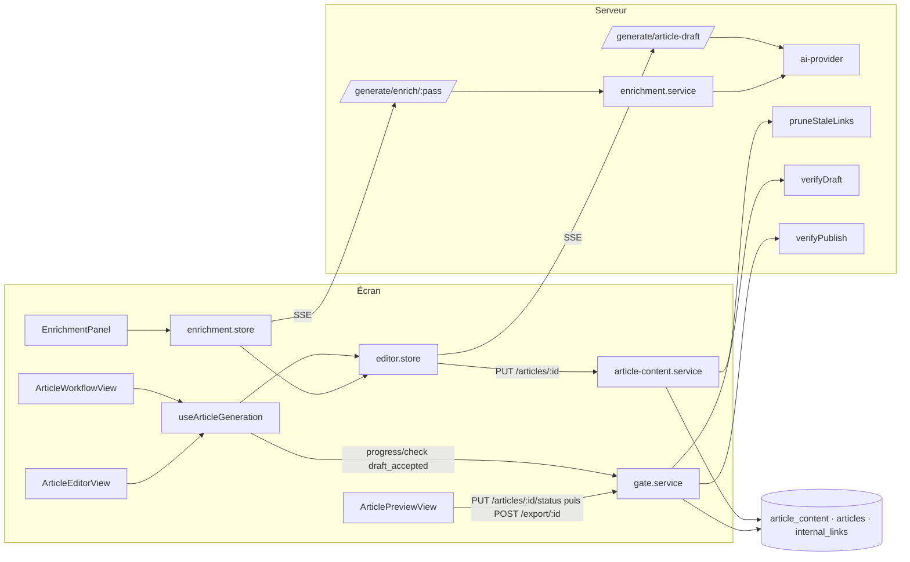

# Rédaction

## Rédaction

Deux vues montent les mêmes briques : [`ArticleWorkflowView.vue`](../src/views/ArticleWorkflowView.vue) (rédaction guidée, `/cocoon/:cocoonId/article/:articleId`) et [`ArticleEditorView.vue`](../src/views/ArticleEditorView.vue) (éditeur, `/article/:articleId/editor`). L'entrée par cocon est [`RedactionView.vue`](../src/views/RedactionView.vue) (`/cocoon/:cocoonId/redaction`), dont les cartes (`ArticleCard.vue`) mènent à la rédaction guidée ; l'aperçu et l'export vivent dans [`ArticlePreviewView.vue`](../src/views/ArticlePreviewView.vue).

- **Écran :** les opérations passent par [`useArticleGeneration.ts`](../src/composables/article/useArticleGeneration.ts) (premier jet → méta → étape), [`editor.store.ts`](../src/stores/article/editor.store.ts) (texte, méta, scores, réduction, humanisation) et [`enrichment.store.ts`](../src/stores/article/enrichment.store.ts) (passes).
- **Serveur :** les générations sont sous `/api/generate/*` ([`server/routes/generate/index.ts`](../server/routes/generate/index.ts), `mergeRouter` à plat) ; l'enregistrement passe par `PUT /api/articles/:id` ([`articles.routes.ts`](../server/routes/articles.routes.ts) → [`article-content.service.ts`](../server/services/article/article-content.service.ts)).
- **Vérificateurs purs** partagés écran / serveur / audit : [`shared/verifiers/draft.ts`](../shared/verifiers/draft.ts), [`publish.ts`](../shared/verifiers/publish.ts), [`enrichment.ts`](../shared/verifiers/enrichment.ts) ; détecteurs de qualité dans [`shared/text-quality.ts`](../shared/text-quality.ts). Le serveur est le seul à évaluer une porte ([`gate.service.ts`](../server/services/gates/gate.service.ts)) ; le mécanisme (empreinte, dérogations, alarme) relève de [Infrastructure transversale](20-infrastructure.md).

### Données de la Rédaction
*Exigences : FR-RED-DRAFT-SINGLE-PASS, FR-RED-SEO-SCORE-PERSIST, FR-RED-PROGRESS, FR-RED-LINKING-MANUAL · Design : DESIGN-RED-DRAFT-SINGLE-PASS, DESIGN-RED-SEO-SCORE-PERSIST*

| Donnée | Qui écrit | Qui lit |
|---|---|---|
| `article_content.outline` (JSONB) | validation de l'onglet Structure ([Moteur — Structure](15-lieutenants-structure-lexique.md)), `outlineStore.validateOutline`, mode automatique | vues de rédaction, porte `draft` (nombre de H2) |
| `article_content.content` (TEXT, HTML) | `saveArticleContent` : premier jet (au fil puis final), éditeur, passes acceptées, réduction, humanisation | vues, portes `draft` et `publish`, export, liens suggérés |
| `articles.meta_title`, `meta_description` | `saveArticleContent` (méta générée) | vues, porte `publish`, export |
| `articles.seo_score`, `geo_score` (NUMERIC) | `saveArticleContent` depuis `editorStore.saveArticle` / `recordScore` | audit `verify:content` seulement |
| `articles.phase` | `saveArticleContent` (texte non vide → `redaction`), `updateArticleStatus` (`published`) | liste « Articles publiés » (`data.service.ts`) |
| `articles.status` | `PUT /articles/:id/status` (`updateArticleStatus`) | porte `publish` (liens non publiés), maillage |
| `articles.completed_checks` | `POST /articles/:id/progress/check` (`redaction:draft_accepted`, gardé par la porte `draft`) | `DraftAcceptance.vue`, [Cerveau](11-cerveau.md) (parent rédigé) |
| `article_micro_contexts.target_word_count` | `BriefStructureStep` (choix), route du premier jet (`retainTargetWordCount`, `COALESCE`, jamais d'écrasement) | `brief.store`, route du premier jet, porte `draft` |
| `internal_links` | `PUT /api/links` (`upsertLinks`) ; suppression par `pruneStaleLinks` | maillage, porte `publish`, matrice |
| `gate_waivers` | `saveGateWaivers` ([Infrastructure transversale](20-infrastructure.md)) | portes |

Règle de `saveArticleContent` : `content` et `outline` sont écrits par `COALESCE` — envoyer `null` ne les efface pas. Le réseau de liens est élagué dès que `content` est fourni. La méta et les scores sont écrits dès que le champ est présent, même `null`.

### Rédaction guidée et verrou du Cerveau
*Exigences : FR-RED-GEN-UNLOCK · Design : DESIGN-RED-GEN-UNLOCK*

- **Code :** [`ArticleWorkflowView.vue`](../src/views/ArticleWorkflowView.vue) — `currentStep` (`brief-structure` | `article`), `goToStep`, `cerveauEstComplet` = `cocoonStrategyStore.isComplete || strategyStore.isComplete` (`completedSteps >= 6`), `redactionNavSteps` (`locked`, `hint`) poussé dans `workflowNavStore.setWorkflowNav` ; [`WorkflowNav.vue`](../src/components/shared/WorkflowNav.vue) grise l'étape verrouillée. [`BriefStructureStep.vue`](../src/components/workflow/BriefStructureStep.vue) émet `outline-validated`.
- **Données :** `cocoon_strategies` (écrite par le Cerveau), `article_strategies` (héritée, plus remplie).
- **API :** `GET /api/strategy/cocoon/:cocoonSlug` (accepte aussi le nom, `resolveCocoonId`), `GET /api/strategy/:articleId`.
- **Règles et décisions :** le verrou ne vit que dans la barre ; `@outline-validated="goToStep('article')"` ne teste pas `cerveauEstComplet` (dette, cf. conflit 7). L'éditeur n'a pas de verrou.

### Brief, données de Google et panneau « IA Brief »
*Exigences : FR-RED-BRIEF, FR-RED-IA-BRIEF · Design : DESIGN-RED-BRIEF, DESIGN-RED-IA-BRIEF*

- **Code :** [`brief.store.ts`](../src/stores/strategy/brief.store.ts) — `fetchBrief` (article, mots-clés du cocon, `POST /dataforseo/brief` sur `keywordOfArticle` = capitaine verrouillé sinon mot-clé suggéré, aucun appel sans mot-clé), `serpKeyword`, `refreshDataForSeo`. [`ArticleWorkflowView.vue`](../src/views/ArticleWorkflowView.vue) — `useStreaming()` dédié, `triggerBriefExplain` (payload : `keyword` = `articleBriefKeyword` ([`shared/utils/article-keyword.ts`](../shared/utils/article-keyword.ts)) : capitaine enregistré, sinon capitaine verrouillé de l'article, sinon mot-clé suggéré, sinon titre, une valeur vide ne comptant pas ; lieutenants, lexique, `hnStructure`, `paaQuestions`, 5 `topCompetitors`, titres du cocon), `handleToggleIaBrief` (déclenche à la première ouverture, `iaBriefTriggered`), `parsedBriefMarkdown` = `marked.parse`, `iaBriefError` (l'`error` du `useStreaming`). [`ArticleWorkflowIaBrief.vue`](../src/components/article/ArticleWorkflowIaBrief.vue) — rendu `v-safe-html`, prop `iaBriefError` (« L’analyse n’a pas abouti : … »), émet `relaunch`.
- **API :** `POST /api/generate/brief-explain` ([`brief-explain.routes.ts`](../server/routes/generate/brief-explain.routes.ts)) — SSE `chunk` / `done` / `error` ; lit `loadArticleMicroContext` (angle, ton, consignes) ; prompt système [`brief-ia-panel.md`](../server/prompts/brief-ia-panel.md) chargé avec `cocoonSlug` (stratégie du cocon injectée par le chargeur), 4 096 jetons.
- **Données :** rien d'écrit ; l'analyse vit dans l'état local de la vue.
- **Règles et décisions :** pas de persistance (outil de réflexion, régénérer coûte peu). Données de Google de l'article, jamais du pilier. Un capitaine enregistré `''` (article jamais passé par le Moteur) ne remplace plus le mot-clé : avec `??`, la demande partait avec `keyword: ''`, refusée en 400, en silence (recette du 2026-09-30, RED-1). Panneau fait main (cf. `DESIGN-UI-AI-PANELS-PATTERN`) ; son seul état d'erreur est la ligne « L’analyse n’a pas abouti ». La route lit `req.body` sans schéma Zod (dette mineure).

### Sommaire
*Exigences : FR-RED-OUTLINE · Design : DESIGN-RED-OUTLINE*

- **Code :** [`shared/structure-outline.ts`](../shared/structure-outline.ts) — `structureToOutline(nodes, articleTitle)` : H1 de la structure sinon titre, niveaux bornés à 2-3, « Introduction » / « Conclusion » ajoutées sauf si `isIntroductionTitle` / `isConclusionTitle` ([`shared/verifiers/structure.ts`](../shared/verifiers/structure.ts)). [`outline.store.ts`](../src/stores/article/outline.store.ts) — `hnToOutline`, `loadExistingOutline` (`isValidated = true`), `setOutline`, `validateOutline` (sections `suggested` → `accepted`, écriture optimiste), `unvalidateOutline`, `undo` / `redo` (pile de 20, alimentée par `pushUndo`). [`OutlineEditor.vue`](../src/components/outline/OutlineEditor.vue) / [`OutlineNode.vue`](../src/components/outline/OutlineNode.vue) — édition, glisser-déposer, ajout, suppression ; émettent le sommaire entier. Le glisser-déposer passe par `moveOutlineSection` (`shared/structure-outline.ts`) : le H1 ne bouge pas, une section lâchée sur lui ou avant lui se place juste après. `OutlineNode.confirmEdit` ne fait rien hors édition : Échap retire le champ, dont le `blur` n'enregistre plus la saisie annulée (recette du 2026-09-30, RED-7).
- **API :** `PUT /api/articles/:id { outline }`. `POST /api/generate/outline` ([`outline.routes.ts`](../server/routes/generate/outline.routes.ts), prompt [`generate-outline.md`](../server/prompts/generate-outline.md), `parseOutlineFromText`) n'est appelé que par le mode automatique ([`scripts/auto-article/phases/redaction.ts`](../scripts/auto-article/phases/redaction.ts)) pour un article sans structure.
- **Règles et décisions :** conversion partagée dans `shared/` pour que l'écran et le mode automatique produisent le même sommaire. `outlineStore.generateOutline`, `addSection`, `removeSection`, `reorderSections` n'ont aucun appelant : `setOutline` ne pousse pas l'historique, Annuler / Rétablir restent grisés (dette, conflit 4). Valider la structure au Moteur remplace le sommaire, même retouché depuis.

### Premier jet et sauvegarde au fil
*Exigences : FR-RED-DRAFT-SINGLE-PASS, FR-RED-GEN-SAUVEGARDE-AU-FIL, FR-RED-META-CAPTAIN · Design : DESIGN-RED-DRAFT-SINGLE-PASS*

- **Code :**
  - [`article-draft.routes.ts`](../server/routes/generate/article-draft.routes.ts) — `POST /generate/article-draft` : `generateArticleDraftRequestSchema` ; stratégie `pickStrategyContext(getStrategy, getCocoonStrategy)` ([`_helpers.ts`](../server/routes/generate/_helpers.ts)) ; `getArticleKeywords`, `loadArticleMicroContext` ; cible `microCtx.targetWordCount ?? body.targetWordCount ?? targetWordsFor(type)` puis `retainTargetWordCount` ; `splitOutlineIntoGroups` (400 sans H2) ; variables `type_rules` (`describeTypeRules`), `cocoon_context` (`cocoonContextForArticle`, panne → vide), `outlinePlan` (`formatDraftPlan`) ; `streamChatCompletion(system, prompt, draftMaxTokens)` **sans outil** ; `createH2Tracker` réémet `section-start` / `section-done` ; reprise `MAX_DRAFT_CONTINUATIONS = 2` via `cutAtLastChapter` ; texte final `markUnsourcedFigures(repairStructure(repairHtmlTail(content)))` ; `describeModelsUsed`.
  - [`shared/section-budget.ts`](../shared/section-budget.ts) — `sectionBudgets` (source unique du prompt et de la porte) ; [`shared/html-stream.ts`](../shared/html-stream.ts) — `createH2Tracker`.
  - Prompt [`generate-article-draft.md`](../server/prompts/generate-article-draft.md) ; système `system-propulsite.md`.
  - [`editor.store.ts`](../src/stores/article/editor.store.ts) — `generateArticle` (`keyword: articleMainKeyword(article)`, [`shared/utils/article-keyword.ts`](../shared/utils/article-keyword.ts)), `onSectionDone` → `saveContenuPartiel` (`PUT { content }`, sans méta, sans toucher `isDirty`) et chapitres du sommaire marqués `generated` ; `lastDraftTargetWordCount`.
  - [`useArticleGeneration.ts`](../src/composables/article/useArticleGeneration.ts) — `handleGenerateArticle` : `generateArticle` → `setRetainedWordCount` → `saveArticle` → `generateMeta(currentKeyword)` → `saveArticle` → `acceptDraft` (sans attendre).
- **API :** `POST /api/generate/article-draft` — SSE `section-start { index, total, title }`, `chunk { content }`, `section-done { index }`, `continuation { fromIndex, attempt }` (non écouté par l'écran), `done { content, usage, targetWordCount }`, `error { code, message }` ; 400 / 500 JSON avant le flux.
- **Données :** la route lit `article_strategies`, `cocoon_strategies`, `article_keywords`, `article_micro_contexts`, et écrit seulement `article_micro_contexts.target_word_count` (sans choix préalable). L'écran écrit le texte.
- **Règles et décisions :** un seul appel, tout le plan, sans recherche web (les sources viennent de la passe Sources). Plafond `min(16000, max(8000, ceil(cible × 2,2)))`. Reprise au chapitre coupé, réécrit en entier. Réessais et bascule de fournisseur dans `ai-provider.service.ts` (`withRetry`, `withFallbackChain`), avant le premier paquet seulement. La sauvegarde au fil est faite par l'écran, pas par le serveur. Pas de `req.socket.destroyed` : un onglet fermé laisse l'appel aller à son terme. L'erreur (`editorStore.error` : rédaction, méta, réduction, humanisation, enregistrement, suppression) s'affiche par [`ErrorMessage.vue`](../src/components/shared/ErrorMessage.vue) dans `ArticleWorkflowView.vue` (étape Article) et `ArticleEditorView.vue` (sous l'en-tête), avec `hide-retry` : « Réessayer » relançait la rédaction entière, et la faisait payer, pour n'importe quelle panne. Le composant n'était pas importé dans la rédaction guidée (conflit 8, réglé le 2026-09-30) ; [`tests/unit/architecture/template-components-imported.test.ts`](../tests/unit/architecture/template-components-imported.test.ts) refuse toute balise de composant sans import dans `src/`.

### Chiffres « à sourcer »
*Exigences : FR-RED-DRAFT-TO-SOURCE · Design : DESIGN-RED-DRAFT-TO-SOURCE*

- **Code :** [`shared/text-quality.ts`](../shared/text-quality.ts) — `FIGURE` (%, €/euros, millions/milliards, « n fois »), `ATTRIBUTION` (« selon », « d'après », « source : »), `SOURCER_MARK`, `detectUnsourcedFigures`, `markUnsourcedFigures` (par `
` / `<li>`, phrase entière dans `<mark data-a-sourcer>[à sourcer : …]</mark>`), `detectNonFrenchSentences` (6 mots et plus avec 3 mots-outils anglais dominants ; ou 5 mots et plus avec un mot-outil anglais non ambigu, aucun mot-outil français ni accent — `EN_FUNCTION`, `FR_FUNCTION`, `EN_AMBIGUOUS`, `FR_ACCENT`), `detectRepeatedParagraphs`, `countWordsHtml`. Marque TipTap [`to-source.ts`](../src/components/editor/tiptap/extensions/to-source.ts) (`<mark data-a-sourcer class="to-source">`), style `.to-source` dans [`editor.css`](../src/assets/styles/editor.css). `mark` figure dans `ALLOWED_TAGS` ([`shared/content-validators.ts`](../shared/content-validators.ts)).
- **Données :** le marqueur voyage dans `article_content.content`.
- **Règles et décisions :** marqueur dans le texte, pas en base à part ; deux formes reconnues (balise et texte `[à sourcer`). Le filet `markUnsourcedFigures` ne passe que sur le premier jet (route et reprise du mode automatique) : ni l'éditeur, ni les passes, ni les actions ne l'appliquent. Même `FIGURE` / `ATTRIBUTION` pour le filet et les détecteurs.

### Porte « accepter le premier jet »
*Exigences : FR-RED-DRAFT-SINGLE-PASS · Design : DESIGN-RED-DRAFT-SINGLE-PASS, DESIGN-INFRA-GATE-WAIVER*

- **Code :** [`shared/verifiers/draft.ts`](../shared/verifiers/draft.ts) — `verifyDraft(DraftGateInput)` : erreurs de `validateArticleContent` en ⛔ (`fromContentIssue`, `hn-h1-in-body` ignoré), `unverifiable-claim` 🔴, `draft-h1-missing` ⛔, `draft-captain-not-in-h1` 🔴 (`keywordCoverage < 1`), `draft-captain-not-in-intro` 🔴 (`< 0,75`), `draft-length-off-target` 🔴 (±15 %), `draft-section-off-budget` 🔴 (0,5 × à 1,5 ×), `draft-non-french`, `draft-repeated-paragraph`, `draft-unsourced-figure` 🔴 ; `distinctRules` donne un identifiant par occurrence. [`gate.service.ts`](../server/services/gates/gate.service.ts) — `draftGate` (texte et sommaire enregistrés, capitaine `article_keywords.capitaine ?? articles.captain_keyword_locked`, cible `target_word_count ?? targetWordsFor(type)`) ; `CHECK_GATES[REDACTION_DRAFT_ACCEPTED] = 'draft'`. Écran : `acceptDraft` = `useGateAlarmStore().runThroughGate(id, () => addCheck(id, REDACTION_DRAFT_ACCEPTED))` ; bandeau [`DraftAcceptance.vue`](../src/components/article/DraftAcceptance.vue) (lit `progressStore.getProgress().completedChecks`).
- **API :** `POST /api/articles/:id/progress/check { check: 'redaction:draft_accepted' }` → 422 `GATE_BLOCKED` si la porte refuse ; `GET /api/articles/:id/gates/draft`, `POST /api/articles/:id/gates/draft/waivers` ([`gates.routes.ts`](../server/routes/gates.routes.ts)).
- **Règles et décisions :** porte jugée sur le texte enregistré, non bloquante pour l'enregistrement et l'enrichissement ; elle ne garde que l'étape qui fait de l'article un parent rédigé ([Cerveau](11-cerveau.md), `DESIGN-CER-PARENT-WRITTEN-GATE`). Non rejouée à la publication (sa règle ±15 % n'a plus de sens après les passes). Un H1 sans capitaine est 🔴, seul un H1 absent est ⛔.

### Méta
*Exigences : FR-RED-META, FR-RED-META-CAPTAIN · Design : DESIGN-RED-META, DESIGN-RED-META-CAPTAIN*

- **Code :** [`meta.routes.ts`](../server/routes/generate/meta.routes.ts) — `POST /generate/meta` : `generateMetaRequestSchema`, prompt [`generate-meta.md`](../server/prompts/generate-meta.md) (`articleContent` échappé), `consumeStream(streamChatCompletion(…, 1024))`, JSON parsé, `fitMetaText(title, 60)` / `fitMetaText(description, 160)` ([`shared/utils/meta-fit.ts`](../shared/utils/meta-fit.ts), `DANGLING_WORDS`). [`editor.store.ts`](../src/stores/article/editor.store.ts) — `generateMeta` (écrit `metaTitle`, `metaDescription`, `lastMetaUsage`, pile d'activité « Génération meta »). Affichage lecture seule [`ArticleMetaDisplay.vue`](../src/components/article/ArticleMetaDisplay.vue), [`MetaCard.vue`](../src/components/panels/indicators/MetaCard.vue).
- **API :** `POST /api/generate/meta` → `{ data: { metaTitle, metaDescription, usage } }` (JSON, pas SSE) ; 500 `CLAUDE_API_ERROR`.
- **Règles et décisions :** JSON synchrone (peu de texte). La route ne réessaie pas elle-même (réessais dans `ai-provider`). Le mot-clé est `currentKeyword` = `article_keywords.capitaine`, sinon le titre. `generateMeta` n'a qu'un appelant (`handleGenerateArticle`) et aucun champ ne modifie la méta : relance isolée et saisie manuelle absentes (dette, conflit 13).

### Longueur visée
*Exigences : FR-RED-WORD-COUNT-TARGET · Design : DESIGN-RED-WORD-COUNT-TARGET*

- **Code :** [`brief.store.ts`](../src/stores/strategy/brief.store.ts) — `targetWordCount` = `retainedWordCount ?? briefData.contentLengthRecommendation` ; `retainedWordCount` lu par `GET /articles/:id/micro-context` sans bloquer, posé par `setRetainedWordCount` ; recommandation : `calculateContentLength(type)` (= `targetWordsFor`) puis `POST /articles/:id/recommend-word-count` en tâche de fond. [`ContentRecommendation.vue`](../src/components/brief/ContentRecommendation.vue) — ±100 mots, bornes 500-10 000, fourchette ±20 %. [`useArticleGeneration.ts`](../src/composables/article/useArticleGeneration.ts) — `wordCountTarget`, `canReduce` (> 15 %), `wordCountDeltaDisplay` ; [`editor.store.ts`](../src/stores/article/editor.store.ts) — `wordCount` (`countWordsFromHtml`), `wordCountDelta`. [`ArticleWordCountBar.vue`](../src/components/article/ArticleWordCountBar.vue) (rédaction guidée seulement). Lecteurs : `SeoPanel` (`contentLengthTarget`), `useSeoScoring` des deux vues. Cibles par type : [`shared/constants/article-type-rules.ts`](../shared/constants/article-type-rules.ts) (`ARTICLE_TYPE_RULES`).
- **Données :** `article_micro_contexts.target_word_count`.
- **Règles et décisions :** une seule valeur pour l'affichage et les calculs (cohérence affichage / calcul). Cascade serveur : micro-contexte > écran > type ; écran : micro-contexte > recommandation ; les deux concordent. Après le premier jet, l'écran pose la cible renvoyée par `done` (`lastDraftTargetWordCount`).

### Réduction, humanisation, relecture de la langue
*Exigences : FR-RED-REDUCE-SECTION, FR-RED-HUMANIZE-SECTION, FR-RED-LANG-REVIEW · Design : DESIGN-RED-REDUCE-SECTION, DESIGN-RED-HUMANIZE-SECTION, DESIGN-RED-LANG-REVIEW*

- **Code :** [`editor.store.ts`](../src/stores/article/editor.store.ts) — `reduceArticle` et `humanizeArticle` : `splitArticleByH2`, chapeau (« Introduction ») puis chaque H2, boucle `for … await` avec `startStreamOnce` et un `AbortController` ; arrêt → `originalContent` ; section en erreur → texte d'origine ; `humanizeArticle` revérifie chaque section et l'article entier (`validateHtmlStructurePreserved`), compte `humanizeFallbackCount`. Cible de réduction par section = cible × poids de la section. Exclusion mutuelle (`isReducing`, `isHumanizing`, `isGenerating`). [`ArticleActions.vue`](../src/components/article/ArticleActions.vue) — boutons et progression. [`EnrichmentPanel.vue`](../src/components/panels/EnrichmentPanel.vue) — `reviewLanguage` = `store.reset()` + `humanizeArticle` + `save()`.
- **API :** `POST /api/generate/reduce-section` ([`reduce-section.routes.ts`](../server/routes/generate/reduce-section.routes.ts)) — prompt [`reduce-section.md`](../server/prompts/reduce-section.md), `buildStrategyContext(getStrategy(articleId))`, `sectionHtml` échappé, plafond `reduceMaxTokens` tiré de la taille de la section reçue (≈ 3 caractères par jeton, marge 30 %, entre 1 024 et 8 192), SSE `chunk` / `done { html, usage }` ; une réponse arrêtée avant `end` (`usage.stopReason`, par exemple `max_tokens`) émet `error { code: 'RESPONSE_TRUNCATED' }`, et l'écran garde la section d'origine. `POST /api/generate/humanize-section` ([`humanize-section.routes.ts`](../server/routes/generate/humanize-section.routes.ts)) — prompt [`humanize-section.md`](../server/prompts/humanize-section.md) (section « Relecture de la langue »), essai puis `REINFORCEMENT_BLOCK`, puis retour à l'original (`fallback: true`) ; en cas d'erreur, `error` puis `done` de repli.
- **Règles et décisions :** accumuler puis valider (pas de HTML partiel à l'écran). La relecture de la langue est l'humanisation (un appel par section pour les deux corrections), appliquée directement. `humanizeFallbackCount` n'est lu par aucun composant (dette, conflit 10). La réduction ne reçoit pas la stratégie du cocon (dette, conflit 12). L'appelant enregistre après une opération sans erreur.
  - **Une réponse coupée n'est pas une réduction.** Recette réelle du 2026-10-02 : l'ancien plafond (mots visés × 1,5 × 1,3) arrêtait six sections sur huit, dont le texte coupé était appliqué. Le prompt garde aussi les marqueurs « à sourcer » (un chiffre ne sort jamais de son marqueur).
  - **Un paragraphe jamais fermé est un bloc coupé.** [`shared/content-repair.ts`](../shared/content-repair.ts) `trimTruncatedBlocks` referme d'abord un `
` resté ouvert avant le bloc suivant (`closeUnclosedParagraphs`) ; sans cela, `
…
` allait jusqu'au `
` du chapitre suivant et la règle `truncated-block` de `validateArticleContent` (portes du premier jet et de la publication, vérification des propositions) ne voyait rien.

### Passes d'enrichissement, Sources, réécriture d'un chapitre
*Exigences : FR-RED-ENRICH-PASSES, FR-RED-ENRICH-SOURCES, FR-RED-SECTION-REWRITE · Design : DESIGN-RED-ENRICH-PASSES, DESIGN-RED-ENRICH-SOURCES, DESIGN-RED-SECTION-REWRITE*

- **Code :**
  - [`enrich.routes.ts`](../server/routes/generate/enrich.routes.ts) — `POST /generate/enrich/:pass` (`isPass`, `generateEnrichRequestSchema`, 400 si chapitre vide hors FAQ) et `POST /generate/section-rewrite` (`generateSectionRewriteRequestSchema` : consigne 5-600 caractères) → `streamProposal` : `getArticleById` (404 JSON avant le flux), `req.socket.setTimeout(0)`, commentaire `: en cours` toutes les 15 s, `pickStrategyContext`, pour `resumes` l'enfant né du chapitre (`getArticleChildren`, `sectionKey`) sinon erreur, `proposeChapter`, un seul `done` ou `error { message, chapterIndex }`.
  - [`enrichment.service.ts`](../server/services/article/enrichment.service.ts) — `PROMPT_OF` (`enrich-sources`, `-exemples`, `-tableaux`, `-images`, `-faq`, `-resumes`, `section-rewrite`), `ARTICLE_CONTEXT_MAX_CHARS = 30_000`, `proposalMaxTokens` (FAQ 3 000, Résumer 1 200, sinon selon le chapitre, 1 500-8 192), `buildUserPrompt` (`articleText`, `chapterHtml`, `instruction` échappés ; `type_rules` ou `describeUnknownTypeFaq` pour la FAQ ; `CHILD_SUMMARY_WORDS` pour Résumer), outil `webSearchTool(zone)` pour `sources` seulement, `collectStreamWithUsage`, `cleanProposal`, `pinNewImages` (`IMAGE_TO_PROVIDE_SRC`), `verifyEnrichment`, `keepKnownLinks(after, knownSources(before, webSources))`, `blocked`. Réponse simulée : [`mock-fixtures/enrichment.ts`](../server/services/external/mock-fixtures/enrichment.ts) `summary` (phrases entières, graine FNV-1a du titre et de l'enfant, renvoi dans le dernier paragraphe : ni bloc coupé, ni paragraphe répété d'un chapitre à l'autre).
  - [`shared/verifiers/enrichment.ts`](../shared/verifiers/enrichment.ts) — `ENRICHMENT_PASSES`, `verifyEnrichment` (règles `enrich-*`), `publishBlockers` (défauts ⛔ de `validateArticleContent` apportés par la proposition → `enrich-<règle>`, dont `enrich-truncated-block` : la règle `truncated-block` de la publication), `keepKnownLinks`, `knownSources`, `keptElements` / `lostElements`. [`shared/chapters.ts`](../shared/chapters.ts) — `listChapters` (-1 = chapeau « Introduction »), `replaceChapter`, `insertChapter`, `faqInsertIndex`, `articlePlainText`, `sectionKey`.
  - [`enrichment.store.ts`](../src/stores/article/enrichment.store.ts) — `targetsFor` (Exemples, Tableaux, Images : sans chapeau, `INTRO_TITLE`, FAQ ni dernier chapitre ; Résumer : chapitres nés d'un enfant dont `childSectionWords` dépasse `CHILD_SUMMARY_WORDS.max`), `runPass`, `rewriteChapter`, `accept` (contrôle `comparable` du chapitre — `squash` sans les attributs de présentation `PRESENTATION_ATTRS` ni `colgroup` — ou `squash` de l'ancre FAQ → `stale` + `staleReason`), `refuse`, `acceptAllClean`, `loadChildSections` (`GET /articles/:id/children`). [`EnrichmentPanel.vue`](../src/components/panels/EnrichmentPanel.vue) — `PASSES`, `canRun`, `save()` après chaque acceptation, `imagesToProvide`.
  - Recherche web : [`claude.service.ts`](../server/services/external/claude.service.ts) — `webSearchTool(zone, maxUses = 3)` (`web_search_20250305`, `user_location` FR / `Europe/Paris` / ville = premier segment de la zone), `webSourcesOf` → `usage.webSources` ; [`ai-provider.service.ts`](../server/services/external/ai-provider.service.ts) — `TOOL_CAPABLE_PROVIDERS = ['claude', 'mock']`, chaîne filtrée par `withFallbackChain`, sinon `AIProviderUnavailableError`. Zone : `loadZoneContext` (`theme_config`).
- **API :** SSE : commentaires `: en cours`, puis un seul `done { EnrichmentProposal }` (`pass, chapterIndex, before, html, issues, webSources, blocked, usage`, [`enrichment.types.ts`](../shared/types/enrichment.types.ts)) ou `error`. Acceptation : `PUT /api/articles/:id`.
- **Données :** la route lit `articles`, `cocoons`, `article_strategies`, `cocoon_strategies`, `theme_config` ; elle n'écrit rien. L'écran écrit `article_content.content` à l'acceptation.
- **Règles et décisions :** un appel par chapitre, proposé entier et vérifié ; proposer, jamais appliquer. Vérificateur pur, pas une porte : ni empreinte ni dérogation ; ⛔ bloque l'acceptation (écran et store). Liens inconnus retirés côté serveur. Tout arrêt autre que `end` = proposition coupée ; un défaut ⛔ que la publication relèverait aussi (même `validateArticleContent`) : ce que la proposition ajoute seulement. La passe Résumer ne vise pas un chapitre déjà résumé (même mesure que la porte de publication). Un réaffichage par l'éditeur (`target`, `rel`, style des colonnes) n'est pas une modification du chapitre. Recherche web réservée à Claude, sans repli silencieux. Les propositions vivent en mémoire : une nouvelle passe remplace la liste.

### Éditeur
*Exigences : FR-RED-EDITOR-TIPTAP · Design : DESIGN-RED-EDITOR-TIPTAP*

- **Code :** [`ArticleEditor.vue`](../src/components/editor/ArticleEditor.vue) — trois `useEditor` (intro, corps, conclusion) initialisés par `processAndSplit` = `splitArticleSections(removeEmptyElements(html))` ([`shared/html-utils.ts`](../shared/html-utils.ts)) ; extensions de [`editor-extensions.ts`](../src/components/editor/tiptap/editor-extensions.ts) `createEditorExtensions` : `StarterKit.configure({ link: false })`, `PageLink` (Link dont la règle de lecture est `a[href]:not(.internal-link)`, `openOnClick: false`), `TableKit` (non redimensionnable), `Image` (bloc, sans base64), Placeholder, et maison ([`tiptap/extensions/`](../src/components/editor/tiptap/extensions/)) : `content-valeur`, `content-reminder`, `answer-capsule`, `internal-link`, `to-source`, `dynamic-block`, `dynamic-block-drop`, `drag-handle` ; `emitCombinedContent` concatène les trois ; `editor` exposé = éditeur de la zone active. [`EditorToolbar.vue`](../src/components/editor/EditorToolbar.vue) — `setImage` (`IMAGE_URL` = `^(https?:\/\/|\/(?!\/))\S+$`, texte alternatif obligatoire, `imageNotice`), `toggleLink`. [`EditorBubbleMenu.vue`](../src/components/editor/EditorBubbleMenu.vue). [`useAutoSave.ts`](../src/composables/editor/useAutoSave.ts) — intervalle 30 s (`useIntervalFn`), ignoré pendant génération, réduction, humanisation. [`SaveStatusIndicator.vue`](../src/components/editor/SaveStatusIndicator.vue). `saveArticle` : `markClean` optimiste, rollback de `isDirty` si échec. Ctrl+S par `useKeyboardShortcuts` dans les deux vues.
- **API :** `GET /api/articles/:id/content` (texte, méta, sommaire, scores), `PUT /api/articles/:id`, `DELETE /api/articles/:id/content` (« Supprimer le contenu » : [`article-content.service.ts`](../server/services/article/article-content.service.ts) `clearArticleContent` met `article_content.content`, `meta_title`, `meta_description`, `seo_score`, `geo_score` à `NULL`, garde le sommaire et la phase, et sort de `internal_links` les liens du texte effacé par `pruneStaleLinks(id, '')`).
- **Règles et décisions :** trois éditeurs pour séparer visuellement intro / corps / conclusion ; le HTML reste la forme enregistrée (compatible aperçu, export). Chaque extension une seule fois : StarterKit apporte sinon son propre Link (nouvel onglet, `nofollow`), qui prenait aussi les liens internes. Un lien interne reste la marque `internalLink` (`<a class="internal-link" href>`), un ancien lien enregistré avec `target` / `rel` est relu sans eux. `colgroup` / `col` admis par `ALLOWED_TAGS` (TipTap les ajoute). Image par adresse : pas d'envoi de fichier. Entrée dans un article, rédaction guidée comme éditeur : dès la création de la vue, `editorStore.openArticle(id)` (vide texte, méta, scores notés, `lastSaved`, coûts) et `outlineStore.resetOutline()` ; puis seul ce que `GET …/content` renvoie pour cet article est chargé. Avant, rien n'était vidé : un article sans texte ni sommaire affichait ceux de l'article ouvert juste avant, un enregistrement pouvait les y copier, et le score du précédent, recalculé avec les mots-clés du nouveau, partait dans le précédent (recette du 2026-09-30, RED-3 et 01-T1). `ArticleEditorView.loadContent` hydrate par `loadExistingContent` sans identifiant : `lastSaved` des scores reste vide. `handleDeleteContent` → `editorStore.deleteContent(id)` → `DELETE …/content` : un `content: null` envoyé par `PUT` veut dire « inchangé » pour `saveArticleContent` (`COALESCE`), pour qu'un écran pas encore chargé n'efface jamais un texte ; le texte restait donc en base (conflit 18, réglé le 2026-09-30, RED-26). Tests : [`tests/unit/components/article-opening-no-bleed.test.ts`](../tests/unit/components/article-opening-no-bleed.test.ts), [`tests/unit/stores/editor-delete-content.test.ts`](../tests/unit/stores/editor-delete-content.test.ts), [`tests/unit/services/article-content.service.test.ts`](../tests/unit/services/article-content.service.test.ts), [`tests/unit/routes/articles.routes.test.ts`](../tests/unit/routes/articles.routes.test.ts). `SaveStatusIndicator.relativeTime` n'a pas d'horloge réactive.

### Actions contextuelles et blocs dynamiques
*Exigences : FR-RED-CONTEXTUAL-ACTIONS · Design : DESIGN-RED-CONTEXTUAL-ACTIONS*

- **Code :** [`useContextualActions.ts`](../src/composables/editor/useContextualActions.ts) — `executeAction` (sélection mémorisée `savedFrom` / `savedTo`, SSE), `acceptResult` (`insertContent` sur la sélection), `rejectResult`, `applyInternalLink` (mark `internalLink { targetId, href: '#article-<id>' }` + `saveLinks`), `actionNotice` (liens retirés). Monté par [`ArticleEditorView.vue`](../src/views/ArticleEditorView.vue) seulement — `handleSelectAction` passe `{ articleId }` sans `keyword` (dette, conflit 23). [`ActionMenu.vue`](../src/components/actions/ActionMenu.vue) (8 actions + `internal-link`), [`ActionResult.vue`](../src/components/actions/ActionResult.vue), [`ArticlePicker.vue`](../src/components/actions/ArticlePicker.vue) (liste = `articlesStore.articles`, remplie par `CocoonLandingView` / `RedactionView`), [`ArticleEditorActionOverlays.vue`](../src/components/article/ArticleEditorActionOverlays.vue). Blocs : [`BlocksPanel.vue`](../src/components/panels/BlocksPanel.vue) (statiques + `sources-chiffrees`, `exemples-reels`, `ce-quil-faut-retenir` ; chaque bloc porte son tracé `icon`, « Titre H2 » dessine « H2 », gardé par `tests/unit/components/blocks-panel-icons.test.ts`), [`dynamic-block-drop.ts`](../src/components/editor/tiptap/extensions/dynamic-block-drop.ts) (place réservée, `POST /generate/action` avec le capitaine, remplacement ou message d'erreur). Types : [`shared/types/action.types.ts`](../shared/types/action.types.ts) (`ActionType`, 12 valeurs).
- **API :** `POST /api/generate/action` ([`action.routes.ts`](../server/routes/generate/action.routes.ts)) — `generateActionRequestSchema`, prompt `actions/<actionType>.md` ([`server/prompts/actions/`](../server/prompts/actions/), 11 fichiers ; variables `selectedText` échappé et `keywordInstruction`), 2 048 jetons. `sources-chiffrees` / `exemples-reels` : `webSearchTool(zone)`, `setTimeout(0)`, rien relayé pendant la génération (keep-alive 15 s), `keepKnownLinks`, un seul `chunk`, puis `done { content, usage, removedLinks? }`. Autres : chaque paquet relayé. `stopReason` ≠ `end` → `error { code: 'ACTION_TRUNCATED' }`.
- **Données :** aucune écriture par la route ; l'acceptation passe par l'éditeur ; « Lien interne » écrit `internal_links` (`PUT /api/links`).
- **Règles et décisions :** une action = un fichier de prompt ; « Lien interne » contourne l'IA. Recherche web opt-in par action, localisée, réservée à Claude. Accumuler puis vérifier les liens pour les actions qui cherchent. `add-statistic.md` demande une statistique « plausible » attribuée, sans recherche : chiffre non vérifié qui passe le détecteur (dette, conflit 25).

### Maillage interne
*Exigences : FR-RED-LINKING-MANUAL · Design : DESIGN-RED-LINKING-MANUAL*

- **Code :** [`linking.service.ts`](../server/services/article/linking.service.ts) — `suggestLinks` (famille d'abord via `familySuggestions`, puis articles rédigés `loadWrittenArticleIds` = texte > 200 caractères, ≥ 2 mots de plus de 3 lettres du titre dans le texte, `isValidHierarchyLink` (écart de niveau ≤ 1), même cocon trié en tête, `slice(0, 10)`), `bestContiguousAnchor` (n-grammes 6 → 2 mots, bords substantiels, ≥ 5 caractères), `upsertLinks` (`ON CONFLICT (source_id, target_id, position)`), `pruneStaleLinks` (garde les cibles `href="#article-<id>"` et `href="/<slug>"` du texte). [`links.routes.ts`](../server/routes/links.routes.ts). [`useInternalLinking.ts`](../src/composables/seo/useInternalLinking.ts) — `requestSuggestions` (HTML de `editorStore.content`), `applySuggestion` (recherche de l'ancre dans `editor.state.doc` de la zone active, mark, `saveLinks`, retrait de la suggestion dans tous les cas), `dismissSuggestion`. [`linking.store.ts`](../src/stores/keyword/linking.store.ts). [`LinkSuggestions.vue`](../src/components/linking/LinkSuggestions.vue).
- **API :** `POST /api/links/suggest { articleId, content }` → `LinkSuggestion[]` ; `PUT /api/links { links }` ; `GET /api/links/matrix`.
- **Données :** lit `articles` (arbre, `parent_id`, `parent_section`, `status`, mots-clés), `internal_links`, `article_content` ; écrit et élague `internal_links`.
- **Règles et décisions :** manuel, après la rédaction ; famille proposée même non publiée, rappelée 🟠 à la publication ; un seul format de lien d'outil, `#article-<id>`, résolu à l'export ; le texte fait foi pour le réseau de liens. `ArticleWorkflowView` n'écoute pas `accept-suggestion` (dette, conflit 27).

### Panneaux latéraux
*Exigences : FR-RED-PANELS-LAYOUT · Design : DESIGN-RED-PANELS-LAYOUT*

- **Code :** [`usePanelToggle.ts`](../src/composables/ui/usePanelToggle.ts) — `activePanel` (`seo` | `geo` | `linking` | `ia-brief` | `blocks` | `enrich` | `null`), `toggle` exclusif ; défaut `seo` (rédaction guidée), `blocks` (éditeur). [`ArticlePanelsToolbar.vue`](../src/components/article/ArticlePanelsToolbar.vue) (grisé si `!hasBody`, sauf IA Brief), [`ArticlePanelsResizable.vue`](../src/components/article/ArticlePanelsResizable.vue) (panneaux sous `ErrorBoundary`, `EnrichmentPanel` seulement si `hasBody`, message de panneau désactivé), [`ResizablePanel.vue`](../src/components/panels/ResizablePanel.vue) + [`useResizablePanel.ts`](../src/composables/ui/useResizablePanel.ts) (`useLocalStorage('blog-redactor:panel-width', 300)`, minimum 240). `guardedToggle` des vues ; Échap via `useKeyboardShortcuts`.
- **Règles et décisions :** exclusion par l'état, pas par le CSS ; boutons grisés plutôt que cachés ; IA Brief hors du `hasBody` ; largeur gardée par le navigateur, `activePanel` non persisté.

### Scores SEO et GEO
*Exigences : FR-RED-SEO-LIVE, FR-RED-GEO-LIVE, FR-RED-SEO-SCORE-PERSIST · Design : DESIGN-RED-SEO-LIVE, DESIGN-RED-GEO-LIVE, DESIGN-RED-SEO-SCORE-PERSIST*

- **Code :** [`useSeoScoring.ts`](../src/composables/seo/useSeoScoring.ts) — `watch` profond (texte, méta, mots-clés du cocon, mots-clés de l'article) → `useDebounceFn` 300 ms → `requestIdleCallback` → `seoStore.recalculate`. [`seo.store.ts`](../src/stores/article/seo.store.ts) — `score`, `scoreLevel` (`SEO_SCORE_LEVELS` 70 / 40), `hasIssues`, `wordCount` délégué à `editorStore`, `recordScore('seo', global, seoScoreKey(…))`. [`seo-calculator.ts`](../src/utils/seo-calculator.ts) — `calculateSeoScore` (densités sur les mots-clés de l'article seulement, `KEYWORD_DENSITY_TARGETS`, `SEO_SCORE_WEIGHTS`, `checkSlugKeyword`, `generateSeoChecklist`, `_lexiquePresenceScore` inutilisé). [`useGeoScoring.ts`](../src/composables/seo/useGeoScoring.ts) (300 ms) → [`geo.store.ts`](../src/stores/article/geo.store.ts) → [`geo-calculator.ts`](../src/utils/geo-calculator.ts) (`calculateGeoScore`, `GEO_SCORE_WEIGHTS` 30 / 25 / 25 / 20, `QUESTION_HEADINGS_TARGET` 70, `SOURCED_STATS_TARGET` 3-5, `MAX_PARAGRAPH_WORDS` 80, `JARGON_DICTIONARY` : [`shared/constants/geo.constants.ts`](../shared/constants/geo.constants.ts)). Panneaux [`SeoPanel.vue`](../src/components/panels/SeoPanel.vue) (onglets `KeywordsTab`, `IndicatorsTab`, `SerpDataTab`, cannibalisation `useCannibalization`) et [`GeoPanel.vue`](../src/components/panels/GeoPanel.vue). Enregistrement : [`editor.store.ts`](../src/stores/article/editor.store.ts) — `scoreSnapshots`, `lastSaved`, `currentScoreKeys`, `freshScore`, `recordScore`, `saveArticle` ; [`score-key.ts`](../src/utils/score-key.ts) — `seoScoreKey` (texte + méta ; GEO = texte seul).
- **API :** aucun calcul serveur. `PUT /api/articles/:id { seoScore, geoScore }` (avec le texte, ou seul depuis `recordScore`). Audit : [`scripts/verify-content-gates.ts`](../scripts/verify-content-gates.ts) (`describeScores`).
- **Données :** `articles.seo_score`, `articles.geo_score` (NUMERIC, `null` = inconnu).
- **Règles et décisions :** calcul côté écran, parce qu'il dépend de données chargées à l'écran ; un score n'est envoyé qu'avec le texte qu'il note (empreinte), sinon `null`, jamais un chiffre d'une autre version ; pas de doublon. Le mode automatique ne calcule aucun score (calculateurs hors de `shared/`). `ScoreGauge` reçoit `score?.global ?? 0` (fallback à corriger, conflit 19).

### Phase de l'article
*Exigences : FR-RED-PROGRESS · Design : DESIGN-RED-PROGRESS*

- **Code :** [`shared/utils/article-phase.ts`](../shared/utils/article-phase.ts) — `nextArticlePhase(current, 'content-saved' | 'published')`, ordre `proposed` → `moteur` → `redaction` → `published`, jamais de recul. Appelé par `saveArticleContent` (texte non vide) et `updateArticleStatus` ([`data.service.ts`](../server/services/infra/data.service.ts)). Type `ArticlePhase` ([`shared/types/article.types.ts`](../shared/types/article.types.ts)). [`article-progress.store.ts`](../src/stores/article/article-progress.store.ts) — `fetchProgress`, `addCheck`, cache de 50 articles ; `saveProgress` sans appelant.
- **API :** `GET /api/articles/:id/progress`, `POST /api/articles/:id/progress/check` / `uncheck` ; `PUT /api/articles/:id/progress` n'a pas d'appelant à l'écran.
- **Données :** `articles.phase`, `articles.completed_checks`, `articles.check_timestamps`.
- **Règles et décisions :** la phase suit les événements réels ; aucune écriture de `moteur` à ce jour.

### Porte de publication
*Exigences : FR-RED-PUBLISH-GATE · Design : DESIGN-RED-PUBLISH-GATE, DESIGN-INFRA-GATE-WAIVER*

- **Code :** [`shared/verifiers/publish.ts`](../shared/verifiers/publish.ts) — `verifyPublish(PublishGateInput)` : `validateArticleContent` et `validateArticleMeta` → ⛔, `validateArticleSeo` ([`shared/seo-validators.ts`](../shared/seo-validators.ts), capitaine en entier dans titre et meta title) → 🔴, `RISKY_CONTENT_WARNINGS` → 🔴, autres avertissements → 🟠, `TOLERATED_AT_PUBLISH` (`hn-h1-in-body`) ; `unsourced-figure`, `non-french-sentence`, `repeated-paragraph` 🔴 ; `article-too-long` 🔴 (`wordsMax`) ; `draft-to-source-remaining` 🔴 (`countToSourceMarkers`) ; `image-to-provide` ⛔ ; `childSummaryIssues` (🔴 > `CHILD_SUMMARY_WORDS.max` mesuré par `childSectionWords`, 🟠 section disparue) ; `unpublishedLinkIssues` 🟠 ; `waiver-reconfirm:<porte>:<règle>` 🟠 (`reconfirmIssue` : message « Dérogation posée au … » + message du point + raison, sans « .. », empreinte = point + réponse) ; `withDraftWaivers` : un point du texte dont l'empreinte (`pointFingerprint('draft', …)`) est couverte par une dérogation du premier jet devient `waiver-reconfirm:draft:<règle>` 🟠 ; `publishedTitle` (premier `<h1>` du texte, entités décodées, sinon le titre). [`gate.service.ts`](../server/services/gates/gate.service.ts) — `publishGate` : portes `captain-lock`, `lieutenants-lock`, `hn-lock`, `lexique-lock` rejouées (alertes bloquantes préfixées `<porte>:`, qui gardent leur empreinte), points couverts en amont (`waived`) → `existingWaivers`, dérogations `draft` → `draftWaivers`, `publishCocoonLinks` (enfants `parent_id` / `parent_section` ; cibles des `href` et d'`internal_links` dont `status` ≠ « publié »), H1 = `publishedTitle` ; empreinte de porte `{ …, children, unpublishedLinks, upstream, waivers }` (dérogations d'avant l'empreinte par point). [`ArticlePreviewView.vue`](../src/views/ArticlePreviewView.vue) — `handleExport` = `runThroughGate(id, () => apiPut('/articles/:id/status', { status: 'publié' }))`, puis `POST /export/:id` et `downloadHtml(page.html)`, puis `loadPreview`. Audit : [`scripts/verify-content.ts`](../scripts/verify-content.ts).
- **API :** `PUT /api/articles/:id/status` — pour « publié », `evaluateArticleGate(id, 'publish')` ; refus → 422 `GATE_BLOCKED` (« Publication refusée : n point(s) à traiter avant de publier. ») ; les autres statuts ne sont pas gardés.
- **Données :** écrit `articles.status` (et `phase`) si la porte passe ; lit `articles`, `article_content`, `article_keywords`, `internal_links`, `gate_waivers`.
- **Règles et décisions :** rejouer, pas réécrire (les verdicts des valideurs sont convertis en niveaux) ; rejouer les portes amont pour qu'une dérogation tombée fasse revenir l'alerte ; publier, puis télécharger la page que le serveur produit après la porte ; la porte `draft` n'est pas rejouée, mais ses dérogations couvrent le même point du texte (`DRAFT_TO_PUBLISH_RULES` : paragraphe répété, phrase non française, chiffre sans source) et se reconfirment en 🟠 ; une cellule de tableau n'est pas un bloc coupé (`trimTruncatedBlocks`) ; le score enregistré n'est pas lu.

### Aperçu et export
*Exigences : FR-RED-EXPORT-HTML · Design : DESIGN-RED-EXPORT-HTML*

- **Code :** [`export.routes.ts`](../server/routes/export.routes.ts) — `GET /preview/:id` (`embedCss: true`) et `POST /export/:id` délèguent à [`export.service.ts`](../server/services/article/export.service.ts) `buildArticlePage(id, { embedCss })` (en-tête `AUTHORITY:`) : `getArticleById`, `getArticleContent` (404 `NOT_FOUND`, 400 `NO_CONTENT` / `MISSING_META`, messages en français), `title = publishedTitle(texte, articles.titre)`, `writtenArticleSlugs` (articles au texte de plus de 200 caractères → `linkSlugById`, `publishedSlugs`), `generateJsonLd({ title, … })`, `generateExportHtml` : `rewriteInternalLinks` ([`shared/internal-links.ts`](../shared/internal-links.ts) : `#article-<id>` ou `/<slug>` → `/blog/<slug>`, `target` et `rel` retirés, cible inconnue déballée), `stripContentH1` puis bandeau `<h1>` = `title`, sommaire (plus d'image `outStr_Arrow` dans le bandeau). [`ArticlePreviewView.vue`](../src/views/ArticlePreviewView.vue) — iframe `srcdoc` (sandbox) ; `downloadHtml(html)` télécharge la page reçue de `POST /export/:id`.
- **API :** `GET /api/preview/:id` → `{ html, id, title }` (`title` = H1 publié) ; `POST /api/export/:id` → `{ html, id }` (écran après la porte, mode automatique).
- **Règles et décisions :** une seule construction pour l'aperçu et le fichier (même H1, mêmes liens) ; le fichier est demandé après la porte, jamais repris de l'aperçu chargé à l'ouverture ; l'export ramène tous les liens internes à la forme canonique, sans `nofollow` ni nouvel onglet, et déballe ceux dont la cible n'est pas rédigée ; le H1 publié est celui que la porte juge (`publishedTitle`).

## Explorateur (FR-EXP)

Le Labo et l'Explorateur sont retirés : aucune route front (`src/router/index.ts`) ne les sert. Restes : la prop `mode: 'workflow' | 'libre'` des panneaux du Moteur (aucun appelant ne passe `libre`) ; `POST /api/keywords/audit` et `keyword-audit.store.ts`, utilisés seulement par `src/components/production/EnginePhase.vue` et `KeywordAuditTable.vue`, que rien n'importe.

### Analyse d'écart de contenu
*Exigences : FR-EXP-CONTENT-GAP · Design : —*

- **Code :** [`content-gap.routes.ts`](../server/routes/content-gap.routes.ts) — `POST /content-gap/analyze { keyword, currentContent? }` (validation manuelle). [`content-gap.service.ts`](../server/services/article/content-gap.service.ts) — `analyzeContentGap` : analyse fraîche en base réutilisée (`isKeywordMetricsFresh`), sinon `searchWithTavily` (5 résultats, recherche avancée) → `analyzeCompetitorContent` (`classifyWithTool`, zone du client) → `averageWordCount`, `themes`, `gaps` (absent du texte, libellé entier, et fréquence ≥ 3), `localEntitiesFromCompetitors` → `upsertKeywordContentGap`. Écran : [`ContentGapPanel.vue`](../src/components/brief/ContentGapPanel.vue), monté par `EnginePhase.vue` seulement (orphelin).
- **API :** `POST /api/content-gap/analyze` → `{ data: ContentGapAnalysis & { usage } }` ; 500 `CONTENT_GAP_ERROR`.
- **Données :** `keyword_metrics.content_gap_analysis` (JSONB, partagé entre articles) ; lu aussi par `POST /articles/:id/recommend-word-count` (longueur moyenne des concurrents) et `article-explorations.routes.ts`.
- **Règles et décisions :** analyse partagée par mot-clé, présence dans l'article recalculée à chaque appel. Aucun écran actif ne l'appelle (conflit 35). Les « insights de content-gap » du panneau Lieutenants viennent d'un autre flux (`propose-lieutenants`, [Moteur — Lieutenants](15-lieutenants-structure-lexique.md)).
