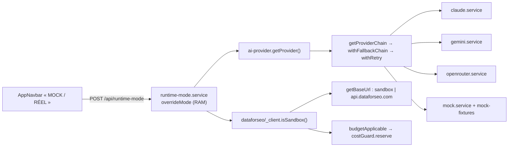

# Intégrations externes

Tous les appels vers un tiers partent du serveur, depuis `server/services/external/`. Deux aiguillages concentrent la logique de coût : le répartiteur d'IA ([`ai-provider.service.ts`](../server/services/external/ai-provider.service.ts)) et le transport DataForSEO ([`dataforseo/_client.ts`](../server/services/external/dataforseo/_client.ts)). Un seul interrupteur d'exécution, en mémoire du serveur, les fait passer en simulé ou en réel. Les autres intégrations (autocomplétion Google, Tavily, Search Console, modèle local) ne le consultent pas.

Le coût remonte au navigateur par deux canaux : le champ `usage` (`ApiUsage`) des réponses JSON et le sentinel `__USAGE__{…}` des flux, tous deux versés dans la pile d'activité ([Infrastructure transversale](20-infrastructure.md) : FR-INFRA-COST-LOG-STORE, FR-INFRA-API-WRAPPER).

## Interrupteur simulé / réel
*Exigences : FR-EXT-AI-MULTI-PROVIDER, FR-EXT-DATAFORSEO-SANDBOX · Design : DESIGN-EXT-DATAFORSEO-SANDBOX, DESIGN-EXT-AI-MULTI-PROVIDER (et DESIGN-INFRA-RUNTIME-MODE, [Infrastructure transversale](20-infrastructure.md))*

- **Code :** [`server/services/infra/runtime-mode.service.ts`](../server/services/infra/runtime-mode.service.ts) — `getRuntimeMode`, `setRuntimeMode`, `getEffectiveMode` ; [`server/routes/runtime-mode.routes.ts`](../server/routes/runtime-mode.routes.ts) ; [`src/stores/ui/runtime-mode.store.ts`](../src/stores/ui/runtime-mode.store.ts) — `useRuntimeModeStore` : `hydrate`, `setMode` (optimiste, retour arrière si le serveur refuse), `toggle` ; [`src/components/shared/AppNavbar.vue`](../src/components/shared/AppNavbar.vue) — bouton `.navbar-mode-toggle`, `onToggleMode`.
- **Données :** variable de module `overrideMode: 'mock' | 'real' | null` (RAM, perdue au redémarrage) ; `localStorage['runtime-mode']` côté navigateur.
- **API :** `GET /api/runtime-mode` → `{ data: { override, effective, envAiProvider, envDataforseoSandbox } }` ; `POST /api/runtime-mode` `{ mode: 'mock' | 'real' | null }` → `{ data: { override, effective } }`, 400 `VALIDATION_ERROR` sinon.
- **Règles et décisions :**
  - L'override prime sur la configuration. `mock` → fournisseur `mock` et bac à sable ; `real` → fournisseur `claude` (et non `AI_PROVIDER`) et production DataForSEO.
  - Sans override, `getEffectiveMode` vaut `mock` si `AI_PROVIDER=mock` **ou** `DATAFORSEO_SANDBOX=true`.
  - `hydrate` n'est appelé qu'au premier montage de la barre de navigation : si le serveur redémarre, il suit sa configuration jusqu'au rechargement de la page. `toggle` n'envoie jamais `null` : l'écran ne sait pas rendre la main à la configuration.
  - Consommateurs : `getProvider` (IA), `isSandbox` (URL, budget, rattachement des mesures groupées). Rien d'autre ne lit l'override.

## Coût des suites de tests
*Exigences : FR-EXT-TESTS-NO-COST*

- **Code :** [`tests/helpers/global-runtime-mode.ts`](../tests/helpers/global-runtime-mode.ts) — `setup` / `teardown`, déclaré en `globalSetup` de [`vitest.config.ts`](../vitest.config.ts) : lit l'override, pose `mock` (ou `real` si `TESTS_REELS=1`), restaure l'origine ; ne touche pas un serveur forcé `real`. [`tests/helpers/api-client.ts`](../tests/helpers/api-client.ts) — `isServerUp` (serveur forcé `real` = indisponible sauf `TESTS_REELS=1`), `TOLERATED_ENV_ERROR_CODES`, `expectSuccessOrKnownError`. [`tests/helpers/external-sources.ts`](../tests/helpers/external-sources.ts) — `dataForSeoConfigured` (identifiant absent ou `test` = non configuré). [`tests/helpers/test-context.ts`](../tests/helpers/test-context.ts) — `modeReel`. [`tests/browser-e2e/helpers/runtime-mode.ts`](../tests/browser-e2e/helpers/runtime-mode.ts) — `setMockMode`, `effectiveMode`. [`tests/browser-e2e/e2e-database.ts`](../tests/browser-e2e/e2e-database.ts) — `e2eUsesOwnDatabase` (faux si `PARCOURS_REEL=1`). [`tests/browser-e2e/parcours/bout-en-bout.parcours.test.ts`](../tests/browser-e2e/parcours/bout-en-bout.parcours.test.ts) — `REEL`. [`scripts/auto-article/index.ts`](../scripts/auto-article/index.ts) — `--mode=mock|real` (défaut `mock`), lecture de `GET /api/cost-status`.
- **CI :** [`.github/workflows/ci.yml`](../.github/workflows/ci.yml) écrit un `.env` avec `AI_PROVIDER=mock`, `MOCK_LATENCY_MS=50`, `DATAFORSEO_SANDBOX=true`, identifiants `test` remplacés par les secrets `DATAFORSEO_LOGIN` / `DATAFORSEO_PASSWORD` s'ils existent ; sans secret, l'étape Playwright est sautée avec un avertissement.
- **Règles et décisions :** le mode est un état global du serveur ; le poser par fichier de test rendait la main aux vraies API pendant que d'autres suites tournaient. Tavily, l'autocomplétion Google et la lecture des pages ne sont pas simulés : un test qui les touche appelle le vrai service (Tavily avec la clé du `.env` local).

## Transport DataForSEO et données de marché
*Exigences : FR-EXT-DATAFORSEO · Design : DESIGN-EXT-DATAFORSEO*

- **Code :** [`dataforseo/_client.ts`](../server/services/external/dataforseo/_client.ts) — `fetchDataForSeo` (renvoie `tasks[0].result[0]`), `fetchDataForSeoBatch` (renvoie `tasks[0].result`), `isSandbox`, `getBaseUrl`, `getAuthHeader` (Basic), `DataForSeoQuotaError`, `budgetApplicable`, constantes `DEFAULT_LOCATION_CODE = 2250`, `KEYWORD_OVERVIEW_BATCH_MAX = 700`, `SEARCH_INTENT_BATCH_MAX = 1000`, `DATAFORSEO_CACHE_TTL_MS` (7 j). [`dataforseo/keywords.ts`](../server/services/external/dataforseo/keywords.ts) — `fetchKeywordOverview`, `fetchKeywordOverviewBatch`, `fetchSearchIntentBatch`, `fetchRelatedKeywords`, `fetchKeywordSuggestions`, `pairWithRequested`. [`dataforseo/serp.ts`](../server/services/external/dataforseo/serp.ts) — `fetchSerp`, `fetchPaa`. [`dataforseo/brief.ts`](../server/services/external/dataforseo/brief.ts) — `getBrief(keyword, forceRefresh)`. [`dataforseo/cache.ts`](../server/services/external/dataforseo/cache.ts) — `readCache`, `writeCache`, `isCacheFresh` (audit). [`dataforseo/scoring.ts`](../server/services/external/dataforseo/scoring.ts) — audit de cocon. [`dataforseo.service.ts`](../server/services/external/dataforseo.service.ts) — ré-export de [`dataforseo/index.ts`](../server/services/external/dataforseo/index.ts).
- **Services DataForSEO appelés :** `/serp/google/organic/live/regular` (top 10), `/serp/google/organic/live/advanced` (PAA), `/dataforseo_labs/google/keyword_overview/live`, `related_keywords/live`, `keyword_suggestions/live`, `search_intent/live`, `keyword_ideas/live`, `/keywords_data/google_ads/search_volume/live`.
- **Données :** `keyword_metrics` (cache permanent partagé, lu par `getKeywordMetrics` / `isKeywordMetricsFresh`, 7 j ; écrit par `upsertKeywordKpis`, `upsertKeywordPaa`) et `keyword_serp_results` (`getSerpResults`) — [Infrastructure transversale](20-infrastructure.md) ; `external_api_cache` `cache_type='dataforseo'`, clé `slugify(keyword)`, TTL 7 j (ancien cache, encore écrit par `getBrief`).
- **API :** `POST /api/dataforseo/brief` `{ keyword, forceRefresh? }` → `{ data: DataForSeoCacheEntry & { fromCache } }` ; erreurs passées à `next(err)`. Appelée par [`src/stores/strategy/brief.store.ts`](../src/stores/strategy/brief.store.ts) — `fetchBrief`, `refreshDataForSeo` (`forceRefresh: true`), bouton de [`SerpDataTab.vue`](../src/components/panels/SerpDataTab.vue).
- **Règles et décisions :**
  - Relances : HTTP 429/500/503 jusqu'à 3 fois (1 s, 2 s, 4 s + 0 à 500 ms au hasard) ; statut interne 5xxxx une seule fois ; 429 persistant → `DataForSeoQuotaError`.
  - `getBrief` interroge ses quatre services en `Promise.allSettled` et `fetchKeywordOverviewBatch` / `fetchSearchIntentBatch` attrapent chaque paquet en échec : ces chemins avalent toute erreur, `CostBudgetError` comprise (écart consigné).
  - `pairWithRequested` : en bac à sable, la i-ème réponse (modulo leur nombre) va au i-ème mot-clé demandé ; en production, rattachement par `item.keyword`. Sans lui, aucun candidat n'est mesuré en mode simulé.
  - KPI absents = `null` (FR-INFRA-KPI-NULLABLE) ; seuls les mots liés du brief gardent un 0 par défaut.

## Plafond de dépense DataForSEO
*Exigences : FR-EXT-DATAFORSEO-COSTGUARD · Design : DESIGN-EXT-DATAFORSEO-COSTGUARD (et DESIGN-COST-DATAFORSEO-BUDGET / -RESERVE, [Qualités transverses (NFR)](21-qualites.md))*

- **Code :** [`server/services/external/dataforseo-cost-guard.ts`](../server/services/external/dataforseo-cost-guard.ts) — `CostBudgetError(endpoint, attemptedCostUsd, spentUsd, budgetUsd, windowMin)`, `estimateCallCostUsd`, `ENDPOINT_BASE_COST`, `ENDPOINT_PER_ITEM_COST`, `DEFAULT_UNKNOWN_ENDPOINT_COST = 0.005`, `costGuard.reserve` / `commit` (sans effet) / `getStatus` / `_reset`. Appelé par `fetchDataForSeo` et `fetchDataForSeoBatch` si `budgetApplicable()`.
- **Données :** tableau `entries` en mémoire du processus (horodatage, coût, service) ; purge à l'expiration de la fenêtre.
- **API :** `GET /api/dataforseo/cost-status` → `{ spentUsd, budgetUsd, windowMin, entries, sandbox }` (lu toutes les 15 s par [`CostLogPanel.vue`](../src/components/shared/CostLogPanel.vue)) ; `GET /api/cost-status` ([`cost-status.routes.ts`](../server/routes/cost-status.routes.ts)) → même état + `estimated: true` (CLI `auto:article`). Refus : 429 `DATAFORSEO_COST_BUDGET` `{ message, endpoint, spentUsd, budgetUsd, windowMin }` via [`error-handler.ts`](../server/utils/error-handler.ts) — `errorHandler` ou [`api-error.ts`](../server/utils/api-error.ts) — `respondWithError` ; 429 `DATAFORSEO_QUOTA_EXCEEDED` pour le quota.
- **Configuration :** `DATAFORSEO_COST_BUDGET_USD` (0,50), `DATAFORSEO_COST_WINDOW_MIN` (30), relues à chaque appel par `budgetUsd()` / `windowMs()` ; valeur absente, nulle ou invalide → défaut. Historique en RAM, perdu au redémarrage (voulu).
- **Règles et décisions :** le coût est imputé à la réservation, pour qu'une rafale de relances ne franchisse pas le plafond. Les tarifs sont des majorants de sécurité, à mettre à jour à la main. Le bac à sable renvoie `cost: 0`, d'où l'absence de budget : le compter bloquait des suites gratuites. Le code `DATAFORSEO_COST_BUDGET` n'est pas dans `KNOWN_ERROR_CODES` : il n'entre pas dans la pile d'activité.

## Autocomplétion Google
*Exigences : FR-EXT-AUTOCOMPLETE-GOOGLE · Design : DESIGN-EXT-AUTOCOMPLETE-GOOGLE*

- **Code :** [`server/services/external/autocomplete.service.ts`](../server/services/external/autocomplete.service.ts) — `fetchAutocomplete(keyword, lang='fr', country='fr')` → `AutocompleteSignal { suggestionsCount, suggestions, hasKeyword, position }`, `rateLimitWait` (1 req/s par processus), `EMPTY_SIGNAL`. Appel : `https://www.google.com/complete/search?q=…&client=chrome&hl=…&gl=…`, délai 3 s, un nouvel essai après 1,5 s sur 429/503.
- **Consommateurs :** [`intent-scan.service.ts`](../server/services/intent/intent-scan.service.ts) — `fetchAutocompleteMergedGrouped` ; [`keyword-radar.service.ts`](../server/services/keyword/keyword-radar.service.ts) ; [`keywords.routes.ts`](../server/routes/keywords.routes.ts) (validation de douleur, `POST /keywords/autocomplete-suggest`) ; [`keyword-scan.routes.ts`](../server/routes/keyword-scan.routes.ts).
- **Données :** lecture et écriture de `keyword_metrics.autocomplete_suggestions` (JSONB `[{ text, position }]`) et `autocomplete_source = 'google'` via `upsertKeywordAutocomplete` ; fraîcheur par `isKeywordMetricsFresh(fetchedAt, 1 | 0.02)`.
- **Règles et décisions :** liste vide = signal valide, jamais une erreur. La fraîcheur lit la colonne `fetched_at` commune à toute la ligne `keyword_metrics`, remise à jour par chaque écriture (KPI, PAA…). La table `keyword_autocomplete` n'est pas alimentée par ce service.

## Tavily (pages concurrentes)
*Exigences : FR-EXT-TAVILY*

- **Code :** [`server/services/article/content-gap.service.ts`](../server/services/article/content-gap.service.ts) — `searchWithTavily(keyword)` (`POST https://api.tavily.com/search`, `search_depth: 'advanced'`, `max_results: 5`), `analyzeContentGap` (Tavily puis `classifyWithTool` outil `analyze_content_gap`).
- **Données :** `keyword_metrics.content_gap_analysis`, resservie si `isKeywordMetricsFresh(fetchedAt)` (7 j) ; écrite par `upsertKeywordContentGap`.
- **Configuration :** `TAVILY_API_KEY` (absente → « TAVILY_API_KEY must be set in environment variables »).
- **Règles et décisions :** hors interrupteur simulé / réel. Le reste de l'analyse d'écart relève de l'Explorateur, décrit dans [Rédaction](17-redaction.md) (FR-EXP-CONTENT-GAP).

## Google Search Console
*Exigences : FR-EXT-GSC-OAUTH, FR-EXT-GSC-PERFORMANCE, FR-EXT-GSC-KEYWORD-GAP · Design : DESIGN-EXT-GSC-OAUTH, DESIGN-EXT-GSC-PERFORMANCE, DESIGN-EXT-GSC-KEYWORD-GAP*

- **Code :** [`server/services/external/gsc.service.ts`](../server/services/external/gsc.service.ts) — `loadToken`, `saveToken`, `refreshAccessToken`, `getValidToken` (renouvelle si l'expiration est à moins de 60 s), `getAuthUrl` (portée `webmasters.readonly`, `access_type=offline`, `prompt=consent`), `exchangeCode`, `isConnected` (= un jeton existe), `queryPerformance(siteUrl, startDate, endDate, dimensions = ['query','page'])` (`rowLimit: 1000`), `analyzeKeywordGap(articleUrl, targetKeywords, siteUrl)` (90 j). [`server/routes/gsc.routes.ts`](../server/routes/gsc.routes.ts). [`src/stores/external/gsc.store.ts`](../src/stores/external/gsc.store.ts) — `useGscStore` : `checkConnection`, `fetchPerformance`, `fetchKeywordGap` (sans appelant). [`src/views/PostPublicationView.vue`](../src/views/PostPublicationView.vue) — `pageMetrics`, `fetchData`, `connectGsc` ; route `/post-publication`, lien « GSC » de [`DashboardView.vue`](../src/views/DashboardView.vue).
- **Données :** jeton dans `data/gsc-token.json` (`GscToken { accessToken, refreshToken, expiresAt }`, [`shared/types/gsc.types.ts`](../shared/types/gsc.types.ts)) ; `external_api_cache` `cache_type='gsc'`, clé `slugify(siteUrl-startDate-endDate)`, TTL 24 h, et resservi seulement le même jour calendaire ; `localStorage['gsc_site_url']`.
- **API :** `GET /api/gsc/status` → `{ connected }` ; `GET /api/gsc/auth` → redirection Google ; `GET /api/gsc/callback?code=` → page HTML de confirmation ; `POST /api/gsc/performance` `{ siteUrl, startDate, endDate, dimensions? }` → `GscPerformance { siteUrl, startDate, endDate, rows: { keys[], clicks, impressions, ctr, position }[], cachedAt }` ; `POST /api/gsc/keyword-gap` `{ articleUrl, targetKeywords, siteUrl }` → `GscKeywordGap { articleUrl, matched, targetedNotIndexed, discoveredOpportunities }`. Erreurs 500 `GSC_ERROR`, `GSC_AUTH_ERROR`, `GSC_EXCHANGE_ERROR`, `GSC_PERFORMANCE_ERROR`, `GSC_GAP_ERROR`.
- **Configuration :** `GOOGLE_CLIENT_ID`, `GOOGLE_CLIENT_SECRET`, `GOOGLE_REDIRECT_URI` (défaut `http://localhost:${PORT}/api/gsc/callback`).
- **Règles et décisions :** le jeton reste un fichier (secret lié à l'installation, outil mono-utilisateur) : exception assumée à la règle « PostgreSQL uniquement ». La clé de cache ignore `dimensions`. `analyzeKeywordGap` filtre les lignes dont une clé contient `articleUrl` et lit la requête en `keys[0]`.

## Répartiteur d'IA et chaîne de secours
*Exigences : FR-EXT-AI-MULTI-PROVIDER, FR-EXT-AI-FALLBACK · Design : DESIGN-EXT-AI-MULTI-PROVIDER, DESIGN-EXT-AI-FALLBACK*

- **Code :** [`server/services/external/ai-provider.service.ts`](../server/services/external/ai-provider.service.ts) — `AIProvider`, `getProvider`, `getProviderChain`, `CANONICAL_ORDER = ['claude','gemini','openrouter']`, `TOOL_CAPABLE_PROVIDERS = ['claude','mock']`, `AIProviderQuotaError`, `AIProviderOverloadedError`, `AIProviderUnavailableError`, `extractStatus`, `isRetryable` (429, 500, 503), `mapToKnownError`, `withRetry` (3 essais, 1 s puis 2 s, 8 s au plus), `withFallbackChain(run, ctx, allowed?)`, `streamChatCompletion(system, user, maxTokens=4096, tools?)`, `classifyWithTool(system, user, tool, modelOrOptions?)`, `calculateCost`.
- **Contrats :** un flux rend des morceaux de texte puis `__USAGE__` + `ApiUsage { inputTokens, outputTokens, cacheReadTokens, cacheCreationTokens, model, estimatedCost, stopReason?, webSources? }`. `classifyWithTool` rend `{ result, usage }`.
- **Correspondance des erreurs :** 429 ou message quota / crédits → `AIProviderQuotaError` ; 503 ou « overload / UNAVAILABLE » → `AIProviderOverloadedError` ; 401 / 403 / 404 ou modèle introuvable / clé invalide → `AIProviderUnavailableError`. Ces trois-là passent au suivant ; tout le reste remonte. HTTP : 429 `AI_PROVIDER_QUOTA_EXCEEDED`, 503 `AI_PROVIDER_OVERLOADED` (seulement dans les routes qui passent par `errorHandler` / `respondWithError`) ; `AIProviderUnavailableError` n'a pas de code dédié (500).
- **Flux SSE des panneaux :** [`ai-panel-runner.service.ts`](../server/services/external/ai-panel-runner.service.ts) — `runAiPanelStream` écrit l'en-tête 200 avant d'appeler l'IA ; une erreur devient un événement `error` `{ message }`, jamais un code HTTP.
- **Configuration :** `AI_PROVIDER` (`claude` par défaut), `AI_PROVIDER_NO_FALLBACK=1`, `MOCK_LATENCY_MS`.
- **Règles et décisions :**
  - Le fournisseur est relu à chaque appel. `mock` n'a pas de chaîne ; `AI_PROVIDER_NO_FALLBACK=1` réduit la chaîne au principal.
  - Flux : `withFallbackChain` sonde le premier morceau avant de rendre l'itérateur, pour pouvoir basculer ; après, une coupure remonte (`mapToKnownError`), sans reprise par un autre fournisseur.
  - Avec des outils (recherche web), la chaîne est filtrée sur `TOOL_CAPABLE_PROVIDERS` ; vide → `AIProviderUnavailableError` « La recherche web exige Claude… ». Gemini et OpenRouter ne reçoivent jamais d'outil.
  - `classifyWithTool` : pour Gemini, OpenRouter et la simulation, le schéma est ajouté au message (`schemaHint`) ; le modèle demandé n'est transmis qu'à Claude ; la simulation reçoit en plus `Tool : <nom>`.
  - `calculateCost(usage)` choisit le barème par le nom du modèle : `mock*`, `gemini*`, contient `:free` ou `/` (OpenRouter), sinon Claude.
  - La bascule n'est tracée que par `log.warn('… fallback to 
 (primary exhausted)')`.

## Claude
*Exigences : FR-EXT-CLAUDE · Design : DESIGN-EXT-CLAUDE*

- **Code :** [`server/services/external/claude.service.ts`](../server/services/external/claude.service.ts) — `getClient` (initialisation paresseuse), `PRICING` (Sonnet 4.6 et 4.5 : 3/15 $ ; Haiku 4.5 : 0,8/4 $ ; Opus 4.6 : 15/75 $ par million de jetons), `calculateCost` (modèle inconnu → 3/15, lecture de cache ×0,1, écriture ×1,25), `classifyWithTool` (modèle par défaut `claude-haiku-4-5-20251001`, `tool_choice` forcé), `streamChatCompletion` (`CLAUDE_MODEL` ou `claude-sonnet-4-6`, prompt système marqué `cache_control: ephemeral`), `webSearchTool(zone?, maxUses = 3)` (`web_search_20250305`, `country: 'FR'`, `timezone: 'Europe/Paris'`, ville tirée de la zone), `webSourcesOf`, `toStopReason`. [`claude-stream.ts`](../server/services/external/claude-stream.ts) — `filterToolPreambles` écarte les annonces de recherche quand des outils sont actifs.
- **Configuration :** `ANTHROPIC_API_KEY`, `CLAUDE_MODEL`.
- **Règles et décisions :** la sortie structurée passe par un outil forcé, pas par l'analyse d'un texte libre. Anthropic n'expose pas ses tarifs : la table est tenue à la main. Le coût ne compte que les jetons, pas les frais de recherche web.

## Gemini et OpenRouter
*Exigences : FR-EXT-GEMINI, FR-EXT-AI-MULTI-PROVIDER · Design : DESIGN-EXT-GEMINI*

- **Code :** [`gemini.service.ts`](../server/services/external/gemini.service.ts) — `DEFAULT_MODEL = GEMINI_MODEL ?? 'gemini-2.0-flash'`, `PRICING` (2.0 Flash / Flash Lite : 0 ; 2.5 Flash : 0,10/0,40 ; 2.5 Pro : 1,25/10), `getClient` (`VITE_GEMINI_API_KEY`), `calculateGeminiCost`, `classifyJsonGemini` (`responseMimeType: 'application/json'`, température 0,2 ; JSON invalide → `Error('Gemini returned invalid JSON…')`), `streamChatCompletionGemini` (température 0,7). [`openrouter.service.ts`](../server/services/external/openrouter.service.ts) — `DEFAULT_MODEL = OPENROUTER_MODEL ?? 'meta-llama/llama-3.3-70b-instruct:free'`, `assertFreeModel` (refuse tout modèle sans `:free`), `getHeaders` (`OPEN_ROUTER_API_KEY`), `classifyJsonOpenRouter` (`response_format: json_object`), `streamChatCompletionOpenRouter` (lecture SSE, `usage: { include: true }`), `calculateOpenRouterCost` = 0.
- **Règles et décisions :** un JSON invalide n'est pas une saturation : il remonte sans bascule. Gemini n'a pas de cache de prompt système.

## Simulation (fournisseur `mock`)
*Exigences : FR-EXT-AI-MULTI-PROVIDER · Design : DESIGN-EXT-AI-MULTI-PROVIDER (et DESIGN-COST-AI-MOCK)*

- **Code :** [`mock.service.ts`](../server/services/external/mock.service.ts) — modèle `mock-provider-v1`, `SIMULATED_LATENCY_MS` (200 ms ; 100 ms au plus pour un flux), `classifyJsonMock` (fixture de l'outil nommé `Tool : …`, sinon `findMatchingFixture` par mots du nom ou du schéma, sinon `generateFromSchema` : `'mock value'`, 0, `false`, premier choix d'une énumération), `streamChatCompletionMock` (premier `matcher` qui répond, sinon texte « [Mock provider] Réponse simulée… » ; paquets de 15 caractères, 10 ms d'écart ; `webSources` simulées), `ensureFixturesLoaded`, `calculateMockCost` = 0. [`mock-registry.ts`](../server/services/external/mock-registry.ts) — `toolFixtures`, `streamFixtures`, `registerToolFixture`, `registerStreamFixture` (module séparé pour casser un cycle d'import). [`mock-fixtures/index.ts`](../server/services/external/mock-fixtures/index.ts) — charge `article-draft`, `cocoon-child`, `enrichment`, `auto-meta-priority`, `discovery`, `radar`, `intent`, `content-gap`, `streams`, `strategy`, `generate`, `long-tail-suggest`, `captain-paa-judge`, `auto-intake`, `auto-placement`.
- **Règles et décisions :** une fixture doit copier le format du bloc d'exemple du prompt (`server/prompts/*.md`), pas le type TypeScript : écrite d'après le code, elle ne peut pas révéler qu'un prompt demande autre chose. Le mode simulé valide le chemin, pas le contrat avec l'IA réelle.
- **Reconnaître l'appel par sa vraie consigne :** un `matcher` se cale sur un texte que l'appel réel contient. `captain-ai-panel` ([`mock-fixtures/streams.ts`](../server/services/external/mock-fixtures/streams.ts)) cherchait « capitaine » ou « verdict » dans le message utilisateur, que la route écrit seulement `Analyse le mot-clé "…" pour un article de niveau …` : il ne répondait jamais, et le conseil recevait la réponse par défaut. Il reconnaît désormais la consigne système de `capitaine-ai-panel.md` (« analyser un mot-clé candidat pour un article de blog »). Garde : [`tests/unit/services/mock-captain-ai-panel.test.ts`](../tests/unit/services/mock-captain-ai-panel.test.ts), dans `verify` (`NFR-COST-AI-MOCK`), qui rend la vraie consigne et rejoue le vrai message.

## Modèle local de similarité
*Exigences : FR-EXT-EMBEDDINGS · Design : DESIGN-EXT-EMBEDDINGS*

- **Code :** [`server/services/external/embedding.service.ts`](../server/services/external/embedding.service.ts) — `MODEL_ID = 'Xenova/multilingual-e5-small'`, `LOAD_TIMEOUT_MS = 60000`, `ensureModel` (drapeaux `loading`, `loadFailed` définitif), `embedTexts` (paquets de 32, préfixes `query:` / `passage:`, moyenne normalisée), `cosineSimilarity` (produit scalaire), `computeSemanticScores(topic, texts)` → `number[] | null` (`[]` si aucun texte).
- **Consommateurs :** `intent-scan.service.ts`, `keyword-radar.service.ts` ([Moteur — Radar et Capitaine](14-radar-capitaine.md)).
- **Règles et décisions :** pas de préchargement au démarrage (60 s par redémarrage de développement). `null` = indisponible, jamais 0. Dépendance `@huggingface/transformers`.

## Retour du coût et des erreurs vers la pile d'activité
*Exigences : FR-EXT-AI-MULTI-PROVIDER, FR-EXT-DATAFORSEO-COSTGUARD (voir FR-INFRA-COST-LOG-STORE, FR-INFRA-API-WRAPPER)*

- **Code :** [`src/services/api.service.ts`](../src/services/api.service.ts) — `pushUsageIfPresent` (réponses `apiPost` seulement), `KNOWN_ERROR_CODES` (`DATAFORSEO_QUOTA_EXCEEDED`, `AI_PROVIDER_QUOTA_EXCEEDED`, `AI_PROVIDER_OVERLOADED`), `reportKnownError`, `ApiRequestError`, `apiStream` (usage lu dans l'événement `done`). [`src/stores/ui/cost-log.store.ts`](../src/stores/ui/cost-log.store.ts) — `useCostLogStore.addEntry`, `addMessage`. [`CostLogPanel.vue`](../src/components/shared/CostLogPanel.vue) — `refreshCostStatus` (15 s), `formatCost` ($), `shortModel` ; panneau fixé en bas à gauche.
- **Règles et décisions :** le modèle affiché est celui de `usage.model`, donc celui qui a vraiment répondu.
