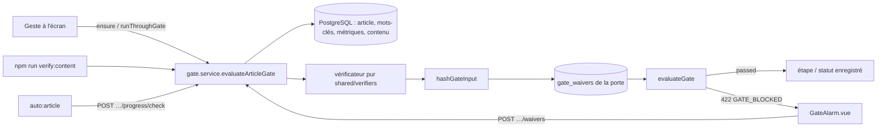

# Infrastructure transversale

Cette partie décrit les briques communes à tous les domaines : caches, persistance transverse, tuyau réseau front ↔ back, pile d'activité, mode simulé, module de scores, chargeur de prompts, règles par type, étapes de progression, portes de qualité et dérogations, démarrage du serveur, schéma de la base et outillage. Les portes vues depuis la Rédaction (règles du premier jet et de la publication) relèvent de [Rédaction](17-redaction.md).

Circulation des données, en bref :
- **Écran → serveur** : tout passe par [`src/services/api.service.ts`](../src/services/api.service.ts) (`apiGet/apiPost/apiPut/apiPatch/apiDelete/apiStream`) → routes Express sous `/api` ([`server/index.ts`](../server/index.ts)) → services → PostgreSQL ([`server/db/client.ts`](../server/db/client.ts)).
- **Serveur → sources externes** : chaque service lit d'abord son cache (`external_api_cache`, `keyword_metrics`, tables SERP), n'appelle DataForSEO / l'IA qu'en cas d'absence, puis écrit.
- **Serveur → IA** : `loadPrompt` rend un `.md` de [`server/prompts/`](../server/prompts/) avec les variables de l'appelant et les globales (date, zone, stratégie du cocon).
- **Portes** : l'écran demande un verdict au serveur ([`server/services/gates/gate.service.ts`](../server/services/gates/gate.service.ts)), seul évaluateur, qui applique un vérificateur pur de [`shared/verifiers/`](../shared/verifiers/).

## Cache court des sources externes
*Exigences : FR-INFRA-API-CACHE, FR-INFRA-API-CACHE-PURGE, FR-INFRA-EXTERNAL-API-CACHE, FR-INFRA-GET-OR-FETCH · Design : DESIGN-INFRA-API-CACHE, DESIGN-INFRA-API-CACHE-PURGE, DESIGN-INFRA-EXTERNAL-API-CACHE, DESIGN-INFRA-GET-OR-FETCH*

- **Code :** [`server/db/cache-helpers.ts`](../server/db/cache-helpers.ts) — `getCached(type, key)` (filtre `expires_at > NOW()`), `setCached(type, key, data, ttlMs)` (UPSERT `ON CONFLICT (cache_key, cache_type)`), `deleteCached`, `getOrFetch(type, key, ttlMs, fetcher)` (cascade lire → appeler → écrire, journal `Cache HIT/MISS`), `slugify` (source unique des clés). [`server/index.ts`](../server/index.ts) — `setInterval` d'une heure : `DELETE FROM external_api_cache WHERE expires_at < NOW()`, `log.debug` du nombre purgé, `log.error` en cas d'échec.
- **Données :** `external_api_cache(id, cache_key, cache_type, data JSONB, cached_at, expires_at)`, `UNIQUE (cache_key, cache_type)`, index sur `expires_at` et `(cache_key, cache_type)`.
- **Types de cache écrits aujourd'hui :**

| `cache_type` | TTL | Producteur |
|---|---|---|
| `dataforseo` | 7 j | [`server/services/external/dataforseo/cache.ts`](../server/services/external/dataforseo/cache.ts) (`CACHE_TYPE`, `DATAFORSEO_CACHE_TTL_MS` dans `_client.ts`) |
| `serp-top` | 7 j | [`server/services/keyword/keyword-measure.service.ts`](../server/services/keyword/keyword-measure.service.ts) (`SERP_TOP_CACHE`, via `getOrFetch`) |
| `radar` | 7 j | [`server/services/infra/radar-cache.service.ts`](../server/services/infra/radar-cache.service.ts) |
| `long-tail-suggest` | 7 j | [`server/services/keyword/long-tail-suggest.service.ts`](../server/services/keyword/long-tail-suggest.service.ts) |
| `keyword-discovery` | 24 h | [`server/services/keyword/keyword-discovery.service.ts`](../server/services/keyword/keyword-discovery.service.ts) (`getOrFetch`, clés `seed-…` / `domain-…`) |
| `discussions` | 48 h | [`server/services/intent/community-discussions.service.ts`](../server/services/intent/community-discussions.service.ts) (`getOrFetch`) |
| `validation` | 1 j | [`server/routes/keywords.routes.ts`](../server/routes/keywords.routes.ts) (`POST /keywords/validate-pain`) |
| `gsc` | 1 j | [`server/services/external/gsc.service.ts`](../server/services/external/gsc.service.ts) |
| `suggest` | 1 h | [`server/services/keyword/suggest.service.ts`](../server/services/keyword/suggest.service.ts) (4 clés : `alphabet-`, `questions-`, `intents-`, `prepositions-`) |

- **API :** `GET /api/articles/:id/external-cache` (lit `autocomplete` pour le capitaine) et `DELETE /api/articles/:id/external-cache` (vide les types `autocomplete`, `autocomplete-intent`, `paa`, `serp`, `validate` dont la clé commence par le slug du capitaine) — [`server/routes/article-explorations.routes.ts`](../server/routes/article-explorations.routes.ts).
- **Règles et décisions :** une seule table générique, rangée par `(type, clé)` : ajouter une source ne demande ni table ni migration. La clé est aussi rangée par mode (`modeScopedKey`, FR-EXT-DATAFORSEO-SANDBOX) : en simulé, elle porte le préfixe `mock:`, pour qu'une réponse du bac à sable ou de l'IA simulée ne soit jamais resservie en réel, ni l'inverse ; `gsc` et `suggest` (`MODE_INDEPENDENT_CACHE_TYPES`) restent partagés, leurs sources étant hors interrupteur. Détail : [Intégrations externes](18-integrations.md) § « Interrupteur simulé / réel ». La lecture filtre déjà l'expiration : la purge est un nettoyage, pas une correction. `forceRefresh` (brief DataForSEO `getBrief`, audit `auditCocoonKeywords`) contourne le cache. Écart connu : la purge par article vise des types que plus personne n'écrit (cf. conflits).

## Mémoire permanente des mots-clés et relevé SERP
*Exigences : FR-INFRA-KEYWORD-METRICS, FR-INFRA-PAA-CACHE, FR-INFRA-SCRAPE-CORPUS-NEUTRE · Design : DESIGN-INFRA-KEYWORD-METRICS, DESIGN-INFRA-PAA-CACHE, DESIGN-INFRA-SCRAPE-CORPUS-NEUTRE*

- **Code :** [`server/services/keyword/keyword-metrics.service.ts`](../server/services/keyword/keyword-metrics.service.ts) (en-tête `AUTHORITY:`) — `getKeywordMetrics`, `upsertKeywordKpis` (COALESCE : jamais `null` sur une valeur connue), `upsertKeywordAutocomplete`, `upsertKeywordPaa`, `upsertKeywordLocalAnalysis`, `upsertKeywordContentGap`, `upsertKeywordLocalComparison`, `isKeywordMetricsFresh(fetchedAt, ttlDays = 7)`, `deleteKeywordMetrics`. [`server/services/infra/paa-cache.service.ts`](../server/services/infra/paa-cache.service.ts) — `readPaaCache(keyword, requiredDepth)` (fraîcheur 1 jour, profondeur suffisante, liste vide jamais servie), `writePaaCache`. [`server/services/external/scrape-corpus.service.ts`](../server/services/external/scrape-corpus.service.ts) (en-tête `AUTHORITY:`, `NEVER IMPORTS`) — `fetchAndPersist(keyword, level)` : mémoire 1 h (`MEMORY_CACHE_TTL_MS`, LRU `MEMORY_CACHE_MAX_ENTRIES = 100`) → base si `getSerpResultsFresh` (7 j) → sinon `fetchSerp` + `fetchPaa` + lecture des pages (`FETCH_TIMEOUT_MS = 10 s`), écriture en une transaction (`withSerpTransaction`) ; `fromCache: 'memory' | 'db' | null` ; `getHeadings`, `getTextContent` (sans filtre d'âge), `getPaaQuestions`, `extractTextContent`, `classifyIsBlog`. Accès SQL : [`server/services/keyword/keyword-serp.service.ts`](../server/services/keyword/keyword-serp.service.ts).
- **Données :** `keyword_metrics` PK `(keyword, lang, country)`, colonnes KPI nullables, `autocomplete_suggestions` / `paa_questions` JSONB, `local_analysis`, `content_gap_analysis`, `local_comparison`, `intent_label` (CHECK 4 valeurs), `from_sandbox` (mesure obtenue en simulé : effacée au passage en réel avec ses tables filles, `purgeSandboxMeasures` ; FR-EXT-DATAFORSEO-SANDBOX, détail dans [Intégrations externes](18-integrations.md)), **un seul `fetched_at`** pour toute la ligne. Tables filles (FK cascade) : `keyword_serp_results`, `keyword_serp_scrapes` (FK sur le résultat), `keyword_paa_questions`, `keyword_autocomplete`.
- **Règles et décisions :** la fraîcheur est appliquée par chaque lecteur, pas par la base (brief, scan, mesure, content gap : 7 j ; PAA : 1 j). Toute écriture d'un groupe de colonnes remet `fetched_at` à maintenant : une PAA récente « rafraîchit » en apparence des KPI anciens (cf. conflits). Une page en erreur est enregistrée avec `headings = []` et texte vide ; les autres pages du relevé sont gardées. Le service de relevé ignore ses consommateurs (Lieutenants, Lexique) : un test grep le garde.

## Persistance du travail par article et par cocon
*Exigences : FR-INFRA-ARTICLE-STRATEGIES, FR-INFRA-COCOON-STRATEGIES, FR-INFRA-MICRO-CONTEXTS, FR-INFRA-KEYWORDS-SEO, FR-INFRA-PAA-EXPLORATIONS, FR-INFRA-LIEUTENANT-EXPLORATIONS, FR-INFRA-KEYWORD-DISCOVERIES, FR-INFRA-LOCAL-ENTITIES · Design : DESIGN-INFRA-ARTICLE-STRATEGIES, DESIGN-INFRA-COCOON-STRATEGIES, DESIGN-INFRA-MICRO-CONTEXTS, DESIGN-INFRA-KEYWORDS-SEO, DESIGN-INFRA-PAA-EXPLORATIONS, DESIGN-INFRA-LIEUTENANT-EXPLORATIONS, DESIGN-INFRA-KEYWORD-DISCOVERIES, DESIGN-INFRA-LOCAL-ENTITIES*

| Donnée | Table | Code (lecture / écriture) | API |
|---|---|---|---|
| Stratégie d'article | `article_strategies(article_id PK, data JSONB, completed_steps INTEGER, updated_at)` | [`strategy.service.ts`](../server/services/strategy/strategy.service.ts) `getStrategy` / `saveStrategy` (UPSERT) | `GET/PUT /api/strategy/:id` |
| Stratégie de cocon | `cocoon_strategies(cocoon_id PK, data JSONB, generated_at)` | [`cocoon-strategy.service.ts`](../server/services/strategy/cocoon-strategy.service.ts) `getCocoonStrategy(slug)` (résolution nom / slug, `cocoonStrategySchema.parse`, `null` si illisible), `saveCocoonStrategy` (fusion + validation avant écriture) | `GET/PUT /api/strategy/cocoon/:cocoonSlug` |
| Micro-contexte | `article_micro_contexts(article_id PK, angle, tone, directives, target_word_count, updated_at)` | [`data.service.ts`](../server/services/infra/data.service.ts) `loadArticleMicroContext`, `saveArticleMicroContext`, `retainTargetWordCount` (COALESCE : ne remplace pas un choix) | `GET/PUT /api/articles/:id/micro-context` |
| Pool de mots-clés | `keywords_seo(id, cocoon_name, mot_clef, type_mot_clef, statut, created_at)` | `data.service.ts` `getKeywordsByCocoon`, `loadKeywordsDb`, `addKeyword` (doublon global → `existingCocoon`), `replaceKeyword`, `updateKeywordStatus`, `deleteKeyword` ; lecture tolérante `rowToKeyword` + [`shared/utils/keyword-type.ts`](../shared/utils/keyword-type.ts) `parseKeywordType` | `GET /api/keywords/:cocoon`, `POST/PUT /api/keywords` (400 `INVALID_TYPE`, 409 `DUPLICATE`), `PATCH /api/keywords/:keyword/status`, `DELETE /api/keywords/:keyword` |
| PAA jugées | `paa_explorations(… UNIQUE (article_id, keyword, question))` | `data.service.ts` `saveCaptainExploration` (UPSERT via `measureDb`), `getCaptainExplorations` | `GET/POST /api/articles/:id/captain-explorations` |
| Lieutenants proposés | `lieutenant_explorations(… score, kpis JSONB, status, UNIQUE (article_id, keyword))` | `data.service.ts` `saveLieutenantExplorations` (UPSERT), `getLieutenantExplorations` (`ORDER BY score DESC NULLS LAST`), `archiveLieutenantExplorations` (mots-clés donnés, sinon tout l'article ; appelée par « Tout réinitialiser ») | `GET/POST /api/articles/:id/lieutenant-explorations`, `POST /api/articles/:id/lieutenants/archive` |
| Découverte | `keyword_discoveries(seed, lang PK, sources_json, ai_analysis_json, fetched_at)` | [`discovery-cache.service.ts`](../server/services/infra/discovery-cache.service.ts) `checkCache`, `loadCache`, `saveCache` (inscrit `expiresAt` à 30 j), `clearCache` ; SQL dans [`keyword-discovery-db.service.ts`](../server/services/keyword/keyword-discovery-db.service.ts) (racine rangée par mode : `mock:<seed>` en simulé, `modeScopedKey`) | `GET /api/discovery-cache/check`, `GET /api/discovery-cache/load`, `POST /api/discovery-cache/save`, `DELETE /api/discovery-cache` |
| Lieux locaux | `local_entities(id, name, type, aliases TEXT[], region)` | [`local-entities.service.ts`](../server/services/infra/local-entities.service.ts) `getEntities` (seul appelant : `loadZoneContext`) ; `scoreLocalAnchoring` exporté sans appelant | aucune |

- **Écran :** bandeau de découverte [`src/components/moteur/discovery/KeywordDiscoveryCacheBar.vue`](../src/components/moteur/discovery/KeywordDiscoveryCacheBar.vue) (« Dernière analyse », « Charger », « Rafraîchir » → `clear`).
- **Règles et décisions :** `completed_steps` est un compteur interne du Cerveau, distinct des étapes de progression. Les statuts restent du `TEXT` gérés par l'application : pool `suggested | validated | rejected` (`KeywordStatus`), lieutenants `suggested | locked | eliminated | archived` (`LieutenantKeywordStatus`). `kpis` des lieutenants fige les indicateurs au moment de la proposition. La découverte n'expire jamais d'elle-même : `expiresAt` est écrit mais pas lu, `isKeywordDiscoveryFresh` et `saveKeywordDiscoveryAiAnalysis` n'ont pas d'appelant ; l'analyse IA est rangée dans `sources_json` (`analysisResult`). Le référentiel local se charge hors application (sauvegarde / seed) ; aucune route n'écrit. Détail des écrans : [Cerveau](11-cerveau.md), [Moteur — Discovery](13-discovery.md), [Moteur — Radar et Capitaine](14-radar-capitaine.md), [Moteur — Lieutenants](15-lieutenants-structure-lexique.md).

## Tuyau réseau, validation et erreurs
*Exigences : FR-INFRA-API-WRAPPER, FR-INFRA-API-STREAM, FR-INFRA-ZOD-SHARED, FR-INFRA-ERROR-HANDLER · Design : DESIGN-INFRA-API-WRAPPER, DESIGN-INFRA-API-STREAM, DESIGN-INFRA-ZOD-SHARED, DESIGN-INFRA-ERROR-HANDLER*

- **Code front :** [`src/services/api.service.ts`](../src/services/api.service.ts) — `apiGet/apiPost/apiPut/apiPatch/apiDelete` (préfixe `/api`, réponse `{ data }`, option `contract` : contrat d'affichage de [`shared/contracts/`](../shared/contracts/)) ; `pushUsageIfPresent` (POST seulement : `usage` → `addEntry`), `pushDbOpsIfPresent` (`dbOps` à la racine ou sous `data` → `addDbEntry`) ; `KNOWN_ERROR_CODES` (`DATAFORSEO_QUOTA_EXCEEDED`, `AI_PROVIDER_QUOTA_EXCEEDED`, `AI_PROVIDER_OVERLOADED`) → `reportKnownError` → `addMessage('error', …)` ; `handleApiError` lève `ApiRequestError(message, status, code, details)`. `apiStream(path, body, callbacks, options)` : POST puis lecture SSE, événements `chunk` (`content` ou `html`), `section-start`, `section-done`, `done` (`usage`, `outline` / `metadata` / charge utile, contrat appliqué), `error` ; le type d'événement survit entre paquets réseau ; `AbortError` → `{ aborted: true }` ; l'`usage` final est poussé dans la pile. [`src/composables/editor/useStreaming.ts`](../src/composables/editor/useStreaming.ts) enveloppe `apiStream`.
- **Code serveur :** [`server/routes/generate/_helpers.ts`](../server/routes/generate/_helpers.ts) — `SSE_HEADERS`, `consumeStream` (sépare le texte du `USAGE_SENTINEL` du fournisseur). [`server/utils/error-handler.ts`](../server/utils/error-handler.ts) `errorHandler` (monté en dernier) et [`server/utils/api-error.ts`](../server/utils/api-error.ts) `respondWithError` : `DataForSeoQuotaError` → 429 `DATAFORSEO_QUOTA_EXCEEDED`, `CostBudgetError` → 429 `DATAFORSEO_COST_BUDGET` (+ `spentUsd`, `budgetUsd`, `windowMin`, `endpoint`), `AIProviderQuotaError` → 429, `AIProviderOverloadedError` → 503, sinon 500 `INTERNAL_ERROR` avec `err.message`. Schémas partagés : [`shared/schemas/`](../shared/schemas/) (15 fichiers `*.schema.ts`, Zod 4) ; routes : `safeParse(req.body)` → 400 `VALIDATION_ERROR`.
- **Règles et décisions :** le wrapper ne couvre que le trafic vers `/api` ; les appels du serveur vers les API tierces sont hors wrapper. Aucune occurrence de `fetch(` dans `src/` hors `api.service.ts`. Un refus 422 porte l'évaluation dans `details`, lue par `isGateBlocked`. Écarts connus (cf. conflits) : pas d'arrêt serveur sur annulation SSE (aucun `req.on('close')`) ; `respondWithError` n'est utilisé que par 4 fichiers de routes et `next(err)` par un seul, les autres routes répondent 500 elles-mêmes ; 25 lectures `req.body as …` sans schéma (7 fichiers) ; `DATAFORSEO_COST_BUDGET` absent de `KNOWN_ERROR_CODES`.

## Pile d'activité
*Exigences : FR-INFRA-COST-LOG-STORE · Design : DESIGN-INFRA-COST-LOG-STORE*

- **Code :** [`src/stores/ui/cost-log.store.ts`](../src/stores/ui/cost-log.store.ts) `useCostLogStore` — `entries` (`unshift`), types `ApiActivityEntry | DbActivityEntry | MessageActivityEntry` (`level: 'api' | 'db' | 'info' | 'warning' | 'error'`), `addEntry`, `addDbEntry`, `addMessage`, `removeEntry`, `clearAll`, `toggleCollapsed`, `totalCost`, `entryCount`. Affichage : [`src/components/shared/CostLogPanel.vue`](../src/components/shared/CostLogPanel.vue) (monté dans [`src/App.vue`](../src/App.vue) ; « Coûts API », « Effacer », dépense DataForSEO via `GET /api/dataforseo/cost-status`). Libellé d'action : [`src/utils/api-label.ts`](../src/utils/api-label.ts) `labelFromUrl` (dont « Longues traînes du Radar », « Jugement des questions PAA »). Entrée : [`src/services/api.service.ts`](../src/services/api.service.ts) `pushUsageIfPresent`, `pushDbOpsIfPresent` (réponses JSON et événement `done` d'`apiStream`).
- **Données serveur, opérations en base :** [`server/middleware/db-telemetry.middleware.ts`](../server/middleware/db-telemetry.middleware.ts) — `patchPoolForTelemetry()` (appelé au démarrage de [`server/index.ts`](../server/index.ts)) instrumente `pool.query` et les clients rendus par `pool.connect()` (transactions de `linking.service.ts` `saveMatrix` et `keyword-serp.service.ts` `withSerpTransaction`) ; `dbTelemetryMiddleware` (monté par `app.use('/api', …)` après `express.json`, avant les routes) ouvre un contexte `AsyncLocalStorage` par requête et ajoute à `res.json` un champ `dbOps` à la racine (nouvel objet : celui de la route n'est pas modifié) ; `requestDbOps()` rend le même relevé pour l'événement `done` des panneaux IA en flux ([`ai-panel-runner.service.ts`](../server/services/external/ai-panel-runner.service.ts) `runAiPanelStream` : propositions de lieutenants, tri du Lexique). Déclarés en plus par les routes elles-mêmes ([`server/utils/db-telemetry.ts`](../server/utils/db-telemetry.ts) `measureDb` ou `DbOp` écrit à la main dans `data.service.ts`), lectures comprises : `GET/PUT /api/articles/:id/keywords`, `GET/POST /api/articles/:id/captain-explorations`, `PATCH …/captain-explorations/ai-panel`, `GET/POST /api/articles/:id/lieutenant-explorations`.
- **Règles et décisions (écriture significative) :** `inferOp` classe la requête ; seules `insert`, `update`, `upsert`, `delete` sont notées (une lecture, `BEGIN` ou `COMMIT` ne le sont pas). `summarize` : une ligne par couple (type, table), `rowCount` et `ms` additionnés, dans l'ordre de la première écriture ; un couple que la route déclare déjà dans son `dbOps` est écarté (pas de double compte avec `measureDb`). Ne sont pas notés : les appels au format « rappel » (celui que `pool.query` emploie en interne, déjà noté), les requêtes « soumises » (curseurs), tout ce qui tourne hors requête (purge horaire du cache) ou après la réponse. Gardes : [`tests/unit/utils/db-telemetry-middleware.test.ts`](../tests/unit/utils/db-telemetry-middleware.test.ts), [`tests/unit/architecture/db-telemetry-mounted.test.ts`](../tests/unit/architecture/db-telemetry-mounted.test.ts) (montage dans `server/index.ts` et appel de `requestDbOps` dans le runner).
- **Règles et décisions (un appel, une ligne) :** le coût d'une réponse JSON est inscrit une fois, par `apiPost` (champ `usage` de la réponse ; libellé `labelFromUrl`, ou `usageLabel` pour le préciser). L'appelant ne l'ajoute pas lui-même, même quand la route renvoie aussi `_apiUsage`. Discovery (lot 1), la génération des mots-clés du Radar (`useResonanceScore` `generate`), la génération des metas (`editor.store` `generateMeta`) et l'analyse content gap (`ContentGapPanel.vue`) ajoutaient une seconde ligne : chaque appel était compté deux fois (recette 2026-09-30). Une action qui fait plusieurs appels les additionne sur sa ligne : le jugement des questions PAA (`captain-paa-judge.service.ts` `runPaaJudgmentsForArticle`, un appel Haiku par candidat, `sumUsages`), comme la reprise de la relecture ou le premier jet par chapitres. Gardes : [`tests/unit/composables/discovery-cost-log-once.test.ts`](../tests/unit/composables/discovery-cost-log-once.test.ts), [`tests/unit/composables/cost-log-once-radar-meta-gap.test.ts`](../tests/unit/composables/cost-log-once-radar-meta-gap.test.ts), [`tests/unit/composables/cost-log-long-tail-paa-judge.test.ts`](../tests/unit/composables/cost-log-long-tail-paa-judge.test.ts).
- **Règles et décisions (coûts rendus depuis le lot 6) :** longues traînes du Radar : `long-tail-suggest.service.ts` `generateLongTailSuggestions` rend l'`usage` de `classifyWithTool` (`null` sur une réponse du cache `long-tail-suggest`), que `long-tail-suggest.routes.ts` ajoute à `data` hors du contrat. Jugement PAA : `judgePaaForKeyword` passe l'`usage` à son rappel `onUsage` dès la réponse de l'IA, avant le contrat (un jugement payé puis écarté compte), et la route `POST /articles/:id/captain/judge-paa` ([`keywords.routes.ts`](../server/routes/keywords.routes.ts)) ajoute la somme à `data`. Gardes : [`tests/unit/routes/ai-cost-usage.routes.test.ts`](../tests/unit/routes/ai-cost-usage.routes.test.ts), `tests/unit/services/long-tail-suggest.service.test.ts`, `tests/unit/services/captain-paa-judge.service.test.ts`.
- **Règles et décisions :** pas de persistance (session navigateur). Le store n'a pas d'en-tête `AUTHORITY:`.

## Mode simulé / réel
*Exigences : FR-INFRA-RUNTIME-MODE · Design : DESIGN-INFRA-RUNTIME-MODE*

- Détail complet (code, API, règles) : [Intégrations externes](18-integrations.md) (« Interrupteur simulé / réel ») ; vue d'ensemble : [Mode simulé / réel](04-ia-et-prompts.md).
- **Règles et décisions :** pas de table : c'est un état de session du serveur, perdu à son redémarrage ; l'écran le lui renvoie quand il l'a perdu, au chargement puis à chaque resynchronisation (`hydrate`, `startAutoResync` : focus, onglet visible, 15 s). `isSandbox()` et `getProvider()` lisent le même mode effectif (une seule autorité).

## Scores et indicateurs nullables
*Exigences : FR-INFRA-SCORE-MODULE, FR-INFRA-NO-SCORE-FALLBACK, FR-INFRA-KPI-NULLABLE, FR-INFRA-KPI-DISPLAY-DASH, FR-INFRA-KPI-CONSISTENCY, FR-INFRA-KPI-SCORING-NULLSAFE · Design : DESIGN-INFRA-SCORE-MODULE, DESIGN-INFRA-NO-SCORE-FALLBACK, DESIGN-INFRA-KPI-NULLABLE, DESIGN-INFRA-KPI-DISPLAY-DASH, DESIGN-INFRA-KPI-CONSISTENCY, DESIGN-INFRA-KPI-SCORING-NULLSAFE*

- **Code :** [`shared/score/index.ts`](../shared/score/index.ts) (seul point d'entrée, alias `@shared/score`) — `Score = number | null`, `formatScore`, `formatVolume` (« 1.2k »), `formatCpc` (« 1.23 € »), `formatKd`, `formatPercent` (`fromRatio`), `SCORE_PLACEHOLDER = '—'`, `compareScores` (décroissant, `null` en bas), `compareScoresAsc` (croissant, `null` en bas), `averageScores`, `maxScore`, `minScore`, `countValidScores`. Scores null-safe : [`server/services/external/dataforseo/scoring.ts`](../server/services/external/dataforseo/scoring.ts) `computeCompositeScore` (renormalisation de `KEYWORD_SCORE_WEIGHTS`), `generateAlerts` (`missing_metrics` info) ; [`shared/kpi-scoring.ts`](../shared/kpi-scoring.ts) `computeVerdict` (`GRAY` « Données insuffisantes ») ; [`shared/scoring-kpi.ts`](../shared/scoring-kpi.ts) `computeMarketScore` ; [`server/routes/keywords.routes.ts`](../server/routes/keywords.routes.ts) `computeServerVerdict` (catégorie `incertaine`). Garde-fou : [`eslint.config.ts`](../eslint.config.ts) `no-restricted-syntax` (5 sélecteurs : identifiant, membre, avant-dernier membre, chaînage optionnel ×2 ; motif `Score|Volume|Difficulty|Cpc|Competition|Density`), désactivé pour `shared/score/**` ; [`.dependency-cruiser.cjs`](../.dependency-cruiser.cjs) `score-internal-only-via-index`.
- **Règles et décisions :** même expression pour afficher et trier ; `null` toujours en bas, quel que soit le sens. Écarts connus : `fetchRelatedKeywords` / suggestions ([`dataforseo/keywords.ts`](../server/services/external/dataforseo/keywords.ts)) gardent `?? 0` sous `eslint-disable` (type `RelatedKeyword` non nullable) ; formats à la main dans `DataForSeoPanel.vue`, `CaptainSidePanel.vue`, `DiscoverySourcesList.vue` ; `getCocoonKeywordMetrics` ([`keyword-queries.service.ts`](../server/services/queries/keyword-queries.service.ts)) moyenne la difficulté sur le nombre de volumes connus et rend `0` sans donnée (route sans consommateur à l'écran) ; `opportunityIndex` n'est plus produit par le serveur et `useOpportunityScore` le remplace par 0.

## Chargeur de prompts et couches de contexte
*Exigences : FR-INFRA-PROMPT-LOADER, FR-INFRA-PROMPT-LAYERS, FR-INFRA-COCOON-STRATEGIES, FR-INFRA-MICRO-CONTEXTS, FR-INFRA-LOCAL-ENTITIES · Design : DESIGN-INFRA-PROMPT-LOADER, DESIGN-INFRA-PROMPT-LAYERS*

- **Code :** [`server/utils/prompt-loader.ts`](../server/utils/prompt-loader.ts) — `loadPrompt(name, variables, { cocoonSlug?, escapeKeys? })` : lit `server/prompts/<name>.md` ; échappe les clés `escapeKeys` non vides (`escapePromptContent` : `INSTRUCTION_SEQUENCES` codés en `\u00XX`, enveloppe `<user-content>`) ; `loadGlobals` (`strategy_context` toujours posé, `today`/`year` et `zone`/`zone_landmarks` lus seulement si le modèle les cite) ; `renderPromptTemplate` (sections `{{#k}}…{{/k}}` jusqu'à 5 passes, puis `{{k}}` remplacé par fonction en une passe) ; mode strict : `PromptTemplateError` (manquantes, inutilisées, clé d'`escapeKeys` absente) hors `NODE_ENV=production`, `log.error` sinon ; stratégie du cocon ajoutée en fin si le `.md` ne cite pas `strategy_context`. `PROMPT_GLOBALS`, `templateKeys`, `buildCocoonStrategyBlock`. [`server/services/strategy/prompt-context.service.ts`](../server/services/strategy/prompt-context.service.ts) — `formatFrenchDate`, `currentYear` (Europe/Paris), `loadZoneContext` (`theme_config.data.avatar.location` via `getThemeConfig` ; `entitiesOfZone` + `normPlace` ; `LANDMARK_GROUPS` `region` / `quartier` / `lieu`, entreprises exclues ; base illisible → vide + `log.warn`). Blocs d'appelants : [`server/routes/generate/_helpers.ts`](../server/routes/generate/_helpers.ts) `pickStrategyContext`, `buildStrategyContext`, `buildKeywordContext`, `buildMicroContextBlock` (premier jet ; blocs en ligne dans `outline.routes.ts` et `brief-explain.routes.ts`, sans longueur) ; [`strategy-prompts.service.ts`](../server/services/strategy/strategy-prompts.service.ts) (Cerveau, `buildThemeContextBlock`). Inventaire généré : [`scripts/prompts-reference.ts`](../scripts/prompts-reference.ts) (`ROLES`) → [`design/05-prompts-reference.md`](../design/05-prompts-reference.md) (50 prompts) ; guide : [`design/04-ia-et-prompts.md`](../design/04-ia-et-prompts.md).
- **Données :** lecture seule de `cocoon_strategies`, `theme_config` (singleton `id = 1`), `local_entities`.
- **Règles et décisions :** un `.md` ne contient aucune logique hors sections vides/pleines, aucune année, aucun lieu, aucun nombre par type. La stratégie arrive soit par la globale `{{strategy_context}}` (appel avec `cocoonSlug` : panneaux IA du Moteur si l'écran envoie `cocoonSlug`, candidats du Cerveau, longue traîne, micro-contexte suggéré, mots-clés d'intention), soit par la variable d'appelant `{{strategyContext}}` (`pickStrategyContext` : article, sinon cocon — sommaire, premier jet, passes, réécriture ; la réduction ne reçoit que la stratégie d'article, `buildStrategyContext(getStrategy(articleId))`). Les réponses de stratégie du Cerveau ne sont pas échappées ; le texte d'article, de section, de chapitre, la sélection et la consigne libre le sont. Tests : `tests/unit/utils/prompt-template.test.ts`, `tests/unit/architecture/prompt-variables.test.ts` et `prompts-reference.test.ts` (dans `npm run verify`), `tests/unit/coherence/prompts-no-hardcoded.test.ts`, `tests/unit/services/prompt-context.service.test.ts`, `strategy-prompts.service.test.ts`.

## État du cocon pour les générations
*Exigences : FR-INFRA-COCOON-CONTEXT · Design : DESIGN-INFRA-COCOON-CONTEXT*

- **Code :** [`shared/cocoon-context.ts`](../shared/cocoon-context.ts) `renderCocoonContext({ cocoonName, tree, focus?, parentSectionText? })` (rendu pur ; `PARENT_SECTION_MAX_CHARS = 1200`, `renderNode`, `describe`, `cut`). [`server/services/strategy/cocoon-context.service.ts`](../server/services/strategy/cocoon-context.service.ts) (en-tête `AUTHORITY:`, lecture seule) — `cocoonContextForArticle(articleId)` (`''` hors cocon), `cocoonContextForNewArticle(cocoonId, parentId, section)` (`null` si cocon absent), `parentSectionText` (chapitre retrouvé par `sectionKey`, 2 000 caractères lus). Appelants (variable `cocoon_context`, pas une globale) : [`child-candidates.service.ts`](../server/services/strategy/child-candidates.service.ts) (obligatoire : absence → 404 `COCOON_NOT_FOUND`), [`keyword-ai-panel.routes.ts`](../server/routes/keyword-ai-panel.routes.ts) (`.catch(() => '')`), [`article-draft.routes.ts`](../server/routes/generate/article-draft.routes.ts) (échec → `log.warn`).
- **Données :** lecture de `articles` (cocon, `parent_id`, `parent_section`, `completed_checks`, `captain_keyword_locked`, `suggested_keyword`), `cocoons.nom`, `article_content.content`, `article_keywords.hn_structure`, via `getCocoonTree` ([Cerveau](11-cerveau.md)).
- **Règles et décisions :** lu à chaque appel, jamais mis en cache. Mot-clé d'un nœud = capitaine verrouillé, sinon suggéré ; « rédigé » = `REDACTION_DRAFT_ACCEPTED`.

## Règles par type d'article
*Exigences : FR-INFRA-TYPE-RULES-SSOT · Design : DESIGN-INFRA-TYPE-RULES-SSOT*

- **Code :** [`shared/constants/article-type-rules.ts`](../shared/constants/article-type-rules.ts) — `ArticleTypeRules`, `ARTICLE_TYPE_RULES` (clés `ArticleLevel` : `pilier`, `intermediaire`, `specifique`), `CHILD_SUMMARY_WORDS`, `DEFAULT_TARGET_WORDS_FALLBACK = 2000`, `targetWordsFor`, `describeTypeRules` (texte de `{{type_rules}}`), `describeUnknownTypeFaq`. Traduction type en base (`Pilier`, `Intermédiaire`, `Spécialisé`) ↔ niveau : [`shared/utils/article-level.ts`](../shared/utils/article-level.ts) (`parseArticleLevel`, `articleTypeDbToLevel`, `articleLevelToDbType`).
- **Lecteurs :** prompts via `{{type_rules}}` (`outline.routes.ts`, `keyword-ai-panel.routes.ts` `typeRulesFor`, `article-draft.routes.ts`, `enrichment.service.ts`, `child-candidates.service.ts`, `cocoon-add-article-prompt.ts`) ; calculs (`target-word-count.service.ts`, `article-draft.routes.ts` `targetWordsFor`, `gate.service.ts` `draftGate`) ; écran (`src/stores/strategy/brief.store.ts`, `src/components/panels/SeoPanel.vue`, `src/views/MoteurView.vue`, `src/composables/editor/article-proposals/builders.ts`) ; alertes (`shared/seo-validators.ts` : `wordsFloor`, `h2Floor`) ; vérificateurs (`lieutenants.ts`, `structure.ts`, `publish.ts`, `enrichment.ts`) ; simulation (`mock-fixtures/streams.ts`, `strategy.ts`) ; mode automatique (`scripts/auto-article/heuristics/pick-lieutenants.ts`).
- **Règles et décisions :** plancher d'alerte ≠ borne basse ; `h2Min/h2Max` comptent les H2 de fond, `h2Floor` tous les H2 rédigés. Test : `tests/unit/coherence/type-rules-ssot.test.ts` (prompts sans nombre par type, calculs = source, aucune autre table par type hors exceptions motivées).

## Étapes de progression
*Exigences : FR-INFRA-WORKFLOW-CHECKS-CONSTANTS · Design : DESIGN-INFRA-WORKFLOW-CHECKS-CONSTANTS*

- **Code :** [`shared/constants/workflow-checks.constants.ts`](../shared/constants/workflow-checks.constants.ts) — `MOTEUR_DISCOVERY_DONE`, `MOTEUR_RADAR_DONE`, `MOTEUR_CAPITAINE_LOCKED`, `MOTEUR_LIEUTENANTS_LOCKED`, `MOTEUR_HN_LOCKED`, `MOTEUR_LEXIQUE_VALIDATED`, `MOTEUR_CHECKS`, `checksRemovedWith` (`CHECK_DEPENDENTS` : capitaine et lieutenants → structure), `REDACTION_DRAFT_ACCEPTED`, `REDACTION_CHECKS`, `ALL_WORKFLOW_CHECKS`, `WorkflowCheck`. Validation : [`shared/schemas/article-progress.schema.ts`](../shared/schemas/article-progress.schema.ts) (`writeCheckRegex` : `moteur:*` ou `redaction:draft_accepted` ; `readCheckRegex` tolère `cerveau:*` / `redaction:*`). Écriture : [`data.service.ts`](../server/services/infra/data.service.ts) `addArticleCheck` (sans doublon + `check_timestamps`), `removeArticleChecks`, `saveArticleProgress`.
- **Données :** `articles.completed_checks TEXT[]`, `articles.check_timestamps JSONB`.
- **API :** `POST /api/articles/:id/progress/check` (porte si `CHECK_GATES[check]`), `POST /api/articles/:id/progress/uncheck` (`checksRemovedWith`), `PUT /api/articles/:id/progress` (chaque étape nouvelle passe sa porte), `GET /api/articles/:id/progress` — [`server/routes/articles.routes.ts`](../server/routes/articles.routes.ts).
- **Règles et décisions :** `REDACTION_DRAFT_ACCEPTED` est collante (absente de `CHECK_DEPENDENTS`) ; la création d'un enfant peut l'accorder au parent après avoir joué sa porte (`cocoon-article.service.ts`, [Cerveau](11-cerveau.md)). Les pastilles ne lisent que `MOTEUR_CHECKS`.

## Portes de qualité et dérogations
*Exigences : FR-INFRA-VERIFIER-SHARED, FR-INFRA-GATE-WAIVER · Design : DESIGN-INFRA-VERIFIER-SHARED, DESIGN-INFRA-GATE-WAIVER*

- **Code partagé (pur) :** [`shared/verifiers/gate.ts`](../shared/verifiers/gate.ts) — `GateLevel`, `GATE_IDS` (`captain-lock`, `lieutenants-lock`, `lexique-lock`, `hn-lock`, `draft`, `publish`), `GATE_LABELS`, `gateTitle` (élision « d'»), `GateIssue` (`rule`, `level`, `message`, `risk?`, `excerpt?`, `alternatives?`, `fingerprint?`), `GateEvaluation`, `WaivedIssue`, `WAIVER_CATEGORIES`, `WAIVER_CATEGORY_LABELS`, `MIN_WAIVER_REASON_LENGTH = 20`, `waiverProblem`, `WaiverDraft` (`rule`, `fingerprint`, `category?`, `reason?`), `waiverDraftsFrom` (renvoie l'empreinte de chaque point lu), `pointFingerprint` (portes du texte `draft` / `publish` : `{ point: textPointKind(rule), message, excerpt }` ; portes du Moteur : `{ gate: inputHash, rule }`), `textPointKind` (règle sans suffixe d'élément, `DRAFT_TO_PUBLISH_RULES`), `withFingerprints`, `evaluateGate` (même porte ; même empreinte de point, ou — dérogation d'avant le 2026-09-30 — même `rule` et même `inputHash` de porte ; recevable ; niveau ≠ `technique`), `hashGateInput` (FNV-1a 32 bits sur JSON à clés triées par code de caractère), `worstLevel`. Vérificateurs : `captain.ts`, `lieutenants.ts`, `structure.ts`, `lexique.ts`, `draft.ts`, `publish.ts` (`waiver-reconfirm:<porte>:<règle>` 🟠) ; hors portes : `enrichment.ts`, `cocoon-hierarchy.ts`.
- **Code serveur :** [`server/services/gates/gate.service.ts`](../server/services/gates/gate.service.ts) (en-tête `AUTHORITY: gate_waivers`) — `CHECK_GATES`, `evaluateArticleGate(articleId, gateId, { keyword? })` (`captainGate`, `lieutenantsGate`, `hnGate`, `lexiqueGate`, `draftGate`, `publishGate` ; `withFingerprints` avant `evaluateGate` ; `log.info('[gate] évaluation')`), `saveGateWaivers` (réévalue ; refuse une alerte disparue, un point dont l'empreinte n'est plus celle lue — « Ce point a changé depuis que vous l’avez lu… » —, une réponse irrecevable ; écrit `input_hash` = empreinte du point), `listArticleWaivers`. [`server/routes/gates.routes.ts`](../server/routes/gates.routes.ts) (`waiversBodySchema`). [`server/routes/articles.routes.ts`](../server/routes/articles.routes.ts) `respondGateBlocked` (422).
- **Code front :** [`src/stores/ui/gate-alarm.store.ts`](../src/stores/ui/gate-alarm.store.ts) — `evaluate`, `open`, `ensure`, `submit`, `cancel`, `runThroughGate` (rejoue une fois), `isGateBlocked` (forme `{ code: 'GATE_BLOCKED', details }`). [`src/components/shared/GateAlarm.vue`](../src/components/shared/GateAlarm.vue) (une instance dans `App.vue`, `role="alertdialog"`, piège du focus, Échap = annuler, pas de fermeture au clic extérieur, réponses remises à zéro à chaque nouvelle empreinte de porte ; `intro` accordée au nombre de points et à leurs niveaux : une case « J’ai lu » par 🟠, une raison par 🔴).
- **Outils :** [`scripts/verify-content.ts`](../scripts/verify-content.ts) + [`scripts/verify-content-gates.ts`](../scripts/verify-content-gates.ts) (`publishGateIssues` → avertissement `publish-gate-refused`, `describeWaivers`) ; [`scripts/auto-article/checks.ts`](../scripts/auto-article/checks.ts) (`emitCheck`, `describeGateRefusal`, `saveThenEmit`) ; [`scripts/reconcile-hn-checks.ts`](../scripts/reconcile-hn-checks.ts) et [`scripts/backfill-cocoon.ts`](../scripts/backfill-cocoon.ts) (rattrapages qui rejouent `hn-lock` / `draft`).
- **Données :** `gate_waivers(id, article_id → articles ON DELETE CASCADE, gate_id, rule, level CHECK attention|risque, category CHECK NULL|4 valeurs, reason, input_hash, created_at, UNIQUE (article_id, gate_id, rule, input_hash))`, index `idx_gate_waivers_article` ; écriture `INSERT … ON CONFLICT … DO UPDATE SET level, category, reason, created_at = now()`. `input_hash` porte l'empreinte du point dérogé ; les lignes écrites avant le 2026-09-30 portent l'empreinte de toute la porte, lue par la clause de compatibilité d'`evaluateGate` (aucune migration de schéma ni de données). Fiche : [`data-flows/gate-waivers.md`](data-flows/gate-waivers.md).
- **API :** `GET /api/articles/:id/gates/:gateId?keyword=` → `{ data: GateEvaluation }` (chaque point avec son `fingerprint` ; 400 `VALIDATION_ERROR`, 404/500 `GATE_ERROR`) ; `POST /api/articles/:id/gates/:gateId/waivers` `{ keyword?, waivers: 1..50 × { rule, fingerprint, category?, reason? } }` → `{ data: { evaluation, refused } }` ; `GET /api/articles/:id/waivers` → `{ data: GateWaiver[] }` ; `POST …/progress/check`, `PUT …/progress`, `PUT /api/articles/:id/status` (`publié`) → 422 `{ error: { code: 'GATE_BLOCKED', message, details: GateEvaluation } }`.

| Porte | Étape gardée | Empreinte de porte (`hashInput`) | Empreinte d'un point (ce qu'une dérogation couvre) |
|---|---|---|---|
| `captain-lock` | `MOTEUR_CAPITAINE_LOCKED` | mot-clé normalisé, niveau, volume, nb brut de suggestions, verdict, intention SERP, intention attendue (alternatives exclues ; forme inchangée depuis la création) | empreinte de porte + règle |
| `lieutenants-lock` | `MOTEUR_LIEUTENANTS_LOCKED` | niveau, capitaine, lieutenants triés, revendications du cocon qui recoupent ceux de l'article (pistes exclues) | empreinte de porte + règle |
| `hn-lock` | `MOTEUR_HN_LOCKED` | niveau, capitaine, titres `niveau:texte`, lieutenants, capitaines du cocon recoupés par un H2, ville (premier segment de la zone) | empreinte de porte + règle |
| `lexique-lock` | `MOTEUR_LEXIQUE_VALIDATED` | termes normalisés triés | empreinte de porte + règle |
| `draft` | `REDACTION_DRAFT_ACCEPTED` | contenu, capitaine, longueur visée, nombre de H2 du sommaire | nature du point (`textPointKind`), message, extrait |
| `publish` | statut `publié` | titre, slug, niveau, contenu, méta, capitaine, lieutenants, enfants, liens non publiés, empreintes amont, dérogations amont debout | nature du point, message, extrait ; point amont : son empreinte d'origine ; reconfirmation : point + réponse d'origine |

- **Règles et décisions :** le serveur est le seul évaluateur ; le navigateur n'exécute que `waiverDraftsFrom` / `worstLevel` / `MIN_WAIVER_REASON_LENGTH` pour griser le bouton, et renvoie l'empreinte du point lu. Une dérogation vaut pour son point et les données de ce point (décision du 2026-09-30) : l'empreinte de porte ne sert plus qu'aux dérogations d'avant, valables tant que la porte n'a pas changé. Pour les portes du Moteur, les données d'un point sont le choix jugé ; pour le texte, le point lui-même. La porte garde l'étape et le statut, pas l'enregistrement des décisions ni du texte. Une règle multi-éléments met l'élément dans `rule` (`lieutenant-cannibalization:<mot>`, `lexique-generic-term:<terme>`, `hn-lieutenant-missing:<l>`, `hn-overlaps-article:<titre>`). `publish` rejoue les quatre portes amont et préfixe leurs points (`<porte>:<règle>`) ; `draft` n'est pas rejouée, mais ses dérogations couvrent le même point du texte à la publication (reconfirmation 🟠). Pas de colonne auteur (outil local mono-utilisateur). L'audit tolère un refus (avertissement). Le mode automatique ne déroge jamais seul : une porte toute 🟠 se reconnaît au terminal (« J'ai lu, continuer ? [o/N] », mêmes `waiverDraftsFrom` que l'alarme, empreintes comprises), cf. [Mode automatique](06-mode-automatique.md). Détail des règles de chaque porte : § 21 (Capitaine), § 23 à § 25 (Lieutenants, Structure, Lexique), § 27 (Rédaction).

## Démarrage du serveur, santé, journal
*Exigences : FR-INFRA-LOGGER, FR-INFRA-HEALTH-CHECK, FR-INFRA-DB-CONNECTION-CHECK · Design : DESIGN-INFRA-LOGGER, DESIGN-INFRA-HEALTH-CHECK, DESIGN-INFRA-DB-CONNECTION-CHECK*

- **Code :** [`server/utils/logger.ts`](../server/utils/logger.ts) — `log.debug/info/warn/error`, `LEVELS`, `getCallerInfo` (dossier/fichier:ligne), couleurs `chalk`, sortie console seulement ; réglages [`logs.config.ts`](../logs.config.ts) (`level`, `showTimestamp`, `showFilePath`, `emoji`). [`server/index.ts`](../server/index.ts) — `express.json({ limit: '5mb' })`, CORS limité à `http://localhost:*`, `GET /api/health` → `{ data: { status: 'ok' } }` (sans base), montage des routes sous `/api`, `errorHandler` en dernier, `app.listen` puis `SELECT 1` (« PostgreSQL connected », ou `log.error` avec `hint` selon `ECONNREFUSED` / `28P01` / `3D000`), purge horaire du cache, `setContractReporter` (journal des contrats d'affichage).
- **Règles et décisions :** la vérification de la base ne bloque pas le démarrage. La santé est attendue par la CI (`curl` en boucle) ; Playwright attend le port, `predev` lance `db:check`.

## Schéma de la base et outillage
*Exigences : FR-INFRA-KEYWORD-METRICS, FR-INFRA-GATE-WAIVER (et toutes les tables ci-dessous) · Design : DESIGN-INFRA-INTENT-EXPLORATIONS-LEGACY*

- **Code :** [`server/db/schema.sql`](../server/db/schema.sql) — instantané lisible (26 tables), en-tête avec empreinte SHA-256, commit git, état de l'arbre ; seule référence de l'état courant. [`server/db/bootstrap.sql`](../server/db/bootstrap.sql) — schéma rejouable (`pg_dump --schema-only`), même empreinte ; la CI crée sa base avec. [`server/db/changes/`](../server/db/changes/) — changements datés et idempotents (`2026-09-25-gate-waivers.sql`, `2026-09-25-article-parent.sql`). `server/db/migrations/_archive/` : historique seulement.
- **Scripts :** `db:apply` ([`scripts/db-apply-change.ts`](../scripts/db-apply-change.ts) : un fichier de `server/db/changes/`, en transaction) → `db:snapshot` ([`scripts/db-snapshot.ts`](../scripts/db-snapshot.ts), régénère aussi `bootstrap.sql` via `generateBootstrap`) ; `db:check` ([`scripts/db-check.ts`](../scripts/db-check.ts) : empreinte de la base vivante = celle du snapshot, exit 1 sinon ; dans `predev` et `verify`) ; `db:bootstrap` ; `db:backup` (dump complet dans `data/_backup_pg_*.sql`) ; `db:clean-tests` (simulation par défaut, `--confirm`) ; `db:reconcile-hn`, `db:backfill-cocoon` ; `pretest:browser` → [`scripts/e2e-test-db.ts`](../scripts/e2e-test-db.ts) (base dédiée `blog_redactor_seo_test`).
- **Tests :** `tests/unit/architecture/db-bootstrap-sync.test.ts` (dans `verify` : même empreinte, mêmes tables, pas de `\restrict`) ; `tests/unit/coherence/design-tables-matrix.test.ts` (toute table de `schema.sql` figure dans la matrice ci-dessous ; `intent_explorations` absente) ; `tests/unit/coherence/db-tables-coverage.test.ts` (producteurs / consommateurs ciblent la bonne table ; `keyword_intent_analyses` jamais relue).
- **Règles et décisions :** jamais de nouveau JSON dans `data/` pour une donnée vivante. Tout changement de schéma : fichier daté idempotent → `db:apply` → `db:snapshot` → commit de `schema.sql` et `bootstrap.sql` → ligne dans la matrice ci-dessous.

## Garde-fous de qualité du code
*Exigences : FR-INFRA-CHECK-HEALTH, FR-INFRA-DEPENDENCY-CRUISER, FR-INFRA-NO-SCORE-FALLBACK · Design : DESIGN-INFRA-CHECK-HEALTH, DESIGN-INFRA-DEPENDENCY-CRUISER*

- **Code :** [`package.json`](../package.json) — `verify` = `verify:lint` (oxlint) + `verify:types` (vue-tsc + scripts auto) + `verify:unit` ([`vitest.verify.config.ts`](../vitest.verify.config.ts) : `tests/unit/shared`, `scripts`, `architecture` et quelques services purs) + `verify:content` + `db:check` ; `verify:full` ajoute ESLint, `check:cycles` (madge) et `test:check` ; `check:health` = `lint` (oxlint + eslint, avec `--fix`) + `type-check` + `check:cycles` + `check:dead` (knip) + `check:arch` (depcruise). [`.dependency-cruiser.cjs`](../.dependency-cruiser.cjs) — `no-server-in-src`, `no-circular`, `score-internal-only-via-index` (erreurs), `no-orphans`, `no-deprecated-core` (avertissements). Commit : [`.husky/pre-commit`](../.husky/pre-commit) → `lint-staged` (oxlint + eslint `--fix` sur les fichiers indexés). CI : [`.github/workflows/ci.yml`](../.github/workflows/ci.yml) (types + `vitest run tests/unit tests/functional` ; intégration sur `bootstrap.sql` ; Playwright si DataForSEO configuré).
- **Règles et décisions :** la règle anti-`?? 0` est une règle ESLint : elle bloque au commit et dans `verify:full` / `check:health`, pas dans `npm run build` ni dans `verify`. Les tests `tests/unit/coherence/*` (dont `type-rules-ssot`, `prompts-no-hardcoded`, `design-tables-matrix`) tournent en CI et dans `test:unit`, pas dans `verify`.

## Matrice tables ↔ exigences

Elle est dans [Modèle de données](02-donnees.md#matrice-tables--exigences).
