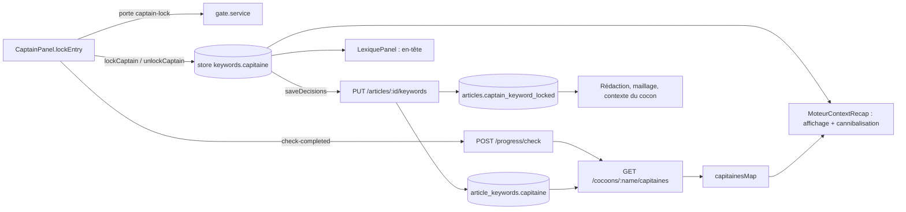

# Data Flow — captain-keyword-locked

> **Description métier :** le mot-clé principal choisi pour un article, le « Capitaine » (il donnera le titre, le H1 et l'URL). Tant qu'aucun Capitaine n'est verrouillé, l'article n'a que le mot-clé suggéré par le Cerveau (`articles.suggested_keyword`).
> **Type/format :** texte libre, rangé à deux endroits : `article_keywords.capitaine` (chaîne vide = pas de Capitaine) et sa copie `articles.captain_keyword_locked` (`NULL` = pas de Capitaine).
> **Références :** [14 — Radar et Capitaine](../14-radar-capitaine.md) § « Capitaine — verrouillage, porte et étape » ; tables : [02 — Modèle de données](../02-donnees.md) ; portes et étapes : [20 — Infrastructure](../20-infrastructure.md). L'étape `moteur:capitaine_locked` a sa propre fiche : [completed-checks.md](completed-checks.md).

## Producteurs

Qui crée ou met à jour cette donnée :

1. **Verrouiller** — `lockEntry(idx)` dans [`CaptainPanel.vue`](../../src/components/moteur/CaptainPanel.vue), mode `workflow` :
   1. la porte `captain-lock` est vérifiée **avant** tout changement : `gateAlarm.ensure(articleId, 'captain-lock', { keyword })` ([`gate-alarm.store.ts`](../../src/stores/ui/gate-alarm.store.ts)). Porte refusée sans dérogation, vérification impossible, ou article changé pendant l'alarme : rien ne change ;
   2. le store change : `lockCaptain(keyword, …)` pose `capitaine`, `richCaptain.keyword` et `richCaptain.status = 'locked'` ; `setRootKeywords` pose les racines explorées de la carte ;
   3. `saveKeywords` (alias de `saveDecisions`) envoie `PUT /api/articles/:id/keywords`. En cas d'échec, l'état d'avant revient, un message s'affiche et l'étape n'est pas demandée ;
   4. seulement ensuite, `check-completed` (`MOTEUR_CAPITAINE_LOCKED`) part vers `MoteurView`.

   Le mot-clé verrouillé est toujours `originalCard.keyword`, jamais la racine affichée sur la carte (FR-CAP-LOCK-INTEGRITY).
2. **Déverrouiller** — `requestUnlock` → `performUnlock` : `unlockCaptain()` (capitaine `''`, `richCaptain.keyword = ''`, `status = 'suggested'`), `saveKeywords`, puis `check-removed`. Si des Lieutenants sont verrouillés, [`UnlockLieutenantsModal.vue`](../../src/components/moteur/UnlockLieutenantsModal.vue) propose de les garder ou de les archiver (`archiveLockedLieutenants`).
3. **Enregistrement serveur** — `PUT /api/articles/:id/keywords` ([`keywords.routes.ts`](../../server/routes/keywords.routes.ts)) exige `capitaine` (400 sinon) et appelle `saveArticleKeywords` ([`data.service.ts`](../../server/services/infra/data.service.ts)) :
   - UPSERT de `article_keywords` ; un champ absent du corps garde sa valeur en base ;
   - copie `updateArticleCaptainKeyword(id, capitaine non vide ? capitaine : null)`. Un échec de la copie est seulement journalisé (`log.warn`).
4. **Réécriture par les autres onglets** — tout `saveDecisions` (Lieutenants, Lexique) et `saveStructure` (Structure) renvoient le `capitaine` en mémoire. Le Capitaine est donc réécrit à chaque enregistrement de décisions ([`article-keywords.store.ts`](../../src/stores/article/article-keywords.store.ts)).
5. **Étape** — `emitCheckCompleted` de [`useMoteurArticleSync.ts`](../../src/composables/moteur/useMoteurArticleSync.ts) passe par `gateAlarm.runThroughGate` → `POST /api/articles/:id/progress/check` (422 `GATE_BLOCKED` si la porte refuse) ; `handleCheckRemoved` → `POST …/progress/uncheck`. Pour `MOTEUR_CAPITAINE_LOCKED`, les deux relisent ensuite la carte des capitaines (`refreshCapitainesMap`), une fois la réponse du serveur arrivée pour l'ajout.
6. **Réconciliation au montage** — `onMounted` de `CaptainPanel` : Capitaine verrouillé sans étape → `check-completed` ; étape sans Capitaine → `check-removed` (FR-MOT-CHECK-RECONCILIATION).
7. **Hors application** — [`scripts/clear-article-lock.ts`](../../scripts/clear-article-lock.ts) remet la copie à `NULL` sans toucher `article_keywords`.

Le chemin `lockCaptaine` / `unlockCaptaine` du mode `libre` existe encore dans `CaptainPanel` mais n'a plus d'appelant (cf. chapitre 14).

## Persistance

| Emplacement | Rôle | Écrit par | Lu par |
|---|---|---|---|
| `article_keywords.capitaine` TEXT | **autorité** | `saveArticleKeywords` | `getArticleKeywords`, `getArticleKeywordsByCocoon` (→ `GET /api/cocoons/:name/capitaines`), portes, `getArticleChildren` |
| `articles.captain_keyword_locked` TEXT NULL | copie | `updateArticleCaptainKeyword` (appelé par `saveArticleKeywords`), `clear-article-lock.ts` | champ `Article.captainKeywordLocked` : Rédaction, maillage, contexte du cocon, porte (en dernier recours) |
| `articles.completed_checks` ∋ `moteur:capitaine_locked` | étape | `addArticleCheck`, `removeArticleChecks` | points de progression, verrous souples de `MoteurView` |
| store `useArticleKeywordsStore().keywords` | copie de travail de l'article ouvert | `fetchKeywordsMerge`, `lockCaptain`, `unlockCaptain`, `setCapitaine` | `CaptainPanel`, `MoteurContextRecap`, `LexiquePanel`, `MoteurView` |
| `capitainesMap` de `useMoteurArticleSync` (`Record<articleId, capitaine>`) | projection du cocon | `GET /api/cocoons/:name/capitaines` au chargement du Moteur et après chaque étape Capitaine | `buildRecapArticles`, `MoteurContextRecap` |

- `richCaptain.status` n'est jamais stocké : `getArticleKeywords` le dérive, `'locked'` si `capitaine` n'est pas vide (FR-MOT-LOCK-DERIVED). `captain_explorations.status` n'entre pas dans ce calcul.
- `GET /api/cocoons/:name/capitaines` ([`cocoons.routes.ts`](../../server/routes/cocoons.routes.ts)) ne renvoie que les capitaines non vides, indexés par `articleId`.
- Au changement d'article, `useMoteurArticleSync` vide le store (`$reset`) puis appelle `fetchKeywordsMerge`, qui n'adopte le `capitaine` de la base que si la mémoire est vide ; les onglets attendent la fin de cette lecture. Le mot-clé de travail des onglets Lieutenants, Structure et Lexique est `moteurWorkingKeyword(capitaine, mot-clé de l'article)` : un capitaine vide (`''`) retombe sur le mot-clé de l'article.
- Aucune expiration. Aucune synchronisation entre deux onglets du navigateur.

## Consommateurs

### Affichage (UI)

- **Barre des articles** — [`MoteurContextRecap.vue`](../../src/components/moteur/MoteurContextRecap.vue), `getDisplayedKeyword(art)` :
  - article sélectionné, enregistré (`id > 0`) et chargé dans le store (`keywords.articleId === art.id`) → `keywords.capitaine || art.keyword` ;
  - autres articles → `capitainesMap[art.id] || art.keyword`, avec `art.keyword = captainKeywordLocked ?? suggestedKeyword`.
  - Aspect « suggéré » (pointillé estompé) quand `captainKeywordLocked` est absent. Pour les articles issus de la stratégie du cocon, [`buildRecapArticles`](../../src/utils/recap-articles.ts) tire ce champ de `capitainesMap` ; une chaîne vide compte comme une absence (FR-MOT-RECAP-LOCK-SYNC).
- **En-tête du Lexique** — `displayedCaptainKeyword` de [`LexiquePanel.vue`](../../src/components/moteur/LexiquePanel.vue) : le store si `keywords.articleId === selectedArticle.id > 0`, sinon la prop `captainKeyword` ; rendu `?? '—'`.
- **Props des onglets** — `captainKeyword` de [`MoteurView.vue`](../../src/views/MoteurView.vue) (`keywords?.capitaine ?? selectedArticle.keyword ?? null`) alimente Lieutenants, Lexique et le panneau de cache des onglets.
- **Capitaine** — `isLocked` (`richCaptain.status === 'locked'` quand le store porte l'article), carte verrouillée épinglée en tête du tri (`pinnedPredicate` sur `lockedKeyword`), bouton « Aller à la carte verrouillée » de [`CaptainSidePanel.vue`](../../src/components/moteur/CaptainSidePanel.vue).
- **Finalisation** — « Capitaine : … » ou « — » ([`FinalisationPanel.vue`](../../src/components/moteur/FinalisationPanel.vue), contrat `article-keywords`).
- **Rédaction** — `articleMainKeyword(article)` ([`shared/utils/article-keyword.ts`](../../shared/utils/article-keyword.ts)) : la copie `captainKeywordLocked`, sinon le titre ; lu par `outline.store` et `editor.store`. `keywordOfArticle` de [`brief.store.ts`](../../src/stores/strategy/brief.store.ts) : la copie, sinon le mot-clé suggéré.

### Calcul / tri / filtre / agrégat

- **Cannibalisation dans la barre** — `hasCannibalization(articleId, unifiedCapitainesMap)` ([`useCannibalizationDetection.ts`](../../src/composables/moteur/useCannibalizationDetection.ts)) : même mot-clé sur un autre article du cocon, casse ignorée, clé `articleId`. `unifiedCapitainesMap` reprend les mots-clés affichés dans la barre, complète avec `capitainesMap`, puis **remplace l'article ouvert par la valeur du store**.
- **Cannibalisation côté Rédaction** — [`useCannibalization.ts`](../../src/composables/seo/useCannibalization.ts) compare le capitaine du store à `GET /api/cocoons/:name/capitaines`.
- **Portes** — `captainGate` de [`gate.service.ts`](../../server/services/gates/gate.service.ts) juge le mot-clé demandé, sinon `article_keywords.capitaine`, sinon la copie ; le capitaine entre aussi dans l'évaluation et l'empreinte de `lieutenants-lock`, `hn-lock`, `draft` et `publish` (cf. chapitre 20).
- **Verrous souples du Moteur** — `isCaptaineLocked` de [`useMoteurSoftGating.ts`](../../src/composables/moteur/useMoteurSoftGating.ts) lit **l'étape** `MOTEUR_CAPITAINE_LOCKED`, pas le champ ; la réconciliation au montage garde les deux alignés.
- **Cocon** — `getArticleChildren` (`COALESCE(NULLIF(TRIM(ak.capitaine), ''), a.captain_keyword_locked, a.suggested_keyword)`), `cocoonContextForArticle` (mot-clé d'un nœud : verrouillé, sinon suggéré), `linking.service` (cible du maillage), `cocoon-article.service`, mode automatique (`scripts/auto-article/`).

> **Règle de cohérence affichage / calcul** — Si une valeur est **affichée à l'utilisateur** ET utilisée pour du **tri / filtre / calcul dérivé / agrégat**, **la même expression** produit les deux. Pas de fallback différent entre l'affichage et le calcul. Si la valeur est `null` à l'affichage, elle est `null` partout.
>
> Ici : pour l'article ouvert, la barre, l'en-tête du Lexique et le calcul de cannibalisation lisent tous `keywords.capitaine` du store. Pour les autres articles, l'affichage et le calcul lisent la même projection (`capitainesMap` et le mot-clé de la barre, identiques tant que la copie en base est à jour). « Pas de Capitaine » s'écrit `''` dans `article_keywords`, `NULL` dans la copie, et une clé absente dans `capitainesMap` : les trois se lisent comme une absence.

## Cas d'usage à risque

| Cas | Lecture | Écriture | Comportement |
|---|---|---|---|
| Premier chargement, rechargement (F5) | `GET /api/articles/:id/keywords` → store | aucune | Store rechargé depuis la base ; `CaptainPanel` réconcilie l'étape. |
| Changement d'article A → B → A | `$reset` puis `fetchKeywordsMerge` | aucune | Pendant le chargement, la barre retombe sur `capitainesMap` grâce à la garde `keywords.articleId === art.id`. |
| Verrou, puis nouveau verrou sur un autre candidat | store (immédiat), puis `capitainesMap` relue | `PUT …/keywords`, `…/progress/check` | Transfert sans retrait d'étape préalable ; la porte rejuge le nouveau Capitaine. |
| Porte refusée | évaluation `GET …/gates/captain-lock` | aucune | Rien ne change, l'ancien Capitaine reste verrouillé. |
| Enregistrement du verrou en échec | — | aucune | Retour à l'état d'avant, pas d'étape. |
| Déverrouillage en échec | store déjà déverrouillé | `…/progress/uncheck` part quand même | Écart : voir « Limites connues ». |
| Article proposé non enregistré (`id = 0`) | mot-clé suggéré | verrou impossible | La garde `id > 0` écarte le store. |
| Deux onglets du navigateur sur le même article | chaque onglet a son store | le dernier enregistrement gagne | Aucune synchronisation. |

## Limites connues

- **Déverrouillage non protégé** : `performUnlock` ne vérifie pas le résultat de `saveKeywords`. Si l'enregistrement échoue, l'écran se montre déverrouillé et l'étape est retirée, alors que la base garde le Capitaine ; la réconciliation remet l'étape à l'ouverture suivante.
- **En-tête du Lexique vide après déverrouillage** : `captainKeyword` de `MoteurView` vaut alors `''` (l'opérateur `??` ne remplace pas une chaîne vide), et l'en-tête affiche une chaîne vide au lieu de « — ».
- **Copie non garantie** : un échec de `updateArticleCaptainKeyword` n'est que journalisé. La Rédaction, qui lit la copie, retomberait alors sur le titre de l'article.
- **Cannibalisation élargie** : la barre compare aussi les mots-clés **suggérés** ; seules ses lignes portent l'alerte, sans nommer l'article concurrent (FR-MOT-CANNIBALIZATION non tenue).
- **Store vide** : `saveStructure` initialise un store vide (`ensureKeywords`) avant d'envoyer ; un enregistrement fait avant le chargement de l'article enverrait `capitaine: ''` et effacerait le verrou. Les autres appelants vérifient que le store porte l'article.

## Tests de cohérence qui la gardent

- [`tests/unit/coherence/captain-keyword-and-progress-reactive.test.ts`](../../tests/unit/coherence/captain-keyword-and-progress-reactive.test.ts) — barre réactive au verrou et au re-verrou (AC1), en-tête du Lexique (AC2), pas de reprise de l'article précédent (AC5), cannibalisation calculée sur la valeur affichée (AC10), forme de cette fiche (AC7 : front-matter `name`, titres `Producteurs`, `Consommateurs`, `Persistance`).
- [`tests/unit/components/captain-lock-gate.test.ts`](../../tests/unit/components/captain-lock-gate.test.ts) — porte avant tout changement, ordre verrou → enregistrement → étape, retour arrière si l'enregistrement échoue, article changé pendant l'alarme.
- [`tests/unit/utils/recap-articles.test.ts`](../../tests/unit/utils/recap-articles.test.ts), [`tests/unit/components/moteur-context-recap-cannibal.test.ts`](../../tests/unit/components/moteur-context-recap-cannibal.test.ts), [`tests/unit/services/article-keywords.test.ts`](../../tests/unit/services/article-keywords.test.ts) (la copie est écrite à chaque enregistrement).
- **Faux garde** : le bloc `FR-CAP-PERSIST` de [`tests/unit/coherence/keywords.test.ts`](../../tests/unit/coherence/keywords.test.ts) teste une fonction locale qui tire la copie de `richCaptain.status`. Le code la tire de `capitaine` non vide : ce bloc ne vérifie rien du code réel.
- À écrire : `saveArticleKeywords` avec `capitaine: ''` écrit `NULL` dans la copie ; déverrouillage dont l'enregistrement échoue.

---

*Document maintenu par la discipline data-flow-discipline. Cf. [README](./README.md).*
