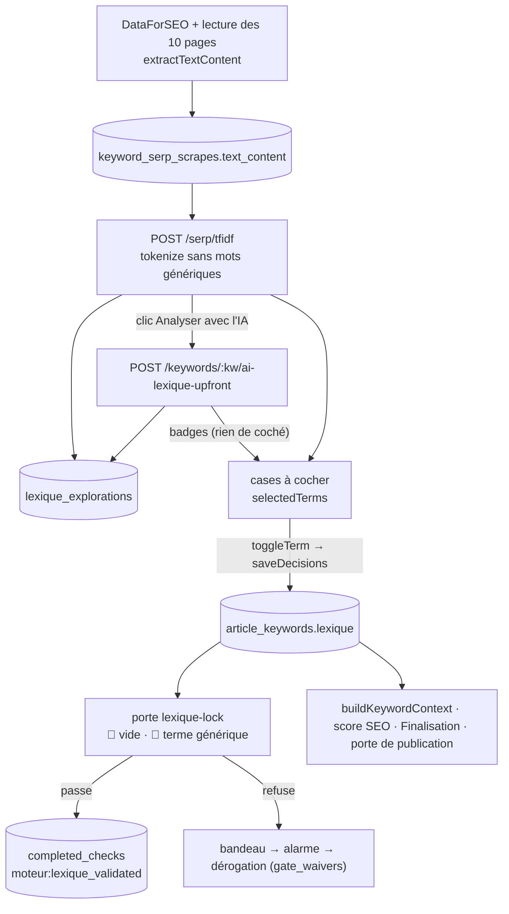

# Data Flow — lexique

> **Description métier :** le lexique dit à la rédaction quels mots du métier l'article doit employer. L'outil mesure les mots des pages concurrentes par TF-IDF (une mesure qui repère les mots fréquents dans une page et présents chez beaucoup de concurrents), en trois niveaux : Obligatoire (au moins 70 % des concurrents), Différenciateur (30 à 70 %), Optionnel (moins de 30 %). L'IA en recommande certains. **L'utilisateur choisit** : rien n'est coché d'office, et seul ce qu'il a coché est enregistré et transmis. Une porte refuse un lexique vide ou un mot générique.
> **Type/format :** proposition = `TfidfResult` ([`shared/types/serp-analysis.types.ts`](../../shared/types/serp-analysis.types.ts) ; mots isolés, 50 au plus par niveau, triés par densité) ; décision = `string[]` dans `article_keywords.lexique` (TEXT[], même ligne que capitaine, lieutenants, racines et structure).

Construction détaillée : [Moteur — Lieutenants, Structure, Lexique](../15-lieutenants-structure-lexique.md), partie « Moteur — Lexique » ; lecture des pages concurrentes, section « Lecture des pages concurrentes (partagée) ».

## La chaîne, de la page concurrente à la rédaction

```
① Pages concurrentes   scrape-corpus.fetchAndPersist → extractTextContent (contenu principal)
                       → keyword_serp_scrapes.text_content
② TF-IDF               POST /serp/tfidf → analyzeLexique → extractTfidf → tokenize (sans mots génériques)
                       → TfidfResult (+ lexique_explorations.tfidf_terms si articleId)
③ IA                   POST /keywords/:kw/ai-lexique-upfront → badges, résumé, termes manquants ; rien de coché
                       → lexique_explorations.ai_recommendations / ai_missing_terms / ai_summary
④ Choix                case cochée / décochée, ajout depuis le panneau d'aide → toggleTerm → saveDecisions
                       → PUT /articles/:id/keywords → article_keywords.lexique
⑤ Porte lexique-lock   saveDecisions → GET /gates/lexique-lock (silencieux) → passe : POST /progress/check
                       → refuse : bandeau « Étape non validée » (+ retrait de l'étape) → alarme à la demande
⑥ Rédaction            buildKeywordContext (sommaire, article), brief, score SEO, Finalisation,
                       porte de publication (rejoue lexique-lock)
```

## Producteurs

### ① Texte des pages concurrentes

- [`server/services/external/scrape-corpus.service.ts`](../../server/services/external/scrape-corpus.service.ts) `fetchAndPersist(keyword, niveau)` : cache mémoire 1 h ; puis base si la SERP a moins de 7 jours (`getSerpResultsFresh`) **et** qu'au moins une page a été lue (`reconstructSerpAnalysisResult`) ; sinon DataForSEO et lecture des 10 pages. `extractTextContent` ne garde que le contenu principal (`mainContent` : `<main>`, sinon les `<article>`, sinon la page ; sans `nav`, `header`, `footer`, `aside`, `form`, ni les éléments marqués cookie, consentement, lettre d'information — `DECOR_MARKERS`). Écrit `keyword_serp_scrapes.text_content` en une transaction.
- Qui déclenche une lecture : l'analyse de l'onglet Lieutenants (`POST /serp/analyze`), et le Lexique quand l'utilisateur confirme « Lancer l'analyse SERP » (`confirmSerpScrape`) ou teste un autre mot-clé (`extractCustomKeyword`) — tous deux avec `triggerScrapeIfMissing: true`.

### ② Proposition TF-IDF

- `POST /api/serp/tfidf` ([`server/routes/serp-analysis.routes.ts`](../../server/routes/serp-analysis.routes.ts)) → `analyzeLexique` ([`server/services/keyword/lexique-analysis.service.ts`](../../server/services/keyword/lexique-analysis.service.ts)) : lecture éventuelle des pages, `getTextContent` (**sans filtre d'âge**), 404 `NOT_FOUND` (`LexiqueScrapeMissingError`) sans texte, `extractTfidf`, puis `saveLexiqueTfidf` → `lexique_explorations.tfidf_terms` si un `articleId` est fourni.
- [`server/services/keyword/tfidf.service.ts`](../../server/services/keyword/tfidf.service.ts) : `tokenize` (minuscules, lettres accentuées et tiret, écarte tout mot `isGenericWord`, garde l'accent) ; `computeTfidfFromTexts` (fréquence documentaire → niveau, densité arrondie à 0,1).
- [`shared/utils/generic-terms.ts`](../../shared/utils/generic-terms.ts) : **source unique** de ce qui n'est pas du métier (`normalizeTerm`, `isGenericWord`, `isGenericTerm`, `splitGenericTerms`). « site », « blog », « article », « recherche » en sont volontairement absents.
- Côté écran, [`LexiquePanel.vue`](../../src/components/moteur/LexiquePanel.vue) `fetchTfidf` : lancé par « Extraire », par « Lancer l'analyse SERP », par « Tester un mot-clé » ; jamais par l'ouverture de l'onglet (le watcher de restauration ne fait que relire la base).

### ③ Recommandations de l'IA

- Clic « Analyser avec l'IA » (`LexiqueAiPanel` `trigger`), « Régénérer l'analyse » ou « Relancer l'analyse IA » → [`useLexiqueIa.generateLexiqueUpfront`](../../src/composables/lexique/useLexiqueIa.ts), jamais d'office (le watcher `tfidfResult` qui la lançait est retiré, 2026-09-30) : `POST /api/keywords/:keyword/ai-lexique-upfront` (SSE, [`server/routes/keyword-ai-panel.routes.ts`](../../server/routes/keyword-ai-panel.routes.ts), prompt `lexique-analysis-upfront.md`, douleur et stratégie du cocon). Le serveur enregistre le résultat avant l'événement `done` (`saveLexiqueAi`). `onDone` remplit la Map de `useLexiqueIa` et **ne coche rien**.

### ④ Le choix de l'utilisateur (seul producteur de la décision dans le Moteur)

- `LexiquePanel.handleToggleTerm` et `handleAssistAdd` (terme venu du [`KeywordAssistPanel`](../../src/components/moteur/KeywordAssistPanel.vue), enregistré s'il ne l'est pas déjà) → [`useLexiqueLocking.toggleTerm`](../../src/composables/lexique/useLexiqueLocking.ts) → store `addLexiqueTerm` / `removeLexiqueTerm` → `saveDecisions` → `PUT /api/articles/:id/keywords` → `saveArticleKeywords` ([`server/services/infra/data.service.ts`](../../server/services/infra/data.service.ts)). Un enregistrement par geste.

### Autres producteurs

- **Rédaction, section « Mots-clés »** — [`ArticleKeywordsPanel.vue`](../../src/components/keywords/ArticleKeywordsPanel.vue) : ajout manuel (refusé avec un message si le terme est générique, `splitGenericTerms`), « suggérer » (`store.suggestLexique` → `POST /api/keywords/lexique-suggest`, qui écarte les termes génériques et **remplace** le lexique du store), « Enregistrer » (`saveDecisions`). Ni la porte ni l'étape ne sont revues à ce moment : la porte de publication les rattrape.
- **Mode automatique** — [`scripts/auto-article/phases/moteur-valider.ts`](../../scripts/auto-article/phases/moteur-valider.ts) : `POST /serp/tfidf` (`triggerScrapeIfMissing: true`) → `pickLexique` ([`scripts/auto-article/heuristics/pick-lexique.ts`](../../scripts/auto-article/heuristics/pick-lexique.ts), écarte `isGenericTerm`) → `saveThenEmit` enregistre avant de demander l'étape ; le run ne déroge jamais seul (une porte toute 🟠 se reconnaît au terminal).

## Persistance

| Donnée | Où | Portée | Rôle |
|---|---|---|---|
| Texte des pages | `keyword_serp_scrapes.text_content` | par mot-clé, partagé entre articles | matière du TF-IDF |
| Proposition et avis de l'IA | `lexique_explorations` (`tfidf_terms`, `ai_recommendations`, `ai_missing_terms`, `ai_summary`, `explored_at`), unique `(article_id, source_keyword)` | par article et mot-clé exploré | onglets d'exploration, relecture sans recalcul ; filtrée des termes génériques à la relecture (`withoutGenericTerms`) |
| **Décision** | `article_keywords.lexique` TEXT[] | par article | **autorité** : ce que l'utilisateur a retenu |
| Étape | `articles.completed_checks` (`moteur:lexique_validated`) | par article | accordée par la porte |
| Dérogations | `gate_waivers` (`gate_id = 'lexique-lock'`) | par article | tombent si le lexique change (empreinte = termes normalisés triés) |

Mémoire :
- `useArticleKeywordsStore.keywords.lexique` — hydraté par `GET /api/articles/:id/keywords` ; `fetchKeywordsMerge` fait l'union par valeur avec la mémoire. `useLexiqueLocking` en dérive `lockedTerms` et `isLocked` (non vide).
- `selectedTerms` (`Set` local à `LexiquePanel`) — recopié de `lockedTerms` par un watcher `immediate` à chaque changement, et après chaque `fetchTfidf`.
- [`useLexiqueExplorations`](../../src/composables/lexique/useLexiqueExplorations.ts) — `pastExplorations`, `activeSourceKeyword`, `tfidfResult`, et une Map `iaRecommendations` **restaurée de la base**. Aucune écriture (famille LECTURE).
- `useLexiqueIa` — une **seconde** Map `iaRecommendations`, remplie seulement par un nouvel appel à l'IA, et `iaResult` (résumé, termes manquants).
- `lexiqueGateBlocked` — dernier refus de la porte, affiché dans le bandeau.

## Consommateurs

### Affichage (UI)

- **Listes à cocher** — `LexiquePanel` + [`LexiqueTermsList.vue`](../../src/components/moteur/lexique/LexiqueTermsList.vue) : cases = `selectedTerms`, densité et fréquence reçues du serveur, badges « IA recommandé » / « IA optionnel » (`useLexiqueIa.isIaRecommended`), compteur « N terme(s) sélectionné(s) » et répartition par niveau (`selectedByLevel`), onglets d'exploration ([`TabBar.vue`](../../src/components/shared/TabBar.vue), libellé = `source_keyword` brut).
- **Panneau « Analyse IA Lexique »** — [`LexiqueAiPanel.vue`](../../src/components/moteur/LexiqueAiPanel.vue) : état et « N termes analysés » depuis la Map de `useLexiqueExplorations` ; « recommandés · écartés » depuis celle de `useLexiqueIa` (voir Limites connues). Résumé et termes manquants depuis `iaResult`.
- **Bandeau de la porte** — `data-testid="lexique-gate-banner"` : première raison (« (+n autres) ») et bouton « Voir pourquoi / décider » (`reviewLexiqueGate` → `useGateAlarmStore().ensure`).
- **Alarme graduée** — [`GateAlarm.vue`](../../src/components/shared/GateAlarm.vue), « Avant de valider le lexique » ; aussi ouverte par `useMoteurArticleSync.emitCheckCompleted` si le serveur refuse l'étape (422).
- **Finalisation** — [`FinalisationPanel.vue`](../../src/components/moteur/FinalisationPanel.vue) : « Lexique (N termes) », lu dans le store.
- **Barre « Résultats déjà calculés »** — compteur `lexique` = lignes de `lexique_explorations` ; infobulle = longueur du lexique du store (`validatedLexiqueCount`).

### Calcul / tri / filtre / agrégat

- **Tri** — `LexiquePanel.sortTermsByAlignment` : A-Z, densité, ou « Pertinence douleur » (`jaccardWithPainPoint`, [`src/utils/pain-point-jaccard.ts`](../../src/utils/pain-point-jaccard.ts), proposé seulement si l'article a une douleur) ; `null` en bas.
- **Vérification côté écran** — `watch(isLocked)` (vide → non vide, et réconciliation au premier passage) et watcher sur `lockedTerms` (tout changement d'un lexique non vide) → `requestLexiqueGate` (une à la fois) → `syncLexiqueGate` : `saveDecisions` **puis** `evaluate(id, 'lexique-lock')`. Passe → `check-completed` si l'étape manque ; refuse → bandeau et `check-removed` si elle est là. Vérification impossible → l'étape est demandée, le serveur tranche.
- **Porte `lexique-lock`** — [`shared/verifiers/lexique.ts`](../../shared/verifiers/lexique.ts) `verifyLexique` : 🔴 `lexique-empty` ; 🔴 `lexique-generic-term:<terme normalisé>` (une alerte par terme). [`server/services/gates/gate.service.ts`](../../server/services/gates/gate.service.ts) `lexiqueGate` lit `article_keywords.lexique` ; `CHECK_GATES[MOTEUR_LEXIQUE_VALIDATED]` garde `POST /api/articles/:id/progress/check` et `PUT /api/articles/:id/progress`.
- **Publication** — `publishGate` rejoue `lexique-lock` ; `npm run verify` (`verify:content`) rejoue la même porte pour chaque article rédigé.
- **Rédaction** — `buildKeywordContext` ([`server/routes/generate/_helpers.ts`](../../server/routes/generate/_helpers.ts)) écrit « Lexique sémantique (corps de texte) : … » à partir de `article_keywords` relu en base.
- **Score SEO** — [`src/utils/seo-calculator.ts`](../../src/utils/seo-calculator.ts) `calculateLexiqueCoverage` (termes présents / total). Un mot vide, présent dans tout texte, gonflerait cette couverture : c'est une raison de la porte.

> **Règle de cohérence affichage / calcul** — Ce que l'écran montre coché est ce qui est enregistré : `selectedTerms` suit `lockedTerms` et chaque geste écrit en base. C'est cette même liste que lisent la porte, la rédaction, la Finalisation et le score SEO. Les termes sont comparés tels qu'enregistrés, sauf par la porte, qui les compare et nomme ses alertes après `normalizeTerm` (minuscules, sans accents).

## Cas d'usage à risque

| Cas | Lecture | Écriture | Risque |
|---|---|---|---|
| **Premier chargement** (onglet ouvert, capitaine verrouillé) | watcher de restauration : `hydrateFromDb` (`GET /api/articles/:id/explorations`) ; si les pages existent (`GET …/serp/exists`) et qu'aucune proposition n'est restaurée, `fetchTfidf` | `lexique_explorations.tfidf_terms` | **Modéré** : sans exploration enregistrée, l'ouverture lance le TF-IDF puis l'analyse IA sans clic (coût IA). Écart `FR-MOT-NO-AUTO-ACTION` / `FR-LEX-AI-PANEL`, déjà relevé. Aucune case cochée, aucune étape demandée. |
| **Rechargement de la page** | après le choix de l'article : store relu, explorations restaurées | aucune | Faible pour les cases : le watcher sur `lockedTerms` recoche les termes enregistrés, compteur juste. Réconciliation au premier montage : lexique non vide sans étape → porte ; étape sans lexique → retrait. Badges et résumé de l'IA ne reviennent pas (voir Limites connues). |
| **Changement d'article** | watcher `selectedArticle.slug` : `resetExplorations`, cases vidées, IA interrompue ; puis relecture | aucune | Faible : l'état de porte et la demande d'étape en cours sont oubliés (`selectedArticle.id`). |
| **Retour sur l'onglet** | panneau gardé monté (`v-show`) | aucune | Faible : ni relecture ni appel. |
| **Premier terme coché** | — | `PUT …/keywords`, vérification, puis `POST …/progress/check` | Faible : la porte juge ce qui vient d'être enregistré. |
| **Terme générique ajouté après l'étape** | — | lexique enregistré, `POST …/progress/uncheck` | Faible : l'étape est retirée et le bandeau s'affiche. |
| **Deux cases cochées très vite** | — | deux `PUT` | Faible : vérifications en file, une seule demande d'étape. |
| **« Tester un mot-clé »** | — | lecture des pages (payante si absentes), `tfidf_terms` pour ce mot-clé, puis analyse IA | Faible : geste explicite ; nouvel onglet ajouté par `mergeFromDb`. |
| **Lexique modifié depuis la Rédaction** | store | `PUT …/keywords` à « Enregistrer » | Modéré : ni porte ni étape revues ; un lexique vidé garde son étape jusqu'à la publication, qui s'arrête sur 🔴 `lexique-empty`. |
| **Pages lues il y a longtemps** | `keyword_serp_scrapes.text_content` sans filtre d'âge | aucune | Faible : le TF-IDF peut porter sur des pages anciennes ; relancer l'analyse des pages (Lieutenants) les rafraîchit après 7 jours. |

## Diagramme



## Limites connues

- **Deux Maps de recommandations de l'IA.** `LexiquePanel` lit l'état du panneau et le nombre de termes analysés dans la Map restaurée de la base (`useLexiqueExplorations`), mais les badges, les nombres « recommandés · écartés », le résumé et les termes manquants dans celle de `useLexiqueIa`, remplie seulement par un nouvel appel. Après une première analyse, le panneau reste à l'état « à lancer » (0 terme analysé) alors que les badges s'affichent ; après un rechargement, il annonce « N termes analysés — 0 recommandés · 0 écartés », sans badge ni résumé, et ne relance pas l'IA. **Défaut** face à `FR-LEX-AI-PANEL` (badges par terme ; le panneau compte analysés, recommandés, écartés).
- **Analyse IA lancée sans clic** à l'ouverture de l'onglet quand aucune analyse n'est restaurée. Écart `FR-LEX-AI-PANEL` et `FR-MOT-NO-AUTO-ACTION`, déjà relevé ([cadre commun](../12-moteur.md), section « Coûts et caches »).
- **Explorations enregistrées avant le filtre des mots génériques** : filtrées à la relecture, pas réécrites en base ; la porte refuse toujours un terme générique retenu.
- **Pages lues avant le filtre du décor** : leur texte garde menus et bandeaux jusqu'à la prochaine lecture ; `tokenize` écarte de toute façon les mots de décor.

## Tests qui la gardent

- [`tests/unit/coherence/lexique.test.ts`](../../tests/unit/coherence/lexique.test.ts) — blocs `FR-LEX-TFIDF` (seuils des niveaux), `NFR-INT-SERP-ONCE`, `FR-LEX-SORT`, `FR-LEX-SELECT`. **Attention** : le fichier n'importe aucun code de l'outil ; les seuils, le Jaccard et l'enregistrement y sont recopiés ou simulés. Il ne garde rien du code réel.
- [`tests/unit/coherence/captain-keyword-and-progress-reactive.test.ts`](../../tests/unit/coherence/captain-keyword-and-progress-reactive.test.ts) — monte `LexiquePanel` : l'en-tête suit le capitaine du store (garde `articleId`).
- Tests qui exercent le vrai code :
  - [`tests/unit/components/lexique-gate.test.ts`](../../tests/unit/components/lexique-gate.test.ts) — mot vide retenu → pas d'étape, bandeau ; enregistrement avant vérification ; une seule étape ; mot vide ajouté après coup → étape retirée ; bandeau → alarme → étape.
  - [`tests/unit/components/lexique-extraction.test.ts`](../../tests/unit/components/lexique-extraction.test.ts), [`tests/unit/composables/lexique-precheck-persiste.test.ts`](../../tests/unit/composables/lexique-precheck-persiste.test.ts) — rien de coché d'office, chaque geste enregistré, termes venus de la base cochés, compteur juste.
  - [`tests/unit/components/lexique-check-reconciliation.test.ts`](../../tests/unit/components/lexique-check-reconciliation.test.ts) — réconciliation au montage.
  - [`tests/unit/shared/verifiers-lexique.test.ts`](../../tests/unit/shared/verifiers-lexique.test.ts), [`tests/contract-api/gates.contract.test.ts`](../../tests/contract-api/gates.contract.test.ts) — règles de la porte, 422 sur un terme générique (serveur requis).
  - [`tests/unit/shared/generic-terms.test.ts`](../../tests/unit/shared/generic-terms.test.ts), [`tests/unit/services/tfidf.test.ts`](../../tests/unit/services/tfidf.test.ts), [`tests/unit/services/scrape-corpus.service.test.ts`](../../tests/unit/services/scrape-corpus.service.test.ts), [`tests/unit/services/lexique-exploration.service.test.ts`](../../tests/unit/services/lexique-exploration.service.test.ts) — mots génériques, TF-IDF, contenu principal, relecture filtrée.
  - [`tests/unit/architecture/lexique-separation.test.ts`](../../tests/unit/architecture/lexique-separation.test.ts) — LECTURE et VERROUILLAGE sans appel croisé.
  - [`tests/unit/scripts/auto-article/pick-lexique.test.ts`](../../tests/unit/scripts/auto-article/pick-lexique.test.ts) — le mode automatique n'emporte aucun terme générique.
  - [`tests/browser-e2e/parcours/lexique.parcours.test.ts`](../../tests/browser-e2e/parcours/lexique.parcours.test.ts) — aucune case cochée ni étape avant le geste, puis bandeau et alarme si la porte retient l'étape.

À écrire :
1. Après une analyse de l'IA, puis après un rechargement, le panneau « Analyse IA Lexique » et les badges lisent les mêmes recommandations.
2. Remplacer les copies de `tests/unit/coherence/lexique.test.ts` par des appels à `computeTfidfFromTexts`, `jaccardWithPainPoint` et `saveDecisions`.

---

*Document maintenu par la discipline data-flow-discipline. Cf. [README](./README.md).*
