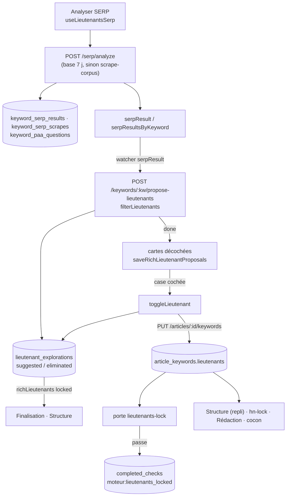

# Data Flow — lieutenants

> **Description métier :** un lieutenant est un mot-clé secondaire de l'article, destiné à devenir un titre H2 ou H3. L'outil lit les pages concurrentes du capitaine, l'IA en tire des propositions notées de 0 à 100, et **l'utilisateur coche** celles qu'il retient. Cocher verrouille aussitôt ; l'étape « Lieutenants verrouillés » dépend ensuite d'une porte serveur (nombre suffisant, pas de cannibalisation dans le cocon). Les lieutenants retenus nourrissent l'onglet Structure, le Lexique (affichage), la Finalisation et la Rédaction.
> **Type/format :** deux enregistrements tenus ensemble. `article_keywords.lieutenants` (TEXT[]) est **la décision**, lue par la porte, la Structure (en repli), la Rédaction. `lieutenant_explorations` garde **chaque proposition avec son statut** ; relue dans `GET /api/articles/:id/keywords` sous le nom `richLieutenants`, elle pilote l'écran.

Construction détaillée : [Moteur — Lieutenants, Structure, Lexique](../15-lieutenants-structure-lexique.md), sections « Lecture des pages concurrentes (partagée) », « Onglet Lieutenants : analyse et récurrence », « Proposition des lieutenants par l'IA », « Verrouillage des lieutenants », « Étape et porte « lieutenants-lock » ».

## Producteurs

Qui crée ou met à jour cette donnée :

### ① Pages concurrentes (matière, partagée avec Structure et Lexique)

- Bouton « Analyser SERP » → [`useLieutenantsSerp.analyzeSERP`](../../src/composables/moteur/useLieutenantsSerp.ts) : `POST /api/serp/analyze` pour le capitaine puis chacune de ses racines, l'une après l'autre (`topN: 10`, `articleLevel`). Jamais lancé d'office.
- [`server/routes/serp-analysis.routes.ts`](../../server/routes/serp-analysis.routes.ts) : relit la base si `getSerpResultsFresh` (moins de 7 jours) **et** `reconstructSerpAnalysisResult` (au moins une page lue), sinon [`scrape-corpus.fetchAndPersist`](../../server/services/external/scrape-corpus.service.ts) (cache mémoire 1 h, DataForSEO, lecture des 10 pages). Écrit `keyword_serp_results`, `keyword_serp_scrapes` (`headings`, `text_content`, `is_blog`), `keyword_paa_questions`, partagés entre articles.
- Mémoire : `serpResultsByKeyword` (un résultat par mot-clé analysé), `serpResult` (fusion dédoublonnée par URL et question). La récurrence des titres est calculée dans le navigateur par `computeHnRecurrence` ([`shared/utils/hn-structure.ts`](../../shared/utils/hn-structure.ts)).

### ② Propositions de l'IA

- Déclenchement : watcher `serpResult` de [`LieutenantsPanel.vue`](../../src/components/moteur/LieutenantsPanel.vue), quand aucune carte n'est en mémoire. Si toutes les propositions en base ont moins de 7 jours (`shouldRegenerate`), il les restaure (`restoreLockedLieutenants`) au lieu de rappeler l'IA.
- [`useLieutenantsIa.proposeLieutenants`](../../src/composables/moteur/useLieutenantsIa.ts) → `POST /api/keywords/:capitaine/propose-lieutenants` (SSE) avec les titres récurrents, les concurrents lus, les PAA du capitaine, les données des racines, les groupes de mots de Discovery et `cocoonSlug`.
- [`server/routes/keyword-ai-panel.routes.ts`](../../server/routes/keyword-ai-panel.routes.ts) : ajoute les lieutenants des autres articles du cocon (`getCocoonExistingLieutenants`, lus dans `article_keywords.lieutenants`) et la douleur de l'article ; prompt `propose-lieutenants.md` (règle de l'entonnoir géographique : malus dans le prompt seulement) ; `filterLieutenants` trie par `compareScores` et garde `ARTICLE_TYPE_RULES[niveau].maxLieutenants` ; `saveLieutenantExplorations` enregistre les retenus en `suggested` et les autres en `eliminated` **avant** l'événement `done`.
- `onDone` côté client : cartes **décochées**, `saveRichLieutenantProposals` remplace `richLieutenants` en mémoire, puis `saveLieutenantExplorationEntries` réécrit les mêmes lignes (`POST /api/articles/:id/lieutenant-explorations`).
- Ajout depuis le panneau d'aide (`KeywordAssistPanel`) : `useLieutenantsIa.handleAssistAdd` ajoute une carte sans note (`score: null`), en mémoire seulement.

### ③ Le choix de l'utilisateur (seul producteur de la décision dans le Moteur)

- Case cochée ou décochée → `useLieutenantsIa.toggleLieutenant` : store `lockLieutenant` / `unlockLieutenant` ([`article-keywords.store.ts`](../../src/stores/article/article-keywords.store.ts), statut + liste plate), puis `saveLieutenantExplorationEntries` (tous les `richLieutenants`, statuts compris) et `saveDecisions` → `PUT /api/articles/:id/keywords` → `saveArticleKeywords` ([`server/services/infra/data.service.ts`](../../server/services/infra/data.service.ts)). Un enregistrement par geste, sans temporisation.
- Déverrouillage du Capitaine avec lieutenants verrouillés → [`UnlockLieutenantsModal.vue`](../../src/components/moteur/UnlockLieutenantsModal.vue) : « Les garder » ou « Tout réinitialiser » (`CaptainPanel.handleUnlockArchive` → `archiveLockedLieutenants` en mémoire, puis `saveKeywords`, qui vide la liste plate en base).
- Mode automatique : l'heuristique `pickLieutenants` ([`scripts/auto-article/heuristics/pick-lieutenants.ts`](../../scripts/auto-article/heuristics/pick-lieutenants.ts)) choisit, `saveThenEmit` enregistre avant de demander l'étape.

### ④ L'étape

- `LieutenantsPanel` : `lieutenantsCheckActive` (au moins un `richLieutenants` au statut `locked` pour cet article) ; à son passage à vrai, `verifyLockedLieutenants(true)` enregistre, retire l'étape Structure si elle était validée (`invalidateValidatedStructure`), puis demande le verdict silencieux de `lieutenants-lock` (`useGateAlarmStore().evaluate`) ; porte passée → `check-completed` ; refusée → bandeau `lieutenants-gate-banner` (+ `check-removed`). Tout changement ultérieur des cases relance la vérification (`lockedLieutenantsSignature`).
- Serveur : [`shared/verifiers/lieutenants.ts`](../../shared/verifiers/lieutenants.ts) `verifyLieutenants`, [`server/services/gates/gate.service.ts`](../../server/services/gates/gate.service.ts) `lieutenantsGate` (lit `article_keywords` de l'article et les revendications des autres articles du cocon).

## Persistance

| Donnée | Où | Portée | Rôle |
|---|---|---|---|
| **Décision** | `article_keywords.lieutenants` TEXT[] | par article | **autorité** pour la porte, la Structure (en repli), la Rédaction, les autres articles du cocon |
| Propositions et statuts | `lieutenant_explorations` (unique `article_id, keyword` ; `status`, `captain_keyword`, `reasoning`, `sources`, `suggested_hn_level`, `score`, `kpis`, `explored_at`) | par article | **autorité** de ce que l'écran coche et de ce que la Finalisation liste |
| Pages concurrentes | `keyword_serp_results`, `keyword_serp_scrapes.headings`, `keyword_paa_questions` | par mot-clé, partagé | matière de la récurrence et de l'IA |
| Étape | `articles.completed_checks` (`moteur:lieutenants_locked`) | par article | accordée par la porte ; son retrait retire aussi `moteur:hn_locked` (`checksRemovedWith`) |
| Dérogations | `gate_waivers` (`gate_id = 'lieutenants-lock'`) | par article | tombent si l'empreinte change (niveau, capitaine, lieutenants triés, revendications recoupées) |

Mémoire :
- `useArticleKeywordsStore.keywords.lieutenants` et `.richLieutenants`, `lockedLieutenants` (computed : `richLieutenants` au statut `locked`). Hydratés par `fetchKeywordsMerge` : union par valeur pour la liste plate ; pour `richLieutenants`, clé `trim().toLowerCase()`, et un statut terminal (`locked`, `archived`, `eliminated`) venu de la base remplace un statut non terminal en mémoire.
- `useLieutenantsIa` : `lieutenantCards`, `eliminatedCards`, `selectedCards` (cases cochées), vidés au changement d'article.
- `useMoteurCrossTabState.selectedLieutenantsLocal` (dernière sélection émise par `lieutenants-updated`) → `selectedLieutenantsForLexique` (sinon la liste plate du store).

## Consommateurs

### Affichage (UI)

- **Liste des candidats** — [`LieutenantProposals.vue`](../../src/components/moteur/LieutenantProposals.vue) et [`LieutenantCard.vue`](../../src/components/moteur/LieutenantCard.vue) : case cochée = `selectedCards`, note `formatScore` (« — » si `null`), pastilles de provenance, compteur `selectedCards.size / totalGenerated`. Écartés à part (`sortedEliminated`).
- **Pages concurrentes** — [`LieutenantSerpAnalysis.vue`](../../src/components/moteur/LieutenantSerpAnalysis.vue) : onglets par mot-clé analysé, curseur 3-10 (ne change que le compteur affiché), filtre Blogs / Autres.
- **Structure** — [`useStructureHn.lockedLieutenants`](../../src/composables/moteur/useStructureHn.ts) : `lockedLieutenants` du store, sinon la liste plate ; puces de l'onglet et contenu de la demande `ai-hn-structure`.
- **Lexique** — `LexiquePanel` reçoit `selectedLieutenantsForLexique` (prop `selected-lieutenants`) pour afficher des badges ; aucun calcul.
- **Finalisation** — [`FinalisationPanel.vue`](../../src/components/moteur/FinalisationPanel.vue) : `richLieutenants` au statut `locked`, sans repli sur la liste plate.
- **Barre « Résultats déjà calculés »** — compteur `lieutenants` = nombre de lignes de `lieutenant_explorations` ; infobulle alimentée par la longueur de la liste plate (`lockedLieutenantsCount` dans `MoteurView`).

### Calcul / tri / filtre / agrégat

- **Tri serveur des propositions** — `filterLieutenants` : `compareScores(score)`, `null` en bas, coupe à `maxLieutenants` ([`shared/constants/article-type-rules.ts`](../../shared/constants/article-type-rules.ts)). La relecture (`getLieutenantExplorations`) trie `score DESC NULLS LAST`. L'écran retrie avec `useSortableList` (`null` en bas).
- **Porte `lieutenants-lock`** — `lieutenants-too-few` (🔴, `minLieutenants`), `lieutenant-cannibalization:<mot>` (🔴), `lieutenant-shared:<mot>` (🟠), `lieutenant-is-captain:<mot>` (🟠), sur `article_keywords.lieutenants`. Rejouée par `publishGate` à la publication.
- **Porte `hn-lock`** — lit la liste plate pour `hn-lieutenant-missing:<lieutenant>` (🟠).
- **Autres articles du cocon** — `getCocoonExistingLieutenants` (prompt de l'IA) et les revendications de `lieutenantsGate` lisent la liste plate de chaque article.
- **Rédaction** — `buildKeywordContext` ([`server/routes/generate/_helpers.ts`](../../server/routes/generate/_helpers.ts)) écrit « Lieutenants (H2, H3) : … » à partir de `article_keywords`.

> **Règle de cohérence affichage / calcul** — La note affichée sur une carte, le tri de l'écran, le tri du serveur et l'ordre de relecture lisent tous le même champ `score` produit par l'IA, `null` en bas partout et « — » à l'écran. Ce qui est coché à l'écran doit être ce que la porte lit : `toggleLieutenant` écrit les deux enregistrements à chaque geste, et l'étape n'est demandée qu'après `saveDecisions` réussi.

## Cas d'usage à risque

| Cas | Lecture | Écriture | Risque |
|---|---|---|---|
| **Premier chargement** (choix de l'article) | `fetchKeywordsMerge` → `richLieutenants` (propositions et statuts) + liste plate | aucune | Faible : `restoreLockedLieutenants` réaffiche les cartes proposées et verrouillées ; les écartées à part ; les cases `locked` cochées. |
| **Rechargement de la page** | idem, après le choix de l'article | aucune | Faible en usage normal. Réconciliation au premier montage : lieutenant verrouillé sans étape → porte ; étape sans lieutenant verrouillé → retrait. |
| **Changement d'article** | `$reset` du store puis relecture ; le panneau vide cartes, SERP et cases, puis restaure | aucune | Faible. Risque suspecté (conflit 6 du [cadre commun](../12-moteur.md)) : un enregistrement déclenché pendant la relecture, sur un store vide. |
| **Retour sur l'onglet** | panneau gardé monté (`v-show`) | aucune | Faible : ni relecture ni appel payant. |
| **Case cochée** | — | `POST …/lieutenant-explorations`, `PUT …/keywords`, puis vérification et `POST …/progress/check` | Faible : une case cochée pendant la vérification est reprise par la boucle de `verifyLockedLieutenants`. |
| **Nouvelle proposition de l'IA** (« Analyser SERP » avec propositions de plus de 7 jours) | — | le serveur réécrit les statuts des mots-clés reproposés en `suggested` / `eliminated` | **Élevé** : les statuts `locked` disparaissent de l'écran et de `lieutenant_explorations`, l'étape est retirée, la liste plate les garde. Écart `FR-LIE-CHECKBOX-LOCK-IMMEDIATE`, déjà relevé. |
| **« Tout réinitialiser » au déverrouillage du Capitaine** | — | liste plate vidée en base ; statuts `archived` en mémoire seulement | **Élevé** : au rechargement, les lieutenants reviennent cochés (statut `locked` en base) alors que la décision est vide : la porte refuse (`lieutenants-too-few`) et la Finalisation les liste. Voir Limites connues. |
| **Mot-clé ajouté depuis le panneau d'aide** | — | rien avant qu'il soit coché | Modéré : la carte disparaît au rechargement si elle n'a pas été cochée. |
| **Lieutenant d'un autre article ajouté entre-temps** | `getCocoonExistingLieutenants` au moment de l'appel IA ; `lieutenantsGate` à chaque vérification | — | Faible : la porte relit le cocon à chaque vérification. |

## Diagramme

## Limites connues

- **« Tout réinitialiser » n'archive qu'en mémoire.** `handleUnlockArchive` passe les lieutenants à `archived` dans le store et vide la liste plate en base, mais n'écrit pas `lieutenant_explorations` ; la route `POST /api/articles/:id/lieutenants/archive` (`archiveLieutenantExplorations`) n'a aucun appelant. Au rechargement, les lieutenants reviennent verrouillés à l'écran et dans la Finalisation, contre une décision vide. **Défaut** face à `FR-INFRA-LIEUTENANT-EXPLORATIONS` (« le statut … archivé survit au rechargement ») et `FR-CAP-LOCK-RADIO` (« Tout réinitialiser (qui les archive) »).
- **Relancer la proposition défait les verrous** (écran et `lieutenant_explorations`), alors que la liste plate les garde. Écart `FR-LIE-CHECKBOX-LOCK-IMMEDIATE`, déjà relevé.
- **Proposition ajoutée à la main non enregistrée** tant qu'elle n'est pas cochée (`handleAssistAdd`). Écart face à `FR-INFRA-LIEUTENANT-EXPLORATIONS` (« enregistrée dès qu'elle est … ajoutée »).
- **Deux autorités.** L'écran, la Structure et la Finalisation lisent les statuts `locked` ; la porte, la Rédaction et le cocon lisent la liste plate. Elles ne divergent que par les deux défauts ci-dessus.
- **Curseur sans effet sur les données** et **pas de fourchette conseillée**. Écarts `FR-LIE-SLIDER-INTELLIGENT` et `FR-LIE-CHECKBOX-COUNT`, déjà relevés.

## Tests qui la gardent

- [`tests/unit/coherence/lieutenants.test.ts`](../../tests/unit/coherence/lieutenants.test.ts) — blocs `FR-LIE-SERP-ANALYZE`, `FR-LIE-EXTRACT-HEADINGS`, `FR-LIE-PROPOSE-AI`, `FR-LIE-GEOFUNNEL-RULE`. **Attention** : seuls `compareScores` et `ARTICLE_TYPE_RULES` viennent du code ; la fraîcheur, la récurrence, `filterLieutenants` et le malus géographique y sont recopiés. Le test garde les seuils `maxLieutenants`, pas le code des routes.
- [`tests/unit/coherence/keywords.test.ts`](../../tests/unit/coherence/keywords.test.ts), bloc `FR-LIE-CHECKBOX-COUNT` — même remarque : aucun import du store.
- Tests qui exercent le vrai code :
  - [`tests/unit/components/lieutenants-gate.test.ts`](../../tests/unit/components/lieutenants-gate.test.ts) — enregistrement avant l'étape, case cochée pendant la vérification reprise, étape revérifiée au changement suivant.
  - [`tests/unit/shared/verifiers-lieutenants.test.ts`](../../tests/unit/shared/verifiers-lieutenants.test.ts) — règles de la porte.
  - [`tests/unit/stores/article-keywords.merge.test.ts`](../../tests/unit/stores/article-keywords.merge.test.ts) — fusion sans doublon. Le test intitulé « le lockedAt le plus récent gagne » vérifie en fait qu'un statut `locked` entrant remplace un `suggested` : c'est la règle du statut terminal, pas une date.
  - [`tests/unit/components/lieutenants-selection.test.ts`](../../tests/unit/components/lieutenants-selection.test.ts), [`lieutenants-results-layout-architecture.test.ts`](../../tests/unit/components/lieutenants-results-layout-architecture.test.ts), [`lieutenants-selection-architecture.test.ts`](../../tests/unit/components/lieutenants-selection-architecture.test.ts) — analyse à la demande, sections repliées, frontière entre la liste et le panneau de l'IA, plus de structure dans l'onglet.
  - [`tests/unit/composables/serp-echec-explique.test.ts`](../../tests/unit/composables/serp-echec-explique.test.ts) — échec d'analyse expliqué.

À écrire :
1. « Tout réinitialiser » puis relecture : aucun lieutenant ne revient au statut `locked`.
2. Relance de la proposition : les lieutenants verrouillés restent cochés, en base comme à l'écran, et l'étape reste acquise.
3. Remplacer les copies de `tests/unit/coherence/lieutenants.test.ts` par des appels à `computeHnRecurrence` et à la route `propose-lieutenants` en mode simulé.

---

*Document maintenu par la discipline data-flow-discipline. Cf. [README](./README.md).*
