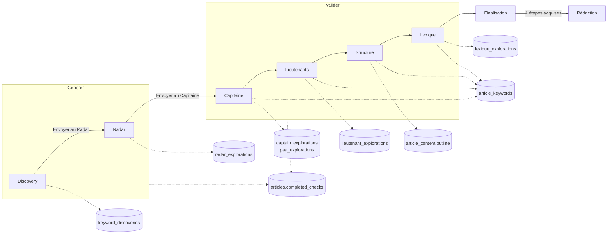

# Data Flow — moteur (vue d'ensemble)

> **Description métier :** le Moteur prend un article du cocon et lui fait choisir ses mots-clés en sept onglets et trois phases : **Générer** (Discovery, Radar), **Valider** (Capitaine, Lieutenants, Structure, Lexique), **Finaliser** (Finalisation). Chaque onglet de la phase Valider pose une décision, enregistrée sur l'article, puis demande une étape que le serveur accorde ou refuse (la « porte »). Quand les quatre étapes de Valider sont acquises, la Rédaction s'ouvre.
> **Type/format :** pas une donnée unique, mais l'état d'un article. Trois familles en base : les **décisions** (`article_keywords`, une ligne par article), les **explorations** (une table par onglet, gardée même sans décision), la **progression** (`articles.completed_checks`, tableau de textes).

Cette fiche dit qui lit et qui écrit quoi. Le détail des fichiers, des routes et des règles est dans les chapitres, sans être répété ici :

| Sujet | Chapitre | Fiche de flux |
|---|---|---|
| Vue commune, onglets, étapes, verrous, barres, caches, contexte de l'IA | [12 — Moteur](../12-moteur.md) | [completed-checks.md](completed-checks.md), [captain-keyword-locked.md](captain-keyword-locked.md) |
| Discovery | [13 — Discovery](../13-discovery.md) | — |
| Radar, Capitaine | [14 — Radar et Capitaine](../14-radar-capitaine.md) | [radar-keywords.md](radar-keywords.md), [radar-explorations.md](radar-explorations.md), [score-capitaine.md](score-capitaine.md), [captain-relevance.md](captain-relevance.md) |
| Lieutenants, Structure, Lexique | [15 — Lieutenants, Structure, Lexique](../15-lieutenants-structure-lexique.md) | [lieutenants.md](lieutenants.md), [lexique.md](lexique.md) |
| Finalisation | [16 — Finalisation](../16-finalisation.md) | — |
| Décisions d'un article (toutes colonnes) | [02 — Modèle de données](../02-donnees.md) | [keywords.md](keywords.md) |
| Mesures partagées entre articles | [18 — Intégrations externes](../18-integrations.md) | [keyword-metrics.md](keyword-metrics.md) |

## Carte d'ensemble

## Producteurs

Qui écrit quoi, onglet par onglet (colonne « Étape » : l'étape que l'onglet demande et la porte qui la garde).

| Onglet | Écrit (table) | Par | Étape · porte |
|---|---|---|---|
| Discovery | `keyword_discoveries` (sauvegarde par mot-clé racine) ; `radar_explorations.generated_keywords` ; `captain_explorations` (pré-analyse) | `useDiscoveryCache` ; `useMoteurCrossTabState.handleSendToRadar` ; `captain-trigger.store` | `moteur:discovery_done` · aucune |
| Radar | `radar_explorations` (liste d'attente, `scan_result`, longues traînes) | `useRadarExplorationStore`, `useKeywordRadar._saveToExploration`, `useLongTailSuggestions` | `moteur:radar_done` · aucune |
| Capitaine | `captain_explorations` et `paa_explorations` (chaque étude, côté serveur) ; `article_keywords.capitaine`, `.root_keywords` ; miroir `articles.captain_keyword_locked` | `POST /keywords/:kw/scan` ; `CaptainPanel.lockEntry` → `saveKeywords` | `moteur:capitaine_locked` · `captain-lock` |
| Lieutenants | `lieutenant_explorations` ; `article_keywords.lieutenants` | route `propose-lieutenants` ; `useLieutenantsIa.toggleLieutenant` | `moteur:lieutenants_locked` · `lieutenants-lock` |
| Structure | `article_keywords.hn_structure` ; `article_content.outline` ; `article_micro_contexts.target_word_count` (si vide) | `useStructureHn` (`save`, `prepareValidation`) | `moteur:hn_locked` · `hn-lock` |
| Lexique | `lexique_explorations` (TF-IDF, avis de l'IA) ; `article_keywords.lexique` | `POST /serp/tfidf`, route `ai-lexique-upfront` ; `useLexiqueLocking.toggleTerm` | `moteur:lexique_validated` · `lexique-lock` |
| Finalisation | rien | — | aucune (elle ferait doublon avec les quatre étapes) |

Écritures partagées, déclenchées depuis un onglet mais utiles à tous les articles : `keyword_metrics` (mesures DataForSEO et Google, par le scan Radar et l'étude Capitaine), `keyword_serp_results`, `keyword_serp_scrapes`, `keyword_paa_questions` (pages concurrentes, par l'analyse Lieutenants, la Structure sur clic et le Lexique sur clic), `external_api_cache` (réponses externes et IA mises en cache).

Toutes les étapes passent par le même chemin : le panneau émet `check-completed` → `MoteurView` → [`useMoteurArticleSync.emitCheckCompleted`](../../src/composables/moteur/useMoteurArticleSync.ts) → `gateAlarm.runThroughGate` → [`useArticleProgressStore.addCheck`](../../src/stores/article/article-progress.store.ts) → `POST /api/articles/:id/progress/check` (422 `GATE_BLOCKED` si la porte refuse : l'alarme s'ouvre). Le retrait suit `check-removed` → `POST …/progress/uncheck`, qui retire aussi les étapes dépendantes (`checksRemovedWith` : Capitaine ou Lieutenants → Structure).

## Persistance

| Table | Portée | Onglet propriétaire | Relue par |
|---|---|---|---|
| `article_keywords` (`capitaine`, `lieutenants`, `hn_structure`, `lexique`, `root_keywords`) | par article | Capitaine, Lieutenants, Structure, Lexique | tous les onglets de Valider, Finalisation, portes, Rédaction, barre des articles (`GET /cocoons/:name/capitaines`) |
| `articles.completed_checks` (+ `check_timestamps`) | par article | tous (sauf Finalisation) | points de progression, verrous, onglet utile, Finalisation, Structure |
| `radar_explorations` | par article | Radar (et Discovery pour la liste d'attente) | Radar, Capitaine (copie de `marketScore`, signaux à l'étude), panneau d'aide de Lieutenants et Lexique, compteurs |
| `captain_explorations`, `paa_explorations` | par article | Capitaine (et pré-analyse de Discovery) | Capitaine (candidats, Score Pertinence recalculé), compteurs |
| `lieutenant_explorations` | par article | Lieutenants | Lieutenants, Structure, Finalisation (statuts `locked`), compteurs |
| `lexique_explorations` | par article et mot-clé exploré | Lexique | Lexique, compteurs |
| `keyword_discoveries` | par mot-clé racine (tout le cocon) | Discovery | Discovery |
| `article_content.outline`, `article_micro_contexts` | par article | Structure | Rédaction |
| `gate_waivers` | par article et porte | alarme des portes (tous les onglets de Valider) | portes (étape et publication) |

La mémoire du navigateur ne fait autorité sur rien : chaque store garde une copie de la dernière réponse du serveur.

| Mémoire | Contenu | Remise à zéro |
|---|---|---|
| [`useArticleKeywordsStore`](../../src/stores/article/article-keywords.store.ts) | décisions + `richCaptain`, `richLieutenants`, `richRootKeywords` ; jugements PAA de la session (`paaJudgmentsByArticle`) | `$reset` à chaque choix d'article et au montage ; les jugements PAA survivent jusqu'au F5 |
| [`useArticleProgressStore`](../../src/stores/article/article-progress.store.ts) | `progressMap` (50 articles au plus) | jamais vidée pendant la session ; chaque réponse du serveur remplace l'entrée |
| [`useRadarExplorationStore`](../../src/stores/article/radar-exploration.store.ts) | ligne `radar_explorations` de l'article | `setArticle` au changement d'article, `$reset` au montage |
| [`useMoteurCrossTabState`](../../src/composables/moteur/useMoteurCrossTabState.ts) | données en transit entre onglets (voir plus bas) | `resetCrossTabState` au choix d'article et au montage |
| [`useMoteurArticleSync`](../../src/composables/moteur/useMoteurArticleSync.ts) | `capitainesMap`, `explorationCounts` | relus au changement d'article et après chaque étape |
| composables de panneau (`useKeywordRadar`, `useExploredKeywords`, `useLieutenantsSerp`, `useLieutenantsIa`, `useStructureHn`, `useLexiqueExplorations`, `useLexiqueIa`) | état d'écran de l'onglet | par le watcher d'article de chaque panneau |
| `useDiscoveryPanel` (état de module) | résultats de Discovery | `resetDiscovery` au montage de `MoteurView` seulement |

## Onglet par onglet

### Discovery — phase Générer

- **Lit** : les props de l'article (titre, mot-clé, douleur) et du cocon ; la sauvegarde de découverte du mot-clé racine (`GET /api/discovery-cache/check|load`).
- **Appelle** (sur clic) : Google Suggest (4 angles), DataForSEO, génération IA (Claude Haiku), groupes de mots, filtre de pertinence et analyse IA.
- **Écrit** : `keyword_discoveries` (sauvegarde automatique à la fin des chargements) ; `radar_explorations.generated_keywords` à l'envoi au Radar ; `captain_explorations` si l'utilisateur laisse partir la pré-analyse Capitaine d'une case cochée (5 s).
- **Étape** : `moteur:discovery_done`, émise par le composable parent à l'envoi au Radar, sans porte.
- **Verrou** : onglet grisé (`isDiscoveryAllowed` faux) quand le mot-clé de l'article est déjà validé dans le cocon.
- Détail : [13 — Discovery](../13-discovery.md).

### Radar — phase Générer

- **Lit** : la liste d'attente (`GET /api/articles/:id/radar-exploration`, au choix de l'article) ; les cartes du dernier scan seulement si l'onglet était déjà monté ou via « Charger Radar ».
- **Appelle** (sur clic) : `POST /api/keywords/radar/scan` (mesures marché, PAA, suggestions) ; génération des longues traînes (IA, cache 7 jours).
- **Écrit** : `radar_explorations` (liste d'attente, `scan_result`, longues traînes, cases cochées).
- **Transmet** : cartes et longues traînes cochées → `radarCardsForCaptain` → Capitaine.
- **Étape** : `moteur:radar_done`, dès qu'un scan renvoie un résultat, sans porte.
- Détail : [14 — Radar et Capitaine](../14-radar-capitaine.md) ; fiches [radar-keywords.md](radar-keywords.md) et [radar-explorations.md](radar-explorations.md).

### Capitaine — phase Valider

- **Lit** : `GET /api/articles/:id/keywords` (décision, candidats déjà étudiés avec leur Score Pertinence recalculé, `marketScore` copié du Radar) ; cartes reçues du Radar ; mots-clés suggérés par la stratégie ; jugement IA des PAA (`POST /api/articles/:id/captain/judge-paa`, une fois par article et par session).
- **Appelle** : étude d'un mot-clé (`POST /api/keywords/:kw/scan`, mesures relues dans `keyword_metrics` si elles ont moins de 7 jours) et de ses racines ; avis de l'IA en flux (`POST /api/keywords/:kw/ai-panel`), seulement après une étude demandée par un geste ou sur « Analyser avec l'IA » / « Régénérer », puis enregistré (`PATCH /api/articles/:id/captain-explorations/ai-panel`).
- **Écrit** : `captain_explorations` et `paa_explorations` (par la route d'étude) ; au verrouillage, après l'alarme `captain-lock` si besoin, `article_keywords.capitaine` et `.root_keywords` (miroir `articles.captain_keyword_locked`).
- **Transmet** : « Envoyer aux Lieutenants » → `captainRootKeywords` (racines).
- **Étape** : `moteur:capitaine_locked` après l'enregistrement ; retirée au déverrouillage, avec `moteur:hn_locked`.
- Détail : [14 — Radar et Capitaine](../14-radar-capitaine.md) ; fiches [captain-keyword-locked.md](captain-keyword-locked.md), [score-capitaine.md](score-capitaine.md), [captain-relevance.md](captain-relevance.md).

### Lieutenants — phase Valider

- **Lit** : capitaine et lieutenants du store (`richLieutenants` pour les cases) ; racines (`effectiveRootKeywords`) ; groupes de mots de Discovery ; mots-clés du Radar pour le panneau d'aide.
- **Appelle** (sur clic « Analyser SERP ») : `POST /api/serp/analyze` pour le capitaine et ses racines ; puis, sans clic, la proposition de l'IA (`propose-lieutenants`) si aucune proposition de moins de 7 jours n'existe.
- **Écrit** : `lieutenant_explorations` (propositions, statuts) ; `article_keywords.lieutenants` à chaque case.
- **Transmet** : `lieutenants-updated` → `selectedLieutenantsLocal` → badges du Lexique.
- **Étape** : `moteur:lieutenants_locked` dès un lieutenant verrouillé, si `lieutenants-lock` passe ; tout changement des cases relance la porte et retire l'étape Structure si elle était validée.
- Détail : [15 — Lieutenants, Structure, Lexique](../15-lieutenants-structure-lexique.md) ; fiche [lieutenants.md](lieutenants.md).

### Structure — phase Valider

- **Lit** : capitaine, lieutenants retenus (statuts `locked`, sinon la liste plate), structure enregistrée ; pages concurrentes du capitaine en lecture seule (`POST /api/serp/analyze` avec `cacheOnly: true`) à l'ouverture et au changement d'article.
- **Appelle** (sur clic) : proposition de structure (`POST /api/keywords/:capitaine/ai-hn-structure`) ; analyse payante des pages seulement si rien n'est en base.
- **Écrit** : « Sauvegarder » → `article_keywords.hn_structure` (retire l'étape si elle était posée) ; « Valider » → structure, puis sommaire (`PUT /api/articles/:id { outline }`), puis longueur conseillée si aucune n'est choisie.
- **Étape** : `moteur:hn_locked` au clic « Valider », si `hn-lock` passe ; pas de réconciliation au montage.
- Détail : [15 — Lieutenants, Structure, Lexique](../15-lieutenants-structure-lexique.md).

### Lexique — phase Valider

- **Lit** : lexique du store ; explorations enregistrées (`GET /api/articles/:id/explorations`) ; présence des pages concurrentes (`GET /api/keywords/:kw/serp/exists`) ; lieutenants retenus (badges) ; mots-clés du Radar (panneau d'aide).
- **Appelle** : TF-IDF (`POST /api/serp/tfidf`) et avis de l'IA (`ai-lexique-upfront`), y compris sans clic à l'ouverture quand rien n'est restauré (écart connu) ; lecture des pages seulement sur clic.
- **Écrit** : `lexique_explorations` (par les routes) ; `article_keywords.lexique` à chaque case.
- **Étape** : `moteur:lexique_validated` dès un terme retenu, si `lexique-lock` passe ; revérifiée à chaque changement.
- **Verrou** : message « Verrouillez d'abord le Capitaine… » rendu par `MoteurView` tant que le Capitaine n'est pas verrouillé.
- Détail : [15 — Lieutenants, Structure, Lexique](../15-lieutenants-structure-lexique.md) ; fiche [lexique.md](lexique.md).

### Finalisation — phase Finaliser

- **Lit** : le store des décisions (capitaine, lieutenants au statut `locked`, structure, lexique) et le store de progression. Aucun appel.
- **Écrit** : rien. « Continuer vers la Rédaction » navigue vers `/cocoon/:id/redaction?articleId=` si les quatre étapes de Valider sont acquises (`isFinalisationUnlocked`, même règle que le bouton du bas de page).
- Détail : [16 — Finalisation](../16-finalisation.md).

## Transferts entre onglets

Tout transfert naît d'un clic sur un bouton « Envoyer au… » ou d'une case. Rien ne passe par un panier en mémoire.

| De → vers | Donnée | Mémoire | Base |
|---|---|---|---|
| Discovery → Radar | mots-clés cochés | `discoveryRadarKeywords` → prop `injectedKeywords` | `radar_explorations.generated_keywords` |
| Radar → Capitaine | cartes et longues traînes cochées | `radarCardsForCaptain` → prop `radarCards` | aucune au transfert ; chaque étude écrit `captain_explorations` |
| Capitaine → Lieutenants | racines du capitaine | `captainRootKeywords` → `effectiveRootKeywords` (sinon `rootKeywords` du store) | `article_keywords.root_keywords` au verrouillage |
| Lieutenants → Structure | lieutenants retenus | store (`lockedLieutenants`) | `lieutenant_explorations`, `article_keywords.lieutenants` |
| Lieutenants → Lexique | lieutenants cochés (badges) | `selectedLieutenantsLocal` → `selectedLieutenantsForLexique` | — |
| Radar → Lieutenants, Lexique | mots-clés proposés dans le panneau d'aide | `useRadarExplorationStore` (`scanCards`, `generatedKeywords`) | `radar_explorations` |
| Valider → Rédaction | décisions et sommaire | — | `article_keywords`, `article_content.outline` |

## Consommateurs transverses

### Affichage (UI)

- **Barre des articles** — [`MoteurContextRecap.vue`](../../src/components/moteur/MoteurContextRecap.vue) : articles suggérés (stratégie, `buildRecapArticles`) et publiés ; mot-clé affiché lu dans le store pour l'article choisi, sinon dans `capitainesMap` ; points de progression ([`ProgressDots.vue`](../../src/components/moteur/ProgressDots.vue), 2 + 4) chargés une fois par article (`GET /api/articles/:id/progress`) ; alerte de cannibalisation (`useCannibalizationDetection`).
- **Navigation** — barre du haut (`useMoteurTabs.navGroups` publiés dans `workflow-nav.store`) et bouton du bas « Continuer vers … » ; Discovery et Radar grisés selon `isDiscoveryAllowed`.
- **Barre « Résultats déjà calculés »** — [`TabCachePanel.vue`](../../src/components/moteur/TabCachePanel.vue) : un compteur par onglet (Radar, Capitaine, Lieutenants, Lexique) tiré de `GET /api/articles/:id/explorations/counts`.
- **Invite « Charger »** — [`useTabLoadPrompt`](../../src/composables/moteur/useTabLoadPrompt.ts) : sur Radar, Capitaine, Lieutenants et Lexique, dès qu'un compteur est non nul ; fermée jusqu'au prochain changement d'onglet ou d'article. Chaque chargement fusionne sans doublon :

| Onglet | Fusion | Clé | Collision |
|---|---|---|---|
| Radar | `useKeywordRadar.mergeFromRadarSource` | `keyword` en minuscules sans espaces | la mémoire garde ses mots-clés et ses cartes ; les cartes absentes sont ajoutées |
| Capitaine, Lieutenants | `useArticleKeywordsStore.fetchKeywordsMerge` | `keyword` en minuscules (candidats, lieutenants) ; valeur (liste plate, lexique, racines) | candidat : la mémoire l'emporte ; lieutenant : un statut terminal venu de la base l'emporte ; structure : adoptée si la mémoire n'en a pas |
| Lexique | `useLexiqueExplorations.mergeFromDb` | `source_keyword` en minuscules | la mémoire l'emporte |

Discovery n'a pas d'invite : sa sauvegarde est rangée par mot-clé racine, pas par article.

### Calcul / tri / filtre / agrégat

- **Verrous** — [`useMoteurSoftGating`](../../src/composables/moteur/useMoteurSoftGating.ts) lit `completedChecks` : `isCaptaineLocked`, `isLieutenantsLocked`, `isStructureLocked`, `isLexiqueValidated`, `finalisationUnlocked` ; la même règle pure ([`useFinalisationGating`](../../src/composables/moteur/useFinalisationGating.ts)) sert le bouton du bas et la Finalisation.
- **Onglet utile** — `useMoteurTabs.computeSmartTab` au choix d'un article : aucune étape → Capitaine ; capitaine verrouillé → Lieutenants ; lieutenants verrouillés → Structure ; structure validée → Lexique. Jamais Finalisation d'office.
- **Réconciliation** — au premier montage, Capitaine, Lieutenants et Lexique corrigent une étape qui contredit la décision enregistrée (par `check` / `uncheck`, donc par la porte).
- **Portes** — [`server/services/gates/gate.service.ts`](../../server/services/gates/gate.service.ts) : chaque porte relit la base (`article_keywords`, cocon, zone), jamais l'écran ; la publication rejoue `captain-lock`, `lieutenants-lock`, `hn-lock`, `lexique-lock`.

> **Règle de cohérence affichage / calcul** — Un verrou, un point de progression et un bouton lisent la même source : `articles.completed_checks` via `useArticleProgressStore`, par la même règle pure. Une décision affichée est celle que la porte juge : chaque onglet enregistre **avant** de demander son étape, et le serveur réévalue la porte à la demande. Les compteurs de la barre disent « enregistré », pas « verrouillé ».

## Types principaux

| Type | Champs clés | Source |
|---|---|---|
| `SelectedArticle` | `id` (0 si l'article n'existe pas encore en base), `slug`, `title`, `keyword`, `type`, `painPoint` | [`shared/types/article-progress.types.ts`](../../shared/types/article-progress.types.ts) |
| `ArticleProgress` | `phase`, `completedChecks`, `checkTimestamps` | idem |
| `ArticleKeywords` | `capitaine`, `lieutenants`, `lexique`, `rootKeywords`, `hnStructure`, `richCaptain`, `richLieutenants`, `richRootKeywords` | [`shared/types/keyword.types.ts`](../../shared/types/keyword.types.ts) |
| `RichLieutenant` | `keyword`, `status` (`suggested`, `locked`, `eliminated`, `archived`), `score` (ou `null`), `sources`, `suggestedHnLevel`, `exploredAt` | idem |
| `RadarKeyword`, `RadarCard`, `KeywordRadarScanResult`, `RadarExploration` | liste d'attente ; carte (`kpis` ou `null`, `marketScore`, `relevanceScore`, hérités `combinedScore` / `scoreBreakdown`) ; résultat du scan ; ligne enregistrée | [`shared/types/intent.types.ts`](../../shared/types/intent.types.ts) |
| `ScanResponse` | étude Capitaine : `kpis`, `verdict`, `marketScore`, `relevanceScore`, `paaQuestions`, `fromCache` | [`shared/types/keyword-validate.types.ts`](../../shared/types/keyword-validate.types.ts) |
| `SerpAnalysisResult`, `ProposedLieutenant`, `TfidfResult`, `LexiqueExploration` | pages concurrentes ; proposition de l'IA ; trois niveaux de termes ; exploration Lexique enregistrée | [`shared/types/serp-analysis.types.ts`](../../shared/types/serp-analysis.types.ts) |
| `MarketScoreResult`, `RelevanceScoreResult` | Score Marché, Score Pertinence (`total` ou `null`, verdict, détail) | [`shared/types/scoring.types.ts`](../../shared/types/scoring.types.ts) |

## Mode guidé et mode libre

Les panneaux Discovery, Radar, Capitaine, Lieutenants et Structure acceptent une prop `mode: 'workflow' | 'libre'` ; le Lexique ne l'a pas. `MoteurView` les monte tous en `workflow`, et aucune autre vue ne les monte : les branches `libre` (génération du Radar, historique et `CaptainLockPanel` du Capitaine) ne sont atteintes par aucun écran ; la liste d'attente en mémoire du Radar ne sert qu'à un article sans ligne en base (id 0). En `workflow`, chaque panneau exige un article en base, écrit ses explorations et émet ses étapes. Seul reste du mode libre encore lu : le cache Radar par graine (`/radar-cache/check`, `/radar-cache/load`), que `MoteurView` consulte pour la pastille « C » du Radar et pour « Charger Cache ».

## Cas d'usage à risque

| Cas | Ce qui se passe | Risque |
|---|---|---|
| **Premier chargement** (ouverture du Moteur) | `onMounted` : `resetDiscovery`, `$reset` des stores d'article et du Radar, `resetCrossTabState`, puis `loadData` (cocons, mots-clés du cocon, stratégie, carte des capitaines, contexte stratégique). Aucun article n'est choisi. | Faible : aucun onglet n'est monté. |
| **Choix d'un article** | [`MoteurView.handleSelectArticle`](../../src/views/MoteurView.vue) : onglet utile ; `resetCrossTabState` ; `clearResults` puis `loadCachedResults` (`GET …/explorations`, `GET …/external-cache`) ; contrôle des sauvegardes Discovery et Radar par mot-clé. [`useMoteurArticleSync`](../../src/composables/moteur/useMoteurArticleSync.ts) : `$reset` du store des décisions puis `fetchKeywordsMerge` et progression (si absente) ; les onglets ne sont montés qu'après (`articleReady`, conteneur `.tab-panels` propre à l'article), et le Radar reprend alors ses cartes enregistrées. Watchers : `radarExplorationStore.setArticle`, `refreshExplorationCounts`. | Faible : sans historique de candidats, le Capitaine préremplit son champ avec le premier mot-clé suggéré, sans l'étudier ; rien de payant ne part (FR-MOT-NO-AUTO-ACTION). |
| **Rechargement de la page** | Aucun article n'est rechoisi d'office : on repart du premier chargement. Les stores sont relus au choix de l'article. | Faible pour les décisions et les étapes. Les cartes Radar reviennent à l'ouverture de l'onglet (dernier scan enregistré, MOT-10) ; les longues traînes ne reviennent pas d'office ; les avis de l'IA du Capitaine sont relus en base, jamais redemandés. |
| **Changement d'article** | même chemin que le choix ; chaque panneau monté vide son état par son watcher d'article (Radar : `reset` ; Capitaine : entrées et flux IA ; Lieutenants : SERP, cartes, cases, puis restauration ; Structure : `restore` et relecture des pages en base ; Lexique : explorations, cases, flux IA). | Faible : `$reset` avant relecture empêche d'afficher le capitaine de l'article précédent ; les panneaux, remontés pour le nouvel article une fois ses données relues, ne jugent rien avant (conflit 6 du chapitre [12](../12-moteur.md), réglé le 2026-09-30). |
| **Retour sur un onglet** | Les onglets sont montés à la première visite (`v-if="visitedTabs.x"`) puis gardés (`v-show`) : état intact, aucune relecture. | Faible. Seul le Capitaine relance le jugement IA des PAA quand il redevient actif, et seulement si l'article n'a pas encore été jugé dans la session. |
| **Article de la stratégie sans ligne en base (id 0)** | `emitCheckCompleted` et `radarExplorationStore.setArticle` l'ignorent ; les routes refusent l'id. | Faible : rien n'est enregistré ; le travail reste en mémoire jusqu'au changement d'article. |

## Limites connues

- **Actions payantes sans clic** : corrigées le 2026-09-30 (lot 1). Choisir un article ne fait plus étudier son mot-clé ; l'avis de l'IA du Capitaine est enregistré et relu ; le Lexique ne lance ni TF-IDF ni analyse IA à l'ouverture. Reste l'exception déclarée de `FR-MOT-NO-AUTO-ACTION` : le jugement des PAA.
- **Radar** : un scan réécrit la liste d'attente et efface les longues traînes ; celles-ci ne sont jamais réaffichées ([radar-explorations.md](radar-explorations.md)).
- **Lieutenants** : relancer la proposition de l'IA défait les verrous à l'écran ; « Tout réinitialiser » n'archive qu'en mémoire ([lieutenants.md](lieutenants.md)).
- **Lexique** : deux Maps de recommandations de l'IA, le panneau et les badges ne lisent pas la même ([lexique.md](lexique.md)).
- **Serveur** : il valide le format d'une étape, pas son appartenance au catalogue (`FR-MOT-CHECKS-CONSTANTS`).

## Tests qui la gardent

Dans `tests/unit/coherence/` :
- [`completed-checks.test.ts`](../../tests/unit/coherence/completed-checks.test.ts) — six étapes dans l'ordre des onglets, préfixe `moteur:`, schéma d'écriture, aucune étape écrite en dur dans `src/`.
- [`captain-keyword-and-progress-reactive.test.ts`](../../tests/unit/coherence/captain-keyword-and-progress-reactive.test.ts) — barre des articles et en-tête du Lexique suivent le capitaine du store ; points de progression suivent `addCheck` / `removeCheck` ; pas de fuite d'un article à l'autre ; cannibalisation cohérente après verrouillage.
- [`keywords.test.ts`](../../tests/unit/coherence/keywords.test.ts), [`radar-explorations.test.ts`](../../tests/unit/coherence/radar-explorations.test.ts), [`lieutenants.test.ts`](../../tests/unit/coherence/lieutenants.test.ts), [`lexique.test.ts`](../../tests/unit/coherence/lexique.test.ts) — recopient pour l'essentiel les règles qu'ils vérifient au lieu d'appeler le code : voir la section « Tests » de chaque fiche.
- [`kpi-nullable.test.ts`](../../tests/unit/coherence/kpi-nullable.test.ts), [`score-capitaine.test.ts`](../../tests/unit/coherence/score-capitaine.test.ts), [`relevance-live-computation.test.ts`](../../tests/unit/coherence/relevance-live-computation.test.ts) — valeurs absentes affichées « — » et placées en bas des tris ; Score Pertinence jamais enregistré.

Hors de ce dossier, les gardes du cadre commun :
- [`tests/unit/composables/moteur/useMoteurTabs.test.ts`](../../tests/unit/composables/moteur/useMoteurTabs.test.ts), [`useMoteurSoftGating.test.ts`](../../tests/unit/composables/moteur/useMoteurSoftGating.test.ts), [`useMoteurCrossTabState.test.ts`](../../tests/unit/composables/moteur/useMoteurCrossTabState.test.ts), [`tests/unit/composables/finalisation-gating.test.ts`](../../tests/unit/composables/finalisation-gating.test.ts) — onglets, onglet utile, verrous, transferts, règle des quatre verrous.
- [`tests/unit/utils/tab-cache-entries.test.ts`](../../tests/unit/utils/tab-cache-entries.test.ts), [`tests/unit/routes/article-explorations.routes.test.ts`](../../tests/unit/routes/article-explorations.routes.test.ts) — compteurs de la barre.
- [`tests/browser-e2e/finalisation-gate.browser.test.ts`](../../tests/browser-e2e/finalisation-gate.browser.test.ts) et les parcours de `tests/browser-e2e/parcours/` — le Moteur de bout en bout, en mode simulé.

À écrire :
1. Choisir un article neuf n'appelle aucun service payant tant que l'utilisateur n'a pas cliqué.
2. Changer d'article pendant la relecture du store n'enregistre rien sur l'article nouvellement choisi.

---

*Document maintenu par la discipline data-flow-discipline. Cf. [README](./README.md).*
