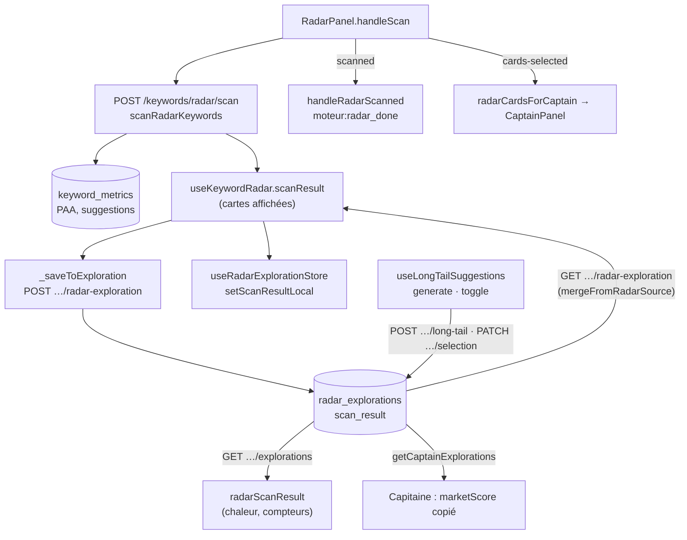

# Data Flow — radar-explorations

> **Description métier :** quand l'utilisateur lance le scan du Radar, l'outil mesure chaque mot-clé de la liste d'attente (volume, difficulté, CPC, intention, questions « Autres questions posées » (PAA), suggestions Google) et en tire une carte par mot-clé, puis une chaleur globale. Ce résultat, les longues traînes (requêtes plus longues, proposées par l'IA à partir des cartes) et les cases cochées sont enregistrés sur l'article pour être relus sans repayer.
> **Type/format :** `KeywordRadarScanResult` ([`shared/types/intent.types.ts`](../../shared/types/intent.types.ts)) — `cards: RadarCard[]`, `globalScore`, `heatLevel`, `verdict`, `autocomplete`, `specificTopic`, `broadKeyword`, `scannedAt` — plus `longTailSuggestions` et `longTailSelectedKeywords`, le tout dans la colonne JSONB `radar_explorations.scan_result`. La liste d'attente, dans la même ligne, a sa fiche : [radar-keywords.md](radar-keywords.md).

Construction détaillée : [Moteur — Radar et Capitaine](../14-radar-capitaine.md), sections « Radar — scan », « Radar — Score Marché et thermomètre », « Radar — longues traînes », « Radar — envoi au Capitaine, suggestions IA, étape ».

## Producteurs

Qui crée ou met à jour cette donnée :

### Le scan

- **Écran** — [`RadarPanel.vue`](../../src/components/intent/RadarPanel.vue) `handleScan` → [`useKeywordRadar().scan`](../../src/composables/keyword/useResonanceScore.ts) : `POST /api/keywords/radar/scan` avec la liste d'attente, `depth = 2`, `articleLevel`, sans la douleur.
- **Calcul** — [`server/services/keyword/keyword-radar.service.ts`](../../server/services/keyword/keyword-radar.service.ts) `scanRadarKeywords` : `kpis` (valeurs absentes laissées à `null`), `paaItems`, `marketScore = computeMarketScore(kpis, niveau)` ([`shared/scoring-kpi.ts`](../../shared/scoring-kpi.ts)), `relevanceScore: null`, `combinedScore` et `scoreBreakdown` hérités ; cartes triées par `compareScores(marketScore.total)` ; `globalScore` et `heatLevel` par `radarGlobalHeat` (moyenne de `combinedScore`).
- **Enregistrement** — `useKeywordRadar._saveToExploration` (lancé sans attente après la réponse) → `POST /api/articles/:id/radar-exploration` → `saveRadarExploration` ([`server/services/infra/radar-exploration.service.ts`](../../server/services/infra/radar-exploration.service.ts)) : upsert de **toute** la ligne (`seed`, contexte, `generated_keywords`, `scan_result`, `scanned_at`). En parallèle, `radarStore.setScanResultLocal` recopie le résultat dans [`useRadarExplorationStore`](../../src/stores/article/radar-exploration.store.ts), sans relire la base.
- **Signal au parent** — `RadarPanel` émet `scanned` si un résultat existe → `useMoteurCrossTabState.handleRadarScanned` : `radarScanResult` (chaleur pour la barre des compteurs) et `emitCheckCompleted(MOTEUR_RADAR_DONE)`.

### Les longues traînes

- **Génération** — [`RadarLongTailSuggestions.vue`](../../src/components/intent/RadarLongTailSuggestions.vue) (monté par `DouleurScannerResults` quand un article et un scan existent, visible à partir de 2 cartes) → [`useLongTailSuggestions`](../../src/composables/intent/useLongTailSuggestions.ts) `generate` / `regenerate` → `POST /api/articles/:id/radar-exploration/long-tail` → [`generateLongTailSuggestions`](../../server/services/keyword/long-tail-suggest.service.ts) : combinaison locale (`combineRoots`), cache `external_api_cache` type `long-tail-suggest` (7 jours), sinon IA et contrôle Zod ; puis `persistLongTailSuggestions` écrit `scan_result.longTailSuggestions` en gardant `cards` et la sélection déjà enregistrée. Un cache hit réécrit aussi les suggestions en base.
- **Cases cochées** — `useLongTailSuggestions.toggle` → `PATCH /api/articles/:id/radar-exploration/long-tail/selection` après 500 ms sans nouveau clic → `persistLongTailSelection` → `scan_result.longTailSelectedKeywords`. Le pré-cochage des 5 meilleures à la génération reste en mémoire : il n'est enregistré qu'au premier clic suivant.

### Hors de l'écran

- Le mode automatique appelle le scan mais n'enregistre pas l'exploration ([`scripts/auto-article/phases/moteur-explorer.ts`](../../scripts/auto-article/phases/moteur-explorer.ts)).

## Persistance

| Donnée | Où | Portée | Rôle |
|---|---|---|---|
| Cartes, chaleur, verdict, suggestions Google | `radar_explorations.scan_result` (JSONB) ; `'{}'` = jamais scanné | par article (`article_id` clé primaire, `ON DELETE CASCADE`) | **autorité** du dernier scan |
| Longues traînes et cases cochées | `scan_result.longTailSuggestions`, `scan_result.longTailSelectedKeywords` | par article | proposées par l'IA / choisies par l'utilisateur |
| Contexte du scan | `seed`, `broad_keyword`, `specific_topic`, `pain_point` (vide en mode `workflow`), `depth`, `scanned_at` | par article | relu par `mergeFromRadarSource` |
| Réponse IA des longues traînes | `external_api_cache` (`long-tail-suggest`, clé sha256 du titre, de la douleur, de `strategyContext` et des mots-clés triés) | partagé | évite de repayer l'IA |
| Mesures des mots-clés | `keyword_metrics` (suggestions et PAA, fraîcheur 1 jour) | partagé entre articles | cache du scan ; voir [keyword-metrics.md](keyword-metrics.md) |

Mémoire :
- `useKeywordRadar().scanResult` — **source des cartes affichées**. Vidé par `reset` (changement d'article) ; rempli par un scan ou par `mergeFromRadarSource`.
- `useRadarExplorationStore.scanCards` — copie du store, lue par le panneau d'aide des onglets Lieutenants et Lexique.
- `useMoteurCrossTabState.radarScanResult` — chaleur (`globalScore`, `heatLevel`), remplie par `handleRadarScanned` ou par `useArticleResults.onRadarLoaded` (relecture de `GET /api/articles/:id/explorations`).
- `useLongTailSuggestions` — suggestions et `Set` des cases, propres à chaque montage de la section.

## Consommateurs

### Affichage (UI)

- **Cartes** — [`RadarKeywordCard.vue`](../../src/components/intent/RadarKeywordCard.vue) en `displayMode="kpi"` : l'anneau affiche `computeKpiScore(card.kpis, niveau).total`, recalculé à l'écran ; « — » sans `kpis`. La copie `marketScore` enregistrée n'est pas lue par l'anneau.
- **Thermomètre** — [`RadarThermometer.vue`](../../src/components/shared/RadarThermometer.vue) dans [`DouleurScannerResults.vue`](../../src/components/intent/scanner/DouleurScannerResults.vue) : `scanResult.globalScore` et `heatLevel` du composable.
- **Longues traînes** — `RadarLongTailSuggestions.vue` : liste triée par `preferenceScore` décroissant, note « N/10 », justification, sources.
- **Barre « Résultats déjà calculés »** — [`src/utils/tab-cache-entries.ts`](../../src/utils/tab-cache-entries.ts) : compteur Radar (liste d'attente + cartes, `GET …/explorations/counts`), infobulle « Score N/100 » depuis `radarScanResult`.
- **Panneau d'aide** — [`KeywordAssistPanel.vue`](../../src/components/moteur/KeywordAssistPanel.vue) dans Lieutenants et Lexique : mots-clés des cartes du store, puis ceux de la liste d'attente.

### Calcul / tri / filtre / agrégat

- **Tri des cartes** — `RadarPanel` (`useSortableList`, clé `score`) : `computeKpiScore(card.kpis, niveau).total`, `null` sans `kpis` ou si le calcul échoue, `null` toujours en bas ([`src/composables/moteur/useSortableList.ts`](../../src/composables/moteur/useSortableList.ts)). Le tri serveur (`marketScore.total`) sort de la même fonction (`computeMarketScore` appelle `computeKpiScore`).
- **Filtre CPC** — `matchesCpcFilter(card.kpis.cpc)` ; une carte sans `kpis` passe toujours.
- **Envoi au Capitaine** — `RadarPanel.sendToCaptain` : cartes cochées puis longues traînes cochées (`toRadarCardFromLongTail` : `kpis: null`, `source: 'longtail'`), dédoublonnées sur `trim().toLowerCase()`, cartes d'abord → `cards-selected` → `useMoteurCrossTabState.handleCardsSelected` (second dédoublonnage : la carte qui a des `kpis` l'emporte) → `radarCardsForCaptain` → prop `radarCards` de `CaptainPanel`.
- **Classement « Suggestions IA Radar »** — [`useRadarRanking`](../../src/composables/moteur/useRadarRanking.ts) : cinq meilleures cartes par `averageScores([market, relevance])`, sans appel d'IA.
- **Capitaine, relecture** — `getCaptainExplorations` ([`server/services/infra/data.service.ts`](../../server/services/infra/data.service.ts)) reprend `marketScore` de la carte du même mot-clé (copie du scan) pour l'avis de l'IA ; il ignore tout `relevanceScore` d'un ancien scan.
- **Capitaine, étude** — `POST /api/keywords/:keyword/scan` ([`server/routes/keyword-scan.routes.ts`](../../server/routes/keyword-scan.routes.ts)) lit la carte du même mot-clé (texte identique) : `kpis.painAlignmentScore`, `scoreBreakdown.paaMatchScore`, `scoreBreakdown.resonanceBonus` et `kpis.intentTypes` passent avant le calcul lexical contre la douleur.
- **Chaleur globale** — `radarGlobalHeat` : moyenne des `combinedScore`, qui comptent 0 pour une mesure absente.

> **Règle de cohérence affichage / calcul** — L'anneau et le tri lisent la même expression, `computeKpiScore(card.kpis, niveau).total`, avec `null` en bas de liste et « — » à l'écran. Aucun repli sur `combinedScore` ni sur la copie `marketScore`. Une longue traîne (`kpis: null`) n'a pas de note marché : elle est placée en bas du tri et échappe au filtre CPC.

## Cas d'usage à risque

| Cas | Lecture | Écriture | Risque |
|---|---|---|---|
| **Premier chargement** (choix d'un article) | `useArticleResults.loadCachedResults` → `GET /api/articles/:id/explorations` → chaleur dans `radarScanResult` ; `radarStore.setArticle` → cartes du store | aucune | **Modéré** : les cartes de l'écran Radar ne sont pas relues d'office. Elles reviennent si l'onglet était déjà monté (`handleSelectArticle` → `mergeFromRadarSource`), sinon par « Charger Radar » (`useTabLoadPrompt`). |
| **Premier scan** | — | `POST …/radar/scan`, puis `POST …/radar-exploration` | Faible pour les cartes. L'étape `moteur:radar_done` part dès la réponse du scan, avant la fin de l'enregistrement. |
| **Rechargement de la page** | après choix de l'article : chaleur et store relus, cartes par « Charger Radar » | aucune | **Modéré** : longues traînes et cases cochées ne reviennent jamais à l'écran (`initialSuggestions` n'est pas transmis) ; écart `FR-RAD-LONGTAIL-UI`, déjà relevé. |
| **Nouveau scan** | — | `saveRadarExploration` réécrit tout `scan_result` | **Élevé** : les longues traînes enregistrées sont effacées, et la liste d'attente est réécrite (voir [radar-keywords.md](radar-keywords.md)). Écart `FR-RAD-PERSIST`, déjà relevé. |
| **Changement d'article** | watcher de `RadarPanel` sur titre, mot-clé, douleur → `reset()` du composable ; `resetCrossTabState` vide `radarCardsForCaptain` et `radarScanResult` | aucune | Faible : rien de l'article précédent ne reste affiché. |
| **Retour sur l'onglet** | panneau gardé monté (`v-show`) : cartes, cases et longues traînes restent en mémoire | aucune | Faible : ni relecture, ni appel payant. |
| **Régénérer les longues traînes** | cache `long-tail-suggest` | `persistLongTailSuggestions` | Faible : mêmes entrées, même clé, pas d'IA. La sélection en base n'est pas filtrée sur la nouvelle liste (seule la mémoire l'est). |
| **Case cochée puis rechargement immédiat** | — | `PATCH` différé de 500 ms | Faible : le dernier clic peut être perdu ; il ne serait de toute façon pas réaffiché. |
| **Longue traîne identique à une carte** | — | — | Faible : la carte, qui a des mesures, l'emporte aux deux dédoublonnages. |

## Diagramme

## Limites connues

- **Un scan efface les longues traînes et réécrit la liste d'attente** (`saveRadarExploration` écrase `generated_keywords` et `scan_result`). Écarts `FR-RAD-PERSIST` et `FR-RAD-LONGTAIL-REGENERATE`, déjà relevés.
- **Longues traînes enregistrées mais jamais relues** : aucun code n'affiche `longTailSuggestions` ni `longTailSelectedKeywords` après un rechargement. Écart `FR-RAD-LONGTAIL-UI`, déjà relevé.
- **Le thermomètre ne suit pas la note affichée** : il fait la moyenne de `combinedScore`, où une mesure absente vaut 0. Dette connue (`FR-RAD-THERMOMETER`, [Moteur — Radar et Capitaine](../14-radar-capitaine.md)).
- **L'étude du Capitaine prend des signaux du Radar pour des signaux de douleur** : `scoreBreakdown.paaMatchScore` et `resonanceBonus` mesurent l'accord avec le mot-clé et le sujet, pas avec la douleur ; `painAlignmentScore` n'est plus produit par le scan. Écart de `FR-CAP-RELEVANCE-LIVE`, déjà relevé.
- **`marketScore` enregistré est une copie** calculée avec le niveau du moment du scan. L'écran Radar la recalcule, l'avis de l'IA du Capitaine la relit telle quelle.
- **La provenance ne suit pas** : `source: 'longtail'` vit sur la carte envoyée au Capitaine, mais n'est enregistrée nulle part. Écart `FR-RAD-SEND-CAPTAIN`, déjà relevé.

## Tests qui la gardent

- [`tests/unit/coherence/radar-explorations.test.ts`](../../tests/unit/coherence/radar-explorations.test.ts) — blocs `FR-RAD-PERSIST`, `FR-RAD-LONGTAIL-REGENERATE`, `FR-RAD-SEND-CAPTAIN`, `FR-RAD-SCORING-BIMODAL`, `FR-RAD-LONGTAIL-UI`. **Attention** : le fichier n'importe aucun code de l'outil. Chaque test recopie la règle qu'il vérifie (fusion, dédoublonnage, tri, pré-cochage) : il ne casserait pas si le code changeait.
- Tests qui exercent le vrai code :
  - [`tests/unit/composables/useLongTailSuggestions.test.ts`](../../tests/unit/composables/useLongTailSuggestions.test.ts) — pré-cochage des 5 meilleures, régénération qui garde les cases encore présentes, `PATCH` différé.
  - [`tests/unit/composables/useResonanceScore.merge.test.ts`](../../tests/unit/composables/useResonanceScore.merge.test.ts) — `mergeRadarPayload` n'adopte les cartes que si la mémoire est vide.
  - [`tests/unit/composables/moteur/useMoteurCrossTabState.test.ts`](../../tests/unit/composables/moteur/useMoteurCrossTabState.test.ts) — dédoublonnage de l'envoi au Capitaine, étape `moteur:radar_done`.
  - [`tests/contract-api/long-tail-suggest.contract.test.ts`](../../tests/contract-api/long-tail-suggest.contract.test.ts) — génération, relecture du cache, `PATCH` de la sélection (serveur requis).
  - [`tests/integration-tabs/moteur-radar.tab.test.ts`](../../tests/integration-tabs/moteur-radar.tab.test.ts) — scan et upsert de l'exploration (serveur requis).
  - [`tests/browser-e2e/parcours/interactions-radar.parcours.test.ts`](../../tests/browser-e2e/parcours/interactions-radar.parcours.test.ts), [`radar.parcours.test.ts`](../../tests/browser-e2e/parcours/radar.parcours.test.ts) — tri, filtre CPC, longues traînes cochées, parcours complet par niveau.

À écrire :
1. Un scan ne doit effacer ni les longues traînes ni la liste d'attente enregistrées.
2. Au rechargement, les longues traînes et leurs cases reviennent à l'écran.
3. Réécrire `tests/unit/coherence/radar-explorations.test.ts` pour appeler `RadarPanel.sendToCaptain`, `handleCardsSelected`, `computeKpiScore` et `useLongTailSuggestions` au lieu de leurs copies.

---

*Document maintenu par la discipline data-flow-discipline. Cf. [README](./README.md).*
