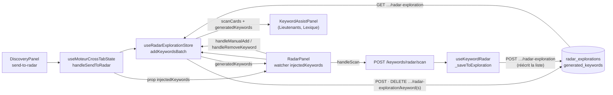

# Data Flow — radar-keywords (liste d'attente du Radar)

> **Description métier :** la liste d'attente est la liste des mots-clés qu'un article va faire scanner au Radar. Elle se remplit depuis Discovery (« Envoyer au Radar ») ou à la main, se vide mot par mot (×), et sert d'entrée au bouton « Lancer le scan ». Elle vit en base, une liste par article.
> **Type/format :** `RadarKeyword[]` ([`shared/types/intent.types.ts`](../../shared/types/intent.types.ts)), dans la colonne JSONB `generated_keywords` de la table `radar_explorations` (une ligne par article, clé `article_id`). Le résultat du scan, lui, est décrit dans [radar-explorations.md](radar-explorations.md).

Détail des composants et des routes : [Moteur — Radar et Capitaine](../14-radar-capitaine.md), section « Radar — liste d'attente et exploration enregistrée ». Envoi depuis Discovery : [Moteur — Discovery](../13-discovery.md), section « Envoi au Radar et étape Discovery ».

## Producteurs

Qui crée ou met à jour cette donnée :

| Geste | Chemin | Écriture |
|---|---|---|
| « Envoyer au Radar » (Discovery) | `DiscoveryPanel` émet `send-to-radar` → [`useMoteurCrossTabState.handleSendToRadar`](../../src/composables/moteur/useMoteurCrossTabState.ts) → `radarStore.addKeywordsBatch` (non attendu) | `POST /api/articles/:id/radar-exploration/keywords` → `addKeywordsBatchToRadarExploration` |
| Même envoi, second passage | [`RadarPanel.vue`](../../src/components/intent/RadarPanel.vue), watcher `injectedKeywords` (`immediate`) → `addKeywordsBatch` si `useDbFirst` | même route ; sans effet si déjà présents |
| Saisie « Ajouter un mot-clé à scanner… » | `RadarPanel.handleManualAdd` → `radarStore.addKeyword` | `POST /api/articles/:id/radar-exploration/keyword` → `addKeywordToRadarExploration` |
| Croix d'une puce | `RadarPanel.handleRemoveKeyword` → `radarStore.removeKeyword` | `DELETE /api/articles/:id/radar-exploration/keyword?keyword=` → `removeKeywordFromRadarExploration` |
| Fin d'un scan réussi | [`useKeywordRadar`](../../src/composables/keyword/useResonanceScore.ts) `scan` → `_saveToExploration` | `POST /api/articles/:id/radar-exploration` → `saveRadarExploration` **réécrit** la liste avec la copie mémoire du composable (voir Limites connues) |

- Store : [`src/stores/article/radar-exploration.store.ts`](../../src/stores/article/radar-exploration.store.ts) (`useRadarExplorationStore`). Chaque mutation remplace `entry` par la réponse du serveur : l'écran montre ce que la base a enregistré, jamais une copie optimiste.
- Serveur : [`server/routes/radar-exploration.routes.ts`](../../server/routes/radar-exploration.routes.ts), [`server/services/infra/radar-exploration.service.ts`](../../server/services/infra/radar-exploration.service.ts). Les ajouts et retraits passent par `persistGeneratedKeywords`, qui n'écrit que `generated_keywords` (et `scanned_at`) et crée la ligne si elle manque.
- Dédoublonnage : `normalizeKeywordForDedup` (`trim().toLowerCase()`) côté serveur ; un doublon renvoie `added: false` sans écrire.
- Identifiant d'article : la route refuse tout `id` non entier positif (400 `INVALID_ID`).
- Le mode automatique (`auto:article`) n'écrit pas cette liste : il envoie ses mots-clés directement au scan ([`scripts/auto-article/phases/moteur-explorer.ts`](../../scripts/auto-article/phases/moteur-explorer.ts)).

## Persistance

| Où | Portée | Rôle |
|---|---|---|
| `radar_explorations.generated_keywords` (JSONB) | par article (`article_id` clé primaire, `ON DELETE CASCADE`) | **autorité** : la liste d'attente |
| `radar_explorations.scanned_at` | par article | mis à `NOW()` par **toute** écriture de la ligne, ajout ou retrait compris |
| `useRadarExplorationStore.entry` | mémoire Pinia, un article à la fois | copie de la dernière réponse du serveur ; vidée par `$reset` au montage de `MoteurView` |
| `useKeywordRadar().generatedKeywords` | mémoire du composable, propre à chaque `RadarPanel` | copie remplie seulement par `mergeFromRadarSource` en mode `workflow` ; c'est elle que `_saveToExploration` renvoie au serveur |
| `useMoteurCrossTabState.discoveryRadarKeywords` | mémoire de `MoteurView` | dernier envoi de Discovery, transmis à `RadarPanel` par la prop `injectedKeywords` ; vidé au changement d'article |

## Consommateurs

### Affichage (UI)

- **Puces « N mots-clés à scanner »** — `RadarPanel.vue` lit `radarStore.generatedKeywords` quand `useDbFirst` est vrai (mode `workflow` et `articleId > 0`), sinon la liste du composable. Le bloc reste visible après un scan pour ajouter, retirer et relancer.
- **Panneau d'aide « mots-clés du Radar »** — [`KeywordAssistPanel.vue`](../../src/components/moteur/KeywordAssistPanel.vue), monté par `LieutenantsPanel` et `LexiquePanel` : `assistKeywords` = cartes scannées (`radarStore.scanCards`) puis liste d'attente, dédoublonnées en minuscules.
- **Compteur Radar de la barre « Résultats déjà calculés »** — `GET /api/articles/:id/explorations/counts` ([`server/routes/article-explorations.routes.ts`](../../server/routes/article-explorations.routes.ts)) : `radar` = longueur de `generated_keywords` + longueur de `scan_result.cards`.

### Calcul / tri / filtre / agrégat

- **Entrée du scan** — `RadarPanel.handleScan` envoie `[...generatedKeywords]` (la liste affichée) à `POST /api/keywords/radar/scan`. Ce que l'utilisateur voit est exactement ce qui est scanné.
- **Phase de l'écran** — `RadarPanel.phase` vaut `keywords` dès que la liste n'est pas vide et qu'aucun scan n'est en mémoire.
- **Invite de chargement** — `useKeywordRadar.mergeRadarPayload` ajoute à la copie du composable les mots-clés absents (clé `trim().toLowerCase()`), sans retirer ceux déjà en mémoire.

> **Règle de cohérence affichage / calcul** — La liste scannée est la liste affichée : `handleScan` lit le même `generatedKeywords` que les puces. Le dédoublonnage suit partout la même clé (`trim().toLowerCase()`) : serveur, fusion du composable, envoi au Capitaine.

## Cas d'usage à risque

| Cas | Lecture | Écriture | Risque |
|---|---|---|---|
| **Premier chargement** (choix d'un article) | watcher `selectedArticle.id` de [`MoteurView.vue`](../../src/views/MoteurView.vue) → `radarStore.setArticle(id)` → `GET /api/articles/:id/radar-exploration` ; `RadarPanel` rappelle `setArticle` à son montage (sans effet si l'id est le même) | aucune | Faible : la liste s'affiche quel que soit l'onglet ouvert en premier. |
| **Envoi depuis Discovery** | — | deux `POST …/keywords` (composable parent puis watcher du panneau) | Faible : ajout idempotent. L'onglet et l'étape `moteur:discovery_done` partent avant la réponse ; un échec d'écriture n'est que journalisé. |
| **Rechargement de la page** | aucun article choisi après F5 : `MoteurView` remet les stores à zéro ; le choix de l'article relit la base | aucune | Faible pour la liste elle-même. Elle peut toutefois avoir été vidée ou tronquée par le dernier scan (Limites connues). |
| **Changement d'article** | `setArticle(nouvel id)` vide `entry` puis relit ; `resetCrossTabState` vide `discoveryRadarKeywords` | aucune | Faible : `setArticle` ignore un id identique et réinitialise sinon. |
| **Retour sur l'onglet** | le panneau reste monté (`v-show`) ; la liste est celle du store | aucune | Faible : pas de relecture, pas d'appel payant. |
| **Article de la stratégie sans ligne en base (id 0)** | `setArticle(0)` garde l'id sans relire ; `RadarPanel` passe en liste mémoire (`useDbFirst` faux) | `handleSendToRadar` tente quand même `POST /articles/0/…` | Faible : 400 `INVALID_ID`, journalisé ; la liste reste en mémoire et disparaît au changement d'article. |
| **Doublon saisi à la main** | — | `added: false` | Le champ se vide sans message (écart de `FR-RAD-MANUAL-ADD`, déjà relevé). |

## Diagramme

## Limites connues

- **Le scan réécrit la liste d'attente.** `_saveToExploration` envoie `generatedKeywords` du composable, pas celle du store. En mode `workflow`, cette copie n'est remplie que par `mergeFromRadarSource` (sélection d'article avec l'onglet Radar déjà monté, ou bouton « Charger Radar »). Sans ce chargement, le scan enregistre une liste vide ; avec, il enregistre la liste lue à ce moment, sans les ajouts faits depuis. La liste du store n'est pas touchée (`setScanResultLocal`) : l'écran ne montre la perte qu'à la relecture suivante. Écart de `FR-RAD-PERSIST`, déjà relevé.
- **Le compteur peut compter deux fois un mot-clé.** Le commentaire de la requête de comptage suppose que les deux listes sont disjointes. Le code ne retire jamais un mot-clé scanné de la liste d'attente : quand la liste réécrite par le scan contient des mots-clés scannés, ils sont comptés deux fois.
- **`scanned_at` n'est pas la date du scan.** Tout ajout, retrait ou enregistrement de longues traînes la remet à l'heure courante. La fraîcheur de 7 jours de `GET …/radar-exploration/status` (sans appelant dans l'interface) en dépend.

## Tests qui la gardent

- [`tests/unit/stores/radar-exploration.store.test.ts`](../../tests/unit/stores/radar-exploration.store.test.ts) — `setArticle` (vide, même id sans relecture, changement d'id), ajouts et retraits qui remplacent l'état par la réponse, ajout ignoré sans article.
- [`tests/contract-api/radar-exploration-keyword.contract.test.ts`](../../tests/contract-api/radar-exploration-keyword.contract.test.ts) — ajout unitaire et par lot idempotents, dédoublonnage insensible à la casse et aux espaces, retrait (serveur requis).
- [`tests/contract-api/article-explorations-counts.contract.test.ts`](../../tests/contract-api/article-explorations-counts.contract.test.ts) — deux mots-clés en attente donnent `radar = 2`.
- [`tests/unit/composables/useResonanceScore.merge.test.ts`](../../tests/unit/composables/useResonanceScore.merge.test.ts) — fusion sans doublon ni changement d'ordre.
- [`tests/unit/composables/moteur/useMoteurCrossTabState.test.ts`](../../tests/unit/composables/moteur/useMoteurCrossTabState.test.ts) — l'envoi depuis Discovery.
- Dans `tests/unit/coherence/`, aucun test ne vise la liste d'attente.

À écrire :
1. Scan en mode `workflow` sans chargement préalable : la liste d'attente en base ne doit pas être vidée.
2. Compteur Radar : un mot-clé présent dans la liste d'attente et dans les cartes ne compte qu'une fois.

---

*Document maintenu par la discipline data-flow-discipline. Cf. [README](./README.md).*
