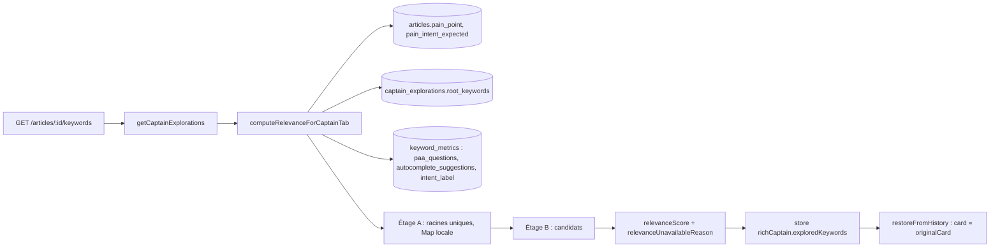

# Data Flow — Score Pertinence calculé en direct

> **Description métier :** la note sur 100 qui dit si un mot-clé candidat sert la douleur de l'article (le problème du lecteur que l'article doit résoudre). Elle n'est jamais enregistrée : on la recalcule à chaque ouverture, avec la formule et la douleur du moment.
> **Type/format :** `RelevanceScoreLiveResult` ([`shared/types/scoring.types.ts`](../../shared/types/scoring.types.ts)). `total: null` s'accompagne d'une raison typée (§ 8).
> **Références :** [14 — Radar et Capitaine](../14-radar-capitaine.md) § « Capitaine — Score Pertinence calculé en direct » et § « Capitaine — enregistrement et relecture ». Vue d'ensemble des deux notes (Marché, Pertinence) : [score-capitaine](score-capitaine.md). Jugement IA des PAA : [captain-relevance](captain-relevance.md).

## 1. Producteurs

Qui crée ou met à jour cette donnée :

- **Calcul de relecture** — `computeRelevanceForCaptainTab(articleId, keywords, paaJudgmentOverrides?)` ([`captain-relevance.service.ts`](../../server/services/keyword/captain-relevance.service.ts), en-tête `AUTHORITY:`). Deux appelants :
  - `getCaptainExplorations` ([`data.service.ts`](../../server/services/infra/data.service.ts)), donc chaque `GET /api/articles/:id/keywords` et `GET /api/articles/:id/captain-explorations`, sans correction IA ;
  - `runPaaJudgmentsForArticle` ([`captain-paa-judge.service.ts`](../../server/services/keyword/captain-paa-judge.service.ts)), donc `POST /api/articles/:id/captain/judge-paa`, avec la note de l'IA en signal 2 (cf. § 6).
- **Calcul « à l'étude »** — `POST /api/keywords/:keyword/scan` ([`keyword-scan.routes.ts`](../../server/routes/keyword-scan.routes.ts)) calcule sa propre note, avec d'autres entrées (§ 7).
- **Entrée `captain_explorations.root_keywords`** — écrite à chaque étude par `saveCaptainExploration` avec `extractRoots(keyword)` (§ 5).
- Le scan Radar ne produit aucune Pertinence (`relevanceScore: null`, FR-RAD-NO-RELEVANCE-IN-SCAN).

## 2. Le calcul, étape par étape

Tout se passe dans une seule requête HTTP, en lecture seule.

1. **Lecture** — en parallèle `getArticlePainPoint` ([`article-pain-point.service.ts`](../../server/services/queries/article-pain-point.service.ts) : `'(non défini)'` si absente) et `getArticlePainIntent` ([`article-pain-intent.service.ts`](../../server/services/queries/article-pain-intent.service.ts) : `null` si absente ou inconnue). Puis les racines uniques de tous les candidats (un `Set`), puis `loadMetricsBatch(candidats + racines)` : un `getKeywordMetrics` par mot-clé, en parallèle ; un mot-clé sans ligne n'entre pas dans la `Map`.
2. **Racines (étage A)** — chaque racine unique est notée une fois, sans signal « racines » (pas de récursion), et rangée dans une `Map` locale (FR-CAP-RELEVANCE-MEMOIZATION).
3. **Candidats (étage B)** — pour chaque candidat : moyenne arrondie des notes non nulles de ses racines, lue dans la `Map` (`null` s'il n'y en a aucune), puis note du candidat.
4. **Réponse** — `{ cards, roots, metrics, painPointSnapshot, computedAt }`. La `Map` disparaît avec la fonction. `getCaptainExplorations` garde `cards` pour les candidats et, pour une racine **sans** étude à elle pour l'article, sa note (`roots`) et ses mesures (`metrics`, déjà lues : ni requête ni appel de plus) dans `rootStudies`, que `getArticleKeywords` range dans `richRootKeywords` (FR-CAP-ROOTS).

**Note d'un mot-clé** — `computeRelevanceForSingleKeyword` refuse d'abord, dans cet ordre (§ 8) : douleur absente, `'(non défini)'` ou de moins de 10 caractères → `no-pain` ; longue traîne → `long-tail` ; aucune ligne `keyword_metrics` ou aucune PAA → `missing-paa` ; aucune suggestion → `missing-autocomplete`. Sinon, cinq signaux, tous lexicaux sauf le cinquième :

| Signal | Poids | Expression |
|---|---|---|
| 1. Douleur × mot-clé | 30 % | `lexicalPainAlignment(keyword, painWords)` : 100 accord total, 60 partiel exact, 50 partiel par racine, 0 sinon ([`lexical-pain-alignment.ts`](../../server/services/keyword/lexical-pain-alignment.ts)) |
| 2. PAA × douleur | 25 % | note de l'IA (`overallPaaScore`) si fournie, sinon `avgLexicalPainAlignment` des questions (et réponses) de `keyword_metrics.paa_questions` |
| 3. Suggestions × douleur | 15 % | `avgLexicalPainAlignment` des `autocomplete_suggestions` |
| 4. Racines | 20 % | moyenne des racines ; absente → ses 20 % sont répartis sur les quatre autres |
| 5. Intention × douleur | 10 % | `computeIntentPainAlignment([intent_label], painIntentExpected)` (matrice 4 × 4), moins 10 points si l'intention attendue n'est pas celle de la SERP ; 50 si l'une manque (cf. [intent](intent.md)) |

`painWords` découpe la douleur sur tout ce qui n'est ni lettre ni chiffre et garde les mots de 3 caractères ou plus (`painPointToWords`). `computeRelevanceScore` ([`shared/scoring.ts`](../../shared/scoring.ts)) remplace un signal absent par 50, arrondit, borne 0..100 et pose le verdict (≥ 70 GO, ≥ 40 ORANGE, sinon NOGO).

## 3. Persistance

- **La note** : nulle part en base ni dans le navigateur au-delà de la session (FR-CAP-RELEVANCE-LIVE). Aucune colonne `relevance_score` (un test le vérifie), aucun cache à durée de vie, aucun `localStorage`.
- **Ses entrées**, toutes en base : `articles.pain_point`, `articles.pain_intent_expected`, `captain_explorations.root_keywords`, `keyword_metrics.paa_questions`, `.autocomplete_suggestions`, `.intent_label`.
- **En mémoire** : `useArticleKeywordsStore().keywords.richCaptain.exploredKeywords[].relevanceScore` et `.relevanceUnavailableReason`, puis les entrées de `useExploredKeywords` (`card`, `originalCard`). F5 ou changement d'article → nouveau calcul.
- La douleur ne change pas au Moteur (FR-PAIN-IMMUTABLE-AFTER-CEREVEAU) : `CaptainPanel` ne surveille pas `painPoint` (FR-CAP-NO-PAINPOINT-WATCHER). Une douleur modifiée au Cerveau est prise en compte à la réouverture suivante.

## 4. Consommateurs

### Affichage (UI)

- **Anneau de la carte** — [`RadarKeywordCard.vue`](../../src/components/intent/RadarKeywordCard.vue), mode `relevance` : `card.relevanceScore.total`, ou « — » avec la raison (§ 8). L'info-bulle détaille les cinq composantes (`breakdownRows`).
- **Racines** — [`CaptainRootsSidebar.vue`](../../src/components/moteur/CaptainRootsSidebar.vue) affiche la note de l'étude de chaque racine étudiée ; à la relecture, une racine sans étude à elle montre la note de l'étage A (`rootStudies`), et une racine jamais mesurée « — » (« Racine pas encore étudiée… »).

### Calcul / tri / filtre / agrégat

- **Tri « Score Pertinence »** du Capitaine : `originalCard.relevanceScore.total` ([`CaptainPanel.vue`](../../src/components/moteur/CaptainPanel.vue)).
- **Avis de l'IA** : `entry.validation.relevanceScore` envoyé à `POST /api/keywords/:keyword/ai-panel`.
- **Moyenne des racines** (écran) : `averageScores`.

> **Règle de cohérence affichage / calcul** — Si une valeur est **affichée à l'utilisateur** ET utilisée pour du **tri / filtre / calcul dérivé / agrégat**, **la même expression** produit les deux. Pas de fallback différent entre l'affichage et le calcul. Si la valeur est `null` à l'affichage, elle est `null` partout (item placé en bas du tri, exclu de la moyenne).
>
> Ici : après une relecture, `restoreFromHistory` construit une seule carte par candidat (`card` = `originalCard`), si bien que l'anneau et le tri lisent le même `relevanceScore.total`. Une note absente reste `null` : « — » sur l'anneau, carte en bas du tri, exclue des moyennes. Les écarts viennent des autres chemins (§ 7).

## 5. Racines (`captain_explorations.root_keywords`)

- `extractRoots(keyword)` ([`shared/utils/keyword-roots.ts`](../../shared/utils/keyword-roots.ts)) : mot-clé d'au moins 3 mots ; troncatures depuis la fin, de N-1 à 2 mots ; une troncature n'est gardée que si elle compte au moins 2 mots hors `FRENCH_STOPWORDS` ; 5 au plus. Pure, sans IA. Exemple : « cours piano intermédiaire paris » → « cours piano intermédiaire », « cours piano ».
- Écriture : à **chaque étude** (`saveCaptainExploration`, UPSERT `root_keywords = EXCLUDED.root_keywords`), par le même algorithme déterministe ; jamais au verrouillage (FR-CAP-RELEVANCE-INPUTS). `POST /api/articles/:id/captain-explorations` calcule aussi les racines si le corps n'en a pas, mais aucun écran ne l'appelle.
- Lecture : le calcul lit la colonne **sans** repli sur `extractRoots` ; une liste vide donne « pas de racines » et la redistribution des 20 %.
- `computeRootsRelevanceScore` (dédoublonnage Jaccard ≥ 0,75, `shared/scoring.ts`) existe mais n'est pas branché au calcul.
- Homonyme à ne pas confondre : `article_keywords.root_keywords` (racines explorées sur la carte verrouillée, cf. [keywords](keywords.md)).

## 6. Correction par le jugement IA des PAA

`POST /api/articles/:id/captain/judge-paa` relance le même calcul en passant, pour chaque candidat jugé, `overallPaaScore` comme signal 2 (les racines restent lexicales). Si l'IA échoue pour un candidat, son signal 2 reste lexical. Le store remplace alors `relevanceScore` (ou la raison) des entrées de `richCaptain.exploredKeywords`. Détail et limite (ces notes n'atteignent pas la liste) : [captain-relevance](captain-relevance.md).

## 7. Étude contre relecture : deux calculs

Juste après l'étude d'un mot-clé, la note affichée ne vient pas de `computeRelevanceForCaptainTab` mais du calcul de `POST /api/keywords/:keyword/scan` :

| | Étude (`/scan`) | Relecture |
|---|---|---|
| Douleur | `painPoint` envoyé par l'écran (`selectedArticle.painPoint`), mots par `extractTopicWords` | `articles.pain_point`, mots par `painPointToWords` |
| Signaux 1 à 3 | d'abord ceux de la carte du Radar du même mot-clé (`kpis.painAlignmentScore`, `scoreBreakdown.paaMatchScore`, `scoreBreakdown.resonanceBonus`), sinon lexical | lexical (ou IA pour le signal 2) |
| Racines | jamais (`rootsAverageScore: null`) | moyenne des racines |
| Intention | types de la carte du Radar s'ils existent, sinon `intent_label` | `intent_label` |
| Refus | aucun signal → `null`, sans raison | raison typée (§ 8) |

`paaMatchScore` et `resonanceBonus` du Radar mesurent l'accord avec le **sujet**, pas avec la douleur : un mot-clé déjà scanné au Radar reçoit donc une note à l'étude même sans point de douleur. C'est pourquoi FR-CAP-RELEVANCE-LIVE et FR-CAP-PAINPOINT-FALLBACK sont « non tenues ».

## 8. Raisons d'absence (`unavailableReason`)

| Raison | Produite par le serveur quand… | Message de l'info-bulle ([`RadarCardScoreRing.vue`](../../src/components/intent/radar-card/RadarCardScoreRing.vue)) |
|---|---|---|
| `no-pain` | douleur absente, `'(non défini)'` ou de moins de 10 caractères | définir un point de douleur, puis recharger l'onglet |
| `long-tail` | jamais : `isLongTail` est codé `false` par les deux appelants | « non applicable aux longues traînes » |
| `missing-paa` | aucune ligne `keyword_metrics`, ou aucune PAA | relancer la validation |
| `missing-autocomplete` | aucune suggestion Google | relancer la validation |
| (écran) `no-signals` | le serveur n'a pas donné de raison | « les signaux SERP n'ont rien produit » |

- Le serveur journalise chaque refus (`log.info('[Capitaine] relevanceScore null', { keyword, reason })`).
- L'écran prend la raison du serveur (`card.relevanceUnavailableReason`, recopiée par `restoreFromHistory`) ; à défaut il la devine : `long-tail` si la carte n'a pas de KPI, `no-pain` si la douleur connue de l'écran fait moins de 10 caractères, sinon `no-signals`.
- `PaaJudgmentUnavailableReason` déclare `haiku-unavailable`, jamais produite : un échec de l'IA n'est pas signalé.
- FR-CAP-RELEVANCE-UNAVAILABLE-REASON est « non tenue » pour ces trois points (longue traîne, IA, raison devinée).

## 9. Cas d'usage à risque

| Cas | Comportement |
|---|---|
| Premier affichage d'un mot-clé saisi à la main | Note « à l'étude » (§ 7). |
| Carte envoyée depuis le Radar | Pas de note (« — », raison devinée) jusqu'à la réouverture ; la note « à l'étude » part seulement dans `validation` (avis de l'IA). |
| Réouverture, F5, changement d'article | Relecture complète, cohérente avec la douleur et la formule du moment. |
| Douleur modifiée au Cerveau | Prise en compte à la réouverture suivante, sans action. |
| Deux relectures sans changement en base | Même note (calcul déterministe, sans cache). |
| Racine partagée par plusieurs candidats | Notée une seule fois par requête. |
| Verrouillage | Aucun recalcul, aucune écriture de racines. |

## 10. Limites connues

- Deux calculs pour une même note (§ 7) ; une longue traîne n'est jamais signalée comme telle (§ 8).
- `loadMetricsBatch` fait une requête par mot-clé (N requêtes parallèles), acceptable tant que les candidats restent peu nombreux.
- Les notes des racines de l'étage A n'atteignent l'écran que pour les racines sans étude à elles ; une racine étudiée montre la note de son étude.

## 11. Tests de cohérence qui la gardent

- [`tests/unit/coherence/relevance-live-computation.test.ts`](../../tests/unit/coherence/relevance-live-computation.test.ts) — extraction des racines (`FR-CAP-RELEVANCE-LINEAR-ROOTS`), existence du service, type de `unavailableReason`, aucune colonne de score dans le schéma, câblage de l'intention attendue et malus (`FR-CAP-RELEVANCE-INTENT-SIGNAL`). Les blocs « pas d'écriture », « pas de cache », « racines lues en base », « mémoïsation », « raisons » et « scan Radar » sont encore des `it.todo`.
- [`tests/unit/services/captain-relevance-haiku-override.service.test.ts`](../../tests/unit/services/captain-relevance-haiku-override.service.test.ts) (signal 2 remplacé par l'IA, repli lexical), [`tests/unit/shared/scoring.test.ts`](../../tests/unit/shared/scoring.test.ts), [`tests/unit/shared/intent-mismatch-malus.test.ts`](../../tests/unit/shared/intent-mismatch-malus.test.ts), [`tests/unit/shared/roots-relevance.test.ts`](../../tests/unit/shared/roots-relevance.test.ts), [`tests/unit/components/captain-validation-painpoint-frozen.test.ts`](../../tests/unit/components/captain-validation-painpoint-frozen.test.ts) (pas de surveillance de la douleur), [`tests/unit/composables/useExploredKeywords-hydrate-scores.test.ts`](../../tests/unit/composables/useExploredKeywords-hydrate-scores.test.ts).
- À écrire : un même mot-clé garde la même note juste après son étude et après réouverture (échouera tant que § 7 existe).

---

*Document maintenu par la discipline data-flow-discipline. Cf. [README](./README.md).*
