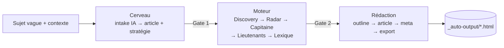

# CLI `auto:article` — génération automatique d'article SEO

> Outil en ligne de commande qui déroule automatiquement le pipeline complet
> **Cerveau → Moteur → Rédaction** à partir d'une description vague de sujet, et
> produit un article prêt (contenu HTML + meta + mots-clés verrouillés).
>
> Épic : [`_bmad-output/implementation-artifacts/epic-auto-article-pipeline.md`](../_bmad-output/implementation-artifacts/epic-auto-article-pipeline.md).

## Prérequis

Le CLI est un **client de l'API HTTP** : le serveur dev doit tourner.

```bash
npm run dev          # démarre back (:3400) + front (:5400)
```

## Lancement

```bash
npm run auto:article -- [options]
```

En mode interactif, le CLI demande : le **sujet** (une phrase, même vague), un
cocon cible **optionnel** (laisser vide pour que le script propose), et un
contexte business optionnel.

> Le **niveau** de l'article (Pilier / Intermédiaire / Spécialisé) n'est plus
> saisi : le script le **propose** en lisant l'arbre SEO, et tu le valides au
> Gate 1.

### Options

| Option | Effet |
|---|---|
| `--mode=mock` (défaut) | Sources externes simulées (0 crédit, fixtures). Pour tester le pipeline. |
| `--mode=real` | Appels **réels** DataForSEO + Claude (**facturés**), cache multi-niveau + cost-guard actifs. |
| `--port=<n>` | Port du serveur dev (défaut `$PORT` ou 3400). |
| `--config=<file>` | Run non-interactif depuis un JSON (gates auto-validés). Voir ci-dessous. |
| `--cocoon=<nom>` | **Impose** le cocon cible (pas de proposition d'emplacement). Utile pour un lot ciblé ; économise aussi l'appel IA de placement. |
| `--level=<niveau>` | Impose `pilier`, `intermediaire` ou `specifique`. |
| `--resume=<id>` | Reprend un article existant : saute les phases déjà réalisées (idempotent). |
| `--verbose`, `-v` | Logs détaillés. |
| `--help`, `-h` | Aide. |

### Run non-interactif (`--config`)

```json
{
  "topic": "aider les artisans BTP à être visibles localement sur Google",
  "cocoonName": "Croissance digitale Toulouse",
  "articleType": "intermediaire"
}
```

```bash
npm run auto:article -- --mode=mock --config=run.json
```

## Le pipeline



- **2 gates** de validation humaine. En interactif : `[Entrée]` valide, `r`
  régénère/relance, `a` abandonne. En `--config` / `--resume` : auto-validés.
  - **Gate 1 — Emplacement & brief** : affiche l'**arbre SEO** (Silo → Cocon →
    Articles, avec la composition `P/I/S` de chaque cocon), l'**emplacement
    proposé** et sa justification, puis le brief. `[e]` permet de **corriger
    l'emplacement sans relancer d'appel IA**.
    **Rien n'est créé en base tant que ce gate n'est pas validé.**
  - **Gate 2 — Mots-clés** : Capitaine, Lieutenants, Lexique, et les éventuelles
    **collisions de cannibalisation** (au-delà de 85 % de similarité, une
    confirmation explicite est demandée).
- **Heuristiques d'auto-décision** (cf. épic §7) :
  - **Capitaine** = score composite normalisé `0.5 × affinité topique + 0.2 ×
    pertinence + 0.3 × marché`. L'affinité topique (recouvrement lexical avec
    titre + douleur) est calculée côté CLI car le score de pertinence produit
    s'est révélé non-discriminant en run réel. Un mot-clé *on-topic* l'emporte
    donc sur un générique à fort volume — le CLI logue alors « verdict ORANGE
    forcé », c'est **normal et voulu**.
  - **Lieutenants** = candidats Radar top-N selon le type d'article.
  - **Lexique** = termes obligatoires + différenciateurs denses, filtrés des
    mots vides FR et des mots déjà portés par le Capitaine/Lieutenants
    (plafond 30).

## Sortie

- Article rédigé + meta persistés en DB (statut `brouillon`).
- Export HTML PropulSite dans **`_auto-output/<slug>-<id>.html`** (gitignoré).
- Récap de run : étapes + coût IA cumulé.

## Notes

- **Cocon** : doit préexister. Si le nom saisi est introuvable, le CLI liste les
  cocons disponibles.
- **Idempotence** : relancer le même sujet réutilise l'article existant (conflit
  de slug géré) ; `--resume=<id>` reprend là où le run précédent s'est arrêté.
- **Mock ≠ qualité réelle** : le mode mock valide le *pipeline*, pas la *qualité
  éditoriale*. Faire un run `--mode=real` de contrôle avant mise en production.
- **Coût réel d'un run complet** : ~**$0.35** pour un article de 4 000–6 000 mots
  — soit ~$0.09 de Claude (Haiku 4.5) **+ ~$0.27 de DataForSEO**.
  ⚠️ **Le récap affiché par le CLI ne compte que l'IA** et sous-estime donc le
  coût d'un facteur ~3,5 (mesuré au solde DataForSEO sur 3 runs). Correctif
  planifié : voir `audit-auto-article-pipeline.md` (P1-1).
  Le cost-guard DataForSEO plafonne à $0.50/30 min
  (`DATAFORSEO_COST_BUDGET_USD` pour ajuster).
- **Longueur** : le pipeline ne bride pas la longueur — les articles dépassent
  largement `DEFAULT_TARGET_WORDS_BY_TYPE` (choix assumé : on garde l'article
  entier).
```
