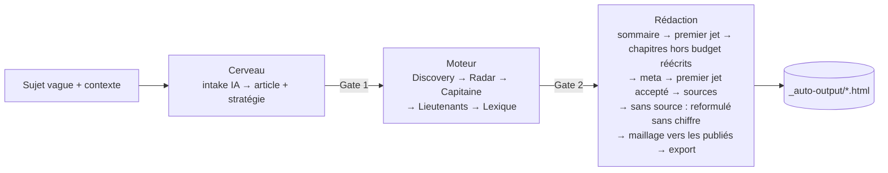

# CLI `auto:article` — génération automatique d'article SEO

> Outil en ligne de commande qui déroule automatiquement le pipeline complet
> **Cerveau → Moteur → Rédaction** à partir d'une description vague de sujet, et
> produit un article prêt (contenu HTML + meta + mots-clés verrouillés).
>
> Épic : [`_bmad-output/implementation-artifacts/epic-auto-article-pipeline.md`](../_bmad-output/implementation-artifacts/epic-auto-article-pipeline.md).

## Prérequis

Le CLI est un **client de l'API HTTP** : le serveur dev doit tourner.

```bash
npm run dev          # démarre back (:3400) + front (:5400)
```

## Lancement

```bash
npm run auto:article -- [options]
```

En mode interactif, le CLI demande : le **sujet** (une phrase, même vague), un
cocon cible **optionnel** (laisser vide pour que le script propose), et un
contexte business optionnel.

> Le **niveau** de l'article (Pilier / Intermédiaire / Spécialisé) n'est plus
> saisi : le script le **propose** en lisant l'arbre SEO, et tu le valides au
> Gate 1.

### Options

| Option | Effet |
|---|---|
| `--mode=mock` (défaut) | Sources externes simulées (0 crédit, fixtures). Pour tester le pipeline. |
| `--mode=real` | Appels **réels** DataForSEO + Claude (**facturés**), cache multi-niveau + cost-guard actifs. |
| `--port=<n>` | Port du serveur dev (défaut `$PORT` ou 3400). |
| `--config=<file>` | Run non-interactif depuis un JSON (gates auto-validés). Voir ci-dessous. |
| `--cocoon=<nom>` | **Impose** le cocon cible (pas de proposition d'emplacement). Utile pour un lot ciblé ; économise aussi l'appel IA de placement. |
| `--level=<niveau>` | Impose `pilier`, `intermediaire` ou `specifique`. |
| `--capitaine=<mot-clé>` | Impose le mot-clé principal : le classement et le passage des candidats par la porte sont court-circuités ; la porte capitaine juge quand même ce mot-clé à la demande de l'étape (un refus arrête le run). |
| `--resume=<id>` | Reprend un article existant : saute les phases déjà réalisées (idempotent). Voir « Reprise » plus bas. |
| `--relink=<id>` | Relance **uniquement** le maillage interne sur un article existant (déterministe, gratuit) ; vers les seuls articles publiés, sans retirer les liens déjà présents vers un non-publié. |
| `--verbose`, `-v` | Logs détaillés. |
| `--help`, `-h` | Aide. |

### Run non-interactif (`--config`)

```json
{
  "topic": "aider les artisans BTP à être visibles localement sur Google",
  "cocoonName": "Croissance digitale Toulouse",
  "articleType": "intermediaire"
}
```

```bash
npm run auto:article -- --mode=mock --config=run.json
```

## Le pipeline



> **Recette réelle passée le 2026-09-25 (épopée qualité SEO, C8).** Un run
> `--mode=real` sur un cocon bac à sable a produit le pilier #1030 : porte de
> publication **sans alerte ni dérogation**, `npm run verify:content` sans
> erreur, en six passages. Chaque échec était un refus honnête d'une porte ; les
> étapes ci-dessous (capitaine choisi par sa porte, budgets, sources,
> reformulation, liens vers les seuls publiés, reprise) en sont les correctifs.

- **2 gates** de validation humaine. En interactif : `[Entrée]` valide, `r`
  régénère/relance, `a` abandonne. En `--config` / `--resume` : auto-validés.
  - **Gate 1 — Emplacement & brief** : affiche l'**arbre SEO** (Silo → Cocon →
    Articles, avec la composition `P/I/S` de chaque cocon), l'**emplacement
    proposé** et sa justification, puis le brief. `[e]` permet de **corriger
    l'emplacement sans relancer d'appel IA**.
    **Rien n'est créé en base tant que ce gate n'est pas validé.**
  - **Gate 2 — Mots-clés** : Capitaine, Lieutenants, Lexique, et les éventuelles
    **collisions de cannibalisation** (au-delà de 85 % de similarité, une
    confirmation explicite est demandée).
- **Heuristiques d'auto-décision** (cf. épic §7) :
  - **Capitaine** — deux temps depuis la recette C8 (`heuristics/pick-capitaine.ts`) :
    1. **classement** (`rankCapitaines`) par score composite normalisé
       `0.5 × affinité topique + 0.2 × pertinence + 0.3 × marché` (poids par
       niveau). L'affinité topique (recouvrement lexical avec titre + douleur)
       est calculée côté CLI car le score de pertinence produit s'est révélé
       non-discriminant en run réel. Un mot-clé hors sujet passe après tous
       ceux qui touchent le sujet ;
    2. **passage par la porte capitaine** (`chooseThroughGate`) : les candidats
       sont soumis dans l'ordre à `GET /articles/:id/gates/captain-lock?keyword=…`
       (gratuit : la porte lit les mesures que le scan vient d'enregistrer), cinq
       au plus (`MAX_GATE_TRIES`) ; le **premier accepté sans aucune alerte** est
       retenu, les autres sont logués avec la raison de la porte. Si aucun ne
       passe proprement, le premier du classement est soumis : la porte le
       refuse et le run s'arrête en disant pourquoi — **jamais de dérogation à
       la place de l'utilisateur**. *(Run 1 de la recette : « artisan local »,
       SERP commerciale, avait été retenu pour un pilier informationnel.)*
    Un verdict « ORANGE forcé » reste possible pour un mot-clé *on-topic* qui
    passe la porte : c'est **normal et voulu**.
  - **Lieutenants** = candidats Radar top-N selon le type d'article.
  - **Lexique** = termes obligatoires + différenciateurs denses, filtrés des
    mots vides FR et des mots déjà portés par le Capitaine/Lieutenants
    (plafond 30).
- **Rédaction, pas à pas** (`phases/redaction.ts`, `phases/redaction-passes.ts`) —
  ce que ferait l'utilisateur entre le premier jet et la publication. Une
  proposition de réécriture ou de passe n'est retenue que **sans alerte ⛔ ni
  🔴** ; sinon le texte reste tel quel et la porte suivante le dit. Le script ne
  déroge jamais.
  1. **Sommaire** : la structure validée au Moteur (sinon généré), enregistré.
  2. **Premier jet** en un appel (`POST /generate/article-draft`). Le serveur y
     balise déjà « à sourcer » toute phrase chiffrée sans source
     (`markUnsourcedFigures`, FR-RED-DRAFT-TO-SOURCE).
  3. **Budgets des chapitres** : le texte est enregistré, puis la porte du
     premier jet est lue (`GET /articles/:id/gates/draft`) ; chaque chapitre
     qu'elle juge hors de son budget (règle `draft-section-off-budget:<chapitre>`,
     « fait N mots pour environ M ») est réécrit à sa longueur
     (`POST /generate/section-rewrite`, consigne « ramène à ~M mots » ou
     « développe jusqu'à ~M mots, aucun chiffre inventé »).
  4. **Méta** (`POST /generate/meta`), puis texte + méta enregistrés.
  5. **Premier jet accepté** : l'étape `redaction:draft_accepted` est demandée à
     la porte du premier jet ; un refus arrête le run (« Décidez dans la
     Rédaction »). C'est elle qui permettra à l'article de donner naissance à
     ses enfants.
  6. **Sources** : la passe « sources » (`POST /generate/enrich/sources`, recherche
     web réelle) traite chaque chapitre qui porte un passage « à sourcer ».
  7. **Sans source, sans chiffre** : ce que la recherche n'a pas confirmé est
     reformulé sans chiffre, pourcentage ni statistique (`rephraseUnsourceable`,
     section-rewrite) ; une proposition qui garde un marqueur est écartée. Un
     chiffre inventé ne part donc jamais en publication. Le texte n'est
     réenregistré que s'il a changé.
  8. **Maillage** : liens posés vers les **seuls articles publiés** (un lien vers
     une page pas encore en ligne est une 404 pour le lecteur) ; puis les liens
     déjà présents vers un article non publié sont retirés du texte, leur texte
     gardé (`unlinkUnpublished`). L'enregistrement fait aussi sortir ces liens de
     la matrice (`pruneStaleLinks`, côté serveur).
  9. Statut `brouillon`, puis export HTML.

## Sortie

- Article rédigé + meta persistés en DB (statut `brouillon`).
- Export HTML PropulSite dans **`_auto-output/<slug>-<id>.html`** (gitignoré).
- Récap de run : étapes + coût IA cumulé.

## Notes

- **Cocon** : doit préexister. Si le nom saisi est introuvable, le CLI liste les
  cocons disponibles.
- **Place dans l'arbre du cocon** (depuis le chantier C7, 2026-09-25) : l'article
  est créé par `POST /cocoons/:id/articles`, un à la fois, comme à l'écran. Un
  pilier n'a pas de parent, et un cocon n'en a qu'un. Un intermédiaire ou un
  spécialisé naît d'une **section libre** (un H2 sans article) de son parent :
  le CLI lit l'arbre (`GET /cocoons/:id/tree`) et choisit la section dont le
  titre parle le plus du sujet, à égalité sous un parent déjà rédigé
  (`heuristics/pick-parent-section.ts`). Sans parent du bon niveau, ou sans
  section libre, le run s'arrête en disant pourquoi. Si le parent n'est pas
  **rédigé** (étape « premier jet accepté »), le serveur refuse : le run
  s'arrête avec les défauts de son premier jet, **sans jamais déroger** à la
  place d'un humain. Aucun mot-clé n'est posé à la création (il n'est pas
  encore mesuré) : le Moteur le mesure, puis le verrouille comme capitaine.
- **Premier jet accepté** : après la méta, le CLI demande l'étape
  `redaction:draft_accepted` à la porte du premier jet ; un refus arrête le run
  (« Décidez dans la Rédaction »). C'est elle qui permettra à l'article de
  donner naissance à ses enfants.
- **Idempotence** : relancer le même sujet réutilise l'article existant (conflit
  de slug géré, 409 `SLUG_TAKEN`) ; `--resume=<id>` reprend là où le run
  précédent s'est arrêté.
- **Reprise (`--resume=<id>`)** — ce qui compte comme « fait » (`resume-plan.ts`) :
  - **Cerveau** : la stratégie de l'article existe ;
  - **Moteur** : la structure **et** le lexique sont validés, et un capitaine
    est verrouillé ;
  - **Rédaction** : le premier jet est **accepté** (étape
    `redaction:draft_accepted`), pas seulement écrit. Depuis la recette C8, un
    contenu présent ne suffit plus : un premier jet refusé par sa porte était
    exporté tel quel ;
  - un premier jet **écrit mais pas accepté** est gardé (`skipDraft` : pas de
    nouvel appel payant), repasse par le même filet que la route (chiffre sans
    source → « à sourcer »), puis la suite est rejouée : budgets des chapitres,
    méta, acceptation, sources, reformulation, maillage ;
  - un premier jet **déjà accepté** : restent les finitions qu'un run interrompu
    n'aurait pas faites — passe « sources » et reformulation s'il reste des
    passages « à sourcer », retrait des liens vers un non-publié — puis l'export ;
  - `--capitaine=<mot-clé>` différent du capitaine en base refait Moteur **et**
    Rédaction, premier jet compris (`applyForcedCapitaine`).
- **Scores SEO / GEO** : le mode automatique n'en calcule aucun — les
  calculateurs vivent côté écran (`src/utils/seo-calculator.ts`,
  `geo-calculator.ts`). Un article produit ici porte « — » dans l'audit
  (`npm run verify`) jusqu'à ce qu'il soit ouvert dans la rédaction guidée
  (épopée qualité SEO, checklist P7 : passer les calculateurs dans `shared/`).
- **Mock ≠ qualité réelle** : le mode mock valide le *pipeline*, pas la *qualité
  éditoriale*. Faire un run `--mode=real` de contrôle avant mise en production.
- **Coût réel d'un run complet** : ~**$0.35** pour un article de 4 000–6 000 mots
  — soit ~$0.09 de Claude (Haiku 4.5) **+ ~$0.27 de DataForSEO**.
  ⚠️ **Le récap affiché par le CLI ne compte que l'IA** et sous-estime donc le
  coût d'un facteur ~3,5 (mesuré au solde DataForSEO sur 3 runs). Correctif
  planifié : voir `audit-auto-article-pipeline.md` (P1-1).
  Le cost-guard DataForSEO plafonne à $0.50/30 min
  (`DATAFORSEO_COST_BUDGET_USD` pour ajuster).
- **Longueur** : ~~le pipeline ne bride pas la longueur — les articles dépassent
  largement `DEFAULT_TARGET_WORDS_BY_TYPE` (choix assumé : on garde l'article
  entier).~~ Depuis la rédaction en un premier jet (C5) et la recette C8, la
  longueur visée est celle choisie pour l'article, sinon celle de son type
  (`shared/constants/article-type-rules.ts` ; `DEFAULT_TARGET_WORDS_BY_TYPE`
  n'existe plus) : la porte du premier jet la
  juge (±15 %, et chaque chapitre entre 0,5× et 1,5× de sa part), et le CLI
  réécrit à sa longueur chaque chapitre hors budget avant d'accepter le premier
  jet. Les passes d'enrichissement peuvent ensuite l'allonger.
- **Coût d'un run réel** (recette C8, 2026-09-25) : 0,10 $ puis 0,08 $ d'IA pour
  les deux derniers passages d'un pilier ; DataForSEO en plus (voir la note
  précédente sur le récap qui ne compte que l'IA).
```
