# Contrats d'affichage du Moteur

**Ce que chaque composant affiche, d'où vient la donnée, et sous quelle forme elle doit arriver.**

Ce document reprend trois chapitres de l'exploration du Moteur :

1. **l'inventaire des composants** qui affichent un résultat, sous-phase par sous-phase ;
2. **les chaînes de données**, de la source (IA, DataForSEO, Google, calcul, base) jusqu'à l'écran ;
3. **les types partagés et les contrats** qui fixent la forme attendue.

La source de vérité reste le code : `shared/contracts/` pour les formats, `shared/types/` pour les types, les composants pour l'affichage. Le détail des 8 lots livrés est dans la tech-spec `tech-spec-contrats-affichage.md`.

---

## Comment lire ce document

### L'idée en une image

Imagine un magasin. Des colis arrivent de plusieurs fournisseurs : l'IA, DataForSEO, Google, la base de données. Avant, les colis étaient posés en rayon **sans être ouverts**, et un colis vide recevait l'étiquette « 0 ». Le client voyait « KD 0 » et pensait « facile ! », alors qu'on n'en savait rien.

Un **contrat d'affichage**, c'est le contrôle au quai de réception. Chaque colis est ouvert, vérifié, rangé dans la forme attendue par le rayon, ou renvoyé avec un message clair.

### Les trois états d'une valeur

| État | Exemple | Ce que l'écran montre |
|---|---|---|
| **Valeur** | volume = 480 | `480` |
| **Absente** | DataForSEO ne connaît pas la difficulté | `—` (jamais `0`), et la carte est rangée en bas des tris |
| **En échec** | réponse illisible, champ corrompu | `—` aussi ; l'anomalie part dans le journal technique |

Une réponse **inutilisable** (l'IA n'a pas renvoyé la liste demandée, par exemple) suit le chemin d'erreur habituel de l'écran : message « Réponse reçue dans un format inattendu… — relancez l'action » et bouton « Relancer ».

### Légende des schémas

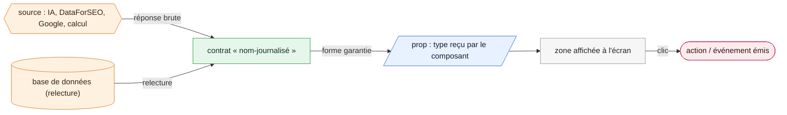

Dans chaque fiche de composant :

- **le schéma** dessine le composant comme une maquette : un cadre qui contient les zones affichées, avec les props qui les alimentent et la source d'origine ;
- **le tableau « Format attendu »** donne, champ par champ, la forme garantie par le contrat et ce qui s'affiche quand la donnée manque.

### Où se place la « mise en format » dans la grille en 8 temps

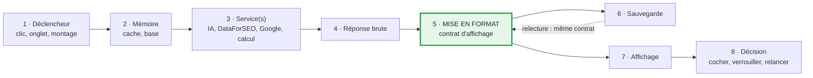

La mise en format se fait **aux trois frontières** où une donnée change de mains :

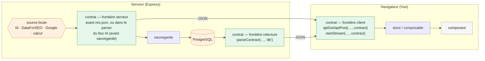

Pourquoi trois fois ? Parce que c'est la même expression qui doit produire l'affichage **au premier chargement comme au rechargement** (CLAUDE.md §2.0). La relecture en base était l'endroit où naissaient la plupart des faux zéros.

---

## 1. Inventaire des composants

### 1.0 Vue d'ensemble

| Sous-phase | Composants qui affichent un résultat | Sources | Contrats |
|---|---|---|---|
| **Découverte** | `DiscoveryPanel`, `DiscoverySourcesList`, `DiscoveryAnalysisResults`, `DiscoveryWordGroupsSidebar`, `KeywordDiscoveryRelevanceToggle` | Google Suggest, DataForSEO, IA (JSON), calcul, cache 30 j | `suggest-all`, `discover`, `discover-from-site`, `analyze-discovery`, `relevance-score`, `word-groups`, `discovery-cache`, `discovery-cache-status`, `radar-generate` |
| **Radar** | `RadarPanel`, `DouleurScannerResults`, `RadarThermometer`, `RadarKeywordCard` (+ `RadarCardScoreRing`, `RadarCardPaaTree`), `RadarLongTailSuggestions`, `RadarAiPanel` | DataForSEO, Google (PAA, autocomplétion), calcul, IA (JSON), base | `radar-scan`, `radar-generate`, `radar-exploration`, `radar-exploration-add/-batch/-remove`, `long-tail-suggestions` |
| **Capitaine** | `CaptainPanel`, `CaptainRadarList`, `CaptainSidePanel`, `CaptainRootsSidebar`, `ScoreRing`, `AiAdviceMarkdown`, `CaptainLockPanel` | DataForSEO, Google, calcul, IA (texte, JSON), base | `captain-scan`, `captain-history`, `article-keywords`, `captain-paa-judge`, `ai-advice-done` |
| **Lieutenants** | `LieutenantsPanel`, `LieutenantSerpAnalysis`, `LieutenantsResultsLayout`, `LieutenantProposals`, `LieutenantCard`, `LieutenantsAiPanel` | DataForSEO + pages concurrentes lues, IA (flux SSE), base | `serp-analysis`, `propose-lieutenants`, `article-keywords` |
| **Structure** (C6, 2026-09-25) | `StructureHnPanel`, `LieutenantH2Structure` | SERP du capitaine relue, IA (flux SSE), base | `serp-analysis`, `ai-hn-structure`, `article-keywords` |
| **Lexique** | `LexiquePanel`, `LexiqueTermsList`, `LexiqueAiPanel` | TF-IDF local, IA (flux SSE), base | `tfidf`, `lexique-ai`, `explorations`, `serp-exists` |
| **Finalisation** | `FinalisationPanel`, `MoteurContextRecap` | base | `article-keywords` (Finalisation) ; données de pilotage hors contrat (récap) |

> `CaptainVerdictPanel` et `VerdictBar` existent encore mais **aucun écran de production ne les utilise** (seuls des tests les montent). Ils lisent `KpiResult`, déjà sous le contrat `captain-scan`.

---

### 1.1 Découverte

La Découverte lance **cinq sources en parallèle** depuis un mot-clé racine, puis laisse l'IA trier et sélectionner.

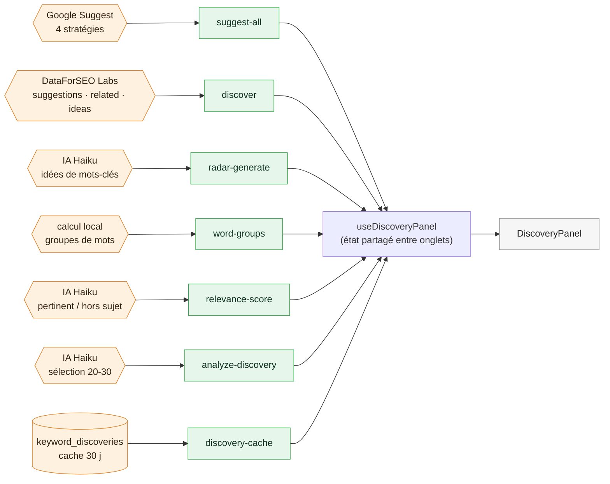

#### `DiscoveryPanel` — conteneur de l'onglet

`src/components/moteur/DiscoveryPanel.vue`

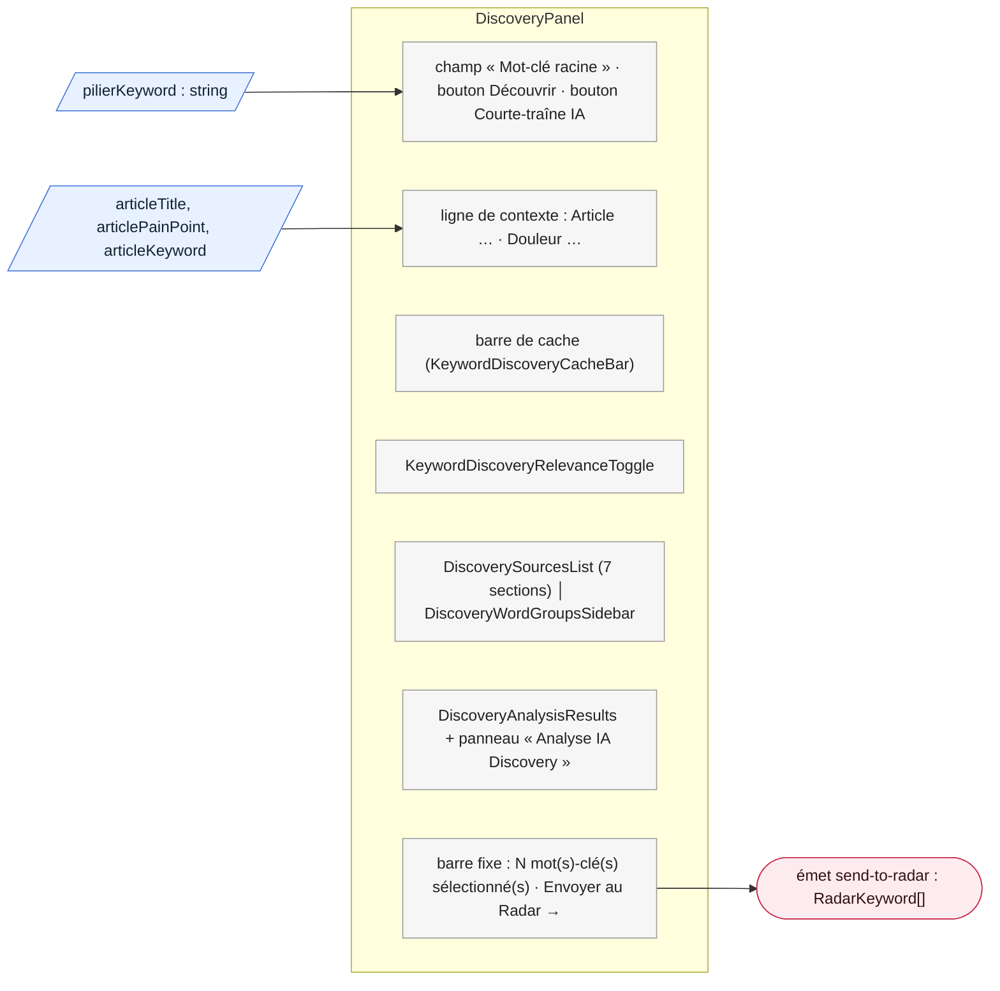

- **Props** : `pilierKeyword` (obligatoire) ; `articleId`, `articleTitle`, `articleKeyword`, `articlePainPoint`, `articleType`, `cocoonName`, `cocoonTheme`, `mode: 'workflow' | 'libre'`.
- **Fonctionnement** : « Découvrir » lance les sources en parallèle ; le cache est vérifié 400 ms après la saisie et sauvegardé automatiquement quand tout est chargé.
- **Format attendu** : voir les composants enfants ci-dessous ; les KPI passent par `formatVolume` (« — » si absent, « 1.2k » au-delà de 1000).

#### `DiscoverySourcesList` — les 7 listes par source

`src/components/moteur/discovery/DiscoverySourcesList.vue`

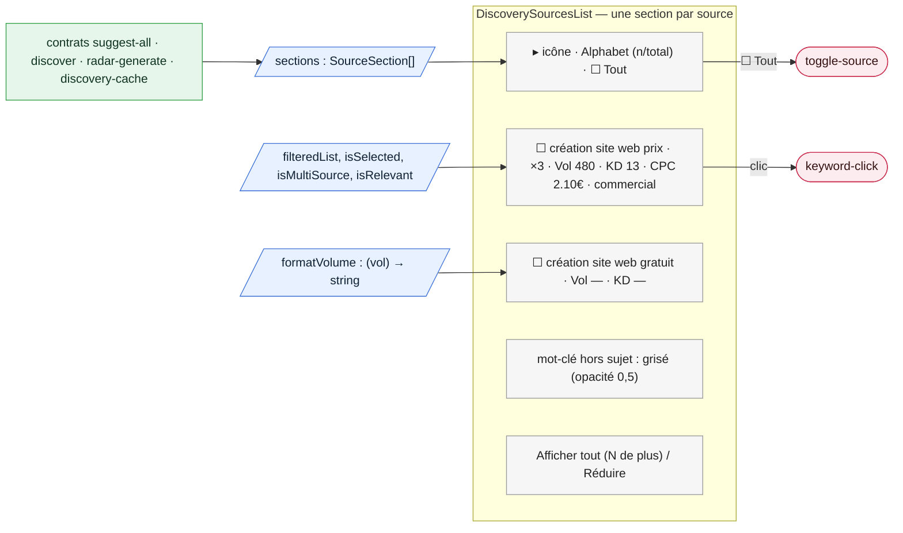

**Format attendu d'un mot-clé découvert** (`DiscoveredKeyword`)

| Champ | Forme garantie | Absent ou illisible |
|---|---|---|
| `keyword` | texte non vide | ligne écartée |
| `source` | une des 8 sources connues | ligne écartée |
| `searchVolume`, `difficulty`, `cpc` | nombre, `null` ou non fourni | tag masqué ou « — », **jamais 0** |
| `intent`, `reasoning`, `sourceDetail` | texte facultatif | non affiché |

Sections : Alphabet, Questions, Intent Modifiers, Prepositions, IA Claude, DataForSEO, Courte-traîne IA.

#### `DiscoveryAnalysisResults` — la sélection de l'IA

`src/components/moteur/discovery/DiscoveryAnalysisResults.vue`

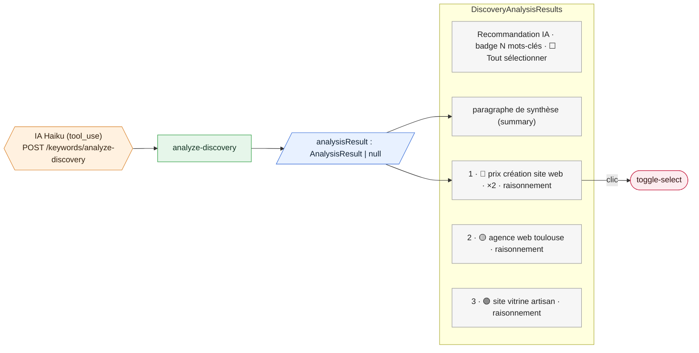

| Champ | Forme garantie | Absent ou illisible |
|---|---|---|
| `keywords[].keyword` | texte non vide | ligne écartée |
| `keywords[].priority` | `high` 🔴 · `medium` 🟡 · `low` 🟢 | `low` (vert, comme avant le contrat) |
| `keywords[].reasoning` | texte | vide |
| `summary` | texte | vide |
| `usage` | coût de l'appel IA | ignoré |

Le composant entier est masqué tant que `analysisResult` vaut `null`.

#### `DiscoveryWordGroupsSidebar` — les groupes de mots

`src/components/moteur/discovery/DiscoveryWordGroupsSidebar.vue`

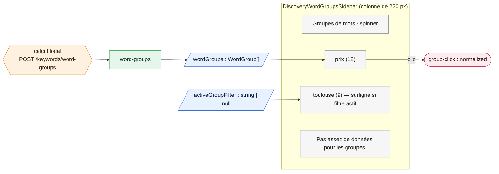

| Champ | Forme garantie | Absent ou illisible |
|---|---|---|
| `word` | texte non vide | groupe écarté |
| `count` | entier ≥ 0 | `0` (c'est un compteur, pas un KPI) |
| `normalized` | texte (clé du filtre) | vide |

L'appel n'est pas fait sous 5 mots-clés.

#### `KeywordDiscoveryRelevanceToggle` — le filtre de pertinence

`src/components/moteur/discovery/KeywordDiscoveryRelevanceToggle.vue`

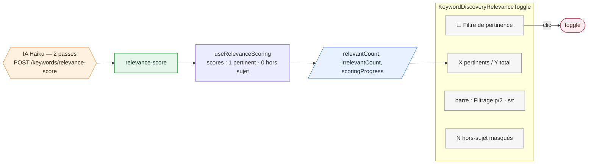

| Champ | Forme garantie | Absent ou illisible |
|---|---|---|
| `scores` | dictionnaire mot-clé (minuscules) → 0 ou 1 | un score hors de 0-1 est écarté : mot-clé « non évalué » |
| `fallback` | booléen | `false` |

---

### 1.2 Radar

Le Radar scanne une liste de mots-clés (issus de la Découverte ou saisis) et les classe par chaleur.

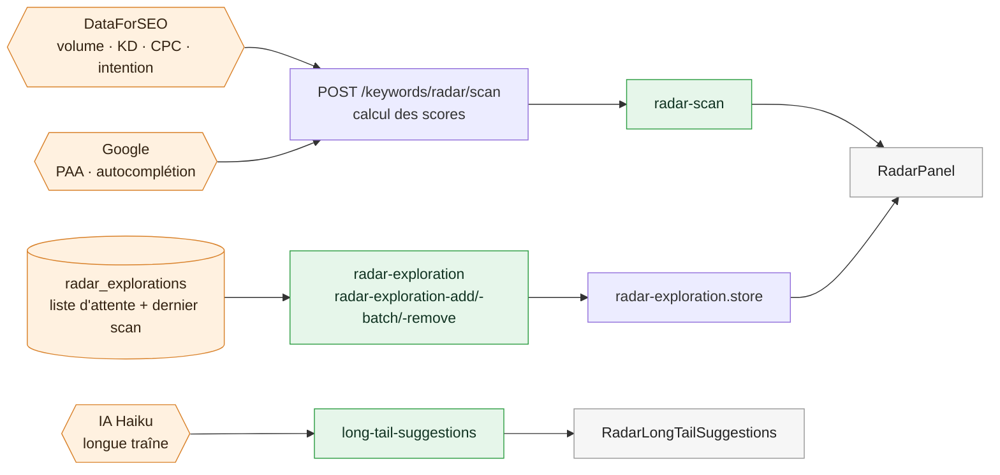

#### `RadarPanel` — conteneur de l'onglet

`src/components/intent/RadarPanel.vue`

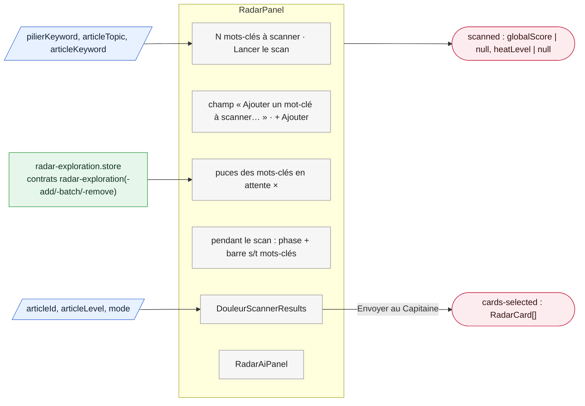

- **Tri** : A-Z ou « Score KPI » ; les cartes sans KPI (longue traîne) vont en bas.
- **Liste d'attente** : chaque ajout ou retrait renvoie l'exploration complète, qui remplace celle affichée (contrats `radar-exploration-add`, `-batch`, `-remove`). Une exploration pas encore scannée (`scanResult: {}` en base) est un état normal : elle est mise en forme sans alerte.

#### `DouleurScannerResults` — le résultat d'un scan

`src/components/intent/scanner/DouleurScannerResults.vue`

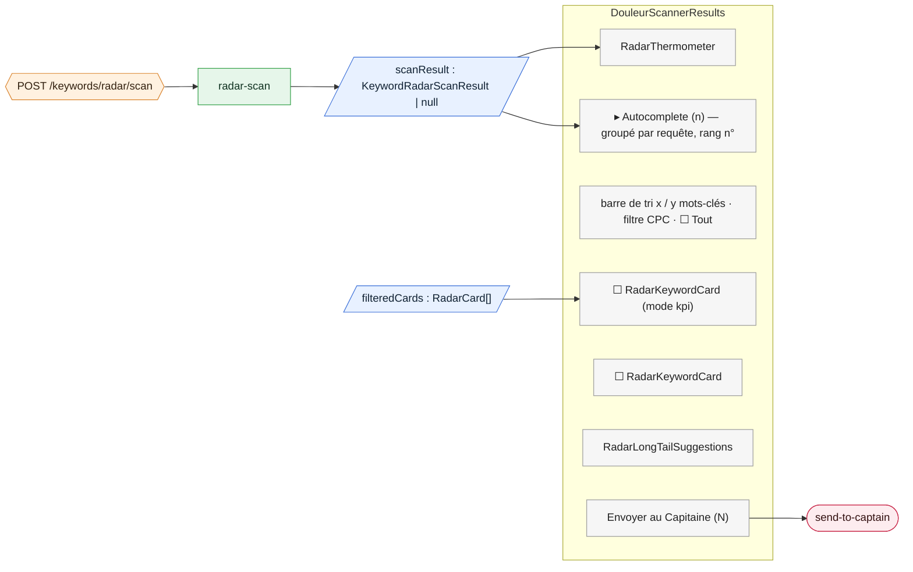

**Format attendu d'un résultat de scan** (`KeywordRadarScanResult`)

| Champ | Forme garantie | Absent ou illisible |
|---|---|---|
| `cards` | liste de cartes conformes | carte sans mot-clé écartée, les autres servies |
| `globalScore` | nombre ou `null` | `null` → thermomètre « En attente —/100 » (jamais « froide 0 ») |
| `heatLevel` | `brulante` · `chaude` · `tiede` · `froide` · `null` | `null` (jamais « froide » inventée) |
| `autocomplete.suggestions` | liste `text` · `query` · `position` | liste vide |
| `verdict`, `specificTopic`, `broadKeyword`, `scannedAt` | texte | vide |

#### `RadarThermometer` — la chaleur du sujet

`src/components/shared/RadarThermometer.vue`

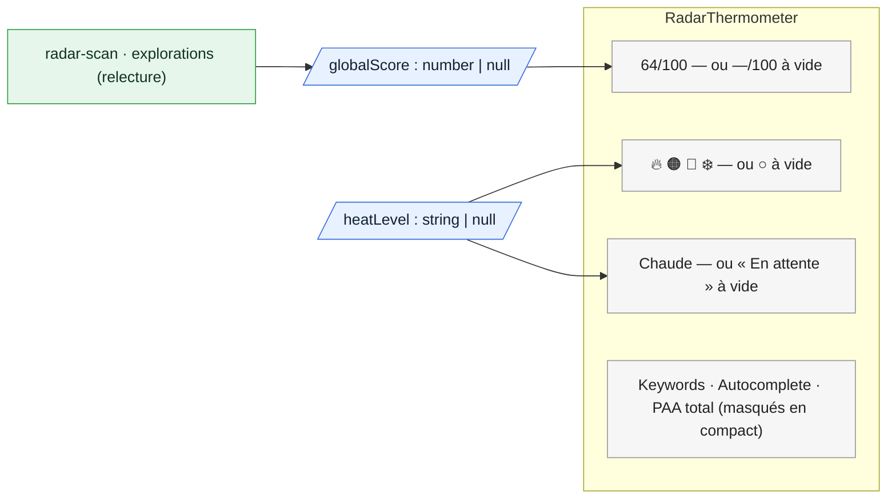

Relu au montage du Moteur via `GET /articles/:id/explorations` (contrat `explorations`) : un ancien scan sans score donne « En attente — », comme un scan jamais fait.

#### `RadarKeywordCard` — la carte de mot-clé

`src/components/intent/RadarKeywordCard.vue`, avec `radar-card/RadarCardScoreRing.vue` et `radar-card/RadarCardPaaTree.vue`. C'est la même carte dans le Radar et le Capitaine.

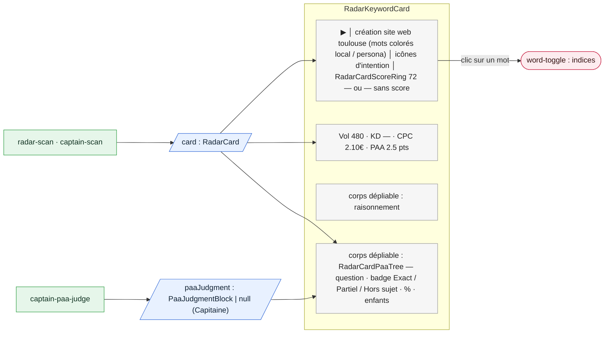

**Format attendu d'une carte** (`RadarCard`)

| Champ | Forme garantie | Absent ou illisible |
|---|---|---|
| `keyword` | texte non vide | carte écartée |
| `kpis` | bloc KPI ou `null` | `null` = longue traîne sans KPI : ligne KPI et icônes masquées |
| `kpis.searchVolume`, `difficulty`, `cpc`, `competition` | nombre ou `null` | « — » via `formatVolume` / `formatKd` / `formatCpc`, trié en bas |
| `kpis.intentTypes` | liste parmi `informational`, `commercial`, `transactional`, `navigational` | intention inconnue écartée |
| `kpis.paaMatchCount`, `paaTotal`, `autocompleteMatchCount` | entier ≥ 0 | `0` (compteur) |
| `paaItems[]` | `question` non vide, `match` (`total`/`partial`/`none`), profondeur | question vide écartée ; `match` inconnu → `none` |
| `marketScore` | `total` + `verdict` GO / ORANGE / NOGO | bloc illisible retiré : anneau « — » |
| `relevanceScore` | idem ou `null` + `relevanceUnavailableReason` | message contextuel dans l'info-bulle de l'anneau |

L'anneau de score (`RadarCardScoreRing`) reçoit `displayedScore : number | null` : sans score, il affiche « — » et, au survol, la raison (`no-pain`, `missing-paa`, `missing-autocomplete`, `no-signals`, `long-tail`).

#### `RadarLongTailSuggestions` — combinaisons longue traîne

`src/components/intent/RadarLongTailSuggestions.vue`

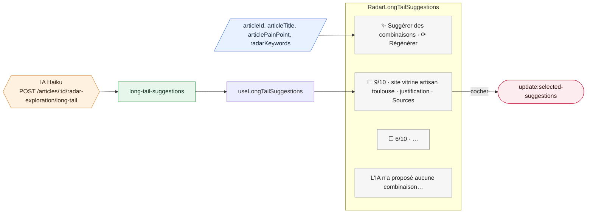

Chaque suggestion est validée par le schéma `longTailSuggestionSchema` (mot-clé, score /10, justification, sources) ; une suggestion abîmée en cache est écartée. Les 5 meilleures sont pré-cochées. Section masquée sous 2 mots-clés racines.

#### `RadarAiPanel` — candidats Capitaine

`src/components/moteur/RadarAiPanel.vue`

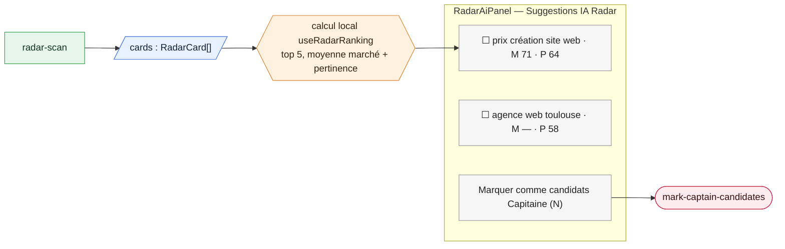

Pastilles « M » (marché) et « P » (pertinence) via `formatScore` : « — » si absent. La moyenne ignore les scores absents (plus de moyenne tirée vers le bas par des zéros d'absence).

---

### 1.3 Capitaine

Le Capitaine valide un mot-clé principal par un **scan** (6 KPI + verdict), un **avis IA** rédigé et un **jugement des questions PAA**.

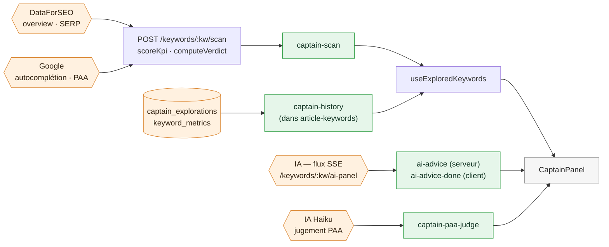

**Format attendu d'un KPI de scan** (`KpiResult`, contrat `captain-scan`)

| Champ | Forme garantie | Absent ou illisible |
|---|---|---|
| `rawValue` | nombre ou `null` | `null` → libellé « — », couleur neutre |
| `label` | texte affiché (« 480 », « KD 13 », « — ») | « — » |
| `color` | `green` · `orange` · `red` · `neutral` | `neutral` |
| `verdict.level` | `GO` · `ORANGE` · `NO-GO` · `GRAY` | `GRAY` (« à confirmer »), **jamais NO-GO** |

Un NO-GO « Aucun signal détecté » n'apparaît que si volume, PAA et autocomplétion ont **réellement** été mesurés à 0.

#### `CaptainPanel` — conteneur de l'onglet

`src/components/moteur/CaptainPanel.vue`

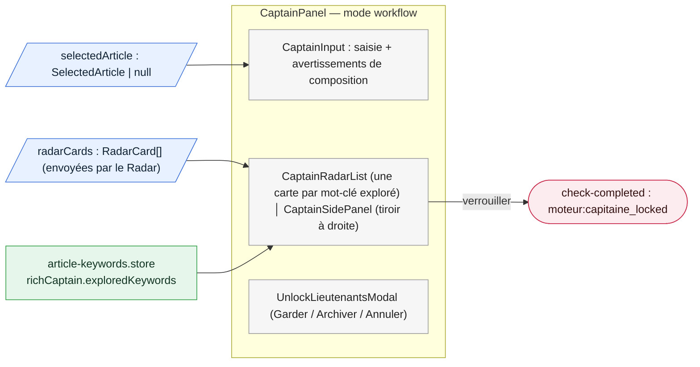

En mode libre (Labo), le même panneau montre l'historique, le tableau « Seuils de référence », une `RadarKeywordCard`, `CaptainRootsSidebar`, l'avis IA et `CaptainLockPanel`.

#### `CaptainRadarList` — la liste des candidats

`src/components/moteur/captain/CaptainRadarList.vue`

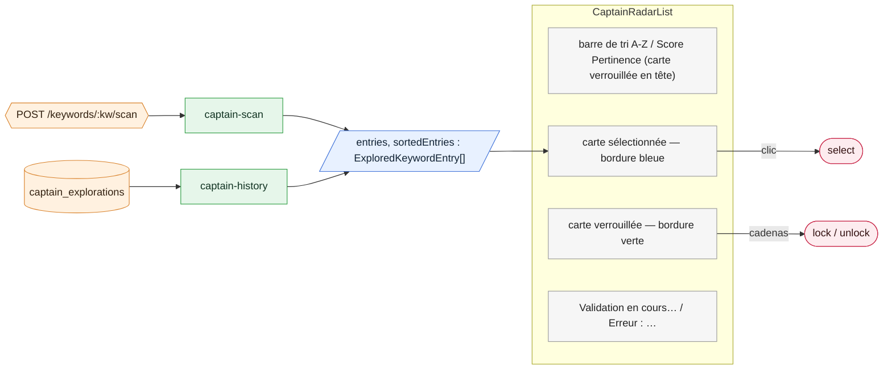

**Premier chargement = rechargement** : une carte relue en base passe par `captain-history`, qui applique les mêmes règles que `captain-scan` (PAA, autocomplétion, intention recalculées de la même façon ; plus de « 0 recherche » après un rechargement).

#### `CaptainSidePanel` — le tiroir de détail

`src/components/moteur/CaptainSidePanel.vue`

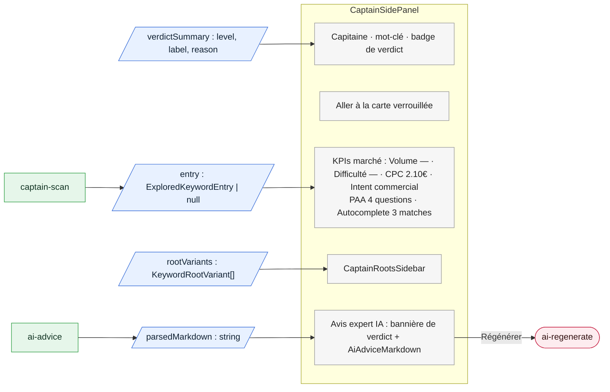

Volume, difficulté, CPC et intention affichent « — » quand la valeur est `null`.

#### `CaptainRootsSidebar` et `ScoreRing` — les racines

`src/components/moteur/CaptainRootsSidebar.vue`, `src/components/shared/ScoreRing.vue`

```mermaid
flowchart LR
  subgraph W["CaptainRootsSidebar — Racines"]
    direction TB
    R1["site web toulouse · ScoreRing 72"]:::zone
    R2["création site · ScoreRing —"]:::zone
    R3["site vitrine (échec)"]:::zone
    AV["Moyenne 72/100 (scores absents ignorés)"]:::zone
  end
  SRC{{"POST /keywords/:racine/scan<br/>une fois par racine"}}:::src --> K["captain-scan"]:::contrat
  K --> P1[/"variants : KeywordRootVariant[]"/]:::prop --> R1
  R1 -- "clic" --> E1(["select : keyword, card, validation"]):::action
  classDef prop fill:#e8f1ff,stroke:#3b6fd8,color:#123
  classDef src fill:#fff1e0,stroke:#d9822b,color:#321
  classDef contrat fill:#e6f6ea,stroke:#2f9e44,color:#132
  classDef zone fill:#f6f6f6,stroke:#999,color:#222
  classDef action fill:#fdecef,stroke:#c92a4b,color:#311
```

`ScoreRing` reçoit `value : number | null` : sans score, anneau vide gris et « — ». La moyenne vert / orange / rouge est masquée s'il n'y a aucun score.

#### `AiAdviceMarkdown` — le conseil IA rédigé

`src/components/moteur/ai-panel/AiAdviceMarkdown.vue`

```mermaid
flowchart LR
  subgraph W["AiAdviceMarkdown"]
    direction TB
    T["## Verdict<br/>Mot-clé porteur pour un pilier…"]:::zone
    CUR["curseur ▍ pendant le flux"]:::zone
  end
  SRC{{"IA — flux SSE<br/>morceaux de texte + événement done"}}:::src --> KS["ai-advice (serveur)<br/>conseil vide → erreur + Régénérer"]:::contrat
  KS --> CH["morceaux (chunks)"]
  CH --> FM["adviceMarkdown()<br/>retire l'emballage en bloc de code"]:::contrat
  DB[("aiPanelMarkdown<br/>relu en base")]:::src --> FM
  FM --> MK["marked + DOMPurify"]
  MK --> P1[/"markdown : string"/]:::prop --> T
  classDef prop fill:#e8f1ff,stroke:#3b6fd8,color:#123
  classDef src fill:#fff1e0,stroke:#d9822b,color:#321
  classDef contrat fill:#e6f6ea,stroke:#2f9e44,color:#132
  classDef zone fill:#f6f6f6,stroke:#999,color:#222
```

| Élément | Forme garantie | Cas limite |
|---|---|---|
| texte complet (serveur) | Markdown non vide | vide → événement `error` : message + « Régénérer » au lieu d'un panneau blanc |
| texte affiché (client) | Markdown sans emballage de bloc de code | l'emballage (bloc de code « markdown » autour de tout le conseil) est retiré, au premier chargement comme au rechargement |
| événement `done` | `keyword`, `level` | champ absent → vide |

#### `CaptainLockPanel` — verrouillage (mode libre)

`src/components/moteur/CaptainLockPanel.vue`

```mermaid
flowchart LR
  subgraph W["CaptainLockPanel"]
    direction TB
    B1["Verrouiller ce mot-clé (désactivé si verdict ≠ GO)"]:::zone
    B2["Capitaine verrouillé · Envoyer aux Lieutenants → · Déverrouiller"]:::zone
  end
  P1[/"isLocked : boolean"/]:::prop --> B2
  P2[/"canLock : boolean = verdict GO"/]:::prop --> B1
  K["captain-scan (verdict)"]:::contrat --> P2
  B1 --> E1(["lock"]):::action
  B2 --> E2(["unlock · send-to-lieutenants"]):::action
  classDef prop fill:#e8f1ff,stroke:#3b6fd8,color:#123
  classDef contrat fill:#e6f6ea,stroke:#2f9e44,color:#132
  classDef zone fill:#f6f6f6,stroke:#999,color:#222
  classDef action fill:#fdecef,stroke:#c92a4b,color:#311
```

Un verdict inconnu devient `GRAY` : le bouton reste désactivé, comme pour un verdict « à confirmer ».

---

### 1.4 Lieutenants

Les Lieutenants (futurs H2/H3) naissent de l'analyse SERP des concurrents, puis d'une proposition IA en flux. Depuis C6 (2026-09-25), le plan Hn n'est plus proposé ni affiché ici : il naît des lieutenants retenus, dans l'onglet Structure (`StructureHnPanel`, cf. `#### LieutenantH2Structure` plus bas).

```mermaid
flowchart LR
  DFS{{"DataForSEO SERP<br/>top 10 + PAA"}}:::src --> SC["lecture des pages<br/>titres Hn + texte"]
  SC --> K1["serp-analysis"]:::contrat
  DB1[("keyword_serp_results<br/>keyword_serp_scrapes")]:::src --> K1
  K1 --> LS["useLieutenantsSerp<br/>récurrence des titres (entrée de l'IA)"]
  LS --> IA{{"IA — flux SSE<br/>propose-lieutenants"}}:::src
  IA --> K2["propose-lieutenants-ai (serveur)<br/>propose-lieutenants (client)"]:::contrat
  K2 --> LI["useLieutenantsIa"]
  DB2[("lieutenant_explorations")]:::src --> K3["article-keywords"]:::contrat
  K3 --> LI
  LI --> UI["LieutenantProposals"]:::zone
  LS --> UI2["LieutenantSerpAnalysis"]:::zone
  classDef src fill:#fff1e0,stroke:#d9822b,color:#321
  classDef contrat fill:#e6f6ea,stroke:#2f9e44,color:#132
  classDef zone fill:#f6f6f6,stroke:#999,color:#222
```

#### `LieutenantsPanel` et `LieutenantsResultsLayout` — conteneurs

`src/components/moteur/LieutenantsPanel.vue`, `src/components/moteur/lieutenants/LieutenantsResultsLayout.vue`

```mermaid
flowchart LR
  subgraph W["LieutenantsPanel"]
    direction TB
    WARN["Verrouillez votre Capitaine… (si non verrouillé)"]:::zone
    AS["KeywordAssistPanel (mots-clés du panier Radar)"]:::zone
    SA["LieutenantSerpAnalysis"]:::zone
    PR["LieutenantsResultsLayout › LieutenantProposals"]:::zone
    SRCS["LieutenantsResultsLayout › Sources IA : questions Google (PAA) · clusters Discovery"]:::zone
    AI["LieutenantsResultsLayout › LieutenantsAiPanel"]:::zone
  end
  P1[/"captainKeyword, articleLevel, isCaptaineLocked"/]:::prop --> SA
  P2[/"wordGroups, rootKeywords"/]:::prop --> PR
  PR --> E1(["lieutenants-updated : string[]"]):::action
  classDef prop fill:#e8f1ff,stroke:#3b6fd8,color:#123
  classDef zone fill:#f6f6f6,stroke:#999,color:#222
  classDef action fill:#fdecef,stroke:#c92a4b,color:#311
```

La proposition IA se lance automatiquement après la SERP, sauf si des propositions de moins de 7 jours existent en base.

#### `LieutenantSerpAnalysis` — les concurrents

`src/components/moteur/LieutenantSerpAnalysis.vue`

```mermaid
flowchart LR
  subgraph W["LieutenantSerpAnalysis"]
    direction TB
    CT["curseur Résultats SERP 3-10 · Analyser SERP · Tout relancer"]:::zone
    PG["✓ / scraping… / en attente — un mot-clé à la fois"]:::zone
    SUM["N concurrents · (cache) · N questions PAA"]:::zone
    TAB["onglets par mot-clé · filtre Blogs / Autres"]:::zone
    U1["n° 1 · Blog · agence-1.fr · lien"]:::zone
    U2["n° 2 · Autre · agence-2.fr · ! (page non lue)"]:::zone
  end
  SRC{{"POST /serp/analyze<br/>frais ou relu en base"}}:::src --> K["serp-analysis"]:::contrat
  K --> P1[/"serpResultsByKeyword : Map mot-clé → SerpAnalysisResult"/]:::prop --> TAB
  P2[/"displayedCompetitors : SerpCompetitor[]"/]:::prop --> U1
  CT --> E1(["analyze · refresh · update:sliderValue"]):::action
  classDef prop fill:#e8f1ff,stroke:#3b6fd8,color:#123
  classDef src fill:#fff1e0,stroke:#d9822b,color:#321
  classDef contrat fill:#e6f6ea,stroke:#2f9e44,color:#132
  classDef zone fill:#f6f6f6,stroke:#999,color:#222
  classDef action fill:#fdecef,stroke:#c92a4b,color:#311
```

**Format attendu d'un concurrent** (`SerpCompetitor`)

| Champ | Forme garantie | Absent ou illisible |
|---|---|---|
| `url` | texte non vide | concurrent écarté |
| `position`, `title`, `domain` | entier ≥ 0, texte | 0, vide |
| `headings[]` | titres `level` 1-6 + `text` non vide | titre vide écarté |
| `textContent` | texte | `null` relu en base → vide |
| `fetchError` | texte ou non fourni | **page sans titre ni texte → « Page concurrente non lue »** : badge « ! » et exclusion de la récurrence des titres |
| `isBlog` | booléen ou non fourni | `null` relu en base → inconnu |

Exemple : sur 2 pages dont une illisible, un titre présent sur la page lue compte « 1/1 (100 %) » et non « 1/2 (50 %) », au premier chargement comme au rechargement.

#### `LieutenantProposals` et `LieutenantCard` — les propositions de l'IA

`src/components/moteur/LieutenantProposals.vue`, `src/components/moteur/LieutenantCard.vue`

```mermaid
flowchart LR
  subgraph W["LieutenantProposals"]
    direction TB
    H["Lieutenants proposés par l'IA · badge du niveau"]:::zone
    SB["tri A-Z / Score IA · X / Y sélectionnés · N retenus · M éliminés"]:::zone
    CARD["LieutenantCard : ☐ │ prix création site web │ 82 — ou — │ H2 │ raisonnement · pastilles paa serp group root content-gap"]:::zone
    EL["Autres candidats (M) — dépliable, sans score en bas"]:::zone
    GAP["Failles de contenu (Markdown)"]:::zone
  end
  SRC{{"IA — flux SSE propose-lieutenants"}}:::src --> K1["propose-lieutenants"]:::contrat
  DB[("lieutenant_explorations")]:::src --> K2["article-keywords (richLieutenants)"]:::contrat
  K1 --> P1[/"lieutenantCards, eliminatedCards : ProposedLieutenant[]"/]:::prop
  K2 --> P1
  P1 --> CARD
  CARD -- "cocher" --> E1(["toggle → verrou immédiat en base"]):::action
  classDef prop fill:#e8f1ff,stroke:#3b6fd8,color:#123
  classDef src fill:#fff1e0,stroke:#d9822b,color:#321
  classDef contrat fill:#e6f6ea,stroke:#2f9e44,color:#132
  classDef zone fill:#f6f6f6,stroke:#999,color:#222
  classDef action fill:#fdecef,stroke:#c92a4b,color:#311
```

**Format attendu d'un Lieutenant** (`ProposedLieutenant`, `RichLieutenant`)

| Champ | Forme garantie | Absent ou illisible |
|---|---|---|
| `keyword` | texte non vide ; un doublon (même mot-clé, casse ignorée) n'apparaît qu'une fois | écarté |
| `score` | entier 0-100 ou `null` | « — » (info-bulle « Score IA non fourni »), trié en bas ; un score hors échelle devient absent |
| `suggestedHnLevel` | 2 ou 3 (« H3 » et « 3 » acceptés) | H2, signalé |
| `sources` | liste parmi `paa`, `serp`, `group`, `root`, `content-gap` | source inconnue écartée |
| `reasoning` | texte | vide |
| `status` (relu en base) | `suggested` · `locked` · `eliminated` · `archived` | `archived` : carte masquée, comme avant |

Une carte ajoutée depuis le panier, ou restaurée d'une ancienne liste sans détail, n'a pas été évaluée par l'IA : son score est « — », plus un faux « 0 ».

#### `LieutenantH2Structure` — le plan Hn

`src/components/moteur/LieutenantH2Structure.vue` — **rendu par l'onglet Structure depuis C6** (`src/components/moteur/StructureHnPanel.vue`, données par `src/composables/moteur/useStructureHn.ts`), plus par `LieutenantsResultsLayout`. `hnStructure` vient de `ai-hn-structure` (lieutenants retenus, titres 🔒, autres articles du cocon) ou de la base (`article-keywords`) ; `hnRecurrence` de `serp-analysis` sur le seul capitaine (un onglet « Tous »), relu à l'ouverture de l'onglet. Au-dessus du composant, `StructureHnPanel` affiche les lieutenants retenus, l'état de validation et le bouton « Valider la structure » (étape `moteur:hn_locked`, porte `hn-lock`).

```mermaid
flowchart LR
  subgraph W["LieutenantH2Structure"]
    direction TB
    N1["Structure Hn recommandée (IA) › 🔒 H2 Combien coûte un site ?"]:::zone
    N2["Structure Hn recommandée (IA) › H3 Site vitrine"]:::zone
    BT["Régénérer la structure · Sauvegarder la structure"]:::zone
    TB2["Structure Hn concurrents › onglets Tous (N) · un par mot-clé"]:::zone
    RC["Structure Hn concurrents › H2 Délais : 7/10 (70 %) ▇▇▇▇▇▇▇"]:::zone
  end
  S1{{"IA — flux SSE ai-hn-structure"}}:::src --> K1["ai-hn-structure"]:::contrat
  K1 --> P1[/"hnStructure : ProposeLieutenantsHnNode[]"/]:::prop --> N1
  K2["serp-analysis"]:::contrat --> P2[/"hnRecurrence : HnRecurrenceItem[]"/]:::prop --> RC
  BT -- "Régénérer" --> E1(["regenerate-hn : titres verrouillés"]):::action
  classDef prop fill:#e8f1ff,stroke:#3b6fd8,color:#123
  classDef src fill:#fff1e0,stroke:#d9822b,color:#321
  classDef contrat fill:#e6f6ea,stroke:#2f9e44,color:#132
  classDef zone fill:#f6f6f6,stroke:#999,color:#222
  classDef action fill:#fdecef,stroke:#c92a4b,color:#311
```

| Champ | Forme garantie | Absent ou illisible |
|---|---|---|
| `hnStructure` | **obligatoire** dans la réponse de régénération | sans liste : message d'erreur, **le plan affiché reste en place** |
| `hnStructure[].level` | 1-6 (« H2 » accepté) | titre écarté |
| `hnStructure[].text` | texte non vide | titre écarté |
| `children[]` | mêmes règles | enfant écarté |

#### `LieutenantsAiPanel` — le suivi de l'IA

`src/components/moteur/LieutenantsAiPanel.vue`

```mermaid
flowchart LR
  subgraph W["LieutenantsAiPanel — Suggestions IA Lieutenants"]
    direction TB
    ST["pendant le flux : barre pulsante + texte brut"]:::zone
    GAP["Content-gap détecté"]:::zone
    IDLE["N propositions générées · Régénérer les suggestions"]:::zone
  end
  P1[/"iaChunks : string · iaError · totalGenerated"/]:::prop --> ST
  K["propose-lieutenants"]:::contrat --> P1
  IDLE --> E1(["retry → nouveau flux"]):::action
  classDef prop fill:#e8f1ff,stroke:#3b6fd8,color:#123
  classDef contrat fill:#e6f6ea,stroke:#2f9e44,color:#132
  classDef zone fill:#f6f6f6,stroke:#999,color:#222
  classDef action fill:#fdecef,stroke:#c92a4b,color:#311
```

Le texte brut pendant le flux n'est pas contrôlé (c'est une progression) ; seul le résultat final de l'événement `done` passe le contrat. Si l'IA ne renvoie pas de liste de Lieutenants, `iaError` affiche le message et « Régénérer ».

---

### 1.5 Lexique

Le Lexique extrait les termes du champ lexical des concurrents (TF-IDF), puis l'IA recommande ou écarte chaque terme.

```mermaid
flowchart LR
  EX[("scrape SERP existant ?")]:::src --> K0["serp-exists"]:::contrat
  PG[("pages concurrentes lues")]:::src --> TF["calcul TF-IDF local"]
  TF --> K1["tfidf"]:::contrat
  IA{{"IA — flux SSE<br/>ai-lexique-upfront"}}:::src --> K2["lexique-ai"]:::contrat
  DB[("lexique_explorations")]:::src --> K3["explorations"]:::contrat
  K0 --> LP["LexiquePanel"]:::zone
  K1 --> LP
  K2 --> LP
  K3 --> LP
  classDef src fill:#fff1e0,stroke:#d9822b,color:#321
  classDef contrat fill:#e6f6ea,stroke:#2f9e44,color:#132
  classDef zone fill:#f6f6f6,stroke:#999,color:#222
```

#### `LexiquePanel` — conteneur de l'onglet

`src/components/moteur/LexiquePanel.vue`

```mermaid
flowchart LR
  subgraph W["LexiquePanel"]
    direction TB
    H["Capitaine (— si absent) · Lieutenants · niveau"]:::zone
    PRE["si pas de scrape : Lancer l'analyse SERP (~0,003 $) — sinon : Extraire le Lexique"]:::zone
    TABS["onglets : un par mot-clé exploré · + Tester un mot-clé"]:::zone
    IA["bloc IA : résumé · Termes manquants — ou erreur + Relancer l'analyse IA"]:::zone
    L1["LexiqueTermsList — Obligatoire (70 %+)"]:::zone
    L2["LexiqueTermsList — Différenciateur (30-70 %)"]:::zone
    L3["LexiqueTermsList — Optionnel (moins de 30 %)"]:::zone
    AP["LexiqueAiPanel"]:::zone
  end
  K0["serp-exists"]:::contrat --> PRE
  K3["explorations"]:::contrat --> TABS
  K2["lexique-ai"]:::contrat --> IA
  K1["tfidf"]:::contrat --> L1
  W --> E1(["check-completed : moteur:lexique_validated"]):::action
  classDef contrat fill:#e6f6ea,stroke:#2f9e44,color:#132
  classDef zone fill:#f6f6f6,stroke:#999,color:#222
  classDef action fill:#fdecef,stroke:#c92a4b,color:#311
```

| Réponse | Forme garantie | Absent ou illisible |
|---|---|---|
| `serp-exists.exists` | `true`, `false` ou `null` | `null` (inconnu) : l'écran garde « Extraire » au lieu de proposer un scrape payant |
| `lexique-ai.recommendations` | **obligatoire** | sans liste : message + « Relancer l'analyse IA » |
| `lexique-ai.missingTerms` | textes non vides | terme vide écarté |
| `explorations.lexique[]` | une exploration par mot-clé source | exploration sans mot-clé source écartée ; TF-IDF illisible → « pas encore extrait » |

#### `LexiqueTermsList` — une liste de termes

`src/components/moteur/lexique/LexiqueTermsList.vue`

```mermaid
flowchart LR
  subgraph W["LexiqueTermsList — Obligatoire (70 %+) — N termes"]
    direction TB
    T1["☐ hébergement · IA recommandé · ×1.2/page · 80 %"]:::zone
    T2["☐ responsive · IA optionnel · ×0.4/page · 30 %"]:::zone
    T3["☐ maintenance · (pas de badge : non analysé) · ×0.9/page · 60 %"]:::zone
    V["Aucun terme obligatoire identifié."]:::zone
  end
  K1["tfidf"]:::contrat --> P1[/"terms : TfidfTerm[]"/]:::prop --> T1
  K2["lexique-ai"]:::contrat --> P2[/"isIaRecommended, getRecommendation"/]:::prop --> T2
  T1 -- "cocher" --> E1(["toggle-term → sauvegarde immédiate"]):::action
  classDef prop fill:#e8f1ff,stroke:#3b6fd8,color:#123
  classDef contrat fill:#e6f6ea,stroke:#2f9e44,color:#132
  classDef zone fill:#f6f6f6,stroke:#999,color:#222
  classDef action fill:#fdecef,stroke:#c92a4b,color:#311
```

**Format attendu d'un terme** (`TfidfTerm`, `LexiqueTermRecommendation`)

| Champ | Forme garantie | Absent ou illisible |
|---|---|---|
| `term` | texte non vide | terme écarté |
| `level` | `obligatoire` · `differenciateur` · `optionnel` | terme écarté |
| `density`, `documentFrequency` | nombres (calculés localement) | **terme écarté** (plus de « ×0/page · 0 % » inventé) |
| `competitorCount`, `totalCompetitors` | entiers ≥ 0 | 0 (compteurs) |
| recommandation `aiRecommended` | booléen | recommandation écartée : **pas de badge**, plutôt qu'une décision inventée |
| recommandation `aiReason` | texte (info-bulle) | vide |

#### `LexiqueAiPanel` — l'analyse IA

`src/components/moteur/LexiqueAiPanel.vue`

```mermaid
flowchart LR
  subgraph W["LexiqueAiPanel — Analyse IA Lexique"]
    direction TB
    S["N termes analysés — n recommandés · m écartés"]:::zone
    B["Analyser avec l'IA · Régénérer l'analyse"]:::zone
  end
  K["lexique-ai"]:::contrat --> P1[/"recommendationsCount, recommendedCount, notRecommendedCount"/]:::prop --> S
  P2[/"iaError : string | null"/]:::prop --> B
  B --> E1(["trigger"]):::action
  classDef prop fill:#e8f1ff,stroke:#3b6fd8,color:#123
  classDef contrat fill:#e6f6ea,stroke:#2f9e44,color:#132
  classDef zone fill:#f6f6f6,stroke:#999,color:#222
  classDef action fill:#fdecef,stroke:#c92a4b,color:#311
```

---

### 1.6 Finalisation

#### `FinalisationPanel` — le récapitulatif avant Rédaction

`src/components/moteur/FinalisationPanel.vue`

```mermaid
flowchart LR
  subgraph W["FinalisationPanel — ✅ Prêt pour la Rédaction"]
    direction TB
    C["Capitaine : création site web toulouse — ou —"]:::zone
    L["Lieutenants (N) : mot-clé · H2 · raisonnement (verrouillés seulement)"]:::zone
    X["Lexique (N termes) : puces"]:::zone
    B["Aller à la Rédaction →"]:::zone
  end
  DB[("article_keywords<br/>captain_explorations · lieutenant_explorations")]:::src --> K["article-keywords"]:::contrat
  K --> ST["article-keywords.store"] --> C
  P1[/"selectedArticle : SelectedArticle | null"/]:::prop --> W
  B --> E1(["navigate-redaction"]):::action
  classDef prop fill:#e8f1ff,stroke:#3b6fd8,color:#123
  classDef src fill:#fff1e0,stroke:#d9822b,color:#321
  classDef contrat fill:#e6f6ea,stroke:#2f9e44,color:#132
  classDef zone fill:#f6f6f6,stroke:#999,color:#222
  classDef action fill:#fdecef,stroke:#c92a4b,color:#311
```

Le contrat `article-keywords` représente un Capitaine absent par un texte vide : l'écran affiche alors « — ». Vides : « Aucun lieutenant verrouillé. », « Aucun terme validé. »

#### `MoteurContextRecap` — la barre des articles du cocon

`src/components/moteur/MoteurContextRecap.vue`

```mermaid
flowchart LR
  subgraph W["MoteurContextRecap"]
    direction TB
    T1["Articles suggérés (N) — groupés pilier / intermédiaire / spécifique"]:::zone
    A1["titre · ⚠ cannibalisation · points de progression · puce du Capitaine"]:::zone
    T2["Articles publiés (N) 🔒"]:::zone
  end
  S1[("stratégie du cocon")]:::src --> P1[/"suggestedArticles : Article[]"/]:::prop --> T1
  S2[("capitaines du cocon · progression")]:::src --> P2[/"capitainesMap"/]:::prop --> A1
  A1 -- "clic" --> E1(["select : article"]):::action
  classDef prop fill:#e8f1ff,stroke:#3b6fd8,color:#123
  classDef src fill:#fff1e0,stroke:#d9822b,color:#321
  classDef zone fill:#f6f6f6,stroke:#999,color:#222
  classDef action fill:#fdecef,stroke:#c92a4b,color:#311
```

Ces données de **pilotage** (stratégie, liste des cocons, progression) ne sont pas des résultats d'analyse : elles restent hors du périmètre des contrats du Moteur (voir §3.3).

---

## 2. Chaînes de données

Chaque chaîne suit la grille en 8 temps. Les boîtes vertes sont les contrats ; la ligne pointillée est le chemin du **rechargement**, qui repasse par un contrat.

### 2.1 Scan du Capitaine

```mermaid
flowchart LR
  T1(["clic sur un candidat<br/>ou mot saisi"]):::action --> MEM[("keyword_metrics<br/>cache KPI")]:::src
  MEM -- "manquant" --> DFS{{"DataForSEO overview<br/>+ SERP (PAA)"}}:::src
  MEM -- "trouvé" --> ROUTE
  DFS --> ROUTE["route /keywords/:kw/scan<br/>toKpiValue · scoreKpi · computeVerdict"]
  GG{{"Google autocomplétion"}}:::src --> ROUTE
  ROUTE --> KS["captain-scan<br/>(serveur)"]:::contrat
  KS --> SAVE[("captain_explorations")]:::src
  KS --> KC["captain-scan<br/>(client)"]:::contrat
  KC --> EX["useExploredKeywords"] --> UI["CaptainRadarList · CaptainSidePanel"]:::zone
  SAVE -. "rechargement" .-> KH["captain-history<br/>(relecture, mêmes calculs)"]:::contrat
  KH -. "GET /articles/:id/keywords<br/>article-keywords" .-> EX
  classDef src fill:#fff1e0,stroke:#d9822b,color:#321
  classDef contrat fill:#e6f6ea,stroke:#2f9e44,color:#132
  classDef zone fill:#f6f6f6,stroke:#999,color:#222
  classDef action fill:#fdecef,stroke:#c92a4b,color:#311
```

> **En situation.** « création site web toulouse » : DataForSEO ne renvoie pas de difficulté. Avant : « KD 0 » vert, et un mot-clé sans PAA ni autocomplétion obtenait NO-GO « Aucun signal ». Maintenant : « KD — », verdict calculé sur les KPI connus, `GRAY` si rien n'est connu. Le lendemain, la carte relue en base montre exactement la même chose.

### 2.2 Radar

```mermaid
flowchart LR
  T1(["Lancer le scan"]):::action --> R["route /keywords/radar/scan<br/>KPI · PAA · autocomplétion · scores"]
  DFS{{"DataForSEO"}}:::src --> R
  GG{{"Google PAA · autocomplétion"}}:::src --> R
  R --> KS["radar-scan (serveur)"]:::contrat --> KC["radar-scan (client)"]:::contrat
  KC --> UI["DouleurScannerResults · RadarThermometer · RadarAiPanel"]:::zone
  KC --> SV["POST /articles/:id/radar-exploration"]
  SV --> DB[("radar_explorations")]:::src
  DB -. "montage de l'onglet" .-> KR["radar-exploration (relecture)"]:::contrat
  DB -. "montage du Moteur" .-> KE["explorations (relecture)"]:::contrat
  KR -.-> UI
  KE -. "thermomètre" .-> UI
  classDef src fill:#fff1e0,stroke:#d9822b,color:#321
  classDef contrat fill:#e6f6ea,stroke:#2f9e44,color:#132
  classDef zone fill:#f6f6f6,stroke:#999,color:#222
  classDef action fill:#fdecef,stroke:#c92a4b,color:#311
```

### 2.3 Analyse SERP et TF-IDF

```mermaid
flowchart LR
  T1(["Analyser SERP"]):::action --> DBH[("scrape déjà en base ?")]:::src
  DBH -- "oui" --> KD["serp-analysis<br/>(relecture : pages non lues marquées)"]:::contrat
  DBH -- "non" --> DFS{{"DataForSEO SERP + lecture des pages"}}:::src
  DFS --> SV[("keyword_serp_scrapes")]:::src
  DFS --> KS["serp-analysis (serveur)"]:::contrat
  KD --> KC["serp-analysis (client)"]:::contrat
  KS --> KC
  KC --> REC["récurrence des titres<br/>(pages lues seulement)"] --> UI["LieutenantSerpAnalysis · LieutenantH2Structure (onglet Structure, C6)"]:::zone
  T2(["Extraire le Lexique"]):::action --> TF["TF-IDF sur les pages lues"]
  SV --> TF
  TF --> KT["tfidf (serveur, client)"]:::contrat --> UI2["LexiqueTermsList"]:::zone
  classDef src fill:#fff1e0,stroke:#d9822b,color:#321
  classDef contrat fill:#e6f6ea,stroke:#2f9e44,color:#132
  classDef zone fill:#f6f6f6,stroke:#999,color:#222
  classDef action fill:#fdecef,stroke:#c92a4b,color:#311
```

### 2.4 Lieutenants IA (flux SSE)

```mermaid
sequenceDiagram
  participant E as Écran (useLieutenantsIa)
  participant S as Serveur (route propose-lieutenants)
  participant IA as IA (ai-provider)
  participant DB as PostgreSQL
  E->>S: POST flux SSE (SERP, PAA, groupes, racines)
  S->>IA: prompt propose-lieutenants
  IA-->>S: morceaux de JSON
  S-->>E: event chunk (progression affichée en brut)
  Note over S: parser = parseAiJson puis contrat propose-lieutenants-ai<br/>score 0-100 ou null, H2/H3, doublons écartés
  S->>DB: sauvegarde lieutenant_explorations (forme contrôlée)
  S-->>E: event done (retenus, éliminés — plus de plan Hn depuis C6)
  Note over E: contrat propose-lieutenants (client)<br/>refus → onError → message + Régénérer
  E->>E: cartes des lieutenants
```

Le même schéma vaut pour `ai-hn-structure`, appelée depuis C6 par l'onglet Structure (`useStructureHn.generate`) avec les lieutenants retenus : sans liste de titres, la réponse est refusée et le plan affiché reste en place.

### 2.5 Lexique IA et explorations relues

```mermaid
sequenceDiagram
  participant E as Écran (LexiquePanel)
  participant S as Serveur
  participant IA as IA
  participant DB as PostgreSQL
  E->>S: GET /articles/:id/explorations (montage)
  S->>DB: radar, captain, lieutenants, lexique…
  Note over S: contrat explorations (relecture) :<br/>chaque bloc avec le contrat de sa famille
  S-->>E: explorations mises en forme (onglets Lexique)
  E->>S: POST /serp/tfidf
  S-->>E: termes (contrat tfidf)
  E->>S: POST flux SSE ai-lexique-upfront
  S->>IA: prompt lexique-analysis-upfront
  IA-->>S: JSON des recommandations
  Note over S: contrat lexique-ai : sans recommandations → event error
  S->>DB: sauvegarde lexique_explorations
  S-->>E: event done → badges IA dans les listes
```

### 2.6 Découverte et son cache

```mermaid
flowchart LR
  T1(["saisie du mot-clé racine"]):::action -- "400 ms" --> CK["GET /discovery-cache/check<br/>discovery-cache-status"]:::contrat
  CK -- "en cache" --> LD["GET /discovery-cache/load<br/>discovery-cache (relecture)"]:::contrat
  CK -- "pas de cache" --> SRC["5 sources en parallèle<br/>suggest-all · discover · radar-generate · word-groups · relevance-score"]:::contrat
  LD --> UI["DiscoveryPanel"]:::zone
  SRC --> UI
  UI -- "tout est chargé" --> SV["POST /discovery-cache/save<br/>KPI null acceptés"]
  SV --> DB[("keyword_discoveries")]:::src
  DB -.-> LD
  classDef src fill:#fff1e0,stroke:#d9822b,color:#321
  classDef contrat fill:#e6f6ea,stroke:#2f9e44,color:#132
  classDef zone fill:#f6f6f6,stroke:#999,color:#222
  classDef action fill:#fdecef,stroke:#c92a4b,color:#311
```

> **Corrigé au passage.** Le schéma de sauvegarde refusait un KPI `null` : dès qu'un mot-clé DataForSEO n'avait pas de difficulté ou de CPC, la sauvegarde échouait sans bruit (400). Au retour sur la graine, la Découverte était relancée et refacturée. La sauvegarde accepte désormais les KPI absents.

### 2.7 Conseil IA rédigé

```mermaid
flowchart LR
  T1(["carte sélectionnée<br/>ou Régénérer"]):::action --> IA{{"IA — flux SSE ai-panel"}}:::src
  IA -- "morceaux" --> CH["texte accumulé"]
  IA -- "texte complet" --> KS["ai-advice (serveur)<br/>vide → event error"]:::contrat
  KS --> DN["event done : keyword, level"] --> KC["ai-advice-done (client)"]:::contrat
  CH --> FM["adviceMarkdown()"]:::contrat
  CH --> SV[("aiPanelMarkdown<br/>captain_explorations")]:::src
  SV -. "rechargement" .-> FM
  FM --> UI["AiAdviceMarkdown"]:::zone
  classDef src fill:#fff1e0,stroke:#d9822b,color:#321
  classDef contrat fill:#e6f6ea,stroke:#2f9e44,color:#132
  classDef zone fill:#f6f6f6,stroke:#999,color:#222
  classDef action fill:#fdecef,stroke:#c92a4b,color:#311
```

---

## 3. Types partagés et contrats

### 3.1 Les primitives de mise en forme (`shared/contracts/core.ts`)

La même valeur produit toujours la même sortie, quelle que soit la frontière.

| Primitive | Entrée | Sortie | Exemple |
|---|---|---|---|
| `kpiValue` / `toKpiValue` | nombre, texte numérique, `null` | nombre ou `null` | `"1.20"` → `1.2` ; `"beaucoup"` → `null` (signalé) |
| `count` | entier ≥ 0 | entier, sinon `0` (signalé) | compteur de questions PAA |
| `text(fallback)` | texte | texte, sinon le repli | libellé |
| `nullableText` | texte ou rien | texte ou `null` | réponse d'une question PAA |
| `withFallback(schéma, repli)` | quelconque | conforme, sinon le repli (signalé) | bloc non critique |
| `oneOf(valeurs, repli)` | texte | une valeur connue, sinon le repli | priorité IA → `low` |
| `tolerantArray(item)` | liste ou rien | éléments conformes ; absence → `[]` | cartes, questions |
| `requiredList(item)` | liste obligatoire | éléments conformes ; **pas de liste → refus** | sortie d'IA |
| `tolerantRecord(item)` | dictionnaire | entrées conformes ; absence → `{}` | scores de pertinence |
| `optionalObject(schéma)` | objet, `null`, rien | conforme, `null`, ou retiré (signalé) | score marché |

Chaque correction est **signalée** au journal (`coerced` = valeur corrigée, `dropped` = élément écarté, `rejected` = réponse refusée), avec le nom du contrat et la frontière. Un refus lève `ContractViolationError`.

### 3.2 Les contrats par famille

| Contrat (nom journalisé) | Type garanti (`shared/types/`) | Frontières | Règles clés |
|---|---|---|---|
| `captain-scan` | `ScanResponse` (`keyword-validate.types.ts`) | serveur, client | KPI absent → `rawValue: null`, libellé « — » ; verdict inconnu → `GRAY` |
| `captain-history` | `CaptainScanEntry` (`keyword.types.ts`) | relecture | mêmes calculs qu'au premier chargement |
| `article-keywords` | `ArticleKeywords \| null` (`keyword.types.ts`) | serveur, client | Lieutenants et plan Hn relus avec leurs contrats ; statut inconnu → `archived` |
| `paa-judgment`, `captain-paa-judge` | `PaaJudgmentBlock` (`captain-paa-judgment.types.ts`) | serveur, client | badge strict, scores bornés 0-100 |
| `radar-scan` | `KeywordRadarScanResult` (`intent.types.ts`) | serveur, client | `kpis: null` = longue traîne ; `globalScore`/`heatLevel` absents → `null` |
| `radar-generate` | `KeywordRadarGenerateResult` | serveur, client | idée sans mot-clé écartée |
| `radar-exploration` (+ `-add`, `-batch`, `-remove`) | `RadarExploration` | relecture, client | exploration non scannée = état normal, sans alerte |
| `long-tail-suggestions` | `{ suggestions: LongTailSuggestion[]; fromCache }` | serveur, client | suggestion abîmée écartée |
| `serp-analysis` | `SerpAnalysisResult` (`serp-analysis.types.ts`) | serveur, relecture, client | page vide → « non lue », hors récurrence |
| `tfidf` | `TfidfResult` | serveur, client | densité illisible → terme écarté |
| `serp-exists` | `SerpExistsResponse` | serveur, client | illisible → `null` (inconnu) |
| `propose-lieutenants-ai` | `ProposeLieutenantsResult` | serveur (sortie IA) | liste obligatoire ; score 0-100 ou `null` ; doublons écartés |
| `propose-lieutenants` | `FilteredProposeLieutenantsResult` | client (event `done`) | idem |
| `ai-hn-structure` | `{ hnStructure; justification? }` | serveur, client | liste obligatoire ; titre vide écarté |
| `lexique-ai` | `LexiqueAnalysisResult` | serveur, client | liste obligatoire ; décision illisible écartée |
| `explorations` | `ArticleExplorations` (`article-explorations.types.ts`) | relecture, client | chaque bloc avec le contrat de sa famille |
| `suggest-all` | `SuggestAllResult` (`discovery-tab.types.ts`) | serveur, client | stratégie absente → vide |
| `discover`, `discover-from-site` | `KeywordDiscoveryResult`, `DomainDiscoveryResult` | serveur, client | KPI absents → `null` ; type inconnu → mot-clé écarté |
| `analyze-discovery` | `AnalyzeDiscoveryResponse` | serveur, client | priorité illisible → `low` |
| `relevance-score` | `RelevanceScoreResponse` | serveur, client | score hors 0-1 écarté |
| `word-groups` | `{ groups: WordGroup[] }` | serveur, client | groupe sans mot écarté |
| `discovery-cache`, `discovery-cache-status` | `DiscoveryCacheEntry \| null`, `DiscoveryCacheStatus` | relecture, client | sélection IA illisible → `null` |
| `ai-advice`, `ai-advice-done` | texte Markdown, `{ keyword; level }` | serveur, client | conseil vide refusé ; emballage retiré à l'affichage |

### 3.3 Ce qui reste volontairement hors contrat

| Réponse | Pourquoi |
|---|---|
| `PUT /articles/:id/keywords`, sauvegardes (`/lieutenant-explorations`, `/discovery-cache/save`, `PATCH …/long-tail/selection`) | la réponse n'est pas affichée (l'écran garde son état) |
| `GET/PUT /articles/:id/micro-context`, `POST /articles/:id/recommend-word-count` | données de rédaction, hors des résultats d'analyse du Moteur |
| stratégie du cocon, liste des cocons, progression (`MoteurContextRecap`) | données de pilotage, pas des résultats d'analyse |
| `RelatedKeyword` (brief Rédaction, audit) | KPI encore non nullables côté Rédaction ; annoté dans `dataforseo/keywords.ts`, à migrer avec FR-INFRA-KPI-NULLABLE |

### 3.4 Ajouter ou modifier un contrat

1. **Type** : décrire la forme attendue dans `shared/types/` (c'est ce que le composant reçoit en prop).
2. **Contrat** : dans `shared/contracts/<famille>.contract.ts`, un `z.looseObject` typé contre ce type, avec les primitives du §3.1. Un KPI ou un score absent reste `null`.
3. **Serveur** : `res.json({ data: parseContract(monContrat, résultat, 'server') })`, ou `parser` de `runAiPanelStream` pour un flux IA ; `'db'` pour une relecture.
4. **Client** : `apiPost(chemin, corps, { contract: monContrat })`, ou `startStream(url, corps, callbacks, { contract })`.
5. **Tests** : dans `tests/unit/shared/contracts/`, une réponse conforme (inchangée, aucune alerte), une réponse partiellement abîmée (servie), une réponse inutilisable (refusée).
6. **Cliquet** : ajouter l'endpoint à `CLIENT_ENDPOINTS` et `SERVER_ROUTES` de `tests/unit/architecture/display-contracts-coverage.test.ts`, et la famille à `DONE_FAMILIES`. Les baselines sont à 0 : tout appel du Moteur listé sans contrat fait échouer `npm run verify`.

Garde-fou complémentaire : la règle ESLint `no-restricted-syntax` interdit `score ?? 0`, `kpi.volume ?? 0` et leurs formes en chaînage optionnel (`card.kpis?.searchVolume ?? 0`).
