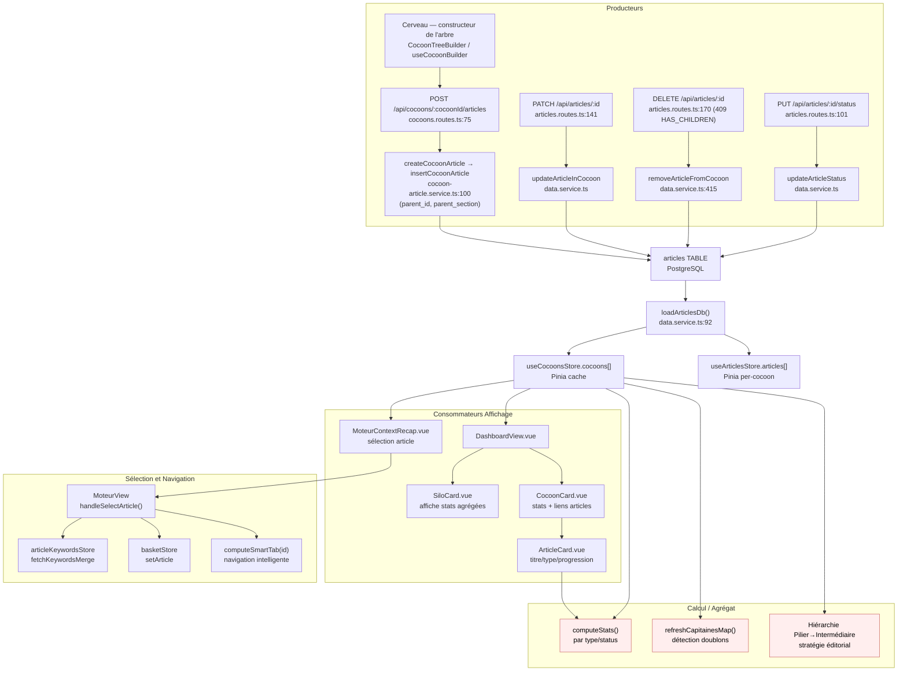

# Data Flow — articles

> **Description métier :** Structure éditoriale centrale. Chaque article porte : identifiant stable (id : number), titre, type hiérarchique (Pilier / Intermédiaire / Spécialisé), slug, phase de workflow (proposed → moteur → redaction → published), statut de rédaction (à rédiger / brouillon / publié), liste des checks complétés (cf. `completed-checks.md` — ne pas dupliquer) et, depuis le chantier C7 (2026-09-25), son **parent dans le cocon** (`parent_id`) et la **section du parent** dont il est né (`parent_section`, le titre d'un H2).
> **Type/format :** Interface `Article` (API camelCase) et `RawArticle` (DB snake_case). Persisté en PostgreSQL table `articles(id, cocoon_id, titre, type, slug, phase, status, completed_checks[], check_timestamps, pain_point, captain_keyword_locked, parent_id, parent_section, ...)`.
>
> **En clair.** Un cocon est un arbre : le pilier (la page qui présente tout le sujet) en haut, ses intermédiaires dessous, puis leurs spécialisés. Chaque enfant « naît » d'un chapitre (H2) de son parent, qui le résume et renvoie vers lui. Exemple : le chapitre « Audit de site » du pilier devient l'intermédiaire « Auditer son site web » (`parent_id` = le pilier, `parent_section` = « Audit de site »).

## Producteurs

Qui crée ou met à jour cette donnée :

### Création unitaire (Cerveau, depuis C7)

La création en lot (`POST /api/articles/batch-create`, `addArticlesToCocoon`) est **supprimée** (commit `d22ea8e`, checklist K6 de l'épopée qualité SEO) : elle acceptait n'importe quel ordre, un intermédiaire naissait avant son pilier, sans parent ni section.

- **Endpoint** `POST /api/cocoons/:cocoonId/articles` ([server/routes/cocoons.routes.ts:75-97](../../server/routes/cocoons.routes.ts)) — Zod `createCocoonArticleSchema` (`title`, `type`, `parentId?`, `parentSection?`, `slug?`, `suggestedKeyword?`, `painPoint?`, `painIntentExpected?`) ; 201 `{ data: Article }`.
- **Service** `createCocoonArticle(cocoonId, input)` ([server/services/article/cocoon-article.service.ts:100-169](../../server/services/article/cocoon-article.service.ts)) — 1. hiérarchie (`verifyCocoonHierarchy`, [shared/verifiers/cocoon-hierarchy.ts](../../shared/verifiers/cocoon-hierarchy.ts) : pilier d'abord, un seul pilier, parent du niveau juste au-dessus et du même cocon — tout ⛔, 409 `HIERARCHY_VIOLATION`) ; 2. mot-clé mesuré (`keyword_metrics`, sinon 422 `KEYWORD_NOT_MEASURED`) ; 3. parent rédigé (étape `redaction:draft_accepted`, sinon sa porte du premier jet est jouée : refus → 409 `GATE_BLOCKED`, accord → étape posée sur le parent) ; 4. section connue du parent et libre ; puis `insertCocoonArticle` ([data.service.ts:508 et suiv.](../../server/services/infra/data.service.ts) : `id = MAX(id)+1` retenté sur conflit, `ON CONFLICT (slug) DO NOTHING` → 409 `SLUG_TAKEN`).
- **Écran** : le constructeur de l'étape Articles du Cerveau — [src/components/production/brain/CocoonTreeBuilder.vue](../../src/components/production/brain/CocoonTreeBuilder.vue), [CocoonCandidatesPanel.vue](../../src/components/production/brain/CocoonCandidatesPanel.vue), [src/composables/strategy/useCocoonBuilder.ts](../../src/composables/strategy/useCocoonBuilder.ts) (`createFromCandidate`, 237-317) : « Créer le pilier » dans un cocon sans pilier, puis « Créer l'article de cette section » sur chaque section libre d'un parent rédigé ; mot-clé choisi parmi des candidats mesurés (`POST /api/cocoons/:cocoonId/child-candidates`) ; un enfant passe par `runThroughGate(parentId)`. L'article créé est ensuite ajouté au pool de mots-clés (`POST /keywords`) et inscrit sur la carte `proposedArticles` (le Moteur tire sa liste de là).
- **Carte indicative** : `proposedArticles` (`useCocoonStrategyStore`, `useArticleProposals`) ne crée plus rien ; elle guide (commit `fb92b46`).
- **Mode automatique** : [scripts/auto-article/phases/cerveau.ts:190-235](../../scripts/auto-article/phases/cerveau.ts) — même route ; section libre la plus proche du sujet (`pickParentSection`).
- **Arbre réel** : `GET /api/cocoons/:cocoonId/tree` → `getCocoonTree` ([cocoon-article.service.ts:58-89](../../server/services/article/cocoon-article.service.ts)) : chaque article, s'il est rédigé, ses sections et l'enfant né de chacune.

### Rattrapage des cocons d'avant C7

- `npm run db:backfill-cocoon` ([scripts/backfill-cocoon.ts](../../scripts/backfill-cocoon.ts), plan pur [scripts/backfill-cocoon-plan.ts](../../scripts/backfill-cocoon-plan.ts)) — **simulation par défaut**, `--apply` pour écrire : `UPDATE articles SET parent_id, parent_section … WHERE parent_id IS NULL` pour chaque article rapproché sûrement (parent de la carte de stratégie, sinon le pilier unique ; section dont les mots propres recoupent son sujet) ; les autres sont listés, jamais devinés — ils se rattachent ensuite à la main, depuis le constructeur du Cerveau (« Rattacher », K8, route ci-dessous). Pose aussi l'étape `redaction:draft_accepted` (cf. `completed-checks.md`).

### Mutations article (PATCH, PUT, DELETE)

- **Endpoint** `PATCH /api/articles/:id` ([server/routes/articles.routes.ts:141-167](../../server/routes/articles.routes.ts)) — reçoit `{ title?, slug?, painIntentExpected? }`, appelle `updateArticleInCocoon()`. **Ne change ni le parent ni la section** : c'est le rôle de la route suivante.
- **Endpoint** `PUT /api/cocoons/:cocoonId/articles/:articleId/parent { parentId, parentSection }` ([server/routes/cocoons.routes.ts:104-126](../../server/routes/cocoons.routes.ts), depuis le 2026-09-25, checklist K8, commit `1cbc921`) → `attachCocoonArticle` ([cocoon-article.service.ts:205-223](../../server/services/article/cocoon-article.service.ts)) : mêmes règles qu'une création (`assertHierarchy`, `assertParentReady` : parent du niveau juste au-dessus, rédigé, section connue et libre — la section de l'article déplacé ne compte pas comme prise), puis `setArticleParent` ([data.service.ts:567-570](../../server/services/infra/data.service.ts)) : `UPDATE articles SET parent_id, parent_section WHERE id`. Appelée par « Rattacher » (`useCocoonBuilder.attachOrphan`) sur les articles hors de l'arbre ; la carte du cocon suit (`parentTitle`, `parentSection`).
- **Endpoint** `PUT /api/articles/:id/status` ([server/routes/articles.routes.ts:101-138](../../server/routes/articles.routes.ts)) — reçoit `{ status: 'à rédiger'|'brouillon'|'publié' }` ; « publié » passe par la porte de publication.
- **Endpoint** `DELETE /api/articles/:id` ([server/routes/articles.routes.ts:170-195](../../server/routes/articles.routes.ts)) — appelle `removeArticleFromCocoon()` : l'article **reste en base** (`cocoon_id`, `parent_id`, `parent_section` à `NULL`) ; **409 `HAS_CHILDREN`** si des enfants sont encore dans le cocon (depuis le commit `fb92b46`) ; un enfant retiré libère sa section.
- **Endpoint** `GET /api/articles/:id/children` ([server/routes/articles.routes.ts:202 et suiv.](../../server/routes/articles.routes.ts)) → `getArticleChildren` ([data.service.ts:488 et suiv.](../../server/services/infra/data.service.ts)) : enfants, section du parent, mot-clé, statut (passe « Résumer », maillage).
- **Services** ([server/services/infra/data.service.ts](../../server/services/infra/data.service.ts)) :
  - `updateArticleStatus(id, status)` — UPDATE articles SET status WHERE id.
  - `updateArticleInCocoon(id, { title?, slug?, painIntentExpected? })` — UPDATE articles SET titre/slug/pain_intent_expected WHERE id.
  - `removeArticleFromCocoon(id)` ([data.service.ts:410-430](../../server/services/infra/data.service.ts)) — `'has-children'` si un article du cocon a `parent_id = id` ; sinon `UPDATE articles SET cocoon_id = NULL, parent_id = NULL, parent_section = NULL`.
  - `updateArticleSuggestedKeyword(id, kw?)` — UPDATE articles SET suggested_keyword.
  - `updateArticleCaptainKeyword(id, kw?)` — UPDATE articles SET captain_keyword_locked (miroir de richCaptain.keyword quand verrouillé).

### Progression et phases

- Progression d'article : voir `completed-checks.md` (cf. `addArticleCheck`, `removeArticleCheck`, `saveArticleProgress`) — gérée par colonne `completed_checks TEXT[]` et `phase TEXT` sur `articles`. Ne pas dupliquer ici.

### Hydratation initiale (Dashboard, Cocoon Landing)

- **Fonction** `loadArticlesDb()` ([server/services/infra/data.service.ts:92-137](../../server/services/infra/data.service.ts)) — SELECT depuis silos/cocoons/articles, reconstruit la hiérarchie Cocoon[].articles en mémoire. Appelée au démarrage et périodiquement.
- **Frontend store** `useCocoonsStore` — hydrate depuis `GET /cocoons` (rout non trouvée en routes, probablement wrapper autour de `loadArticlesDb()`), caching Pinia.

## Persistance

**Autorité absolue** : Table PostgreSQL `articles`. État courant du schéma : le snapshot [server/db/schema.sql](../../server/db/schema.sql) (les anciennes migrations `001*.sql` sont archivées et ne font plus foi, cf. `.claude/CLAUDE.md` §1).

### Schéma DB

[server/db/schema.sql:60-91](../../server/db/schema.sql) (snapshot du 2026-09-25) :

```sql
CREATE TABLE "articles" (
  "id" INTEGER NOT NULL,
  "cocoon_id" INTEGER,
  "titre" TEXT NOT NULL,
  "type" TEXT NOT NULL,
  "slug" TEXT NOT NULL,
  "topic" TEXT,
  "status" TEXT DEFAULT 'à rédiger'::text,
  "phase" TEXT DEFAULT 'proposed'::text,
  "seo_score" NUMERIC,
  "geo_score" NUMERIC,
  "meta_title" TEXT,
  "meta_description" TEXT,
  "completed_checks" TEXT[] DEFAULT '{}'::text[],
  "check_timestamps" JSONB DEFAULT '{}'::jsonb,
  "created_at" TIMESTAMPTZ DEFAULT now(),
  "updated_at" TIMESTAMPTZ DEFAULT now(),
  "suggested_keyword" TEXT,
  "captain_keyword_locked" TEXT,
  "pain_point" TEXT,
  "pain_intent_expected" TEXT,
  "parent_id" INTEGER,
  "parent_section" TEXT,
  CONSTRAINT "articles_parent_not_self" CHECK (((parent_id IS NULL) OR (parent_id <> id))),
  CONSTRAINT "articles_type_check" CHECK ((type = ANY (ARRAY['Pilier'::text, 'Intermédiaire'::text, 'Spécialisé'::text]))),
  CONSTRAINT "articles_cocoon_id_fkey" FOREIGN KEY (cocoon_id) REFERENCES cocoons(id) ON DELETE SET NULL,
  CONSTRAINT "articles_parent_id_fkey" FOREIGN KEY (parent_id) REFERENCES articles(id) ON DELETE RESTRICT,
  CONSTRAINT "articles_pkey" PRIMARY KEY (id),
  CONSTRAINT "articles_slug_key" UNIQUE (slug)
);
-- + index idx_articles_parent_id (ligne 360)
```

`parent_id` et `parent_section` viennent du changement daté [server/db/changes/2026-09-25-article-parent.sql](../../server/db/changes/2026-09-25-article-parent.sql) (idempotent), appliqué par `npm run db:apply -- <fichier>` ([scripts/db-apply-change.ts](../../scripts/db-apply-change.ts), dans une transaction) puis capturé par `npm run db:snapshot`.

**Colonnes clés** :
- `id` : INTEGER, stable, incrémenté par application.
- `cocoon_id` : FK vers cocoons, NULL allowed (soft-delete possible).
- `titre` : chaîne (affichage).
- `type` : enum 'Pilier' | 'Intermédiaire' | 'Spécialisé' (hiérarchie).
- `slug` : UNIQUE, normalisé (SEO), fourni à la création ou déduit du titre.
- `parent_id` (C7) : le parent dans le cocon — le pilier pour un intermédiaire, un intermédiaire pour un spécialisé, `NULL` pour un pilier ou un article d'avant C7 non rattaché. `ON DELETE RESTRICT` : un parent ne s'efface pas de la base tant qu'il a des enfants ; jamais soi-même.
- `parent_section` (C7) : titre du H2 du parent dont l'article est né. Comparé sans casse ni ponctuation finale (`sectionKey`, [shared/chapters.ts](../../shared/chapters.ts)).
- `phase` : 'proposed' | 'moteur' | 'redaction' | 'published' (progression workflow).
- `status` : 'à rédiger' | 'brouillon' | 'publié' (publication).
- `completed_checks` : TEXT[] (cf. `completed-checks.md` — NOT duplicated here).
- `check_timestamps` : JSONB `{ checkName: ISO_timestamp }` (audit trail).
- `seo_score`, `geo_score` : persistés mais non actifs dans le workflow courant.
- `meta_title`, `meta_description` : SEO metadata (éditable en Rédaction).

**Autres tables de contenu liées** :
- `article_content(article_id, outline, content)` — contenu généré et outline (FK cascade DELETE).
- `article_keywords(article_id, capitaine, lieutenants[], lexique[])` — décisions de mots-clés (FK cascade).
- `article_strategies(article_id, data JSONB)` — stratégie micro-contexte (FK cascade).
- `article_micro_contexts(article_id, angle, tone, directives)` — tone/angle éditorial (FK cascade).

### Hiérarchie de fraîcheur

1. **DB (source primaire)** : `articles.*` — état persisté, partagé entre sessions.
2. **Store Pinia** `useCocoonsStore` — cache des cocoons et articles via `cocoonsStore.cocoons[].articles[]`.
3. **Store Pinia** `useArticlesStore` — cache isolé par cocoon via `fetchArticlesByCocoon(cocoonId)`.
4. **Composants Vue** — state local (ex: sélection d'article courant dans `selectedArticle`).

**Fraîcheur du cache store** :
- **Fetch** : appels `GET /cocoons/:id/articles` au mount de Dashboard/CocoonLanding.
- **Écriture** : synchrone dans la DB via endpoints POST/PUT/DELETE, puis update optimiste du store Pinia.
- **Invalidation** : aucun TTL — le cache reste valide jusqu'au reload ou changement de cocoon.

## Consommateurs

### Affichage (UI)

- **Dashboard** (`src/views/DashboardView.vue`) — affiche silos, cocons, articles via composants `SiloCard`, `CocoonCard`, `ArticleCard`.
- **ArticleCard.vue** ([src/components/dashboard/ArticleCard.vue](../../src/components/dashboard/ArticleCard.vue)) — reçoit `Article`, affiche titre, type (badge), phase/status, dots de progression via `ProgressDots` (cf. `completed-checks.md`).
- **MoteurContextRecap.vue** ([src/components/moteur/MoteurContextRecap.vue](../../src/components/moteur/MoteurContextRecap.vue)) — divise articles en deux groupes (suggestedArticles du Cerveau + publishedArticles du cocon), affiche cartes sélectionnables. Reçoit `suggestedArticlesForRecap: Article[]` et `publishedArticles: Article[]`.
- **CocoonLanding.vue** ([src/views/CocoonLandingView.vue](../../src/views/CocoonLandingView.vue)) — affiche intro cocon et 3 portes (Cerveau, Moteur, Rédaction).
- **ArticlePicker.vue** ([src/components/actions/ArticlePicker.vue](../../src/components/actions/ArticlePicker.vue)) — composant de sélection (props `articles: Article[]`).

### Sélection et navigation

- **MoteurView.vue** ([src/views/MoteurView.vue:356-399](../../src/views/MoteurView.vue)) — fonction `handleSelectArticle(article: SelectedArticle | null)` :
  - Écrit `selectedArticle.value = article`.
  - Synchronise `articleKeywordsStore.fetchKeywordsMerge(article.id)`.
  - Synchronise `basketStore.setArticle(article.id)`.
  - Navigue vers le tab smart (calculé via `computeSmartTab(articleId)`).
  - Rafraîchit les exploration counts depuis DB.
- **SelectedArticle type** (mélange de Article + contexte runtime) : utilisé par `MoteurContextRecap` pour transmettre `article` sélectionné à `MoteurView`.

### Calcul / tri / filtre / agrégat

- **Stats agrégées** (`CocoonStats`, `SiloStats`) — calculées depuis `articles[]` :
  - `computeStats(articles)` ([server/services/infra/data.service.ts:42-61](../../server/services/infra/data.service.ts)) — compte par type/status, calcul % complétude (brouillon + publié) / total.
  - Affichage dans les cartes Cocon/Silo : "3 articles / 1 brouillon / 1 publié".
- **Cannibalization detection** — `refreshCapitainesMap()` ([src/views/MoteurView.vue:80-85](../../src/views/MoteurView.vue)) :
  - `GET /cocoons/{cocoonName}/capitaines` → récupère Map `{ articleSlug: capitaineKeyword }`.
  - Utilisé pour détecter si deux articles partagent un Capitaine (doublons).
- **Hiérarchie d'articles** (type Pilier → Intermédiaire → Spécialisé, et depuis C7 `parent_id` / `parent_section` en base) — utilisée dans :
  - Création d'un article : vérificateur `cocoon-hierarchy` (un enfant naît d'une section libre de son parent rédigé).
  - Arbre du cocon (`getCocoonTree`) : constructeur du Cerveau, état du cocon transmis aux prompts (`{{cocoon_context}}`, [server/services/strategy/cocoon-context.service.ts](../../server/services/strategy/cocoon-context.service.ts)).
  - Publication : un parent résume chaque enfant (🔴 section > 250 mots, 🟠 section disparue) ([gate.service.ts `publishCocoonLinks`](../../server/services/gates/gate.service.ts)).
  - Maillage : parent et enfants proposés d'office (`familySuggestions`, [linking.service.ts](../../server/services/article/linking.service.ts)).
  - *(Corrigé le 2026-09-25 : ce document parlait d'un `parent: Pilier.slug` ; aucune colonne de slug parent n'a jamais existé — la hiérarchie ne vivait que dans `proposedArticles[].parentTitle` avant C7.)*
- **Filtrage par phase/status** — utilisé en arrière-plan pour gating UI (ex: Discovery bloquée si Capitaine validé).

> **Règle de cohérence affichage / calcul** — La liste d'articles affichée dans `MoteurContextRecap` (suggestedArticles + publishedArticles) et celle utilisée pour tri/agrégat dans stats doivent provenir de la même source (`cocoonsStore.cocoons[].articles`). Pas de fallback silencieux : si un article est absent, c'est un bug de persistance à diagnostiquer, pas un cas à ignorer.

## Cas d'usage à risque

| Cas | Lecture | Écriture | Risque de divergence |
|---|---|---|---|
| **Premier load** (Dashboard → CocoonCard → articles) | `GET /cocoons` → `loadArticlesDb()` → reconstruit hiérarchie | aucune | Faible si load est atomique. |
| **Création depuis le constructeur du Cerveau** (C7) | arbre réel (`GET /cocoons/:id/tree`) | POST `/cocoons/:id/articles` → INSERT **un** article (parent, section, mot-clé mesuré), puis `POST /keywords` et `saveStrategy` (carte) | **Risque faible** : l'article existe dès la 201 ; un refus du pool ou de la carte n'est qu'un avertissement (l'article reste créé, cf. FR-CER-CREATION-HONNETE). Si la carte n'est pas enregistrée, l'article n'apparaît au Moteur qu'après un nouvel enregistrement de la carte. |
| **Parent pas encore rédigé** (C7) | `articles.completed_checks` du parent | 409 `GATE_BLOCKED` avec l'évaluation de sa porte `draft` ; ou étape posée sur le parent puis création | L'écran grise la création sous un parent non rédigé ; le 409 couvre un état changé entre-temps (alarme ouverte sur le parent). |
| **Chapitre du parent renommé** (C7) | `parent_section` de l'enfant ↔ H2 du parent | aucune | **Risque** : la section n'est plus retrouvée ; 🟠 `child-section-missing` à la publication du parent ; l'arbre montre l'enfant sous « section retirée ». |
| ~~**Batch-create depuis Cerveau**~~ | — | route supprimée (C7, K6) | La création en lot n'était pas transactionnelle (une boucle d'`INSERT … ON CONFLICT (slug) DO NOTHING`). |
| **Reload (F5 page)** | Re-hydration depuis DB via `loadArticlesDb()` | aucune (sauf utilisateur clique) | Faible — DB est source de vérité. Mais Pinia cache vide après reload. |
| **Switch d'article** (Moteur sélectionne nouvel article) | lecture `articles[id]` depuis store | aucune | **Risque faible** : si ancien article a un write en vol et utilisateur switch avant réponse, switch quand même exécute (optimistic update côté API appliqué au nouvel article). |
| **Suppression d'article** (DELETE /articles/:id) | article doit exister ; enfants encore dans le cocon ? | `SET cocoon_id = NULL, parent_id = NULL, parent_section = NULL`, ou 409 `HAS_CHILDREN` | **Risque** : article soft-delété reste en DB, peut être rechargé accidentellement si cocoon_id devient non-NULL à nouveau. Pas de vraie suppression physique. Depuis C7 : un parent qui a des enfants dans le cocon n'est pas retiré (la carte du Cerveau le garde et dit pourquoi) ; un enfant retiré libère sa section. |
| **Création article avec slug dupliqué** | aucune | INSERT ... ON CONFLICT (slug) DO NOTHING | Depuis C7 : 409 `SLUG_TAKEN`, message affiché (« L'adresse /… est déjà prise… »). |
| **Changement de cocon** (article move) | article courant en mémoire | UPDATE articles SET cocoon_id = :newCocoonId | Pas supporté actuellement (pas d'endpoint move). Risque théorique : si ajouté, cache Pinia dans ancien cocon resterait stale. |
| **Micro-context / pain_point** (éditorial préparé en Cerveau) | charge depuis `article_strategies.data` ou `articles.pain_point` | sauvegarde via `PUT /articles/:id/micro-context` | Données partagées entre Cerveau et Rédaction. Risque : si modification côté Cerveau pendant que Rédaction l'utilise, sync peut diverger. |
| **Restore from history** (slider historique articles — non implémenté actuellement) | lire depuis `validation_history` JSONB (unused) | aucun restore persisté | **Risque théorique** : si feature "restore checkpoint" ajoutée, il faudra vérifier cohérence (article récréé avec même id? copié vers nouvel article?). |

## Diagramme



## Régressions historiques

- **Migration slug → articleId (PRD 2026-03)** — Ancien plan utilisait `slug` comme identifiant stable. Implémenté : `id: number` stable + `slug: UNIQUE` (SEO). Mitigation : routes toujours acceptent `/articles/:id` (numérique) et fallback sur `/by-slug/:slug` pour lookup retrouvé via slug.
- **JSON → PostgreSQL (PRD 2026-03)** — Ancien plan parlait de persistance JSON. Implémenté : PostgreSQL table `articles` (autorité unique). Reliques : `data/_archive/` ne doit jamais être relue ; voir CLAUDE.md §1.
- **Cocon sans article** — Risque : if cocoon_id FK permet NULL, article supprimé du cocon reste zombie. Observé : `removeArticleFromCocoon` fait `SET cocoon_id = NULL`. Utilisé pour archivage ? Ou vraie suppression manquante ? À clarifier.
- **Slug unique vs. id PRIMARY KEY** — Article identifié par `id` (num) mais slug aussi UNIQUE → un slug dupliqué échouait silencieusement au batch-create (ON CONFLICT DO NOTHING). Depuis C7, la création unitaire répond 409 `SLUG_TAKEN`.
- **Hiérarchie hors base (avant C7)** — L'arbre du cocon ne vivait que dans `cocoon_strategies.data.proposedArticles[].parentTitle`, rapproché par titre normalisé ; aucune règle d'ordre à la création (un intermédiaire pouvait naître avant son pilier). Corrigé par C7 (`parent_id`, `parent_section`, vérificateur `cocoon-hierarchy`) ; les cocons existants se rattachent par `npm run db:backfill-cocoon`.
- **Retrait d'un parent avalé (avant `fb92b46`)** — Retirer depuis la carte du Cerveau un article dont le serveur refusait le retrait le faisait disparaître de la carte et du Moteur tout en le laissant en base. Désormais : 409 `HAS_CHILDREN`, message affiché, carte inchangée.

## Tests de cohérence à écrire

À placer dans `tests/unit/coherence/articles.test.ts` :

1. **`describe('FR-MOT-ARTICLE-SELECTION — article sélectionné influe sur gating UI')`** :
   - `MoteurView.navGroups` utilise `selectedArticle.value` pour décider si onglets locked/unlocked.
   - Test : sélectionner article → vérifier navGroups.items[*].locked = false ; désélectionner → locked = true.
   - Vérifier cohérence avec `isDiscoveryAllowed` (basé sur `article.keyword` ou progression).

2. **`describe('FR-DASH-PROGRESS — progression dots affichent checks persistés')`** :
   - ArticleCard affiche dots via `ProgressDots` reçoit `completedChecks` de `articles[].completed_checks`.
   - Test : charger article avec checks `['moteur:discovery_done', 'moteur:capitaine_locked']`.
   - Vérifier : dots discovery et capitaine affichent ●, autres ○.
   - Vérifier : la source des checks est bien `articles.completed_checks` (pas cache stale).

3. **`describe('FR-DASH-NAV — hiérarchie Silo → Cocon → Article navigable')`** :
   - `useCocoonsStore.cocoons` structure correcte : `Cocoon[].articles: Article[]`.
   - Test : charger 3 silos, 2 cocons par silo, 3 articles par cocon.
   - Vérifier : `DashboardView` affiche structure correcte (Silo 1 → Cocon 1.1, 1.2 → 3 articles chacun).
   - Vérifier : stats agrégées cohérentes (total = 3×2×3 = 18 articles).

4. ~~**`describe('FR-CER-BATCH-CREATE — création articles atomique + génération slug')`**~~ — remplacé par C7 (FR-CER-COCOON-PROGRESSIVE), **écrit** : `tests/unit/services/cocoon-article.service.test.ts` (pilier seul dans un cocon vide, enfant né d'une section d'un parent rédigé, 409 `SLUG_TAKEN`, 422 mot-clé jamais mesuré), `tests/unit/shared/verifiers-cocoon-hierarchy.test.ts`, `tests/unit/routes/cocoon-articles.routes.test.ts`, `tests/contract-api/articles.contract.test.ts` (`batch-create` → 404 ; 409 `HAS_CHILDREN`).

5. **`describe('FR-DASH-PROGRESS, completed-checks — cohérence affichage vs. gating')`** :
   - Voir aussi `tests/unit/coherence/completed-checks.test.ts` (ne pas dupliquer).
   - Test ici : ArticleCard.ProgressDots affiche exactement les checks persistés.
   - Test : modifier checks en DB directement → rechargement → vérifier dots sync.

6. **`describe('FR-CER-AIGUILLAGE — hiérarchie type article respectée')`** — **écrit par C7** : `verifiers-cocoon-hierarchy.test.ts` (pilier sans parent ; intermédiaire sous le pilier ; spécialisé sous un intermédiaire ; mauvais niveau, parent hors cocon, section inconnue ou prise → ⛔) et `backfill-cocoon-plan.test.ts` (rattachement des cocons existants).

7. ~~**`it.todo('FR-CER-BATCH-CREATE — atomicité')`**~~ — sans objet : la création en lot est supprimée (C7).

---

*Document maintenu par la discipline data-flow-discipline. Cf. [README](./README.md).*
