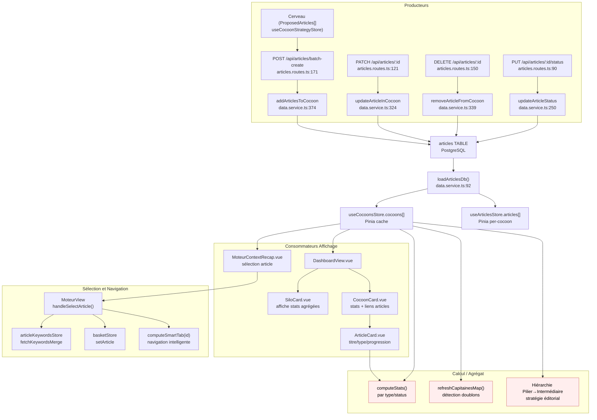

# Data Flow — articles

> **Description métier :** Structure éditoriale centrale. Chaque article porte : identifiant stable (id : number), titre, type hiérarchique (Pilier / Intermédiaire / Spécialisé), slug, phase de workflow (proposed → moteur → redaction → published), statut de rédaction (à rédiger / brouillon / publié), et liste des checks complétés (cf. `completed-checks.md` — ne pas dupliquer).
> **Type/format :** Interface `Article` (API camelCase) et `RawArticle` (DB snake_case). Persisté en PostgreSQL table `articles(id, cocoon_id, titre, type, slug, phase, status, completed_checks[], check_timestamps, pain_point, captain_keyword_locked, ...)`.

## Producteurs

Qui crée ou met à jour cette donnée :

### Création batch (Cerveau → Moteur)

- **Endpoint** `POST /api/articles/batch-create` ([server/routes/articles.routes.ts:171-187](../../server/routes/articles.routes.ts)) — reçoit `{ cocoonName, articles: [{ title, type, slug?, suggestedKeyword?, painPoint? }] }`, valide via Zod `batchCreateArticlesSchema`, appelle `addArticlesToCocoon()`.
- **Service** `addArticlesToCocoon()` ([server/services/infra/data.service.ts:374-416](../../server/services/infra/data.service.ts)) — incrémente auto l'ID (MAX(id)+1), génère slug normalisé (accents striped, kebab), INSERT INTO articles avec valeurs par défaut (status='à rédiger', phase='proposed', completed_checks='{}').
- **Source métier** : ProposedArticles[] du store Cerveau (`proposedArticles` de `useCocoonStrategyStore`), transformées en batch-create via `CerveauView.ts`.

### Mutations article (PATCH, PUT, DELETE)

- **Endpoint** `PATCH /api/articles/:id` ([server/routes/articles.routes.ts:121-147](../../server/routes/articles.routes.ts)) — reçoit `{ title?, slug? }`, appelle `updateArticleInCocoon()`.
- **Endpoint** `PUT /api/articles/:id/status` ([server/routes/articles.routes.ts:90-118](../../server/routes/articles.routes.ts)) — reçoit `{ status: 'à rédiger'|'brouillon'|'publié' }`, appelle `updateArticleStatus()`.
- **Endpoint** `DELETE /api/articles/:id` ([server/routes/articles.routes.ts:150-168](../../server/routes/articles.routes.ts)) — appelle `removeArticleFromCocoon()` (SET cocoon_id = NULL — soft delete, reste en DB).
- **Services** ([server/services/infra/data.service.ts:250-344](../../server/services/infra/data.service.ts)) :
  - `updateArticleStatus(id, status)` — UPDATE articles SET status WHERE id.
  - `updateArticleInCocoon(id, { title?, slug? })` — UPDATE articles SET titre/slug WHERE id.
  - `removeArticleFromCocoon(id)` — UPDATE articles SET cocoon_id = NULL (délie article du cocon).
  - `updateArticleSuggestedKeyword(id, kw?)` — UPDATE articles SET suggested_keyword.
  - `updateArticleCaptainKeyword(id, kw?)` — UPDATE articles SET captain_keyword_locked (miroir de richCaptain.keyword quand verrouillé).

### Progression et phases

- Progression d'article : voir `completed-checks.md` (cf. `addArticleCheck`, `removeArticleCheck`, `saveArticleProgress`) — gérée par colonne `completed_checks TEXT[]` et `phase TEXT` sur `articles`. Ne pas dupliquer ici.

### Hydratation initiale (Dashboard, Cocoon Landing)

- **Fonction** `loadArticlesDb()` ([server/services/infra/data.service.ts:92-137](../../server/services/infra/data.service.ts)) — SELECT depuis silos/cocoons/articles, reconstruit la hiérarchie Cocoon[].articles en mémoire. Appelée au démarrage et périodiquement.
- **Frontend store** `useCocoonsStore` — hydrate depuis `GET /cocoons` (rout non trouvée en routes, probablement wrapper autour de `loadArticlesDb()`), caching Pinia.

## Persistance

**Autorité absolue** : Table PostgreSQL `articles` (migrations `001_initial_schema.sql`).

### Schéma DB

[server/db/migrations/001_initial_schema.sql:47-68](../../server/db/migrations/001_initial_schema.sql) :

```sql
CREATE TABLE IF NOT EXISTS articles (
  id INTEGER PRIMARY KEY,
  cocoon_id INTEGER REFERENCES cocoons(id) ON DELETE SET NULL,
  titre TEXT NOT NULL,
  type TEXT NOT NULL CHECK (type IN ('Pilier', 'Intermédiaire', 'Spécialisé')),
  slug TEXT UNIQUE NOT NULL,
  topic TEXT,
  status TEXT DEFAULT 'à rédiger',
  phase TEXT DEFAULT 'proposed',
  seo_score NUMERIC,
  geo_score NUMERIC,
  meta_title TEXT,
  meta_description TEXT,
  completed_checks TEXT[] DEFAULT '{}',
  check_timestamps JSONB DEFAULT '{}',
  validation_history JSONB DEFAULT '[]',
  created_at TIMESTAMPTZ DEFAULT NOW(),
  updated_at TIMESTAMPTZ DEFAULT NOW()
);
```

**Colonnes clés** :
- `id` : INTEGER, stable, incrémenté par application.
- `cocoon_id` : FK vers cocoons, NULL allowed (soft-delete possible).
- `titre` : chaîne (affichage).
- `type` : enum 'Pilier' | 'Intermédiaire' | 'Spécialisé' (hiérarchie).
- `slug` : UNIQUE, normalisé (SEO), généré ou fourni au batch-create.
- `phase` : 'proposed' | 'moteur' | 'redaction' | 'published' (progression workflow).
- `status` : 'à rédiger' | 'brouillon' | 'publié' (publication).
- `completed_checks` : TEXT[] (cf. `completed-checks.md` — NOT duplicated here).
- `check_timestamps` : JSONB `{ checkName: ISO_timestamp }` (audit trail).
- `seo_score`, `geo_score` : persistés mais non actifs dans le workflow courant.
- `meta_title`, `meta_description` : SEO metadata (éditable en Rédaction).

**Autres tables de contenu liées** :
- `article_content(article_id, outline, content)` — contenu généré et outline (FK cascade DELETE).
- `article_keywords(article_id, capitaine, lieutenants[], lexique[])` — décisions de mots-clés (FK cascade).
- `article_strategies(article_id, data JSONB)` — stratégie micro-contexte (FK cascade).
- `article_micro_contexts(article_id, angle, tone, directives)` — tone/angle éditorial (FK cascade).

### Hiérarchie de fraîcheur

1. **DB (source primaire)** : `articles.*` — état persisté, partagé entre sessions.
2. **Store Pinia** `useCocoonsStore` — cache des cocoons et articles via `cocoonsStore.cocoons[].articles[]`.
3. **Store Pinia** `useArticlesStore` — cache isolé par cocoon via `fetchArticlesByCocoon(cocoonId)`.
4. **Composants Vue** — state local (ex: sélection d'article courant dans `selectedArticle`).

**Fraîcheur du cache store** :
- **Fetch** : appels `GET /cocoons/:id/articles` au mount de Dashboard/CocoonLanding.
- **Écriture** : synchrone dans la DB via endpoints POST/PUT/DELETE, puis update optimiste du store Pinia.
- **Invalidation** : aucun TTL — le cache reste valide jusqu'au reload ou changement de cocoon.

## Consommateurs

### Affichage (UI)

- **Dashboard** (`src/views/DashboardView.vue`) — affiche silos, cocons, articles via composants `SiloCard`, `CocoonCard`, `ArticleCard`.
- **ArticleCard.vue** ([src/components/dashboard/ArticleCard.vue](../../src/components/dashboard/ArticleCard.vue)) — reçoit `Article`, affiche titre, type (badge), phase/status, dots de progression via `ProgressDots` (cf. `completed-checks.md`).
- **MoteurContextRecap.vue** ([src/components/moteur/MoteurContextRecap.vue](../../src/components/moteur/MoteurContextRecap.vue)) — divise articles en deux groupes (suggestedArticles du Cerveau + publishedArticles du cocon), affiche cartes sélectionnables. Reçoit `suggestedArticlesForRecap: Article[]` et `publishedArticles: Article[]`.
- **CocoonLanding.vue** ([src/views/CocoonLandingView.vue](../../src/views/CocoonLandingView.vue)) — affiche intro cocon et 3 portes (Cerveau, Moteur, Rédaction).
- **ArticlePicker.vue** ([src/components/actions/ArticlePicker.vue](../../src/components/actions/ArticlePicker.vue)) — composant de sélection (props `articles: Article[]`).

### Sélection et navigation

- **MoteurView.vue** ([src/views/MoteurView.vue:356-399](../../src/views/MoteurView.vue)) — fonction `handleSelectArticle(article: SelectedArticle | null)` :
  - Écrit `selectedArticle.value = article`.
  - Synchronise `articleKeywordsStore.fetchKeywordsMerge(article.id)`.
  - Synchronise `basketStore.setArticle(article.id)`.
  - Navigue vers le tab smart (calculé via `computeSmartTab(articleId)`).
  - Rafraîchit les exploration counts depuis DB.
- **SelectedArticle type** (mélange de Article + contexte runtime) : utilisé par `MoteurContextRecap` pour transmettre `article` sélectionné à `MoteurView`.

### Calcul / tri / filtre / agrégat

- **Stats agrégées** (`CocoonStats`, `SiloStats`) — calculées depuis `articles[]` :
  - `computeStats(articles)` ([server/services/infra/data.service.ts:42-61](../../server/services/infra/data.service.ts)) — compte par type/status, calcul % complétude (brouillon + publié) / total.
  - Affichage dans les cartes Cocon/Silo : "3 articles / 1 brouillon / 1 publié".
- **Cannibalization detection** — `refreshCapitainesMap()` ([src/views/MoteurView.vue:80-85](../../src/views/MoteurView.vue)) :
  - `GET /cocoons/{cocoonName}/capitaines` → récupère Map `{ articleSlug: capitaineKeyword }`.
  - Utilisé pour détecter si deux articles partagent un Capitaine (doublons).
- **Hiérarchie d'articles** (type Pilier → Intermédiaire → Spécialisé) — utilisée dans :
  - Aiguillage stratégie (Cerveau) pour définir `parent: Pilier.slug` sur Intermédiaire, `parent: Intermédiaire.slug` sur Spécialisé.
  - Génération de silos et contexte (PRD FR-CER-AIGUILLAGE).
- **Filtrage par phase/status** — utilisé en arrière-plan pour gating UI (ex: Discovery bloquée si Capitaine validé).

> **Règle de cohérence affichage / calcul** — La liste d'articles affichée dans `MoteurContextRecap` (suggestedArticles + publishedArticles) et celle utilisée pour tri/agrégat dans stats doivent provenir de la même source (`cocoonsStore.cocoons[].articles`). Pas de fallback silencieux : si un article est absent, c'est un bug de persistance à diagnostiquer, pas un cas à ignorer.

## Cas d'usage à risque

| Cas | Lecture | Écriture | Risque de divergence |
|---|---|---|---|
| **Premier load** (Dashboard → CocoonCard → articles) | `GET /cocoons` → `loadArticlesDb()` → reconstruit hiérarchie | aucune | Faible si load est atomique. |
| **Batch-create depuis Cerveau** (ProposedArticles → articles) | ProposedArticles[] en mémoire | POST `/batch-create` → INSERT n articles, retourne Article[] créés | **Risque modéré** : si 5 articles sont envoyés et que la DB crash après 3 inserts, seulement 3 sont créés. Frontend reçoit les 3 et les affiche, mais l'utilisateur pense que 5 sont persistés. Mitigation : requête atomique avec SAVEPOINT. |
| **Reload (F5 page)** | Re-hydration depuis DB via `loadArticlesDb()` | aucune (sauf utilisateur clique) | Faible — DB est source de vérité. Mais Pinia cache vide après reload. |
| **Switch d'article** (Moteur sélectionne nouvel article) | lecture `articles[id]` depuis store | aucune | **Risque faible** : si ancien article a un write en vol et utilisateur switch avant réponse, switch quand même exécute (optimistic update côté API appliqué au nouvel article). |
| **Suppression d'article** (DELETE /articles/:id) | article doit exister | `SET cocoon_id = NULL` | **Risque** : article soft-delété reste en DB, peut être rechargé accidentellement si cocoon_id devient non-NULL à nouveau. Pas de vraie suppression physique. |
| **Création article avec slug dupliqué** | aucune | INSERT ... ON CONFLICT (slug) DO NOTHING | Silencieux — 2e article avec même slug n'est pas créé mais pas d'erreur signalée. Peut laisser penser que créé. |
| **Changement de cocon** (article move) | article courant en mémoire | UPDATE articles SET cocoon_id = :newCocoonId | Pas supporté actuellement (pas d'endpoint move). Risque théorique : si ajouté, cache Pinia dans ancien cocon resterait stale. |
| **Micro-context / pain_point** (éditorial préparé en Cerveau) | charge depuis `article_strategies.data` ou `articles.pain_point` | sauvegarde via `PUT /articles/:id/micro-context` | Données partagées entre Cerveau et Rédaction. Risque : si modification côté Cerveau pendant que Rédaction l'utilise, sync peut diverger. |
| **Restore from history** (slider historique articles — non implémenté actuellement) | lire depuis `validation_history` JSONB (unused) | aucun restore persisté | **Risque théorique** : si feature "restore checkpoint" ajoutée, il faudra vérifier cohérence (article récréé avec même id? copié vers nouvel article?). |

## Diagramme



## Régressions historiques

- **Migration slug → articleId (PRD 2026-03)** — Ancien plan utilisait `slug` comme identifiant stable. Implémenté : `id: number` stable + `slug: UNIQUE` (SEO). Mitigation : routes toujours acceptent `/articles/:id` (numérique) et fallback sur `/by-slug/:slug` pour lookup retrouvé via slug.
- **JSON → PostgreSQL (PRD 2026-03)** — Ancien plan parlait de persistance JSON. Implémenté : PostgreSQL table `articles` (autorité unique). Reliques : `data/_archive/` ne doit jamais être relue ; voir CLAUDE.md §1.
- **Cocon sans article** — Risque : if cocoon_id FK permet NULL, article supprimé du cocon reste zombie. Observé : `removeArticleFromCocoon` fait `SET cocoon_id = NULL`. Utilisé pour archivage ? Ou vraie suppression manquante ? À clarifier.
- **Slug unique vs. id PRIMARY KEY** — Article identifié par `id` (num) mais slug aussi UNIQUE → risque : deux articles avec slug dupliqué échoent silencieusement au batch-create (ON CONFLICT DO NOTHING). Pas d'erreur remontée.

## Tests de cohérence à écrire

À placer dans `tests/unit/coherence/articles.test.ts` :

1. **`describe('FR-MOT-ARTICLE-SELECTION — article sélectionné influe sur gating UI')`** :
   - `MoteurView.navGroups` utilise `selectedArticle.value` pour décider si onglets locked/unlocked.
   - Test : sélectionner article → vérifier navGroups.items[*].locked = false ; désélectionner → locked = true.
   - Vérifier cohérence avec `isDiscoveryAllowed` (basé sur `article.keyword` ou progression).

2. **`describe('FR-DASH-PROGRESS — progression dots affichent checks persistés')`** :
   - ArticleCard affiche dots via `ProgressDots` reçoit `completedChecks` de `articles[].completed_checks`.
   - Test : charger article avec checks `['moteur:discovery_done', 'moteur:capitaine_locked']`.
   - Vérifier : dots discovery et capitaine affichent ●, autres ○.
   - Vérifier : la source des checks est bien `articles.completed_checks` (pas cache stale).

3. **`describe('FR-DASH-NAV — hiérarchie Silo → Cocon → Article navigable')`** :
   - `useCocoonsStore.cocoons` structure correcte : `Cocoon[].articles: Article[]`.
   - Test : charger 3 silos, 2 cocons par silo, 3 articles par cocon.
   - Vérifier : `DashboardView` affiche structure correcte (Silo 1 → Cocon 1.1, 1.2 → 3 articles chacun).
   - Vérifier : stats agrégées cohérentes (total = 3×2×3 = 18 articles).

4. **`describe('FR-CER-BATCH-CREATE — création articles atomique + génération slug')`** :
   - POST `/articles/batch-create` avec `{ cocoonName, articles: [{ title, type, suggestedKeyword, painPoint }] }`.
   - Test : créer 5 articles, vérifier retour = 5 créés.
   - Vérifier : slugs générés de manière déterministe (title → slug normalisé).
   - Vérifier : `suggested_keyword` et `pain_point` persistés.
   - Test slug dupliqué : créer 2 articles avec même title → slug généré dupliqué → 2e fail (ON CONFLICT DO NOTHING). Vérifier : erreur claire ou silencieuse?

5. **`describe('FR-DASH-PROGRESS, completed-checks — cohérence affichage vs. gating')`** :
   - Voir aussi `tests/unit/coherence/completed-checks.test.ts` (ne pas dupliquer).
   - Test ici : ArticleCard.ProgressDots affiche exactement les checks persistés.
   - Test : modifier checks en DB directement → rechargement → vérifier dots sync.

6. **`describe('FR-CER-AIGUILLAGE — hiérarchie type article respectée')`** :
   - Articles type 'Pilier' : pas de parent.
   - Articles type 'Intermédiaire' : parent = Pilier.slug ou null (fallback).
   - Articles type 'Spécialisé' : parent = Intermédiaire.slug ou null.
   - Test : créer batch avec 1 Pilier, 2 Intermédiaire, 3 Spécialisé → vérifier chaîne parentale.

7. **`it.todo('FR-CER-BATCH-CREATE — atomicité : batch échoue entièrement ou pas du tout')`** :
   - Placeholder : vérifier que si 1/5 articles échoue, soit tous échouent, soit tous réussissent.
   - Actuellement : loop sur articles, chacun ignoré en cas erreur (ON CONFLICT DO NOTHING) — non atomique.

---

*Document maintenu par la discipline data-flow-discipline. Cf. [README](./README.md).*
