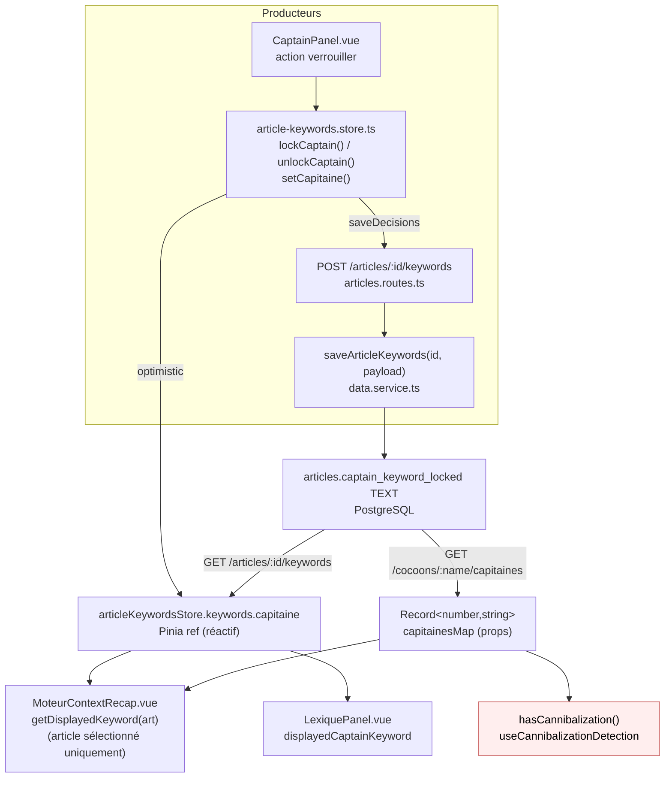

# Data Flow — captain-keyword-locked

> **Description métier :** Colonne `articles.captain_keyword_locked TEXT` (nullable) en PostgreSQL stocke le mot-clé Capitaine **verrouillé** par l'utilisateur dans le Moteur (onglet Capitaine). Tant que la colonne est `NULL`, l'article utilise son `suggested_keyword` (généré par l'IA en Cerveau) ; dès le verrouillage, c'est cette valeur qui devient le Capitaine officiel et nourrit ensuite Lieutenants + Lexique + Brief de rédaction.
> **Type/format :** `TEXT` — chaîne libre (pas de schéma strict), ex. `"design émotionnel"`.

## Producteurs

Qui crée ou met à jour cette donnée :

- **Endpoints REST** :
  - `PUT /api/articles/:id/keywords` ([server/routes/articles.routes.ts](../../server/routes/articles.routes.ts)) — sauvegarde décisions article (`capitaine`, `lieutenants`, `lexique`, `rootKeywords`). Met à jour `articles.captain_keyword_locked` quand `capitaine` est non-vide. Seul producteur HTTP du store côté front (`articleKeywordsStore.saveDecisions()` appelle `apiPut`).
  - `GET /api/articles/:id/keywords` — lecture de l'`ArticleKeywords` côté front (déclenche fetch initial du store).
  - `GET /cocoons/:name/capitaines` ([server/routes/cocoons.routes.ts:88](../../server/routes/cocoons.routes.ts)) — renvoie un `Record<number, string>` indexé par `articleId`, utilisé par `MoteurContextRecap` pour la détection de cannibalisation.

- **Service d'infra** `server/services/infra/data.service.ts` :
  - `saveArticleKeywords(id, payload)` — UPDATE SQL sur `articles.captain_keyword_locked` (snake_case côté DB, camelCase côté API).
  - `data.service.ts` mappe `captain_keyword_locked` (DB) → `captainKeywordLocked` (camelCase) dans le type `Article`, et `capitaine` dans `ArticleKeywords`.

- **Émetteur frontend principal** `CaptainPanel.vue` :
  - Action de verrouillage utilisateur → appelle `articleKeywordsStore.lockCaptain(keyword, aiPanelMarkdown, articleId)` (mutation optimiste du store) puis `saveDecisions(id)` (persistance DB).
  - Action de déverrouillage → `articleKeywordsStore.unlockCaptain()` puis `saveDecisions(id)`.

- **Store Pinia** `article-keywords.store.ts` ([src/stores/article/article-keywords.store.ts](../../src/stores/article/article-keywords.store.ts)) :
  - `keywords.value.capitaine` — string mutée par `lockCaptain()` / `unlockCaptain()` / `setCapitaine()`.
  - `keywords.value.richCaptain.status` (`'suggested' | 'locked'`) — état dérivé pour gating (FR-MOT-LOCK-DERIVED).
  - `keywords.value.articleId` — garde de cohérence : le store conserve les keywords d'un seul article à la fois.

## Persistance

**Autorité absolue** : Table `articles` colonne `captain_keyword_locked TEXT` (PostgreSQL).

- **Hiérarchie de fraîcheur** :
  1. **DB (source primaire)** : `articles.captain_keyword_locked` — vrai état persisté, partagé entre sessions et navigateurs.
  2. **Store Pinia** `article-keywords.store.ts.keywords.capitaine` — mutation optimiste à chaque action utilisateur (le store est frais avant même la réponse API). Garde de cohérence via `keywords.articleId === selectedArticle.id`.
  3. **Projection figée** `props.capitainesMap` (Record<number, string>) — passée à `MoteurContextRecap` par `MoteurView`. Rafraîchie par `useMoteurArticleSync` au check `MOTEUR_CAPITAINE_LOCKED`, mais pas live entre deux mutations utilisateur successives sur le même article.
  4. **Pièges connus** :
     - `MoteurView.vue:127` hardcode `captainKeywordLocked: null` dans le mapping `proposedArticle → Article` pour les articles suggérés (pas encore persistés en DB). Conséquence : la projection ne pourra **jamais** refléter un lock pour ces articles, d'où la nécessité de **lire le store directement** pour l'article sélectionné.
     - `unifiedCapitainesMap` ([MoteurContextRecap.vue:89-98](../../src/components/moteur/MoteurContextRecap.vue)) priorise les valeurs des groupes computés (`!map[id]` garde la première). Donc `props.capitainesMap` fresh est ignoré si l'article a déjà une valeur dérivée. À ne pas réutiliser pour l'affichage live.

- **Durée de validité** :
  - **Fetch initial** : appel `GET /articles/:id/keywords` au sélection d'article (`MoteurView.handleSelectArticle` → `articleKeywordsStore.fetchKeywordsMerge(articleId)`).
  - **Mutation** : optimiste dans le store (sync) + persistance DB asynchrone via `saveDecisions(id)`.
  - **Invalidation** : aucun TTL — le store reste valide jusqu'au switch d'article (`$reset()` ou `fetchKeywordsMerge()` du nouvel article).

## Consommateurs

### Affichage (UI)

- **`MoteurContextRecap.vue`** — tree des articles à gauche du Moteur :
  - Helper `getDisplayedKeyword(art)` ([src/components/moteur/MoteurContextRecap.vue](../../src/components/moteur/MoteurContextRecap.vue)) — pour l'article sélectionné, lit `articleKeywordsStore.keywords?.capitaine` (source réactive fraîche) ; pour les autres articles, fallback `props.capitainesMap[art.id]` puis `art.keyword`.
  - Affichage : `{{ getDisplayedKeyword(art) }}`.

- **`LexiquePanel.vue`** — header de l'onglet Lexique :
  - Computed `displayedCaptainKeyword` ([src/components/moteur/LexiquePanel.vue](../../src/components/moteur/LexiquePanel.vue)) — lit `articleKeywordsStore.keywords?.capitaine` quand `keywords.articleId === selectedArticle.id`, sinon fallback `props.captainKeyword`.
  - Affichage : `{{ displayedCaptainKeyword ?? '—' }}`.

- **`LieutenantsPanel.vue`** (header) — affiche le Capitaine actif au-dessus de la liste des Lieutenants. Lit `props.captainKeyword` aujourd'hui ; doit être migré vers le store si le bug y reproduit (suivi sprint).

- **`CaptainPanel.vue`** — producteur principal. Lit son propre état via le store (déjà conforme).

### Calcul / tri / filtre / agrégat

- **Détection de cannibalisation** ([useCannibalizationDetection.ts](../../src/composables/moteur/useCannibalizationDetection.ts)) :
  - Reçoit un `Record<number, string>` (`articleId → capitaine`) construit par `MoteurContextRecap.unifiedCapitainesMap`.
  - Compare insensiblement à la casse pour détecter deux articles avec le même Capitaine.
  - Affichage : icône warning `<IconWarning>` à côté du titre des articles concernés.

- **Brief de rédaction** (Phase ③) — `articles.captain_keyword_locked` est repris comme keyword principal pour générer le brief (Title, H1, URL).

- **Lieutenants & Lexique** — la valeur du Capitaine sert de seed pour `POST /keywords/:keyword/propose-lieutenants` et `POST /serp/tfidf` (extraction Lexique).

> **Règle de cohérence affichage / calcul** — Pour l'article sélectionné, la valeur affichée dans le tree (`getDisplayedKeyword`), dans le lexique-header (`displayedCaptainKeyword`) et la valeur utilisée pour générer Lieutenants/Lexique dérivent toutes de `articleKeywordsStore.keywords.capitaine`. Pas de fallback silencieux qui pourrait masquer une mutation.

## Cas d'usage à risque

| Cas | Lecture | Écriture | Risque de divergence |
|---|---|---|---|
| **Premier load** (article jamais ouvert) | `GET /articles/:id/keywords` → `keywords.capitaine` | Aucune | Faible — fetch atomique. |
| **Reload (F5)** | Re-hydratation complète depuis DB via `fetchKeywordsMerge(id)` | Aucune | Faible — DB est SSOT, store rechargé. |
| **Switch article A → B → A** | `fetchKeywordsMerge(B)` puis `fetchKeywordsMerge(A)` | Aucune | **Risque modéré** — bleed-through si la garde `keywords.articleId === selectedArticle.id` n'est pas respectée. Mitigé par le check explicite dans `getDisplayedKeyword` et `displayedCaptainKeyword`. |
| **Re-lock direct "X" → "Y"** | Affichage tree + lexique-header | `lockCaptain("Y")` mute le store ; `saveDecisions()` persiste DB | **Risque historique** (corrigé Sprint 2026-05-07) — quand l'affichage lisait `props.captainKeyword`, le re-lock ne rafraîchissait pas le tree. Maintenant : le store est lu directement, donc la mutation est immédiatement visible. |
| **Unlock** | Affichage tree | `unlockCaptain()` (status='suggested', conserve `capitaine` string pour rétro-compat) | Le tree affiche `suggestedKeyword` car `keywords.capitaine` reste défini mais `richCaptain.status='suggested'`. Vérifier que `getDisplayedKeyword` se comporte correctement (sera testé dans le test de cohérence). |
| **Articles `dbId <= 0`** (proposés non-persistés) | Pas de Capitaine en DB → store vide pour cet article | Pas de lock possible (pas de ligne DB) | Le tree affiche le `suggestedKeyword` initial. |
| **Cohérence cross-article** (article B affiché dans le tree pendant qu'on travaille sur A) | `props.capitainesMap[B]` (rafraîchi au check `MOTEUR_CAPITAINE_LOCKED` — fix F2 2026-05-07) | — | **Limitation acceptée** — la valeur peut être stale entre deux locks successifs sur l'article B fait depuis un autre onglet/session. Le refresh `props.capitainesMap` re-fetch `/cocoons/:name/capitaines` à chaque check `MOTEUR_CAPITAINE_LOCKED` émis dans la session courante. Sprint dédié futur si nécessaire pour propagation cross-tab. |
| **Cohérence cross-tab** (2 onglets ouverts du même article) | Chaque onglet a son cache Pinia | Onglet A écrit, Onglet B reste stale | **Risque élevé non mitigé** — pas de WebSocket, pas de polling. Documenté limite connue. |

## Diagramme

## Régressions historiques

- **2026-05-07 — Bugs de réactivité Capitaine + ProgressDots** (corrigés par tech-spec `reactive-captain-and-progress-v2`) :
  - 3 emplacements UI ne rafraîchissaient pas après un lock Capitaine sur l'article sélectionné : tree (`MoteurContextRecap`), header Lexique (`LexiquePanel`), ProgressDots (`MoteurContextRecap`).
  - Cause racine : les composants lisaient des **props figées** alimentées par des computeds figés sur des sources statiques (`strategyStore.proposedArticles`, `cocoonsStore.cocoons`, `MoteurView` hardcoded `captainKeywordLocked: null`), au lieu de lire le **store Pinia muté en optimistic update**.
  - Fix : pattern `FR-MOT-DISPLAY-FROM-STORE` — composants UI live lisent `articleKeywordsStore` / `articleProgressStore` directement.
  - Pour ProgressDots : index réactif `checksByArticleId = computed()` sur `progressStore.progressMap` afin de garantir la traque Vue de la mutation des checks.

- **Cannibalization faux-positifs** ([MoteurContextRecap.vue:16-19](../../src/components/moteur/MoteurContextRecap.vue)) — un changement de typage `capitainesMap` (Record indexé par slug au lieu de articleId) avait causé des faux-positifs systématiques sur tous les articles. Fix : indexation stricte par `articleId` (number), aligné contrat backend `/cocoons/:name/capitaines`. Test à conserver.

## Tests à écrire

À placer dans `tests/unit/coherence/captain-keyword-and-progress-reactive.test.ts` :

1. **`describe('FR-MOT-DISPLAY-FROM-STORE — tree keyword réactif')`** :
   - Monter `MoteurContextRecap` avec un article sélectionné.
   - Trigger `articleKeywordsStore.lockCaptain("Y", null, articleId)`.
   - Asserter `wrapper.find('.tree-article-keyword').text() === "Y"` après `nextTick`.

2. **`describe('FR-MOT-DISPLAY-FROM-STORE — lexique-header réactif')`** :
   - Monter `LexiquePanel` avec un article sélectionné.
   - Trigger `articleKeywordsStore.lockCaptain("Z", null, articleId)`.
   - Asserter le lexique-header affiche "Z".

3. **`describe('FR-MOT-DISPLAY-FROM-STORE — ProgressDots réactif')`** :
   - Monter `MoteurContextRecap`.
   - Trigger `articleProgressStore.addCheck(articleId, MOTEUR_CAPITAINE_LOCKED)`.
   - Asserter `wrapper.findAll('.progress-dot--filled')` contient le bon nombre.

4. **Cannibalization non régressée** : après lock pour 2 articles avec même keyword, `hasCannibalization()` retourne `true` pour les deux (icône warning visible).

---

*Document maintenu par la discipline data-flow-discipline. Cf. [README](./README.md).*
