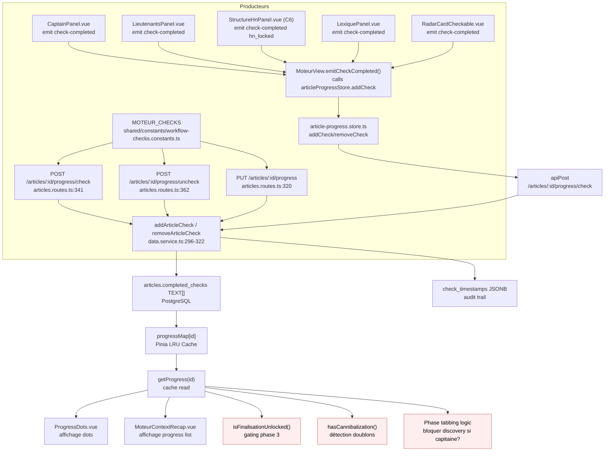

# Data Flow — completed-checks

> **Chantier C7 (2026-09-25)** — une étape Rédaction revient, **une seule** : `redaction:draft_accepted` (`REDACTION_DRAFT_ACCEPTED`, « Premier jet accepté »), gardée par la porte du premier jet (`CHECK_GATES[REDACTION_DRAFT_ACCEPTED] = 'draft'`, [gate.service.ts:60-67](../../server/services/gates/gate.service.ts)). C'est elle qui fait d'un article un **parent rédigé**, capable de donner naissance à ses articles enfants dans le cocon (FR-CER-PARENT-WRITTEN-GATE). Producteurs : `useArticleGeneration.acceptDraft` ([useArticleGeneration.ts:101-111](../../src/composables/article/useArticleGeneration.ts), après la méta, ligne 159), le bandeau [DraftAcceptance.vue](../../src/components/article/DraftAcceptance.vue) (« Valider le premier jet »), la création d'un enfant quand le parent passe sa porte ([cocoon-article.service.ts:129-142](../../server/services/article/cocoon-article.service.ts)), le mode automatique ([scripts/auto-article/phases/redaction.ts:178-182](../../scripts/auto-article/phases/redaction.ts)) et le rattrapage `npm run db:backfill-cocoon` (articles publiés, ou dont le premier jet passe la porte). Consommateurs : le bandeau, `getCocoonTree` (`drafted`), `child-candidates.service` (refus `PARENT_NOT_WRITTEN`). **Pas un dot** : `ProgressDots` ne compte que `MOTEUR_CHECKS`. **Collante** : absente de `CHECK_DEPENDENTS`, rien ne la retire (l'enrichissement éloigne le texte de sa cible sans le rendre « non rédigé »). Écriture : `writeCheckRegex` ([shared/schemas/article-progress.schema.ts:11](../../shared/schemas/article-progress.schema.ts)) n'admet que `moteur:*` et la valeur exacte `redaction:draft_accepted`.

> **Chantier C6 (2026-09-25)** — sixième check `moteur:hn_locked` (« Structure validée », onglet Structure, porte `hn-lock`), entre `lieutenants_locked` et `lexique_validated` ; la Finalisation exige 4 verrous. Les articles d'avant C6 ont `lieutenants_locked` sans `hn_locked` : `npm run db:reconcile-hn` (simulation par défaut, `--apply`) accorde l'étape à ceux dont la structure passe la porte. Les numéros de ligne non datés plus bas sont antérieurs à C6.

> **Description métier :** Colonne `articles.completed_checks` (TEXT[] en PostgreSQL) stocke la progression d'un article : 6 checks Moteur préfixés `moteur:*`, plus, depuis C7, l'étape Rédaction `redaction:draft_accepted`. Source unique de vérité de la progression. (Les familles `cerveau:*` et `redaction:*` ont été retirées 2026-05-13, cf. DRIFT-002 — les valeurs legacy éventuellement persistées sont tolérées en lecture mais plus émises ; seule `redaction:draft_accepted` est revenue.)
> **Type/format :** `TEXT[]` — array de strings, ex. `['moteur:discovery_done', 'moteur:radar_done', 'moteur:capitaine_locked']`

## Producteurs

Qui crée ou met à jour cette donnée :

- **Constantes centralisées** : `shared/constants/workflow-checks.constants.ts` — catalogue Moteur uniquement du 2026-05-13 à C7 :
  - `MOTEUR_CHECKS` : `DISCOVERY_DONE`, `RADAR_DONE`, `CAPITAINE_LOCKED`, `LIEUTENANTS_LOCKED`, `HN_LOCKED` (`moteur:hn_locked`, C6), `LEXIQUE_VALIDATED`
  - `REDACTION_CHECKS` (C7) : `REDACTION_DRAFT_ACCEPTED` (`redaction:draft_accepted`) ; `ALL_WORKFLOW_CHECKS = [...MOTEUR_CHECKS, ...REDACTION_CHECKS]`.
  - Portes : `CHECK_GATES` (`server/services/gates/gate.service.ts:60-67` au commit `fb92b46`) — `capitaine_locked`, `lieutenants_locked`, `hn_locked`, `lexique_validated` et, depuis C7, `redaction:draft_accepted` (porte `draft`) ne sont écrits par `POST /progress/check` que si leur porte passe (422 `GATE_BLOCKED` sinon).

- **Endpoints REST** :
  - `POST /api/articles/:id/progress/check` ([server/routes/articles.routes.ts:341-360](../../server/routes/articles.routes.ts)) — reçoit `{ check: string }`, valide via Zod `addCheckSchema`, appelle `addArticleCheck()`.
  - `POST /api/articles/:id/progress/uncheck` ([server/routes/articles.routes.ts:362-381](../../server/routes/articles.routes.ts)) — reçoit `{ check: string }`, appelle `removeArticleCheck()`.
  - `PUT /api/articles/:id/progress` ([server/routes/articles.routes.ts:320-339](../../server/routes/articles.routes.ts)) — sauvegarde le `ArticleProgress` complet (phase + `completedChecks[]`).

- **Service d'infra** `server/services/infra/data.service.ts` :
  - `addArticleCheck(id, check)` ([lignes 296-310](../../server/services/infra/data.service.ts)) — UPDATE SQL avec `array_append()`, ajoute le check s'il n'y est pas déjà, enregistre timestamp dans `check_timestamps JSONB`.
  - `removeArticleCheck(id, check)` ([lignes 312-322](../../server/services/infra/data.service.ts)) — UPDATE SQL avec `array_remove()`, supprime le check et son timestamp.
  - `saveArticleProgress(id, progress)` ([lignes 286-294](../../server/services/infra/data.service.ts)) — UPDATE global : `phase`, `completed_checks`, `check_timestamps`.

- **Émetteurs frontend** — composants Vue qui émettent `check-completed` ou `check-removed` :
  - `CaptainPanel.vue` ([lignes 47-52](../../src/components/moteur/CaptainPanel.vue)) — emit `check-completed` quand Capitaine est verrouillé.
  - `LieutenantsPanel.vue` ([lignes 49-54](../../src/components/moteur/LieutenantsPanel.vue)) — emit `check-completed` dès qu'un lieutenant est verrouillé et que la porte passe (C6 : plus de condition de structure).
  - `StructureHnPanel.vue` (C6) — emit `check-completed` `MOTEUR_HN_LOCKED` après « Valider la structure » (structure et sommaire enregistrés), `check-removed` quand une structure validée est modifiée puis enregistrée (lignes 81 et 97 au commit `94c7e91`).
  - `LexiquePanel.vue` ([lignes 43-46](../../src/components/moteur/LexiquePanel.vue)) — emit `check-completed` quand Lexique est validé.
  - `RadarCardCheckable.vue` — emit `check-completed` pour Radar (phase découverte).

- **Handler parent** `MoteurView.vue` ([lignes 137-147](../../src/views/MoteurView.vue)) — fonction `emitCheckCompleted(check)` qui appelle `articleProgressStore.addCheck(id, check)` synchronement.

- **Store Pinia** `article-progress.store.ts` ([lignes 43-48](../../src/stores/article/article-progress.store.ts)) — `addCheck(id, check)` :
  - Appelle `POST /articles/:id/progress/check` via `apiPost()`.
  - Reçoit la `ArticleProgress` mise à jour depuis l'API.
  - Cache localement dans `progressMap[String(id)]` avec LRU eviction (max 50 items).

## Persistance

**Autorité absolue** : Table `articles` colonne `completed_checks TEXT[]` (PostgreSQL).

- **Schéma DB** ([server/db/migrations/001_initial_schema.sql:60-61](../../server/db/migrations/001_initial_schema.sql)) :
  - Colonne `completed_checks TEXT[] DEFAULT '{}'`
  - Colonne `check_timestamps JSONB DEFAULT '{}'` — horodatage de chaque check pour audit.
  - Colonne `validation_history JSONB DEFAULT '[]'` — archive historique (unused actuellement).

- **Hiérarchie de fraîcheur** :
  1. **DB (source primaire)** : `articles.completed_checks` — vrai état persisté, partagé entre sessions et navigateurs.
  2. **Store Pinia** `article-progress.store.ts.progressMap` — cache en mémoire (LRU max 50 articles).
  3. **Composants Vue** — state local (ex: `selectedTerms` en Lexique) — éphémère, pas persist sans appel API.

- **Durée de validité du cache store** :
  - **Fetch** : appel `GET /articles/:id/progress` au mount et au changement d'article.
  - **Écriture** : immédiate dans la DB via endpoint POST/PUT ; mise à jour optimiste du cache Pinia.
  - **Invalidation** : aucun TTL — cache reste valide jusqu'à logout ou changement d'article.

- **Persistance du check_timestamps** :
  - `check_timestamps` en PostgreSQL JSONB enregistre `{ checkName: ISO_timestamp }` pour audit trail.
  - Utilisé pour traçabilité historique (debug, understanding du workflow path).
  - Jamais utilisé dans UI pour gating ou affichage (seulement la présence dans `completedChecks[]` compte).

## Consommateurs

### Affichage (UI)

- **ProgressDots.vue** ([src/components/moteur/ProgressDots.vue:26-42](../../src/components/moteur/ProgressDots.vue)) — reçoit `completedChecks: string[]`, affiche des dots de progression groupés par phases (Explorer / Valider).
  - Deux groupes : [Discovery, Radar] et [Capitaine, Lieutenants, Structure, Lexique] (2 + 4 depuis C6).
  - Dot rempli si check ∈ `completedChecks`, vide sinon. Tooltips per-check.

- **MoteurContextRecap.vue** ([src/components/moteur/MoteurContextRecap.vue:104-106](../../src/components/moteur/MoteurContextRecap.vue)) — pour chaque article affiché, fetch et affiche ses checks :
  ```typescript
  function getChecks(id: number): string[] {
    return progressStore.getProgress(id)?.completedChecks ?? []
  }
  ```
  Utilisé pour rendre `<ProgressDots :completedChecks="getChecks(article.id)" />`.

- **ArticleCard.vue** (dashboard) — n'affiche aucun check (vérifié le 2026-09-25) : les dots ne vivent que dans `MoteurContextRecap`.
- **FinalisationPanel.vue** — lit les checks pour son bouton « Aller à la Rédaction » (4 verrous depuis C6) ; **StructureHnPanel.vue** — lit `moteur:hn_locked` pour afficher « Structure validée » ou « La structure a changé depuis sa validation ».

### Calcul / tri / filtre / agrégat

- **Gating de la Finalisation (phase ③)** — `useFinalisationGating.ts` ([lignes 19-21](../../src/composables/moteur/useFinalisationGating.ts), commit `94c7e91`) :
  ```typescript
  function isFinalisationUnlocked(checks: FinalisationChecks): boolean {
    return checks.capitaineLocked && checks.lieutenantsLocked && checks.structureLocked && checks.lexiqueValidated
  }
  ```
  Détecte si `MOTEUR_CAPITAINE_LOCKED`, `MOTEUR_LIEUTENANTS_LOCKED`, `MOTEUR_HN_LOCKED` (C6) et `MOTEUR_LEXIQUE_VALIDATED` sont tous présents.
  Gère le disable/enable du bouton "Continuer vers la Rédaction" et le tooltip des étapes manquantes.

- **Tabbing en Phase ②** — MoteurView.vue ([ligne ~232](../../src/views/MoteurView.vue)) :
  - Tabs `['discovery', 'radar', 'capitaine', 'lieutenants', 'structure', 'lexique', 'finalisation']` (`TAB_IDS`, `useMoteurTabs.ts:30`, `structure` depuis C6) ; `computeSmartTab` : `lieutenants_locked` → Structure, `hn_locked` → Lexique.
  - Discovery/Radar tabs bloquées si Capitaine déjà validé (logique `isDiscoveryAllowed` [lignes 216-224](../../src/views/MoteurView.vue)).

- **Détection de cannibalization** — MoteurContextRecap.vue ([lignes 125-127](../../src/components/moteur/MoteurContextRecap.vue)) :
  - Enrichit la liste article avec checks pour calcul de `hasCannibalization(articleId)` (détection de doublons de keywords).

- **Hydratation sur fetch article** — quand `MoteurView` monte ou change d'article, il fetch le progress pour décider des tabs visibles/actives ([MoteurView.vue:131-135](../../src/views/MoteurView.vue)).

> **Règle de cohérence affichage / calcul** — La valeur affichée dans `ProgressDots` (check présent = dot rempli) et celle utilisée par `isFinalisationUnlocked()` (check présent = condition vraie) dérivent de la même vérification : `completedChecks.includes(check)`. Jamais de fallback silencieux qui masquerait une absence de check.

## Cas d'usage à risque

| Cas | Lecture | Écriture | Risque de divergence |
|---|---|---|---|
| **Premier load** (article jamais ouvert) | Appel `GET /articles/:id/progress` → populate `progressMap` | Aucune (sauf utilisateur valide Capitaine) | Faible si fetch est atomique. |
| **Reload** (F5 page) | Re-hydratation complète depuis DB via `fetchProgress` | Aucune (sauf utilisateur clique) | **Faible** — cache Pinia vidé au reload, DB source de vérité. Mais risque : si utilisateur a validé un check côté AVANT le reload et le signal s'est perdu → la DB contient le check mais la session actuelle peut ignorer un moment. |
| **Switch article** (MoteurContextRecap sélectionne nouvel article) | `articleProgressStore.getProgress(newArticleId)` | Aucune | **Risque modéré** — si l'ancien article a un check en vol (optimistic update en attente) et utilisateur switch avant la réponse API, le check peut être perdu. Mitigé par debounced save en CaptainValidation (300ms). |
| **Deux onglets ouverts** (même article) | Chaque onglet a son cache Pinia indépendant | Onglet A écrit, Onglet B relit cache stale | **Risque élevé** — Pinia cache par session, pas partagé entre tabs. Onglet B affiche checks obsolètes tant qu'il ne refresh pas. Pas de polling/WebSocket pour invalidation cross-tab. |
| **Refresh bouton Radar / Discovery** (re-scan même keyword) | Lecture `completedChecks` pour décider si Discovery bloquée | Possible émission de `MOTEUR_RADAR_DONE` | **Risque faible** — check est idempotent (ne s'ajoute pas deux fois), mais l'affichage du dot peut être stale quelques secondes si refresh API est lent. |
| **Uncheck manuel** (utilisateur click "Retirer Capitaine") | Lecture requise pour afficher l'état de lock avant uncheck | POST `/progress/uncheck` | **Risque modéré** — permet une régression (ex: utilisateur enlève Capitaine, relance Discovery, remet Capitaine). Pas de confirmation modale — risque d'accident. |
| **Restore from history** (utilisateur slider temporel) | Lecture checks historiques depuis `validation_history` JSONB | Aucune (restore ne persiste pas actuellement) | **Risque élevé** — `validation_history` enregistré mais jamais utilisé. Si feature "restore to checkpoint" est ajoutée, il faudra vérifier que les checks restaurés matchent la formule de gating courante. |
| **ProgressDots non réactifs** (validation d'un check sur l'article sélectionné) | `MoteurContextRecap.getChecks(id)` → `progressStore.getProgress(id)?.completedChecks` | `articleProgressStore.addCheck(id, check)` mute `progressMap` et persiste DB | **Régression historique 2026-05-07** — la fonction `getChecks(id)` accédait `progressMap` à chaque appel mais le re-render Vue n'était pas garanti pour des indexations dynamiques par `String(id)`. Cause racine partagée avec FR-MOT-DISPLAY-FROM-STORE : composants UI live doivent lire le store via une dépendance réactive explicite. **Mitigation** : `MoteurContextRecap.checksByArticleId` exposé via `computed<Record<number, string[]>>` qui itère `progressMap`, garantissant la traque Vue. Voir [captain-keyword-locked.md](./captain-keyword-locked.md). |

## Diagramme



## Régressions historiques

- **Hardcoded checks (dette identifiée)** — PRD (ligne 1252) note que plusieurs composants hardcodent `'capitaine_locked'` au lieu d'importer `MOTEUR_CAPITAINE_LOCKED`. Cela viole FR-MOT-CHECKS-CONSTANTS et crée un risque de **refactoring cassant** : si la constant change, les hardcoded strings divergent. **Mitigation** : utiliser systématiquement les imports de `shared/constants/workflow-checks.constants.ts`.

- **Phase naming divergence** — API retourne `phase: 'moteur' | 'redaction'` mais composants utilisent `'explorer' | 'valider' | 'finalisation'` pour les tabs. Ces deux noms coexistent sans clear mapping (legacy et nouveau système). **Mitigation** : un composable centralisé map phase DB → tab ID pour éviter duplication.

- **Check_timestamps non utilisé actuellement** — bien enregistré en JSONB, jamais consulté en UI. Si audit ou replay historique ajoutés, risque que timestamp soit dans le mauvais timezone ou format incomplet.

## Tests de cohérence à écrire

À placer dans `tests/unit/coherence/completed-checks.test.ts` :

1. **`describe('NFR-INT-COMPLETED-CHECKS-SSOT — autorité de la DB')`** :
   - Vérifier que `getProgress(id)` retourne toujours les checks de la DB et non une source secondaire.
   - Tester le cas : appel `addCheck`, puis reload, puis `getProgress` → vérifier que le check est bien persiste et reload le retrouve.

2. **`describe('FR-MOT-CHECKS-CONSTANTS — imports obligatoires')`** :
   - Vérifier que `MOTEUR_CAPITAINE_LOCKED`, `MOTEUR_LIEUTENANTS_LOCKED`, `MOTEUR_LEXIQUE_VALIDATED` sont utilisés correctement dans `CaptainPanel.vue`, `LieutenantsPanel.vue`, `LexiquePanel.vue`.
   - Interdire hardcoded strings : grep tous les `.vue` pour des strings comme `'moteur:capitaine_locked'` directement.

3. **`describe('FR-MOT-CHECKS — gating finalisation cohérent')`** :
   - `isFinalisationUnlocked()` return `false` si l'un des 4 checks manque ; `true` si tous 4 présents (C6 ; couvert par `tests/unit/composables/finalisation-gating.test.ts` et `tests/unit/components/finalisation-panel.test.ts` — « l'ancien trio (sans Structure) ne suffit plus »).
   - Test avec `completedChecks = []` → retour `false`.
   - Test avec `['moteur:capitaine_locked', 'moteur:lieutenants_locked', 'moteur:lexique_validated']` → retour `false` (Structure manque).
   - Test avec les quatre, `moteur:hn_locked` compris → retour `true`.

4. **`describe('NFR-INT-CHECKS-NAMESPACE — préfixe moteur:')`** :
   - Vérifier que les 6 checks Moteur utilisent tous le préfixe `moteur:` (fait : `tests/unit/coherence/completed-checks.test.ts`, dont « refuse "hn_locked" (sans prefixe) »), et que la seule exception est `redaction:draft_accepted` (fait, C7 : « tous les checks suivent le format moteur:snake_case, ou redaction:draft_accepted », « accepte "redaction:draft_accepted", la seule étape Rédaction (C7) », « refuse "redaction:brief_validated" »).
   - Test : tout check sans préfixe `moteur:` lu en DB est ignoré côté affichage.

5. **`describe('article-progress.store — LRU cache eviction')`** (déjà partiellement couvert en [store.test.ts:154-172](../../tests/unit/stores/article-progress.store.test.ts)):
   - Vérifier qu'ajouter 52 articles à progressMap évince l'ancien, garde les 50 les plus récents.

6. **`describe('ProgressDots — affichage cohérent')`** :
   - Composant reçoit `completedChecks = ['moteur:radar_done', 'moteur:capitaine_locked']`.
   - Vérifier que seulement ces deux checks affichent un dot rempli.
   - Vérifier que les autres (discovery, lieutenants, structure, lexique) affichent des dots vides.

7. **`it.todo('check_timestamps — horodatage et audit')`** : placeholder.
   - À implémenter si audit trail requis : vérifier que `check_timestamps` enregistre l'ISO timestamp au moment de l'ajout.
   - Vérifier format : `{ 'moteur:discovery_done': '2026-05-04T14:22:31.123Z', ... }`.

---

*Document maintenu par la discipline data-flow-discipline. Cf. [README](./README.md).*
