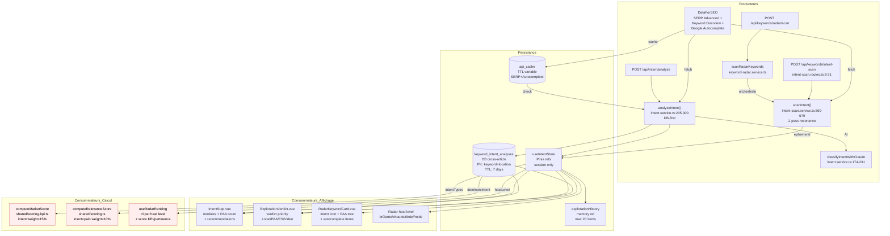

# Data Flow — intent

> **Description métier :** Classification SERP avancée (modules présents, PAA détecté, local pack, featured snippet, vidéos, shopping) combinée à analyse d'intention (informational / transactional_local / navigational / mixed) via Claude + scoring de résonance (autocomplete + PAA alignés au topic spécifique). Croise DataForSEO Advanced SERP + Claude classification + PAA crawling multi-niveaux + autocomplete fuzzy matching + embedding sémantique. Persistance cross-article en DB (analyses partagées entre articles testant le même mot-clé).
> **Type/format :** `{ keyword, modules: SerpModule[], dominantIntent: IntentType, paaQuestions: string[], classification: { type, confidence, reasoning }, recommendations: IntentRecommendation[], topOrganicResults, scores }`

## Producteurs

Qui crée ou met à jour cette donnée :

- **Endpoint** `POST /api/intent/analyze` ([server/routes/intent.routes.ts:12-32](../../server/routes/intent.routes.ts)) — reçoit `{ keyword, locationCode? }`, orchestre le service `analyzeIntent`, renvoie `{ data: IntentAnalysis, usage?: ApiUsage }`.
- **Service** `analyzeIntent()` ([server/services/intent/intent.service.ts:235-300](../../server/services/intent/intent.service.ts)) — **DB-first** (sprint 15.4) : lit `keyword_intent_analyses`, vérifie fraîcheur (7j TTL), retourne le cache sinon refetch complet. Chemin fetch : `fetchSerpAdvanced(keyword)` → extract modules/organic/PAA → `classifyIntentWithClaude(keyword, modules, organicResults)` → consolidation → `saveKeywordIntentAnalysis(result, locationCode)`.
- **Endpoint** `POST /api/keywords/intent-scan` ([server/routes/intent-scan.routes.ts:8-31](../../server/routes/intent-scan.routes.ts)) — reçoit `{ broadKeyword, specificTopic, depth }`, orchestre `scanIntent()` pour le **Radar Intent Scan** (Phase ②). Retourne `{ data: IntentScanResult }`.
- **Service** `scanIntent()` ([server/services/intent/intent-scan.service.ts:569-679](../../server/services/intent/intent-scan.service.ts)) — **2-pass résonance** : Pass 1 = fetch parallèle autocomplete (prefix + suffix + bi-grams selon niche) + PAA crawl multi-niveaux (L1 + L2) + keyword overview. Pass 2 = stem-based matching vs topic words. Pass 3 = embeddings sémantiques (HuggingFace). Produit `IntentScanResult` (score résonance, heat level brûlante/chaude/tiède/froide, items avec source+match+depth).
- **Endpoint** `POST /api/keywords/radar/scan` ([server/routes/intent-scan.routes.ts:65-96](../../server/routes/intent-scan.routes.ts)) — reçoit `{ broadKeyword, specificTopic, keywords[], depth, painPoint? }`, orchestre `scanRadarKeywords()` qui combines `scanIntent()` + enrichissement avec KPIs (volume, KD, CPC, PAA pain-alignment).
- **Endpoint** `POST /api/keywords/autocomplete` ([server/routes/intent.routes.ts:54-72](../../server/routes/intent.routes.ts)) — reçoit `{ keyword, prefixes? }`, appelle `validateAutocomplete(keyword, prefixes)`, enrichit avec volume + SERP density, produit `AutocompleteResult` (certainty index 0-1).
- **Cache cross-article** `keyword_intent_analyses` (FRESHNESS_DAYS = 7) — si frais, court-circuite les appels DataForSEO/Claude.
- **Cache API** `api_cache` (TTL variable) — couche SERP Advanced + Autocomplete + Keyword Overview. Consultation avant fetch.

## Persistance

**Autorité** : `keyword_intent_analyses` (PostgreSQL) pour analyses SERP cross-article ; `api_cache` (TTL) pour raw SERP/autocomplete/KPIs ; `useIntentStore` (Pinia front) pour session courante ; `explorationHistory` (ref) pour historique Explorateur.

- **Table** `keyword_intent_analyses(keyword TEXT, location_code INT, classification TEXT, modules JSONB, scores JSONB, dominant_intent TEXT, recommendations JSONB, top_organic_results JSONB, paa_questions JSONB, fetched_at TIMESTAMPTZ)` ([server/db/migrations/010_cross_article_tables.sql](../../server/db/migrations/010_cross_article_tables.sql)) — PK = (keyword, location_code). Persiste analyse complète SERP + classification Claude + scores modules. Upsert on conflict — une seule version par mot-clé/localisation, à jour si < 7j.
- **Store Pinia** `useIntentStore()` ([src/stores/keyword/intent.store.ts:8-163](../../src/stores/keyword/intent.store.ts)) — refs mutables `intentData: IntentAnalysis | null`, `comparisonData: LocalNationalComparison | null`, `autocompleteData: AutocompleteResult | null`, `localComparisons: Map<keyword, LocalNationalComparison>`, `explorationHistory: ExplorationHistoryEntry[]`. Actions : `analyzeIntent(keyword)`, `compareLocalNational(keyword)`, `validateAutocomplete(keyword, prefixes?)`, `exploreKeyword(keyword, prefixes?)` (combo auto+intent).
- **localStorage** (optionnel historique) — `explorationHistory` peut être persisté si besoin, sinon resette sur reload (actuellement en mémoire seulement).

> **Hiérarchie d'autorité** : `keyword_intent_analyses` (DB authoritative) → `api_cache` (TTL layer) → `useIntentStore` (front session) → `explorationHistory` (UI memory). Toute lecture de front passe par `useIntentStore.analyzeIntent()` qui consulte DB d'abord.

## Consommateurs

### Affichage (UI)

- [src/components/intent/IntentStep.vue](../../src/components/intent/IntentStep.vue) — section "Analyse d'intention SERP" dans Explorateur. Affiche : modules présents (badges colorés), top organic results, PAA questions count, score cumulatif sur les modules, recommendations par module.
- [src/components/intent/ExplorationVerdict.vue](../../src/components/intent/ExplorationVerdict.vue) — verdict bimodal basé sur `intentData.modules` + `intentStore.paaQuestions`. Priorités : Local Pack → PAA → Featured Snippet → Vidéo → "terrain libre". Récupère dominantIntent et paaQuestions du store.
- [src/components/intent/RadarKeywordCard.vue](../../src/components/intent/RadarKeywordCard.vue) (lignes 70-110) — affiche intent type (icône + label), PAA tree (parents/enfants) avec expansion/collapse, autocomplete items avec positions. Utilise `card.intentType` et `card.paaItems` (hydratés par `scanRadarKeywords`).
- **Radar cards** — module Moteur affiche une "heat level" (brûlante/chaude/tiède/froide) issu du `resonanceScore` du `IntentScanResult`.
- Composants **Explorateur** (ExplorationInput.vue, LocalComparisonStep.vue, etc.) — affichent intent + local/national comparison + autocomplete suggestions historiquement.

### Calcul / tri / filtre / agrégat

- **Scoring Marché (KPI)** — `computeMarketScore()` dans [shared/scoring-kpi.ts:50-79](../../shared/scoring-kpi.ts) — ligne 72-73 : `intentValueToPseudoScore(kpis.intentTypes, kpis.intentProbability)` mappe les types d'intent (informational/commercial/transactional_local/navigational) à des valeurs 0-100. Pondération Intent = 15% du score marché. Utilise `RadarKeywordKpis.intentTypes: RadarIntentType[]` (dérivé de `card.intentType`).
- **Scoring Pertinence (Pain Alignment)** — `computeRelevanceScore()` dans [shared/scoring.ts:78-115](../../shared/scoring.ts) — ligne 115 : facteur Intent×douleur 10% du score pertinence. Utilise `intentTypes` si fournis.
- **Tri Radar cards** — `useRadarRanking()` composable tri par score KPI / score pertinence / heat level. Heat level (dérivé de `resonanceScore`) conditionne l'ordre.
- **Filtres Moteur** — aucun actuellement, mais Explorateur bascule visibilité pages sur `hasExplored` / `intentError`.
- **Verdicts dérivés** — `useIntentVerdict()` mapping `modules` → recommendations en ordre priorité.

> **Règle de cohérence affichage / calcul** — L'intent type affiché dans RadarKeywordCard (`card.intentType`) DOIT être la même valeur que celle utilisée au scoring (`kpis.intentTypes`). Si l'intent est absent/null au scoring, l'affichage aussi doit montrer "—" ou badge vide, pas un fallback silencieux. Même logique pour `paaItems.length` : s'il est 0 à l'affichage, pas de "PAAx0" au tri.

## Cas d'usage à risque

| Cas | Lecture | Écriture | Risque de divergence |
|---|---|---|---|
| Premier load article (intent jamais scanné) | — | endpoint `POST /api/intent/analyze` → `keyword_intent_analyses` + `useIntentStore` | Faible si fetch atomique. |
| Reload article (intent frais < 7j) | `keyword_intent_analyses` (DB check) → `useIntentStore` | aucune (cache DB hit) | **Risque** : formule classification Claude peut changée entre deux sprints (intent type changé sans re-analyse). Afficher `cachedAt` pour signaler l'ancienneté. |
| Intent scan 2-pass Radar (spécifique au topic) | Explorateur + keyword broad/specific | `scanIntent()` → `IntentScanResult` (NOT persisted in keyword_intent_analyses — result éphémère) | **Risque** : confusion entre `analyzeIntent` (SERP modules, cross-article) et `scanIntent` (résonance topic-spécifique, éphémère). Les deux retournent des types différents : `IntentAnalysis` vs `IntentScanResult`. |
| Switch d'onglet Explorateur → Moteur | Hydrate depuis `useIntentStore` + Radar scan | aucune (on a les données en store) | Faible. |
| Local vs National comparison | `compareLocalNational()` action → `comparisonData` | persiste en `localComparisons Map` pour cache par keyword (Epic 23 keyword switcher) | **Risque** : cap 50 entrées peut évict anciennes locales si + de 50 keywords testés. Impact oublié : si utilisateur revient sur ancien keyword, nouvelle fetch au lieu d'utiliser la cached. Acceptable car metrics changent entre périodes. |
| Restore depuis history (slider) | `explorationHistory` (ref) | aucune | **Risque** : historique est memory-only. Reload navigateur → history cleared. Si besoin persistance, ajouter localStorage. |
| Autocomplete expansion (depth-1 → depth-2) | `validateAutocomplete(keyword)` initial, puis `scanIntent(keyword, specificTopic, depth=2)` | 2 appels distincts ; cache séparé (`autocomplete-intent` vs `intent`) | **Risque** : premier appel peut retourner suggestions stale, deuxième appel passe depth=2 qui re-fetch manuellement. Pas de cache shared, donc pas de divergence. |
| Multi-provider IA fallback (Claude → Gemini) | `classifyIntentWithClaude()` avec try/catch fallback | Si Claude fail, retour `fallback: { type: hasLocalPack ? 'transactional_local' : 'informational', confidence: 0.3 }` | **Risque** : fallback diffère du vrai Claude result. Stored en DB identiquement. Afficher confidence < 0.5 pour signaler fallback au user. |
| Refresh navigateur (F5) | Re-hydratation depuis `keyword_intent_analyses` | aucune (lecture seule DB) | Faible si toutes les sources en DB. |

## Diagramme

## Régressions historiques

- **2026-04-30 (Intent Scan Radar)** — Avant cette date, aucun "heat level" ni scoring résonance. Intent était limité à l'analyse SERP brute (modules uniquement). Ajout du composable Radar 2-pass (autocomplete + PAA multi-niveaux + embeddings) pour évaluer l'alignement d'un mot-clé à la douleur. Risque : confusion entre `analyzeIntent` (cross-article, DB) et `scanIntent` (topic-spécifique, éphémère). Deux endpoints, deux types différents.
- **Sprint 15.4 (Intent DB-first)** — Avant, analyse d'intent re-fetched à chaque request même si <7j. Ajout du check `isKeywordIntentFresh(fetchedAt)` dans `analyzeIntent()` pour consulter DB d'abord. Impact : si formule Claude changée, anciennes analyses pas automatiquement re-classifiées. Mitigué par affichage `cachedAt` et TTL 7j.
- **Sprint S5 (Intent mismatch Explorateur)** — Bug détecté : `intentData.modules` brut vs `intentStore.dominantIntent` pouvaient diverger si l'une était null (fallback Claude manqué, ou pas fetch complété). Résolution : toujours hydrate `useIntentStore` via `analyzeIntent()` action, jamais accès direct à DB en composant.

## Tests de cohérence à écrire

À placer dans `tests/unit/coherence/intent.test.ts` :

1. **`describe('FR-EXP-INTENT-ANALYZE — affichage vs calcul KPI')`** — Vérifie que `intentTypes` affiché dans RadarKeywordCard.vue (enum RadarIntentType) est exactement le même que celui utilisé par `computeMarketScore(kpis.intentTypes)`. Inclure cas `intentTypes = []` (affichage "—", poids 0 au scoring).

2. **`describe('FR-RAD-SCAN-2PASS — résonance score null handling')`** — Vérifie que `IntentScanResult.resonanceScore = 0` quand `items = []` ou tous `match = 'none'`, jamais fallback `?? 50`. Tri par heat level doit placer `score=0` en bas (froide).

3. **`describe('FR-EXP-INTENT-ANALYZE — PAA questions coherence')`** — Si `paaQuestions` vide à l'affichage (ExplorationVerdict.vue : condition `intentStore.paaQuestions.length > 0`), pas dans les recommendations non plus. Test : `intentStore.analyzeIntent(keyword)` avec SERP sans PAA → `paaQuestions == []` → ExplorationVerdict n'affiche pas "Structurer autour des questions PAA".

4. **`it.todo('FR-RAD-GENERATE — intent type stability across radar/moteur')`** — Placeholder : si utilisateur génère Radar keywords avec intent scan, puis switch vers Moteur validate Capitaine (qui refetch intent), dominantIntent stable sur même keyword (< 7j TTL).

5. **`it.todo('FR-CAP-VALIDATE — intent modules cross-article shared')`** — Placeholder : deux articles testant même keyword → `keyword_intent_analyses` partagé. Premier article fetch + store en DB. Second article → DB hit (pas re-fetch). Modules identiques pour les deux.

---

*Document maintenu par la discipline data-flow-discipline. Cf. [README](./README.md).*
