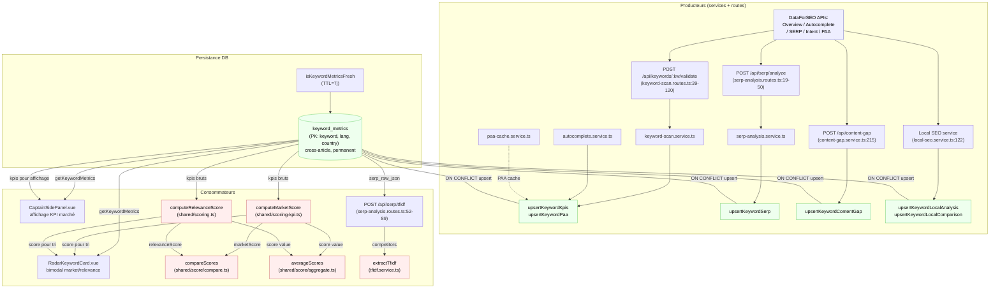

> **Sprint keyword-metrics-decomposition (2026-05-09)** — la colonne `serp_raw_json` a été **droppée** (chore/drop-serp-raw-json-column). Les artefacts SERP cross-article vivent désormais dans **4 tables filles dédiées** : `keyword_serp_results` (URLs Top 10), `keyword_serp_scrapes` (headings + text_content + is_blog), `keyword_paa_questions` (PAA), `keyword_autocomplete` (suggestions). Service consolidé : [`server/services/keyword/keyword-serp.service.ts`](../../server/services/keyword/keyword-serp.service.ts). Les sections ci-dessous mentionnant `serp_raw_json` sont des références historiques.
>
> **Sprint decouplage-lieutenants-lexique (2026-05-09)** — `scrape-corpus.fetchAndPersist` est **supprimé**. Les scrapes SERP sont désormais alimentés par **un seul producteur** : [`server/services/external/scrape-corpus.service.ts`](../../server/services/external/scrape-corpus.service.ts) (`fetchAndPersist` — single producer cross-domaine, cache mémoire 1h LRU). Lieutenants et Lexique consomment via leurs propres services métier (`lieutenants-analysis.proposeLieutenants` lit `headings`, `lexique-analysis.analyzeLexique` lit `text_content`) — zéro import croisé garanti par tests architecturaux permanents.

# Data Flow — keyword-metrics

> **Description métier :** Cache cross-article permanent en PostgreSQL des KPIs et analyses d'un mot-clé (Volume, KeywordDifficulty, CPC, Intent, PAA, Autocomplete, SERP, analyses locales/gap). Un même mot-clé partagé par 2 articles → une seule requête DataForSEO (économie API). Actualisation par freshness check (TTL 7 jours par défaut).
> **Type/format :** Table PostgreSQL `keyword_metrics(keyword, lang='fr', country='fr')` avec PK composite. Chaque colonne peut être `null` indépendamment — **jamais de fallback silencieux (`?? 0`)**, signal explicite "—" à l'affichage. Hiérarchie de cache : `keyword_metrics` (data cross-article permanente) → `api_cache` (TTL court par endpoint DataForSEO) → requête externe.

## Producteurs

Qui crée ou met à jour cette donnée :

- **Endpoint** `POST /api/keywords/:keyword/validate` ([server/routes/keyword-scan.routes.ts:39-301](../../server/routes/keyword-scan.routes.ts)) — réceptionne `{ keyword, level, articleTitle, articleId?, painPoint? }`, effectue un appel parallèle Overview + Autocomplete + SERP + Intent + PAA si miss cache, **upserte KPIs + PAA via `upsertKeywordKpis()` et `upsertKeywordPaa()`** ligne 112-121, retourne `ValidateResponse` bimodal (marketScore + relevanceScore).
- **Service** `keyword-scan.service.ts` orchestre les appels externes et le cache-check (cf. `isKeywordMetricsFresh()` ligne 78).
- **Freshness check centralisé** `isKeywordMetricsFresh(fetchedAt, ttlDays=7)` ([server/services/keyword/keyword-metrics.service.ts:250-254](../../server/services/keyword/keyword-metrics.service.ts)) — retourne `false` si `null` ou > 7j, court-circuite les appels externes.
- **Service Autocomplete** `fetchAutocomplete()` → `upsertKeywordAutocomplete()` ([server/services/keyword/autocomplete.service.ts:149](../../server/services/keyword/autocomplete.service.ts)) — upserte colonne `autocomplete_suggestions` + `autocomplete_source` ('google' | 'dataforseo').
- **Service SERP** `scrape-corpus.fetchAndPersist()` ([server/services/external/scrape-corpus.service.ts](../../server/services/external/scrape-corpus.service.ts), post chantier 2 — remplace l'ancien `scrape-corpus.fetchAndPersist`) — persiste **uniquement** dans les 4 tables filles via `keyword-serp.service.ts` (transaction atomique : `upsertSerpResults` + `upsertSerpScrapes` + `upsertPaaQuestions`). Cache double : mémoire 1h LRU (process-scoped) + DB freshness 7j sur `keyword_serp_results.fetched_at`. Invariant **NFR-INT-SERP-ONCE** renforcé.
- **Service Content Gap** `analyzeCachedCompetitors()` → `upsertKeywordContentGap()` ([server/services/article/content-gap.service.ts:215](../../server/services/article/content-gap.service.ts)) — colonne `content_gap_analysis JSONB`.
- **Service Local SEO** `analyzeMapsCompetitors()` → `upsertKeywordLocalAnalysis()` / `upsertKeywordLocalComparison()` ([server/services/strategy/local-seo.service.ts:122](../../server/services/strategy/local-seo.service.ts)) — colonnes `local_analysis` + `local_comparison JSONB`.
- **Service PAA Cache** `paa-cache.service.ts` → `upsertKeywordPaa()` ([server/services/infra/paa-cache.service.ts:45](../../server/services/infra/paa-cache.service.ts)) — remplissage hiérarchique PAA (level 0/1/2).
- **Endpoints Intent & Radar** appelant parallèlement `fetchSearchIntentBatch()` → pas d'upsert direct (données intent stockées dans `keyword_intent_analyses`, table séparée).

## Persistance

**Autorité absolue** : table PostgreSQL `keyword_metrics` (cross-article, permanent, PK = (keyword, lang, country)).

- **Création** : migration 010 ([server/db/migrations/010_cross_article_tables.sql:15-30](../../server/db/migrations/010_cross_article_tables.sql)) — colonnes de base (Volume, KD, CPC, Autocomplete, PAA, `fetched_at`).
- **Extensions** : migration 012 ([server/db/migrations/012_keyword_metrics_extend.sql](../../server/db/migrations/012_keyword_metrics_extend.sql)) — + `local_analysis`, `content_gap_analysis`, `local_comparison`.
- **Extension SERP** : migration 013 ([server/db/migrations/013_serp_on_keyword_metrics.sql](../../server/db/migrations/013_serp_on_keyword_metrics.sql)) — + `serp_raw_json JSONB`.
- **Index** : `idx_keyword_metrics_fetched ON keyword_metrics(fetched_at)` pour les purges TTL futures.
- **Pattern UPSERT** : `ON CONFLICT (keyword, lang, country) DO UPDATE … SET …` — idempotent, coalesce via `COALESCE(EXCLUDED.*, keyword_metrics.*)` pour garder les valeurs anciennes si nouvelles = `NULL` (cf. `upsertKeywordKpis()` ligne 126-130).

Hiérarchie logique de cache :
```
keyword_metrics (permanent, cross-article)
    ↑
    └─ api_cache (TTL court, par endpoint DataForSEO)
```

**Règle de précédence** : si `keyword_metrics.fetched_at` < 7j → utiliser DB directement ; sinon → consulter `api_cache` (TTL endpoint-spécifique) ; si miss → requête externe → upsert `keyword_metrics` + `api_cache`.

Côté front **Pinia store** `articleKeywordsStore` ([src/stores/article/article-keywords.store.ts](../../src/stores/article/article-keywords.store.ts)) hydrate depuis `GET /articles/:id/keywords` (fusion DB + historique local — pas cache local autonome de `keyword_metrics`).

## Consommateurs

### Affichage (UI)

- **[src/components/moteur/CaptainSidePanel.vue:32-43](../../src/components/moteur/CaptainSidePanel.vue)** — section « KPIs marché » : affiche `searchVolume`, `difficulty`, `cpc`, `intentTypes`, `paaTotal`, `autocompleteMatchCount` depuis `entry.card.kpis` (structure `RadarKeywordKpis` issue de la réponse `/validate`). Lecture seule, sans fallback numérique (`volume ?? 0` interdit par ESLint).
- **[src/components/intent/RadarKeywordCard.vue](../../src/components/intent/RadarKeywordCard.vue)** — card Radar bimodal `displayMode='market' | 'relevance'` : affiche les 2 scores indépendants via les KPIs.
- **[src/components/moteur/CaptainPanel.vue](../../src/components/moteur/CaptainPanel.vue)** — liste verticale avec verdicts par entrée : utilise `card.kpis` pour reconstuire les badges KPI.
- **[src/components/moteur/CaptainVerdictPanel.vue](../../src/components/moteur/CaptainVerdictPanel.vue)** — feu tricolore (GO/ORANGE/NO-GO/GRAY) sur base du verdict.
- **Pages d'audit, comparaison** : affichage summary `Volume: 1.2K | KD: 45 | CPC: €0.50 | Intent: Transactionnel` sans calcul additionnel.

### Calcul / tri / filtre / agrégat

- **Tri liste Capitaine** — `compareScores()` ([shared/score/compare.ts:27-34](../../shared/score/compare.ts)) — opère sur `marketScore.value` ou `relevanceScore.value`, place les `null` en bas (jamais 0). Appellé depuis le composant au switch displayMode.
- **Agrégats** (moyenne, max, min) — `averageScores()`, `maxScore()`, `minScore()` ([shared/score/aggregate.ts](../../shared/score/aggregate.ts)) — excluent les `null` des calculs.
- **Injection prompt IA** — `capitaine-ai-panel.md` reçoit `{{marketScore}}` + `{{relevanceScore}}` pré-formatés via `loadPrompt()` (pas d'injection directe de KPI bruts).
- **Calcul Score Marché** — `computeMarketScore(kpisForMarket, articleLevel)` ([shared/scoring-kpi.ts](../../shared/scoring-kpi.ts)) — pondération Volume 30% / KD 20% / Intent 15% / PAA 10% / AC 10% / CPC 10%, retourne `{ value: 0-100 | null, verdict, breakdown }`.
- **Calcul Score Pertinence** — `computeRelevanceScore({ painAlignmentScore, paaPainAlignmentAvg, ... })` ([shared/scoring.ts](../../shared/scoring.ts)) — pondération Pain 30% / PAA×Pain 25% / AC×Pain 15% / Racines 20% / Intent×Pain 10%. `null` si pas de signal exploitable (articlelevel spécifique, painPoint absent).
- **TF-IDF Lexique** — `extractTfidf(serpData.competitors, keyword)` ([server/services/keyword/tfidf.service.ts:22-80](../../server/services/keyword/tfidf.service.ts)) — consomme `keyword_metrics.serp_raw_json` directement, zero nouvelle requête SERP (invariant **NFR-INT-SERP-ONCE**). Tokenize, compte fréquence document, classification (obligatoire/differenciateur/optionnel).

> **Règle de cohérence affichage / calcul** — La valeur affichée dans `CaptainSidePanel.vue` (`marketScore.value` ou `relevanceScore.value` depuis `entry.card.kpis`) DOIT être exactement celle passée à `compareScores()` au moment du tri. Pas de fallback différent : si la valeur est `null` à l'affichage ("—"), elle doit être `null` au tri (placement en bas) et `null` partout dans les agrégats (exclusion). Test de cohérence requis : voir section Tests ci-dessous.

## Cas d'usage à risque

| Cas | Lecture | Écriture | Risque de divergence |
|---|---|---|---|
| Premier load (mot-clé jamais vu) | `getKeywordMetrics()` miss → null | `/validate` → `upsertKeywordKpis()` + `upsertKeywordPaa()` → DB | Faible si upserts atomiques (ON CONFLICT idempotent). |
| Reload (cache frais) | `getKeywordMetrics()` hit + `isKeywordMetricsFresh()` = true | aucune (TTL > 7j) | Faible — affichage stable. |
| Switch d'onglet Capitaine → Lieutenants (Moteur) | hydratation depuis store Pinia (via `GET /articles/:id/keywords`) | aucune sur `keyword_metrics` | Faible — données en mémoire. |
| SERP stale (> 7j) + re-test article A, puis article B même mot-clé | `/serp/analyze` lit `keyword_metrics.serp_raw_json` miss → `scrape-corpus.fetchAndPersist()` → `upsertKeywordSerp()` | Atomique via upsert | Faible si une seule requête par mot-clé lors du freshness miss. |
| TF-IDF Lexique (Lieutenants) → utilise `serp_raw_json` direct, zéro re-fetch | `/serp/tfidf` lit `getKeywordMetrics()` + `serpRawJson`, calcul local `extractTfidf()` | aucune | **Risque CRITIQUE** : si `serp_raw_json` manquant (utilisateur skip `/serp/analyze`), `/serp/tfidf` retourne 404. Symptôme : « Lancez d'abord l'analyse SERP » (ligne 69 [server/routes/serp-analysis.routes.ts](../../server/routes/serp-analysis.routes.ts)). → Invariant **NFR-INT-SERP-ONCE** : Lieutenants DOIT déclencher `/serp/analyze` avant `/serp/tfidf`. |
| Multi-article cross-keyword (article A test Moteur + article B teste même mot-clé) | Deux appels parallèles `/validate` pour `keyword='seo'` | Deux `upsertKeywordKpis()` sur même PK → ON CONFLICT choisit le plus récent | Modéré si timestamps précis (TIMESTAMPTZ) — base de données décide winner. |
| Parcours utilisateur : Capitaine (affiche marketScore) → re-open panel, affiche relevanceScore (cache Radar vide) | Cache Radar (radar_explorations) vs fallback lexical (`lexicalPainAlignment()`) | aucune sur `keyword_metrics` | **Risque MODÉRÉ** : `relevanceScore` peut changer entre deux ouvertures du panel si painPoint modifié entre-temps. Solution : forcer le re-calc de Radar ou afficher une date du calcul. Cf. tech-spec score-capitaine régression historique 2026-04-28. |
| Restore depuis history (slider à -2h) | `captain_explorations` historique (scores + verdicts mis en cache) | aucune | **Risque MODÉRÉ** : scores historiques utilisent formule d'avant 2026-04-28 (F1 PAA ancien). Afficher la date du calcul. |
| Actualisation manuelle par l'utilisateur (bouton "Recalculer") | Suppression logique de `api_cache` (TTL reset) mais `keyword_metrics` persiste | Prochain `/validate` détecte stale, re-fetch, upsert | Faible si logic de freshness correcte. |

## Diagramme



## Régressions historiques

- **Sprint 15 (2026-04-14)** — Création `keyword_metrics` pour remplacer `api_cache` discrétionnaire. Avant : chaque article qui validait le même mot-clé déclenchait une requête DataForSEO complète. Après : une seule requête par mot-clé avec TTL 7j partagé.
- **Sprint 15.5 (2026-05-02)** — Ajout `local_analysis` + `content_gap_analysis` + `local_comparison` dans la même table au lieu de tables article-scoped. Perte de traçabilité article↔keyword (reconstruction possible via `article_keywords`). Accepté comme trade-off table consolidée.
- **Sprint 15.5-bis (2026-05-03)** — SERP scraping déplacé dans `serp_raw_json` sur `keyword_metrics` (avant : `serp_explorations` article-scoped). Invariant **NFR-INT-SERP-ONCE** : zéro re-requête SERP si frais → TF-IDF Lexique utilise le JSON hérité. Route `/serp/analyze` check DB avant appel externe (ligne 33-37).
- **2026-04-28 (Score Pertinence)** — Changement formule PAA : avant moyenne, après cumulative. Scores historiques stockés dans `captain_explorations` ne sont pas recalculés — affichage doit montrer la date du calcul.
- **2026-05-05 (KPI nullable)** — Migration des types `KeywordOverview / LocationMetrics / RadarKeywordKpis / KeywordAuditResult` : les 4 KPIs marché (`searchVolume`, `keywordDifficulty`, `cpc`, `competition`) passent de `number` à `number | null`. Les `?? 0` côté adapters DataForSEO sont remplacés par `?? null` — l'absence de signal reste explicite jusqu'à l'UI (`—` au lieu de `0`). Voir tech-spec-kpi-types-nullable.md et FR-INFRA-KPI-* dans le PRD.

## Tests de cohérence à écrire

À placer dans `tests/unit/coherence/keyword-metrics.test.ts` :

1. **`describe('FR-INFRA-KEYWORD-METRICS — freshness check (TTL 7j)')`** — vérifier que `isKeywordMetricsFresh()` retourne `false` pour dates > 7j, `true` pour dates ≤ 7j, `false` pour `null` / `undefined`. Tester avec `Date` object et string ISO 8601.

2. **`describe('FR-INFRA-KEYWORD-METRICS — cache-first pattern')`** — Mock `getKeywordMetrics()` pour retourner des données frais ; simuler 2 appels parallèles `/validate` sur même mot-clé ; vérifier que le deuxième appel lit DB sans requête DataForSEO. Implémenter via `vi.mock` sur `keyword-metrics.service.ts`.

3. **`describe('NFR-INT-SERP-ONCE — cross-article single SERP fetch')`** — scénario : article A valide Capitaine (appel `/validate`), puis article B teste même mot-clé Lieutenants (appel `/serp/analyze`). Vérifier que la deuxième requête lit `keyword_metrics.serp_raw_json` sans re-fetch (mock `scrape-corpus.fetchAndPersist` pour échouer si appelée). Route `/serp/analyze` ligne 33-37 doit court-circuiter le fetch si frais.

4. **`describe('NFR-INT-SERP-ONCE — TF-IDF depends on SERP data')`** — `/serp/tfidf` sans appel préalable `/serp/analyze` doit retourner 404 (ligne 68-70). Après `/serp/analyze`, `/serp/tfidf` doit utiliser `serp_raw_json` du DB sans ré-appel. Vérifier le message d'erreur.

5. **`it.todo('cohérence affichage / tri : score null affiché "—" puis tri en bas')`** — CaptainSidePanel affiche `null` comme "—", compareScores place en bas, averageScores exclut. Cas : card avec `marketScore = null`, `relevanceScore = 75`. Au tri par marketScore : doit aller en bas. Au tri par relevanceScore : doit aller haut. Test d'intégration composant Vue.

6. **`it.todo('restore from history : scores legacy (pré-2026-04-28) affichent la date')`** — `captain_explorations` historique a date du calcul ; affichage au panel doit montrer "Calculé le 2026-04-27" si formule legacy.

7. **`describe('FR-MOT-CACHE-CASCADE — upsert idempotent ON CONFLICT')`** — appel `upsertKeywordKpis()` deux fois avec mêmes paramètres ; vérifier que `fetched_at` est mis à jour mais pas doublonné. Tester le coalesce `COALESCE(EXCLUDED.search_volume, keyword_metrics.search_volume)` : passer `searchVolume: null`, vérifier que la valeur ancienne est conservée.

---

*Document maintenu par la discipline data-flow-discipline. Cf. [README](./README.md).*
