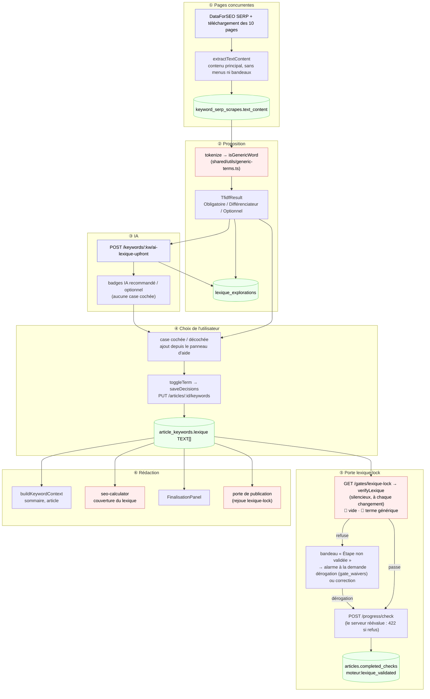

# Data Flow — lexique

> **Description métier :** le lexique dit à la rédaction quels mots du métier l'article doit employer. L'outil mesure les mots des pages concurrentes (TF-IDF, trois niveaux : Obligatoire ≥ 70 % des concurrents, Différenciateur 30-70 %, Optionnel < 30 %), l'IA en recommande certains, **l'utilisateur choisit**. Seul ce qu'il a coché est enregistré et transmis à la rédaction. Depuis le 2026-09-25 (épopée qualité SEO, C3), rien n'est coché d'office, les mots vides et le décor des pages sont écartés, et une porte refuse un lexique vide ou générique.
> **Type/format :** proposition = `TfidfResult` (termes d'un seul mot, 50 au plus par niveau, triés par densité) ; décision = `string[]` dans `article_keywords.lexique` (TEXT[], même ligne que capitaine, lieutenants, racines et structure Hn).

> Réécrit le 2026-09-25. La version précédente (2026-05-09) décrivait une lecture dans `keyword_metrics.serp_raw_json` et un pré-cochage des obligatoires : les deux ont disparu. Les numéros de ligne ne sont plus cités (ils dérivent) : chercher les fonctions nommées.

## La chaîne, de la page concurrente à la rédaction

```
① Scrape des 10 pages     scrape-corpus.fetchAndPersist → extractTextContent (texte principal seulement)
                          → keyword_serp_scrapes.text_content
② TF-IDF                  lexique-analysis.analyzeLexique → tfidf.extractTfidf → tokenize (sans mots génériques)
                          → TfidfResult (+ lexique_explorations.tfidf_terms si articleId)
③ IA                      POST /keywords/:kw/ai-lexique-upfront → recommandations (badges), aucune case cochée
                          → lexique_explorations.ai_recommendations / ai_missing_terms / ai_summary
④ Choix de l'utilisateur  case cochée / décochée, ajout depuis le panneau d'aide → toggleTerm → saveDecisions
                          → PUT /articles/:id/keywords → article_keywords.lexique
⑤ Porte lexique-lock      à chaque changement d'un lexique non vide : saveDecisions → GET /gates/lexique-lock
                          (verifyLexique, silencieux) → passe : check-completed → POST /progress/check
                          → refuse : bandeau « Étape non validée » (+ check-removed) → alarme à la demande
⑥ Rédaction               buildKeywordContext (sommaire, article), brief IA, score SEO, Finalisation,
                          porte de publication (rejoue lexique-lock)
```

## Producteurs

### ① Texte des pages concurrentes

- [server/services/external/scrape-corpus.service.ts](../../server/services/external/scrape-corpus.service.ts) — `fetchAndPersist(keyword, level)` : cache mémoire 1 h, puis base si la SERP a moins de 7 jours (`getSerpResultsFresh`), sinon appel DataForSEO + téléchargement des 10 pages. Pour chaque page, `extractTextContent(html)` retire scripts, styles, commentaires, puis ne garde que le **contenu principal** (`mainContent`) : `<main>`, sinon les `<article>`, sinon la page ; sans `nav`, `header`, `footer`, `aside`, `form` (dans un `<article>`, l'en-tête — le titre — est gardé, le pied retiré), ni les éléments dont l'`id` ou la `class` contient cookie, consent, rgpd, gdpr, didomi, axeptio, tarteaucitron, onetrust, newsletter. Écrit `keyword_serp_scrapes.text_content` (transaction `withSerpTransaction`).
- Qui déclenche un scrape : l'analyse Lieutenants, `POST /serp/analyze`, et le Lexique quand l'utilisateur confirme « Lancer l'analyse SERP » ou teste un autre mot-clé (`triggerScrapeIfMissing: true`).

### ② Proposition TF-IDF

- `POST /api/serp/tfidf` ([server/routes/serp-analysis.routes.ts](../../server/routes/serp-analysis.routes.ts)) → `analyzeLexique(keyword, { articleId, triggerScrapeIfMissing })` ([server/services/keyword/lexique-analysis.service.ts](../../server/services/keyword/lexique-analysis.service.ts)) : scrape éventuel, lecture `getTextContent` (`keyword_serp_scrapes.text_content`, **sans filtre d'âge**), 404 `LexiqueScrapeMissingError` si aucun texte, puis `extractTfidf` ; enregistre la proposition dans `lexique_explorations.tfidf_terms` (`saveLexiqueTfidf`) si `articleId` est fourni.
- [server/services/keyword/tfidf.service.ts](../../server/services/keyword/tfidf.service.ts) — `tokenize` : minuscules, lettres (accents compris) et tiret, puis écarte tout mot pour lequel `isGenericWord` est vrai ; le mot garde son accent. `computeTfidfFromTexts` : fréquence documentaire → niveau, densité arrondie à 0,1, tri par densité, 50 par niveau. **Mots isolés seulement** (pas de n-grammes).
- [shared/utils/generic-terms.ts](../../shared/utils/generic-terms.ts) — **source unique** de ce qui n'est pas du métier : `normalizeTerm` (minuscules, sans accents), `isGenericWord` (moins de 3 lettres, nombre, mot grammatical ou décor de page), `isGenericTerm` (tous les mots du terme sont génériques). Volontairement absents : « site », « blog », « article », « recherche ».

### ③ Recommandations de l'IA

- [src/composables/lexique/useLexiqueIa.ts](../../src/composables/lexique/useLexiqueIa.ts) — `generateLexiqueUpfront`, lancé par `LexiquePanel` dès qu'un TF-IDF arrive sans recommandations : `POST /api/keywords/:keyword/ai-lexique-upfront` (SSE, [server/routes/keyword-ai-panel.routes.ts](../../server/routes/keyword-ai-panel.routes.ts), prompt `lexique-analysis-upfront.md`). `onDone` remplit `iaRecommendations` (Map par terme en minuscules) et **ne coche rien** ; le serveur enregistre le résultat (`saveLexiqueAi` → `lexique_explorations.ai_recommendations`, `ai_missing_terms`, `ai_summary`).

### ④ Le choix de l'utilisateur (seul producteur de `article_keywords.lexique` dans le Moteur)

- [src/components/moteur/LexiquePanel.vue](../../src/components/moteur/LexiquePanel.vue) — watcher `immediate` sur `lockedTerms` : `selectedTerms = new Set(lockedTerms)` — l'écran suit **toujours** le lexique enregistré, quel que soit le chemin (extraction, restauration `hydrateFromDb`, fusion) ; `handleToggleTerm` → `persistToggle` ; `handleAssistAdd` (terme ajouté depuis `KeywordAssistPanel`) → `persistToggle` s'il n'est pas déjà enregistré.
- [src/composables/lexique/useLexiqueLocking.ts](../../src/composables/lexique/useLexiqueLocking.ts) — `toggleTerm(term)` → `store.addLexiqueTerm` / `removeLexiqueTerm` → `store.saveDecisions(id)` : un enregistrement par geste. Expose aussi `lockedTerms` et `isLocked`.
- [src/stores/article/article-keywords.store.ts](../../src/stores/article/article-keywords.store.ts) — `saveDecisions` → `PUT /api/articles/:id/keywords` ([server/routes/keywords.routes.ts](../../server/routes/keywords.routes.ts)) → `saveArticleKeywords` ([server/services/infra/data.service.ts](../../server/services/infra/data.service.ts), upsert de la ligne `article_keywords`).

### Autres producteurs

- **Mode automatique** — [scripts/auto-article/phases/moteur-valider.ts](../../scripts/auto-article/phases/moteur-valider.ts) : TF-IDF → `pickLexique` ([scripts/auto-article/heuristics/pick-lexique.ts](../../scripts/auto-article/heuristics/pick-lexique.ts), qui écarte aussi tout terme `isGenericTerm`) → `saveThenEmit` enregistre le lexique **avant** de demander l'étape.
- **Rédaction, section « Mots-clés »** — [src/components/keywords/ArticleKeywordsPanel.vue](../../src/components/keywords/ArticleKeywordsPanel.vue) (monté par `BriefStructureStep.vue`) : ajout manuel (`addLexiqueTerm`), « suggérer » (`suggestLexique` → `POST /keywords/lexique-suggest`, qui **remplace** le lexique du store par la proposition de l'IA) et « Enregistrer » (`saveDecisions`). Ce chemin n'applique ni le filtre des mots génériques ni la porte ; seule la porte de publication les rattrape.

## Persistance

| Donnée | Où | Portée | Rôle |
|---|---|---|---|
| Texte des pages | `keyword_serp_scrapes.text_content` | par mot-clé, partagé entre articles | matière du TF-IDF |
| Proposition et avis de l'IA | `lexique_explorations` (`tfidf_terms`, `ai_recommendations`, `ai_missing_terms`, `ai_summary`, `explored_at`), unique `(article_id, source_keyword)` | par article et par mot-clé exploré | onglets d'exploration, relecture sans recalcul |
| **Décision** | `article_keywords.lexique` TEXT[] | par article | **autorité** : ce que l'utilisateur a retenu |
| Étape | `articles.completed_checks` (`moteur:lexique_validated`) | par article | accordée par la porte |
| Dérogations | `gate_waivers` (`gate_id = 'lexique-lock'`, une ligne par terme générique assumé, ou pour le lexique vide) | par article | tombent si le lexique change (empreinte = termes normalisés triés) |

- Mémoire : `useArticleKeywordsStore.keywords.lexique` (hydraté par `GET /articles/:id/keywords` ; `fetchKeywordsMerge` fait l'union par valeur avec ce qui est déjà en mémoire) ; `selectedTerms` (`Set` local à `LexiquePanel`, recopié depuis `lockedTerms` à chaque changement de celui-ci) ; `lexiqueGateBlocked` (dernier verdict refusé de la porte, affiché dans le bandeau) ; cache mémoire 1 h du scrape.

Hiérarchie :
```
keyword_serp_scrapes.text_content      (texte principal des pages, par mot-clé)
        ↓ TF-IDF sans mots génériques
lexique_explorations                   (proposition + avis IA, par article × mot-clé)
        ↓ geste de l'utilisateur
article_keywords.lexique               (décision — autorité)
        ↓ porte lexique-lock
articles.completed_checks              (étape « Lexique validé »)
```

## Consommateurs

### Affichage (UI)

- **LexiquePanel.vue** + `LexiqueTermsList.vue` — trois listes avec cases à cocher (cochées = `selectedTerms`), badges « IA recommandé » / « IA optionnel » (`isIaRecommended`), compteur « N terme(s) sélectionné(s) » et répartition par niveau (`selectedByLevel`), onglets d'exploration (`TabBar`), tri A-Z / densité / pertinence douleur (`SortToggleBar`, `jaccardWithPainPoint`).
- **Bandeau de la porte** — `data-testid="lexique-gate-banner"` : « Étape non validée. » + première raison (« (+n autres) »), bouton « Voir pourquoi / décider » (`lexique-gate-review`).
- **Alarme graduée** — `GateAlarm.vue`, titre « Avant de valider le lexique » (`GATE_LABELS['lexique-lock']`), ouverte par le bouton du bandeau (`useGateAlarmStore().ensure`) ou, si le serveur refuse malgré tout, par `useMoteurArticleSync.emitCheckCompleted` → `gateAlarm.runThroughGate` sur un 422.
- **FinalisationPanel.vue** — « Lexique (N termes) » et la liste des termes retenus, lus dans le store.
- **Compteur du panneau de cache** — `MoteurView` passe `validatedLexiqueCount` (longueur du lexique du store).

### Calcul / tri / filtre / agrégat

- **Vérification côté écran** — `LexiquePanel.vue` : `watch(isLocked)` (vide → non vide) et watcher `lockedTerms` (tout changement d'un lexique non vide) → `requestLexiqueGate` (sérialisé) → `syncLexiqueGate` : `saveDecisions` **puis** `useGateAlarmStore().evaluate(id, 'lexique-lock')`, sans alarme. Porte passée → `check-completed` si l'étape manque ; refusée → bandeau et `check-removed` si l'étape est là. Vérification impossible (réseau, contexte sans Pinia) → l'étape est demandée quand même, le serveur tranche. Changement d'article → état remis à zéro.
- **Porte `lexique-lock`** — [shared/verifiers/lexique.ts](../../shared/verifiers/lexique.ts) `verifyLexique({ terms })` : 🔴 `lexique-empty` (« Aucun terme retenu : le lexique est vide. », assumable) ; 🔴 `lexique-generic-term:<terme normalisé>` (une alerte par terme, dédoublonnée). [server/services/gates/gate.service.ts](../../server/services/gates/gate.service.ts) `lexiqueGate` lit `article_keywords.lexique` ; `CHECK_GATES[MOTEUR_LEXIQUE_VALIDATED] = 'lexique-lock'` garde `POST /articles/:id/progress/check` et `PUT /articles/:id/progress` ([server/routes/articles.routes.ts](../../server/routes/articles.routes.ts)).
- **Porte de publication** — `publishGate` rejoue `lexique-lock` avec les portes capitaine et lieutenants : un terme générique revient en `lexique-lock:lexique-generic-term:…` 🔴, un lexique vide en `lexique-lock:lexique-empty` 🔴 (l'article ne se publie qu'avec une raison écrite). `npm run verify` (`verify:content`) rejoue la même porte pour chaque article rédigé.
- **Rédaction** — `buildKeywordContext` ([server/routes/generate/_helpers.ts](../../server/routes/generate/_helpers.ts)) écrit « Lexique sémantique (corps de texte) : … » dans le contexte des routes sommaire (`outline.routes.ts`) et article (`article.routes.ts`), qui relisent `article_keywords` en base (`getArticleKeywords`). Le brief IA (`brief-explain.routes.ts`) reçoit le lexique du store, envoyé par `ArticleWorkflowView`.
- **Score SEO** — [src/utils/seo-calculator.ts](../../src/utils/seo-calculator.ts) : `calculateLexiqueCoverage` (termes détectés / total) et score de présence du lexique, à partir des mots-clés de l'article passés par `useSeoScoring`. Un mot vide, présent dans tout texte, gonflerait cette couverture : c'est l'une des raisons de la porte.

> **Règle de cohérence affichage / calcul** — Ce que l'écran montre coché doit être ce qui est enregistré (`selectedTerms` recopié de `lockedTerms` à chaque changement, chaque geste écrit en base), et c'est cette même liste que lisent la porte, la rédaction, la Finalisation et le score SEO. Les termes sont comparés tels qu'enregistrés, sauf par la porte, qui compare et identifie ses alertes sur `normalizeTerm` (sans accents, minuscules). Depuis le 2026-09-25, la recopie est faite par un watcher sur `lockedTerms`, donc aussi quand le TF-IDF est restauré depuis la base.

## Cas d'usage à risque

| Cas | Lecture | Écriture | Risque de divergence |
|---|---|---|---|
| Première extraction | `POST /serp/tfidf` | `lexique_explorations.tfidf_terms` ; **rien** dans `article_keywords` | Faible : aucune case cochée, compteur à 0, aucune étape demandée. |
| Fin de l'analyse IA | flux SSE | `lexique_explorations.ai_*` | Faible : badges seulement, aucune case cochée. |
| L'utilisateur coche un premier terme | — | `PUT /articles/:id/keywords`, vérification, puis `POST /progress/check` | Faible : la porte juge ce qui vient d'être enregistré ; refus → bandeau, étape non accordée. |
| Terme générique coché, puis décoché ou remplacé | — | lexique enregistré | Faible : chaque changement relance la vérification ; l'étape suit le verdict. |
| Terme générique ajouté après l'étape accordée | — | lexique enregistré, `POST /progress/uncheck` | Faible : l'étape est retirée et le bandeau s'affiche. |
| Deux cases cochées très vite | — | deux `PUT` | Faible : vérifications sérialisées, une seule demande d'étape. |
| Lexique édité depuis la Rédaction (section « Mots-clés ») | store | `PUT /articles/:id/keywords` | **Modéré** : ni filtre des mots génériques ni porte à ce moment ; la publication les rattrape. |
| Rechargement de la page | `GET /articles/:id/keywords`, `GET /articles/:id/explorations` | aucune | Faible depuis le 2026-09-25 : le watcher sur `lockedTerms` recoche les termes enregistrés même quand le TF-IDF est restauré depuis la base, et le compteur est juste. Avant, ils s'affichaient décochés et cliquer l'un d'eux le retirait de la base (défaut antérieur à C3). Réconciliation de l'étape au montage : lexique non vide sans étape → vérification. |
| Explorations enregistrées avant C3 | `lexique_explorations.tfidf_terms` | aucune | **Modéré** : une proposition restaurée depuis la base n'est pas refiltrée ; elle peut encore montrer « être » ou « vos ». La porte les refuse s'ils sont cochés. |
| Scrape déjà en base, antérieur au 2026-09-25 | `keyword_serp_scrapes.text_content` | aucune | **Modéré** : le texte garde menus et bandeaux jusqu'au prochain scrape (SERP de plus de 7 jours via `fetchAndPersist`) ; le TF-IDF écarte de toute façon les mots de décor de la liste. |
| Article rédigé sans lexique | `article_keywords.lexique` vide | aucune | **À connaître** : la publication s'arrête sur 🔴 `lexique-lock:lexique-empty` (assumable par écrit) et `verify:content` avertit (`publish-gate-refused`) tant qu'aucune dérogation ne le couvre. |
| Mode automatique | TF-IDF | `saveThenEmit` | Faible : `pickLexique` n'emporte aucun terme générique ; s'il ne reste rien, la porte refuse (🔴 lexique vide) et le run s'arrête — `auto:article` ne déroge jamais. |

## Diagramme



## Régressions historiques

- **2026-05-09 — découplage Lieutenants / Lexique et table `keyword_serp_scrapes`** — le TF-IDF ne lit plus `keyword_metrics.serp_raw_json` mais `keyword_serp_scrapes.text_content`, via `analyzeLexique` ; le Lexique peut déclencher son propre scrape (`triggerScrapeIfMissing`), avec pré-vérification et confirmation (FR-LEX-PRECHECK-SERP).
- **2026-09-23 — cases cochées non enregistrées** — les obligatoires arrivaient cochés sans être enregistrés : « 38 termes sélectionnés » à l'écran, étape jamais validée. Correctif du jour : `lockMany` enregistrait le pré-cochage (FR-LEX-PRECHECK-PERSISTE).
- **2026-09-24 — lexique du pilier 1013** — « vos », « nos », « être » retenus : liste de mots vides écrite sans accents (« etre ») comparée à des mots accentués, pages analysées avec leurs menus et bandeaux cookies, et pré-cochage qui validait l'étape sans choix.
- **2026-09-25 — C3 (FR-LEX-METIER-ONLY)** — source unique des mots génériques, texte principal des pages, fin de tout pré-cochage (`lockMany` et `onPreChecked` supprimés), porte `lexique-lock` sur l'étape et à la publication. Le même jour : lexique vide ramené de ⛔ à 🔴 (assumable), porte revérifiée à chaque changement du lexique avec bandeau (un terme générique ajouté retire l'étape), et fin d'un défaut plus ancien — au rechargement, les termes enregistrés s'affichaient décochés et cliquer l'un d'eux le retirait de la base (watcher sur `lockedTerms`).

## Tests

Déjà écrits :
- `tests/unit/shared/generic-terms.test.ts` — mots vides avec ou sans accent, décor de page, termes de plusieurs mots, nombres.
- `tests/unit/services/tfidf.test.ts` — bloc FR-LEX-METIER-ONLY : « être », présent chez tous les concurrents, ne devient pas obligatoire ; l'accent est gardé.
- `tests/unit/services/scrape-corpus.service.test.ts` — contenu principal, menus, bandeaux, titre d'`<article>`.
- `tests/unit/shared/verifiers-lexique.test.ts` — 🔴 vide (assumable), 🔴 une alerte par terme générique.
- `tests/contract-api/gates.contract.test.ts` — `['être', 'pare-vapeur']` → 422 `lexique-generic-term:etre` ; lexique de métier → 200 ; vide → 🔴 (serveur requis).
- `tests/unit/components/lexique-gate.test.ts` — mot vide retenu → pas d'étape, bandeau ; enregistrement avant vérification ; lexique de métier → une seule étape ; mot vide ajouté après coup → étape retirée ; bandeau → alarme → étape.
- `tests/unit/components/lexique-extraction.test.ts`, `tests/unit/composables/lexique-precheck-persiste.test.ts` — rien de coché d'office, chaque geste enregistré ; bloc « L'écran suit toujours les termes enregistrés » (termes arrivés de la base cochés, compteur juste, un clic décoche et retire).
- `tests/browser-e2e/parcours/lexique.parcours.test.ts` — étape ⑧ : aucune case cochée ni étape validée avant le geste, puis bandeau et alarme si la porte retient l'étape ; le helper `validerLexique` (`tests/browser-e2e/helpers/moteur-ui.ts`) fait de même pour le parcours bout-en-bout.
- `tests/unit/scripts/auto-article/pick-lexique.test.ts` — le mode automatique n'emporte aucun terme générique.
- `tests/unit/coherence/lexique.test.ts` — seuils de niveau, tri par pertinence douleur.

À écrire :
1. Rédaction : `ArticleKeywordsPanel` « suggérer » puis « Enregistrer » ne doit pas faire entrer de terme générique sans alerte (checklist C4 · M15).
2. Explorations enregistrées avant C3 : une proposition restaurée ne devrait plus afficher de mot vide (checklist C3 · M16).

---

*Document maintenu par la discipline data-flow-discipline. Cf. [README](./README.md).*
