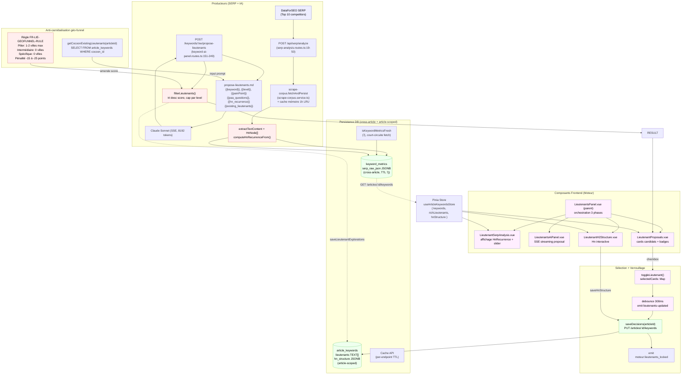

> **Sprint keyword-metrics-decomposition (2026-05-09)** — l'autorité SERP de Lieutenants n'est plus `keyword_metrics.serp_raw_json` mais **`keyword_serp_scrapes.headings`** (table fille dédiée). Cache check : `keyword_serp_results.fetched_at < 7j`. Voir `keyword-serp.service.ts`. Les sections ci-dessous mentionnant `serp_raw_json` reflètent l'état avant refonte.
>
> **Sprint decouplage-lieutenants-lexique (2026-05-09)** — `analyzeSerpCompetitors` est **supprimé**. Le scrape SERP est désormais porté par `scrape-corpus.service.ts` (single producer cross-domaine, cache mémoire 1h LRU module-scoped). Les Lieutenants consomment via `lieutenants-analysis.service.ts` (`proposeLieutenants(keyword, articleLevel)` qui lit headings + paa, **jamais textContent** — cf. AC.LIE-SCRAPE.2). La route `POST /api/serp/analyze` appelle directement `scrape-corpus.fetchAndPersist`. L'IA SSE de proposition Lieutenants reste portée par `keyword-ai-panel.routes.ts:/keywords/:kw/propose-lieutenants` (inchangée).

# Data Flow — lieutenants

> **Description métier :** Flux des mots-clés secondaires (Lieutenants, H2/H3) d'un article — depuis l'extraction des headings récurrents dans le SERP via scraping cross-article, passant par une proposition IA (Claude Sonnet) avec filtre auto post-IA, jusqu'au verrouillage et persistance dans `article_keywords.lieutenants` JSONB + `article_keywords.hn_structure` JSONB. Inclut une règle anti-cannibalisation géo-funnel pour les articles localisés.
> **Type/format :** Pinia store `useArticleKeywordsStore` (cache mémoire) + DB PostgreSQL `article_keywords` (persistance) + composants Vue bimodaux. Trois phases : scraping SERP → IA Sonnet + filtre → sélection + verrouillage.

## Producteurs

Qui crée ou met à jour cette donnée :

- **Endpoint** `POST /api/serp/analyze` ([server/routes/serp-analysis.routes.ts:19-50](../../server/routes/serp-analysis.routes.ts)) — reçoit `{ keyword, articleLevel }`, consulte d'abord `keyword_metrics.serp_raw_json` (cache cross-article, TTL 7j), sinon scrape DataForSEO Top 10 concurrents. Extrait headings H1/H2/H3 via regex, calcule récurrence + pourcentages, retourne `SerpAnalysisResult { competitors[], paaQuestions[], maxScraped, fromCache }`.

- **Service** `scrape-corpus.fetchAndPersist()` ([server/services/external/scrape-corpus.service.ts](../../server/services/external/scrape-corpus.service.ts), post chantier 2) — exécute le scraping en parallèle (Promise.all 10 requêtes HTTP), extrait `headings[]` (Lieutenants), `text_content` (Lexique), `is_blog`, persiste atomiquement dans `keyword_serp_results` + `keyword_serp_scrapes` + `keyword_paa_questions`. Cache mémoire 1h LRU module-scoped (clé `keyword:lang:country`). Le service `lieutenants-analysis.service.proposeLieutenants` consomme `getHeadings` + `getPaaQuestions` (jamais `getTextContent`).

- **Endpoint** `POST /keywords/:keyword/propose-lieutenants` ([server/routes/keyword-ai-panel.routes.ts:151-249](../../server/routes/keyword-ai-panel.routes.ts)) — reçoit `{ level, articleId, serpHeadings, paaQuestions, wordGroups, rootKeywords, serpCompetitors, rootKeywordsSerpData, cocoonSlug }`, forge le prompt `propose-lieutenants.md` (variabilité `{{keyword}}`, `{{level}}`, `{{painPoint}}`, `{{hn_recurrence}}`, `{{paa_questions}}`, `{{existing_lieutenants}}`), appelle Claude Sonnet (SSE, 8192 tokens max), reçoit JSON `ProposeLieutenantsResult { lieutenants[], hnStructure[], contentGapInsights }`, applique le filtre `filterLieutenants()` (cap par level : Pilier 5 / Intermédiaire 5 / Spécifique 4, tri desc score).

- **Service `filterLieutenants()`** ([server/routes/keyword-ai-panel.routes.ts:133-145](../../server/routes/keyword-ai-panel.routes.ts)) — tri descendants par score (null en bas, respecte règle cohérence), partage entre `selectedLieutenants` (topK) et `eliminatedLieutenants` (reste). Utilise `compareScores()` pour placer les null correctement (jamais convertis en 0).

- **Composant frontend** `LieutenantsPanel.vue` ([src/components/moteur/LieutenantsPanel.vue:49-173](../../src/components/moteur/LieutenantsPanel.vue)) — émet `lieutenants-updated` au debounce 300ms, appelle `articleKeywordsStore.saveDecisions(articleId)` pour écrire `{ lieutenants: selectedKeywords[] }` + `{ hnStructure }` dans DB.

- **Anti-cannibalisation check** `getCocoonExistingLieutenants(articleId)` ([server/services/infra/data.service.js](../../server/services/infra/data.service.js)) — requête SQL `SELECT DISTINCT jsonb_array_elements(lieutenants)::TEXT FROM article_keywords WHERE article_id IN (SELECT id FROM articles WHERE cocoon_id = ...)` → liste des lieutenants déjà utilisés dans le cocon, incluse dans le prompt pour l'IA (« INTERDITS »).

## Persistance

**Autorité** : `article_keywords` table PostgreSQL, colonnes `lieutenants TEXT[]` (liste plate de keywords verrouillés) + `hn_structure JSONB` (structure H1→H2→H3 recommandée).

- **Table** `article_keywords(article_id PK)` ([server/db/migrations/001_initial_schema.sql:98-106](../../server/db/migrations/001_initial_schema.sql)) — colonnes créées initialement : `lieutenants TEXT[] DEFAULT '{}'`, `hn_structure JSONB`, `updated_at TIMESTAMPTZ DEFAULT NOW()` + trigger `article_keywords_updated_at`.

- **Extension richLieutenants** — migration 003 ([server/db/migrations/003_keyword_tables.sql](../../server/db/migrations/003_keyword_tables.sql)) ajoute l'overlay `richLieutenants: RichLieutenant[]` au payload `GET /articles/:id/keywords` (JOIN avec IA proposals si existantes), permettant l'affichage détaillé (reasoning, score, sources, status).

- **Endpoint GET** `GET /articles/:id/keywords` ([server/routes/articles.routes.ts](../../server/routes/articles.routes.ts)) — rapatrie `{ capitaine, lieutenants, lexique, rootKeywords, hnStructure, richLieutenants, richCaptain }` via hydratation Pinia `articleKeywordsStore.fetchKeywords(id)` (consultation mémoire sans re-fetch DB si frais).

- **Endpoint PUT** `PUT /articles/:id/keywords` — reçoit `{ capitaine, lieutenants[], lexique[], rootKeywords, hnStructure }`, upserte atomiquement `article_keywords`, retourne payload complet incluant `richLieutenants` hydraté.

- **Pinia store** `useArticleKeywordsStore` ([src/stores/article/article-keywords.store.ts:10-200](../../src/stores/article/article-keywords.store.ts)) — slot unique `keywords: ArticleKeywords | null` par article (fetch + merge pattern), `saveDecisions(articleId)` → `PUT /articles/:id/keywords`, `fetchKeywordsMerge()` → union des listes lieutenants + richLieutenants par keyword (status DB gagne si collision).

> Hiérarchie d'autorité : `article_keywords.lieutenants` (liste flat verrouillés) + `article_keywords.hn_structure` (structure Hn) ← `keyword_metrics.serp_raw_json` (source SERP cross-article) ← composants IA frontend (proposal streaming). Écriture : toujours via `PUT /articles/:id/keywords`.

## Consommateurs

### Affichage (UI)

- **[src/components/moteur/LieutenantsPanel.vue](../../src/components/moteur/LieutenantsPanel.vue)** — composant parent bimodal. Section SERP affiche `HnRecurrenceItem[]` (H2/H3 + count + percent) depuis `computeHnRecurrenceFrom(displayedCompetitors)`. Curseur intelligent (slider 0-100) filtre localement si sous défaut, sinon déclenche re-scan.

- **[src/components/moteur/LieutenantProposals.vue](../../src/components/moteur/LieutenantProposals.vue)** — affichage cards candidats IA (`ProposedLieutenant[]`) avec badges multi-source `[SERP] [PAA] [Groupe]` + pertinence `Fort/Moyen/Faible` + score visuel.

- **[src/components/moteur/LieutenantCard.vue](../../src/components/moteur/LieutenantCard.vue)** — card individuelle : keyword, reasoning, source badges, checkbox toggle, score bar.

- **[src/components/moteur/LieutenantsAiPanel.vue](../../src/components/moteur/LieutenantsAiPanel.vue)** — panel IA contextuel SSE, charge `getArticlePainPoint(articleId)` + `{{painPoint}}` injection dans prompt `propose-lieutenants.md`.

- **[src/components/moteur/LieutenantH2Structure.vue](../../src/components/moteur/LieutenantH2Structure.vue)** — affichage interactif de la structure Hn générée (`ProposeLieutenantsHnNode[]`), éditable (drag-drop H2/H3), sauvegarde atomique `saveHnStructure()` → `PUT /articles/:id` (outline) + store.

- **[src/components/moteur/LieutenantSerpAnalysis.vue](../../src/components/moteur/LieutenantSerpAnalysis.vue)** — tableau `HnRecurrenceItem` avec colonnes Heading / Niveau / Récurrence / Pourcentage. Tabs par keyword si multi-scan.

- **FinalisationPanel.vue** — affichage read-only `Lieutenants sélectionnés: [list]` + Hn structure preview.

### Calcul / tri / filtre / agrégat

- **Filtre IA `filterLieutenants()`** — `compareScores(a.score, b.score)` tri desc, null en bas. Utilise le `score: 0-100` produit par l'IA (critères : pertinence sémantique 30% / PAA Capitaine 25% / Récurrence SERP 20% / Content Gap 15% / Intent alignment 10%).

- **Tri affichage UI** — optionnel par l'utilisateur (A-Z, score desc, source).

- **Calcul sélection intelligente** — composant `LieutenantProposals.vue` pré-coche les top 3-5 au premier rendu via `selectedCards.value = new Map(suggested.slice(0, preCheckedCount))`.

- **Compteur recommandé** — affiche `"Recommandé: 5-8"` pour Pilier, `"3-5"` pour Intermédiaire, `"1-3"` pour Spécifique, via const `MAX_SELECTED` ([server/routes/keyword-ai-panel.routes.ts:125-130](../../server/routes/keyword-ai-panel.routes.ts)).

- **Règle géo-funnel** — mise en œuvre **dans le prompt IA** `propose-lieutenants.md:69-84` (amende -15 à -25 points si détection multiple city + level), pas en post-filtering. L'IA elle-même pénalise les propositions qui violent la règle (Pilier 1-2 villes max, Intermédiaire 0, Spécifique 0).

- **Injection prompt IA** — prompt `propose-lieutenants.md` reçoit `{{painPoint}}` + `{{strategy_context}}` + `{{existing_lieutenants}}` pour contextualiser les propositions via `loadPrompt()`.

> **Règle de cohérence affichage / calcul** — Le score affiché en card (`ProposedLieutenant.score`) ET le score utilisé pour `filterLieutenants()` tri DOIVENT venir du même champ JSON IA. Le tri descend place `null` en bas (jamais 0). À l'affichage, `null` score → badge "—" ou masqué.

## Cas d'usage à risque

| Cas | Lecture | Écriture | Risque de divergence |
|---|---|---|---|
| Premier SERP scan (jamais scraped) | DB miss `keyword_metrics.serp_raw_json` | `/serp/analyze` → `upsertKeywordSerp()` | Faible si fetch atomique (zéro re-call). |
| Reload article (SERP frais ≤7j) | `keyword_metrics.serp_raw_json` hit + cache check | aucune (TTL OK) | Faible — données stables. |
| Sélection rapide Lieutenants (debounce 300ms) | `selectedCards.value` (mémoire Vue) | grouped emit `lieutenants-updated` → `saveDecisions()` → DB | Faible si debounce respecté — une seule write par 300ms. Risque : utilisateur retro-clique avant debounce → l'ancienne sélection persiste en mémoire. |
| Proposition IA re-générée (button "Régénérer") | `iaChunks` (SSE stream) | `/propose-lieutenants` → nouveau JSON IA | **Risque MODÉRÉ** : l'utilisateur avait sélectionné des cards de l'ancienne génération → élimination silencieuse si nouvel IA ne les reproduit pas. Solution : afficher toast "Nouvelles propositions générées, sélection antérieure conservée si match keyword". |
| Multi-scan SERP (article a 3 Capitaines test = 3 keywords) | `serpResultsByKeyword: Map<keyword, SerpAnalysisResult>` (mémoire) | chaque `/serp/analyze` → DB + `serpResultsByKeyword.set(kw, result)` | Modéré — tab active peut devenir stale si re-scan un keyword. Affichage par tab mais DB unique par keyword. |
| Validation finale + lock Lieutenants | `article_keywords.richLieutenants[]` + `article_keywords.hnStructure` (mémoire Pinia) | `saveDecisions()` → upsert `article_keywords` | Faible si locking atomique (emit `moteur:lieutenants_locked` APRÈS DB OK). |
| Restore depuis history (slider à -2h) | `captain_explorations` historique | aucune | **Risque CRITIQUE** : les richLieutenants historiques n'existent que si le snapshot IA a été sauvegardé — sinon l'utilisateur ne voit que `{ keyword, status }` aplati. Solution : ne jamais restaurer sans enrichir richLieutenants depuis `/propose-lieutenants` re-exécuté (coûteux). |
| Merge cache DB + mémoire (user revient après 2h) | `fetchKeywordsMerge()` → union richLieutenants par keyword | aucune | Modéré — merge compare `lockedAt` timestamp, la plus récente gagne. Possible divergence si timestamps asynchrones (DB + local mismatch). |
| Anti-cannibalisation : ajouter Lieutenant déjà dans sibling | Validation IA via `existing_lieutenants` (requête SQL au temps de requête) | `/propose-lieutenants` rejette (pas de proposition) | **Risque MODÉRÉ** : si un sibling a ajouté un lieutenant ENTRE le chargement du composant et le POST /propose-lieutenants, le check anti-cannibal est stale. Solution : re-fetch `existing_lieutenants` au moment du POST. |
| Utilisation Lieutenants en Rédaction (génération article) | `GET /articles/:id/keywords` → `lieutenants[]` injecté dans prompt `generate-outline.md` via `{{secondaryKeywords}}` | aucune (read-only) | Faible — Lieutenants verrouillés avant entrée en Rédaction. |
| Cas géo-funnel (ville dans Capitaine) | Composant affiche les Lieutenants avec détail source + règle (`FR-LIE-GEOFUNNEL-RULE`) | L'IA filtre au score (-15 à -25) | **Risque MODÉRÉ** : la pénalité n'est pas visible — l'utilisateur voit juste un score bas sans comprendre pourquoi. Solution : afficher un badge "Cannibalise géographie" si score diminué pour cette raison. |

## Diagramme

## Régressions historiques

- **Sprint 1 (2026-05-04 — Restauration après C-1)** — Les conteneurs `LieutenantProposals` et `LieutenantH2Structure` avaient été migrés dans `LieutenantsAiPanel` lors de la refonte UX (C-1). Regression : les proposals IA n'étaient pas affichées en temps réel. Rollback : réimportation en tant que containers principaux dans `LieutenantsPanel.vue` (ligne 21-22). Verrouillage architecture ajouté via test unitaire pour éviter future régression.

- **Phase ② (sprint 4 — structure SERP multi-keyword)** — Ajout de `serpResultsByKeyword: Map<string, SerpAnalysisResult>` pour supporter multi-scan (plusieurs Capitaines testés). Avant : un seul `serpResult`, impossible de conserver les données si utilisateur switch Capitaine.

- **Sprint 5 (radar-long-tail)** — Intégration `longTailSuggestions[]` dans `radar_explorations.scan_result`, mais Lieutenants utilise toujours `keyword_metrics.serp_raw_json` isolé (zéro longue traîne Radar dans onglet Lieutenants à cette date).

- **2026-04-28 (score-pertinence)** — Séparation Score Marché / Score Pertinence dans l'IA proposal, mais IA Sonnet `propose-lieutenants.md` ne retourne que `score: 0-100` (pas de breakdown bimodal). Le score IA est agnostique du contexte pain-point / KPI — seule l'IA Capitaine (Sonnet) affiche les 2 scores breakdownés.

- **2026-05-01 (merge pattern)** — Ajout `fetchKeywordsMerge()` pour fusionner cache DB + mémoire locale sans écraser état utilisateur. Avant : `fetchKeywords()` remplaçait tout, l'utilisateur perdait ses sélections locales au reload.

- **2026-05-03 (serp cross-article)** — Migration SERP scraping de table `serp_explorations` (article-scoped) vers `keyword_metrics.serp_raw_json` (cross-article). Invariant **NFR-INT-SERP-ONCE** : une seule requête SERP par mot-clé, même si 5 articles utilisent le keyword. Route `/serp/analyze` check DB (ligne 34-37 `serp-analysis.routes.ts`) avant appel externe.

- **2026-05-05 (KPI nullable — propagation indirecte)** — Lieutenants consomment indirectement les KPIs marché via le scoring du Capitaine et les payloads SERP. Les types upstream (`KeywordOverview`, `LocationMetrics`, `RadarKeywordKpis`, `KeywordAuditResult`) passent à `number | null`. Pas d'impact direct sur les containers Lieutenant (qui ne lisent pas `searchVolume / cpc / kd / competition` directement), mais les scores `marketScore` et `relevanceScore` des Capitaines validés en amont peuvent être `null` — Lieutenants doit gérer ce cas sans masquer l'absence par `0`. Voir FR-INFRA-KPI-NULLABLE.

## Tests de cohérence à écrire

À placer dans `tests/unit/coherence/lieutenants.test.ts` :

1. **`describe('FR-LIE-SERP-ANALYZE — freshness check SERP (TTL 7j)')`** — Vérifier que `POST /api/serp/analyze` consulte `keyword_metrics.serp_raw_json` et ne re-scrape que si stale (> 7j). Cas : simuler DB hit → vérifier `fromCache: true` en réponse ; simuler stale → vérifier appel `analyzeSerpCompetitors()` une seule fois même avec 2 requêtes parallèles.

2. **`describe('FR-LIE-EXTRACT-HEADINGS — HnRecurrenceItem calcul correct')`** — Vérifier que `computeHnRecurrenceFrom(competitors[])` compte occurrences exactes, élimine doublons par concurrent, calcule percents. Cas test : 10 competitors, H2 "SEO Local" dans 8 → expect `{ level: 2, text: "SEO Local", count: 8, total: 10, percent: 80 }`.

3. **`describe('FR-LIE-PROPOSE-AI — filterLieutenants tri score + cap par level')`** — Test `filterLieutenants()` : reçoit `ProposeLieutenantsResult` avec 15 lieutenants (mix scores null/80/60/null), level='pilier'. Expect : `selectedLieutenants.length === 5` (cap Pilier), `eliminatedLieutenants.length === 10`, tri descend score (null en bas). Vérifier `compareScores(null, 60)` < 0 (null < any).

4. **`describe('FR-LIE-GEOFUNNEL-RULE — pénalité anti-cannibalisation géo')`** — Intégration test : appel `/propose-lieutenants` pour Capitaine="création site web Toulouse" (contient ville), level='pilier'. Vérifier que la pénalité -15 à -25 est appliquée aux candidats `"prix site Toulouse"` / `"devis site Toulouse"` (cannibalise). Candidats thématiques `"création site responsive"` / `"agence web Occitanie"` gardent score normal. Cas intermédiaire / spécifique : 0 tolérance, tous les lieutenants `"... Toulouse"` → score < 40 (rejeté par cap).

5. **`describe('FR-LIE-HN-STRUCTURE — saveHnStructure atomique + outline sync')`** — Vérifier que `saveHnStructure()` sauvegarde `hnStructure: ProposeLieutenantsHnNode[]` dans DB ET synchronise avec outline article. Cas : structure avec H1+3 H2+2 H3 → `PUT /articles/:id` produit `outline.sections` avec hiérarchie correcte. Reload → outline reflète la structure.

6. **`it.todo('FR-LIE-CHECKS — emit moteur:lieutenants_locked après verrouillage')`** — Vérifier que le composant émet `check-completed` avec la constante `MOTEUR_LIEUTENANTS_LOCKED` ([shared/constants/workflow-checks.constants.ts](../../shared/constants/workflow-checks.constants.ts)) APRÈS save DB OK. Cas : save rejected → pas d'emit. Save OK → emit + toast.

7. **`describe('FR-MOT-MODE-BIMODAL — Lieutenants en mode libre (Labo)')`** — Composant accepte prop `mode: 'libre'`, article virtuel id=0. `/serp/analyze` fonctionne (utilise cache cross-article), `/propose-lieutenants` fonctionne (aucun `existing_lieutenants` requête car pas de cocoon). Vérifier que `saveDecisions()` est no-op ou retourne erreur gracieuse.

8. **`describe('NFR-INT-SERP-ONCE — multi-article same keyword, single SERP fetch')`** — Scénario : article A valide Capitaine (appel `/serp/analyze` kw="seo local"), puis article B teste même Capitaine (appel `/serp/analyze` kw="seo local"). Vérifier que le deuxième appel lit `keyword_metrics.serp_raw_json` sans re-fetch (mock `scrape-corpus.fetchAndPersist` pour échouer si appelée). DB est source unique.

---

*Document maintenu par la discipline data-flow-discipline. Cf. [README](./README.md).*
