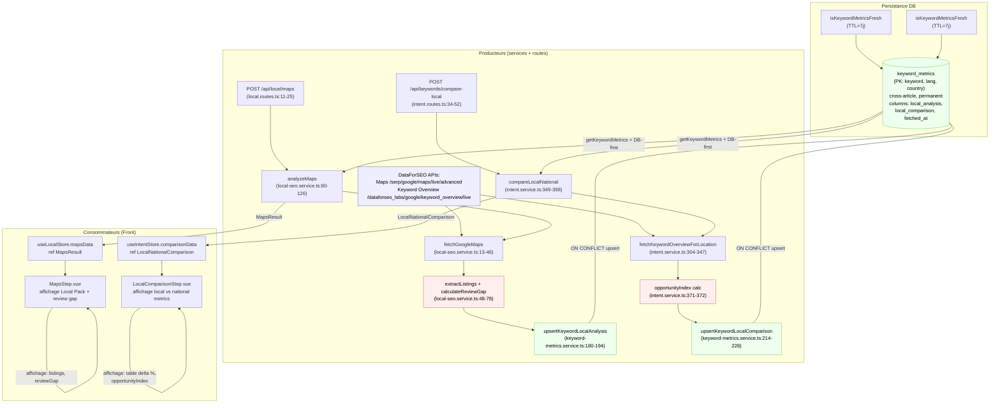

# Data Flow — local

> **Description métier :** Analyse SEO local sur deux axes : (1) Google Maps discovery — détection Local Pack, listings GBP (position, rating, review count, statut claim), calcul du review gap (écart entre mes avis et moyenne compétiteurs) ; (2) comparaison volume de recherche local (région, ville) vs national pour identifier opportunités de prix / concurrence inférieure localement. Cross-article (un mot-clé analysé une fois, partagé). Freshness TTL 7j comme `keyword_metrics`.
> **Type/format :** Deux colonnes JSONB de `keyword_metrics` : `local_analysis` (MapsResult) et `local_comparison` (LocalNationalComparison). Chacune peut être `null` indépendamment. Affichage front : composants `MapsStep.vue` (Explorateur, onglet Local Pack) et `LocalComparisonStep.vue` (onglet Comparaison Local/National). Store front `useLocalStore` cache front, `useIntentStore` pour comparaison.

## Producteurs

Qui crée ou met à jour cette donnée :

- **Endpoint** `POST /api/local/maps` ([server/routes/local.routes.ts:11-25](../../server/routes/local.routes.ts)) — reçoit `{ keyword, locationCode? }`, appelle service `analyzeMaps()`, retourne `{ data: MapsResult }`. Validation Zod basique (keyword obligatoire).
- **Service** `analyzeMaps()` ([server/services/strategy/local-seo.service.ts:80-126](../../server/services/strategy/local-seo.service.ts)) — orchestration : DB-first check, fetch DataForSEO Maps API si miss, extraction listings + calcul review gap, **upsert `upsertKeywordLocalAnalysis()`** ligne 122, retour MapsResult.
- **Endpoint** `POST /api/keywords/compare-local` ([server/routes/intent.routes.ts:34-52](../../server/routes/intent.routes.ts)) — reçoit `{ keyword }`, appelle service `compareLocalNational()`, retourne `{ data: LocalNationalComparison }`.
- **Service** `compareLocalNational()` ([server/services/intent/intent.service.ts:349-398](../../server/services/intent/intent.service.ts)) — orchestration : DB-first check `keyword_metrics.local_comparison` frais, fetch DataForSEO Keyword Overview pour location codes national + local (isSandbox ? code défaut : 2742 national, 1006157 local Île-de-France), calcul `opportunityIndex = (local.volume × (100 - local.KD)) / max(national.KD, 1)`, création alert si seuil dépassé (env `LOCAL_OPPORTUNITY_THRESHOLD` défaut 60), **upsert `upsertKeywordLocalComparison()`** ligne 394, retour LocalNationalComparison.
- **Service DataForSEO integration** — deux endpoints parallèles consommés :
  - `fetchGoogleMaps()` ([local-seo.service.ts:13-46](../../server/services/strategy/local-seo.service.ts)) — appel POST `serp/google/maps/live/advanced` avec `{ keyword, location_code, language_code: 'fr' }`. Retour : payload brut, extraction `result.items[]` (max 20 listings), erreur si `status_code !== 20000`.
  - `fetchKeywordOverviewForLocation()` ([intent.service.ts:304-347](../../server/services/intent/intent.service.ts)) — appel POST `dataforseo_labs/google/keyword_overview/live` avec location codes distincts. Retour : `LocationMetrics { searchVolume, keywordDifficulty, cpc, competition, monthlySearches }`.
- **Persistance** — upserts idempotents via `ON CONFLICT (keyword, lang, country) DO UPDATE ... SET ...`. Patterns : `upsertKeywordLocalAnalysis()` ligne 180-194 et `upsertKeywordLocalComparison()` ligne 214-228 ([keyword-metrics.service.ts](../../server/services/keyword/keyword-metrics.service.ts)).
- **Source donnée GBP** — variable env `MY_GBP_REVIEWS` (défaut '0') stockée côté serveur, utilisée dans `calculateReviewGap()` pour comparer mes avis vs compétiteurs.

## Persistance

**Autorité absolue** : colonnes JSONB de `keyword_metrics` (PostgreSQL, cross-article, permanent, PK = (keyword, lang='fr', country='fr')).

- **Table** `keyword_metrics` — colonnes :
  - `local_analysis JSONB` — contient `MapsResult` : `{ keyword, locationCode, hasLocalPack, listings: [GbpListing], reviewGap: ReviewGap, cachedAt }`. `null` si jamais analysé ou fetch échoué.
  - `local_comparison JSONB` — contient `LocalNationalComparison` : `{ keyword, local: LocationMetrics, national: LocationMetrics, opportunityIndex, alert?, cachedAt }`. `null` si jamais comparé.
  - Colonne `fetched_at` partagée — mise à jour atomiquement lors de tout upsert local (ligne 191, 224 des services).
- **Migration** `012_keyword_metrics_extend.sql` ([server/db/migrations/012_keyword_metrics_extend.sql:8-10](../../server/db/migrations/012_keyword_metrics_extend.sql)) — ajout des deux colonnes en Sprint 15.5.
- **Pattern UPSERT** — identique à `keyword_metrics.content_gap_analysis` ou `serp_raw_json` : `ON CONFLICT … DO UPDATE SET local_analysis = EXCLUDED.local_analysis, fetched_at = NOW()` (coalesce non appliqué pour local_analysis/local_comparison, remplacé entièrement à chaque fetch).
- **Freshness check** — `isKeywordMetricsFresh(fetchedAt, ttlDays=7)` ([keyword-metrics.service.ts:250-254](../../server/services/keyword/keyword-metrics.service.ts)) — retourne `false` si `null` ou > 7j. Les deux services (`analyzeMaps`, `compareLocalNational`) consultent la DB en premier ; si data frais trouvée, court-circuite appels DataForSEO.

Hiérarchie logique de cache :
```
keyword_metrics.{local_analysis, local_comparison} (permanent, cross-article, TTL 7j)
    ↓ (si miss ou stale)
DataForSEO Maps API / Keyword Overview API
    ↓ (fetch OK)
upsert → keyword_metrics
```

**Côté front Pinia** :
- `useLocalStore` ([src/stores/external/local.store.ts](../../src/stores/external/local.store.ts)) — ref `mapsData: MapsResult | null`, actions `analyzeMaps()` (appel `apiPost('/local/maps')`), `scoreContent()` (locale anchoring non lié à cette donnée), `loadEntities()`. Pas de cache front autonome de `keyword_metrics`.
- `useIntentStore` ([src/stores/keyword/intent.store.ts](../../src/stores/keyword/intent.store.ts)) — ref `comparisonData: LocalNationalComparison | null`, action `compareLocalNational()` (appel `apiPost('/keywords/compare-local')`), cache optionnel par keyword dans `localComparisons: Map<string, LocalNationalComparison>` (Epic 23 — Keyword Switcher, cap 50 entries).

## Consommateurs

### Affichage (UI)

- **[src/components/local/MapsStep.vue:68-172](../../src/components/local/MapsStep.vue)** — affichage `localStore.mapsData` :
  - Badges (Local Pack present/absent, listing count) ligne 70-81.
  - Table listings (position, title, category, rating, votesCount, isClaimed, address) ligne 84-136. Liens cliquables vers GBP listings. Highlight rangée unclaimed (fond jaune).
  - Review gap section (ScoreGauge + progress bar) ligne 139-160 : affiche `myReviews`, `averageCompetitorReviews`, `gap`, couleur dynamique (vert ≥80%, ambre ≥50%, rouge <50%), objectif texte.
  - Cache info (date de cachedAt) ligne 162-164.
- **[src/components/intent/LocalComparisonStep.vue:111-199](../../src/components/intent/LocalComparisonStep.vue)** — affichage `intentStore.comparisonData` :
  - Table 4 colonnes (Métrique, Toulouse local, France national, Delta %) ligne 146-166 : metrics = [Volume, KD, CPC, Competition].
  - Calcul delta % local vs national, code CSS `delta-advantage` (vert) si local KD/CPC/Compet < national (inv pour Volume) ligne 83-96.
  - Alert banner (emoji sparticle si opportunity, warning icone si warning) ligne 134-142.
  - Opportunity Index gauge (ScoreGauge + barre de progression) ligne 172 : affiche `opportunityIndex` (seuil env 60).
  - Cache info ligne 189-191.
- **No-data state** (MapsStep + LocalComparisonStep) — « Aucune donnée locale » si result null/error, hint « essayez un mot-clé à dimension locale ».

### Calcul / tri / filtre / agrégat

- **LocalComparisonStep calc** — delta calcul ligne 44-46 (Volume), 54-56 (KD), 64-66 (CPC), 74-76 (Competition). Logique : `(local - national) / national * 100`, pas de tri sur cette donnée (affichage tableau statique).
- **MapsStep calc** — review gap percent (ligne 26-32) : ratio `myReviews / avgCompetitorReviews * 100`, couleur dynamique. Pas d'agrégats ni de tri.
- **useIntentStore caching** — `localComparisons Map` peuplée lors de `compareLocalNational()` (ligne 84, intent.store.ts), utilisée par Keyword Switcher (Epic 23) pour éviter re-fetch lors de switch rapide keyword.
- **Injection prompt IA** — pas d'injection directe de `local_analysis` ou `local_comparison` dans prompts actuels. Potentiel futur pour raffiner intent classification ou contenu rédaction basé sur dimension locale.

> **Règle de cohérence affichage / calcul** — Les colonnes `myReviews`, `averageCompetitorReviews`, `gap`, `opportunityIndex` affichées dans les panels doivent provenir EXACTEMENT du même objet `reviewGap` et `comparisonData` lus du store. Pas de fallback différent : si `mapsData.reviewGap = null` à l'affichage, la section review gap ne s'affiche pas (ne pas montrer « — » à l'affichage et 0 au calcul). Test requis.

## Cas d'usage à risque

| Cas | Lecture | Écriture | Risque de divergence |
|---|---|---|---|
| Premier scan Maps (mot-clé jamais vu) | `getKeywordMetrics()` miss → null | `POST /api/local/maps` → fetch DataForSEO → `upsertKeywordLocalAnalysis()` → DB | Faible si fetch + upsert atomiques. |
| Reload (cache frais, <7j) | `getKeywordMetrics()` hit + `isKeywordMetricsFresh()` = true | aucune (court-circuit fetch) | Faible — affichage stable si DB row cohérent. |
| Switch d'onglet Explorateur (Phase ① Maps → Phase ① Comparaison Local/Nat) | `mapsData` en mémoire store front / `comparisonData` en mémoire store front | aucune sur DB | Faible — données en mémoire Pinia. |
| Multi-article cross-keyword (article A test Maps + article B teste même mot-clé) | Deux appels parallèles `POST /api/local/maps` pour `keyword='plombier'` | Deux `upsertKeywordLocalAnalysis()` sur même PK → ON CONFLICT choisit winner (dernier timestamp) | Modéré si timestamps précis. Rare en pratique (usager n'ouvre pas 2 articles en parallèle à cette étape). |
| Cache stale (> 7j) + re-test Maps | `getKeywordMetrics()` hit mais `isKeywordMetricsFresh()` = false | `analyzeMaps()` détecte stale, refetch DataForSEO, upsert | Faible si logique freshness correcte. |
| Refresh navigateur (F5) | Re-hydratation depuis store Pinia vide → pas de data front | aucune (store init empty) | Modéré si utilisateur re-clique « Analyser Maps ». Acceptable UX (loading spinner). |
| LocalComparisonStep delta = 0 (local ≈ national) | Affichage « +0% » (delta-neutral CSS) | aucune (calcul local au composant) | Faible — display-only. |
| OpportunityAlert absent (opportunityIndex < 60, alert = null) | Banner ne s'affiche pas (template v-if) | aucune | Faible. |
| Keyword sans dimension locale (ex: « typescript ») | Fetch Maps retourne `items[]` vide (pas de Local Pack) | `hasLocalPack = false`, listings = [], `reviewGap` calculé sur compétiteurs vides → myReviews comparez à 0 | **Risque MODÉRÉ** : review gap affichage peut être confus (« gap: NaN » ou 0). Doit tester et gérer gracieusement. Affichage alternative : « Pas de Local Pack pour ce mot-clé ». |
| Env var `MY_GBP_REVIEWS` pas défini ou invalide | `parseInt(process.env.MY_GBP_REVIEWS ?? '0', 10)` → fallback 0 | `calculateReviewGap()` lit 0 comme myReviews | Comportement défini. À documenter dans setup (env.example). |
| Limit DataForSEO dépassée (quota Maps/Keyword Overview) | Fetch retourne 40x ou 5xx error | Service catch → log.error, throw → endpoint retour 500 | **Risque CRITIQUE** : utilisateur voit erreur, action impossible. Solution : monitorer quota, alerter avant limite, fallback gracieux ou rate-limit côté client. Couvrir en tests. |

## Diagramme



## Régressions historiques

- **Sprint 15.5 (2026-05-02)** — Création colonnes `local_analysis` + `local_comparison` sur `keyword_metrics` au lieu de tables article-scoped `local_explorations` / `local_comparison_explorations`. Perte traçabilité article↔keyword acceptable (reconstructible via `article_keywords`).
- **Sprint 15.5 (2026-05-02)** — `upsertKeywordLocalAnalysis()` remplace `upsert_local_analysis()` article-scoped. Signature change : paramètres `(keyword, analysis, lang?, country?)` au lieu de `(articleId, keyword, analysis)`.
- **Sprint 15.5 (2026-05-04)** — `calculateReviewGap()` utilise env var `MY_GBP_REVIEWS` côté serveur, pas stockée en DB. À documenter dans env.example.
- **Aucun** — Pas encore de changement formule `opportunityIndex` depuis implémentation (formule stable : `(local.volume × (100 - local.KD)) / max(national.KD, 1)`).

## Tests de cohérence à écrire

À placer dans `tests/unit/coherence/local.test.ts` :

1. **`describe('FR-EXP-MAPS — cohérence affichage / calcul review gap')`** — vérifie que la valeur affichée dans MapsStep (`reviewGap.myReviews`, `gap`, `percent`) est exactement celle calculée par `calculateReviewGap()`. Cas : maps data avec listings variées (some with null rating), `MY_GBP_REVIEWS` env = '5', vérifier `gap = avgCompetitorReviews - 5`, et `gapPercent = min(100, round(5 / avgCompetitorReviews * 100))`.

2. **`describe('FR-EXP-LOCAL-COMPARE — cohérence affichage / delta calc')`** — table delta % affiche valeur exacte de `((local - national) / national * 100)` pour chaque métrique (Volume, KD, CPC, Competition). Cas : national = 1000, local = 800 → delta = -20%, affichage CSS `delta-advantage` (green). Tester inversion logique pour chaque métrique (KD/CPC baisses = avantage, Volume = neutre).

3. **`describe('FR-EXP-LOCAL-COMPARE — cohérence null / absent')`** — si `comparisonData = null` (pas de comparaison encore lancée), section ne s'affiche pas (v-if). Si error, ErrorMessage composant. Pas de fallback numérique silencieux.

4. **`describe('FR-EXP-MAPS — freshness check DB avant DataForSEO fetch')`** — mock `getKeywordMetrics()` pour retourner data frais `local_analysis` ; appel `analyzeMaps()` doit court-circuiter fetch (vérifier `isKeywordMetricsFresh()` = true, fetched_at < 7j). Simuler fetch rate-limit ou timeout, vérifier qu'il ne s'exécute pas.

5. **`describe('FR-EXP-MAPS — graceful handling keyword sans Local Pack')`** — keyword = 'typescript', DataForSEO retourne `items[]` vide. `hasLocalPack = false`, `listings = []`, `reviewGap` calc sur 0 compétiteurs → `avgReviews = 0`, `gap = max(0, 0 - myReviews)` (négatif, donc 0). Vérifier affichage « Local Pack absent » badge, table vide ou hidden, pas « NaN » gap.

6. **`it.todo('opportunityIndex threshold (env LOCAL_OPPORTUNITY_THRESHOLD=60)')`** — si `opportunityIndex >= 60`, alert créée avec type 'opportunity'. Tester boundary (59 → no alert, 60 → alert).

7. **`it.todo('reload restaure même MapsResult / LocalNationalComparison que premier load')`** — deux appels `analyzeMaps(keyword)` / `compareLocalNational(keyword)` : premier fetch, deuxième hit DB. Vérifier résultats identiques.

8. **`it.todo('multi-article cross-keyword : ON CONFLICT upsert winner')`** — articles A et B appellent `upsertKeywordLocalAnalysis('seo')` quasi-simultanés. Vérifier que DB stocke une seule row, timestamp le plus récent gagne.

---

*Document maintenu par la discipline data-flow-discipline. Cf. [README](./README.md) et [keyword-metrics.md](./keyword-metrics.md) (autorité sur colonnes JSONB partagées).*
