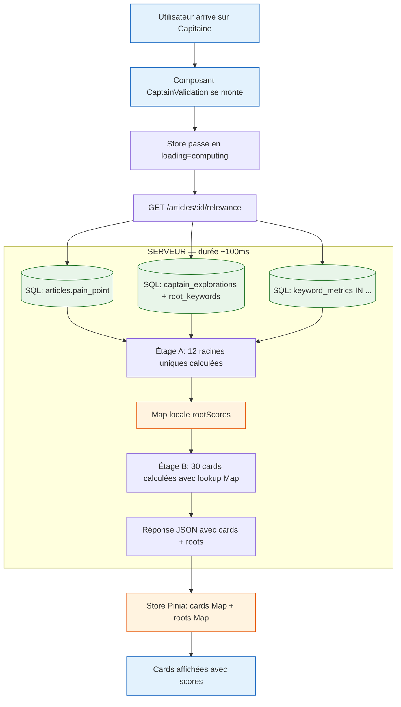

# Score Pertinence — calcul à la volée et règles de persistance

> **Statut** : doc de référence figeant le comportement décidé en session 2026-05-05.
> **Public cible** : tout développeur qui touche aux scores Marché / Pertinence, aux racines (`root_keywords`), au snapshot `radar_explorations.scan_result`, ou à l'hydratation de l'onglet Capitaine.
> **À lire avant** : [scoring-kpi-vs-relevance.md](../scoring-kpi-vs-relevance.md) (composition des deux scores), [radar-card-component.md](../radar-card-component.md) (anatomie composants).

---

## TL;DR

| Donnée | Calculée où | Persistée ? | Vit où ? |
|---|---|---|---|
| **Score Marché** (`marketScore`) | Front, à chaque rendu | ❌ Jamais | Recalculé depuis `keyword_metrics` |
| **Score Pertinence** (`relevanceScore`) | Back, à chaque hydratation onglet Capitaine | ❌ Jamais | Map locale serveur (~100ms) puis Store Pinia front (session) |
| **Tableau `root_keywords`** | Front via `extractRoots()` (linéaire) ou retourné par l'IA pour longue-traîne | ✅ Oui, dès l'**entrée** d'un keyword dans `captain_explorations` | DB PostgreSQL |
| **Snapshot `radar_explorations.scan_result.cards[].relevanceScore`** | (à supprimer — voir §6) | ❌ Sera retiré | — |

**Règle d'or** : le Score Pertinence dépend du triplet `(keyword, painPoint, article)`. Le `keyword` peut changer (l'utilisateur explore un nouveau mot-clé) et l'`article` peut changer (switch d'article). En revanche, depuis le Sprint 10.5 (FR-PAIN-IMMUTABLE-AFTER-CEREVEAU), le `painPoint` est **figé après la sortie du Cerveau** — il ne change plus en cours de workflow Moteur/Rédaction. Le calcul reste **à la volée** à chaque hydratation de l'onglet Capitaine pour garder une architecture stateless côté Pertinence et accommoder les deux autres dimensions du triplet.

**Note Sprint 10.5 (2026-05-06)** : avant cette date, un watcher dans `CaptainValidation.vue` détectait les changements live de `painPoint` et déclenchait un recompute via le store dédié `captain-relevance.store.ts`. Cette logique a été supprimée — `painPoint` ne change plus en session, donc le watcher n'avait plus de raison d'exister. Le store frontend `captain-relevance` a été supprimé en conséquence (FR-CAP-RELEVANCE-STORE-REMOVED). Le calcul backend (`captain-relevance.service.ts`) reste inchangé.

---

## 1. Pourquoi cette architecture

### Le bug d'origine (avant 2026-05-05)

Au reload de l'onglet Capitaine, certaines cards affichaient `—` avec un tooltip *"signaux SERP nuls, recalcule"*. Pourtant le painPoint était bien défini en DB. Diagnostic :

1. Le scan Radar persistait `relevanceScore` dans `radar_explorations.scan_result.cards[].relevanceScore`.
2. Au reload, `getCaptainExplorations()` faisait un lookup dans ce snapshot pour rapatrier le score.
3. Si le keyword n'avait jamais été scanné Radar (saisie manuelle, longue-traîne IA) **OU** si le painPoint avait été modifié après le scan → lookup vide → `null` → tooltip trompeur.

### La règle qui élimine ce bug

> **Le Score Pertinence n'a aucune raison d'être persisté.** Il est dérivé d'un calcul rapide (sub-1ms par keyword en mode lexical) à partir d'inputs qui SONT en DB (painPoint, PAA, autocompletes, intent). Le recalculer à chaque hydratation garantit qu'il reflète toujours l'état actuel des inputs.

### Conséquence en cascade

- Le scan Radar **arrête** de calculer et persister `relevanceScore`. Le scan Radar ne s'occupe plus QUE du Score Marché.
- L'onglet Capitaine devient le **lieu unique** du calcul Pertinence — cohérent avec le fait qu'il en est aussi le seul lieu d'affichage.

### Conséquence sur les `root_keywords`

Le signal 4 du Score Pertinence (Racines) a besoin du tableau des racines pour faire la moyenne des scores. Si on calcule la Pertinence à chaque hydratation, on a besoin que ce tableau soit **toujours disponible** au moment du calcul.

→ **Règle** : `root_keywords` est persisté en DB **dès qu'un keyword entre dans `captain_explorations`**, jamais plus tard. Aujourd'hui c'est l'inverse (persistance au verrouillage), ce qui causait des incohérences. Voir §5.

---

## 2. Schéma du calcul à la volée — phase d'hydratation

```
╔═══════════════════════════════════════════════════════════════════════════════╗
║          UTILISATEUR ARRIVE SUR L'ONGLET CAPITAINE (ou fait F5)               ║
╚═══════════════════════════════════════════════════════════════════════════════╝
                                       │
                                       ▼
┌───────────────────────────────────────────────────────────────────────────────┐
│ NAVIGATEUR (Vue + Pinia)                                                      │
│                                                                               │
│  CaptainValidation.vue mount                                                  │
│       │                                                                       │
│       ▼                                                                       │
│  store.loading = 'computing'                                                  │
│  AFFICHAGE LOADER ─────────────────────────────────────────┐                  │
│       │                                                    │                  │
│       └─► fetch GET /articles/:id/relevance                │                  │
└─────────────────────────────────┬─────────────────────────│──────────────────┘
                                  │                          │
                                  ▼                          │
┌───────────────────────────────────────────────────────────────────────────────┐
│ SERVEUR — handler de la requête HTTP                                          │
│ (durée totale : ~100ms — Map locale vit pendant cette durée seulement)        │
│                                                                               │
│ ┌──────── PHASE 1 : LECTURE DB (3 requêtes SQL en parallèle) ──────────────┐  │
│ │                                                                          │  │
│ │ SQL 1 : SELECT pain_point FROM articles WHERE id = ?                     │  │
│ │ SQL 2 : SELECT keyword, root_keywords, status                            │  │
│ │           FROM captain_explorations WHERE article_id = ?                 │  │
│ │ SQL 3 : SELECT keyword, paa_questions, autocomplete_suggestions,         │  │
│ │           intent_raw, search_volume, keyword_difficulty, cpc             │  │
│ │           FROM keyword_metrics                                           │  │
│ │           WHERE keyword IN (tous_les_keywords + toutes_les_racines)      │  │
│ │                                                                          │  │
│ │ → Charge en mémoire : painPoint, 30 keywords, leurs racines, métriques   │  │
│ └──────────────────────────────────────────────────────────────────────────┘  │
│                                  │                                            │
│                                  ▼                                            │
│ ┌──────── PHASE 2 : CALCUL — ÉTAGE A : Racines uniques ────────────────────┐  │
│ │                                                                          │  │
│ │ const allRoots = new Set()                                               │  │
│ │ for (const kw of keywords) {                                             │  │
│ │   for (const root of kw.rootKeywords) allRoots.add(root)                 │  │
│ │ }                                                                        │  │
│ │ // Exemple : 30 cards × 1.5 racines = 45 occurrences                     │  │
│ │ // après dédoublonnage → 12 racines uniques                              │  │
│ │                                                                          │  │
│ │ const rootScores = new Map()  ← LA "PALETTE DU PEINTRE"                  │  │
│ │ for (const root of allRoots) {                                           │  │
│ │   const metrics = metricsByKeyword.get(root)                             │  │
│ │   const signals = computeSignals(root, painPoint, metrics)               │  │
│ │   //         signal 1: Pain × Mot-clé      (lexical)                    │  │
│ │   //         signal 2: PAA × Douleur       (lexical)                    │  │
│ │   //         signal 3: AC × Douleur        (lexical)                    │  │
│ │   //         signal 4: Racines             → 0 (pas de récursion)       │  │
│ │   //         signal 5: Intent × Douleur    (matrice fixe)               │  │
│ │   const score = computeRelevanceScore(signals)                           │  │
│ │   rootScores.set(root, score)                                            │  │
│ │ }                                                                        │  │
│ │ // 12 calculs lexicaux × ~1ms = 12ms                                     │  │
│ └──────────────────────────────────────────────────────────────────────────┘  │
│                                  │                                            │
│                                  ▼                                            │
│ ┌──────── PHASE 2 : CALCUL — ÉTAGE B : Cards complètes ────────────────────┐  │
│ │                                                                          │  │
│ │ const cardScores = []                                                    │  │
│ │ for (const kw of keywords) {                                             │  │
│ │   const metrics = metricsByKeyword.get(kw.keyword)                       │  │
│ │   const signals = computeSignals(kw.keyword, painPoint, metrics)         │  │
│ │   //         signal 1, 2, 3, 5 : pareil que ci-dessus                   │  │
│ │   //         signal 4 : moyenne des rootScores LUE dans la Map           │  │
│ │   const myRootScores = kw.rootKeywords                                   │  │
│ │     .map(r => rootScores.get(r).total)                                   │  │
│ │   signals.rootsAverageScore = averageScores(myRootScores)                │  │
│ │   const score = computeRelevanceScore(signals)                           │  │
│ │   cardScores.push({ keyword, score, breakdown, rootKeywords })           │  │
│ │ }                                                                        │  │
│ │ // 30 calculs lexicaux × ~1ms = 30ms                                     │  │
│ └──────────────────────────────────────────────────────────────────────────┘  │
│                                  │                                            │
│                                  ▼                                            │
│ ┌──────── PHASE 3 : RÉPONSE ───────────────────────────────────────────────┐  │
│ │ res.json({                                                               │  │
│ │   cards: cardScores,                                                     │  │
│ │   roots: Array.from(rootScores),  ← envoyés aussi pour side panel       │  │
│ │   computedAt: Date.now(),                                                │  │
│ │   painPointSnapshot: painPoint                                           │  │
│ │ })                                                                       │  │
│ │                                                                          │  │
│ │ ⏷ La fonction se termine → rootScores Map et tout est garbage-collecté.  │  │
│ └──────────────────────────────────────────────────────────────────────────┘  │
└───────────────────────────────────┬───────────────────────────────────────────┘
                                    │
                                    ▼
┌───────────────────────────────────────────────────────────────────────────────┐
│ NAVIGATEUR (suite)                                                            │
│                                                                               │
│  Réponse JSON arrive ──────────────────────────────────────────────────────►  │
│       │                                                                       │
│       ▼                                                                       │
│  store.cards = Map des 30 cards avec leurs scores+breakdown+rootKeywords      │
│  store.roots = Map des 12 racines avec leurs scores                           │
│  store.painPointSnapshot = painPoint                                          │
│  store.computedAt = Date                                                      │
│  store.loading = 'ready'                                                      │
│       │                                                                       │
│       ▼                                                                       │
│  LOADER DISPARAÎT, CARDS S'AFFICHENT                                          │
│                                                                               │
│  RadarKeywordCard lit store.cards.get(keyword)                                │
│   → affiche score.total, score-ring, tooltip avec breakdown                   │
│                                                                               │
│  Side panel d'une card → lit store.roots pour afficher les scores des         │
│   racines individuelles                                                       │
│                                                                               │
└───────────────────────────────────────────────────────────────────────────────┘
```

---

## 3. Schéma — ajout d'un keyword à la volée

```
╔═══════════════════════════════════════════════════════════════════════════════╗
║          CAS SPÉCIAL : ajout d'un keyword à la volée                          ║
╚═══════════════════════════════════════════════════════════════════════════════╝
                                    │
                                    ▼
   utilisateur tape un keyword dans l'input Capitaine
                                    │
                                    ▼
┌───────────────────────────────────────────────────────────────────────────────┐
│ NAVIGATEUR                                                                    │
│                                                                               │
│  store.addingKeyword = true (mini-loader sur la card seulement)               │
│  fetch POST /articles/:id/relevance/compute  body: { keyword: newKw }         │
└────────────────────────────────────┬──────────────────────────────────────────┘
                                     ▼
┌───────────────────────────────────────────────────────────────────────────────┐
│ SERVEUR                                                                       │
│                                                                               │
│  1. INSERT INTO captain_explorations (..., root_keywords) VALUES (...,        │
│       extractRoots(newKw))      ← persistance des racines DÈS L'ENTRÉE        │
│  2. Calculer le score Pertinence pour newKw + ses racines (idem schéma)       │
│  3. Réponse : { newCard, newRoots: [...] }                                    │
└────────────────────────────────────┬──────────────────────────────────────────┘
                                     ▼
┌───────────────────────────────────────────────────────────────────────────────┐
│ NAVIGATEUR                                                                    │
│                                                                               │
│  store.cards.set(newKw, response.newCard)                                     │
│  for (const root of response.newRoots) {                                      │
│    if (!store.roots.has(root.keyword)) store.roots.set(root.keyword, root)    │
│  }                                                                            │
│  store.addingKeyword = false                                                  │
│                                                                               │
│  Vue.js réactif → la nouvelle card apparaît à l'écran                         │
│                                                                               │
└───────────────────────────────────────────────────────────────────────────────┘
```

---

## 4. Lieux de stockage — qui détient quoi à chaque instant

| Phase | DB PostgreSQL | Map locale serveur | Store Pinia front |
|---|---|---|---|
| Avant la requête | ✅ Tout (painPoint, keywords, racines, métriques) | ❌ N'existe pas | ❌ Vide (F5) |
| Phase 1 (lecture SQL) | ✅ Lue, intacte | ⏳ Pas encore créée | ❌ Toujours vide |
| Phase 2A (calcul racines) | ✅ Inchangée | ✅ Se remplit (12 racines) | ❌ Toujours vide |
| Phase 2B (calcul cards) | ✅ Inchangée | ✅ Lue pour signal 4 | ❌ Toujours vide |
| Phase 3 (réponse) | ✅ Inchangée | 🗑️ Détruite | ✅ Reçoit les scores |
| Affichage | ✅ Inchangée | ❌ N'existe plus | ✅ Lu par les composants |

→ **La DB n'est JAMAIS écrite pour les scores Pertinence.** Les seules écritures DB sont au moment de l'entrée d'un keyword dans `captain_explorations` (ajout via input ou import depuis Radar), pour persister son tableau `root_keywords`.

---

## 5. Règles sur `root_keywords`

### Règle 5.1 — Persistance dès l'entrée

Les racines d'un keyword Capitaine sont calculées et persistées en DB **dès que le keyword entre dans `captain_explorations`**, jamais à la validation/verrouillage.

**Portes d'entrée** (toutes doivent persister `root_keywords`) :

| Porte | Trigger UI | Source des racines | Persistance |
|---|---|---|---|
| Envoi depuis Radar | Cocher cards + "Envoyer au Capitaine" | `extractRoots()` linéaire au moment de l'envoi | INSERT `captain_explorations` avec `root_keywords` rempli |
| Input manuel Capitaine | Tape un keyword + valide | `extractRoots()` linéaire | Idem |
| Acceptation longue-traîne IA | Clique "Accepter" sur suggestion IA | Si l'IA retourne les racines : utiliser. Sinon `extractRoots()` fallback | Idem |

### Règle 5.2 — Lecture pour le calcul Pertinence

Au calcul Pertinence (signal 4 — Racines), le serveur **lit** `captain_explorations.root_keywords`. Si le tableau est vide ou absent (cas dégradé), il fait `extractRoots(keyword)` à la volée comme fallback.

### Règle 5.3 — Aucune nouvelle écriture par le calcul Pertinence

Le calcul Pertinence ne touche JAMAIS la DB. Pas de `INSERT`, pas d'`UPDATE`. Lecture seule.

### Règle 5.4 — Algorithme d'extraction — linéaire par construction

`extractRoots(keyword)` = troncature progressive depuis la fin, max 5 racines, minimum 2 mots significatifs (non-stopwords).

**Exemple pour `cours piano intermédiaire paris`** : `["cours piano intermédiaire", "cours piano"]`.

Choix assumé :
- ✅ Simple, déterministe, sub-1ms.
- ✅ Aligné avec le comportement SEO (les internautes ajoutent des mots à la fin pour affiner).
- ❌ Ne gère pas les racines combinatoires non-tronquées (ex: `formation piano débutant adulte paris` → `["cours adulte", "formation piano"]`). C'est un compromis assumé.

**Pour évoluer** vers une extraction sémantique (LLM), créer une nouvelle tech-spec dédiée. La FR `FR-CAP-RELEVANCE-LINEAR-ROOTS` verrouille ce choix actuel.

### Règle 5.5 — Triggers qui ne créent pas de racines

| Action | Crée des racines en DB ? |
|---|---|
| Verrouiller un Capitaine | ❌ Non — les racines existent déjà |
| Cliquer sur un mot d'une card pour explorer | ❌ Non — juste un toggle d'index local |
| Recompute Pertinence (bouton manuel) | ❌ Non — recalcul du score, pas des racines |
| Reload onglet Capitaine | ❌ Non — lecture seule |
| Trier la liste | ❌ Non |

---

## 6. Suppression du `relevanceScore` dans le snapshot Radar

### Avant (état actuel)

Le service `keyword-radar.service.ts` calcule `relevanceScore` pour chaque card lors d'un scan Radar et l'inclut dans le snapshot `radar_explorations.scan_result.cards[]`. `getCaptainExplorations()` lit ensuite ce snapshot pour rapatrier les scores au reload.

### Après (cible)

- `keyword-radar.service.ts` **arrête** de calculer `relevanceScore`. Il ne calcule plus que `marketScore`.
- Le snapshot `radar_explorations.scan_result.cards[]` **ne contient plus** le champ `relevanceScore`. Les anciennes lignes en DB peuvent encore le contenir (pas de migration destructive) — le code de lecture les **ignore**.
- `getCaptainExplorations()` **arrête** de lire `relevanceScore` depuis le snapshot. Il fait son propre calcul à la volée (architecture §2).

### Tolérance aux anciennes lignes

Aucune migration SQL n'est nécessaire. Le snapshot reste valide structurellement, le champ `relevanceScore` est juste ignoré au reload. Si un jour on veut nettoyer, ce sera une migration séparée (non bloquante).

---

## 7. Mémoïsation — la "palette du peintre"

### Principe

Pendant le calcul d'une requête HTTP, le serveur garde une `Map<rootKeyword, RelevanceScoreResult>` en mémoire pour éviter de recalculer une racine partagée par plusieurs cards.

**Exemple concret** : 30 cards Capitaine, dont beaucoup ont `cours piano` comme racine. Sans mémoïsation : `cours piano` calculé 15 fois. Avec mémoïsation : 1 fois, puis lu dans la Map à chaque besoin.

### Vie de la Map

| Instant | État de la Map |
|---|---|
| T = 0ms (requête arrive) | `new Map()` |
| T = 5-50ms (étage A : racines uniques) | Se remplit progressivement |
| T = 50-100ms (étage B : cards) | Lue, jamais modifiée |
| T = 100ms (réponse envoyée) | Garbage-collectée |

### Ce que la Map N'EST PAS

- ❌ Pas un cache TTL (`api_cache`).
- ❌ Pas persistée en DB.
- ❌ Pas un store Pinia front.
- ❌ Pas un localStorage.

C'est **juste une variable JavaScript locale** dans une fonction, libérée par le garbage collector quand la fonction termine.

### Map serveur vs Store front — la VRAIE différence

| Aspect | Map locale serveur | Store Pinia front |
|---|---|---|
| Où | RAM serveur Node.js | RAM navigateur du client |
| Vit combien de temps | ~100ms (durée d'une requête HTTP) | Toute la session, jusqu'au F5 |
| Pour quoi | Éviter de recalculer une racine deux fois pendant **un calcul** | Garder les scores affichés à l'écran et permettre les interactions (tri, filtre, ajout) |
| Visible par l'utilisateur | Non, c'est interne au calcul | Oui, c'est ce que les composants Vue lisent |

**Analogie** : la Map est la **palette du peintre** pendant qu'il peint. Le Store est le **tableau accroché au mur** dans la galerie. Le tableau ne contient pas la palette. La palette n'existe que pendant la création du tableau. Tu ne peux pas avoir le tableau sans la palette, mais ce sont deux choses différentes à deux moments différents.

---

## 8. Tooltip honnête — causes typées

Aujourd'hui, le frontend devine la cause de `relevanceScore = null` avec 3 hypothèses (`no-pain` / `long-tail` / `no-signals`). C'est trompeur dans plusieurs cas.

### Cible — le backend renvoie la cause typée

Nouveau champ optionnel dans la réponse :

```ts
interface RelevanceScoreResponse {
  total: number | null
  breakdown?: RelevanceScoreBreakdown
  unavailableReason?: 'no-pain' | 'long-tail' | 'missing-paa' | 'missing-autocomplete' | null
}
```

| Cause | Quand | Message UI |
|---|---|---|
| `no-pain` | `painPoint` absent ou < 10 chars | *"Définis un point de douleur sur l'article"* |
| `long-tail` | `kpis === null` | *"Score non applicable (longue-traîne)"* |
| `missing-paa` | painPoint OK mais `paa_questions` vides en DB pour ce keyword | *"Pas de PAA disponible — relance un scan Radar pour ce keyword"* |
| `missing-autocomplete` | painPoint OK mais `autocomplete_suggestions` vides | *"Pas d'autocomplete — relance un scan Radar"* |
| `null` (champ absent) | Score présent | (pas affiché) |

### Logs serveur

Quand le backend retourne `null`, il logge la cause :

```
log.info('[Capitaine] relevanceScore null', {
  articleId,
  keyword,
  reason: 'missing-paa'
})
```

Pour traçabilité en production.

---

## 9. Cas d'usage à risque

| Cas | Comportement attendu |
|---|---|
| Premier load article | Calcul à la volée, scores affichés |
| Reload (F5) onglet Capitaine | Recalcul complet, scores cohérents avec painPoint actuel |
| Changement de painPoint en cours de session | Détecté au mount, déclenche un recalcul global du store |
| Ajout d'un keyword via input | Endpoint dédié, INSERT DB avec `root_keywords` + calcul Pertinence + retour partiel |
| Suppression d'un keyword | DELETE DB, mise à jour du store, nettoyage mémoire navigateur |
| Saisie manuelle (pas passé par Radar) | Pas de problème — le calcul à la volée n'a pas besoin du snapshot Radar |
| Longue-traîne IA (kpis null) | `relevanceScore = null` avec `unavailableReason: 'long-tail'`, affichage `—` |
| Recompute manuel sur une card | Force un nouveau calcul backend pour cette card uniquement |
| Switch d'onglet et retour | Store conservé, pas de recalcul si `painPointSnapshot` inchangé |
| Verrouillage Capitaine | Ne déclenche AUCUN recalcul ou écriture racines |

---

## 10. Producteurs / Consommateurs

### Producteurs de `relevanceScore` (cible — après refonte)

- [server/services/keyword/captain-relevance.service.ts](../../server/services/keyword/captain-relevance.service.ts) — **NOUVEAU**, fonction `computeRelevanceForCaptainTab(articleId)` qui orchestre les phases 1-2-3 du schéma §2.
- Pas d'autre producteur. Le scan Radar [keyword-radar.service.ts](../../server/services/keyword/keyword-radar.service.ts) **n'en produit plus**. La route `/keywords/:keyword/validate` **n'en retourne plus** dans le payload (rétrocompatibilité : champ optionnel toujours présent mais toujours `null`).

### Consommateurs de `relevanceScore`

- [src/components/intent/RadarKeywordCard.vue](../../src/components/intent/RadarKeywordCard.vue) — affichage anneau de score + breakdown tooltip.
- [src/components/moteur/CaptainRootsSidebar.vue](../../src/components/moteur/CaptainRootsSidebar.vue) — affichage des scores racines.
- [src/composables/moteur/useSortableList.ts](../../src/composables/moteur/useSortableList.ts) — tri via `compareScores()`.
- [server/routes/keyword-ai-panel.routes.ts](../../server/routes/keyword-ai-panel.routes.ts) — injection dans le prompt IA Capitaine.

### Producteurs de `root_keywords` (cible — après refonte)

| Porte d'entrée | Fichier | Quand |
|---|---|---|
| Envoi depuis Radar | [server/routes/keywords.routes.ts](../../server/routes/keywords.routes.ts) — endpoint d'import depuis Radar | À l'INSERT initial de l'entrée `captain_explorations` |
| Input manuel Capitaine | [server/routes/keyword-validate.routes.ts](../../server/routes/keyword-validate.routes.ts) — premier `/validate` qui crée l'entrée | Idem |
| Acceptation longue-traîne IA | [server/services/keyword/long-tail-suggest.service.ts](../../server/services/keyword/long-tail-suggest.service.ts) | Idem |

Toutes ces portes utilisent `extractRoots()` côté front avant l'envoi, ou (préférable côté back pour cohérence) une fonction serveur équivalente.

### Consommateurs de `root_keywords`

- [shared/scoring.ts](../../shared/scoring.ts) — `computeRootsRelevanceScore()` au signal 4.
- [src/components/moteur/CaptainRootsSidebar.vue](../../src/components/moteur/CaptainRootsSidebar.vue) — affichage.
- [server/routes/keyword-ai-panel.routes.ts](../../server/routes/keyword-ai-panel.routes.ts) — injection prompt IA.
- [src/composables/keyword/useCapitaineValidation.ts](../../src/composables/keyword/useCapitaineValidation.ts) — passage aux Lieutenants.

---

## 11. Diagramme Mermaid synthétique



---

## 12. Régressions historiques

- **2026-05-02 — Restoration scores au reload** ([scoring-kpi-vs-relevance.md §2026-05-02 (suite)](../scoring-kpi-vs-relevance.md)). Première tentative de fix : lookup explicite dans `radar_explorations.scan_result.cards[]` depuis `getCaptainExplorations`. Le bug "limite connue" décrit dans cette section (saisie manuelle Capitaine sans scan Radar) **est précisément ce que le présent doc résout**.
- **2026-05-05 — Décision live computation** (cette doc). Refonte qui élimine la dépendance au snapshot Radar. Tech-spec : [tech-spec-relevance-live-computation.md](../../_bmad-output/implementation-artifacts/tech-spec-relevance-live-computation.md).

---

## 13. Tests à écrire (TDD)

À placer dans `tests/unit/coherence/relevance-live-computation.test.ts` :

1. **`describe('FR-CAP-RELEVANCE-COMPUTED-LIVE — recalcul à chaque hydratation')`**
   - Premier load : calcul OK, score affiché.
   - Reload après changement painPoint en DB : score recalculé avec nouveau painPoint (différent du précédent).
   - Saisie manuelle (pas de scan Radar préalable) : score calculé à partir de `keyword_metrics` + painPoint, jamais `null` artificiellement.

2. **`describe('FR-CAP-RELEVANCE-NO-DB-WRITE — interdiction d'écriture DB')`**
   - Mock de `pg.query` pour intercepter toutes les requêtes pendant un calcul Pertinence.
   - Vérifier qu'aucun `INSERT` ou `UPDATE` ne contient `relevanceScore` dans son payload.
   - Vérifier qu'aucune écriture sur `captain_explorations` n'est faite par `computeRelevanceForCaptainTab`.

3. **`describe('FR-CAP-RELEVANCE-MEMOIZATION — racines partagées calculées une fois')`**
   - 5 cards qui partagent toutes la racine `cours piano`.
   - Vérifier que `computeRelevanceScore` est appelé **une seule fois** pour `cours piano` (spy sur la fonction).

4. **`describe('FR-CAP-ROOTS-PERSISTED-AT-ENTRY — racines persistées à l'entrée')`**
   - Envoi depuis Radar : `INSERT captain_explorations` doit contenir `root_keywords` non vide pour les keywords ≥ 3 mots.
   - Input manuel : idem.
   - Verrouillage Capitaine d'un keyword existant : pas de nouvel `INSERT` ou `UPDATE` sur `root_keywords` (immutable après entrée).

5. **`describe('FR-RAD-NO-RELEVANCE-IN-SCAN — scan Radar ne calcule plus la Pertinence')`**
   - Lancer un scan Radar.
   - Vérifier que `radar_explorations.scan_result.cards[]` n'a plus de champ `relevanceScore` (ou il vaut `undefined`).
   - Vérifier que le snapshot contient toujours `marketScore`.

6. **`describe('FR-CAP-RELEVANCE-UNAVAILABLE-REASON — tooltip honnête')`**
   - 5 cas (`no-pain`, `long-tail`, `missing-paa`, `missing-autocomplete`, score présent).
   - Vérifier que `unavailableReason` est correct dans le payload backend.
   - Snapshot du tooltip frontend pour chaque cas.

7. **`describe('FR-CAP-RELEVANCE-LINEAR-ROOTS — extraction linéaire')`**
   - `extractRoots('cours piano intermédiaire paris')` → `['cours piano intermédiaire', 'cours piano']`.
   - `extractRoots('cours piano')` → `[]` (< 3 mots).
   - Stopwords filtrés correctement.

8. **`describe('FR-CAP-RELEVANCE-NO-CACHE — pas de cache TTL')`**
   - Deux appels successifs à `/articles/:id/relevance` doivent passer dans le calcul complet (pas de hit cache implicite).
   - Vérifier qu'aucun appel `api_cache.get('relevance:*')` n'est fait.

---

## 14. FAQ

**Q. Pourquoi ne pas persister le Score Pertinence dans `captain_explorations` avec un hash du painPoint pour invalidation ?**
R. Coût d'écriture à chaque calcul + complexité d'invalidation + risque d'oubli si on ajoute une nouvelle source d'invalidation. Le calcul à la volée (~100ms pour 30 cards) est négligeable et inconditionnellement cohérent.

**Q. Le calcul à 100ms va-t-il causer un loader visible ?**
R. Oui, court (~100ms). Acceptable pour un onglet qui se charge. Pour 50+ cards, optimisations futures possibles (parallélisation des calculs, précalcul anticipé au mount du Capitaine pendant que l'utilisateur regarde un autre onglet).

**Q. Le scan Radar reste-t-il utile ?**
R. Oui, pour découvrir des keywords (volume, KPIs marché) et nourrir `keyword_metrics`. Il ne sert plus pour la Pertinence.

**Q. Que se passe-t-il pour les anciens snapshots Radar avec `relevanceScore` dedans ?**
R. Le code de lecture les ignore. Pas de migration destructive nécessaire. Une migration de nettoyage est possible plus tard si on veut.

**Q. Et si l'utilisateur veut le score "version scan Radar" pour comparaison historique ?**
R. Non supporté — la "version scan Radar" n'a aucune raison stable d'exister puisque le painPoint peut avoir changé. Le score actuel est toujours le bon.

---

## Voir aussi

- [docs/scoring-kpi-vs-relevance.md](../scoring-kpi-vs-relevance.md) — composition des deux scores
- [docs/data-flows/score-capitaine.md](score-capitaine.md) — flux global Capitaine
- [docs/radar-card-component.md](../radar-card-component.md) — anatomie composants
- [_bmad-output/planning-artifacts/prd.md](../../_bmad-output/planning-artifacts/prd.md) — FRs PRD
- [_bmad-output/implementation-artifacts/tech-spec-relevance-live-computation.md](../../_bmad-output/implementation-artifacts/tech-spec-relevance-live-computation.md) — plan d'implémentation

---

*Document maintenu par la discipline data-flow-discipline. Cf. [README](README.md).*
