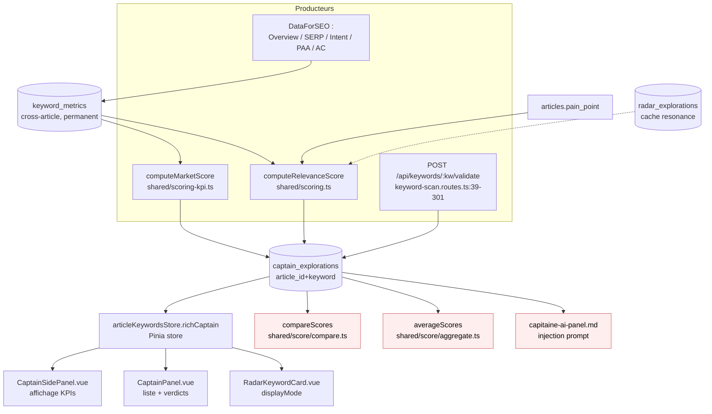

# Data Flow — score-capitaine

> **Description métier :** Évaluation chiffrée d'un mot-clé Capitaine, sur deux axes indépendants : marché (volume, KD, CPC, PAA, intent, autocomplete) et pertinence (alignement à la douleur de l'article via PAA, autocomplete, racines, intent).
> **Type/format :** Bimodal `{ marketScore, relevanceScore }`. Chaque score peut être `null` (donnée insuffisante) — interdiction d'utiliser `?? 0` (cf. règle ESLint `no-restricted-syntax` dans `eslint.config.ts:49-78`).

## Producteurs

Qui crée ou met à jour cette donnée :

- **Endpoint** `POST /api/keywords/:keyword/validate` ([server/routes/keyword-scan.routes.ts:39-301](../../server/routes/keyword-scan.routes.ts)) — reçoit `{ keyword, level, articleTitle, painPoint? }`, fetch parallèle Overview + Autocomplete + SERP + Intent + PAA si miss cache, calcule les 2 scores, renvoie `ValidateResponse`.
- **Service** `keyword-scan.service.ts` orchestre l'appel.
- **Cache cross-article** `keyword_metrics` (FRESHNESS_DAYS = 7) — si frais, court-circuite les appels DataForSEO.
- **Calcul Score Marché** — `shared/scoring-kpi.ts → computeMarketScore(kpis)` — pondération Volume 30 / KD 20 / Intent 15 / PAA 10 / AC 10 / CPC 10 → `{ value: 0-100 | null, verdict, breakdown }`.
- **Calcul Score Pertinence** — `shared/scoring.ts → computeRelevanceScore(...)` — pondération Pain 30 / PAA × douleur 25 / AC × douleur 15 / Racines 20 / Intent × douleur 10. `null` si painPoint absent ou pas de signal lexical exploitable.
- **Source signaux** :
  - Cache Radar (préféré si présent) — données sémantiques de qualité issues de `radar_explorations.scan_result`.
  - Fallback lexical via `matchResonanceDetailed()` (rapide, sub-1ms) si pas de cache Radar.

## Persistance

> **⚠️ Refonte 2026-05-05** : ni `marketScore` ni `relevanceScore` ne sont persistés en DB. Voir [relevance-score-live-computation.md](./relevance-score-live-computation.md) pour l'architecture complète. Cette section décrit la persistance des **inputs** uniquement.

**Autorité** : `keyword_metrics` (PostgreSQL) pour les KPIs bruts ; `captain_explorations(article_id, keyword)` pour les **métadonnées** Capitaine (status, root_keywords, ai_panel_markdown). **Les scores Marché/Pertinence ne sont PAS persistés** — calculés à la volée à chaque hydratation.

- Table `keyword_metrics` (cross-article, permanent) — colonnes `search_volume`, `keyword_difficulty`, `cpc`, `competition`, `intent_raw`, `autocomplete_suggestions[]`, `paa_questions[]`, `serp_raw_json JSONB`, `fetched_at`. **Inputs** des deux scores.
- Table `captain_explorations(article_id, keyword, source, status, root_keywords, ai_panel_markdown, ...)` — métadonnées Capitaine. **Pas de colonne score**. La colonne `root_keywords` (TEXT[]) est remplie **dès l'entrée** du keyword (FR-CAP-ROOTS-PERSISTED-AT-ENTRY).
- Table `articles.pain_point` — input critique du Score Pertinence.
- Store Pinia `articleKeywordsStore` — slot unique `richCaptain` par article (lock atomique via `lockCaptain()`). Contient des scores **calculés à la volée**, vidé au F5.
- **Nouveau store** `captain-relevance.store` — Map des cards et racines avec leurs scores Pertinence + breakdown. Hydraté à chaque mount, vidé au F5.
- Cache `api_cache` (TTL variable par endpoint DataForSEO) — couche supplémentaire pour les appels eux-mêmes. **N'est PAS utilisé pour les scores.**

> **Hiérarchie d'autorité** : `keyword_metrics` (KPIs bruts) + `articles.pain_point` (input pertinence) + `captain_explorations.root_keywords` (racines) → calcul à la volée → `articleKeywordsStore.richCaptain` + `captain-relevance.store` (lecture session). Toute écriture passe par les **inputs** ; les scores sont dérivés, jamais persistés.

## Consommateurs

### Affichage (UI)

- [src/components/moteur/CaptainSidePanel.vue](../../src/components/moteur/CaptainSidePanel.vue) — section « KPIs marché » (Volume / KD / CPC / Intent / PAA count / AC count) en lecture seule, badges de verdict.
- [src/components/intent/RadarKeywordCard.vue](../../src/components/intent/RadarKeywordCard.vue) — affichage card Radar bimodal selon `displayMode='market' | 'relevance'`.
- `CaptainPanel.vue` mode workflow — liste verticale des entrées validées avec leurs deux scores.
- `CaptainVerdictPanel.vue` — feu tricolore (GO/ORANGE/NO-GO/GRAY) issu du verdict.

### Calcul / tri / filtre / agrégat

- **Tri liste Capitaine** — utilise `compareScores()` de [shared/score/compare.ts](../../shared/score/compare.ts) (gère `null` → en bas, jamais 0).
- **Tri Radar cards** — idem, mode `market` ou `relevance` choisi par l'utilisateur.
- **Agrégats** (moyenne, max, min) — `averageScores()`, `maxScore()`, `minScore()` de [shared/score/aggregate.ts](../../shared/score/aggregate.ts) — excluent les `null`.
- **Verdicts dérivés** — `computeVerdict()` (legacy, deprecated post 2026-04-28) et nouveaux verdicts attachés à chaque score.
- **Injection prompt IA** — `capitaine-ai-panel.md` reçoit `{{marketScore}}` et `{{relevanceScore}}` formatés via `loadPrompt()`.
- **Calcul `richCaptain` finale** — utilisé pour décider du verrouillage Capitaine (mais le verdict est INFORMATIF — le bouton lock est toujours actif depuis 2026-04-28, cf. FR-CAP-VERDICT-INFORMATIVE).

> **Règle de cohérence affichage / calcul** — Le score affiché dans `CaptainSidePanel.vue` et le score utilisé pour `compareScores()` au tri DOIVENT venir du même champ (`marketScore.value` ou `relevanceScore.value`). Ne jamais utiliser un fallback numérique (`?? 0`) au moment du tri si l'affichage montre `—`.

## Cas d'usage à risque

| Cas | Lecture | Écriture | Risque de divergence |
|---|---|---|---|
| Premier load (article jamais ouvert) | — | endpoint `/validate` → `keyword_metrics` + `captain_explorations` | Faible si fetch atomique. |
| Reload (data en cache) | `keyword_metrics` + `captain_explorations` | aucune (sauf TTL expiré) | **Risque ATTÉNUÉ Sprint 10.5** : depuis FR-PAIN-IMMUTABLE-AFTER-CEREVEAU, le `painPoint` est figé en cours de workflow. Le seul cas où `relevanceScore` peut être `null` au reload est l'absence de signaux (PAA, autocomplete) ou un keyword longue-traîne — cas tracés par `unavailableReason` (FR-CAP-RELEVANCE-UNAVAILABLE-REASON). |
| Switch d'onglet Phase ① → ② | hydratation depuis `keyword_metrics` | aucune | Faible. |
| Restore depuis history (slider) | `captain_explorations` historique | aucune | **Risque** : les scores historiques utilisent les anciennes formules (avant 2026-04-28) si pas re-calculés — afficher la date du calcul à côté du score. |
| Merge cache + DB (cache stale) | `api_cache` (stale) + `keyword_metrics` (frais) | upsert `keyword_metrics` | Le service `keyword-scan.service.ts` doit toujours préférer la DB freshness à l'`api_cache` quand il s'agit de KPIs persistants. |
| Refresh navigateur | re-hydratation complète depuis DB | aucune | Faible si toutes les valeurs source sont en DB (pas en localStorage). |

## Diagramme

## Régressions historiques

- **2026-04-28 (sprint score-pertinence)** — Avant cette date, un seul score (`computeVerdict()`) gating le lock via `canLock`. Un bug : la valeur affichée dans la card pouvait différer de celle utilisée par `sortByScore()` parce que les deux n'utilisaient pas la même expression. Régression résolue par l'unification dans `shared/score/` + suppression de `canLock` (FR-CAP-VERDICT-INFORMATIVE remplace FR-CAP-VERDICT-GATING).
- **2026-04-28 (formule F1 PAA)** — Le score Pertinence sur PAA était une moyenne des scores individuels, ce qui donnait des résultats trompeurs si peu de PAA. Refactor : score cumulatif `(somme points / (nbPAA × 2)) × 100`. Cf. `sprints-pain-point-relevance-evolution.md` S3.
- **2026-05-05 (KPI nullable)** — `KpiSummary.rawValue` (utilisé par `data.service.ts` pour reconstituer les KPIs Capitaine depuis `keyword_metrics`) passe à `number | null`. Adapter DB→KPIs : `t.search_volume === null` propagé tel quel au lieu de `Number(t.search_volume ?? 0)`. UI Capitaine (`CaptainSidePanel.vue`) affiche `'—'` via `formatVolume / formatCpc / formatKd` quand `rawValue` est `null` — distingue « 0 réel mesuré » de « donnée absente DataForSEO ». `computeMarketScore` exclut les composantes null de la pondération (renormalisation). Voir FR-INFRA-KPI-NULLABLE / FR-INFRA-KPI-SCORING-NULLSAFE.

## Tests de cohérence à écrire

À placer dans `tests/unit/coherence/score-capitaine.test.ts` :

1. **`describe('FR-CAP-SCORING-BIMODAL — cohérence affichage / tri')`** — vérifie que la valeur affichée dans `CaptainSidePanel` (`marketScore.value`) est exactement celle passée à `compareScores` au moment de trier. Inclure des cards avec `relevanceScore = null` et vérifier qu'elles vont en bas du tri (pas comme 0).
2. **`describe('FR-CAP-SCORING-BIMODAL — null exclus des agrégats')`** — `averageScores([80, null, 60])` doit valoir 70, pas (80+0+60)/3.
3. **`describe('FR-CAP-VERDICT-INFORMATIVE — lock indépendant du verdict')`** — vérifier que le bouton « Valider Capitaine » reste actif même quand verdict = NO-GO.
4. **`it.todo('reload restaure le même verdict que le premier load (formule à jour)')`** — placeholder pour le cas régression historique.
5. **`it.todo('restore from history affiche la date du calcul si formule legacy')`**.

---

*Document maintenu par la discipline data-flow-discipline. Cf. [README](./README.md).*
