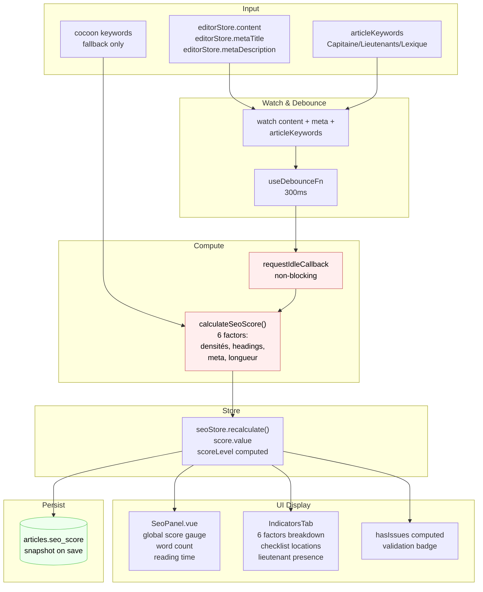

# Data Flow — seo

> **Description métier :** Évaluation continue d'un article pendant la rédaction. Calcul non-bloquant (debounce 300ms + requestIdleCallback) de 6 facteurs de scoring SEO (densité mots-clés pilier/secondaires, hiérarchie des headings, méta-title, méta-description, longueur contenu). Produit un score global 0-100 et des niveaux qualitatifs (good/fair/poor).
> **Type/format :** `SeoScore { global: number | null, factors: SeoFactors, keywordDensities, headingValidation, metaAnalysis, checklistItems, nlpTerms, hasArticleKeywords, lieutenantPresence, lexiqueCoverage }`

## Producteurs

Qui crée ou met à jour cette donnée :

- **Composable** `useSeoScoring()` ([src/composables/seo/useSeoScoring.ts:21-100](../../src/composables/seo/useSeoScoring.ts)) — watch `editorStore.content`, `editorStore.metaTitle`, `editorStore.metaDescription`, `articleKeywords()` avec debounce 300ms (ligne 77), émet vers `seoStore.recalculate()` via `requestIdleCallback` (fallback `setTimeout 0`) pour non-blocage UI (ligne 9-15).
- **Fonction pure** `calculateSeoScore()` ([src/utils/seo-calculator.ts:453-609](../../src/utils/seo-calculator.ts)) — orchestre calcul des 6 facteurs (word count, densité, validations headings, meta, longueur contenu), retourne `SeoScore` avec breakdown complet. Utilise `articleKeywords` si présent (Capitaine/Lieutenants/Lexique), sinon fallback vide (pas de keywords secondaires).
- **Store Pinia** `seoStore` ([src/stores/article/seo.store.ts:1-67](../../src/stores/article/seo.store.ts)) — action `recalculate()` (ligne 34-59) reçoit contenu HTML, keywords (cocoon), metadata, appelle `calculateSeoScore()` (ligne 52), stocke résultat dans `score.value`. Computed `scoreLevel` (ligne 19-24) traduit `global` en 'good'/'fair'/'poor'.
- **Persistance database** — lors de l'autosave via `editorStore.saveArticle()` ([src/stores/article/editor.store.ts:213-237](../../src/stores/article/editor.store.ts)), un `PUT /api/articles/:id` peut inclure `seoScore: number` (validé par schema [shared/schemas/article.schema.ts](../../shared/schemas/article.schema.ts) ligne `seoScore: z.number().nullable().optional()`). Service backend `saveArticleContent()` ([server/services/article/article-content.service.ts:50-86](../../server/services/article/article-content.service.ts)) sauvegarde en table `articles.seo_score` (ligne 77).
- **Keywords article** — `useArticleKeywordsStore` fournit `articleKeywords?.()` (Capitaine + Lieutenants + Lexique) au composable (ligne 25 du composable), change déclenche recalcul complet du score.

## Persistance

**Autorité** : Aucune persistance en temps réel (score éphémère, recalculé à chaque changement). **Snapshot** persisté dans `articles.seo_score` (colonne NUMERIC) lors de l'autosave.

- Table `articles` — colonne `seo_score NUMERIC` (peut être `NULL` si pas d'article keywords défini). Source unique pour l'historique (snapshot au moment de la dernière save).
- Store Pinia `seoStore` — `score` (ref) contient le score calculé **de la session courante**. Pas synchronisé avec DB entre les recalculs — c'est un état éphémère côté front.
- Cache calcul : `calculateSeoScore()` est **pur et déterministe** — même contenu produit même score sans cache (pas de cache Redis côté scoring).

> **Hiérarchie d'autorité** : Score **live** (seoStore) est l'autorité de session. Dès que l'utilisateur change le contenu, le score est invalidé et recalculé. `articles.seo_score` en DB est un **snapshot historique** pour traçabilité, pas la source du calcul live. Rechargement de l'article relance `useSeoScoring()` qui recalcule à zéro.

## Consommateurs

### Affichage (UI)

- **Component** `SeoPanel.vue` ([src/components/panels/SeoPanel.vue:1-230](../../src/components/panels/SeoPanel.vue)) — affiche `seoStore.score?.global` via `ScoreGauge` (ligne 62), word count (ligne 65), reading time (ligne 68), tableau de tabs (Mots-clefs / Indicateurs / SERP Data). **Avertissement** si `!seoStore.score.hasArticleKeywords` (ligne 56-58 : badge warning "Aucun mot-clé article défini").
- **Component** `IndicatorsTab.vue` — affiche détail des 6 facteurs (`factors.keywordPilierScore`, `keywordSecondaryScore`, etc.), checklist d'emplacement (metaTitle, H1, intro, conclusion, slug, imageAlt), présence lieutenants par zone.
- **Component** `ScoreGauge.vue` — rendu visuel du global score (0-100) avec badge couleur en fonction de `scoreLevel` ('good' → vert, 'fair' → jaune, 'poor' → rouge).
- **Indicateur dirty** — si `seoStore.score` change **après** un autosave, couleur du badge peut signaler que le score live a divergé de la DB (régression future à implémenter si nécessaire).

### Calcul / tri / filtre / agrégat

- **Validation** `hasIssues` (computed [src/stores/article/seo.store.ts:26-32](../../src/stores/article/seo.store.ts)) — agrège violations : `!headingValidation.isValid OR keywordDensities.some(d => !d.inTarget) OR !metaAnalysis.titleInRange OR !metaAnalysis.descriptionInRange`. Utilisé par les UX d'alerte.
- **Scoring densité** — chaque `keywordDensity` utilise sa `target.min/max` pour scorer via `scoreDensity()` ([src/utils/seo-calculator.ts:159-168](../../src/utils/seo-calculator.ts)). Moyenne pondérée par type (Pilier 25%, Secondaires 15%, etc. dans `SEO_SCORE_WEIGHTS`).
- **Pondération globale** ([src/utils/seo-calculator.ts:556-563](../../src/utils/seo-calculator.ts)) : `global = keywordPilierScore × 0.25 + keywordSecondaryScore × 0.15 + headingScore × 0.20 + metaTitleScore × 0.15 + metaDescriptionScore × 0.10 + contentLengthScore × 0.15`.
- **Règle de cohérence** — `global` affiché dans SeoPanel et valeur stockée dans DB (snapshot) **doivent provenir du même calcul**. Ne jamais utiliser de fallback (`?? 0`) pour remplacer un null au moment du tri — si no `articleKeywords`, les densités secondaires sont vides (pas 50 par défaut).

> **Règle de cohérence affichage / calcul** — Le score affiché dans SeoPanel et celui sauvegardé en DB DOIVENT être calculés par la même fonction `calculateSeoScore()`. Pas de fallback silencieux ("si null, montrer 50"). Si `articleKeywords` absent, le score reflect une densité de 50 (neutre) pour les secondaires, mais l'affichage dit "—" et le badge hint "Configurez le Capitaine".

## Cas d'usage à risque

| Cas | Lecture | Écriture | Risque de divergence |
|---|---|---|---|
| Premier load article (jamais ouvert) | `article_content` (HTML) + `article_keywords` (Capitaine/Lieutenants) + `articles.meta_title/description` | aucune (affichage seul) | Faible si load atomique. Mais si `articleKeywords` load après le contenu, recalcul sera sans keywords (densité neutre 50). |
| Modif rapide contenu (frappe utilisateur) | `editorStore.content` (state) → debounce 300ms | aucune (live local, pas immédiat en DB) | **Risque** : utilisateur tape vite, recalcul groupe 3-4 changements en 1 debounce. Si requestIdleCallback delay > 500ms (browser busy), affichage du score retarde de 0-1s. UX acceptable (dépend de la vélocité de frappe). |
| Modif mot-clé article (Capitaine changé) | Watcher ligne 80-97 : `articleKeywords?.()` déclenche recalcul (ligne 85) | aucune | **Risque** : si `articleKeywords` passe de `null` à défini pendant la rédaction, premier recalcul avec keywords inclut les densités secondaires (change le score global). User verra un delta. |
| Reload article (depuis DB) | `getArticleContent()` hydrate `content`, `useSeoScoring()` lance recalcul auto, `articles.seo_score` snapshot chargé | aucune | **Risque** : si formula SEO a changé depuis le dernier save (ex: weights ou seuils), le score live peut différer de la DB. Afficher la date du calcul DB à côté du snapshot (futur). |
| Échange Capitaine vers Lieutenants | Densité du Capitaine tombe, Lieutenants montent | aucune (local) | **Risque** : global peut baisser si Capitaine avait un bon score. Correction du keyword la prochaine fois qu'on valide en Moteur. |
| Autosave déclenche persistance | `seoScore` lu de `seoStore.score.global` avant send | upsert `articles.seo_score` | Faible si autosave utilise le score live au moment exact. Mais si autosave est décalé (ex: 5s après recalcul), score DB snapshot d'une version antérieure du contenu. |

## Diagramme

## Régressions historiques

- **Avant 2026-04 (no article keywords)** — Score calculé sur cocoon keywords uniquement. Lors du pivot vers Keywords Moteur (Capitaine/Lieutenants), la densité secondaire devient **vide** si pas de Lieutenants définis, ce qui crée un score "incomplet" (facteur 15% à 50 neutre). Solution : afficher un badge "Configurez Lieutenants" et ignorer ce facteur du calcul (mise en place 2026-04+).
- **Bug cohérence affichage / calcul** — Si la UI affichait `score ?? 0` (fallback), et le calcul utilisait `null` pour densités manquantes, l'affichage montrait 0 (rouge) mais le tri/moyenne ignorait les nulls (classement incohérent). Régression résolue par unification des deux uses : jamais de fallback silencieux, `null` partout = absent/neutre/baissé.
- **Densité article keywords vs cocoon keywords** — Avant migration vers `articleKeywords`, l'app recalculait sur cocoon keywords. Après migration, doit préférer article keywords (Capitaine). Risk : deux loads concurrents peuvent lire l'ancien et le nouveau. Solution : guarantee atomique (articleKeywordsStore fournit une snapshot valide à chaque recalcul).

## Tests de cohérence à écrire

À placer dans `tests/unit/coherence/seo.test.ts` :

1. **`describe('FR-RED-SEO-LIVE — debounce groupe les changements')`** — Émettre 10 changements rapides de contenu (chaque 20ms dans un `act` rapide). Vérifier que `recalculate()` est appelé **une seule fois** (pas 10), max 2x si debounce expire deux fois. Timeout 500ms.
2. **`describe('FR-RED-SEO-LIVE — scoreLevel traduit le score global')`** — Vérifier que `scoreLevel = 'good'` ssi `global >= 70`, `'fair'` ssi `40-70`, `'poor'` ssi `< 40`. Include `null` → `null`.
3. **`describe('FR-RED-SEO-LIVE — hasIssues détecte violations')`** — Crée contenu avec H1 manquant, H1×2, H1→H3 skip, densité out-of-target, meta title vide, meta desc hors range. Vérifier que `hasIssues = true` pour chacun.
4. **`it('FR-RED-SEO-LIVE — articleKeywords absent → densités secondaires neutres')`** — Contenu bon, keywords cocoon définis, mais `articleKeywords = null`. Vérifier que `score.keywordDensities.length === 0` (pas de recalcul sur cocoon). Score global reflète les 4 autres facteurs.
5. **`it('FR-RED-SEO-LIVE — reload article relance recalcul zéro')`** — Mount composable, content change, store gets score. Unmount, remount. Vérifier que `seoStore.score` passe à `null` avant recalcul (pas de cache persistant en seoStore).
6. **`it('FR-RED-SEO-LIVE + FR-RED-PROGRESS — autosave sauvegarde score live')`** — Modif contenu → score calculé 75 → autosave. Vérifier que `PUT /api/articles/:id` inclut `{ seoScore: 75 }`. Mock DB, vérifier `articles.seo_score` update.

---

*Document maintenu par la discipline data-flow-discipline. Cf. [README](./README.md).*
