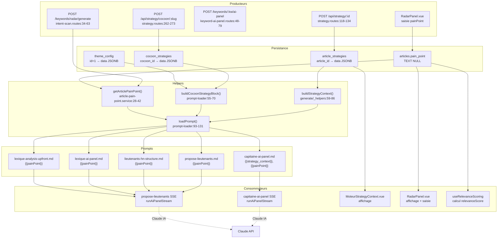

# Data Flow — strategy-context

> **Description métier :** Deux variables complémentaires qui enrichissent les prompts IA du Moteur avec le contexte stratégique de l'article et sa douleur centrale. `strategy_context` est une agrégation des 6 réponses Brain-First validées (cible, douleur, angle, promesse, CTA) formatée en bloc Markdown. `painPoint` est la douleur saisie au niveau article, avec fallback `(non défini)` si absent.
> **Type/format :** `strategy_context: string` (Markdown block ou chaîne vide) + `painPoint: string` (texte ou fallback "(non défini)")

## Producteurs

Qui crée ou met à jour cette donnée :

### `strategy_context` — Bloc agrégé des 6 étapes Brain-First

- **Endpoint article** `GET /api/strategy/:id` ([server/routes/strategy.routes.ts:118-134](../../server/routes/strategy.routes.ts)) — Charge la stratégie article complète depuis `article_strategies(article_id).data JSONB`. Les 6 champs (`cible.validated`, `douleur.validated`, `angle.validated`, `promesse.validated`, `cta.target`) sont ensuite formatés par `buildStrategyContext()`.
- **Endpoint cocon** `GET /api/strategy/cocoon/:cocoonSlug` ([server/routes/strategy.routes.ts:262-273](../../server/routes/strategy.routes.ts)) — Charge la stratégie cocon complète depuis `cocoon_strategies(cocoon_id).data JSONB`. Contrepartie multilingue : les 5 premiers champs (cible, douleur, angle, promesse, cta) sont formatés par `buildCocoonStrategyBlock()`.
- **Service de formatage** `buildStrategyContext(strategy: ArticleStrategy | null)` ([server/routes/generate/_helpers.ts:59-86](../../server/routes/generate/_helpers.ts)) — Agrège les 6 réponses validées en bloc Markdown structuré. Si `completedSteps === 0` (aucune étape validée), retourne chaîne vide (FR-MOT-STRATEGY-INJECTION). Récupère uniquement les champs `.validated`.
- **Service alternatif (cocon)** `buildCocoonStrategyBlock(strategy: CocoonStrategy)` ([server/utils/prompt-loader.ts:55-70](../../server/utils/prompt-loader.ts)) — Identique pour le contexte cocon. Retourne chaîne vide si tous les champs `.validated` sont absents.
- **Chargeur de prompts** `loadPrompt(name, variables, options)` ([server/utils/prompt-loader.ts:93-131](../../server/utils/prompt-loader.ts)) — Reçoit `{ strategy_context: '...' }` comme variable standard, puis injecte `{{strategy_context}}` dans le prompt `.md`. Si `cocoonSlug` fourni, construit le bloc cocon automatiquement et le stocke en `strategy_context`.
- **Table de persistance** `article_strategies(article_id, data JSONB, completed_steps)` — Source unique de vérité pour les réponses validées. Chaque `POST /api/strategy/:id/suggest` crée ou met à jour ce JSONB.
- **Table de persistance** `cocoon_strategies(cocoon_id, data JSONB, generated_at)` — Source unique pour les réponses cocon validées.

### `painPoint` — Douleur de l'article

- **Endpoint** `POST /keywords/:keyword/ai-panel` ([server/routes/keyword-ai-panel.routes.ts:48-79](../../server/routes/keyword-ai-panel.routes.ts)) — Appelle `getArticlePainPoint(articleId)` pour injecter la douleur dans le prompt du Capitaine.
- **Endpoint** `POST /keywords/:keyword/ai-hn-structure` ([server/routes/keyword-ai-panel.routes.ts:86-123](../../server/routes/keyword-ai-panel.routes.ts)) — Idem pour la recommandation HN.
- **Endpoint** `POST /keywords/:keyword/propose-lieutenants` ([server/routes/keyword-ai-panel.routes.ts:151-285](../../server/routes/keyword-ai-panel.routes.ts)) — Idem pour la proposal de lieutenants.
- **Endpoint** `POST /keywords/:keyword/ai-lexique` ([server/routes/keyword-ai-panel.routes.ts:291-338](../../server/routes/keyword-ai-panel.routes.ts)) — Idem pour l'analyse lexicale.
- **Endpoint** `POST /keywords/:keyword/ai-lexique-upfront` ([server/routes/keyword-ai-panel.routes.ts:344-417](../../server/routes/keyword-ai-panel.routes.ts)) — Idem pour l'analyse lexicale upfront.
- **Endpoint Radar** `POST /keywords/radar/generate` ([server/routes/intent-scan.routes.ts:34-63](../../server/routes/intent-scan.routes.ts)) — Reçoit le `painPoint` du client (saisi par l'utilisateur), le passe à `generateRadarKeywords(title, keyword, painPoint, cocoonSlug)`.
- **Endpoint Radar** `POST /keywords/radar/scan` ([server/routes/intent-scan.routes.ts:66-96](../../server/routes/intent-scan.routes.ts)) — Reçoit le `painPoint` optionnel du client.
- **Service de lecture** `getArticlePainPoint(articleId: number | null | undefined)` ([server/services/queries/article-pain-point.service.ts:28-42](../../server/services/queries/article-pain-point.service.ts)) — Lit `articles.pain_point TEXT NULL` depuis la base. Retourne la chaîne trimée si valide, sinon fallback `PAIN_POINT_FALLBACK = "(non défini)"`. Best-effort : never throw, loggue l'erreur si DB inaccessible.
- **Table de persistance** `articles.pain_point TEXT NULL` ([server/db/migrations/014_articles_pain_intent_expected.sql:1-17](../../server/db/migrations/014_articles_pain_intent_expected.sql)) — Colonne textuelle nullable ajoutée en S5. Saisie via le formulaire Cerveau (étape "douleur" article), persiste jusqu'au reload.
- **Alternativement (Radar)** — Le client peut saisir/modifier le `painPoint` directement à l'étape de génération Radar (RadarPanel.vue), sans passer par Cerveau.

## Persistance

**Autorité multi-niveaux** :

| Domaine | Table / Colonne | Type | Durée | Producteur(s) |
|---------|-----------------|------|-------|---|
| **strategy_context — article** | `article_strategies(article_id).data JSONB` | JSONB | Permanent (DB) | `POST /api/strategy/:id`, form Cerveau 6 étapes |
| **strategy_context — cocon** | `cocoon_strategies(cocoon_id).data JSONB` | JSONB | Permanent (DB) | `POST /api/strategy/cocoon/:slug`, form Cerveau cocon 5 étapes |
| **painPoint** | `articles.pain_point TEXT NULL` | TEXT | Permanent (DB) | Form Cerveau article (étape douleur), ou saisie directe Radar |
| **theme_context** (facultatif) | `theme_config(id=1).data JSONB` | JSONB | Permanent (DB) | Configuration ThemeConfig (singleton) |
| **cocoonSlug** (routing) | Request header / query param | STRING | Session | Client (URL / form) |

**Hiérarchie de lecture** :
1. `article_strategies` → extract `completedSteps`, puis champs `.validated`
2. `cocoon_strategies` → extract champs `.validated` si cocoonSlug fourni
3. `articles.pain_point` → lecture via `getArticlePainPoint()`
4. `theme_config` → optionnel, agrégé si cocoonSlug + theme config présente
5. `loadPrompt()` → injecte toutes les variables en {{...}} dans le `.md`

## Consommateurs

### Affichage (UI)

- **Composant** `MoteurStrategyContext.vue` ([src/components/moteur/MoteurStrategyContext.vue](../../src/components/moteur/MoteurStrategyContext.vue)) — Affichage collapsable du bloc stratégique côté Moteur (lecture-seule, affiche les 6 réponses validées article).
- **Composant** `ContextRecap.vue` ([src/components/strategy/ContextRecap.vue](../../src/components/strategy/ContextRecap.vue)) — Affichage récapitulatif du contexte Cerveau (cocon + thème + themeConfig).
- **Composant** `MoteurContextRecap.vue` ([src/components/moteur/MoteurContextRecap.vue](../../src/components/moteur/MoteurContextRecap.vue)) — Panel Moteur affichant le contexte stratégique agrégé.
- **Vue Radar** `RadarPanel.vue` ([src/components/intent/RadarPanel.vue](../../src/components/intent/RadarPanel.vue)) — Saisie / édition du painPoint en tempo real avant génération Radar.
- **Affichage fallback** — Quand `painPoint = "(non défini)"`, les composants affichent le badge neutre sans cacher l'absence.

### Calcul / tri / filtre / agrégat

- **Injection prompt IA** — Les 8 prompts Moteur ci-dessous récupèrent `{{painPoint}}` via `loadPrompt()` :
  1. **capitaine-ai-panel.md** (ligne 9) — `{{painPoint}}` au contexte du Capitaine
  2. **propose-lieutenants.md** (ligne 12) — `{{painPoint}}` pour filtrer les lieutenants par douleur
  3. **lieutenants-hn-structure.md** (ligne 12) — `{{painPoint}}` pour recommandation HN
  4. **lexique-ai-panel.md** (ligne 11) — `{{painPoint}}` pour analyse TF-IDF alignée douleur
  5. **lexique-analysis-upfront.md** (ligne 10) — `{{painPoint}}` pour recommandations termes upfront
  6. **lexique-suggest.md** — `{{painPoint}}` pour suggestion termes (radarLongTailSuggest)
  7. **radar-long-tail-suggest.md** — `{{painPoint}}` pour génération mots-clés Radar longue traîne
  8. **intent-keywords.md** — `{{painPoint}}` pour analyse intent enrichie
- **Injection prompt IA (strategy)** — Le prompt `capitaine-ai-panel.md` (ligne 13) reçoit aussi `{{strategy_context}}` si fourni via `loadCocoonStrategyBlock(cocoonSlug)`.
- **Tri/filtre Radar** — Composable `useRelevanceScoring.ts` utilise le `painPoint` pour calculer `relevanceScore` (alignement mot-clé ↔ douleur). Si `painPoint = "(non défini)"`, score Pertinence = `null` (FR-CAP-PAINPOINT-FALLBACK).
- **Radar Scan** — Service `scanRadarKeywords()` accepte un `painPoint` optionnel pour pondérer les signaux lexicaux (PAA, AC, racines) selon la pertinence à la douleur.
- **IA Panel Runner** `runAiPanelStream()` — Récepteur universel pour SSE streaming, reçoit le prompt + variables déjà injectées.

> **Règle de cohérence affichage / calcul** — Le `painPoint` affiché dans `RadarPanel.vue` est exactement celui passé à `getArticlePainPoint(articleId)` pour injection prompt. Ne jamais utiliser un fallback différent entre affichage (ex: `— incomplet`) et calcul (ex: valeur zéro numérique).

## Cas d'usage à risque

| Cas | Lecture | Écriture | Risque de divergence |
|---|---|---|---|
| **Premier load article (Cerveau non validé)** | `strategy_context = ''` (FR-MOT-STRATEGY-INJECTION) | Aucune (stratégie pas encore saisie) | Faible si prompt tolère chaîne vide. Marquer explicitement dans prompt : « Strategy context can be empty ». |
| **Premier load article (Cerveau validé)** | `article_strategies.data.cible.validated` + 5 autres | Aucune (lecture seule) | Faible si toutes les 6 réponses sont cohérentes en DB. |
| **PainPoint saisie Cerveau (form article étape 2)** | — | `articles.pain_point = user_input` (UPDATE) | **Sprint 10.5 (FR-PAIN-IMMUTABLE-AFTER-CEREVEAU)** : la saisie du painPoint a lieu UNIQUEMENT dans le Cerveau. Une fois l'utilisateur entré dans le Moteur, le painPoint est figé. Au prochain mount de l'onglet Capitaine (changement d'article ou F5), le calcul Pertinence backend reflète le nouveau painPoint. Pas de relance live nécessaire. |
| **Reload navigateur (cache vide)** | `article_strategies + articles.pain_point` | Aucune (re-hydration) | **Risque clé** : si `completedSteps` change entre deux loads (ex: une étape complétée offline), le bloc strategy_context peut diverger. Le prompt recalculé sera différent. Solution : toujours recharger depuis DB avant injection. |
| **Switch article Moteur** | `articles{id1}.pain_point` → `articles{id2}.pain_point` | Aucune | **Risque modéré** : l'ID article change, donc `painPoint` change, `strategy_context` change (peut être pour article2 venant d'un cocon différent). Recharger les deux sources. |
| **Merge strategy (Cerveau)** | User input + AI suggestion pour une étape | `article_strategies.data[step].validated = merged_text` | Faible. Le merge se fait au niveau d'une seule étape, le reste inchangé. |
| **Refresh strategy depuis Radar (saisie directe painPoint)** | Form Radar + `generateRadarKeywords(painPoint)` | `articles.pain_point` UPDATE si user clique « Enregistrer » | **Risque** : Radar génère les mots-clés avec un `painPoint` temporaire (pas encore en DB). Si user ferme sans enregistrer, les mots-clés générés ne correspondent plus au `painPoint` DB. Afficher un avertissement. |
| **Restore from history (slider Moteur)** | `captain_explorations[keyword].validation` (historique) | Aucune (lecture historique) | **Risque** : les scores historiques utilisaient peut-être un `painPoint` différent ou une ancienne formule. Afficher la date + version du scoring. |
| **Typo prompt : {{strategyContext}} au lieu de {{strategy_context}}** | — | Prompt IA reçoit `{{strategyContext}}` non remplacé | **Risque CRITIQUE** : la variable literale `{{strategyContext}}` est envoyée à Claude au lieu du bloc contexte. Claude la traite comme du texte brut. Détecté via smoke test sur tous les `.md`. |
| **Typo prompt : {{painPoint}} manquant** | — | Prompt IA reçoit prompt sans mention de douleur | **Risque** : le prompt perd sa directive clé « adapte-toi à cette douleur ». IA produit analyse générique. Détecté via smoke test. |

## Diagramme



## Régressions historiques

- **Sprint S1 (2026-04-28) — Injection painPoint dans 6 prompts Moteur** — Avant S1, le `painPoint` était utilisé localement côté front pour calculer le `relevanceScore`, mais n'était jamais envoyé aux prompts IA Moteur. Impacte : les recommandations IA (Capitaine, Lieutenants, Lexique) ne tenaient pas compte de la douleur de l'article. Régression résolue en passant `painPoint` à `loadPrompt()` dès S1 (cf. tech-spec `sprints-pain-point-relevance-evolution.md` S1).
- **Sprint S2 (2026-04-30) — Transmission strategy_context Cerveau → Moteur** — Avant S2, la stratégie article était persistée en DB mais pas injectée dans les prompts IA. S2 ajoute `{{strategy_context}}` explicitement dans `capitaine-ai-panel.md` et le construit via `buildStrategyContext()` côté server, puis on généralise à tous les prompts via `loadPrompt()` + `options.cocoonSlug` (cf. tech-spec S2).
- **Sprint S5 (2026-05-04) — Fallback explicit `(non défini)` pour painPoint null** — Avant S5, un `painPoint = null` en DB causait une chaîne vide en prompt ou une omission silencieuse. S5 ajoute le fallback explicite `PAIN_POINT_FALLBACK = "(non défini)"` visibles à l'utilisateur + dans les prompts, déclenchant un warning « douleur non définie » au lieu de silence (FR-CAP-PAINPOINT-FALLBACK).

## Tests de cohérence à écrire

À placer dans `tests/unit/coherence/strategy-context.test.ts` :

### Test 1 — `describe('FR-MOT-STRATEGY-INJECTION — strategy_context vide vs présent')`

```typescript
it('prompt fonctionne avec strategy_context=="" (Empty)', async () => {
  // Appeler loadPrompt('capitaine-ai-panel', { keyword: 'test', painPoint: '...', strategy_context: '' })
  // Vérifier que le prompt est valide (ne contient pas {{strategy_context}} non remplacé)
  // Envoyer à Claude (ou mock) et confirmer réponse valide
})

it('prompt fonctionne avec strategy_context rempli (6 étapes)', async () => {
  const strategy = { cible: { validated: '...' }, douleur: { validated: '...' }, /* ... */ }
  const ctx = buildStrategyContext(strategy)
  // Vérifier que ctx contient les 6 lignes attendues, formatées
})
```

### Test 2 — `describe('FR-CAP-PAINPOINT-FALLBACK — fallback (non défini)')`

```typescript
it('getArticlePainPoint retourne fallback quand pain_point=NULL', async () => {
  // Mock query retournant { rows: [{ pain_point: null }] }
  const result = await getArticlePainPoint(42)
  expect(result).toBe('(non défini)')
})

it('relevanceScore = null quand painPoint = fallback', async () => {
  // Appeler computeRelevanceScore(..., painPoint: '(non défini)')
  // Vérifier relevanceScore = null (ex: pas de calcul, neutre)
})
```

### Test 3 — `describe('FR-MOT-PAINPOINT-INJECTION — variable présente dans 8 prompts')`

```typescript
it('8 prompts Moteur contiennent {{painPoint}}', async () => {
  const prompts = [
    'capitaine-ai-panel',
    'propose-lieutenants',
    'lieutenants-hn-structure',
    'lexique-ai-panel',
    'lexique-analysis-upfront',
    'lexique-suggest',
    'radar-long-tail-suggest',
    'intent-keywords',
  ]
  for (const prompt of prompts) {
    const content = await readFile(`server/prompts/${prompt}.md`, 'utf-8')
    expect(content).toContain('{{painPoint}}')
  }
})
```

### Test 4 — `describe('Cohérence strategy_context affichage / calcul')`

```typescript
it('MoteurStrategyContext affiche les mêmes valeurs que buildStrategyContext', async () => {
  const strategy = await getStrategy(articleId)
  const contextBlock = buildStrategyContext(strategy)
  const wrapper = mount(MoteurStrategyContext, { props: { strategy } })
  // Vérifier que le rendu contient les 6 lignes de contextBlock
  // Via wrapper.text().includes('Cible'), wrapper.text().includes('Douleur'), etc.
})
```

### Test 5 — `it.todo('loadPrompt injecte cocoonSlug et génère strategy bloc automatiquement')`

```typescript
// Placeholder : vérifier que loadPrompt('some-prompt', vars, { cocoonSlug: 'mon-cocon' })
// appelle getCocoonStrategy, construit bloc cocon, injecte en {{strategy_context}}
```

### Test 6 — `it.todo('prompts sans {{strategy_context}} placeholder reçoivent bloc en appended')`

```typescript
// Placeholder : si prompt ne contient PAS {{strategy_context}} mais stratégie est présente,
// loadPrompt() doit ajouter le bloc à la fin (cf. ligne 125-127 prompt-loader.ts)
```

---

*Document maintenu par la discipline data-flow-discipline. Cf. [README](./README.md).*
