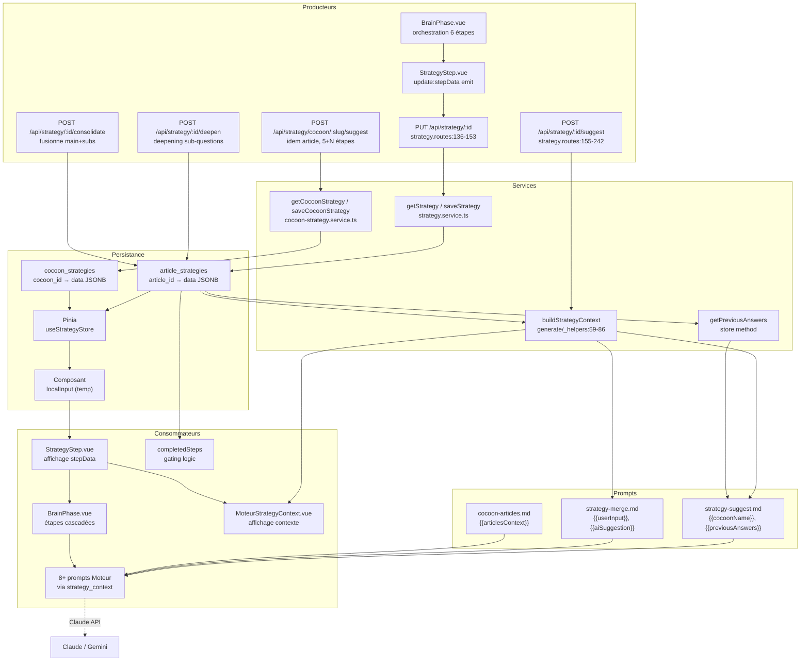

# Data Flow — strategy

> **Description métier :** Les stratégies articles et cocon encapsulent le travail du Cerveau (Brain-First workflow). Chaque stratégie est un objet JSONB contenant 6 étapes pour article (cible, douleur, aiguillage, angle, promesse, cta) ou 5 pour cocon (sans aiguillage), où chaque étape progresse dans un cycle : input → suggestion IA → validation utilisateur → consolidation optionnelle. Ces données sont persistées en DB (autorité) et cacheées en Pinia, puis propagées au Moteur via `buildStrategyContext()` pour enrichir les prompts IA (Fr-MOT-STRATEGY-INJECTION, visible dans `strategy-context.md`).
> **Type/format :** JSONB structures `ArticleStrategy` et `CocoonStrategy` avec sous-champs `StrategyStepData { input, suggestion, validated, subQuestions[] }` et `CtaData { type, target, suggestion }`. Chaque étape émet des checks `moteur:strategy_*` via le store à mesure de sa progression.

---

## Producteurs

Qui crée ou met à jour cette donnée :

### Endpoint article — Suggestion et fusion

- **Endpoint** `POST /api/strategy/:id/suggest` ([server/routes/strategy.routes.ts:155-242](../../server/routes/strategy.routes.ts)) — Reçoit `StrategySuggestRequest { step, currentInput, mergeWith?, existingValidated?, context }`. Routes la demande vers un des 2 templates :
  - `strategy-suggest.md` — suggestion pure IA à partir de l'input utilisateur + contexte (cocon, silo, réponses précédentes).
  - `strategy-merge.md` — fusion de l'input utilisateur + suggestion IA existante en une réponse cohérente.
  - Injecte dans le prompt : `{{articleTitle}}`, `{{cocoonName}}`, `{{siloName}}`, `{{step}}`, `{{currentInput}}`, `{{aiSuggestion}}`, blocs optionnels `{{previousAnswersBlock}}`, `{{themeContextBlock}}`, `{{existingValidatedBlock}}`.
  - Retourne `{ suggestion: string }` (max 1024 tokens).

- **Endpoint article — Deepening** `POST /api/strategy/:id/deepen` ([server/routes/strategy.routes.ts:...](../../server/routes/strategy.routes.ts)) — Reçoit `StrategyDeepenRequest { step, mainQuestion, mainAnswer, existingSubQuestions[], context }`. Génère 2 sous-questions pour affiner une étape validée. Populate `stepData.subQuestions[].{ id, question, description, input, suggestion, validated }`.

- **Endpoint article — Consolidate** `POST /api/strategy/:id/consolidate` ([server/routes/strategy.routes.ts:...](../../server/routes/strategy.routes.ts)) — Fusionne réponse principale + réponses sub-questions en une version consolidée. Input : `mainAnswer + subAnswers[]`. Output : `{ consolidated: string }` (texte fusionné validé).

- **Endpoint article — Enrich** `POST /api/strategy/:id/enrich` ([server/routes/strategy.routes.ts:...](../../server/routes/strategy.routes.ts)) — Enrichit une réponse déjà validée avec nouvelles données d'une sub-question. Input : `existingValidated + subQuestion + subAnswer`. Output : `{ enriched: string }`.

- **Endpoint article — Save/Validate** `PUT /api/strategy/:id` ([server/routes/strategy.routes.ts:136-153](../../server/routes/strategy.routes.ts)) — Reçoit `{ cible?, douleur?, angle?, promesse?, cta?, aiguillage?, completedSteps? }`. Valide via `articleStrategySchema.parse()`. Merges avec existant. Incrémente `completed_steps` à chaque validation.

- **Endpoint article — Load** `GET /api/strategy/:id` ([server/routes/strategy.routes.ts:117-134](../../server/routes/strategy.routes.ts)) — Charge la stratégie existante depuis `article_strategies(article_id).data JSONB`.

### Endpoint cocoon — Idem article (5 étapes + articles brainstorm)

- **Endpoint cocoon — Suggest/Merge** `POST /api/strategy/cocoon/:cocoonSlug/suggest` ([server/routes/strategy.routes.ts:288-...](../../server/routes/strategy.routes.ts)) — Idem article, mais :
  - Steps additionnels : `articles`, `articles-structure`, `articles-topics`, `articles-paa-queries`, `articles-spe`, `add-article`.
  - Templates alternes : `cocoon-articles.md`, `cocoon-articles-topics.md`, `cocoon-paa-queries.md`, `cocoon-articles-spe.md`, `cocoon-add-article.md`.
  - Output peut inclure `proposedArticles[]` ou `suggestedTopics[]` en JSONB.

- **Endpoint cocoon — Save/Validate** `PUT /api/strategy/cocoon/:cocoonSlug` ([server/routes/strategy.routes.ts:275-286](../../server/routes/strategy.routes.ts)) — Idem article pour cocoons.

- **Endpoint cocoon — Load** `GET /api/strategy/cocoon/:cocoonSlug` ([server/routes/strategy.routes.ts:262-273](../../server/routes/strategy.routes.ts)) — Idem article, résout `cocoonSlug` → `cocoon_id` via `resolveCocoonId()` avant lookup DB.

### Service backend — Persistance

- **Service** `getStrategy(id: number)` ([server/services/strategy/strategy.service.ts:21-32](../../server/services/strategy/strategy.service.ts)) — Query DB pour `article_strategies(article_id).data JSONB`, parse via `articleStrategySchema`, retourne objet ou `null`.

- **Service** `saveStrategy(id: number, partial: Partial<ArticleStrategy>)` ([server/services/strategy/strategy.service.ts:34-53](../../server/services/strategy/strategy.service.ts)) — Merge `partial` avec existant, valide schema, insère via `INSERT ... ON CONFLICT ... DO UPDATE` (upsert).

- **Service** `getCocoonStrategy(cocoonSlug: string)` ([server/services/strategy/cocoon-strategy.service.ts:48-62](../../server/services/strategy/cocoon-strategy.service.ts)) — Query DB pour `cocoon_strategies(cocoon_id).data JSONB` après résolution slug → id.

- **Service** `saveCocoonStrategy(cocoonSlug: string, partial: Partial<CocoonStrategy>)` ([server/services/strategy/cocoon-strategy.service.ts:64-89](../../server/services/strategy/cocoon-strategy.service.ts)) — Idem, avec upsert sur cocoon_id.

### Store Pinia — Orchestration front

- **Store** `useStrategyStore()` ([src/stores/strategy/strategy.store.ts](../../src/stores/strategy/strategy.store.ts)) — Actions :
  - `fetchStrategy(id)` — appelle `apiGet('/strategy/{id}')`, popule `strategy.value`.
  - `saveStrategy(id)` — appelle `apiPut('/strategy/{id}', strategy.value)`.
  - `requestSuggestion(id, request)` — appelle `apiPost('/strategy/{id}/suggest', request)`.
  - `requestDeepen(id, request)` — appelle `apiPost('/strategy/{id}/deepen', request)`.
  - `requestConsolidate(id, request)` — appelle `apiPost('/strategy/{id}/consolidate', request)`.
  - `requestEnrich(id, request)` — appelle `apiPost('/strategy/{id}/enrich', request)`.
  - `getPreviousAnswers()` — construit objet `{ cible, douleur, angle, promesse, aiguillage, cta }` avec validated values pour injection en contexte de suggestion suivante.
  - `nextStep(id)`, `prevStep()`, `goToStep(step)` — navigation UI inter-étapes.
  - `initEmpty(id)` — crée stratégie vide.

- **Store** `useCocoonStrategyStore()` ([src/stores/strategy/cocoon-strategy.store.ts](../../src/stores/strategy/cocoon-strategy.store.ts)) — Idem pour cocon.

### Composants UI — Édition

- **Composant** `StrategyStep.vue` ([src/components/strategy/StrategyStep.vue](../../src/components/strategy/StrategyStep.vue)) — Affiche une étape (cible, douleur, angle, promesse, cta, aiguillage).
  - Champs : `input` (textarea utilisateur), `suggestion` (IA, éditable), `validated` (résultat finalizado, éditable).
  - Sous-questions : `subQuestions[]` avec deepening optionnel.
  - Emissions : `update:stepData`, `request-suggestion`, `request-merge`, `request-deepen`, `request-sub-suggestion`, `request-enrich`, `delete-sub-question`.

- **Composant** `BrainPhase.vue` ([src/components/production/BrainPhase.vue](../../src/components/production/BrainPhase.vue)) — Orchestre les 6 étapes, appelle store actions sur `request-*` events.

### Prompts IA — Templates pour suggestion

- **Template** `server/prompts/strategy-suggest.md` — Directive : suggère une réponse à une étape donnée. Injecte contexte cocon, silo, réponses précédentes (validées), thème config. En français.

- **Template** `server/prompts/strategy-merge.md` — Directive : fusionne input utilisateur + suggestion IA existante. Respecte le format Brain-First. Enrichit si text validé antérieur présent.

- **Templates cocoon** — `cocoon-brainstorm.md`, `cocoon-articles.md`, `cocoon-articles-topics.md`, `cocoon-paa-queries.md`, `cocoon-articles-spe.md`, `cocoon-add-article.md`.

---

## Persistance

**Autorité** : `article_strategies(article_id, data JSONB, completed_steps INT)` et `cocoon_strategies(cocoon_id, data JSONB, generated_at TIMESTAMPTZ)`.

| Domaine | Table/Colonne | Type | Durée | Producteur(s) |
|---------|---------------|------|-------|---|
| **Stratégie article — 6 étapes** | `article_strategies(article_id).data` | JSONB | Permanent (DB) | `POST /api/strategy/:id/suggest`, `PUT /api/strategy/:id` |
| **Étapes en cours (input)** | `data.cible.input`, `data.douleur.input`, ... | TEXT | Temp (Pinia) | Composant StrategyStep (v-model) |
| **Suggestions IA** | `data.cible.suggestion`, ... | TEXT ou null | Permanent (DB) | `POST /api/strategy/:id/suggest` |
| **Validations utilisateur** | `data.cible.validated`, ... | TEXT | Permanent (DB) | StrategyStep emit `update:stepData` + `PUT` |
| **Sous-questions** | `data.cible.subQuestions[].{ id, question, input, suggestion, validated }` | JSON[] | Permanent (DB) | `POST /api/strategy/:id/deepen`, consolidation |
| **Aiguillage** | `data.aiguillage.{ suggestedType, suggestedParent, suggestedChildren, validated }` | JSON | Permanent (DB) | `POST /api/strategy/:id/suggest` (type/parent/children IA) |
| **CTA** | `data.cta.{ type, target, suggestion }` | JSON | Permanent (DB) | Idem aiguillage |
| **Étapes complétées** | `completed_steps INT` | INT | Permanent (DB) | `PUT /api/strategy/:id` (incrément) |
| **Stratégie cocon** | `cocoon_strategies(cocoon_id).data` | JSONB | Permanent (DB) | Idem article (5 étapes + articles brainstorm) |
| **Timestamp mise à jour** | `updated_at TIMESTAMPTZ` | TIMESTAMPTZ | Audit | Trigger PostgreSQL `set_updated_at()` |

**Hiérarchie de lecture/écriture** :
1. DB `article_strategies.data` → autorité source. Jamais stale après `PUT`.
2. Pinia store `strategy.value` → cache hydratation au load du Cerveau. Invalidé sur `saveStrategy()`.
3. Composant StrategyStep → state local `input`, peuplé depuis store. Émit diff vers parent BrainPhase pour `saveStrategy()`.
4. Prompts IA reçoivent contexte pré-construit via route (previousAnswers, themeContext) — jamais DB direct.

---

## Consommateurs

### Affichage (UI)

- **Composant** `StrategyStep.vue` ([src/components/strategy/StrategyStep.vue](../../src/components/strategy/StrategyStep.vue)) — Affiche pour chaque étape : 
  - Titre + description.
  - `validated` en badge vert si présent (résultat finalisé).
  - `input` en textarea (saisie utilisateur).
  - `suggestion` en card séparée (sortie IA, éditable).
  - Sub-questions + deepening UI.

- **Composant** `MoteurStrategyContext.vue` ([src/components/moteur/MoteurStrategyContext.vue](../../src/components/moteur/MoteurStrategyContext.vue)) — Panel collapsable au Moteur affichant les 5-6 étapes validées article (lecture seule). Utilise `buildStrategyContext(strategy)` formatée pour l'utilisateur.

- **Composant** `ContextRecap.vue` ([src/components/strategy/ContextRecap.vue](../../src/components/strategy/ContextRecap.vue)) — Récapitulatif du contexte stratégique Cerveau (cocon + thème + config).

- **Composant** `BrainPhase.vue` ([src/components/production/BrainPhase.vue](../../src/components/production/BrainPhase.vue)) — Parent orchestrant les 6 composants StrategyStep en tab/accordion.

### Calcul / tri / filtre / agrégat

- **Injection prompt IA — Moteur** — Les 8+ prompts Moteur reçoivent `{{strategy_context}}` injecté via `buildStrategyContext(strategy)` côté backend. Cf. doc séparate `strategy-context.md` pour la liste complète des prompts affectés et les patterns d'injection.

- **Injection prompt IA — Cerveau** — Les prompts `strategy-suggest.md`, `strategy-merge.md` reçoivent contexte cocon/silo + réponses précédentes (via `getPreviousAnswers()`) pour cascade et cohérence multi-étapes.

- **Décision flow utilisateur** — `completedSteps` utilisé pour :
  - Déterminer à quel step redémarrer après reload (cible : pas de régression).
  - Afficher progressbar complétude (6/6 étapes).
  - Gating sur certains workflows (ex: ne pas lancer Moteur si `completedSteps < 2`).

- **Cascade context — Multi-étape** — À chaque suggestion, le store appelle `getPreviousAnswers()` pour fournir les réponses validées en contexte IA (Fr-CER-CONTEXT-FOR-MOTEUR). Assure cohérence thématique à travers les 6 étapes.

> **Règle de cohérence affichage / calcul** — La valeur affichée dans `StrategyStep.vue` (`stepData.validated`) et celle utilisée en injection prompt (`buildStrategyContext()`) DOIVENT venir du même champ DB. Aucun fallback silencieux (ex: pas de `?? "En attente"` au calcul si affichage montre champ vide). Fallback explicite `(non renseigné)` si absent.

---

## Cas d'usage à risque

| Cas | Lecture | Écriture | Risque de divergence |
|---|---|---|---|
| **Premier load Cerveau (stratégie vide)** | `article_strategies.data` absent → `null` | `initEmpty(id)` crée objet vide en Pinia | Faible si template vide cohérent. |
| **Saisie étape 1 (cible) non validée** | `strategy.cible = { input: '...', suggestion: null, validated: '' }` | Composant StrategyStep stocke input temporairement en local | **Risque** : si user ferme sans valider, input est perdu (pas sauvegardé en DB). Solution : auto-save draft `input` en localStorage ou debounce `PUT` tous les 5s. |
| **Suggestion IA reçue, pas encore validée** | `strategy.cible.suggestion = '...'` | Route `/suggest` retourne suggestion, composant l'affiche éditable | **Risque modéré** : user peut attendre avant validation, suggestion peut être stale (contexte cocon changé). Solution : afficher date/version si source de contexte change. |
| **Validation étape → completedSteps++** | `strategy.cible.validated = user_input ou suggestion` | Composant emit `update:stepData` + BrainPhase appelle `saveStrategy()` | Faible si upsert atomic. Validation = source unique de truth. |
| **Deepening sub-questions générées** | `strategy.cible.subQuestions = [{ id, question, suggestion, validated }, ...]` | `/deepen` génère 2 questions (input=`""`, suggestion=`null`, validated=`""`) | **Risque** : si deepening lancé 2 fois sans validation, les 2 premières questions sont remplacées par les 2 nouvelles (pas d'accum). Solution : clarifier en UI (« Replace previous sub-questions? »). |
| **Merge suggestion + input après édition** | user saisit input manuel, clique « Fusionner » | `/merge` reçoit `currentInput + mergeWith=strategy.suggestion` | Faible si merge prompt clair. Résultat dépend de qualité prompt IA. |
| **Reload navigateur (Cerveau)** | Pinia vide → `fetchStrategy(id)` recharge DB | `apiGet('/strategy/{id}')` hydrate store | **Risque clé** : si `completedSteps` changé offline (ex: autre appareil a validé étape 3), le UI redémarrera à step 3 au lieu de step actuel. Solution : toujours recharger depuis DB au mount. |
| **Switch article Cerveau** | article A: `strategy_A` → article B: `strategy_B` | Composant BrainPhase appelle `fetchStrategy(B_id)` | Faible si fetch atomique. Pinia est article-scoped via `store.strategy`. |
| **Tentative validation d'étape vide** | `strategy.cita.input = ''`, `suggestion = null` | Composant StrategyStep désactive bouton « Valider » via `canValidate` computed | Faible. UI prevent l'envoi. |
| **Édition d'un `.validated` déjà consolidé** | User clique « Éditer » le texte validé final | Composant StrategyStep ouvre textarea `isEditingValidated=true`, sauvegarde via `saveEditValidated()` + `PUT` | Faible. Overwrites le validated précédent atomiquement. Solution : garder historique (champ `validation_history` futur). |
| **Typo dans strategy-suggest.md prompt** | Prompt contient `{{cocoonNmae}}` (typo) au lieu de `{{cocoonName}}` | Routes `/suggest` injecte via string replace | **Risque CRITIQUE** : variable non remplacée, Claude reçoit literal `{{cocoonNmae}}`, peut déduire le cocon mal. Détecté via linting prompt + unit test. |
| **Cascade multi-étape — input précédent oublié** | User valide cible, puis douleur skip sub-questions | Store `getPreviousAnswers()` ne retourne que `.validated` fields | Faible. Sub-questions ne sont pas propagées en cascade (by design — trop verbeux pour contexte IA). |
| **Merge avec existingValidated absent** | User clique « Fusionner » sur étape 2, mais étape 1 jamais validée | `/merge` reçoit `existingValidated=""` (empty string) | Faible. Prompt gère champ vide (conditionnel `{{#hasExistingValidated}}`). |
| **CTA aiguillage auto-suggestion non applicable** | Step aiguillage : IA suggère `type="Pilier"` mais cocoon n'a pas d'articles Pilier | User doit corriger manuellement via dropdown | Faible si UX expose contraintes d'énumération. Solution : seed IA avec liste articles existants. |
| **Restore from history (slider Moteur)** | Histoire article affichée ancienne stratégie (snapshot passé) | Article à jour en DB, historique affiché en UI | **Risque** : les réponses anciennes utilisaient peut-être d'autres contextes. Afficher date/version. Cf. `score-capitaine.md` régression restore. |
| **Cocon supprimé, articles orphelins** | Cocon `cocoon_id=5` supprimé → `cocoon_strategies` cascade-deleted | Articles restent avec `cocoon_id=NULL`, stratégies articles orphelines | **Risque modéré** : articles perdent contexte cocon au Moteur. Solution : warning avant deletion. |

---

## Diagramme



---

## Régressions historiques

- **Sprint 1-2 (2026-04 early)** — Strategies article et cocon créées avec structure JSONB en `article_strategies` + `cocoon_strategies` tables (migration 001, 010). Trois phases initiales (Explorer / Valider / Assigner) réduites à 6 étapes Brain-First (cible → douleur → aiguillage → angle → promesse → cta).

- **Sprint 3 (2026-04-20 circa)** — Deepening et sub-questions ajoutées pour affinage multi-niveaux. Risk : si deepening lancé 2x sans validation, les 2 premières questions perdues (remplacement non accumulation). Mitigation : UI clarification + historique version.

- **Sprint 4 (2026-04-25 circa)** — Consolidation des réponses main + sub-questions en un seul texte validé. Risk : confusion entre `validated` (final) et `suggestion` (IA proposal). Mitigation : UX visuelle distincte (badges couleur).

- **Sprint 5 (2026-04-28 circa)** — Injection `strategy_context` dans prompts Moteur (capitaine-ai-panel.md, propose-lieutenants.md, etc.). Avant : stratégies validées en DB mais jamais propagées à IA. Risk : incohérence si contexte cocon change entre Cerveau et Moteur call. Mitigation : recharge DB stratégie avant chaque injection.

- **Avant 2026-03 (archive)** — Stratégies étaient stockées en JSON loose dans `api_cache[strategy-article/cocoon-strategy]` sans validation schéma. Migrées en DB JSONB avec `articleStrategySchema.parse()` + `cocoonStrategySchema.parse()`.

---

## Tests de cohérence à écrire

À placer dans `tests/unit/coherence/strategy.test.ts` :

### Test 1 — `describe('FR-CER-STEPS-ARTICLE — progression 6 étapes')`

```typescript
it('completedSteps incrément de 0 à 6 à chaque validation', async () => {
  // Créer strategy vide, mock service
  let strategy = emptyStrategy(1)
  expect(strategy.completedSteps).toBe(0)
  
  // Valider cible (step 0)
  strategy.cible.validated = 'PME'
  strategy = await saveStrategy(1, strategy)
  expect(strategy.completedSteps).toBe(1) // increment automatique ou manuel?
  
  // Valider douleur (step 1)
  strategy.douleur.validated = 'Manque visibilité'
  strategy = await saveStrategy(1, strategy)
  expect(strategy.completedSteps).toBe(2)
  
  // ... jusqu'à step 5 (cta)
  // À step 6, completedSteps = 6, isComplete computed = true
})

it('currentStep au reload = min(completedSteps, 5)', async () => {
  const strategy = { ...mockStrategy, completedSteps: 4 }
  const store = useStrategyStore()
  await store.fetchStrategy(1) // mock returns completedSteps=4
  expect(store.currentStep).toBe(4) // ready to edit step 4 = cta
})
```

### Test 2 — `describe('FR-CER-CONTEXT-FOR-MOTEUR — previousAnswers cascade')`

```typescript
it('getPreviousAnswers construit objet avec validated seuls', () => {
  const strategy: ArticleStrategy = {
    // ...
    cible: { input: 'user input', suggestion: 'IA suggestion', validated: 'PME' },
    douleur: { input: 'draft', suggestion: null, validated: '' }, // empty = omis
    angle: { input: 'draft', suggestion: null, validated: 'Approche pragmatique' },
    // ...
  }
  const store = useStrategyStore()
  store.strategy = strategy
  const prev = store.getPreviousAnswers()
  
  expect(prev.cible).toBe('PME')
  expect(prev.douleur).toBeUndefined() // empty validated omis
  expect(prev.angle).toBe('Approche pragmatique')
})

it('prompts reçoivent previousAnswersBlock construit', async () => {
  // Mock `/suggest` endpoint
  // Appeler avec cible validée, request douleur suggest
  // Vérifier que prompt inclut `- **cible** : PME` en `{{previousAnswersBlock}}`
})
```

### Test 3 — `describe('FR-CER-AIGUILLAGE — auto-suggestion type + parent')`

```typescript
it('aiguillage.suggestedType peut être null ou enum', () => {
  const step: AiguillageData = {
    suggestedType: 'Pilier',
    suggestedParent: 'article-1',
    suggestedChildren: ['article-2', 'article-3'],
    validated: true,
  }
  expect(['Pilier', 'Intermédiaire', 'Spécialisé']).toContain(step.suggestedType)
})

it('aiguillage.validated = boolean (true si user accepted type)', () => {
  const strategy: ArticleStrategy = { ...mockStrategy }
  strategy.aiguillage.validated = true
  // Put à DB et reload
  // Vérifie que aiguillage.validated persiste
})
```

### Test 4 — `describe('Deepening & Sub-questions — accumulation vs replacement')`

```typescript
it.todo('deepening génère 2 sub-questions sans remplacer les précédentes')

it.todo('deepening lancé 2x sans validation → remplace (current behavior clarified)')

it.todo('sub-question validated fusionné dans etape.validated via consolidate')

it.todo('subQuestion.id stable entre reload (UUID ou sequential?)')
```

### Test 5 — `describe('Affichage vs Calcul — strategy_context + previousAnswers')`

```typescript
it('buildStrategyContext(strategy) affiche même texte que StrategyStep.vue', () => {
  const strategy: ArticleStrategy = { ...mockStrategy, completedSteps: 6 }
  const ctx = buildStrategyContext(strategy)
  
  // Render MoteurStrategyContext avec props=strategy
  const wrapper = mount(MoteurStrategyContext, {
    props: {
      cible: strategy.cible.validated,
      douleur: strategy.douleur.validated,
      angle: strategy.angle.validated,
      promesse: strategy.promesse.validated,
      cta: strategy.cta.target,
    },
  })
  
  // Vérifier que wrapper.text() contient les mêmes éléments que ctx
  expect(wrapper.text()).toContain(strategy.cible.validated)
  expect(wrapper.text()).toContain(strategy.douleur.validated)
})

it('previousAnswersBlock en prompt = texte affiché en UI', async () => {
  // Mock store avec strategy partiellement validée
  // Appeler `/suggest` pour étape suivante
  // Vérifier que prompt sent contient le texte displayed au Cerveau
})
```

### Test 6 — `describe('Persistance — upsert atomic + completed_steps')`

```typescript
it.todo('PUT /api/strategy/:id upsert via ON CONFLICT ... DO UPDATE')

it.todo('completedSteps stocké en DB, pas recalculé au load')

it.todo('concurrent PUTs de 2 clients → dernière écriture gagne (last-write-wins)')

it.todo('failed PUT ne modifie pas état Pinia (pessimistic update)')
```

---

*Document maintenu par la discipline data-flow-discipline. Cf. [README](./README.md) et [strategy-context.md](./strategy-context.md) (injection IA, complémentaire).*
