# Moteur Workflow — Diagramme de flux

> Mis à jour : 2026-04-24
> Source de vérité : `src/views/MoteurView.vue` + composants `src/components/moteur/*` + constantes `shared/constants/workflow-checks.constants.ts`

## 1. Vue globale du workflow — 3 phases / 6 onglets

```mermaid
flowchart LR
  classDef explorer fill:#1a2e1a,stroke:#22c55e,color:#86efac
  classDef validate fill:#1a2744,stroke:#3b82f6,color:#93c5fd
  classDef finalisation fill:#2a1a2e,stroke:#a855f7,color:#d8b4fe
  classDef context fill:#1c1c1c,stroke:#f59e0b,color:#fbbf24

  CTX["fa:fa-file-alt Contexte Initial<br/><i>selectedArticle</i><br/>article.id, title, type, cocoonId<br/><i>strategy du Cerveau (optional)</i>"]:::context

  subgraph P1["Phase ① EXPLORER (toujours accessible)"]
    direction LR
    DISC["<b>Discovery</b><br/>KeywordDiscoveryTab<br/>6 sources + IA<br/>check: moteur:discovery_done"]:::explorer
    RADAR["<b>Radar</b><br/>DouleurIntentScanner<br/>scoring + heat<br/>check: moteur:radar_done"]:::explorer
  end

  subgraph P2["Phase ② VALIDER (verrouillage séquentiel, gating souple)"]
    direction LR
    CAPT["<b>Capitaine</b><br/>CaptainValidation<br/>6 KPIs + feu tricolore<br/>check: moteur:capitaine_locked"]:::validate
    LT["<b>Lieutenants</b><br/>LieutenantsSelection<br/>SERP top 3-10<br/>check: moteur:lieutenants_locked"]:::validate
    LEX["<b>Lexique</b><br/>LexiqueExtraction<br/>TF-IDF (zéro requête)<br/>check: moteur:lexique_validated"]:::validate
  end

  subgraph P3["Phase ③ FINALISATION (read-only)"]
    FINAL["<b>Finalisation</b><br/>FinalisationRecap<br/>débloqué si 3 checks ② ✓<br/>→ /cocoon/:id/redaction"]:::finalisation
  end

  CTX --> DISC
  CTX --> RADAR
  CTX --> CAPT

  DISC -- "RadarKeyword[]<br/><i>basket + discovery→radar bridge</i>" --> RADAR
  DISC -- "candidats Capitaine" --> CAPT
  RADAR -. "radarScanResult<br/><i>{ globalScore, heatLevel }</i>" .-> CAPT

  CAPT -- "capitaine verrouillé<br/><i>unlock Lieutenants</i>" --> LT
  LT -- "SERP rawContents<br/><i>article_explorations</i>" --> LEX
  LT -- "lieutenants[] verrouillés<br/><i>unlock Lexique</i>" --> LEX

  LEX -- "ArticleKeywords écrit<br/><i>capitaine + lieutenants + lexique</i>" --> FINAL
  FINAL -- "Bouton<br/>Passer à la Rédaction" --> REDAC["RedactionView"]
```

## 2. MoteurView — Structure centrale

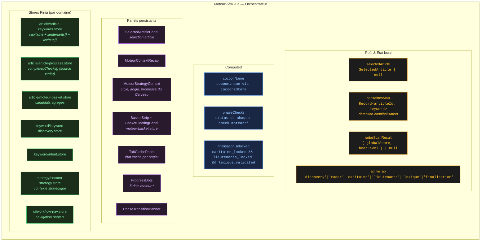

## 3. Phase ① Explorer — Discovery + Radar

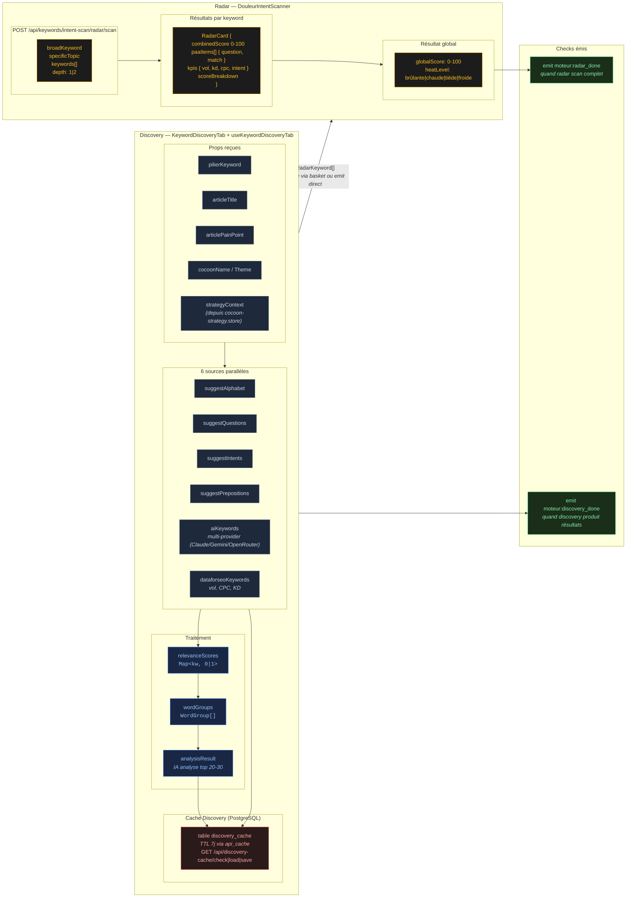

## 4. Phase ② Valider — Capitaine

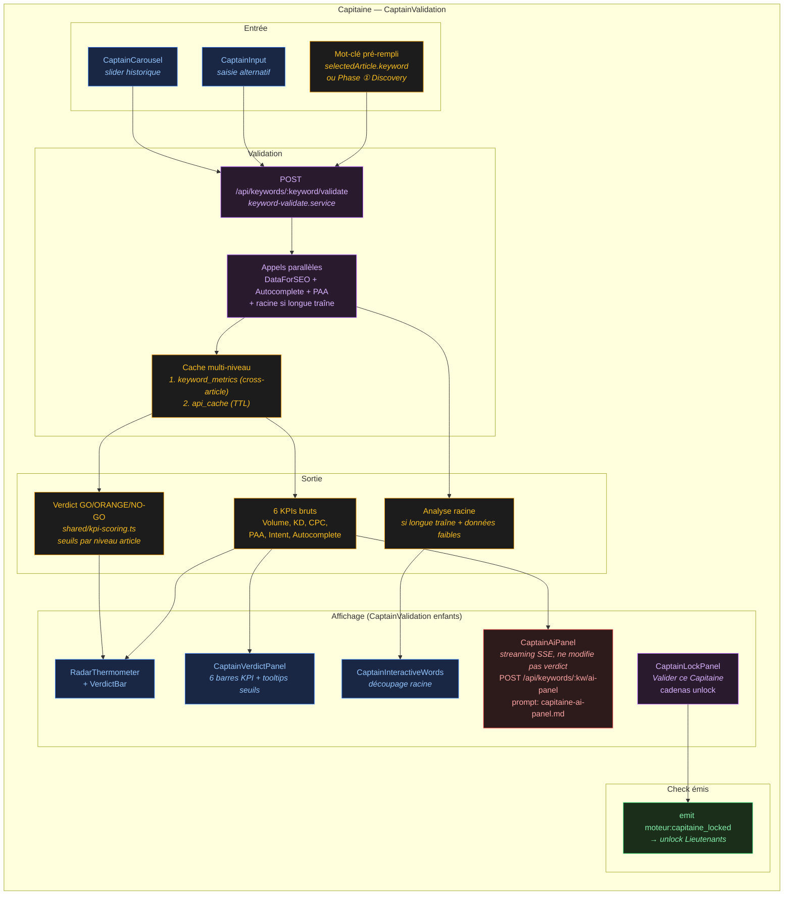

**Règles clés :**
- Le verdict GO nécessite ≥4/6 verts, AUCUN rouge sur Volume ou KD, PAA non-rouge
- NO-GO auto si `volume=0 && paa=0 && autocomplete=0`
- CPC asymétrique : > 2€ = bonus vert, 0-2€ = neutre, jamais rouge
- Seuils contextuels par niveau : Pilier (Volume >1000, KD <40), Intermédiaire (Volume >200, KD <30), Spécifique (Volume >30, KD <20)
- L'utilisateur peut forcer GO sur un verdict ORANGE/NO-GO (libre arbitre)
- Panel IA = conseil uniquement, ne modifie JAMAIS le verdict

## 5. Phase ② Valider — Lieutenants (cascade SERP)

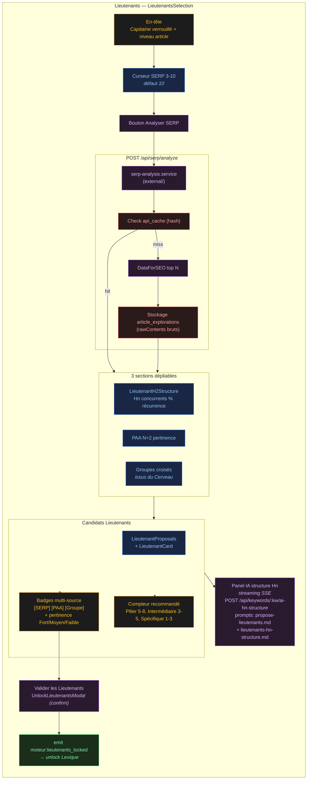

**Curseur SERP intelligent :**
- Sous le défaut (< 10) → **filtre local instantané** sur les résultats déjà scrapés (pas de re-call)
- Au-dessus du défaut → **scraping complémentaire** pour les résultats manquants

## 6. Phase ② Valider — Lexique (TF-IDF zéro requête)

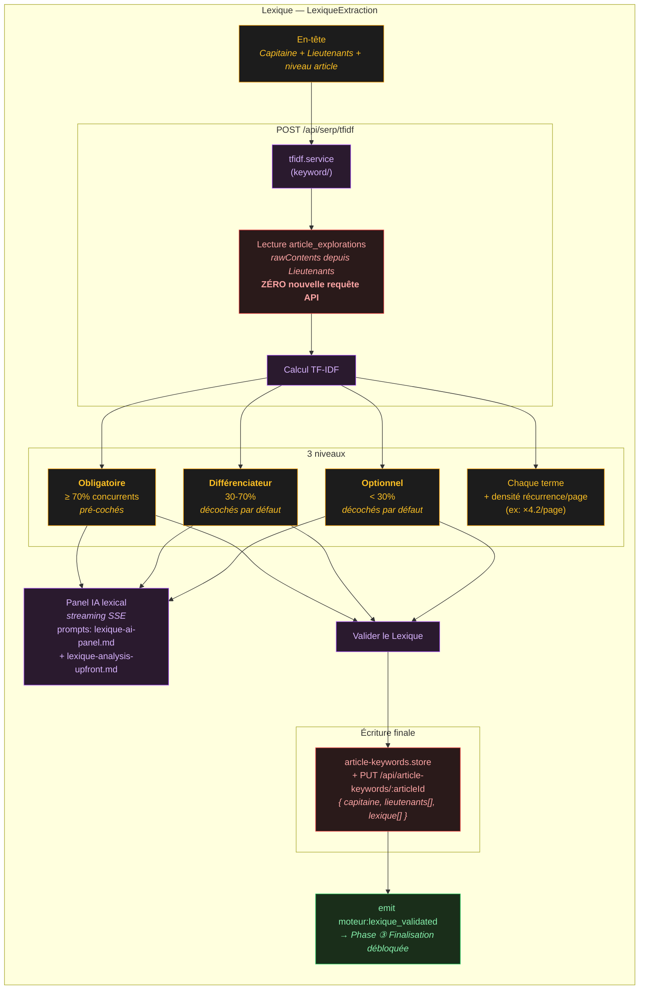

## 7. Phase ③ Finalisation

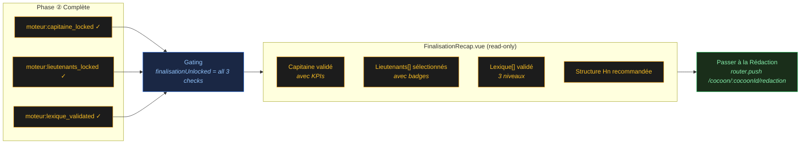

## 8. Cache multi-niveau

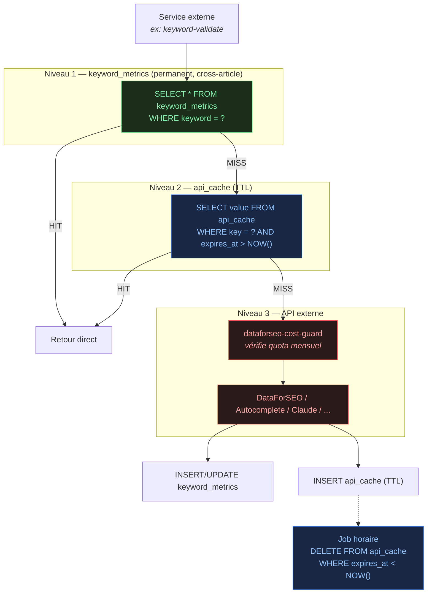

**Effet clé :** un mot-clé utilisé dans N articles = **1 seul appel DataForSEO** grâce à `keyword_metrics`.

## 9. Progression — 5 checks moteur

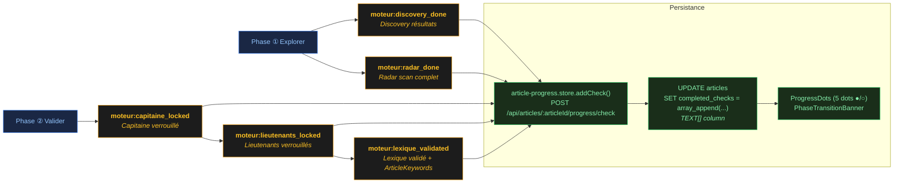

**Constantes (source :** `shared/constants/workflow-checks.constants.ts`) :

```typescript
export const MOTEUR_DISCOVERY_DONE = 'moteur:discovery_done'
export const MOTEUR_RADAR_DONE = 'moteur:radar_done'
export const MOTEUR_CAPITAINE_LOCKED = 'moteur:capitaine_locked'
export const MOTEUR_LIEUTENANTS_LOCKED = 'moteur:lieutenants_locked'
export const MOTEUR_LEXIQUE_VALIDATED = 'moteur:lexique_validated'

export const MOTEUR_CHECKS = [
  MOTEUR_DISCOVERY_DONE, MOTEUR_RADAR_DONE,
  MOTEUR_CAPITAINE_LOCKED, MOTEUR_LIEUTENANTS_LOCKED, MOTEUR_LEXIQUE_VALIDATED,
] as const
```

## 10. Pont Cerveau→Moteur — Enrichissement prompts

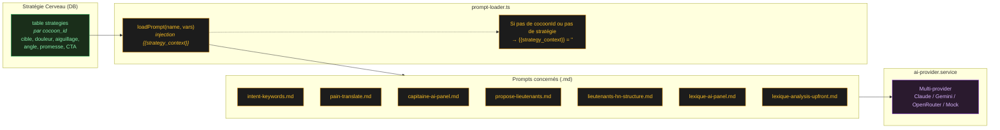

## 11. Mode `libre` (Labo) vs mode `workflow` (Moteur)

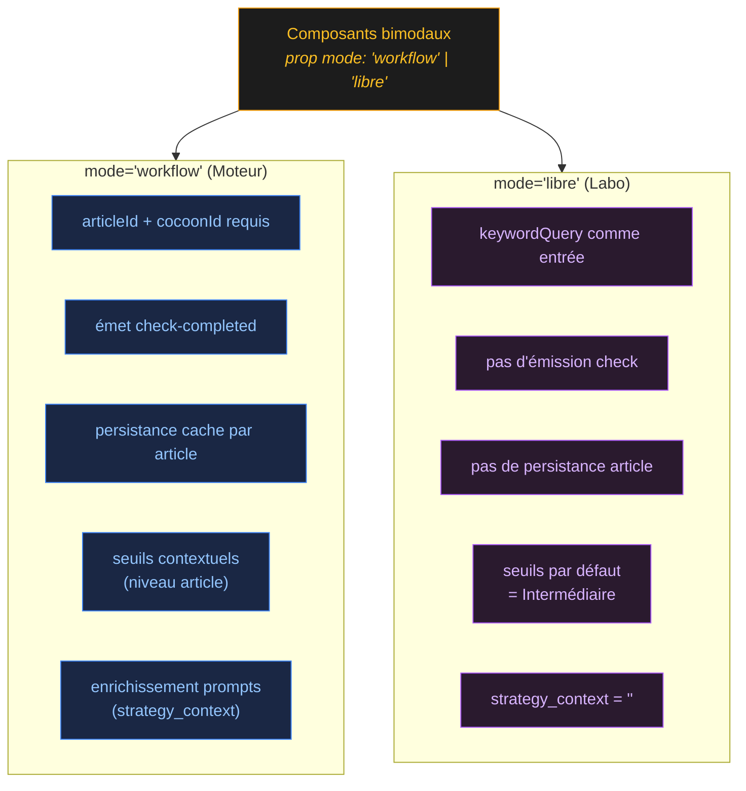

**Composants dual-mode utilisés dans le Labo :**
- `KeywordDiscoveryTab`
- `DouleurIntentScanner`
- `CaptainValidation` (verdict GO/NO-GO libre)

## 12. Reset et nettoyage mémoire

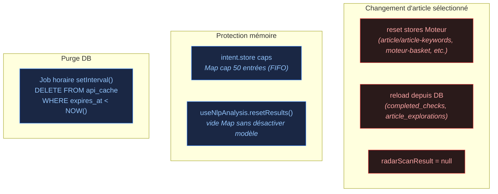

## 13. Résumé des types principaux

| Type | Champs clés | Source |
|------|-------------|--------|
| `SelectedArticle` | id, title, type, cocoonId, keyword | `shared/types/article.types.ts` |
| `RadarKeyword` | keyword, reasoning | `shared/types/intent.types.ts` |
| `RadarCard` | combinedScore, paaItems[], kpis, scoreBreakdown | `shared/types/intent.types.ts` |
| `CaptainVerdict` | overall (GO/ORANGE/NO_GO), kpis, reasons[] | `shared/types/keyword-validate.types.ts` |
| `SerpAnalysisResult` | hnData[], paaData[], groupCrossData[], rawContents[] | `shared/types/serp-analysis.types.ts` |
| `TfidfResult` | obligatoire[], differenciateur[], optionnel[], density | `shared/types/serp-analysis.types.ts` |
| `ArticleKeywords` | articleId, capitaine, lieutenants[], lexique[], hnStructure | `shared/schemas/article-keywords.schema.ts` |
| `ArticleProgress` | articleId, completedChecks[] (TEXT[]) | `shared/types/article-progress.types.ts` |
| `WorkflowCheck` | `moteur:*` \| `cerveau:*` \| `redaction:*` | `shared/constants/workflow-checks.constants.ts` |

## 14. Endpoints clés du Moteur

| Méthode | Endpoint | Service | Usage |
|---------|----------|---------|-------|
| POST | `/api/keywords/discover` | keyword-discovery | Discovery seed |
| POST | `/api/keywords/discover-domain` | keyword-discovery | Discovery domaine |
| POST | `/api/keywords/intent-scan/radar/scan` | intent-scan | Radar Douleur Intent |
| POST | `/api/keywords/:keyword/validate` | keyword-validate | Verdict GO/NO-GO Capitaine |
| POST | `/api/keywords/:keyword/ai-panel` | — | Panel IA Capitaine (SSE) |
| POST | `/api/keywords/:keyword/ai-hn-structure` | — | Structure Hn recommandée |
| POST | `/api/keywords/:keyword/propose-lieutenants` | — | Propositions Lieutenants |
| GET | `/api/keywords/:keyword/metrics` | keyword-queries | Lecture `keyword_metrics` |
| POST | `/api/serp/analyze` | serp-analysis | Scraping SERP top N |
| POST | `/api/serp/tfidf` | tfidf | TF-IDF contenus SERP hérités |
| POST | `/api/paa/batch` | — | PAA batch |
| POST | `/api/articles/:articleId/progress/check` | article-progress | Ajoute un check |
| GET | `/api/articles/:articleId/explorations` | article-explorations | Explorations de l'article |
| GET | `/api/cocoons/:id/capitaines` | — | Map capitaines (cannibalisation) |
| GET | `/api/strategy/:cocoonId` | strategy | Contexte stratégique Cerveau |
