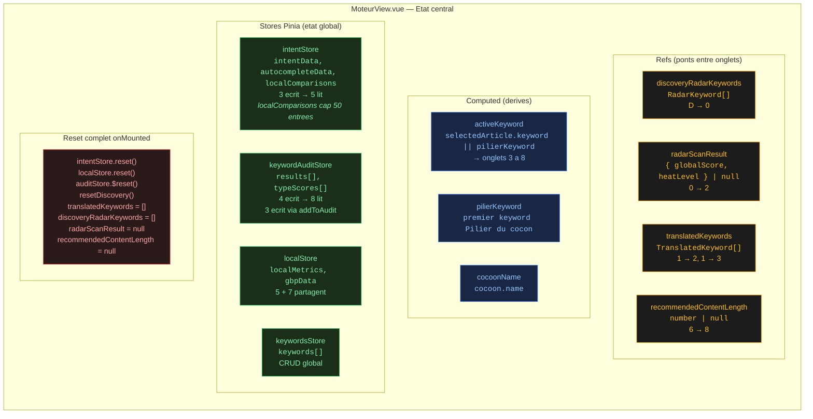
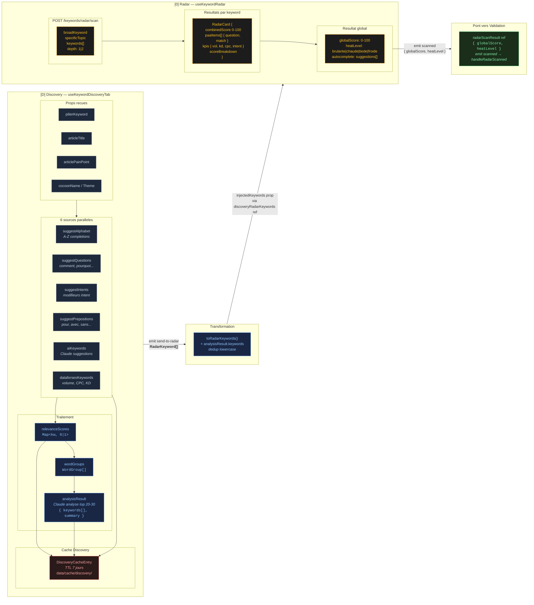
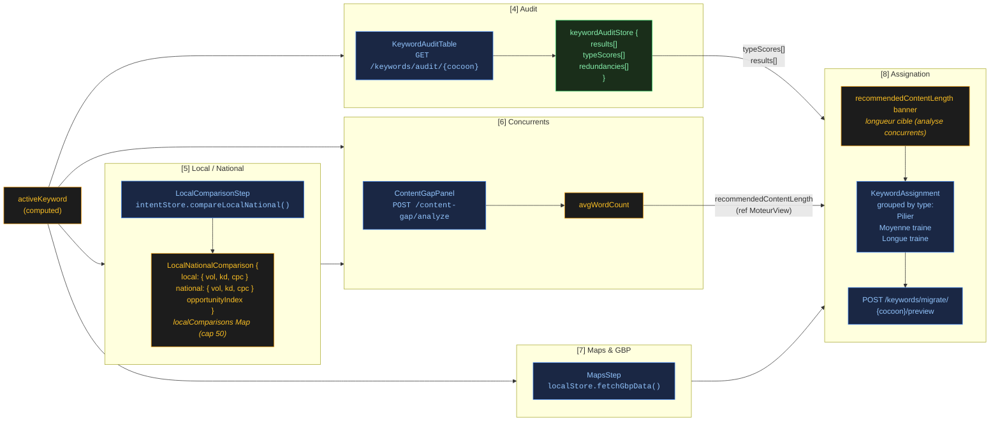
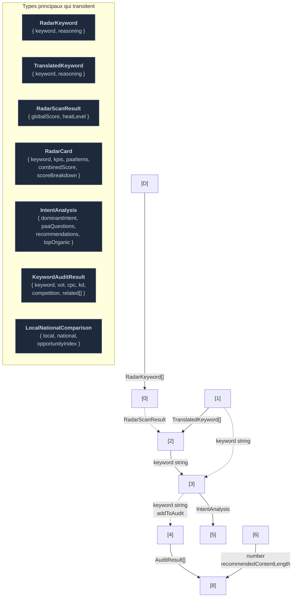
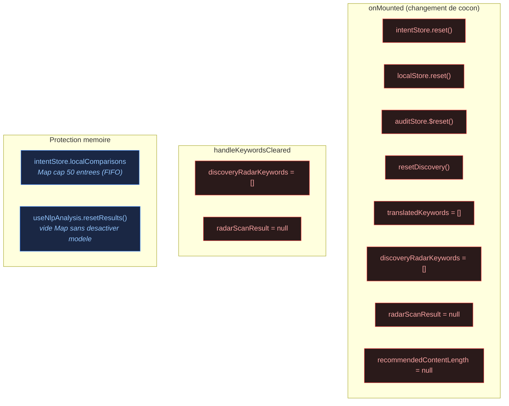

# Moteur Workflow — Diagramme de flux

## 1. Vue globale du workflow

```mermaid
flowchart LR
  classDef optional fill:#2d2d3d,stroke:#666,stroke-dasharray:5 5,color:#aaa
  classDef required fill:#1a2744,stroke:#3b82f6,color:#e2e8f0
  classDef bridge fill:#1c1c1c,stroke:#f59e0b,color:#fbbf24,stroke-width:2px
  classDef store fill:#1a2e1a,stroke:#22c55e,color:#86efac
  classDef context fill:#2a1a2e,stroke:#a855f7,color:#d8b4fe

  CTX["fa:fa-file-alt Contexte Initial<br/><i>selectedArticle</i><br/>keyword, title, painPoint, type"]:::context

  subgraph OPT["OPTIONNELS"]
    direction LR
    D["<b>[D] Discovery</b><br/>6 sources + IA<br/>scoring pertinence"]:::optional
    R["<b>[0] Radar</b><br/>PAA scan<br/>score + heat"]:::optional
  end

  subgraph REQ["WORKFLOW PRINCIPAL"]
    direction LR
    T1["<b>[1] Douleur</b><br/>pain → keywords"]:::required
    T2["<b>[2] Validation</b><br/>multi-source verdict<br/>+ radar heat banner"]:::required
    T3["<b>[3] Exploration</b><br/>intent + autocomplete<br/>+ ajouter a l'audit"]:::required
    T4["<b>[4] Audit</b><br/>keyword audit"]:::required
    T5["<b>[5] Local</b><br/>local vs national"]:::required
    T6["<b>[6] Concurrents</b><br/>content gap"]:::required
    T7["<b>[7] Maps</b><br/>GBP data"]:::required
    T8["<b>[8] Assignation</b><br/>migration keywords<br/>+ longueur cible"]:::required
  end

  CTX --> D
  CTX --> R
  CTX --> T1

  D -- "RadarKeyword[]<br/><i>discoveryRadarKeywords</i>" --> R
  R -. "radarScanResult<br/><i>{ globalScore, heatLevel }</i>" .-> T2
  T1 -- "TranslatedKeyword[]<br/><i>translatedKeywords</i>" --> T2
  T1 -. "translatedKeywords[0].keyword<br/><i>default keyword</i>" .-> T3
  T2 -- "exploreKeyword(kw)<br/><i>intentStore</i>" --> T3
  T3 -. "addToAudit(kw)<br/><i>auditStore.addKeyword()</i>" .-> T4
  T3 --> T4
  T4 --> T5
  T5 --> T6
  T6 -- "avgWordCount<br/><i>recommendedContentLength</i>" --> T8
  T6 --> T7
  T7 --> T8
```

## 2. Ponts de donnees entre onglets

## 3. Flux detaille — Phase Discovery + Radar

## 4. Flux detaille — Phase Douleur → Exploration

```mermaid
flowchart LR
  classDef tab fill:#1a2744,stroke:#3b82f6,color:#93c5fd
  classDef data fill:#1c1c1c,stroke:#f59e0b,color:#fbbf24
  classDef store fill:#1a2e1a,stroke:#22c55e,color:#86efac
  classDef action fill:#2a1a2e,stroke:#a855f7,color:#d8b4fe
  classDef bridge fill:#1c1c1c,stroke:#f59e0b,color:#fbbf24,stroke-width:2px

  subgraph T1["[1] Douleur — PainTranslator"]
    IN1["initialPainText<br/><i>selectedArticle.painPoint</i>"]:::data
    IN2["suggestedKeyword<br/><i>selectedArticle.keyword</i>"]:::data
    API1["POST /pain/translate"]:::action
    OUT1["TranslatedKeyword[]<br/><code>{ keyword, reasoning }</code>"]:::data

    IN1 --> API1
    IN2 --> API1
    API1 --> OUT1
  end

  subgraph T2["[2] Validation — PainValidation"]
    IN3["translatedKeywords prop"]:::data
    RH["radarHeat prop<br/><i>{ globalScore, heatLevel } | null</i><br/>banner informatif"]:::bridge
    API2["POST /validate-pain/enriched<br/><i>useMultiSourceVerdict</i><br/><i>usePainVerdict</i>"]:::action
    OUT2["emit select → keyword"]:::data

    RH -.-> API2
    IN3 --> API2
    API2 --> OUT2
  end

  subgraph T3["[3] Exploration"]
    direction TB
    EI["ExplorationInput<br/><i>translatedKeywords[0]?.keyword<br/>?? activeKeyword</i>"]:::tab
    AV["AutocompleteValidation<br/><code>GET /keywords/autocomplete</code>"]:::tab
    IS["IntentStep<br/><code>POST /intent/analyze</code>"]:::tab
    EV["ExplorationVerdict<br/><i>+ bouton Ajouter a l'audit</i>"]:::tab

    EI --> AV --> IS --> EV

    subgraph INTENT_OUT["intentStore (Pinia)"]
      IO1["intentData: IntentAnalysis {<br/>  dominantIntent<br/>  paaQuestions[]<br/>  recommendations[]<br/>  topOrganicResults[]<br/>}"]:::store
      IO2["autocompleteData {<br/>  suggestions[]<br/>  certaintyIndex<br/>}"]:::store
    end

    IS --> IO1
    AV --> IO2
  end

  subgraph AUDIT_BRIDGE["Pont Exploration → Audit"]
    AB["emit addToAudit(kw)<br/><i>auditStore.addKeyword(kw, cocoon, 'Longue traine')</i><br/><i>auditStore.fetchAudit(cocoon)</i>"]:::action
  end

  OUT1 -- "translatedKeywords<br/>(ref MoteurView)" --> IN3
  OUT1 -. "translatedKeywords[0].keyword<br/>default keyword" .-> EI
  OUT2 -- "handleValidationSelect()<br/>activeTab = exploration<br/>intentStore.exploreKeyword(kw)" --> EI
  EV -- "emit addToAudit" --> AUDIT_BRIDGE
```

## 5. Flux detaille — Phase Audit → Assignation

## 6. Resume des types de donnees echanges

## 7. Reset et nettoyage memoire

