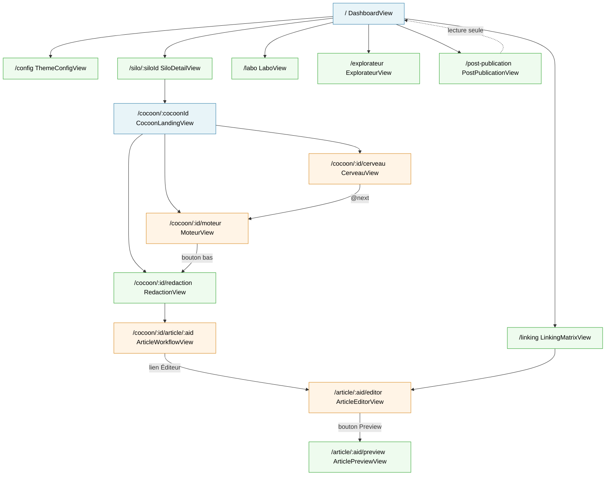
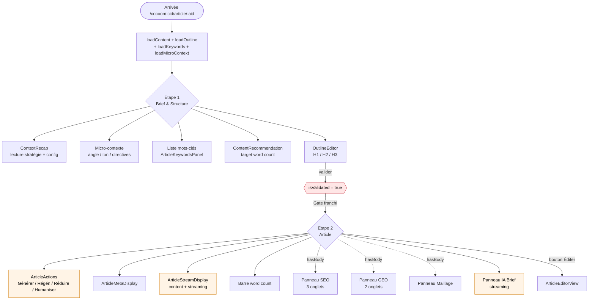
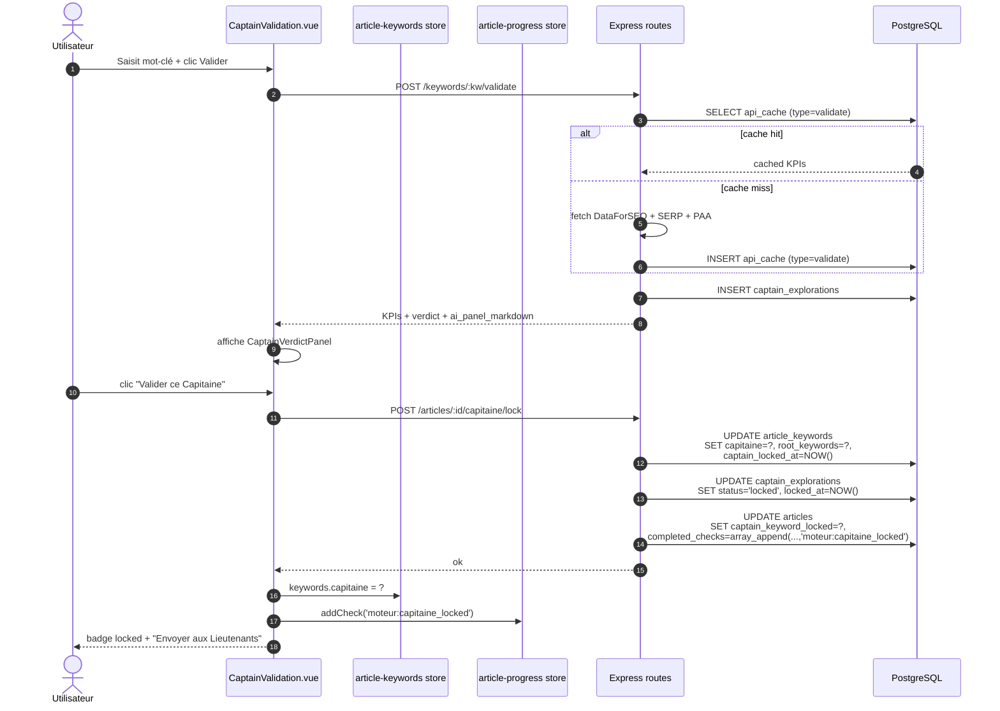
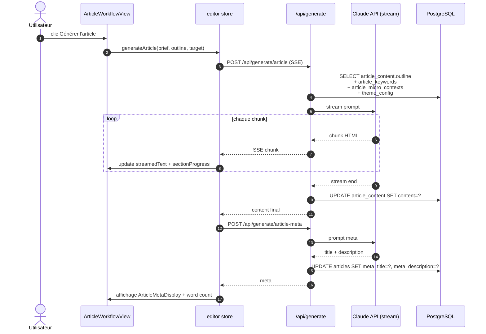
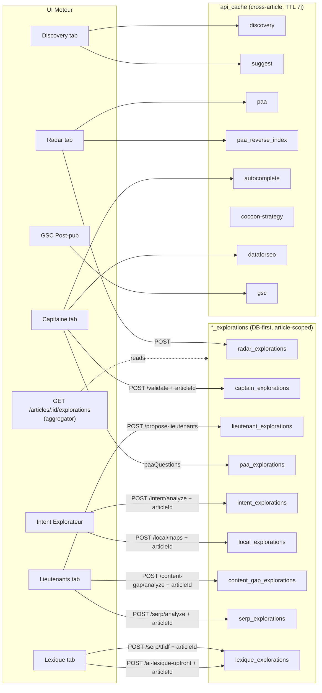

# Guide des Sections Visuelles — Blog Redactor SEO

> **Finalité** : recenser toutes les sections visuelles (blocs fonctionnels, pas les micro-composants) par vue et par workflow.
> Pour chaque section : rôle, déclencheurs, sorties, états visuels, gates/pré-requis.
> Utilisable comme guide utilisateur ET comme base pour la rédaction de tests E2E/fonctionnels.

## Légende

- **Déclencheurs** : ce qui fait apparaître ou remplir la section (montage, action, chargement async, état store, `v-if`, gate).
- **Sorties** : ce que la section produit (affichage, appel API, mutation store, émission d'event, navigation).
- **Gates** : conditions obligatoires pour voir / utiliser la section.
- **États visuels** : loading, streaming, empty, error, locked, cached, fresh.

---

## Table des matières

1. [Vues de navigation](#1-vues-de-navigation)
2. [Workflow Cerveau (stratégie du cocon)](#2-workflow-cerveau-stratégie-du-cocon)
3. [Workflow Moteur (mots-clés)](#3-workflow-moteur-mots-clés)
4. [Workflow Article (brief + rédaction par étapes)](#4-workflow-article-brief--rédaction-par-étapes)
5. [Vues de rédaction (liste, éditeur, preview)](#5-vues-de-rédaction)
6. [Outils transverses (Labo, Explorateur, Maillage, Post-publication)](#6-outils-transverses)
7. [Tableau récapitulatif des gates](#7-tableau-récapitulatif-des-gates)
8. [Cartographie des endpoints API](#8-cartographie-des-endpoints-api)
9. [Check-list tests E2E](#9-check-list-pour-écriture-de-tests-e2e)
10. [Conventions et notes](#10-conventions-et-notes)
11. [Schémas Mermaid](#11-schémas-mermaid)
    - [Modèle de données (ER diagram)](#111-modèle-de-données-er-diagram)
    - [Arborescence de navigation](#112-arborescence-de-navigation-entre-les-vues)
    - [Workflow Moteur — phases et gates](#113-workflow-moteur--phases-et-gates)
    - [Workflow Article — stepper + panneaux](#114-workflow-article--stepper--panneaux)
    - [Workflow Cerveau — wizard 6 étapes](#115-workflow-cerveau--wizard-6-étapes)
    - [Flux de données — Lock Capitaine](#116-flux-de-données--lock-capitaine)
    - [Flux de données — Génération article](#117-flux-de-données--génération-article)
    - [Types de cache unifié (`api_cache`)](#118-types-de-cache-unifié-api_cache)
12. [Mapping UI → Tables DB](#12-mapping-ui--tables-db)

---

## 1. Vues de navigation

### 1.1 `DashboardView` — `/`

Point d'entrée de l'application. Vue d'ensemble du plan éditorial complet.

| Section | Composant | Rôle | Déclencheurs | Sorties | États |
|---|---|---|---|---|---|
| **En-tête du dashboard** | `DashboardView` (inline) + RouterLinks | Titre du thème, accès rapide aux pages satellites (Maillage, GSC, Labo, Explorateur, Config) | Montage ; `silosStore.theme` chargé | Navigation `/linking`, `/post-publication`, `/labo`, `/explorateur`, `/config` | — |
| **Barre de statistiques globales** | `DashboardView` (inline) | 4 tuiles : Silos, Cocons, Articles, Progression % | `v-if="!isLoading && !error && silos.length > 0"` ; computed du store | Affichage seul | Masquée pendant loading/error/empty |
| **Liste des silos + carrousel cocons** | `SiloCard` → `CocoonCard` | Chaque silo avec ses stats + carrousel horizontal des cocons ; création rapide de cocon | `onMounted` → `silosStore.fetchSilos()` ; `AsyncContent` wrapper | Nav `/silo/:id`, `/cocoon/:id` ; création cocon avec auto-nav | loading (3 skeletons) / error (retry) / success |

### 1.2 `ThemeConfigView` — `/config`

Configuration du thème (positionnement entreprise, client type, ton de communication).

| Section | Composant | Rôle | Déclencheurs | Sorties |
|---|---|---|---|---|
| **En-tête + bouton sauvegarde** | inline | Titre + save manuel | `store.isSaving` | `PUT /theme/config` |
| **Analyseur IA texte libre** | inline (textarea + bouton) | Description libre de l'entreprise → pré-remplit les champs via Claude | Saisie + clic "Remplir avec Claude" | `POST /theme/config/parse` → mutation `store.config` → save auto |
| **Perspective 1 — Entreprise** | `CollapsableSection` x2 | Positionnement (promesse, localisation, différenciateurs) + Offres (services, CTA) | Montage ; saisie → `debouncedSave()` (1500 ms) | `PUT /theme/config` via debounce |
| **Perspective 2 — Client type** | `CollapsableSection` x2 | Profil (secteur, taille, budget) + Besoins/douleurs | idem | idem |
| **Perspective 3 — Communication** | `CollapsableSection` | Ton + vocabulaire métier (chips) | idem | idem |

### 1.3 `SiloDetailView` — `/silo/:siloId`

Détail d'un silo et liste de ses cocons.

| Section | Composant | Rôle | Déclencheurs | Sorties | États |
|---|---|---|---|---|---|
| **En-tête + breadcrumb** | `Breadcrumb` | Dashboard > Silo + description | Route param + store silos | Navigation | — |
| **Panneau statistiques du silo** | inline | Tuiles Cocons/Articles + badges par type (Pilier/Intermédiaire/Spécialisé) + badges par statut (à rédiger/brouillon/publié) | `v-if="silo.stats"` | Affichage | — |
| **Liste des cocons** | `AsyncContent` + v-for | Chaque cocon : nom, nb d'articles, barre de progression | `silo.cocons` | Nav `/cocoon/:id` | loading/error/empty "Silo introuvable" |

### 1.4 `CocoonLandingView` — `/cocoon/:cocoonId`

Page d'accueil d'un cocon, porte d'entrée vers les 3 workflows.

| Section | Composant | Rôle | Déclencheurs | Sorties |
|---|---|---|---|---|
| **En-tête + stats cocon** | `Breadcrumb` | Dashboard > Silo > Cocon + nb articles + % complétion | `cocoonsStore.fetchCocoons()` + `articlesStore.fetchArticlesByCocoon(id)` + `keywordsStore.fetchKeywordsByCocoon(name)` | Affichage |
| **Choix du workflow** | `WorkflowChoice` + `AsyncContent` | 3 cartes : **Cerveau** (stratégie), **Moteur** (mots-clés), **Rédaction** (articles). Chaque carte affiche une métrique | `v-if="cocoon"` ; wrapper async | Nav `/cocoon/:id/cerveau` / `moteur` / `redaction` |

---

## 2. Workflow Cerveau (stratégie du cocon)

> **Checks de progression (S3)** — Le workflow Cerveau n'émet **pas encore** de valeurs dans `articles.completed_checks`. Trois constantes sont réservées côté `shared/constants/workflow-checks.constants.ts` pour le jour où ce sera câblé : `CERVEAU_STRATEGY_DEFINED` (= `'cerveau:strategy_defined'`), `CERVEAU_HIERARCHY_BUILT`, `CERVEAU_ARTICLES_PROPOSED`. Le stepper interne (`store.completedSteps`, 0–6) reste le mécanisme actuel de progression visible.

### 2.1 `CerveauView` — `/cocoon/:cocoonId/cerveau`

Orchestrateur. Charge le cocon puis délègue à `BrainPhase`.

**Déclencheurs** : montage → `cocoonsStore.fetchCocoons()` si vide.
**Sorties** : affiche `BrainPhase` ; event `@next` → navigation vers Moteur.
**Gate** : cocon introuvable → message + lien retour.

### 2.2 `BrainPhase` — orchestrateur

Wizard à **6 étapes** (5 Q&A stratégiques + 1 proposition d'articles).

**Montage** : `fetchStrategy(cocoonSlug)` ou `initEmpty()` ; `fetchCocoons`/`fetchSilos`/`fetchConfig` en parallèle.

#### 2.2.1 En-tête + barre de progression

- Titre, sous-titre, `ProgressBar` (0 → 100 % selon `completedSteps/6`), bouton "Continuer vers le Moteur".
- Couleur primaire (en cours) / verte (100 %).
- Clic "Continuer" → emit `@next`.

#### 2.2.2 Stepper 6 phases

- Onglets cliquables : Cible, Douleur, Angle, Promesse, CTA, Articles.
- Clic → `store.goToStep(idx)`.
- États : `active` (primaire), `completed` (vert), `pending` (gris).

#### 2.2.3 Récapitulatif de contexte (collapsible)

**Composant** : `ContextRecap` + `RecapToggle`.
**Rôle** : affiche tout le contexte envoyé à Claude (thème, silo, cocon, config entreprise/client/communication, articles existants, étapes précédentes) pour vérifier la cohérence.
**Sections colorisées** : Entreprise (bleu), Client (ambre), Communication (vert).

#### 2.2.4 Étapes 1 à 5 — Q&A stratégique

**Composant** : `StrategyStep` (rendu si `store.currentStep < 5`).

| Sous-section | Rôle | Déclencheurs | Sorties |
|---|---|---|---|
| **Résultat validé** | Texte validé + edit inline | `stepData.validated` existe | emit `update:stepData` |
| **Carte Q&A principale** | Question + textarea + suggestion Claude + menu "Valider" (mon texte / suggestion / fusion) | `@blur` textarea ; clic "Suggestion" → `POST /strategy/cocoon/:slug/suggest` ; clic "Valider" 3 options | Mutation store `stepData.input/suggestion/validated` ; fusion → re-call suggest avec `mergeWith` |
| **Sous-questions (deepening)** | Liste `SubQuestionCard` — chaque sous-question a sa propre Q&A/validation/suppression | `stepData.subQuestions.length > 0` | `POST /suggest` ; après merge + validation → `POST /enrich` qui enrichit la réponse principale |
| **Bouton "+ approfondir"** | Génère une nouvelle sous-question via Claude | Clic | `POST /strategy/cocoon/:slug/deepen` → `{ question, description }` ; push dans `subQuestions` |

**Gates** :
- Validation impossible si input vide ET suggestion absente.
- Deepen bloqué si suggestion/deepening/merge en cours.

#### 2.2.5 Étape 6 — Proposition d'articles

Rendu si `store.currentStep === 5`. Génère 3 types (Pilier, Intermédiaire, Spécialisé) basés sur les 5 étapes validées.

| Sous-section | Composant | Rôle | Déclencheurs | Sorties |
|---|---|---|---|---|
| **Bouton génération principale** | inline | Lance la génération multi-étapes | Clic → `generateArticleProposals()` | `POST /generate/structure` → `/generate/paa-queries` → `/generate/specialises` ; peuple `store.strategy.proposedArticles` |
| **TopicSuggestions** | `TopicSuggestions` (collapsible) | Liste de sujets optionnels à cocher + contexte libre | Toggle, checkbox, add, remove, regenerate | `POST /strategy/cocoon/:slug/topics` |
| **GenerationStepper** | `GenerationStepper` | Barre 3 étapes (Structure / PAA / Spécialisé) | `generationPhase` | Affichage |
| **3 colonnes d'articles** | `ArticleColumn` x3 + swiper drag-to-scroll | Pilier / Intermédiaire / Spécialisé avec regroupement par parent pour Spécialisés | Scroll, flèches, peek | Navigation UI |
| **Article proposé (row)** | `ProposedArticleRow` | Édition titre/mot-clé/slug, validation, régénération, rattachement parent, composition warnings | Clic checkmark = accept ; kebab = menu régénération ; expand = édition détaillée | Mutations store + régén API + composition badge |
| **AddArticleMenu** | `AddArticleMenu` | Ajouter article : vide / complémentaire (smart) / guidé (textarea) | Clic option | POST API dédié (smart/guided) ou push vide |
| **Warnings + "Tout valider"** | inline | Alertes structurelles (pas de Pilier, composition) + validation globale | `truncationWarning`, `structuralWarnings` | Mute `accepted = true` pour tous |

#### 2.2.6 Navigation bas

Boutons Précédent / Suivant (ou "Terminer" sur step 6).
- Step < 5 → `store.nextStep(slug)`
- Step === 5 → `completedSteps = 6` + `saveStrategy()` + emit `@next` vers Moteur.

---

## 3. Workflow Moteur (mots-clés)

> **Mises à jour produit (22 avril 2026)** — Ce chapitre décrit l'état **post-implémentation** des catégories F, U, E, P, S, D et Cat.7 de l'audit `valiant-swinging-cookie.md` (Sprints 1 à 14). Les changements majeurs :
> - **Flux & UX (F/U)** : Discovery/Radar toujours cliquables (F1), radar cards DB-first (F2), composant partagé `KeywordAssistPanel` (F3), suppression arbitraire de mots dans les racines (F4), pas d'invalidation en cascade à l'unlock Capitaine (F5), suppression de `article_semantic_fields` (F6), nouvel onglet **Finalisation** lecture seule (F7/U7), sections Discovery toujours visibles (U1), règle **TTL 7 jours** sur toutes les régénérations IA (U5), garde anti-pollution UI au changement d'article (U6).
> - **Erreurs (E)** : scan Radar vide → message dans la pile d'activité (E1) ; propositions Lieutenants persistées côté serveur avant `done` (E2) ; quota DataForSEO 429 intercepté → message `error` (E3) ; paramètre `articleId` optionnel sur `POST /keywords/:kw/validate` → persistance serveur-side dans `captain_explorations` (E4, résout le cas "switch d'article en vol").
> - **Performance (P)** : message `info` au lancement d'un scan SERP (P1), pagination simple Discovery > 100 items (P3), suppression du panel IA legacy Lexique (P4).
> - **Sémantique (S)** : Phase ① renommée **« Explorer »** (S1, ID interne `generer` conservé) ; checks `completed_checks` préfixés par workflow (`moteur:*`, `cerveau:*`, `redaction:*` — S3).
> - **DB-first (D1–D5, Sprints 9/11/12)** : prop `radarCards` supprimée, les cartes Radar cochées alimentent directement le basket (D1) ; Radar scan persisté dans `radar_explorations` par article (Sprint 9) ; Lexique multi-keyword avec champ de saisie libre + chips d'explorations passées + hydratation DB (D4, Sprint 11) ; `TabCachePanel` utilise désormais des compteurs réels via `GET /articles/:id/explorations/counts` (D5, Sprint 12) ; modal `UnlockLieutenantsModal` au déverrouillage Capitaine qui propose Garder / Archiver / Annuler (D3, Sprint 12).
> - **Sortie du cache (Cat.7, Sprints 9/10/11/13)** : toutes les données article-specific vivent maintenant dans des tables `*_explorations` dédiées (`radar_explorations`, `intent_explorations`, `local_explorations`, `content_gap_explorations`, `lexique_explorations`, `serp_explorations`). Endpoints split : `GET /articles/:id/explorations` (DB agrégé) + `GET /articles/:id/external-cache` (api_cache partagé). Bouton « Vider cache externe » dans `MoteurView` + `DELETE /articles/:id/external-cache` (Sprint 13).
> - **Pile d'activité transverse (Sprint 5)** : `CostLogPanel` étendu à 4 niveaux (`api | info | warning | error`). Visible globalement, utilisé par E1/E3/P1.
> - **Basket flottant (Sprint 9)** : nouveau composant `BasketFloatingPanel` (coin bas-gauche, au-dessus de `CostLogPanel`) — pill collapsable, panneau slide-in, grouping par source, visible sur tous les onglets Moteur.
>
> **✅ Sprint 15 terminé (2026-04-22) — Cat.7 finalisée**. Les données cross-article (mêmes pour plusieurs articles) vivent maintenant dans **4 nouvelles tables** (`keyword_metrics`, `keyword_intent_analyses`, `keyword_discoveries`, `cocoon_strategies`). Les tables article-scoped redondantes ont été supprimées : `intent_explorations`, `local_explorations`, `content_gap_explorations`, `serp_explorations`. Plus la colonne `captain_explorations.kpis` (remplacée par JOIN). Seul `autocomplete-intent` reste dans `api_cache`. Nouveau service `keyword-queries.service.ts` avec 6 endpoints REST (`/keywords/:kw/usage`, `/keywords/:kw/metrics`, `/cocoons/:id/keyword-metrics`, `/keywords/:kw/intent-for-article/:articleId`, idem pour local et content-gap) qui reconstruit à la volée les informations article×keyword. Zéro double paiement DataForSEO pour un même keyword. Bilan : **17 tables au lieu de 21** mais toutes les capacités produit préservées via helpers JOIN.
>
> **✅ Sprint 16 terminé (2026-04-23) — UX et garde-fous coût**. Refonte transverse par onglet basée sur l'audit utilisateur :
>   - **Cost guard DataForSEO**. Nouveau module `dataforseo-cost-guard.ts` : fenêtre glissante 0.50 USD / 30 min configurable (`DATAFORSEO_COST_BUDGET_USD`, `DATAFORSEO_COST_WINDOW_MIN`). `CostBudgetError` → HTTP 429 via `error-handler` et `respondWithError`. Endpoint `GET /api/dataforseo/cost-status` + badge permanent dans le `CostLogPanel` (pill bleu/rouge "SANDBOX"/"PROD" + barre de progression). Sandbox passé en **opt-in explicite** (`DATAFORSEO_SANDBOX=true`). Retry 50000 réduit de 3 à 1 + jitter aléatoire pour éviter l'hémorragie de crédits. Propagation routes : `keywords/audit`, `keywords/validate-pain`, `keywords/:kw/validate` passent par `respondWithError` au lieu d'un 500 générique.
>   - **Télémétrie DB**. Nouveau type `DbOp` (opération, table, rowCount, ms) retourné par les services `saveCaptainExploration`, `updateCaptainExplorationAiPanel`, `saveLieutenantExplorations`. Routes incluent `dbOps: DbOp[]` dans leur réponse. Côté front, `CostLogPanel` affiche les événements DB (violet + symbole +/~/−) à côté des appels API. Permet de voir immédiatement si une sauvegarde a effectivement atteint la DB.
>   - **Fix critique Sprint 0.1 — Hydratation carousel Capitaine**. `getArticleKeywords` construit désormais `richCaptain.validationHistory` dès qu'au moins une ligne `captain_explorations` existe, même si `article_keywords.capitaine` est vide. Avant : les 29 explorations en DB n'apparaissaient jamais dans le carousel après refresh tant que le capitaine n'était pas verrouillé.
>   - **Discovery (Sprint 1)**. Batch size relevance passé de 40 à 120, concurrency de 3 à 4, pass-2 strict sautée si le pass-1 a rejeté moins de 10 % → coût Claude divisé par ~4. Section "Traduction Sémantique" (PainTranslator) retirée du flux workflow MoteurView (toujours disponible dans LaboView). Bouton "Continuer vers la Rédaction" remplacé par un CTA contextuel "Continuer vers {TabSuivant}" en bas de tous les onglets. Nouveau composable `useDiscoveryToCaptainTrigger` : cliquer sur un mot-clé dans Discovery programme une validation Capitaine + persistance `captain_explorations` après 5 s de grâce (annulable en re-cliquant pour décocher).
>   - **Radar (Sprint 2)**. Toggle PAA N+1/N+2 supprimé (N+2 désormais forcé côté composant, plus de régénération involontaire des mots-clés Discovery). Autocomplete passe en `<details>` collapsed par défaut (la vraie valeur est dans les radar cards en dessous). Suppression du `PhaseTransitionBanner` top-of-view. Nouveau composant `CpcFilterToggle` + helper `matchesCpcFilter` : chips "Avec CPC"/"Sans CPC" mutuellement exclusifs avec état nul (3 états : 00/01/10). Filtre le "Tout" de sélection aussi.
>   - **Capitaine (Sprint 3)**. (1) Nouvelle section "Capitaine verrouillé" épinglée en haut du carousel avec badge + radar card + unlock — plus besoin de re-naviguer le carousel pour retrouver le lock. (2) Bouton régénération ♻ dans `CaptainAiPanel` avec confirmation `window.confirm` ; force `launchAiStream(kw, ..., true)` qui contourne le TTL 7j. (3) Bouton de verrouillage de la radar card centré verticalement. (4) Warnings de composition déplacés dans le header du carousel sous forme d'icône ⚠ + tooltip (au lieu de prendre de la place dans la card). (5) Modification arbitraire d'un mot du carrousel déclenche désormais un `carousel.addEntry` (nouvelle entry dans le carousel pour ce subset) avec debounce naturel 800 ms côté DataForSEO — terme central retiré peut maintenant produire une recherche. (6) KPI mot-clé racine affiche le score `greenCount/totalKpis` au lieu du verdict catégoriel. (7) `VerdictThermometer` compacté : pill inline avec icône + verdict + barre confiance (disparition de la grosse boîte colorée). (8) Section "Questions associées (PAA)" supprimée (redondante avec le collapse de la RadarCard).
>   - **Lieutenant (Sprint 4)**. (1) Skeleton SERP par mot-clé : `serpPendingKeywords` + `serpCurrentKeyword` exposés, affichage d'une liste avec état `done ✓ / active ○ / pending …` et compteur concurrents. (2) `contentGapInsights` rendu en markdown (`marked.parse` + `v-safe-html` + styles `ai-markdown`). (3) Détection blog/non-blog heuristique (URL patterns + domaines connus + nombre de H2 ≥ 5) exposée via `SerpCompetitor.isBlog`. Badges "Blog"/"Autre" inline + filtre "Blogs (n) / Autres (m)" dans `LieutenantSerpAnalysis`. (4) Sites barrés (`fetchError`) ont un tooltip explicite + badge `!` jaune. (5) Sections "Sources IA : questions Google (PAA)" et "Sources IA : clusters Discovery" renommées avec `.section-hint` explicatif — plus de confusion entre "source consultée par l'IA" et "donnée à utiliser directement".


### 3.1 `MoteurView` — `/cocoon/:cocoonId/moteur`

Architecture à **2 phases** (Explorer, Valider) et **6 onglets**. Les décisions sont persistées dans le store Pinia `article-keywords` + `article-progress` (`completedChecks`).

**Phases** :
- **Phase ① Explorer** (S1 — anciennement « Générer ») : onglets `discovery` + `radar` (toujours accessibles — F1).
- **Phase ② Valider** : onglets `capitaine` → `lieutenants` → `lexique` → `finalisation` (récap lecture seule — F7).

**Checks possibles** (S3 — préfixés par workflow, constants exportées depuis `shared/constants/workflow-checks.constants.ts`) :
- Moteur : `moteur:discovery_done`, `moteur:radar_done`, `moteur:capitaine_locked`, `moteur:lieutenants_locked`, `moteur:lexique_validated`.
- Cerveau (imaginés, pas encore produits) : `cerveau:strategy_defined`, `cerveau:hierarchy_built`, `cerveau:articles_proposed`.
- Rédaction (imaginés) : `redaction:brief_validated`, `redaction:outline_validated`, `redaction:content_written`, `redaction:seo_validated`, `redaction:published`.

**Règles produit transversales** :
- **F1 — Cliquabilité permanente** : Discovery et Radar restent consultables à tout moment, même après validation des keywords. Aucun lock banner.
- **F5 — Pas de cascade à l'unlock** : déverrouiller le Capitaine n'invalide ni les Lieutenants ni le Lexique. Une fois ces onglets franchis, ils restent accessibles.
- **U5 — TTL 7 jours sur les appels IA et payants** : avant toute régénération (Capitaine AI Panel, propositions Lieutenants, analyse Lexique, `/serp/analyze`, `/validate`), le serveur vérifie si une donnée persistée existe dans la table `*_explorations` associée et date de moins de 7 jours. Si oui → retour direct depuis DB, pas d'appel externe.
- **U6 — Anti-pollution UI** : les réponses async tardives sont ignorées si l'utilisateur a changé d'article entre-temps (helper `isResponseForCurrentArticle`).
- **E4 — Persistance serveur-side `/validate`** : `POST /keywords/:kw/validate` accepte `articleId` (optionnel). Si fourni, le serveur lit `captain_explorations` d'abord (DB-first, Sprint 13) puis persiste directement les nouvelles validations → les KPIs calculés survivent à un changement d'article en vol.
- **E2 — Persistance serveur-side propositions Lieutenants et Lexique IA** : `POST /keywords/:captain/propose-lieutenants` et `POST /keywords/:kw/ai-lexique-upfront` persistent leur output (respectivement dans `lieutenant_explorations` et `lexique_explorations`) **avant** d'émettre l'événement `done`. Déconnexion client tardive = pas de perte de données.
- **D1 — Basket direct** : cocher une radar card dans `DouleurIntentScanner` ajoute le keyword au basket (source `radar`). Plus de bouton « Envoyer au Capitaine » ni de prop `radarCards` sur `CaptainValidation`. Le basket alimente ensuite les 3 onglets via le `KeywordAssistPanel` (F3).
- **D3 — Modal unlock lieutenants** : au déverrouillage Capitaine, si des lieutenants non-archivés existent, un modal propose **Garder / Archiver / Annuler** (route `POST /articles/:id/lieutenants/archive`, Sprint 12).
- **D4 — Lexique multi-keyword** : le Lexique accepte un keyword arbitraire via le champ « Extraire pour un autre mot-clé ». Chaque exploration est persistée dans `lexique_explorations(article_id, source_keyword, …)` et restaurable via chips.
- **D5 — TabCachePanel DB-first** : les badges « contenu disponible » sont basés sur `GET /articles/:id/explorations/counts` (UNION ALL sur 8 tables `*_explorations`), pas sur des flags `locked`.
- **Cat.7 — Sortie du cache** : les données propres à un article vivent dans des tables `*_explorations` dédiées (6 nouvelles tables créées). Le `api_cache` ne conserve que ce qui est partagé entre articles (autocomplete, PAA, discovery, dataforseo brut). Split endpoint : `GET /articles/:id/explorations` (DB) + `GET /articles/:id/external-cache` (cache partagé) + `DELETE /articles/:id/external-cache` (bouton « Vider cache externe »).
- **Pile d'activité (Sprint 5)** : les événements notables (scan radar vide, lancement SERP, quota DataForSEO 429…) sont poussés dans `useCostLogStore` via `addMessage(level, label, detail?)` et visibles via le panneau flottant global `CostLogPanel`.
- **Basket flottant (Sprint 9)** : `BasketFloatingPanel` (coin bas-gauche, au-dessus de `CostLogPanel`) affiche l'état du panier en permanence avec grouping par source (Radar / Discovery / Pain Translator / …), chips cliquables pour retirer, bouton « Vider ».

### 3.2 Éléments persistants cross-tabs

| Section | Composant | Rôle | Déclencheurs | Sorties |
|---|---|---|---|---|
| **Contexte stratégique** | `MoteurStrategyContext` (collapsible) | Résumé Cible / Douleur / Angle / Promesse / CTA venant du Cerveau | `strategyStore.strategicContext` existe | Affichage |
| **Récap articles du cocon** | `MoteurContextRecap` → `ProgressDots` | Liste des articles suggérés + publiés, groupés par type/statut ; sélection d'article avec smart-nav vers onglet approprié | Montage + auto-fetch progress dots | emit `select(article)` ; cannibalisation warning si 2 articles partagent le même capitaine |
| **Panneau article sélectionné** | `SelectedArticlePanel` | Titre / keyword suggéré / douleur / type éditables | `selectedArticle` non null | emit `title-updated` |
| **Navigation phases/onglets** | `MoteurPhaseNavigation` | Deux groupes de phases + onglets. Onglet `finalisation` grisé tant que `isFullyValidated` est faux. | Montage, changement d'onglet/article | emit `update:activeTab` |
| ~~**PhaseTransitionBanner**~~ | — | **Retiré en Sprint 16 (§2.4)** : le bouton bas-de-page "Continuer vers {TabSuivant}" remplace avantageusement ce banner d'attention. | — | — |
| **TabCachePanel (D5)** | `TabCachePanel` | Chips résumés des onglets ayant des données en cache ou des explorations DB. Depuis Sprint 12, les compteurs viennent de `GET /articles/:id/explorations/counts` (UNION ALL sur 8 tables `*_explorations`). Bouton compagnon « Vider cache externe » → `DELETE /articles/:id/external-cache`. | Au moins un onglet cached OU `count > 0` par type | Nav onglet au clic, purge cache |
| **BasketStrip** | `BasketStrip` | Panier inline de mots-clés collectés (discovery, radar, pain-translator). Visible en haut de tous les onglets Moteur. | `selectedArticle` && `!basketStore.isEmpty` | Mutation basket + chips |
| **BasketFloatingPanel (Sprint 9)** | `BasketFloatingPanel` | Panier flottant coin bas-gauche (au-dessus de `CostLogPanel`). Pill avec compteur → panneau latéral slide-in (300 px) groupé par source. Visible en permanence sur tous les onglets Moteur. | Montage `MoteurView` | Mutation basket (remove, clear) |
| **Navigation bas** | inline | Retour cocon / continuer vers Rédaction | — | Router push |

### 3.3 Onglet `discovery` — Découverte multi-sources

**Composant** : `KeywordDiscoveryTab`. **Toujours accessible** (F1).

| Section | Rôle | Déclencheurs | Sorties | État |
|---|---|---|---|---|
| **Zone saisie + contexte** | Input racine + contexte article (titre, douleur) | Montage (pré-remplit `articleKeyword`/`pilierKeyword`) ; Enter / bouton | `POST /discover` (seed + article context) ; auto-save cache | loading / cache indicator |
| **Filtre pertinence sémantique** | Toggle + scoring Claude 2-passes | Toggle ; découverte complète si activé | `POST /keywords/relevance` (batch) ; masque hors-sujet ; "X hors-sujet masqués" | progress "Filtrage 1/2" + warning si échec |
| **Sections sources (collapsables, U1)** | A-Z, Questions, Intent Modifiers, Prepositions, IA Claude, DataForSEO — chacune avec checkbox, badges multi-source, KPIs. **Toujours visibles** dès l'ouverture, même vides — placeholder « Saisissez un mot-clé pour découvrir les suggestions ». **Pagination P3** : si une section retourne plus de `VISIBLE_THRESHOLD = 100` items, seuls les 100 premiers sont rendus + bouton « Afficher tout (N de plus) / Réduire la liste ». DOM initial borné, pas de dépendance `vue-virtual-scroller`. | Chaque source fetch indépendamment ; `visibleItems(list, key)` + `expandedSections[key]` | Ajout/retrait dans `selectedKeywords` (Set) | loading par source / irrelevant opacity / empty placeholder / liste tronquée + bouton expand |
| **Analyse IA** | Bouton + panel priorités High/Medium/Low | Clic "Analyser" | `POST /keywords/analyze` (batch tous pertinents) ; cards colorées par priorité ; pré-sélection tout coché | loading spinner |
| ~~**Traduction sémantique**~~ | — | **Retiré en Sprint 16** du flow workflow MoteurView. `PainTranslator` reste disponible dans `LaboView` pour expérimenter. | — | — |
| **Sidebar Groupes de mots (sticky)** | Groupes par racine normalisée ; clic → filtre local | `hasResults` | Filtre local des sections sources ; "Filtre actif: [word]" + Effacer | active group highlight |
| **Barre flottante "Send to Radar"** | Count keywords sélectionnés + envoi | `selectedCount > 0` | emit `send-to-radar` ; add au basket (source `discovery`) ; nav `radar` ; emit `check-completed(MOTEUR_DISCOVERY_DONE)` (= `'moteur:discovery_done'`, cf. S3) | slide-up |
| **Trigger pré-validation Capitaine (Sprint 16 — §1.4)** | Cliquer un mot-clé planifie une validation Capitaine 5 s plus tard via `useDiscoveryToCaptainTrigger` | `articleId` fourni (prop) + clic mot-clé sélectionné | `POST /keywords/:kw/validate` puis `POST /articles/:id/captain-explorations` ; annulé si l'utilisateur décoche dans les 5 s | silencieux / logged dans la pile |

### 3.4 Onglet `radar` — Résonance dans l'écosystème Google

**Composant** : `DouleurIntentScanner`.

| Section | Rôle | Déclencheurs | Sorties | État |
|---|---|---|---|---|
| **Inputs de contexte** | Large keyword, specific topic, pain point, PAA depth (N+1 / N+2) | Montage (pré-remplit depuis article) ; changement d'article = reset | `POST /ai/generate-intent-keywords` → `generatedKeywords[]` | loading |
| **Indicateur exploration Radar (DB-first, Sprint 9)** | Si un scan précédent existe pour l'article, score + heat icon + badge « >7j » si stale. | Montage → `GET /articles/:id/radar-exploration/status` (ou fallback `/radar-cache/check` en mode libre sans articleId) ; "Charger" / "Ignorer" | `loadFromRadarCache(articleId)` restaure `scanResult` depuis `radar_explorations` ; emit `scanned` | — |
| **Preview keywords éditables** | Tags removables + bouton "Lancer le scan" | Génération complète ; suppression via × | `POST /radar/scan` (keywords + broad + specific + depth). À la fin du scan, `POST /articles/:id/radar-exploration` persiste l'exploration complète dans la table dédiée (Sprint 9). | — |
| **Écran de chargement** | Phases (Init, Scraping SERP, PAA, ...) + progress X/Y | `isScanning === true` | Affichage | — |
| **Thermomètre global** | `RadarThermometer` : score 0-100 + heat level + verdict | `scanResult` non null | Affichage | — |
| **Section Autocomplete** | Suggestions Google groupées par query + position | `scanResult.autocomplete.totalCount > 0` | Affichage | — |
| **Cartes radar — alimentation basket (D1, Sprint 9)** | `RadarCardCheckable` x N ; cocher/décocher une carte ajoute/retire le mot-clé au basket Moteur (source `radar`). **Plus de bouton « Envoyer au Capitaine »** — hint textuel sous les cartes : « N mot(s)-clé(s) ajouté(s) au panier — retrouvez-les dans les onglets Capitaine, Lieutenants ou Lexique ». | `scanResult.cards` | `basketStore.addKeywords([{keyword, source: 'radar', reasoning, score}])` ; emit `check-completed(MOTEUR_RADAR_DONE)` au premier scan | cards colored per heat |
| **E1 — Empty state silencieux → pile d'activité** | Si `scanResult.cards.length === 0` à la fin du scan, push `warning` dans `useCostLogStore` (label « Radar : aucune résonance détectée », detail « Essayez d'élargir votre pain point ou de tester un mot-clé plus général. »). Pas de bloc d'empty state dans l'onglet lui-même — le message vit dans le panneau d'activité global. | `scan()` résolu avec `cards = []` | `activityLog.addMessage('warning', …)` | entry visible dans la pile flottante |

### 3.5 Onglet `capitaine` — Validation du mot-clé principal

**Composant** : `CaptainValidation`.

| Section | Composant | Rôle | Déclencheurs | Sorties |
|---|---|---|---|---|
| **KeywordAssistPanel (F3)** | `KeywordAssistPanel` (context=`capitaine`) | Liste minimaliste des mots-clés du basket non encore testés, avec bouton "Tester" par ligne. Masquable. | Basket non vide + keywords non déjà présents dans le carousel | Clic "Tester" → pré-remplit input + lance validation |
| **Input + composition warnings** | `CaptainInput` | Input du mot-clé, validation de composition (nb mots, longueur) selon le level | Montage (restaure store) ; saisie live ; Enter / bouton Valider | `POST /keywords/:kw/validate` (body : `{ level, articleTitle, articleId? }`) → `currentResult` ; `carousel.addEntry(kw, level, title, articleId)` — E4 : si `articleId` fourni, la route persiste **côté serveur** dans `captain_explorations` avant de répondre (survit à un switch d'article en vol, idempotent vs. la sauvegarde watcher côté client). |
| **Carousel de validation** | `CaptainCarousel` | Navigation prev/next dans l'historique des validations (hydraté depuis `captain_explorations` au mount) | Ajout d'entry ; clic prev/next | Change `currentResult` |
| **Panel verdict KPIs** | `CaptainVerdictPanel` | 6 KPIs colorés (Volume, KD, CPC, PAA, Intent, Autocomplete) + thermomètre verdict + tooltip seuils par level | `currentResult` change | Affichage ; nogo-feedback si `RED` |
| **Root keywords (F4 — suppression arbitraire)** | `CaptainInteractiveWords` + `KeywordWords` | Chaque mot du capitaine est cliquable individuellement pour le désactiver/réactiver. Plus de troncature droite uniquement. Garde-fou : minimum 2 mots significatifs non-stopwords. Les mots « verrouillés » (impossible à retirer sans violer la règle) ont la classe `kw-word--locked`. | Clic sur un mot → emit `word-toggle` avec `indices: number[]` | Met à jour `activeWordIndices` de l'entry carousel, switch vers la variante correspondante si elle existe en `rootVariants` |
| **Panel IA (streaming, U5)** | `CaptainAiPanel` | Analyse détaillée IA en streaming markdown. **Règle TTL 7 jours** : si `ai_panel_markdown` existe en DB et `exploredAt < 7j`, affichage instantané depuis DB, pas de re-stream Claude. | `currentResult` change ; vérification `shouldRegenerate(exploredAt)` | `/api/keywords/:kw/ai-panel` (SSE) uniquement si stale ou absent |
| **Table seuils référence** | `CollapsableSection` | Tableau Green/Orange pour Pilier/Intermédiaire/Spécifique | Toujours | Affichage |
| **Lock Panel** | `CaptainLockPanel` | Bouton "Valider ce Capitaine" / badge locked + "Envoyer aux Lieutenants" / "Déverrouiller" | Verdict != RED | `POST /articles/:id/capitaine/lock` (keyword + rootKeywords) ; mutation store ; `check-completed(MOTEUR_CAPITAINE_LOCKED)` ; refresh capitainesMap |
| **Modal unlock lieutenants (D3, Sprint 12)** | `UnlockLieutenantsModal` | Au clic « Déverrouiller » **si** des lieutenants non-archivés existent en DB (`GET /articles/:id/explorations` → `lieutenants`), un modal propose : **Garder** (unlock direct, lieutenants conservés) / **Archiver** (`POST /articles/:id/lieutenants/archive` → `status='archived'` bulk update, ils disparaissent du UI) / **Annuler**. | Clic unlock + lieutenants existants | Route archive ou unlock direct |
| **Cartes radar injectées (F2 + D1)** | `RadarKeywordCard` | Cartes du carousel **hydratées depuis `captain_explorations`** (`richCaptain.validationHistory` via `articleKeywordsStore`). Chaque carte = un mot-clé testé, peu importe l'origine (saisie manuelle, pick depuis basket via `KeywordAssistPanel`, restauration historique). **Sprint 9 (D1)** : la prop `radarCards` et le canal emit `cards-selected → send-to-captain` ont été supprimés. | Entries du carousel (DB) | Affichage avec KPIs déjà présents |

**Gate principal** : verdict `!= RED` pour pouvoir lock. **Unlock non-cascadant (F5)** : le déverrouillage n'invalide ni Lieutenants ni Lexique, mais **D3** ajoute un modal de confirmation si des lieutenants existent.

### 3.6 Onglet `lieutenants` — Mots-clés secondaires + structure Hn

**Composant** : `LieutenantsSelection`.

**Gate adouci (F5)** : le gate `isCaptaineLocked` ne s'applique qu'au **premier passage**. Dès que `richLieutenants.length > 0` (au moins une analyse IA a eu lieu), l'onglet devient accessible même si le Capitaine est déverrouillé.

| Section | Composant | Rôle | Déclencheurs | Sorties |
|---|---|---|---|---|
| **KeywordAssistPanel (F3)** | `KeywordAssistPanel` (context=`lieutenants`) | Liste minimaliste des mots-clés du basket non encore présents dans les propositions lieutenants. Bouton "Ajouter" par ligne. | Basket non vide | Clic "Ajouter" → push dans `lieutenantCards` avec `reasoning: 'Proposé depuis votre panier'`, sans appel SERP/IA |
| **Contrôles SERP** | `LieutenantSerpAnalysis` (contrôles) | Slider 3-10 concurrents + bouton "Analyser SERP" + "Tout relancer" | `isCaptaineLocked === true` OU `hasEverAnalyzed` (F5) ; clic analyser | `POST /serp/analyze` (par keyword) ; `serpResultsByKeyword` Map. **P1** : au lancement, push `info` dans la pile d'activité (« Analyse SERP lancée (N mots-clés) · Scraping ~N×10 URLs via DataForSEO »). |
| **Progress multi-étapes** | section steps | Scraping → IA Proposal → Filtering | `currentStep !== 'idle'` | Affichage (✓ done, 🟡 active, ⚪ pending) |
| **Récap résultats SERP** | section `results-summary` | Count concurrents + PAA + badge cache | `serpResult` non null | — |
| **Onglets SERP par keyword** | section `serp-keyword-tabs` | Si capitaine + racines analysés, tabs par keyword avec URLs et position | Multi-keyword SERP | Switch tab local |
| **Propositions IA (streaming, U5 + E2)** | `LieutenantProposals` | Cartes lieutenant recommandées + éliminés (collapsable) avec reasoning + priorité. **Règle TTL 7 jours (U5)** : si `richLieutenants` existent et que tous ont `exploredAt < 7j`, on réhydrate depuis DB via `restoreLockedLieutenants` au lieu de relancer l'IA. **E2 — Persistance serveur-side** : quand l'IA a fini de produire le JSON parsé, la route `POST /keywords/:captain/propose-lieutenants` appelle `saveLieutenantExplorations()` **avant** d'émettre `event: done`. Si la connexion client se coupe à ce moment, la DB a déjà les propositions — l'utilisateur les retrouvera au retour. | Analyse SERP terminée ; vérification `shouldRegenerate` sur chaque lt | `POST /keywords/:captain/propose-lieutenants` (SSE) uniquement si stale ou absent. Persistance backend automatique + client `saveLieutenantExplorationEntries` en résilience (upsert idempotent). |
| **Sélection lieutenants** | Cartes répétées | Checkbox sur chaque proposition recommandée | Click card | Map `selectedCards` ; emit `lieutenants-updated` |
| **Structure Hn** | `LieutenantH2Structure` | Structure H2/H3 recommandée IA + fréquence concurrents | `hnStructure` peuplé | `PUT /articles/:id` avec outline ; sauvegarde `articleKeywordsStore.hnStructure` |
| **Lock Lieutenants** | inline | "Verrouiller Lieutenants" / "Déverrouiller" | `selectedCards.size > 0` && `moteur:capitaine_locked` | `POST /articles/:id/lieutenants/lock` ; mutation store ; `check-completed(MOTEUR_LIEUTENANTS_LOCKED)` |

### 3.7 Onglet `lexique` — Vocabulaire spécialisé (TF-IDF)

**Composant** : `LexiqueExtraction`.

**Gate adouci (F5)** : le gate `isCaptaineLocked` ne s'applique qu'au **premier passage**. Dès que `article_keywords.lexique[].length > 0` (`hasEverValidated`), l'onglet reste accessible même si le Capitaine est déverrouillé.

| Section | Rôle | Déclencheurs | Sorties |
|---|---|---|---|
| **KeywordAssistPanel (F3)** | Liste minimaliste des mots-clés du basket non déjà dans `selectedTerms`. Bouton "Ajouter" par ligne. | Basket non vide | Clic "Ajouter" → push dans `selectedTerms` (Set) |
| **Bouton Extraire (capitaine)** | Lance le calcul TF-IDF pour le keyword capitaine | Auto-trigger si capitaine locked + lexique non validé ; clic manuel. Avant l'appel, `hydrateFromDb()` (Sprint 11) tente de restaurer une exploration fraîche depuis `lexique_explorations`. | `POST /serp/tfidf` body `{ keyword, articleId }` → `tfidfResult`. Si `articleId` fourni, la route serveur persiste DB-first via `saveLexiqueTfidf`. |
| **Champ « Extraire pour un autre mot-clé » (D4, Sprint 11)** | Input libre + bouton "Extraire" pour lancer TF-IDF sur un keyword arbitraire (hors capitaine verrouillé). Permet à Sarah de comparer le lexique de 2 keywords candidats. | Saisie + Enter / bouton, gate : pas locked | Même appel `POST /serp/tfidf` puis `/ai-lexique-upfront` avec le keyword libre ; chaque extraction = row dans `lexique_explorations` |
| **Chips d'explorations passées (D4, Sprint 11)** | Bouton-chip par `source_keyword` déjà exploré pour cet article (listés via `GET /articles/:id/explorations` → `lexique`). Clic = switch l'affichage TF-IDF + iaRecommendations sur cette exploration, sans appel serveur. Chip actif marqué visuellement. | `pastExplorations.length > 0` | Switch local `tfidfResult`, `iaRecommendations`, `activeSourceKeyword` |
| **Résultats TF-IDF (3 catégories)** | Termes groupés obligatoire / différenciateur / optionnel avec score | Extraction terminée | Toggle `selectedTerms` |
| **Analyse IA upfront (streaming, U5 DB-first, E2)** | Recommande quels termes inclure + pré-sélectionne. **Règle TTL 7j (Sprint 11)** : au mount, `hydrateFromDb()` restaure `ai_recommendations` depuis `lexique_explorations` si `exploredAt < 7j`. **E2 appliqué** : le serveur persiste les recommandations via `saveLexiqueAi` **avant** d'émettre `event: done`. | `tfidfResult` chargé ET `iaRecommendations.size === 0` | `POST /keywords/:captain/ai-lexique-upfront` body `{ level, allTerms, cocoonSlug, articleId }` (SSE) → `iaRecommendations` Map + persistance DB |
| **Lock Lexique** | Bouton "Valider le Lexique" / Déverrouiller | `selectedTerms.size > 0` && (`moteur:capitaine_locked` OU `hasEverValidated`) | `POST /articles/:id/lexique/validate` ; mutation store ; `check-completed(MOTEUR_LEXIQUE_VALIDATED)` |

> **P4 — Panel IA legacy supprimé (Sprint 7)** : l'ancien panneau « Avis expert IA — Lexique » qui consommait un second `useStreaming()` a été retiré du composant `LexiqueExtraction.vue`. Le code était mort (`aiStartStream` jamais appelé) mais encombrait le DOM et les tests. Aujourd'hui, `LexiqueExtraction` n'a plus qu'**un seul** `useStreaming()` (IA upfront) — les refs `aiChunks`/`aiIsStreaming`/`aiError`/`aiStartStream`/`aiAbort`, le template `.ai-panel*`, les styles CSS associés et les 6 tests du describe « AI Panel (legacy) » ont été supprimés.

### 3.8 Onglet `finalisation` — Récap lecture seule (F7/U7)

**Composant** : `FinalisationRecap`. **Gate** : `isFullyValidated` (les 3 checks `moteur:capitaine_locked`, `moteur:lieutenants_locked`, `moteur:lexique_validated` doivent être présents). Sinon, message soft-gate « Verrouillez le Capitaine, les Lieutenants et le Lexique pour débloquer la Finalisation ».

Lecture seule totale — aucune édition possible. Les seules interactions sont : (a) déplier/replier une section, (b) cliquer le CTA "Aller à la Rédaction".

| Section | Rôle | Source de données |
|---|---|---|
| **En-tête "✅ Prêt pour la Rédaction"** | Titre vert + sous-titre avec le titre de l'article | Props `selectedArticle.title` |
| **Section Capitaine** (collapse, ouverte par défaut) | Mot-clé capitaine + date de verrouillage | `articleKeywordsStore.keywords.richCaptain.keyword` + `.lockedAt` |
| **Section Lieutenants (N)** (collapse, ouverte par défaut) | Liste des lieutenants verrouillés avec H-level + reasoning (si présent) | `richLieutenants.filter(l => l.status === 'locked')` (fallback : `lieutenants[]`) |
| **Section Lexique (N termes)** (collapse, ouverte par défaut) | Chips avec tous les termes validés | `articleKeywordsStore.keywords.lexique` |
| **CTA "Aller à la Rédaction →"** | Bouton primaire en bas de la vue | Emit `navigate-redaction` → `$router.push('/cocoon/:id/redaction')` |

### 3.9 Smart navigation (computeSmartTab)

À la sélection d'un article dans le Récap, la fonction lit `articles.completed_checks` (préfixés `moteur:*` depuis S3) et choisit l'onglet :
- Aucun check → `capitaine`
- **Les 3 checks `moteur:capitaine_locked` + `moteur:lieutenants_locked` + `moteur:lexique_validated` présents → `finalisation`** (F7 — au lieu de `capitaine` cycle-back)
- `moteur:lieutenants_locked` présent → `lexique`
- `moteur:capitaine_locked` présent → `lieutenants`
- Default → `capitaine`

### 3.10 CTA contextuel bottom-nav (U2-bis)

Dans le bottom-nav de `MoteurView.vue` :
- Si `isFullyValidated && activeTab !== 'finalisation'` → bouton **"✅ Voir la Finalisation"** qui bascule sur l'onglet `finalisation`.
- Sinon → lien classique `RouterLink` **"Continuer vers la Rédaction →"** vers `/cocoon/:id/redaction`.

---

## 4. Workflow Article (brief + rédaction par étapes)

### 4.1 `ArticleWorkflowView` — `/cocoon/:cocoonId/article/:articleId`

**Architecture** : stepper 2 étapes (**Brief & Structure** → **Article**) + **panneaux latéraux** (SEO, GEO, Maillage, IA Brief) actifs uniquement après génération.

### 4.2 Étape 1 — `BriefStructureStep`

| Section | Composant | Rôle | Déclencheurs | Sorties | Gate |
|---|---|---|---|---|---|
| **Contexte stratégique** | `ContextRecap` | Résumé read-only (thème, silo, cocon, articles, config) | Montage + `fetchCocoons/fetchConfig` | Affichage | — |
| **Micro-contexte article** | inline (form) | Angle différenciant, ton, consignes, target word count | Montage → `GET /articles/:id/micro-context` ; `@blur` → `saveMicroContext()` ; "Suggérer par IA" → streaming | `PUT /articles/:id/micro-context` ; `POST /api/generate/micro-context-suggest` (stream) ; `check-completed(REDACTION_BRIEF_VALIDATED)` (= `'redaction:brief_validated'`, cf. S3 — constante définie mais pas encore émise par le code actif) si angle + (tone OU directives) | — |
| **Liste mots-clés du brief** | `KeywordList` + `ArticleKeywordsPanel` | Affichage mots-clés cocon groupés + gestion décisions article (Capitaine, Lieutenants, Lexique) | Montage → `articleKeywordsStore.fetchKeywords(id)` ; édition live + "Sauvegarder" | Mutation store ; `PUT /articles/:id/keywords` ; `POST /keywords/lexique-suggest` | — |
| **Recommandation longueur** | `ContentRecommendation` | Plage recommandée min-max + ajustement ± 100 mots | `briefData.contentLengthRecommendation` non null | emit `update:customTarget` → `saveMicroContext()` | — |
| **Éditeur/Affichage sommaire** | `OutlineEditor` / `OutlineDisplay` / `OutlineNode` | Édition drag-drop H1/H2/H3 + undo/redo 20 niv. ; mode validé read-only | Outline chargé ; modification → mutation store (pas de save auto) | Bouton "Valider" → `PUT /articles/:id/outline` + `isValidated = true` ; "Modifier" → unvalidate | — |
| **Bouton "Continuer vers l'Article"** | inline | Nav étape 2 | `outlineStore.isValidated === true` | `goToStep('article')` | **Outline validé** |

### 4.3 Étape 2 — Génération d'article

| Section | Composant | Rôle | Déclencheurs | Sorties | Gate |
|---|---|---|---|---|---|
| **Toggle Web Search** | inline | Checkbox active/désactive la recherche web pour la génération | Montage | Mutation `editorStore.webSearchEnabled` | — |
| **Barre d'actions article** | `ArticleActions` | Boutons contextuels : Générer / Régénérer / Réduire (si > target + 15 %) / Humaniser | clic par bouton | `POST /api/generate/article` (stream) + `/api/generate/article-meta` + `PUT /articles/:id/content` ; `POST /articles/:id/reduce-sections` ou `/humanize-sections` (itératif) | `isGenerating`/`isReducing`/`isHumanizing` mutex |
| **Progress section** | inline | "Section X/Y — Titre" + barre remplie | `isGenerating && sectionProgress` | Affichage live | — |
| **Message d'erreur** | `ErrorMessage` | Affichage + retry | `editorStore.error && !isGenerating` | Retry call | — |
| **Meta SEO** | `ArticleMetaDisplay` | Meta title (60 c) + description (160 c) read-only + compteurs + warning si dépassement | Montage ; après génération | Affichage ; compte `meta-count--warning` | — |
| **OutlineRecap** | `OutlineRecap` | TOC read-only H1/H2/H3 | Outline chargé | Affichage | — |
| **Contenu article (streaming/final)** | `ArticleStreamDisplay` | HTML en cours ou final ; curseur clignotant en streaming | `(isGenerating && streamedText) || processedContent` | v-safe-html rendu | — |
| **Badges coût API** | `ApiCostBadge` x N | Coût Article / Meta / Réduction / Humanisation | Après chaque opération | Affichage | — |
| **Barre word count** | inline | "X mots / Y cible" + barre colorée (vert ≥ 80 %, orange sinon) | `editorStore.content` non null | Affichage | — |
| **Lien Éditeur complet** | RouterLink | Nav vers `/article/:id/editor` | `editorStore.content && !isGenerating` | Navigation | **Contenu existe** |

### 4.4 Panneaux latéraux

**Gate global** : `hasBody = !!editorStore.content`. Les panneaux SEO/GEO/Maillage sont désactivés (overlay grisé) avant génération.

#### 4.4.1 Panneau SEO

**Composant** : `SeoPanel` avec `useSeoScoring()` (recalcul debounce 300 ms sur mutation content/keywords).

- **Score gauge** : score global 0-100 + méta (word count, temps lecture).
- **Onglet Mots-clefs** (`KeywordsTab` + `SeoKeywordChip`) : Capitaine / Lieutenants / Lexique / NLP terms avec locations détectées (H1, H2, Meta...) en mode `presence` ou compteurs `counter`.
- **Onglet Indicateurs** (`IndicatorsTab`) : accordion 4 cards — `MetaCard`, `StructureCard`, `DensityCard`, `AlertsCard` (cannibalization, density, image alt...). Auto-open alerts si `alertCount > 0`.
- **Onglet SERP Data** (`SerpDataTab`) : overview Volume/KD/CPC/Compétition + collapsibles Top 10 + PAA + mots-clés associés ; refresh manuel → `POST /dataforseo/brief` (forceRefresh).

#### 4.4.2 Panneau GEO

**Composant** : `GeoPanel` avec `useGeoScoring()`.

- **Score gauge** : score global.
- **Onglet Extractibilité** (`ExtractibilityTab`) : `QuestionsCard`, `CapsulesCard`, `StatsCard` — % H2/H3 en questions, answer capsules, stats sourcées.
- **Onglet Lisibilité** (`ReadabilityTab`) : `ParagraphsCard` (alertes paragraphes longs) + `JargonCard` (détections jargon + suggestions de remplacement → emit `apply-suggestion`).

#### 4.4.3 Panneau Maillage

**Composant** : `LinkSuggestions`.
- Première ouverture → `requestSuggestions()` → `POST /api/articles/:id/link-suggestions`.
- Liste d'articles du cocon avec ancre + raison.
- Actions : Accepter (insère lien TipTap), Ignorer, Actualiser.

#### 4.4.4 Panneau IA Brief

- Streaming `POST /api/generate/brief-explain` avec contexte complet (keywords, PAA, competitors, articles cocon, theme config).
- Parsing markdown via `marked.parse()` → v-safe-html.
- Bouton "Relancer l'analyse".

---

## 5. Vues de rédaction

### 5.1 `RedactionView` — `/cocoon/:cocoonId/redaction`

Liste des articles du cocon en lecture seule avec contexte stratégique.

| Section | Composant | Rôle | Déclencheurs | Sorties |
|---|---|---|---|---|
| **Breadcrumb** | `Breadcrumb` | Dashboard > Silo > Cocon > Rédaction | Montage | Nav |
| **Contexte stratégique** | `MoteurStrategyContext` | 5 piliers (cible, douleur, angle, promesse, CTA) | `strategyStore.strategicContext` | Affichage |
| **Récap articles** | `MoteurContextRecap` | Articles suggérés + publiés | Montage + stores | Affichage |
| **Liste articles** | `ArticleList` + `AsyncContent` | Tableau slug / titre / statut | Montage parallèle | Nav `/article/:id/editor` / loading/error/loaded |

### 5.2 `ArticleEditorView` — `/article/:articleId/editor`

Espace de travail complet (éditeur TipTap + panneaux en temps réel).

#### 5.2.1 En-tête (toolbar)

| Section | Composant | Rôle | Déclencheurs | Sorties |
|---|---|---|---|---|
| **Back link + SaveStatusIndicator** | inline + `SaveStatusIndicator` | Retour cocon + statut propre/modifié/sauvegarde | Mutation content (`isDirty`) ; save (`isSaving`) | Nav + feedback icône |
| **Segment control panneaux** | inline (SEO/GEO/Maillage/Blocs) | Toggle panneaux ; **gate** `!hasBody` désactive SEO/GEO/Maillage/Blocs | Clic | Toggle `activePanel` |
| **Boutons action** | inline | Supprimer contenu / Save (Ctrl+S) / Preview | Ctrl+S ou clic | `PUT /articles/:id` ; ouverture preview window ; reset |

#### 5.2.2 Zones de contenu (3 branches)

| État | Section affichée | Déclencheurs | Sorties |
|---|---|---|---|
| **Empty** | Message + 2 CTA (Générer, Retour workflow) | `!content && !isGenerating` | Clic → `handleGenerateArticle()` |
| **Streaming** | `.generation-view` + `ArticleStreamDisplay` (read-only) + `ArticleActions` (abort) + progress bar | `isGenerating && !content` | Streaming SSE |
| **Éditeur** | `EditorToolbar` + `EditorBubbleMenu` + `ArticleEditor` (3 sections : intro/body/conclusion) + overlays actions | Content chargé | Édition live + auto-save 30 s |

#### 5.2.3 Éditeur TipTap

- **`EditorToolbar`** : gras, italique, H2, H3, listes, citations, liens, undo/redo.
- **`EditorBubbleMenu`** : apparaît sur sélection (B, I, lien, ✦ Actions IA).
- **`ArticleEditor`** : 3 `useEditor` indépendants (intro / body / conclusion). Extensions : StarterKit, Link, Placeholder, ContentValeur, ContentReminder, AnswerCapsule, InternalLink, DynamicBlock, DynamicBlockDrop, DragHandle. Split par H2.

#### 5.2.4 Actions IA contextuelles

| Section | Composant | Rôle | Déclencheurs | Sorties |
|---|---|---|---|---|
| **ActionMenu** | `ActionMenu` | Modal groupé (Réécriture / Enrichissement / Structure) avec 9 actions | BubbleMenu → "✦ Actions IA" | `POST /api/generate/action` (SSE) ; `showActionResult = true` |
| **ActionResult** | `ActionResult` | Résultat streamé + Accept/Reject + curseur pulsé | Streaming SSE | Accept → remplace sélection ; Reject → discard |
| **ArticlePicker** | `ArticlePicker` | Sélecteur article pour lien interne | Action "Lien interne" sélectionnée | Insère marque TipTap |

#### 5.2.5 Panneaux latéraux (idem 4.4 + Blocs)

- **SEO / GEO / Maillage** : mêmes composants et rôles qu'en §4.4.
- **Blocs** (`BlocksPanel`) : palette drag-drop de blocs statiques (HTML) et dynamiques (IA-generated). Drop sur TipTap → insertion directe ou placeholder + `POST /generate/action` (streaming replacement).

### 5.3 `ArticlePreviewView` — `/article/:articleId/preview` (`hideNavbar`)

Rendu public de l'article.

| Section | Composant | Rôle | Déclencheurs | Sorties |
|---|---|---|---|---|
| **Preview toolbar** | inline | Back + titre + "Exporter HTML" + statut publication | Montage → `GET /preview/:id` ; clic export | Download blob + `PUT /articles/:id/status = 'publié'` |
| **iframe sandbox** | `<iframe :srcdoc="previewHtml" sandbox="allow-same-origin">` | Rendu HTML isolé | `previewHtml` non null | Affichage |
| **États** | inline | loading / error / retry | Failures API | Retry |

---

## 6. Outils transverses

### 6.1 `LaboView` — `/labo`

Terrain d'expérimentation libre sans contexte article.

| Section | Composant | Rôle | Déclencheurs | Sorties | Cas d'usage |
|---|---|---|---|---|---|
| **Barre de recherche + type article** | inline | Saisie keyword + sélection Pilier/Intermédiaire/Spécialisé | Saisie + bouton Rechercher (>= 2 chars) | Active les onglets + reset Discovery store | Tester vite un mot-clé |
| **Onglet Discovery** | `KeywordDiscoveryTab` | Variantes multi-sources + filtrage pertinence | Montage onglet | Idem §3.3 | Explorer univers sémantique |
| **Onglet Douleur** | `PainTranslator` | Traduire douleur client → mots-clés | Submit textarea | `POST /keywords/pain-translate` + checkboxes | Traduire besoin client |
| **Onglet Verdict (Capitaine)** | `CaptainValidation` | KPI + composition + verdict GO/NO-GO + historique | Input + Validate | Idem §3.5 (standalone) | Valider un mot-clé isolé |

### 6.2 `ExplorateurView` — `/explorateur`

Exploration méthodique avec contexte cocon et Local.

| Section | Composant | Rôle | Déclencheurs | Sorties |
|---|---|---|---|---|
| **Barre de recherche** | inline | Point d'entrée keyword → active 3 onglets (Intention / Audit / Local) | Saisie + Explorer | Reset stores Intent/Local |
| **Onglet Intention** | `ExplorationInput` + `AutocompleteValidation` + `IntentStep` + `ExplorationVerdict` | 4 sous-étapes : input → autocomplete (existence + certitude) → intent (classification, SERP modules, top 5, PAA, reco) → verdict exécutif | Montage + historique (chips) | emit `addToAudit` ; `POST /intent/analyze` |
| **Onglet Audit** | input cocon + `KeywordAuditTable` + `KeywordComparison` + `KeywordEditor` + `DiscoveryPanel` | Audit multi-critères : summary cards par type, tableau trié, redondances, replacements, ajout manuel, découverte batch | Saisie cocon + "Charger l'audit" | `POST /audit/cocoon/:name` (via store) ; gestion CRUD mots-clés |
| **Onglet Local** | `LocalComparisonStep` + `MapsStep` | Local vs national (volume, KD, CPC, compétition) + deltas colorés ; Local Pack + review gap gauge | Montage onglet ; changement keyword | `analyzeLocal()` + `analyzeMaps()` |

### 6.3 `LinkingMatrixView` — `/linking`

Matrice + panneaux d'analyse du maillage interne.

| Section | Composant | Rôle | Déclencheurs | Sorties |
|---|---|---|---|---|
| **En-tête + stats** | inline | Back + totalLinks + orphanCount | Montage | Affichage |
| **Matrice de maillage** | `LinkingMatrix` | Tableau 2D source × cible ; code couleur (bleu = lien, vert = même cocon, gris = self) ; headers sticky ; tooltip ancres | Stores `linkingStore.matrix` + `cocoonsStore.cocoons` | Affichage + hover tooltip |
| **Sidebar Orphelins** | `OrphanDetector` | Articles sans lien entrant, avec badge type + cocoon ; clic → editor | Montage | RouterLink + badge count |
| **Sidebar Diversité ancres** | `AnchorDiversityPanel` | Ancres répétées > 3× (alerte SEO) | Computed dans store | Affichage alertes + count ambre |
| **Sidebar Cross-cocon** | `CrossCocoonPanel` | Paires d'articles à lier entre cocons | Computed | Affichage opportunités + count bleu |

### 6.4 `PostPublicationView` — `/post-publication`

Monitoring GSC.

| Section | Composant | Rôle | Déclencheurs | Sorties |
|---|---|---|---|---|
| **Section connexion GSC** | inline | Auth OAuth si non connecté : "Connecter" + "Vérifier" | Montage → `gscStore.checkConnection()` ; clic utilisateur | Mutation `isConnected` ; popup OAuth |
| **Contrôles (URL + période)** | inline (inputs + select) | Saisie propriété GSC (persistée localStorage) + période 7/30/90j + Actualiser | Montage + changement period + clic Actualiser | `gscStore.fetchPerformance(siteUrl, start, end)` |
| **Tableau performances** | inline | Agrégation par page : clics, impressions, CTR, position moyenne ; tri par clics ; position colorée (≤10 vert, ≤30 orange, >30 rouge) | `gscStore.performance` prêt | Affichage trié |

---

## 7. Tableau récapitulatif des gates

| Section / Action | Condition d'accès | Dépendance |
|---|---|---|
| Lock Capitaine | Verdict `!= RED` (`canLock`) | Validation KPI |
| Lock Lieutenants | `selectedCards.size > 0` ET (`moteur:capitaine_locked` OU `hasEverAnalyzed`) | F5 — gate adouci après 1re analyse IA |
| Lock Lexique | `selectedTerms.size > 0` ET (`moteur:capitaine_locked` OU `hasEverValidated`) | F5 — gate adouci après 1re validation |
| Onglet Discovery/Radar (Moteur) | **Aucun gate — toujours cliquable (F1)** | — |
| Onglet Finalisation (Moteur) | `isFullyValidated` (3 checks `moteur:*` verts) | F7 — nouveau |
| CTA "Voir la Finalisation" bottom-nav | `isFullyValidated && activeTab !== 'finalisation'` | U2-bis |
| Régénération IA (Capitaine AI Panel, Lieutenants IA, Lexique) | Donnée persistée absente OU `shouldRegenerate(exploredAt, 7j)` | U5 — règle TTL 7 jours |
| Appel DataForSEO (`/validate`, `/serp/analyze`, `/local/maps`, `/compare-local`) | Si `articleId` fourni : table `*_explorations` absente OU `exploredAt > 7j` ; sinon `api_cache` legacy | Sprint 13 — DB-first sur les données payantes |
| Appel Claude Lexique IA upfront | Row `lexique_explorations` absente OU `exploredAt > 7j` | Sprint 11 — hydratation DB au mount |
| Modal unlock lieutenants (D3) | Clic unlock Capitaine ET lieutenants non-archivés existent en DB | Sprint 12 |
| Bouton « Vider cache externe » | `selectedArticle` non null | Sprint 13 — purge `api_cache` par slug capitaine |
| Alimentation basket depuis Radar (D1) | Coche/décoche d'une `RadarCardCheckable` — pas de gate | Sprint 9 |
| Word-toggle racine (F4) | Suppression autorisée uniquement si ≥ 2 mots significatifs non-stopwords restants | `FRENCH_STOPWORDS` |
| Push dans la pile d'activité | `useCostLogStore.addMessage(level, label, detail?)` — level ∈ `info`/`warning`/`error` | Sprint 5 |
| Message pile automatique sur erreur API | Code d'erreur dans `KNOWN_ERROR_CODES` (ex. `DATAFORSEO_QUOTA_EXCEEDED`) | Sprint 6 E3 |
| Bouton "Valider sommaire" | Outline non vide | `outlineStore.outline != null` |
| Nav Étape 2 (Article) | `outlineStore.isValidated === true` | Outline validé |
| Bouton "Générer Article" | `!hasContent && isOutlineValidated` | Outline validé + no content |
| Bouton "Réduire" | `hasContent && canReduce && !isReducing && !isGenerating` | Delta > 15 % au-dessus cible |
| Bouton "Humaniser" | `hasContent && !isReducing && !isGenerating` | Content existe |
| Panneaux SEO/GEO/Maillage/Blocs (Editor) | `hasBody = !!editorStore.content` | Article généré |
| Smart Tab | selon `completedChecks` | Article sélectionné |
| Cerveau — Validation étape | Input non vide OU suggestion existe (`canValidate`) | — |
| Cerveau — Deepen | Pas de suggestion/deepening/merge en cours (`canDeepen`) | — |
| Cerveau — Finir brainstorm | `completedSteps === 6` | Tous les steps complétés |
| Editor — Save | `isDirty && !isSaving` | — |
| Editor — Preview | `metaTitle && metaDescription` | Meta générées |
| Auto-save (30s) | `isDirty && !isSaving && !isGenerating && !isReducing && !isHumanizing` | — |
| GSC — Contrôles | `isConnected === true` | Auth OAuth |

---

## 8. Cartographie des endpoints API

### 8.1 Stratégie (Cerveau)

| Endpoint | Méthode | Usage |
|---|---|---|
| `/strategy/cocoon/:slug` | GET | Charger stratégie |
| `/strategy/cocoon/:slug/suggest` | POST | Suggestion Claude (+ `mergeWith` pour fusion) |
| `/strategy/cocoon/:slug/deepen` | POST | Générer sous-question |
| `/strategy/cocoon/:slug/enrich` | POST | Enrichir réponse principale avec sous-Q |
| `/strategy/cocoon/:slug/topics` | POST | Générer sujets suggérés |
| `/generate/structure` | POST | Pilier + Intermédiaire |
| `/generate/paa-queries` | POST | Paa pour enrichir |
| `/generate/specialises` | POST | Spécialisés |
| `/strategy/cocoon/:slug/save` | PUT | Sauvegarde globale |

### 8.2 Moteur (mots-clés)

| Endpoint | Méthode | Usage |
|---|---|---|
| `/discover` | POST | Discovery multi-sources |
| `/keywords/relevance` | POST | Scoring pertinence |
| `/keywords/analyze` | POST | Analyse IA + ranking |
| `/keywords/pain-translate` | POST | Pain → keywords |
| `/ai/generate-intent-keywords` | POST | Keywords intent (Radar) |
| `/radar-cache/check?seed=` | GET | **Legacy** — check cache Radar par seed (mode libre ExplorateurView). Déprécié par les endpoints `/articles/:id/radar-exploration*` ci-dessous. |
| `/radar/scan` | POST | Scan PAA + Autocomplete |
| `/articles/:id/radar-exploration` | GET / POST / DELETE | **Sprint 9** — CRUD sur la table `radar_explorations` (1 row par article). GET retourne l'exploration complète, POST upsert, DELETE purge. |
| `/articles/:id/radar-exploration/status` | GET | **Sprint 9** — version lightweight (score + heatLevel + `isFresh` calculé sur TTL 7j) pour TabCachePanel et indicateur UI. |
| `/keywords/:kw/validate` | POST | KPIs + verdict ; body `{ level, articleTitle?, articleId? }`. **E4 + Sprint 13** : si `articleId` fourni, lecture DB-first dans `captain_explorations` (retour direct si frais <7j) puis persistance automatique (idempotent). |
| `/keywords/:kw/ai-panel` | GET (SSE) | Analyse IA streaming |
| `/articles/:id/capitaine/lock` | POST | Lock Capitaine |
| `/serp/analyze` | POST | **Sprint 13** — body `{ keyword, topN, articleLevel, articleId? }`. Si `articleId` fourni, lit DB-first (`serp_explorations`) puis persiste avant de répondre. Sinon, fallback api_cache (mode libre). |
| `/serp/tfidf` | POST | **Sprint 11** — body `{ keyword, articleId? }`. Lit DB-first (`serp_explorations`), fallback `api_cache[serp]`. Persiste le TF-IDF via `saveLexiqueTfidf` si `articleId`. |
| `/keywords/:captain/propose-lieutenants` | POST (SSE) | IA propositions. **E2** : persistance serveur-side dans `lieutenant_explorations` **avant** l'événement `done`. |
| `/articles/:id/lieutenants/lock` | POST | Lock Lieutenants |
| `/articles/:id/lieutenants/archive` | POST | **Sprint 12 (D3)** — Bulk update `status='archived'` sur tous les lieutenants non-archivés de l'article. Appelé par le modal `UnlockLieutenantsModal` au choix « Archiver ». |
| `/keywords/:captain/ai-lexique-upfront` | POST (SSE) | IA recommandation lexique. **Sprint 11** : body inclut `articleId?` ; persistance dans `lexique_explorations.ai_recommendations` **avant** l'événement `done` (pattern E2). |
| `/articles/:id/lexique/validate` | POST | Lock Lexique |
| `/articles/:id/progress/check` | POST | Ajouter check (valeur préfixée — ex. `moteur:capitaine_locked`) |
| `/articles/:id/progress/uncheck` | POST | Retirer check (valeur préfixée) |
| `/articles/:id/progress` | GET | État progression |
| `/articles/:id/explorations` | GET | **Sprint 10** — agrégat DB-first de toutes les tables `*_explorations` de l'article (radar, captain, lieutenants, paa, intent, local, contentGap, lexique). Ne fait aucun appel externe. |
| `/articles/:id/explorations/counts` | GET | **Sprint 12 (D5)** — compteurs UNION ALL sur 8 tables `*_explorations`. Utilisé par TabCachePanel. |
| `/articles/:id/external-cache` | GET / DELETE | **Sprint 10 + 13** — GET lit `api_cache` partagé (autocomplete…) pour l'article. DELETE supprime les rows api_cache dont le slug matche le capitaine (bouton « Vider cache externe »). |
| `/articles/:id/cached-results` | GET | **Deprecated** — alias hybride (DB + cache legacy) conservé pour transition ; à supprimer quand les consommateurs externes auront migré. |
| `/cocoons/:name/capitaines` | GET | Cannibalisation |

**Codes d'erreur connus (E3)** — remontés via `respondWithError()` côté serveur, interceptés par `api.service.ts::reportKnownError()` côté client, et poussés automatiquement dans la pile d'activité (niveau `error`) :

| Code | HTTP | Source | Message utilisateur |
|---|---|---|---|
| `DATAFORSEO_QUOTA_EXCEEDED` | 429 | `DataForSeoQuotaError` (3 retries épuisés sur HTTP 429 DataForSEO) | Quota DataForSEO atteint. Rechargez vos crédits puis relancez. |
| `VALIDATION_ERROR` | 400 | Zod schemas (paramètres invalides) | Message issu du schéma |
| `NOT_FOUND` | 404 | ressource inexistante | — |
| `INTERNAL_ERROR` | 500 | fallback | Message serveur |

### 8.3 Article (brief + génération)

| Endpoint | Méthode | Usage |
|---|---|---|
| `/articles/:id` | GET / PUT | Charger / sauver article |
| `/articles/:id/micro-context` | GET / PUT | Micro-contexte |
| `/api/generate/micro-context-suggest` | POST (SSE) | Suggestion IA micro-context |
| `/articles/:id/keywords` | GET / PUT | Décisions mots-clés article |
| `/keywords/lexique-suggest` | POST | Suggérer lexique |
| `/dataforseo/brief` | POST | Données DFS brief (+ forceRefresh) |
| `/articles/:id/outline` | PUT | Valider sommaire |
| `/api/generate/article` | POST (SSE) | Génération article |
| `/api/generate/article-meta` | POST | Meta title + description |
| `/articles/:id/content` | PUT | Sauvegarde contenu |
| `/articles/:id/reduce-sections` | POST | Réduction itérative |
| `/articles/:id/humanize-sections` | POST | Humanisation itérative |
| `/api/generate/action` | POST (SSE) | Action contextuelle IA |
| `/api/generate/brief-explain` | POST (SSE) | Panel IA brief |
| `/api/articles/:id/link-suggestions` | POST | Suggestions liens internes |
| `/articles/:id/status` | PUT | Marquer publié |
| `/preview/:id` | GET | HTML preview |

### 8.4 Outils transverses

| Endpoint | Méthode | Usage |
|---|---|---|
| `/intent/analyze` | POST | **Sprint 10** — Intent analysis. Body accepte `articleId?` ; si fourni, persiste DB-first dans `intent_explorations`. |
| `/audit/cocoon/:name` | POST | Audit cocon |
| `/keywords/compare-local` | POST | **Sprint 10** — Comparaison local/national. Body accepte `articleId?` → persiste dans `local_explorations.comparison`. |
| `/local/maps` | POST | **Sprint 10** — Détection Local Pack. Body accepte `articleId?` → persiste dans `local_explorations.listings/review_gap`. |
| `/content-gap/analyze` | POST | **Sprint 10** — Analyse content gap. Body accepte `articleId?` → persiste dans `content_gap_explorations`. |
| `/linking/matrix` | GET | Matrice maillage |
| `/linking/orphans` | GET | Articles orphelins |
| `/gsc/auth` | GET | OAuth GSC |
| `/gsc/check` | GET | Check connexion |
| `/gsc/performance` | POST | Performances par page |
| `/theme/config` | GET / PUT | Configuration thème |
| `/theme/config/parse` | POST | Parsing texte libre IA |

---

## 9. Check-list pour écriture de tests E2E

Chaque section du guide peut servir de **base de scénario** :

1. **Setup** : route + fixtures (cocon, article, keywords).
2. **Assertion de rendu initial** : sections visibles selon gates.
3. **Trigger principal** : action utilisateur ou mount → vérifier appel API + update UI.
4. **États transitoires** : loading / streaming / error.
5. **Gates** : vérifier qu'un onglet/bouton est bien bloqué tant que le pré-requis n'est pas rempli (ex: Lexique bloqué sans Capitaine).
6. **Persistance** : refresh de la page → data cached depuis PG / session.
7. **Side effects** : `completedChecks` mis à jour, smart-nav, cannibalisation détectée, banner transition.

Exemple de cases de test générables depuis le guide :

- *Moteur — Discovery → Radar* : renseigner seed, lancer scan, sélectionner keywords, envoyer au radar, vérifier `moteur:discovery_done` persisté.
- *Moteur — Lock Capitaine* : valider keyword avec verdict GO, cliquer Lock, vérifier `moteur:capitaine_locked` + refresh capitainesMap + onglet Lieutenants accessible.
- *Article — Gate Étape 2* : tant qu'outline non validé, bouton "Continuer" masqué ; valider outline → bouton apparaît.
- *Editor — Panneaux désactivés* : article vide → SEO/GEO/Maillage grisés ; générer article → panneaux actifs.
- *Cerveau — Deepen* : cliquer "+", nouvelle sous-question apparaît, répondre, valider, vérifier enrichissement de la réponse principale.
- *Explorateur — Audit cocon* : saisir nom cocon, "Charger l'audit", vérifier tableau + summary + détection redondances.
- *Post-publication — GSC* : mock connexion OAuth, fetch performance 30j, tableau trié par clics descending.
- *Moteur — E1 scan radar vide* : lancer un scan qui retourne 0 cards, vérifier une entrée `warning` dans `useCostLogStore.entries`.
- *Moteur — E2 lieutenants persistance* : mock SSE `propose-lieutenants` qui résout mais déconnecte après `done`, vérifier que `lieutenant_explorations` contient bien les propositions côté DB.
- *Moteur — E3 quota 429* : mock `/validate` qui renvoie `{ status: 429, error: { code: 'DATAFORSEO_QUOTA_EXCEEDED' } }`, vérifier entrée `error` dans la pile avec message "Quota DataForSEO atteint".
- *Moteur — E4 switch article en vol* : appeler `POST /keywords/:kw/validate` avec `articleId=1`, vérifier immédiatement après la réponse que `captain_explorations` a une ligne pour `article_id=1, keyword=kw`.
- *Moteur — P3 pagination Discovery* : charger une source avec 250 items, vérifier que le DOM contient 100 `<li>` + bouton « Afficher tout (150 de plus) ». Cliquer le bouton → 250 `<li>` + bouton devient « Réduire la liste ».
- *Moteur — S3 préfixes* : vérifier que chaque `completed_checks` stocké commence par `moteur:` / `cerveau:` / `redaction:` (regex `/^(moteur|cerveau|redaction):/`).
- *Moteur — D1 alimentation basket* : cocher une `RadarCardCheckable` dans `DouleurIntentScanner` → vérifier que `basketStore.keywords` contient un item `{ source: 'radar', keyword: <kw> }`. Décocher → retrait. Aucun emit `cards-selected` ou bouton « Envoyer au Capitaine » n'existe.
- *Moteur — Sprint 9 Radar DB-first* : POST `/articles/:id/radar-exploration` puis GET → vérifier la row. GET `/status` retourne `{ exists: true, isFresh: true, globalScore, heatLevel }`. Après 8 jours simulés, `isFresh: false`.
- *Moteur — Sprint 11 Lexique multi-keyword* : extraire pour « coach sportif Paris » puis « préparateur physique Paris » → `GET /articles/:id/explorations` retourne 2 rows dans `lexique`. Clic sur une chip passée → affichage switch sans nouvel appel serveur.
- *Moteur — Sprint 11 Lexique hydratation DB* : simuler une row fraîche en DB → au mount de `LexiqueExtraction`, `tfidfResult` et `iaRecommendations` sont restaurés sans appel `/serp/tfidf` ni `/ai-lexique-upfront`.
- *Moteur — D3 modal unlock lieutenants* : 12 lieutenants en DB → clic unlock Capitaine → modal visible. Clic « Archiver » → `POST /articles/:id/lieutenants/archive` → 12 rows ont `status='archived'`. Clic « Garder » → rien n'est modifié côté DB, unlock direct. « Annuler » → ni unlock ni archive.
- *Moteur — D5 compteurs TabCachePanel* : `GET /articles/:id/explorations/counts` renvoie `{ captain: 6, lieutenants: 12, lexique: 2, ... }` → TabCachePanel affiche « 6 exploration(s) » sous Capitaine même sans lock.
- *Moteur — Sprint 13 DB-first SERP/validate* : `POST /serp/analyze { keyword, articleId }` avec une row fraîche → pas de fetch DataForSEO, réponse immédiate `fromCache: true`. Idem pour `/validate`.
- *Moteur — Sprint 13 Vider cache externe* : `DELETE /articles/:id/external-cache` → supprime les rows `api_cache` dont le slug matche le capitaine ; les tables `*_explorations` restent intactes.
- *Moteur — Sprint 14 useArticleResults split* : mock `GET /articles/:id/explorations` + `GET /articles/:id/external-cache`, vérifier que les deux sont appelés en parallèle au changement d'article.

---

## 10. Conventions et notes

- **Stores clés** : `silosStore`, `cocoonsStore`, `articlesStore`, `keywordsStore`, `articleKeywordsStore`, `articleProgressStore`, `strategyStore`, `briefStore`, `outlineStore`, `editorStore`, `seoStore`, `geoStore`, `linkingStore`, `gscStore`, `themeConfigStore`, `cocoonStrategyStore`, `basketStore`, `costLogStore` (activity log étendu — Sprint 5).
- **Composables clés** : `useSeoScoring`, `useGeoScoring`, `useInternalLinking`, `useStreaming`, `useAutoSave`, `useKeyboardShortcuts`, `useKeywordDiscoveryTab`, `useCapitaineValidation`, `usePanelToggle`, `useArticleProposals`.
- **Cache** : le cache est désormais en PostgreSQL (`server/db/cache-helpers.ts` : `getCached`/`setCached` + `slugify`). Les anciennes références à `server/utils/cache` ou `json-storage` pour les caches de workflow sont obsolètes.
- **Sauvegardes** : pattern `debouncedSave` (1500 ms) pour les formulaires longs (ThemeConfig, micro-contexte). Éditeur : auto-save toutes les 30 s si `isDirty`.
- **Streaming** : SSE pour la génération d'article, actions IA, suggestions stratégie et lexique. Indicateur visuel : curseur clignotant + badge streaming.
- **Cannibalisation** : détectée automatiquement via `capitainesMap` ; warning affiché dans `MoteurContextRecap`.
- **Lazy tabs (Moteur)** : `v-if="visitedTabs[tab]"` pour ne créer qu'une fois + `v-show` pour préserver l'état.
- **Pile d'activité globale (Sprint 5)** : composant transverse `CostLogPanel` (`Teleport to="body"`, coin bas-gauche) alimenté par `useCostLogStore`. Supporte 4 niveaux d'entrées :
  - `api` (existant) : coût d'un appel Claude (model, tokens in/out, coût estimé) via `addEntry(label, ApiUsage)`. Pipeline câblé dans `useStreaming.ts::pushCostEntry`.
  - `info` / `warning` / `error` (nouveau — Sprint 5) : messages utilisateur via `addMessage(level, label, detail?)`. Utilisés par E1 (scan radar vide, `warning`), E3 (quota DataForSEO 429, `error` automatique via `api.service.ts::reportKnownError`), P1 (lancement scan SERP, `info`).
  - Panneau : icône colorée par niveau (info bleu, warning orange, error rouge), détail optionnel sous le label, bouton suppression par entrée, bouton « Effacer » global.
- **Préfixage des checks (S3)** : toute valeur de `articles.completed_checks` passe désormais par les constantes de `shared/constants/workflow-checks.constants.ts`. Format : `'moteur:…'`, `'cerveau:…'`, `'redaction:…'`. Ne jamais hardcoder la chaîne. Ajouter un nouveau check = ajouter une constante + mettre à jour l'array de workflow correspondant (`MOTEUR_CHECKS` / `CERVEAU_CHECKS` / `REDACTION_CHECKS`).
- **Gestion erreurs serveur (E3)** : les erreurs connues (ex. quota DataForSEO) remontent avec un code stable (`DATAFORSEO_QUOTA_EXCEEDED`) via `server/utils/api-error.ts::respondWithError`. Côté client, `src/services/api.service.ts::reportKnownError` mappe ces codes vers des entrées `error` de la pile d'activité. Ajouter un nouveau code connu = étendre `KNOWN_ERROR_CODES`.
- **Pattern `*_explorations` (Sprints 9-13)** : chaque nouvelle donnée article-specific doit suivre le pattern existant :
  1. Table PostgreSQL `{domain}_explorations(id, article_id REFERENCES articles(id) ON DELETE CASCADE, keyword|source_keyword|…, payload JSONB, explored_at TIMESTAMPTZ DEFAULT NOW(), UNIQUE(article_id, keyword))`.
  2. Service `server/services/{domain}/{domain}-exploration.service.ts` avec `get`, `list`, `save`, `delete`.
  3. Route CRUD ou intégration dans la route métier (accepter `articleId` optionnel, persister DB-first si fourni).
  4. Hydratation via `GET /articles/:id/explorations` (l'endpoint agrégé doit être étendu pour inclure le nouveau type).
  5. Comptage via `GET /articles/:id/explorations/counts` (ajouter le UNION ALL).
- **Règle DB-first (Sprints 11+13)** : pour toute donnée article-specific payante (DataForSEO, Claude), la route serveur doit :
  1. Vérifier `*_explorations` en premier si `articleId` fourni.
  2. Si row fraîche (`explored_at > NOW() - INTERVAL '7 days'`), retourner directement depuis DB avec `fromCache: true`.
  3. Sinon, lancer l'appel externe, persister via le service dédié, puis retourner.
- **Basket store (Sprint 9)** : `moteur-basket` Pinia store. API publique : `addKeywords(Array)`, `removeKeyword(kw)`, `markValidated(kw, score?)`, `clear()`, `setArticle(id)` (reset automatique au changement d'article). Sources tracées : `discovery | radar | pain-translator | validation | exploration | manual`. Consommé par 3 composants : `BasketStrip` (inline), `BasketFloatingPanel` (flottant), `KeywordAssistPanel` (3 onglets Moteur).

---

## 11. Schémas Mermaid

### 11.1 Modèle de données (ER diagram)

Schéma PostgreSQL complet : hiérarchie thème → silo → cocon → article, tables de décisions par article, explorations capitaine/lieutenants/PAA, cache unifié.

```mermaid
erDiagram
    theme_config ||--o{ silos : "décrit le thème global"
    silos ||--o{ cocoons : "contient"
    cocoons ||--o{ articles : "regroupe"
    cocoons ||--o{ keywords_seo : "mots-clés du cocon"
    articles ||--|| article_content : "contenu + outline"
    articles ||--|| article_keywords : "capitaine/lieutenants/lexique"
    articles ||--|| article_strategies : "stratégie (Cerveau)"
    articles ||--|| article_micro_contexts : "micro-contexte article"
    articles ||--o{ captain_explorations : "historique carousel"
    articles ||--o{ lieutenant_explorations : "propositions IA"
    articles ||--o{ paa_explorations : "PAA matches"
    articles ||--o| radar_explorations : "scan radar (1/article)"
    articles ||--o{ intent_explorations : "intent par keyword"
    articles ||--o{ local_explorations : "local SEO par keyword"
    articles ||--o{ content_gap_explorations : "content gap par keyword"
    articles ||--o{ lexique_explorations : "TF-IDF + IA par source_keyword"
    articles ||--o{ serp_explorations : "SERP scraping par keyword"
    articles ||--o{ internal_links : "source"
    articles ||--o{ internal_links : "target"

    theme_config {
        serial id PK
        jsonb data "positioning, avatar, toneOfVoice"
        timestamptz updated_at
    }
    silos {
        serial id PK
        text nom
        text description
    }
    cocoons {
        serial id PK
        int silo_id FK
        text nom
    }
    articles {
        int id PK
        int cocoon_id FK
        text titre
        text type "Pilier|Intermédiaire|Spécialisé"
        text slug UK
        text status "à rédiger|brouillon|publié"
        text phase "proposed|generer|valider|..."
        text suggested_keyword
        text captain_keyword_locked
        text pain_point
        text_array completed_checks
        jsonb check_timestamps
        numeric seo_score
        numeric geo_score
        text meta_title
        text meta_description
    }
    article_content {
        int article_id PK,FK
        jsonb outline
        text content "HTML"
    }
    article_keywords {
        int article_id PK,FK
        text capitaine
        text_array lieutenants
        text_array lexique
        text_array root_keywords
        jsonb hn_structure
        timestamptz captain_locked_at
    }
    article_strategies {
        int article_id PK,FK
        jsonb data "5 étapes Q_A + articles"
        int completed_steps
    }
    article_micro_contexts {
        int article_id PK,FK
        text angle
        text tone
        text directives
        int target_word_count
    }
    captain_explorations {
        serial id PK
        int article_id FK
        text keyword
        text article_level
        text status "suggested|locked"
        jsonb kpis
        text_array root_keywords
        text ai_panel_markdown
        timestamptz locked_at
        timestamptz explored_at
    }
    lieutenant_explorations {
        serial id PK
        int article_id FK
        text keyword
        text status "suggested|locked|eliminated"
        text captain_keyword
        text reasoning
        text_array sources
        int suggested_hn_level
        int score
        jsonb kpis
        timestamptz locked_at
        timestamptz explored_at
    }
    paa_explorations {
        serial id PK
        int article_id FK
        text keyword
        text question
        text answer
        bool is_match
        text match_quality
    }
    radar_explorations {
        int article_id PK,FK
        text seed
        text broad_keyword
        text specific_topic
        text pain_point
        int depth
        jsonb generated_keywords
        jsonb scan_result
        timestamptz scanned_at
    }
    intent_explorations {
        serial id PK
        int article_id FK
        text keyword
        text classification
        jsonb modules
        jsonb scores
        text dominant_intent
        jsonb recommendations
        jsonb top_organic_results
        jsonb paa_questions
        timestamptz explored_at
    }
    local_explorations {
        serial id PK
        int article_id FK
        text keyword
        bool has_local_pack
        jsonb listings
        jsonb review_gap
        jsonb comparison
        timestamptz explored_at
    }
    content_gap_explorations {
        serial id PK
        int article_id FK
        text captain_keyword
        jsonb competitors
        jsonb themes
        jsonb gaps
        int average_word_count
        jsonb local_entities
        timestamptz explored_at
    }
    lexique_explorations {
        serial id PK
        int article_id FK
        text source_keyword
        jsonb tfidf_terms
        jsonb ai_recommendations
        jsonb ai_missing_terms
        text ai_summary
        timestamptz explored_at
    }
    serp_explorations {
        serial id PK
        int article_id FK
        text keyword
        jsonb serp_json
        int competitor_count
        timestamptz scraped_at
    }
    keywords_seo {
        serial id PK
        text cocoon_name
        text mot_clef
        text type_mot_clef
        text statut
    }
    internal_links {
        serial id PK
        int source_id
        int target_id
        text position
        text anchor_text
        text reason
    }
    local_entities {
        serial id PK
        text name
        text type
        text_array aliases
        text region
    }
    api_cache {
        serial id PK
        text cache_key
        text cache_type
        jsonb data
        timestamptz expires_at
    }
```



### 11.2 Arborescence de navigation entre les vues



### 11.3 Workflow Moteur — phases et gates

```mermaid
stateDiagram-v2
    direction LR
    [*] --> ArticleSelected : select in MoteurContextRecap
    ArticleSelected --> SmartTab : computeSmartTab(completedChecks)

    state "Phase ① Explorer (S1)" as P1 {
        direction LR
        Discovery --> Radar : emit send-to-radar\n+ moteur:discovery_done
        Radar --> PhaseDone1 : emit send-to-captain\n+ moteur:radar_done
    }

    state "Phase ② Valider" as P2 {
        direction LR
        Capitaine --> Lieutenants : lock Capitaine\n+ moteur:capitaine_locked
        Lieutenants --> Lexique : lock Lieutenants\n+ moteur:lieutenants_locked
        Lexique --> Finalisation : validate Lexique\n+ moteur:lexique_validated
        Finalisation --> PhaseDone2 : CTA Aller à la Rédaction
    }

    SmartTab --> Discovery : 0 check
    SmartTab --> Capitaine : fallback
    SmartTab --> Lieutenants : moteur:capitaine_locked
    SmartTab --> Lexique : moteur:lieutenants_locked
    SmartTab --> Finalisation : 3 checks moteur:* verts

    PhaseDone1 --> Capitaine : PhaseTransitionBanner
    PhaseDone2 --> [*] : Nav → Rédaction

    note right of Discovery
      F1 : aucun gate — cliquable à tout moment
      P3 : pagination > 100 items
    end note
    note right of Radar
      E1 : scan vide → warning dans la pile d'activité
    end note
    note right of Capitaine
      Gate lock : verdict != RED
      E4 : POST /validate persiste captain_explorations
           côté serveur si articleId fourni
    end note
    note right of Lieutenants
      F5 : gate adouci (hasEverAnalyzed)
      E2 : propose-lieutenants persiste
           lieutenant_explorations avant SSE done
      P1 : message info dans la pile au scan
    end note
    note right of Lexique
      F5 : gate adouci (hasEverValidated)
      P4 : panel IA legacy supprimé
    end note
    note right of Finalisation
      F7/U7 : lecture seule ; gate isFullyValidated
    end note
```



### 11.4 Workflow Article — stepper + panneaux



### 11.5 Workflow Cerveau — wizard 6 étapes

```mermaid
flowchart LR
    subgraph Questions["Étapes 1 → 5 (StrategyStep)"]
        direction TB
        S1[Cible]
        S2[Douleur]
        S3[Angle]
        S4[Promesse]
        S5[CTA]
        S1 --> S2 --> S3 --> S4 --> S5
    end
    subgraph Articles["Étape 6 (article-proposal)"]
        direction TB
        Gen[Génération structure]
        Gen --> Pilier[Pilier]
        Gen --> Inter[Intermédiaire]
        Gen --> Spe[Spécialisé]
    end
    subgraph PerStep["Chaque étape Q&A"]
        direction TB
        Input[Saisie utilisateur]
        Sugg[Suggestion Claude<br/>POST /suggest]
        Merge[Fusion mergeWith]
        Deep[Deepen<br/>POST /deepen]
        Enrich[Enrich<br/>POST /enrich]
        Input --> Sugg --> Merge
        Sugg --> Deep --> Enrich
    end

    Questions --> Articles
    Articles -->|@next| MoteurNav[Navigation Moteur]

    classDef streamNode fill:#fff4e6,stroke:#d6861a
    class Sugg,Deep,Enrich,Gen streamNode
```

### 11.6 Flux de données — Lock Capitaine

Séquence complète lors du verrouillage du Capitaine dans le Moteur.



### 11.7 Flux de données — Génération article



### 11.8 Stratégie de persistance (après Sprints 9-13)

Depuis la Catégorie 7, la persistance des données Moteur est **scindée en deux** :

1. **Tables `*_explorations` dédiées** (DB-first) pour tout ce qui est article-specific. Source de vérité.
2. **Table `api_cache`** pour tout ce qui est cross-article (même input = même résultat externe).



**Invariants** :
- Chaque table `*_explorations` a un `article_id INTEGER NOT NULL REFERENCES articles(id) ON DELETE CASCADE`.
- Colonne temporelle uniforme (`explored_at` / `scraped_at` / `scanned_at`) pour le TTL applicatif 7j.
- `UNIQUE` constraint par `(article_id, keyword)` (ou `source_keyword`, `captain_keyword`) → UPSERT idempotent.
- `api_cache` : `(cache_key, cache_type)` UNIQUE + `expires_at` ; lectures filtrées par `expires_at > NOW()`.
- Migration des rows legacy `api_cache[intent|local-seo|content-gap|serp|validate|radar]` : réalisée côté dev (scripts `migrate-radar-cache-to-table.ts` et `migrate-keyword-cache-to-explorations.ts`). Les rows legacy restantes s'éteignent avec leur TTL ; aucun nouvel écrivain ne les touche.

---

## 12. Mapping UI → Tables DB

> Pour chaque section visuelle majeure, liste des tables lues / écrites. R = read, W = write, C = cache (api_cache).
> Utile pour : écrire des fixtures de test, raisonner sur les effets de bord, dessiner des migrations.

### 12.1 Vues de navigation

| Section / Vue | Tables impliquées | Opérations |
|---|---|---|
| DashboardView — Stats + liste silos | `silos`, `cocoons`, `articles`, `theme_config` | R |
| ThemeConfigView — 3 perspectives | `theme_config` | R + W (debounced) |
| ThemeConfigView — Analyseur IA texte libre | `theme_config` | W (après parsing Claude) |
| SiloDetailView — stats + cocons | `silos`, `cocoons`, `articles` | R |
| CocoonLandingView — WorkflowChoice | `cocoons`, `articles`, `keywords_seo` | R |

### 12.2 Workflow Cerveau

| Section | Tables impliquées | Opérations |
|---|---|---|
| `BrainPhase` — chargement initial | `article_strategies`, `cocoons`, `silos`, `theme_config` | R |
| ContextRecap (sections colorisées) | `theme_config`, `silos`, `cocoons`, `articles` | R |
| StrategyStep — saisie + suggestion Claude | `article_strategies.data` (Q&A jsonb) | R + W (merge/enrich) ; `api_cache` C (type=cocoon-strategy, TTL 1 an) |
| StrategyStep — deepen (sous-question) | `article_strategies.data.subQuestions` | W |
| Étape 6 — TopicSuggestions | `article_strategies.data.suggestedTopics` | R + W |
| Étape 6 — Génération articles (Pilier/Inter/Spé) | `article_strategies.data.proposedArticles`, `articles` (créations possibles) | W |
| Navigation finale `@next` | `article_strategies.completed_steps = 6` | W |

### 12.3 Workflow Moteur

| Section / Onglet | Tables impliquées | Opérations |
|---|---|---|
| `MoteurStrategyContext` (récap) | `article_strategies.data` | R |
| `MoteurContextRecap` (articles + progress dots) | `articles`, `article_keywords` (cannibalisation) | R |
| `SelectedArticlePanel` — édition titre/douleur | `articles` (titre, pain_point) | W |
| **Discovery** — zone saisie + découverte | `api_cache` C (type=discovery, cross-article) | C |
| Discovery — filtre pertinence | `api_cache` C (type=suggest) | C |
| Discovery — Analyse IA | `api_cache` C (type=discovery, enrichi) | C |
| Discovery — PainTranslator | `api_cache` C | C |
| Discovery — Send to Radar | `articles.completed_checks += 'moteur:discovery_done'`, `check_timestamps` | W |
| **Radar** — génération keywords intent | `api_cache` C (type=radar, legacy) | C |
| Radar — cache indicator (Sprint 9 DB-first) | `radar_explorations` (article-scoped) — fallback `api_cache` en mode libre | R |
| Radar — scan | `radar_explorations` W (UPSERT article-scoped, Sprint 9) ; `paa_explorations` W | W |
| Radar — coche une carte (D1, Sprint 9) | Mutation locale du store `moteur-basket` (source `radar`) — aucune écriture DB directe | — |
| Radar — 1er scan réussi | `articles.completed_checks += 'moteur:radar_done'` | W |
| Radar — scan vide (E1) | Aucune écriture DB — push dans `useCostLogStore` (pile transverse) | — |
| **Capitaine** — input + validation KPIs | `captain_explorations` (Sprint 13 DB-first : lecture avant DataForSEO + persist si `articleId`) ; `api_cache` C (type=validate) en fallback mode libre ; `api_cache` C (type=dataforseo) conservé | R + W + C |
| Capitaine — Carousel historique | `captain_explorations` (status='suggested') via `getCaptainExplorations` | R |
| Capitaine — Panel IA streaming | `captain_explorations.ai_panel_markdown` | W |
| Capitaine — Lock | `article_keywords` (capitaine, root_keywords, captain_locked_at) + `articles` (captain_keyword_locked, `completed_checks += 'moteur:capitaine_locked'`) + `captain_explorations.status='locked'` | W |
| Capitaine — Unlock avec lieutenants (D3) | `GET /articles/:id/explorations` (check lieutenants) ; si modal « Archiver » : `UPDATE lieutenant_explorations SET status='archived'` bulk | R + W |
| **Lieutenants** — SERP analysis | `serp_explorations` (Sprint 13 DB-first : lecture avant DataForSEO + persist si `articleId`) ; `api_cache` C (type=serp, paa) en fallback ; `paa_explorations` W. P1 : push `info` dans la pile d'activité au lancement. | R + W + C |
| Lieutenants — IA propose (E2) | `lieutenant_explorations` W (bulk upsert **côté serveur avant `done`** via `/propose-lieutenants`) + W côté client (idempotent résilience) | W |
| Lieutenants — sélection | `lieutenant_explorations.status` (suggested ↔ selected) | W |
| Lieutenants — HN structure save | `article_content.outline` ; `article_keywords.hn_structure` | W |
| Lieutenants — Lock | `article_keywords.lieutenants[]`, `lieutenant_explorations.status='locked'`, `articles.completed_checks += 'moteur:lieutenants_locked'` | W |
| **Lexique** — TF-IDF (Sprint 11) | `lexique_explorations.tfidf_terms` W (DB-first via `saveLexiqueTfidf` si `articleId`) ; `serp_explorations` R (pour concurrents, DB-first) | R + W |
| Lexique — IA upfront (Sprint 11) | `lexique_explorations.ai_recommendations/ai_summary` W (persisté **avant** SSE `done`, pattern E2) | W |
| Lexique — champ saisie libre D4 (Sprint 11) | `lexique_explorations(article_id, source_keyword)` W — chaque keyword arbitraire testé crée/met-à-jour une row | W |
| Lexique — Validation | `article_keywords.lexique[]`, `articles.completed_checks += 'moteur:lexique_validated'` | W |
| **Intent/Local/ContentGap** (Sprint 10, déclenchés par outils ou Sprint Brief) | `intent_explorations` / `local_explorations` / `content_gap_explorations` W si `articleId` fourni ; sinon `api_cache` (mode libre) | R + W |
| `BasketStrip` + `BasketFloatingPanel` (panier keywords) | store local Pinia `moteur-basket` uniquement — pas de persistance DB | — |
| `TabCachePanel` (D5, Sprint 12) | `GET /articles/:id/explorations/counts` — UNION ALL sur 8 tables `*_explorations` | R |
| Bouton « Vider cache externe » (Sprint 13) | `DELETE FROM api_cache WHERE cache_type IN ('autocomplete', 'autocomplete-intent', 'paa', 'serp', 'validate') AND cache_key LIKE slug(capitaine)%` | W |
| `computedSmartTab` / smart-nav | `articles.completed_checks` | R |

### 12.4 Workflow Article (ArticleWorkflowView)

| Section | Tables impliquées | Opérations |
|---|---|---|
| Chargement initial | `articles`, `article_content`, `article_keywords`, `article_micro_contexts`, `article_strategies`, `cocoons`, `silos`, `theme_config` | R |
| ContextRecap | idem ci-dessus | R |
| **Micro-contexte** (angle / tone / directives / target) | `article_micro_contexts` (upsert) | R + W (debounce ou blur) |
| Suggestion IA micro-context | `api_cache` C | C |
| **Liste mots-clés + ArticleKeywordsPanel** | `article_keywords`, `keywords_seo` (cocon) | R + W |
| Suggérer lexique | `api_cache` C | C |
| ContentRecommendation | `article_micro_contexts.target_word_count` | R + W |
| **OutlineEditor / OutlineDisplay** | `article_content.outline` | R + W (à la validation) |
| Bouton "Continuer" (outline validé) | `articles.completed_checks += 'redaction:brief_validated'` (cible S3 — constante `REDACTION_BRIEF_VALIDATED` disponible, producteur à câbler) | W |
| **Bouton Générer article** | `article_content.content`, `articles.meta_title`, `meta_description` | W (stream + save) |
| Réduction / Humanisation | `article_content.content` (sections réécrites) | W |
| `ApiCostBadge` | store `editorStore.lastXxxUsage` (non persisté) | — |
| **Panneau SEO** — KeywordsTab | `article_keywords`, `article_content.content` (+ calcul dynamique `seoStore.score.lexiqueCoverage`) | R |
| Panneau SEO — IndicatorsTab | `article_content.content`, `articles.meta_*` | R |
| Panneau SEO — SerpDataTab | `api_cache` (type=dataforseo + serp) | R + C (refresh) |
| **Panneau GEO** | `article_content.content` | R |
| **Panneau Maillage** (LinkSuggestions) | `internal_links` (candidats), `articles`, `article_content` | R + W (accept) |
| **Panneau IA Brief** | `article_keywords`, `article_content.outline`, `api_cache` (type=serp, dataforseo) | R |

### 12.5 Vues de rédaction (ArticleEditorView / Preview)

| Section | Tables impliquées | Opérations |
|---|---|---|
| **Chargement ArticleEditorView** | `articles`, `article_content`, `article_keywords`, `article_micro_contexts` | R |
| Toolbar — Save (Ctrl+S) | `article_content.content` | W |
| Toolbar — Preview (statut publié) | `articles.status = 'publié'` | W |
| **ArticleEditor TipTap (3 sections)** | `article_content.content` | W (auto-save 30s) |
| ActionMenu → ActionResult | `article_content.content` (remplace sélection) | W |
| ArticlePicker (lien interne) | `articles` (liste pour choix), `internal_links` (création possible) | R + W |
| **Panneau Blocs** — statiques | — (HTML direct) | — |
| Panneau Blocs — dynamiques (IA) | `api_cache` C (type dédié éventuel) ; `article_content.content` | W + C |
| **ArticlePreviewView** | `article_content.content`, `articles.meta_*` | R |
| Export HTML | `articles.status='publié'` | W |

### 12.6 Outils transverses

| Vue / Section | Tables impliquées | Opérations |
|---|---|---|
| **LaboView** — Discovery / Douleur / Verdict (Capitaine) | `api_cache` C (discovery, validate, dataforseo) ; aucune mutation d'article | C uniquement (pas d'article-id lié) |
| **ExplorateurView — Intention** | `api_cache` C (type=intent, serp, autocomplete) | C |
| ExplorateurView — Audit | `keywords_seo` (CRUD mots-clés du cocon), `articles` (redondances) ; `api_cache` (dataforseo) | R + W + C |
| ExplorateurView — Audit Comparison / Editor | `keywords_seo` | W |
| ExplorateurView — DiscoveryPanel (batch) | `keywords_seo`, `api_cache` (discovery) | W + C |
| ExplorateurView — Local | `api_cache` C (type=local-seo, type=serp) ; `local_entities` (R) | R + C |
| **LinkingMatrixView** | `articles`, `internal_links`, `cocoons` | R |
| LinkingMatrixView — OrphanDetector | `articles`, `internal_links` | R |
| LinkingMatrixView — AnchorDiversityPanel | `internal_links.anchor_text` | R |
| LinkingMatrixView — CrossCocoonPanel | `articles`, `cocoons`, `internal_links` | R |
| **PostPublicationView** — connexion GSC | localStorage (tokens) | — |
| PostPublicationView — performances | `api_cache` C (type=gsc, cache_key=siteUrl+period) | R + C |

### 12.7 Résumé des invariants

- **Une seule ligne** dans `theme_config` (singleton) : `WHERE id = 1`.
- **Une seule ligne par article** dans `article_content`, `article_keywords`, `article_strategies`, `article_micro_contexts` (PK = article_id).
- **Historique des décisions** :
  - Capitaine : `captain_explorations` (statuts `suggested`/`locked`) — chaque test de keyword persiste.
  - Lieutenants : `lieutenant_explorations` (statuts `suggested`/`locked`/`eliminated`).
  - PAA : `paa_explorations` (déduplication par `article_id, keyword, question`).
- **Cascade** : `cocoons` → delete SET NULL sur `articles.cocoon_id` ; `articles` → CASCADE delete sur toutes les tables filles (`article_content`, `article_keywords`, `article_strategies`, `article_micro_contexts`, `captain_explorations`, `lieutenant_explorations`, `paa_explorations`, **`radar_explorations`, `intent_explorations`, `local_explorations`, `content_gap_explorations`, `lexique_explorations`, `serp_explorations`** — ajoutées par les migrations 006, 007, 008, 009).
- **F6 (21 avril 2026)** : la table `article_semantic_fields` (fonctionnalité orpheline — aucun composant front ne la consommait) a été supprimée via la migration 005. Le lexique visible côté SEO panel est désormais entièrement calculé dynamiquement via `seoStore.score.lexiqueCoverage` à partir de `article_keywords.lexique[]` + le HTML de l'éditeur.
- **S3 (21 avril 2026)** : `articles.completed_checks text[]` stocke désormais des valeurs **préfixées par workflow** (`moteur:*`, `cerveau:*`, `redaction:*`). Source unique de vérité : `shared/constants/workflow-checks.constants.ts`. Aucune migration SQL nécessaire (les 77 articles de la DB avaient tous `completed_checks = []` au moment du sprint).
- **Checks de progression** : `articles.completed_checks text[]` + `check_timestamps jsonb` (horodatage par check).
- **E2 / E4 / Sprint 11 — Persistance serveur-side transverse** : trois routes critiques persistent côté serveur **avant** de répondre, pour garantir la survie des données en cas de déconnexion client tardive :
  - `POST /keywords/:keyword/validate` — si `articleId` dans le body, upsert `captain_explorations` via `saveCaptainExploration()` avant `res.json()`.
  - `POST /keywords/:keyword/propose-lieutenants` — upsert bulk `lieutenant_explorations` via `saveLieutenantExplorations()` avant l'événement SSE `done`.
  - `POST /keywords/:keyword/ai-lexique-upfront` — upsert `lexique_explorations.ai_recommendations` via `saveLexiqueAi()` avant l'événement SSE `done`.
  Les trois sont idempotents (ON CONFLICT DO UPDATE) et coexistent avec les sauvegardes client (double résilience).
- **Cat.7 (Sprints 9-13) — Séparation DB-first / cache cross-article** :
  - Toute donnée article-specific vit dans une table `*_explorations` dédiée avec clé (`article_id`, `keyword`/`source_keyword`) et colonne `explored_at`. Règle TTL applicative : 7 jours côté serveur.
  - `api_cache` ne stocke plus que des données partagées entre articles (autocomplete, PAA, discovery, suggest, paa_reverse_index, cocoon-strategy, dataforseo, gsc).
  - Endpoints split : `GET /articles/:id/explorations` (DB) + `GET /articles/:id/external-cache` (cache). Alias `GET /articles/:id/cached-results` deprecated.
  - Les rows legacy `api_cache[intent|local-seo|content-gap|serp|validate|radar]` d'avant Sprint 10 restent en place ; aucun nouvel écrivain ne les alimente. Elles s'éteignent par TTL.
- **Pile d'activité (Sprint 5)** : `useCostLogStore` (store Pinia, pas de table DB) centralise les logs transverses (appels API coûteux + messages info/warning/error). `CostLogPanel` est monté une fois en `Teleport to="body"` dans `App.vue`, visible sur toutes les vues.
- **Basket (Sprint 9)** : `moteur-basket` store Pinia, reset sur `setArticle(null)`. Consommé par `BasketStrip` (inline en haut) + `BasketFloatingPanel` (flottant coin bas-gauche) + `KeywordAssistPanel` dans les 3 onglets Capitaine/Lieutenants/Lexique.
