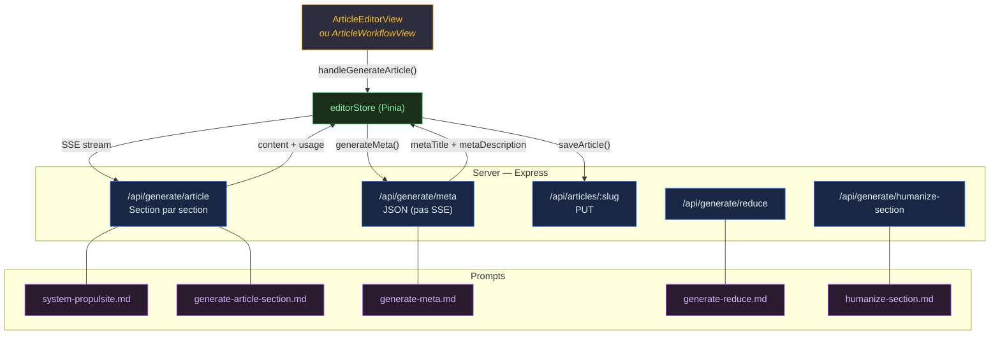
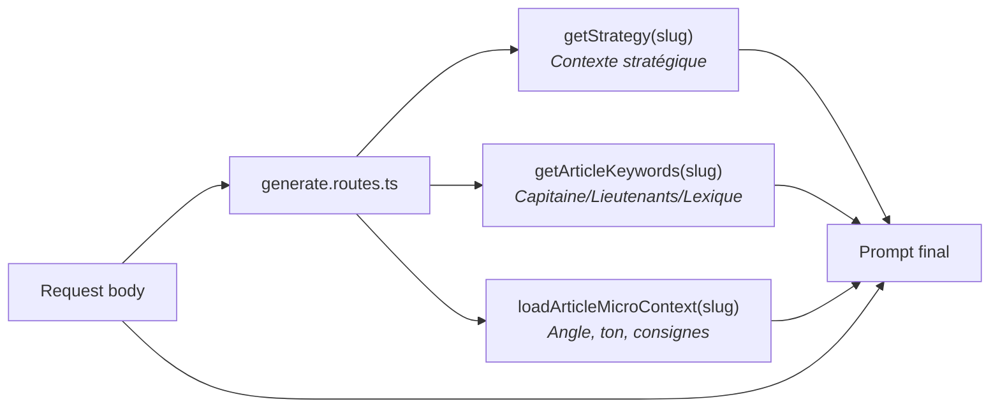
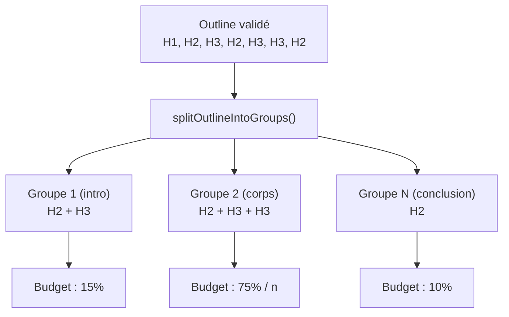
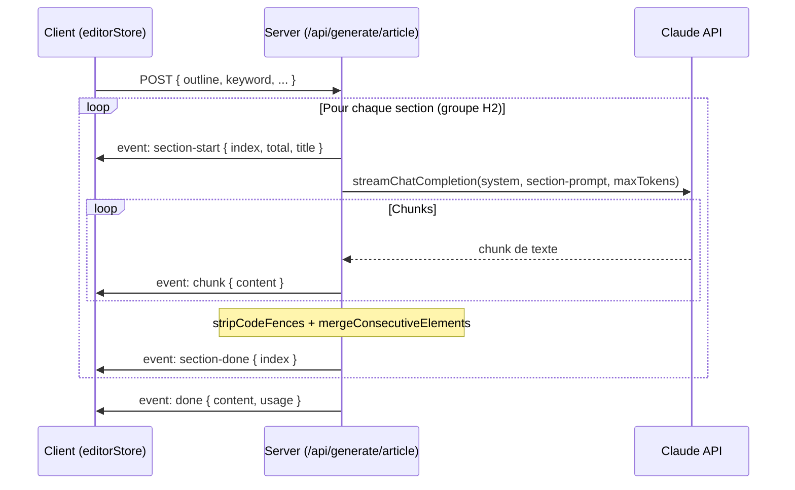
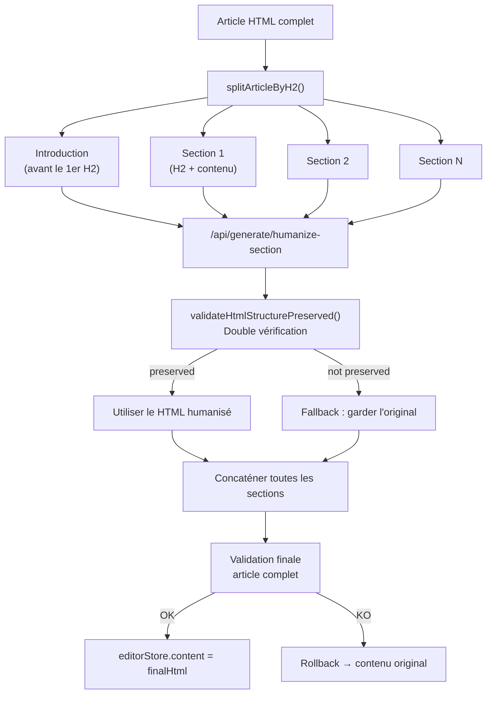
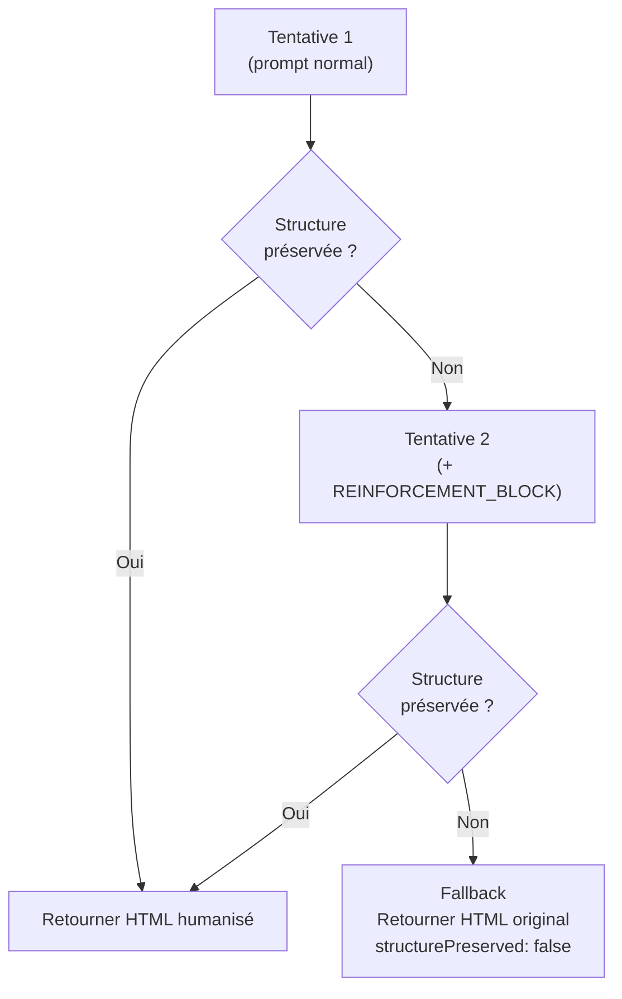
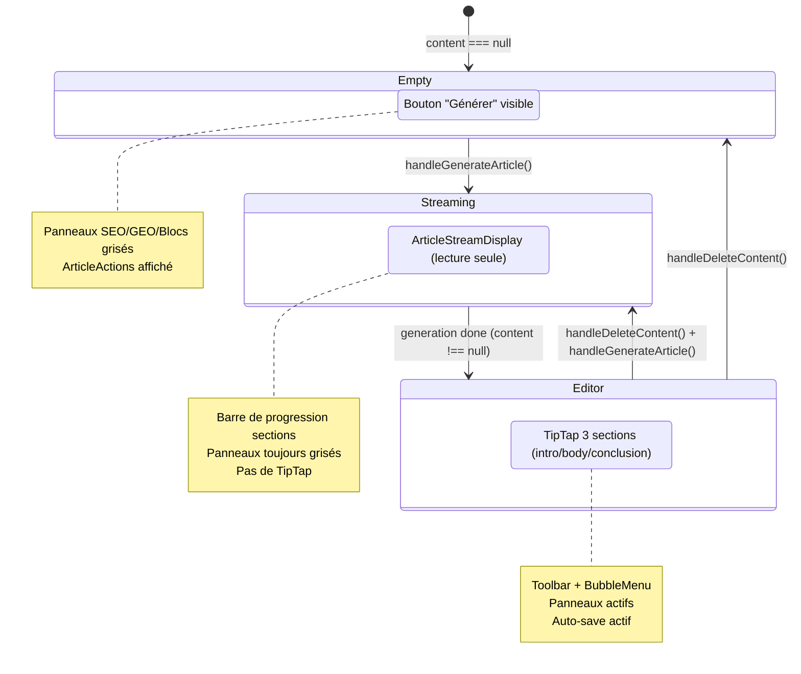
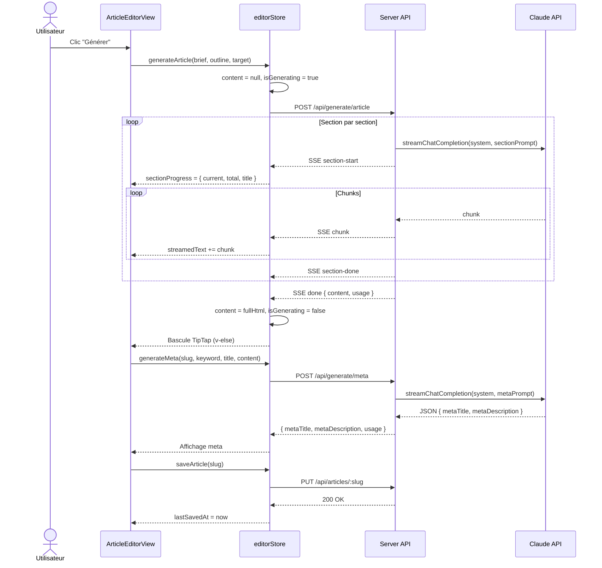

# Workflow de Génération de Contenu Article

> Documentation technique complète du pipeline de génération, réduction et humanisation des articles.

---

## 1. Vue d'ensemble



---

## 2. Pipeline principal : Génération d'article

### 2.1 Déclenchement

Le bouton "Générer" est disponible dans **ArticleEditorView** (quand `content === null && !isGenerating`) ou **ArticleWorkflowView** (étape 2).

L'appel côté client :

```
handleGenerateArticle()
  → editorStore.generateArticle(briefData, outline, targetWordCount?)
  → editorStore.generateMeta(slug, keyword, title, content)
  → editorStore.saveArticle(slug)
```

### 2.2 Inputs du endpoint `/api/generate/article`

| Input | Source | Description |
|---|---|---|
| `slug` | `briefStore.briefData.article.slug` | Identifiant unique de l'article |
| `outline` | `outlineStore.outline` (JSON stringifié) | Sommaire validé (H1/H2/H3 + annotations) |
| `keyword` | Premier keyword `type === 'Pilier'` | Mot-clé principal |
| `keywords` | `briefStore.briefData.keywords[].keyword` | Tous les mots-clés |
| `paa` | `briefStore.briefData.dataForSeo.paa` | Questions PAA (People Also Ask) |
| `articleType` | `'Pilier' \| 'Intermédiaire' \| 'Spécialisé'` | Type d'article |
| `articleTitle` | `briefStore.briefData.article.title` | Titre H1 de l'article |
| `cocoonName` | `briefStore.briefData.article.cocoonName` | Nom du cocon sémantique |
| `topic` | `briefStore.briefData.article.topic` | Thème de l'article |
| `targetWordCount` | `briefData.contentLengthRecommendation` | Nombre de mots cible (optionnel) |

### 2.3 Données enrichies côté serveur

Le serveur charge automatiquement des contextes supplémentaires depuis la BDD :



| Donnée enrichie | Fonction | Contenu injecté dans le prompt |
|---|---|---|
| **Strategy** | `getStrategy(slug)` | Cible, douleur, angle, promesse, CTA |
| **Keywords** | `getArticleKeywords(slug)` | Capitaine (H1), Lieutenants (H2/H3), Lexique (corps) |
| **Micro-context** | `loadArticleMicroContext(slug)` | Angle éditorial, ton, consignes spécifiques |

### 2.4 Découpage en sections (section-by-section)

L'outline est découpé en **groupes** : chaque H2 + ses H3 enfants = 1 groupe.



#### Répartition du budget de mots

| Position | % du budget total | Exemple (2500 mots) |
|---|---|---|
| Introduction (1er groupe) | 15% | ~375 mots |
| Corps (chaque groupe intermédiaire) | 75% / n groupes | ~375 mots (si 5 groupes milieu) |
| Conclusion (dernier groupe) | 10% | ~250 mots |

**Cas spéciaux :**
- 1 seul groupe → 100% du budget
- 2 groupes → 40% / 60%

#### Résolution du `targetWordCount`

Ordre de priorité (premier non-null gagne) :

```
client body.targetWordCount
  → microCtx.targetWordCount
    → DEFAULT_TARGET_WORDS_BY_TYPE[articleType]
      → 2000 (fallback)
```

Valeurs par défaut par type : Pilier = 2500, Intermédiaire = 1800, Spécialisé = 1200.

### 2.5 Prompts utilisés

Chaque section est générée avec :

| Prompt | Rôle |
|---|---|
| **`system-propulsite.md`** | Prompt système : persona de rédacteur SEO expert |
| **`generate-article-section.md`** | Prompt utilisateur : instructions par section |

#### Variables injectées dans `generate-article-section.md`

| Variable | Description |
|---|---|
| `{{articleTitle}}` | Titre H1 |
| `{{articleType}}` | Type d'article |
| `{{keyword}}` | Mot-clé pilier |
| `{{secondaryKeywords}}` | Mots-clés secondaires (virgule-séparés) |
| `{{cocoonName}}` | Nom du cocon |
| `{{fullOutline}}` | Sommaire complet (pour que Claude connaisse le plan global) |
| `{{sectionOutline}}` | Outline de la section en cours (H2 + H3 avec annotations) |
| `{{sectionPosition}}` | `intro` / `middle` / `conclusion` |
| `{{previousContext}}` | Derniers 500 caractères déjà générés (texte brut, sans HTML) |
| `{{positionDirectives}}` | Directives spécifiques intro/conclusion |
| `{{wordCountBudget}}` | Budget total en mots |
| `{{sectionRole}}` | `introduction` / `corps` / `conclusion` |
| `{{sectionBudgetHint}}` | Ex : "~375 mots, soit ~15% du budget total" |
| `{{strategyContext}}` | Bloc markdown avec cible, douleur, angle, promesse, CTA |
| `{{keywordContext}}` | Bloc markdown Capitaine/Lieutenants/Lexique |
| `{{microContext}}` | Bloc markdown angle, ton, consignes |

### 2.6 Événements SSE (Server-Sent Events)



| Événement | Payload | Quand |
|---|---|---|
| `section-start` | `{ index, total, title }` | Début de chaque section |
| `chunk` | `{ content }` | Chaque fragment de texte streamé |
| `section-done` | `{ index }` | Fin d'une section |
| `done` | `{ content, usage }` | Fin complète (HTML concaténé + usage agrégé) |
| `error` | `{ code, message }` | Erreur fatale |

### 2.7 Post-traitement côté serveur

Chaque section passe par :
1. `stripCodeFences()` — supprime les ` ```html ``` ` que Claude ajoute parfois
2. `mergeConsecutiveElements()` — fusionne les éléments HTML consécutifs identiques

### 2.8 Output final

| Output | Destination | Description |
|---|---|---|
| `content` | `editorStore.content` | HTML complet de l'article |
| `streamedText` | `editorStore.streamedText` | Texte accumulé pendant le streaming (affichage temps réel) |
| `usage` | `editorStore.lastArticleUsage` | Tokens input/output + coût estimé |

---

## 3. Pipeline Meta : Titre et Description SEO

### 3.1 Déclenchement

Appelé automatiquement après la génération réussie de l'article.

### 3.2 Endpoint : `/api/generate/meta` (POST, JSON — pas SSE)

#### Inputs

| Input | Source |
|---|---|
| `slug` | Slug de l'article |
| `keyword` | Mot-clé pilier |
| `articleTitle` | Titre H1 |
| `articleContent` | HTML complet de l'article |

#### Prompt

| Prompt | Rôle |
|---|---|
| `system-propulsite.md` | Prompt système |
| `generate-meta.md` | Instructions pour générer title + description |

#### Output

```json
{
  "metaTitle": "Titre SEO (max 60 chars)",
  "metaDescription": "Description SEO (max 160 chars)",
  "usage": { "inputTokens": ..., "outputTokens": ..., "estimatedCost": ... }
}
```

Le serveur applique un **truncate intelligent** : coupe au dernier mot avant la limite, ajoute `...` pour la description.

---

## 4. Pipeline Réduction

### 4.1 Objectif

Réduire le nombre de mots de l'article pour approcher un `targetWordCount`, sans altérer la structure HTML.

### 4.2 Endpoint : `/api/generate/reduce` (POST, SSE)

#### Inputs

| Input | Source |
|---|---|
| `slug` | Slug de l'article |
| `articleHtml` | HTML complet actuel |
| `targetWordCount` | Cible en mots |
| `currentWordCount` | Nombre de mots actuel |
| `keyword` | Mot-clé pilier |
| `keywords` | Tous les mots-clés |

#### Prompt

| Prompt | Rôle |
|---|---|
| `system-propulsite.md` | Prompt système |
| `generate-reduce.md` | Instructions de réduction |

**Protection** : `articleHtml` est échappé via `escapeKeys` pour éviter l'injection de prompt (G3).

#### Comportement

- **Pas de streaming partiel** : le HTML complet est envoyé d'un coup dans `event: done`
- **Pas de retry** : l'utilisateur peut relancer manuellement
- **Rollback** : en cas d'erreur, `content` est restauré à sa valeur d'avant

#### Output

```
event: done → { html, usage }
```

---

## 5. Pipeline Humanisation

### 5.1 Objectif

Réécrire l'article section par section pour supprimer les marqueurs IA (patterns détectables comme "dans le monde d'aujourd'hui", "il est important de noter que"...) tout en **préservant strictement la structure HTML**.

### 5.2 Architecture section par section



### 5.3 Endpoint : `/api/generate/humanize-section` (POST, SSE)

#### Inputs

| Input | Source |
|---|---|
| `slug` | Slug de l'article |
| `sectionHtml` | HTML de la section à humaniser |
| `sectionIndex` | Index de la section |
| `sectionTitle` | Titre de la section |
| `keyword` | Mot-clé pilier |
| `keywords` | Tous les mots-clés |

#### Prompt

| Prompt | Rôle |
|---|---|
| `system-propulsite.md` | Prompt système |
| `humanize-section.md` | Instructions d'humanisation + HTML à réécrire |

**Protection** : `sectionHtml` échappé via `escapeKeys` (G3).

#### Retry + Fallback



Le `REINFORCEMENT_BLOCK` ajoute des instructions strictes :
> "Tu as altéré la structure HTML à la tentative précédente. Reprends en préservant EXACTEMENT les mêmes balises..."

#### Output

```json
{
  "html": "<section humanisée>",
  "usage": { "inputTokens": ..., "outputTokens": ..., "estimatedCost": ... },
  "structurePreserved": true,
  "fallback": false,
  "sectionIndex": 2
}
```

### 5.4 Double validation côté client

1. **Par section** : `validateHtmlStructurePreserved(original, humanized)` — si échoue, on garde l'original
2. **Article complet** : après concaténation de toutes les sections, validation globale — si échoue, rollback total

### 5.5 Annulation

L'utilisateur peut annuler l'humanisation en cours via `abortHumanize()` qui déclenche `AbortController.abort()`. En cas d'abort, le contenu est rollbacké à `originalContent`.

---

## 6. Suppression de contenu

### 6.1 Comportement

Le bouton "Supprimer le contenu" (dans ArticleEditorView) :
1. Affiche un `confirm()` de confirmation
2. Réinitialise `editorStore` via `$patch` : `content = null`, `metaTitle = null`, `metaDescription = null`, `isDirty = false`
3. L'UI bascule sur l'état "empty" (bouton Générer visible)
4. Le `briefStore` et `outlineStore` sont **préservés** → l'utilisateur peut re-générer immédiatement

---

## 7. États de l'UI dans ArticleEditorView



### Garde des panneaux latéraux

| Panneau | Condition d'activation |
|---|---|
| SEO | `hasBody === true` (content non null) |
| GEO | `hasBody === true` |
| Maillage | `hasBody === true` |
| Blocs dynamiques | `hasBody === true` (panneau par défaut) |

---

## 8. Flux de données complet (séquence)



---

## 9. Fichiers clés

| Fichier | Rôle |
|---|---|
| `src/views/ArticleEditorView.vue` | Vue principale, 3 états UI, handlers |
| `src/views/ArticleWorkflowView.vue` | Vue workflow (étape 2), mêmes handlers |
| `src/stores/editor.store.ts` | Store Pinia — état article, actions de génération |
| `src/composables/useStreaming.ts` | Composable SSE client |
| `src/components/article/ArticleActions.vue` | Boutons Générer/Réduire/Humaniser |
| `src/components/article/ArticleStreamDisplay.vue` | Affichage streaming lecture seule |
| `src/components/editor/ArticleEditor.vue` | TipTap 3 sections (intro/body/conclusion) |
| `server/routes/generate.routes.ts` | Tous les endpoints de génération |
| `server/prompts/system-propulsite.md` | Prompt système (persona rédacteur SEO) |
| `server/prompts/generate-article-section.md` | Prompt par section d'article |
| `server/prompts/generate-meta.md` | Prompt meta title + description |
| `server/prompts/generate-reduce.md` | Prompt réduction word count |
| `server/prompts/humanize-section.md` | Prompt humanisation (suppression marqueurs IA) |
| `shared/html-utils.ts` | Utilitaires HTML (merge, validate, split) |
